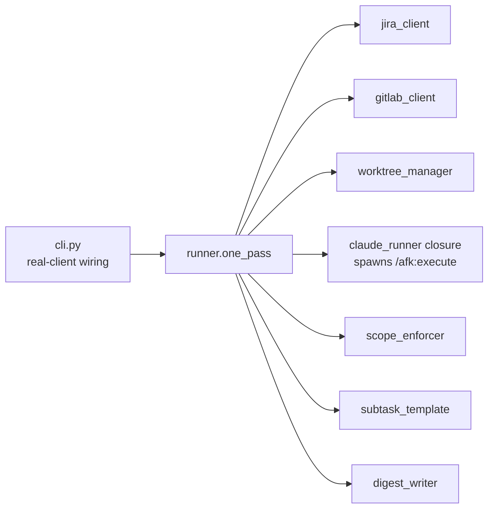

# CLAUDE.md

This file provides guidance to Claude Code (claude.ai/code) when working with code in this repository.

## What this repo is

`afk-driver` is the orchestrator for Matt Pocock's AFK ("async-from-keyboard") workflow adapted to Nakisa's Jira + GitLab + Maven monorepo. It drains `afk-agents`-labelled Jira tickets: per parent Enhancement it creates a git worktree, opens a Draft MR, advances Jira state through `Dev-Pending → Dev-Designing → Dev-Developing → Dev-CR/Merge`, spawns one fresh `claude --print` session per SubTask invoking the `/afk:execute` skill, then writes a morning digest. A small ticket without SubTasks (Enhancement or Bug) carrying the `afk-agents` label is also picked up — the driver collapses parent + per-subtask flow onto the single ticket (one MR, one claude spawn, one lifecycle pass). Design rationale: `PRD.md` (Jira: P2P-1220).

The driver itself is a Python package; the *work* it drives is Java/Maven inside a sibling monorepo. This repo only contains the driver.

## Common commands

```powershell
# install editable (run from this repo root, or substitute the worktree path)
pip install -e .

# full test suite (197 tests; runner + unit suites in-memory, ~0.2s
# each; scenario + smoke suites are slower — single test files run fast)
python -m pytest -v

# single test file / single test
python -m pytest tests/test_runner.py -v
python -m pytest tests/test_runner.py::test_one_pass_happy -v

# one drain pass against real Jira/GitLab (see SMOKE.md for end-to-end)
python -m afk_driver --label afk-agents --project P2P --digest-out auto
```

Required env to actually drive (not for tests): `JIRA_BASE_URL`, `JIRA_EMAIL`, `JIRA_API_TOKEN`, `GITLAB_TOKEN`. Tests do not touch network.

## Architecture — the seam that matters

**All I/O is dependency-injected into `Runner`.** The seam lives at `cli.py`: it constructs real `JiraClient`, `GitLabClient`, `_WorktreeAdapter`, and a `_make_claude_runner` closure that shells out to `claude --print --dangerously-skip-permissions "/afk:execute SUBKEY"`, then hands them to `Runner(...)`. Everything else is pure orchestration over interfaces, so the 12 runner integration tests run against in-memory fakes in <0.2s.

When adding a new external interaction, add it as a parameter on `Runner` and a fake in the test module — do not import a real client inside `runner.py`.



### Module responsibilities

| Module | Pure? | Notes |
|---|---|---|
| `runner.py` | yes (over injected I/O) | `Runner.one_pass()` is the orchestrator; `preflight()` validates env. Two flows: `_process_parent` (parent + labelled SubTasks) and `_process_standalone` (one labelled non-subtask, no children — collapsed lifecycle, no checklist, no impl-notes splice). Outcomes are `success / test_fail / build_fail / timeout / design_conflict / contract_mismatch / produces_drift / other`. Retries on `test_fail`/`build_fail` up to `retry_count`. `design_conflict` skips retry and emits an `/afk:architect-grill`-pointing comment. `contract_mismatch` skips retry, comments on both the consumer (which raised it) and the producer SubTask (carried via `ClaudeOutcome.producer_key`). `produces_drift` (cited-mode producer self-preflight failure: SubTask declared `## Produces` X but its own grep cannot find X) skips retry and posts a single "producer self-check failed" comment routing the human to fix the impl OR re-emit the slice — symmetric to `contract_mismatch` but consumer == producer == this SubTask. |
| `subtask_template.py` | yes | Lossless round-trip for the SubTask Markdown contract (`## Goal / Scope / Acceptance / Test command / Parent PRD / Blocked by / Implementation Notes`, plus cited-mode `## Design refs / Produces / Parent SDD / Consumes / Conflict procedure`). |
| `scope_enforcer.py` | yes | `enforce(diff, scope_globs, forbidden, home_module, marker) → [Violation]`. Catches out-of-scope edits, forbidden patterns (`UpgradeGroup*.java`, `db/changelog/**`, `PreDbMigration*`), and cross-module edits without a JIRA-prefixed marker comment. |
| `config.py` | yes | `DriverConfig` dataclass + `~/.afk-driver/config.toml` override. |
| `worktree_manager.py` | side-effecting (git) | Per-Enhancement worktree under `~/.afk-driver/worktrees/{ENH-ID}/`. Branch `mvu/afk/{enh_id_lower}`. |
| `jira_client.py` | side-effecting (HTTP) | Note `update_implementation_notes` is an idempotent splice into the `## Implementation Notes (auto-maintained)` section — preserves human-edited prose around it. |
| `gitlab_client.py` | side-effecting (subprocess to `glab`) | MR description checklist is bracketed by `<!-- afk:subtasks:start/end -->` to preserve human edits outside the block. |
| `digest_writer.py` | yes | Emits `RunRecord` as L4 morning Markdown to `~/.afk-driver/digests/{YYYY-MM-DD}.md`. |
| `cli.py` | side-effecting | Only place real clients are constructed. |

### Standalone tickets (label on a non-subtask)

A small Enhancement or Bug labelled `afk-agents` with no labelled SubTasks under it is driven directly: one Draft MR, one `claude --print` invocation on the ticket key itself, lifecycle transitions on that key. Because `/afk:execute` reads the SubTask Markdown contract (`## Goal / Scope / Acceptance / Test command / Parent PRD / Blocked by / Implementation Notes`, plus the cited-mode sections `## Design refs / Produces / Parent SDD / Consumes / Conflict procedure` when applicable), a standalone ticket's description **must be authored in that shape** for the skill to find work — the driver does not synthesise it. **Cited-mode contract enforcement applies equally to standalones**: `/afk:execute` Step 2 consumer preflight and Step 10 producer self-preflight both run regardless of whether the ticket is a SubTask under a parent or a standalone. A `contract_mismatch` from a standalone names a producer ticket that may live outside this drain pass — the runner still posts the producer-side comment so the human knows where the break lives. If a labelled non-subtask also has labelled SubTasks under it, the SubTask flow wins and the standalone path is skipped.

### Section ownership invariants (don't violate)

- **Parent Enhancement description**: `## PRD` is owned by the `/afk:to-prd` skill. `## SDD` (when present) is owned by the `/afk:to-sdd` skill. `## Design Brief` (when present) is owned by the `/afk:to-design-brief` skill. `## Implementation Notes (auto-maintained)` is owned by this driver (`update_implementation_notes`). Other prose belongs to the human.
- **MR description**: the `<!-- afk:subtasks:start --> ... <!-- afk:subtasks:end -->` block is auto-maintained; everything outside is preserved verbatim.
- **SubTask description**: parsed by `subtask_template.py`; the parser must round-trip losslessly. If you add a section, update both parser and emitter together.

## Conventions to keep

- **No real I/O in tests.** Runner tests use in-memory fakes; `worktree_manager` tests use real temp git repos; `jira_client`/`gitlab_client` tests use HTTP/subprocess fakes. Don't introduce network or `~/.afk-driver/` writes from tests.
- **Outcome enum is the contract** between the spawned Claude session and the runner. The `/afk:execute` skill emits a `<<<AFK_OUTCOME>>>{json}<<<END>>>` marker block as the last thing in its log (see `skills/execute/SKILL.md` Step 13 in this repo); `cli._parse_outcome_marker` regex-scans the log for the LAST occurrence and returns a `ClaudeOutcome` (status, detail, producer_key). Without the marker the runner reports `other` with `no AFK_OUTCOME marker emitted (...)` so the loss is audible — silence used to demote nonzero exits to `other` and zero exits to `success`, silently masking every structured failure status. If you broaden the status set, update `_VALID_OUTCOME_STATUSES` in `cli.py` AND `ClaudeStatus` in `runner.py` AND Step 13 of the skill in lockstep.
- **Branch names** must match GitLab regex `^[a-z0-9][a-z0-9/\-\.]*$` — the `mvu/afk/{enh_id_lower}` pattern in `worktree_manager` is load-bearing.
- **Failure paths are unit-tested only** (per README). Treat `test_fail`/`build_fail`/`timeout`/rebase-conflict logic as unproven in production; preserve current behavior unless you also exercise it via SMOKE.md.

## Skills this driver depends on

The skills ship **in this repo** as the `afk` Claude Code plugin
(`.claude-plugin/plugin.json` + `.claude-plugin/marketplace.json` +
`skills/<name>/SKILL.md`). Install once via `/plugin marketplace add <repo>`
+ `/plugin install afk@afk-marketplace`, then persist via
`enabledPlugins` in `~/.claude/settings.json`. After editing any
`SKILL.md`, run `/reload-plugins` to pick up changes without restarting.

The 9 skills shipped:

- **Orientation**: `/afk:start` (pipeline map + entry-point router).
- **Mandatory chain**: `/afk:to-prd` → `/afk:to-subtasks` → `/afk:execute`. The runner spawns `/afk:execute` per SubTask.
- **Optional design layer**: `/afk:grill-requirements` (raw-idea grilling; maintains `GLOSSARY.md` only — no decision records) → `/afk:to-prd` (PRD + requirement ADRs under `.../adr/requirements/`) → `/afk:architect-grill` (top-down L1→L8 interview) → `/afk:to-sdd` (writes `SDD.md` + per-decision design ADRs under `.../adr/design/` sibling to the PRD; owns the `## SDD` section of the parent Enhancement description) → `/afk:to-design-brief` (optional digest: synthesizes PRD + SDD + ADRs into a 1-2 page `DESIGN-BRIEF.md` for stakeholder review and pre-SDD reading; owns the `## Design Brief` section). Recommended for new complex features; skip for small bugs / refactors / tooling.
- **Tooling**: `/afk:tdd` (red-green-refactor doctrine, invoked from `/afk:execute` Step 5).

`/afk:to-subtasks` slices in **cited mode** when an SDD is present (each SubTask references binding SDD sections + ADRs and carries a Conflict procedure block) and in **uncited mode** otherwise (PRD-only; human-gated per ticket).

If you change the SubTask Markdown contract, `skills/execute/SKILL.md`, `skills/subtasks/SKILL.md`, and `subtask_template.py` here must all change in lockstep — they live in the same repo specifically so this lockstep is enforced by a single commit.

**Cited-mode contract (wired 2026-05-08, extended with typed contracts 2026-05-08, producer self-preflight + anchor-quality slicing checks 2026-05-08)**: `/afk:to-subtasks` cited mode emits `## Design refs`, `## Produces`, `## Consumes` (when `Blocked by` is non-empty), `## Parent SDD`, and `## Conflict procedure` in addition to the legacy 7 sections. `subtask_template.py` parses all five losslessly (round-trip tested).

The contract is enforced at three checkpoints — drift is impossible to ship without surfacing somewhere:

1. **Slicing time (`/afk:to-subtasks` Step 7).** Two passes:
   - **Graph validation** — every `## Consumes` line resolves to a `## Produces` bullet on a SubTask earlier in rank order. Forward refs / orphan consumers / multi-producer collisions all bounce.
   - **Anchor quality** — every `## Produces` `{grep-anchor}` is checked against (a) a forbidden-generic-token list (`class`, `interface`, `void`, `function`, `def`, `method`, `struct`, `enum`, `type`, `record`); (b) length ≥12 chars; (c) trial `ctx_search` against `{file}` at HEAD must return ≤1 match. Ambiguous anchors that would fail-open at runtime are rejected at declaration time.
2. **Consumer preflight (`/afk:execute` Step 2).** Reads `design_refs` and `parent_sdd` to load binding SDD/ADR context. Then for each `## Consumes` line `{PRODUCER-KEY} {file}#{grep-anchor}`, reads `{file}` and greps for `{grep-anchor}`. A miss exits `contract_mismatch` carrying `producer_key` (no retry; runner comments on both consumer and producer). Binding-decision break exits `design_conflict` (no retry; routes to `/afk:architect-grill`).
3. **Producer self-preflight (`/afk:execute` Step 10).** Right before declaring `success`, the SubTask greps each of its own `## Produces` anchors on the branch. A miss exits `produces_drift` (no retry; runner posts a "producer self-check failed" comment routing the human to fix the impl OR re-emit the slice). Without this step, signature drift would surface only at the next consumer's preflight — wasting a drain pass on the wrong ticket.

`## Produces` is mandatory on every cited SubTask, even leaves with no consumer — it doubles as the reviewer's cheat-sheet, the producer-self-preflight grep target, AND the next SubTask's consumer-preflight grep target. Cited and uncited SubTasks both round-trip end-to-end.

### Skill ↔ runner ownership split (don't break)

The `Dev-CR/Merge` transition is **runner-only**. The skill drives in-flight transitions (`Dev-Designing`, `Dev-Developing`), TDD, commits, push, MR checklist, and parent Implementation Notes — then exits with a `ClaudeOutcome`. The runner fires `Request CR & Merge` + gate fields only when that outcome is `success`. If the skill *also* fires `Request CR & Merge` from inside the session, the runner's follow-up call fails (SubTask has already left `Dev-Developing`) — this is the bug fixed when the skill's CR/Merge step was removed. Preserve the split when editing either side.

## Reference

- `PRD.md` — design rationale, AFK adaptation for Nakisa core-services
- `SMOKE.md` — end-to-end manual smoke runbook
- Parent ticket: P2P-1220 (Jira)
