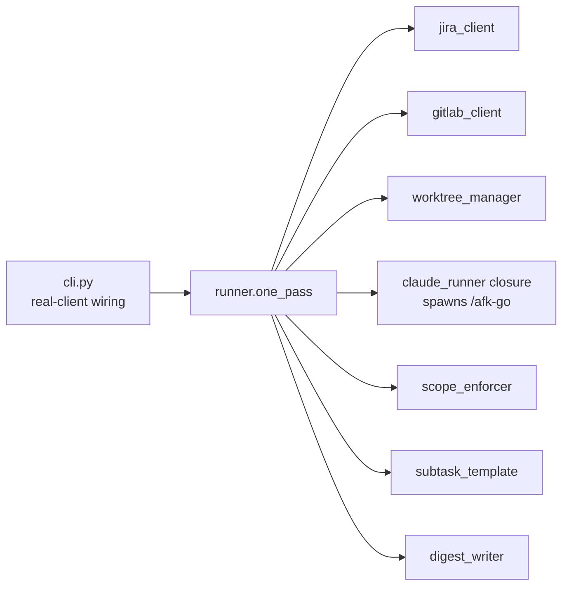

# CLAUDE.md

This file provides guidance to Claude Code (claude.ai/code) when working with code in this repository.

## What this repo is

`afk-driver` is the orchestrator for Matt Pocock's AFK ("async-from-keyboard") workflow adapted to Nakisa's Jira + GitLab + Maven monorepo. It drains `afk-agents`-labelled Jira tickets: per parent Enhancement it creates a git worktree, opens a Draft MR, advances Jira state through `Dev-Pending → Dev-Designing → Dev-Developing → Dev-CR/Merge`, spawns one fresh `claude --print` session per SubTask invoking the `/afk-go` skill, then writes a morning digest. A small ticket without SubTasks (Enhancement or Bug) carrying the `afk-agents` label is also picked up — the driver collapses parent + per-subtask flow onto the single ticket (one MR, one claude spawn, one lifecycle pass). Design rationale: `PRD.md` (Jira: P2P-1220).

The driver itself is a Python package; the *work* it drives is Java/Maven inside a sibling monorepo. This repo only contains the driver.

## Common commands

```powershell
# install editable (run from this repo root, or substitute the worktree path)
pip install -e .

# full test suite (89 tests, in-memory fakes, <1s)
python -m pytest -v

# single test file / single test
python -m pytest tests/test_runner.py -v
python -m pytest tests/test_runner.py::test_one_pass_happy -v

# one drain pass against real Jira/GitLab (see SMOKE.md for end-to-end)
python -m afk_driver --label afk-agents --project P2P --digest-out auto
```

Required env to actually drive (not for tests): `JIRA_BASE_URL`, `JIRA_EMAIL`, `JIRA_API_TOKEN`, `GITLAB_TOKEN`. Tests do not touch network.

## Architecture — the seam that matters

**All I/O is dependency-injected into `Runner`.** The seam lives at `cli.py`: it constructs real `JiraClient`, `GitLabClient`, `_WorktreeAdapter`, and a `_make_claude_runner` closure that shells out to `claude --print --dangerously-skip-permissions "/afk-go SUBKEY"`, then hands them to `Runner(...)`. Everything else is pure orchestration over interfaces, so the 12 runner integration tests run against in-memory fakes in <0.2s.

When adding a new external interaction, add it as a parameter on `Runner` and a fake in the test module — do not import a real client inside `runner.py`.



### Module responsibilities

| Module | Pure? | Notes |
|---|---|---|
| `runner.py` | yes (over injected I/O) | `Runner.one_pass()` is the orchestrator; `preflight()` validates env. Two flows: `_process_parent` (parent + labelled SubTasks) and `_process_standalone` (one labelled non-subtask, no children — collapsed lifecycle, no checklist, no impl-notes splice). Outcomes are `success / test_fail / build_fail / timeout / other`. Retries on `test_fail`/`build_fail` up to `retry_count`. |
| `subtask_template.py` | yes | Lossless round-trip for the SubTask Markdown contract (`## Goal / Scope / Acceptance / Test command / Parent PRD / Blocked by / Implementation Notes`). |
| `scope_enforcer.py` | yes | `enforce(diff, scope_globs, forbidden, home_module, marker) → [Violation]`. Catches out-of-scope edits, forbidden patterns (`UpgradeGroup*.java`, `db/changelog/**`, `PreDbMigration*`), and cross-module edits without a JIRA-prefixed marker comment. |
| `config.py` | yes | `DriverConfig` dataclass + `~/.afk-driver/config.toml` override. |
| `worktree_manager.py` | side-effecting (git) | Per-Enhancement worktree under `~/.afk-driver/worktrees/{ENH-ID}/`. Branch `mvu/afk/{enh_id_lower}`. |
| `jira_client.py` | side-effecting (HTTP) | Note `update_implementation_notes` is an idempotent splice into the `## Implementation Notes (auto-maintained)` section — preserves human-edited prose around it. |
| `gitlab_client.py` | side-effecting (subprocess to `glab`) | MR description checklist is bracketed by `<!-- afk:subtasks:start/end -->` to preserve human edits outside the block. |
| `digest_writer.py` | yes | Emits `RunRecord` as L4 morning Markdown to `~/.afk-driver/digests/{YYYY-MM-DD}.md`. |
| `cli.py` | side-effecting | Only place real clients are constructed. |

### Standalone tickets (label on a non-subtask)

A small Enhancement or Bug labelled `afk-agents` with no labelled SubTasks under it is driven directly: one Draft MR, one `claude --print` invocation on the ticket key itself, lifecycle transitions on that key. Because `/afk-go` reads the SubTask Markdown contract (`## Goal / Scope / Acceptance / Test command / Parent PRD / Blocked by / Implementation Notes`), a standalone ticket's description **must be authored in that shape** for the skill to find work — the driver does not synthesise it. If a labelled non-subtask also has labelled SubTasks under it, the SubTask flow wins and the standalone path is skipped.

### Section ownership invariants (don't violate)

- **Parent Enhancement description**: `## PRD` is owned by the `/to-prd` skill. `## Implementation Notes (auto-maintained)` is owned by this driver (`update_implementation_notes`). Other prose belongs to the human.
- **MR description**: the `<!-- afk:subtasks:start --> ... <!-- afk:subtasks:end -->` block is auto-maintained; everything outside is preserved verbatim.
- **SubTask description**: parsed by `subtask_template.py`; the parser must round-trip losslessly. If you add a section, update both parser and emitter together.

## Conventions to keep

- **No real I/O in tests.** Runner tests use in-memory fakes; `worktree_manager` tests use real temp git repos; `jira_client`/`gitlab_client` tests use HTTP/subprocess fakes. Don't introduce network or `~/.afk-driver/` writes from tests.
- **Outcome enum is the contract** between the spawned Claude session and the runner. The `/afk-go` skill prints a structured outcome the runner parses; do not silently broaden it.
- **Branch names** must match GitLab regex `^[a-z0-9][a-z0-9/\-\.]*$` — the `mvu/afk/{enh_id_lower}` pattern in `worktree_manager` is load-bearing.
- **Failure paths are unit-tested only** (per README). Treat `test_fail`/`build_fail`/`timeout`/rebase-conflict logic as unproven in production; preserve current behavior unless you also exercise it via SMOKE.md.

## Skills this driver depends on

Live at `~/.claude/skills/` (not in this repo): `/to-prd`, `/prd-to-subtasks`, `/afk-go`. The runner spawns `/afk-go` per SubTask. If you change the SubTask Markdown contract, the `/afk-go` and `/prd-to-subtasks` skills must change in lockstep.

## Reference

- `PRD.md` — design rationale, AFK adaptation for Nakisa core-services
- `SMOKE.md` — end-to-end manual smoke runbook
- Parent ticket: P2P-1220 (Jira)
