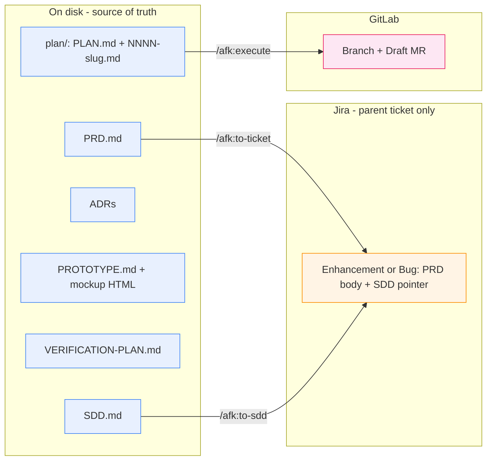
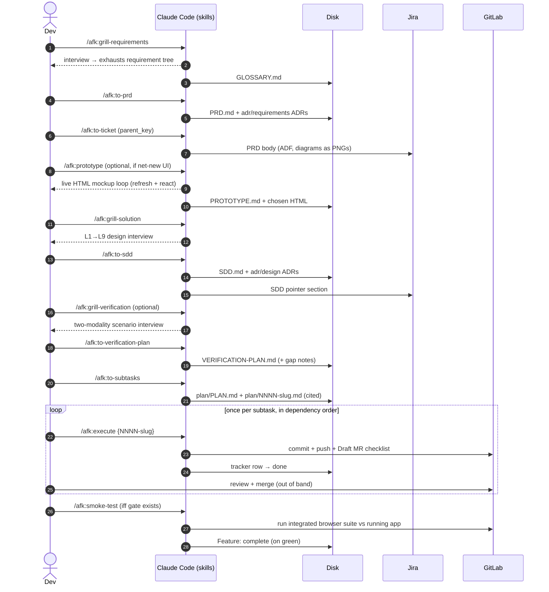
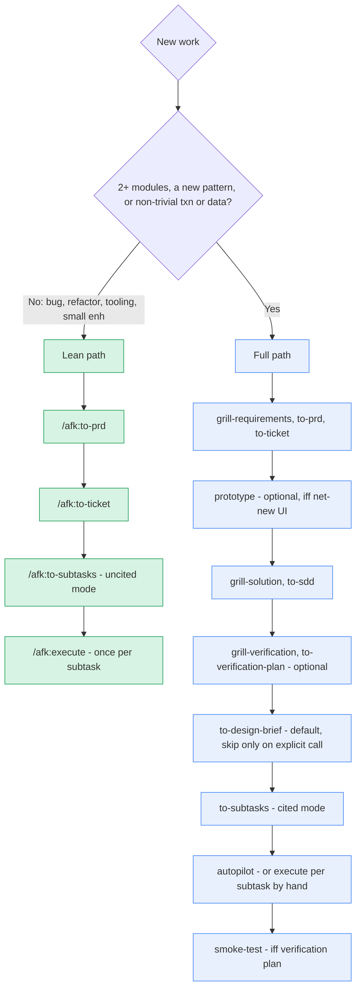
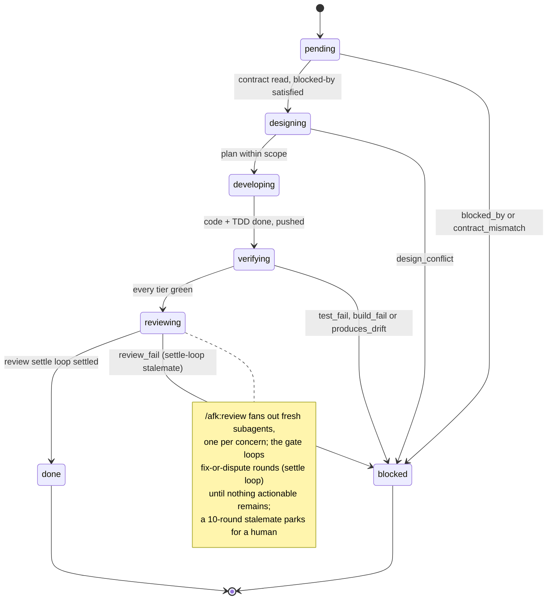
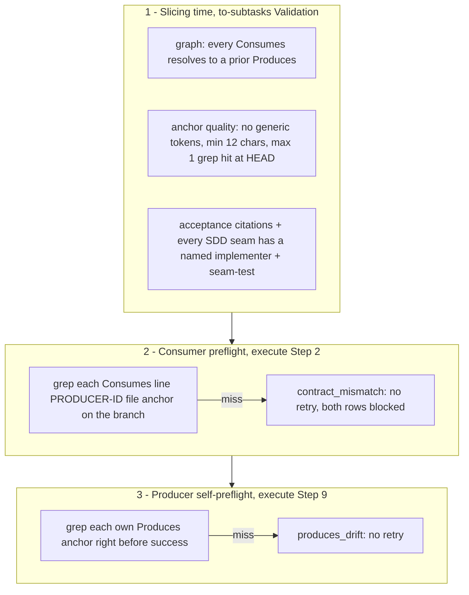

# afk — the away-from-keyboard workflow

Claude Code **plugin** that turns a raw feature idea into shipped, verified
code through a chain of skills — **human-heavy at the edges, autonomous in the
middle**. Drive the design stages interactively; the implementation middle runs
hands-off via `/afk:autopilot` (or by hand, one `/afk:execute` per subtask).
Each stage leaves a durable artifact on disk, so the next stage (and next human)
inherits a written contract, not a verbal hand-off.

> **New here? Read top to bottom once.** Explains *why* the workflow is shaped
> this way, the concepts to hold in your head, then walks one feature end to end.
> Per-skill catalog + install snippet are further down as reference.

**Credit & inspiration.** Directly inspired by and built upon
[Matt Pocock's AFK Claude Code workflow and skills](https://github.com/mattpocock/skills).
The original idea, the AFK framing, and several skill patterns come from his work
— adapted and extended for a specific environment. Read the upstream source first.

Adapted for the Nakisa **Jira + GitLab + Maven** environment on Windows. The
*work* the chain drives is Java/Maven inside a sibling core-services checkout;
**this repo contains only the skills** (the AFK chain under
`skills/afk/<name>/SKILL.md`, plus standalone utility skills under
`skills/utils/<name>/SKILL.md`) and the plugin manifests.

---

## Table of contents

1. [Why AFK](#1-why-afk) — the problem it solves
2. [The mental model](#2-the-mental-model) — five ideas to internalize
3. [The chain at a glance](#3-the-chain-at-a-glance) — the map
4. [Install](#4-install) — one-time setup
5. [Walkthrough: your first feature](#5-walkthrough-your-first-feature) — end to end
6. [Choosing your path](#6-choosing-your-path) — full chain vs. the lean path
7. [Where everything lives](#7-where-everything-lives) — the artifact map
8. [The subtask lifecycle](#8-the-subtask-lifecycle) — how `/afk:execute` works
9. [The cited-mode contract](#9-the-cited-mode-contract) — how drift is caught
10. [Skill reference](#10-skill-reference) — every skill, one paragraph each
11. [Section-ownership invariants](#11-section-ownership-invariants) — don't let edits collide
12. [Conventions & gotchas](#12-conventions--gotchas)

---

## 1. Why AFK (and what the name really means)

**AFK = "away from keyboard."** Spend the expensive, focused effort **up front**
— exploring requirements, designing the solution thoroughly — then let agents
implement autonomously. Settle the *what* and *why*, walk away, come back to
pushed, verified, review-gated Draft MRs.

The middle **is** hands-off: `/afk:autopilot` walks the whole plan in dependency
order, one fresh subagent per subtask (driven-mode `/afk:execute`),
self-provisions the live app for `api`/`e2e`/adversarial verification, parks
failures (and dependents) while independent work continues, ends at the feature
smoke gate. Edges stay human: you approve requirements and design before the run,
review + merge Draft MRs and read the smoke verdict after. Every stage still
runs interactively by hand — autopilot is the default for the middle, not the
only way.

What makes it trustworthy while you're away:

- **Hand-off is a file, not a memory.** Every stage emits an artifact (PRD, SDD,
  ADRs, a plan, a verification plan). Next agent reads the contract; doesn't
  re-derive intent from a chat log.
- **Drift is caught mechanically, not in review.** When the design is settled
  (an SDD exists), the plan slices in *cited mode*: each subtask carries typed
  `Produces`/`Consumes` anchors, and `/afk:execute` greps them before and after
  it works. A signature that drifts from its contract halts the run — never
  reaches a human reviewer as a surprise.
- **Human stays in the loop at the load-bearing seams.** Skills design, draft,
  implement, verify; **you** approve requirements, approve design, review the
  Draft MR, merge. Auto-merge is deliberately outside the skills' lane.
- **Catch up from disk anytime.** The ticket's `INDEX.md` is the read-this-first
  dashboard; `plan/JOURNAL.md` is the append-only event log of everything that
  happened while you were away; every status line a skill reports is followed by
  one jargon-free `In plain terms:` sentence (`REPORTING.md`), and every piece of
  workflow vocabulary has one definition (`GLOSSARY.md` at the plugin root —
  domain vocabulary stays in the target repo's glossaries).
- **Orchestrator keeps conclusions, not inputs.** Context-heavy work — bulk
  reads, repo-wide searches, suite runs, big diffs, tracker pulls — runs in fresh
  subagents that return terse cited digests (`DELEGATION.md` at the plugin root).
  The driving agent stays lean for the decisions only it can make; every heavy
  judgment gets a fresh pair of eyes.

---

## 2. The mental model

Five ideas. Hold these and the rest follows.

**① You invoke the stages; autopilot may drive the middle.** Each skill is a
`/afk:<name>` slash command run in a Claude Code session. Design and acceptance
stages are interactive; the implementation middle runs hands-off via
`/afk:autopilot` (one fresh subagent per subtask) or by hand, one `/afk:execute`
per subtask. The map in [§3](#3-the-chain-at-a-glance) shows where each fits.

**② Artifacts on disk are the source of truth.** PRD, SDD, ADRs,
`VERIFICATION-PLAN.md`, and the execution plan all live as files next to the code
they describe. Jira holds **only** the parent Enhancement/Bug — and only two
skills ever write to it (see ④).

**③ The plan is a local contract, not Jira issues.** `/afk:to-subtasks` emits a
`plan/` directory: a `PLAN.md` index (solution map, seam register, live progress
tracker) plus one `NNNN-slug.md` contract per subtask. A subtask's *id* is its
filename stem. `/afk:execute` parses these files and writes back progress. No
subtask becomes a Jira issue.

**④ Only two skills touch the tracker.** `/afk:to-ticket` publishes the PRD body
into the parent ticket. `/afk:bug`'s publisher subagent is the pipeline's
second, narrowly-scoped Jira writer — create the Bug, one Dev-Pending
transition, evidence comments, on that ticket only (ADR-0001). **Everything
else stops at disk or GitLab** — including `/afk:to-sdd`, whose `SDD.md` +
design ADRs are local only. `/afk:execute` pushes branches + Draft MRs to
GitLab but writes no Jira.

**⑤ The human owns the merge.** `/afk:execute` takes a subtask to a pushed,
verified, Draft MR — then **stops**. You review and merge out of band. Same for
the feature gate: `/afk:smoke-test` stamps a feature complete on green but merges
nothing.



---

## 3. The chain at a glance

```mermaid
graph LR
    Grill[/afk:grill-requirements/] --> Prd[/afk:to-prd/] --> Ticket[/afk:to-ticket/] --> AG[/afk:grill-solution/] --> Sdd[/afk:to-sdd/]
    Sdd -->|optional digest| Brief[/afk:to-design-brief/]

    Prd -.->|optional UI mockup| Proto[/afk:prototype/]
    Proto -.->|PROTOTYPE.md feeds design| AG

    Prd -.->|optional verification design| E2E[/afk:grill-verification/]
    Sdd -.->|optional verification design| E2E
    E2E -->|interview settled| VPlan[/afk:to-verification-plan/]

    Sdd --> Sub
    Brief --> Sub
    VPlan -->|VERIFICATION-PLAN.md| Sub

    Sub -->|hands-off driver| Auto[/afk:autopilot/]
    Auto -->|one fresh subagent per subtask| Exec[/afk:execute/]
    Sub -.->|or run once per subtask by hand| Exec
    Exec -->|all subtasks done · gate iff verification plan| Smoke[/afk:smoke-test/]
    Exec -.->|uses| Tdd[/tdd skill/]
    Exec -.->|review gate| Rev[/afk:review/]
    Exec -.->|adversarial gate| Adv[/afk:adversary/]
    Smoke -->|smoke green · ship gate| PF[/afk:preflight/]
    PF -.->|advisory row · post-ship understanding artifact| Und[/afk:understand/]

    classDef mand fill:#d7f3e3,stroke:#1b9e58,stroke-width:2px;
    classDef opt fill:#eef1f5,stroke:#90a4ae;
    class Prd,Ticket,Sub,Auto,Exec mand;
    class Grill,Proto,AG,Sdd,Brief,E2E,VPlan,Smoke,Tdd,Rev,Adv,PF,Und opt;
```



The **green** path is the mandatory spine: `/afk:to-prd` → `/afk:to-ticket` →
`/afk:to-subtasks` → `/afk:autopilot` (or `/afk:execute` per subtask by hand).
Grey is optional design depth — add for complex features, skip for small ones
(see [§6](#6-choosing-your-path)).

Every plan `/afk:to-subtasks` emits ends with a terminal `NNNN-sync-harness` doc
subtask (blocked by all others) that `/afk:execute` runs last to sync the
CLAUDE.md harness for the shipped feature **and settle the staples registry**
(`{service}/STAPLES.md`), delegating the write to `/afk:claude-md`.

**Staples.** A *staple* is a delivered capability that became a standing
expectation (e.g. deep-linking, Excel import/export). Once one exists, every
future feature whose work matches its trigger must **consider** adopting it. Two
loops around a per-service `STAPLES.md` registry (stewarded solely by
`/afk:claude-md`): the design side **consults** — `/afk:grill-requirements`
matches each active staple's trigger and grills *in-or-out*, `/afk:to-prd`
records the call + carries any new-staple candidate, `/afk:grill-solution`
designs accepted ones; the delivery side **captures** — the `NNNN-sync-harness`
subtask makes the final call on candidates, `/afk:review` (spec-fidelity) checks
accepted staples were honoured, not stubbed.

Start where your inputs land: raw idea → `/afk:grill-requirements`; existing PRD
→ `/afk:grill-solution`; SDD in hand → `/afk:to-subtasks`.

---

## 4. Install

```text
# inside Claude Code, from the core-services repo root
/plugin marketplace add ./tools/payable/ai-agents/plugins/workflow
/plugin install afk@nak-marketplace
```

To auto-load on every Claude Code launch, add to `~/.claude/settings.json`:

```json
{
  "extraKnownMarketplaces": {
    "nak-marketplace": {
      "source": { "source": "directory", "path": "./tools/payable/ai-agents/plugins/workflow" }
    }
  },
  "enabledPlugins": {
    "afk@nak-marketplace": true
  }
}
```

That snippet is the only manual part — it can't be a skill because the plugin
isn't loaded yet. **Then run `/afk:setup`** — the workflow doctor: probes every
external dependency the chain needs (CLIs, MCP servers, secrets, sibling
checkouts) against `skills/afk/setup/MANIFEST.md`, installs what it can, walks
you through the rest (Jira token, `glab auth login`). On a fresh machine, run
`/afk:setup base` instead — same run plus the version-pinned base toolchain
(git, JDK + Maven per `.sdkmanrc`, Node 24/npm 11, Python, Docker) and the
workstation apps & OS config (VS Code, IntelliJ, MySQL Server + Workbench,
Windows long paths). By hand?
`MANIFEST.md` is human-followable — every probe and fix is a copy-pasteable
command.

After editing any `SKILL.md`, run **`/reload-plugins`** to pick up changes
without restarting. Same after `git pull` — and if the pull changed the workflow
itself (new deps, new tools), re-run **`/afk:setup`**: idempotent, fixes exactly
what the update broke, touches nothing else.

**Teammate install**: the plugin ships inside `core-services`, so a `git pull`
delivers it. Each developer enables it once at **local** scope with the snippet
above (`/plugin marketplace add ./tools/payable/ai-agents/plugins/workflow` →
`/plugin install afk@nak-marketplace`). Directory-source installs are
snapshotted — after a `git pull` that changes a `SKILL.md`, run `/reload-plugins`
(or re-add the marketplace) to refresh.

Dev loop for *this* repo: edit a `SKILL.md` → `/reload-plugins`. No build step,
no test suite, no Python package.

### OpenAI Codex CLI (second supported runtime)

The Claude plugin is canonical; a generated mirror makes the same chain run
under Codex CLI — skills at `.agents/skills/` (afk-*), subagents at
`.codex/agents/`, gates at `.codex/hooks.json`, first-turn memory via the
AGENTS.md marker block. Generator + docs:
`tools/payable/ai-agents/codex-sync/README.md`; provider vocabulary
(invocation, spawn, model tiers, creds): `PROVIDERS.md` (plugin root);
sync enforced by the `codex-drift-gate.sh` Stop gate. Codex-side install =
`/afk:setup` section O (binary + login, generated layer, hook trust,
`~/.codex/config.toml` merge, AGENTS.md block) — the section reports
`deferred` wholesale on machines without Codex. Status: statically verified;
not yet exercised against a live Codex install (assumptions listed in
`codex-sync/README.md` "Known limitations").

---

## 5. Walkthrough: your first feature

A complete pass for a **complex** feature (one needing real design). Commands are
slash commands you type in a Claude Code session; files are what appears on disk.



**Step by step:**

1. **`/afk:grill-requirements`** — Claude interviews you about the idea,
   challenging it against the domain glossary until the requirements decision
   tree is exhausted. Maintains `GLOSSARY.md`; emits no decision records yet.
2. **`/afk:to-prd`** — synthesizes the conversation into `PRD.md` plus
   requirement-level ADRs. **Local only** — nothing in Jira yet.
3. **`/afk:to-ticket`** — publishes the PRD *content* into the **existing**
   parent ticket as native Jira formatting (ADF), rendering any Mermaid diagrams
   to attached PNGs. Idempotent — re-run when the PRD changes.
4. **`/afk:prototype`** *(optional — only if net-new UI)* — crafts the screens
   with you interactively, anchored to the **real frontend's** components and
   tokens. Writes self-contained HTML you open and refresh while reshaping it in
   plain language; on settle captures `PROTOTYPE.md` + the chosen HTML sibling to
   the PRD. Self-gates `no_ui` for backend-only features. The won design feeds the
   next two steps and gives the verification UI journeys a concrete screen to
   trace to. Local-first; an opt-in push mirrors the mockup to `claude.ai/design`
   for stakeholder review.
5. **`/afk:grill-solution`** — top-down design interview across 9 layers (L1
   system topology → L8 tactical patterns); every non-trivial decision gets a
   rationale and ≥2 weighed alternatives.
6. **`/afk:to-sdd`** — synthesizes the design into `SDD.md` + per-decision design
   ADRs, and writes the parent ticket's `## SDD` pointer section.
7. **`/afk:grill-verification`** *(optional but recommended)* — designs the
   feature's verification scenarios with you: the real end-user **browser
   journeys**, plus (once the SDD exists) the **API scenarios** that prove the
   backend contract for API/MCP callers who bypass the UI. **Interviews only** —
   walking them concretely routinely surfaces PRD/SDD gaps, a feature not a side
   effect.
8. **`/afk:to-verification-plan`** — synthesizes that conversation into
   `VERIFICATION-PLAN.md` (UI journeys now; API scenarios too once the SDD exists,
   else deferred and appended on a re-run).
9. **`/afk:to-subtasks`** — slices everything into `plan/`. An SDD exists → slices
   **cited mode** (typed contracts). A `VERIFICATION-PLAN.md` exists → also seeds
   a `## Feature smoke gate` and a terminal build subtask per modality
   (`NNNN-smoke-e2e` for UI journeys, `NNNN-smoke-api` for API scenarios).
10. **`/afk:autopilot`** — hands-off default for the middle: walks the whole plan
    in dependency order, one fresh subagent per subtask (driven-mode
    `/afk:execute`), self-provisions the live app, parks failures + dependents
    while independent work continues (push notification on every park), journals
    every event to `plan/JOURNAL.md`, ends at the smoke gate. Prefer this when the
    plan is approved; or run **`/afk:execute {NNNN-slug}`** yourself once per
    subtask, in dependency order, from a worktree on the parent branch — it
    designs, develops under TDD, turns every verification tier green, pushes,
    updates the Draft MR, advances the tracker — then stops. Either way, you
    review and merge each MR.
11. **`/afk:smoke-test`** — after every subtask is `done`, runs the integrated
    verification suites — browser journeys **and** API contracts — against a
    running app and stamps `Feature: complete` on green across both.

For a **small** feature, collapse to the lean path — see next section.

---

## 6. Choosing your path

The optional design layer earns its cost on complex work, pure overhead on
trivial work. Decide up front:



| | **Lean path** | **Full path** |
|---|---|---|
| When | bug / refactor / tooling / small enhancement | new complex feature, new pattern, multi-module |
| Design docs | none | SDD + ADRs |
| UI prototype | none | optional via `/afk:prototype` (iff net-new UI) |
| Slice mode | **uncited** (PRD-only, human-gated) | **cited** (typed `Produces`/`Consumes`, mechanically enforced) |
| verification gate | usually none | optional via `/afk:grill-verification` → `/afk:to-verification-plan` (UI + API) |

**Mode is set by what's upstream**, not by a flag: PRD **with** an SDD → cited;
PRD **alone** → uncited.

---

## 7. Where everything lives

Every design artifact sits next to the code it describes, under the ticket's spec
folder (or `tasks/{TICKET-ID}/` for tooling work with no service home):

```text
{service}/src/main/resources/specs/{year}r{release}/{TICKET-ID}/
├── INDEX.md                   ← /afk:to-prd creates; each skill upserts its row (read this first)
├── PRD.md                     ← /afk:to-prd        (published to Jira by /afk:to-ticket)
├── PROTOTYPE.md               ← /afk:prototype     (local; optional; canonical record of the won UI)
├── prototype/                 ← /afk:prototype     (the chosen self-contained mockup HTML)
├── SDD.md                     ← /afk:to-sdd        (local only; not published to Jira)
├── VERIFICATION-PLAN.md       ← /afk:to-verification-plan (local only; UI journeys + API scenarios)
├── DESIGN-BRIEF.md            ← /afk:to-design-brief (local only; default on the full path)
├── GRILL-LOG.md               ← the grills          (on-disk checkpoint of settled decisions)
├── GLOSSARY.md                ← /afk:grill-requirements
├── walkthroughs/              ← /afk:to-code-walkthrough (optional durable copies)
├── understanding/             ← /afk:understand    (post-ship self-contained interactive HTML explainer, one per feature)
├── adr/
│   ├── requirements/NNNN-*.md ← /afk:to-prd   (what / why)
│   └── design/NNNN-*.md       ← /afk:to-sdd   (how)
└── plan/                      ← /afk:to-subtasks
    ├── PLAN.md                  (index: solution map, seam register, progress tracker, smoke gate)
    ├── JOURNAL.md               (append-only event log — the "what happened while you were gone" file)
    ├── TRACE.md                 (end-of-feature rollup: acceptance criterion → subtask → commits → tests)
    ├── review/                  (review + adversary reports, INDEX.md rollup per subtask)
    └── NNNN-slug.md             (one contract per subtask)
```

**Catching up on a feature you didn't watch:** open `INDEX.md` (summary, artifact
states, reading order), then the tail of `plan/JOURNAL.md` (what happened, in
order, with plain-terms sentences), then `plan/review/INDEX.md` (what the gates
found). Six months later, add `plan/TRACE.md` (which commit satisfied which
acceptance criterion) and the ADR folders (why it's shaped this way).

**Two ADR tiers, separate subfolders, separate numbering** — requirement ADRs
(`adr/requirements/`, owned by `/afk:to-prd`) never share numbering with design
ADRs (`adr/design/`, owned by `/afk:to-sdd`).

Two artifacts live at the **service root**, not the per-ticket spec folder,
because the whole service shares them: `GLOSSARY.md` (vocabulary, stewarded by
`/afk:glossary`) and `STAPLES.md` (cross-cutting staples registry, stewarded by
`/afk:claude-md`). Every design/plan/review stage reads `STAPLES.md`; only
`/afk:claude-md` writes it.

One artifact lives in the **main checkout** (shared across every feature
worktree): `.claude/lessons/LEDGER.jsonl` — the append-only workflow lesson
ledger (grammar: `skills/afk/lessons/LEDGER-FORMAT.md`), captured into by the
chain's detection points and stewarded by `/afk:lessons`.

What changed in the plugin itself lives in **`CHANGELOG.md`** at the plugin
root — dated dev-facing one-liners, newest first. Skim it after every pull.

The verification suites are **not** in this repo — they live in the core-services
tree under `11700-payable/verification`, a multi-modal tree: `ui-e2e/` (Cucumber +
Playwright browser module), `api/` (direct-REST `node:test` contracts), `core/`
(shared, dependency-free auth/base-URL/poll primitives both import; `api → core`,
`ui-e2e → core`, `core → nothing`). Authoring recipes are canonical at
**`11700-payable/verification/ui-e2e/AUTHORING.md`** and
**`11700-payable/verification/api/AUTHORING.md`** (versioned with the verification
code so they can't drift). AFK skills only *point* at those recipes — never embed
a copy.

---

## 8. The subtask lifecycle

`/afk:execute` runs **one** subtask per invocation. It owns exactly one cell of
the `PLAN.md` progress tracker (the row it's working) — nothing else. The states:



Happy path: `pending → designing → developing → verifying → reviewing → done`. Any
structured failure parks the row at `blocked(<reason>)` and reports a matching
`OUTCOME:` line. The reasons:

| Outcome | Meaning | Where you go next |
|---|---|---|
| `success` | every tier green, pushed, MR updated, row `done` | review + merge the MR |
| `blocked_by` | a `## Blocked by` prerequisite isn't `done` yet | run the prerequisites first |
| `test_fail` / `build_fail` | a verification tier stayed red after one retry | fix the impl |
| `review_fail` | the Step 10 review settle loop hit its 10-round cap with findings still open (stalemate — unusual by construction) | read the open findings in `plan/review/` and judge them yourself |
| `adversary_fail` | the Step 10.5 adversarial gate's blocking findings survived its remediation cap | read the adversary report in `plan/review/`, fix what it proved broken |
| `contract_mismatch` | a consumed upstream `Produces` is missing/drifted | fix the **producer** subtask |
| `produces_drift` | this subtask didn't deliver its own declared `Produces` | fix impl or re-slice |
| `design_conflict` | a binding SDD/ADR decision is wrong/infeasible | `/afk:grill-solution` → superseding ADR |
| `timeout` / `other` | wall-clock cap / unexpected | inspect and re-run |

Every `OUTCOME:` line arrives with one jargon-free `In plain terms:` sentence and
a pointer to the full story (`REPORTING.md` at the plugin root), and every status
change, park, push, and verdict lands as a timestamped line in the append-only
`plan/JOURNAL.md` — read its tail to reconstruct a run you didn't watch.

Then **it stops at CR/Merge** — reviewing and merging the Draft MR is yours.

---

## 9. The cited-mode contract

When an SDD is present, the plan slices in **cited mode** and each subtask carries
a typed contract. The point: a producer/consumer signature mismatch is caught by
a `grep`, at a precise checkpoint, on the *right* subtask — never a silent
integration surprise.



`## Produces` is mandatory on **every** cited subtask — even a leaf with no
consumer — because it quadruples as: the reviewer's cheat-sheet, the `static`-tier
grep target, the producer self-preflight target, and the next subtask's consumer
preflight target.

On a binding-decision break (an SDD §8 mandate that's wrong or infeasible),
`/afk:execute` exits `design_conflict` and routes you to `/afk:grill-solution`
for a superseding ADR — never silently substitutes a different interface.

**Optional upgrade — materialized seams.** Run `/afk:to-subtasks` with
`materialize_seams=true` and each **new-Java** seam is pre-created on the branch
at slicing time: the interface stub (SDD §8 signatures verbatim) plus a
`@Disabled` contract-shape test that pins the signature by compiling. Those
`Produces`/`Consumes` bullets carry a `[materialized]` marker, and the grep
checkpoints above gain the compiler: consumer preflight `test-compile`s the seam
module, and the implementer must enable the contract test and turn it green as
its seam-test. You review and commit the stubs together with the plan.
Existing-file and non-Java seams keep grep-anchors — the fallback never goes away.

---

## 10. Skill reference

### Mandatory chain

- **`/afk:to-prd`** — turns conversation context into a `PRD.md`, plus
  requirement-level ADRs (decisions clearing the *hard-to-reverse + surprising +
  real-trade-off* bar) under `.../{TICKET-ID}/adr/requirements/`. **Local only**
  — does not touch the tracker.
- **`/afk:to-ticket`** — publishes the full PRD **content** into its **existing**
  parent ticket as native Jira ADF (headings, tables, code, Mermaid → attached
  PNGs embedded inline). **Idempotent**: re-run on PRD change, updates in place,
  preserves product-owner prose outside the managed block. Publishes PRD content
  only — never the SDD/Brief. Refuses without `parent_key`; sets no label, creates
  no branch. Driven by `skills/afk/to-ticket/scripts/publish_prd.py`. Also carries
  a standalone **meeting mode** (`scripts/publish_meeting.py`) — records a meeting
  on **any** ticket as a collapsible `Meeting Summaries` `expand`, idempotent per
  meeting (same title → update in place, new → newest first), in a region disjoint
  from the PRD block; not part of the design chain.
- **`/afk:to-subtasks`** — slices the PRD (+ SDD + ADRs when present) into the
  local `plan/`. **Cited mode** (SDD present) emits `## Design refs`, `## Seams`,
  typed `## Produces`/`## Consumes`, and a `## Conflict procedure` per subtask.
  **Uncited mode** (PRD only) is human-gated. Every subtask declares tiered
  verification (static → unit → integration → api → e2e/browser). A
  `VERIFICATION-PLAN.md` also makes it seed the `## Feature smoke gate` + a
  terminal build subtask per modality (`NNNN-smoke-e2e` for UI journeys,
  `NNNN-smoke-api` for API scenarios). Always seeds one terminal
  `NNNN-sync-harness` doc subtask — blocked by every other subtask, run last —
  that syncs the CLAUDE.md harness for the shipped feature via `/afk:claude-md`.
  **No Jira.**
- **`/afk:execute`** — one subtask per run, in a worktree on the parent branch
  (`kapteyn/development/{username}/{enh_id_lower}`). Reads the contract, advances
  the tracker (`designing → developing → verifying → reviewing → done`), turns
  every verification tier green under TDD, runs the independent `/afk:review` gate
  and the `/afk:adversary` gate, commits + pushes, updates the Draft MR, journals
  every step, then **stops at CR/Merge**. Touches GitLab + the local plan, **not
  Jira**. Reports a structured outcome (see [§8](#8-the-subtask-lifecycle)). Run
  by `/afk:autopilot` in driven mode, or by hand.
- **`/afk:autopilot`** — the hands-off driver for the middle. Walks the plan in
  rank order (Blocked-by respected), one fresh subagent per subtask running
  `/afk:execute` in driven mode — **sized by the contract's `## Complexity`**
  (`mechanical` slices get `sonnet` at low effort, `complex` ones the strongest; a
  parked `mechanical` is retried once at `standard` before the park stands) —
  self-provisions the live app per slice, parks failed subtasks + dependents while
  independent subtasks continue (push notification with a plain-terms sentence on
  **every** park), appends run events + a per-subtask heartbeat to
  `plan/JOURNAL.md`, then runs `/afk:smoke-test`. Sequential v1 — no parallel
  subtasks. Writes no PLAN.md cell; owns only the run report, the journal's
  run-level lines, and notifications.

### Optional design layer

*(Recommended for new complex features touching ≥2 modules / introducing patterns
/ non-trivial transactions or data; skip for small enhancements, bugs, refactors,
tooling.)*

- **`/afk:grill-requirements`** — interviews you about a raw idea until the
  requirements decision tree is exhausted, challenging it against the domain
  glossary **and the staples registry** (for each `active` staple whose trigger
  the feature matches, grills *in-or-out-and-why*; also raises whether the feature
  mints a new staple). Maintains `GLOSSARY.md`; emits **no** decision records and
  never writes `STAPLES.md` (those come from `/afk:to-prd` and `/afk:claude-md`).
- **`/afk:prototype`** *(after `/afk:to-prd`; only if net-new UI)* — an interactive
  UI-crafting loop, neither a grill nor a one-shot producer. Reads the PRD User
  Stories, anchors to the **real frontend's** components + tokens, writes
  self-contained HTML you open in a browser and **refresh** while reshaping it in
  plain language. Converges from optional divergent sketches to one design.
  **Self-gates `no_ui`** for backend/API/refactor features. **Durable-lite**: the
  won direction becomes `PROTOTYPE.md` + the chosen HTML sibling to the PRD
  (traceable to User Stories, so `/afk:grill-verification`'s UI journeys trace to
  it); losing scaffolding discarded. **Local-first** — the in-repo files are
  canonical; a **frictionless opt-in** push mirrors the mockup to a persistent,
  team-shareable `claude.ai/design` project (share-only, never the source of
  truth). Touches no tracker. Feeds `/afk:grill-solution` (UX decisions) and
  `/afk:grill-verification` (the screen its journeys trace to).
- **`/afk:grill-solution`** — top-down design interview across 9 layers (L1
  topology → L8 tactical patterns); every non-trivial decision gets a rationale +
  ≥2 alternatives. Produces **no** documents — feeds `/afk:to-sdd`.
- **`/afk:to-sdd`** — synthesizes the design into `SDD.md` + per-decision design
  ADRs under `adr/design/`, **local only — does not touch the tracker**. Mandates
  per-layer visualizations (Mermaid, tables) so reviewers can scan vertically.
- **`/afk:to-design-brief`** — synthesizes PRD + SDD + ADRs into a tight 1-2 page
  `DESIGN-BRIEF.md` (one money-shot diagram, a decision digest, a
  stakeholder-impact table). **Repo-only**; shared with stakeholders out of band.
  Refuses to invent decisions or to emit while the SDD has executor-blocking open
  questions.
- **`/afk:grill-verification`** — interviews you to design the feature's
  verification scenarios across two modalities: **UI journeys** (the real browser
  flows that decide "this feature works", traced to User Stories) and **API
  scenarios** (direct-REST checks proving the backend contract for API/MCP callers
  who bypass the UI, traced to SDD §3 endpoints). A grilling skill — **writes no
  file**; walking the scenarios concretely surfaces PRD/SDD gaps. UI journeys can
  be designed after `/afk:to-prd`; API scenarios need the SDD's endpoint
  contracts, so they're added after `/afk:to-sdd` (a pre-SDD run defers them).
- **`/afk:to-verification-plan`** — synthesizes that conversation into
  `VERIFICATION-PLAN.md` sibling to the PRD (no interview — writes what the grill
  settled). UI journeys now; API scenarios too once the SDD exists, else a deferred
  placeholder that a post-SDD re-run **appends** to (preserving the UI section).
  Its plan is what makes `/afk:to-subtasks` emit the smoke gate + the per-modality
  build subtasks. **Repo-only.** The build recipes are **not** here — they're
  canonical at `11700-payable/verification/ui-e2e/AUTHORING.md` and
  `11700-payable/verification/api/AUTHORING.md`, only pointed at.

### Optional feature gate

- **`/afk:smoke-test`** — the **feature-level** completion gate, distinct from the
  per-subtask `api` / `e2e/browser` tiers. It **only executes** already-built
  scenarios — authors nothing. Present only when the feature has a `## Feature
  smoke gate` (a `VERIFICATION-PLAN.md` drove build subtasks). After **every**
  subtask is `done`, runs the integrated suites — browser UI journeys
  (`npm run smoke`) **and** API contracts (`node --test`) — against a **running
  app** and, only on green across both, stamps `Feature: complete` in `PLAN.md`.
  Specs are built reuse-first into the existing `11700-payable/verification` tree
  (`ui-e2e` Cucumber + Playwright module; `api` `node:test` files) by the terminal
  `NNNN-smoke-e2e` / `NNNN-smoke-api` subtasks (reviewed as code). Env-limited
  scenarios (e.g. `@sap`) are tagged and excluded from the green verdict. The same
  suites are reused by CI / scheduled / manual runs. Merges nothing, touches no
  Jira. Reports `smoke_green` / `smoke_fail` / `target_mismatch` /
  `trace_incomplete` / `env_unreachable` / `preconditions_unmet` / `no_gate`.
- **`/afk:preflight`** — the **feature-level ship gate**, chained by
  `/afk:autopilot` once the smoke gate is green, or run by hand to resume a parked
  feature. Refuses outright (writing nothing) without a green smoke gate. A
  resumable, table-driven PF-1..7 ladder (`PLAN.md`'s `## Preflight` section, its
  sole writer; green rows skipped on re-run): merge `origin/master` behind an
  ancestry guard (never rebase, never force-push), re-run validations and a
  final `/afk:verify-seams final` check — a shared 2-cycle fix cap across those
  steps — settle a fresh review of the integrated feature diff through the
  multi-round settle loop (`skills/afk/review/SETTLEMENT.md`; a 10-round
  stalemate parks for a human), then commit the
  mission-control end-state snapshot, update the MR's own evidence marker block
  (sibling to `/afk:execute`'s checklist block; each writer touches only its own),
  and background-babysit CI (bundled `ci-wait.sh`: exit 0 green / 1 red / 2 budget
  / 3 glab-flake) to flip the Draft MR to Ready. CI-only test failures and
  secret-detection hits always park — never auto-fixed. Never merges the MR.

### Tooling

- **`tdd`** (agent-invoked, not in the `/` menu) — red-green-refactor doctrine,
  invoked from `/afk:execute` Step 5. Not run standalone.
- **`/afk:review`** — the **independent post-verification review gate**. Fresh,
  parallel subagents — one per concern, each briefed verbatim with its
  book-derived checklist (`skills/afk/review/checklists/`). Six
  implementation/conformance concerns (claude-md-compliance, spec-fidelity,
  logic-correctness, code-quality, test-veracity, scope-and-impact) run on every
  full-unit review; refactor-safety and the four design-level concerns
  (design-quality, domain-alignment, resilience, api-contract) activate by
  diff-shape trigger, and design-level findings pass an adversarial skeptic wave
  before they can gate.
  **Read-only**: returns a ranked findings report + a `clean`/`advisory`/`blocking`
  verdict (`pattern-debt` findings never gate — they feed the
  `plan/review/PATTERN-DEBT.md` ledger), never edits or commits. Reviewers never
  see the implementor's reasoning — independence is the point. In gate mode the
  callers don't stop at one round: the settle loop
  (`skills/afk/review/SETTLEMENT.md`) re-reviews with fresh contexts after every
  remediation — each finding, nits included, fixed or disputed, disputes
  adjudicated by fresh skeptics — until a round finds nothing actionable; a
  hard 10-round stalemate flags a human. Rounds after the first read only the
  remediation delta (full diff as context), consolidate the fan-out to one
  delta-sweep reviewer plus signal-activated specialists, and re-verify with
  compile + local tests only — no live surface runs inside the loop. Invoked from
  `/afk:execute` Step 10 (the gate before `done`) and from `/afk:preflight` PF-3
  as `/afk:review --feature` over the integrated diff; also runnable standalone
  as `/afk:review {NNNN-slug}` to audit any slice.
- **`/afk:adversary`** — the adversarial execution gate (`/afk:execute` Step 10.5).
  A fresh session probes the **running app** with scenarios derived from the
  contract + specs under a hard information diet (never the diff or the
  implementor's tests). Verdict `clean` / `findings` (classed + severity-counted)
  / `tainted` / `env_unreachable`; reports land in `plan/review/`. Blocking
  findings route by class like review findings, under the gate's own 2-cycle
  remediation cap.
- **`/afk:fix`** — thin orchestrator for fixing a verification-phase or reported
  bug: pulls ticket/repro context, delegates root-cause + regression test to
  `/afk:diagnose`, adds proportional `api`/`e2e` coverage, and — in a
  feature-building session — reconciles the load-bearing artifacts (PRD / SDD /
  ADRs / VERIFICATION-PLAN) so the source of truth stays true. Commits nothing.
  Run standalone for ad-hoc bugs, routed from `/afk:execute` Step 8 when a
  verification tier stays red, or from the Step 10 review gate on a
  `correctness`/`spec` blocking finding.

- **`/afk:retro`** — the cross-feature retrospective: mines delivered plans'
  exhaust (journals, review rollups, adversary verdicts, park reasons, the harness
  `gate-latency.jsonl` metrics, open wiring IOUs) into recurring signals — what the
  chain keeps getting wrong, where it stalls, what it costs — and writes a dated
  `RETRO-*.md` report whose Proposals section contains at most 5 evidence-cited,
  lockstep-aware plugin edits for a human to apply. Read-only over everything it
  mines; the systemic counterpart of `/afk:fix`'s per-bug escape analysis. Run
  after a release's features ship, or periodically.
- **`/afk:lessons`** — steward of the **workflow lesson ledger**, the
  conclude-at-detection self-improvement loop. Detection points across the chain
  (execute's review/adversary conclusions, `/afk:fix` Phase 3.5, `/afk:claude-md`
  HARVEST, `/afk:glossary` GRILL) capture classified lessons — each with a drafted
  durable edit — into the main-checkout `.claude/lessons/LEDGER.jsonl` the moment
  they conclude: applied eagerly via the target's owning steward when a human
  approves on the spot, recorded as `open` drafts otherwise (hands-off runs,
  plugin-file targets). `/afk:execute` reads open lessons before designing so a
  recorded mistake is never repeated; `/afk:preflight` PF-4c surfaces the open
  count at the ship gate. Subcommands: `status` (default), `apply` (walk open
  drafts propose → approve → write), `audit` (ledger hygiene). Grammar, class
  enum, and the reword → relocate → checklist → gate escalation ladder:
  `skills/afk/lessons/LEDGER-FORMAT.md`; capture protocol:
  `skills/afk/lessons/CAPTURE.md`.
- **`/afk:claude-md`** — steward of the three steering artifacts: `CLAUDE.md`
  files / `.claude/rules` across a project hierarchy, and the per-service
  `STAPLES.md` registry (its **sole** writer). Creates, audits, dedups, and
  reorganizes project memory; the plan's terminal `NNNN-sync-harness` subtask
  delegates its writes here.
- **`/afk:design-system`** — per-service setup, not a per-feature stage: builds
  (or refreshes) a team-shareable `claude.ai/design` catalog that mirrors the
  service's **live frontend** — real design tokens as ground truth,
  archetype-complete standalone HTML cards, fidelity-checked against the running
  app — so `/afk:prototype` crafts against the real app instead of generic
  defaults. Re-run when the frontend's tokens/components drift.
- **`/afk:mission-control`** — launches the read-only mission-control dashboard
  for one feature's spec folder: watch mode (default) re-renders on artifact
  change and serves the page on `127.0.0.1`; `--once` renders a retroactive page
  for an already-finished feature and exits, no server. Fronts the bundled
  renderer CLI (`scripts/mission_control.py`) — a pure function from the spec/plan
  artifacts to a self-contained page; the skill only launches it and reports the
  served URL / output path. No daemonization: a crashed watcher's only recovery is
  relaunching the skill.
- **`/afk:understand`** — generates one **self-contained interactive HTML
  understanding artifact** per feature (`{spec-dir}/understanding/index.html`) —
  dual-depth background, intuition, seam-ordered diff walkthrough, notable
  plan-deviations, an opt-in quiz — synthesized from the feature's **actual diff**,
  journal, and review records (the implementation *as built*, not the plan). Runs
  two ways off one pipeline: **auto** (invoked non-interactively with defaults from
  `/afk:preflight`'s advisory ladder row — never blocks a ship, ends in one
  docs-only commit) and **standalone** (a human runs `/afk:understand {plan-dir}`
  on a Ready or shipped feature; prompts for quiz size + depth, writes files,
  commits nothing). Fully offline; surfaced by the ticket `INDEX.md` and the
  mission-control dashboard's understanding panel. Section model, predicates, quiz
  rules, and meta-header grammar are one-homed in its `UNDERSTANDING-FORMAT.md`;
  the boilerplate chrome is the checked-in `shell-template.html`.
- **`/afk:setup`** — the workflow doctor. Probes every external dependency in
  `skills/afk/setup/MANIFEST.md` (CLIs, MCP servers, secrets, sibling checkouts),
  fixes what it can, guides the human through the rest — idempotent, so first-time
  install and post-`git pull` repair are the same run. As `/afk:setup base` it
  extends the sweep to the version-pinned base toolchain (git, JDK + Maven per
  `.sdkmanrc`, Node/npm workspace standard, Python, Docker) and the base-only
  workstation apps & OS config (IDEs, MySQL Server + Workbench, Windows long
  paths) via the manifest's base-tier fields. As `/afk:setup audit` it
  instead hunts drift between the plugin's artifacts and reality (structural
  consistency, unregistered dependencies, dead pointers) — run that before shipping
  plugin changes (see `FRESHNESS.md`).
- **`/afk:bug`** — mid-task bug capture + autonomous fix pipeline, outside the
  per-feature chain and **interactive-only**. Five subcommands: `capture` writes
  the evidence bundle + ledger entry to disk **before any external call**, then
  files a Jira Bug (the plugin's second, narrowly-scoped Jira writer — see §2 ④);
  `dispatch` spawns an autonomous fixer in its own worktree under a
  one-live-fixer-across-all-bugs invariant and delivers a Draft MR the human
  merges (the fixer never merges); `status` is read-only situational awareness;
  `retest` re-runs the reproduction once the fix lands, read-only; `purge` is the
  only cleanup path. Refuses `capture`/`dispatch` from a hands-off run. State
  machine, evidence-bundle grammar, and config keys each have one home under
  `skills/afk/bug/` (`LEDGER-FORMAT.md` / `BUNDLE-FORMAT.md` / `CONFIG.md`).

### Utility skills (not part of the AFK chain)

General-purpose skills that ship in the same plugin for convenience but are
**not** stages of the workflow. They live under `skills/utils/` and can be invoked
any time, in any project.

- **`/afk:caveman`** — ultra-compressed "caveman" response mode; cuts token use
  while keeping technical accuracy.
- **`/afk:diagnose`** — disciplined diagnosis loop for hard bugs / perf
  regressions (build a feedback loop → reproduce → hypothesise → instrument → fix
  → regression-test).
- **`draw-charts`** — render-safe Mermaid/diagrams; steers around the
  constructs that break renderers and render-checks before shipping.
  Agent-invoked, hidden from the `/` menu via `user-invocable: false` — skills
  emitting charts load it; humans never call it directly.
- **`/afk:glossary`** — domain-vocabulary steward; the vocabulary-only subset of
  `/afk:grill-requirements`. Audits an existing `GLOSSARY.md` for ambiguity,
  synonyms, vague terms, and code drift, or grills new terminology one question at
  a time. Owns the `GLOSSARY-MAP.md` + per-service `GLOSSARY.md` setup and the
  canonical `GLOSSARY-FORMAT.md` (which `/afk:grill-requirements` defers to);
  writes after approval. Does not grill requirements or emit ADRs.
- **`/afk:handoff`** — compact the current conversation into a handoff doc for a
  fresh agent to pick up.
- **`interactive-walkthrough`** — embeddable HTML widgets for walking a human
  through a process interactively: notched flow slider (linear), branching
  simulator (decisions/forks), overlap gantt (concurrent lanes). Templates with
  fill-in data contracts; theme-aware, self-contained, CSP-safe. Agent-invoked,
  hidden from the `/` menu via `user-invocable: false` — skills emitting
  interactive walkthrough pages load it. (Static diagrams stay with
  `draw-charts`.)
- **`/afk:settle-mr`** — review a GitLab MR (URL or IID) outside the AFK chain
  and settle it through the review settle loop: checks out the MR head in a real
  worktree, runs `/afk:review`'s concern machinery plus local gates CI doesn't
  cover (format, UI lint, orphan hunt), and referees rounds per
  `skills/afk/review/SETTLEMENT.md`. The MR itself is the ledger — every
  finding posts as an inline discussion, fixes/disputes/adjudication verdicts
  reply on the threads, and a managed summary comment carries the round
  accounting, so any later session or another dev resumes from the MR alone.
  Your own MR defaults to the auto-fix loop (fixer subagents read findings from
  the MR threads, fix-or-dispute, commit+push per round until nothing
  actionable remains); someone else's defaults to review-only, each
  re-invocation a follow-up round over new commits and author replies
  (pushback adjudicated by fresh skeptics). Never merges.
- **`/afk:todo`** — quick per-project todo list at `<cwd>/.claude/TODO.md` that
  survives sessions.
- **`/afk:to-code-walkthrough`** — top-down narrative walkthrough of a GitLab MR
  (`<MR-URL>`) or an existing code area (`path:` / `symbol:`); caveman prose +
  Mermaid, no verdicts. MR mode needs `glab` on PATH (uses the bundled
  `scripts/fetch-mr.sh`); code mode is fully standalone.
- **`writing-great-skills`** — the reference doctrine for authoring and editing
  skills (invocation choice, information hierarchy, progressive disclosure,
  leading words, failure modes); consulted whenever a skill is created, audited,
  or reviewed.
- **`verify-seams`** (agent-invoked, not in the `/` menu) — independent orphan
  hunt over a change: a fresh-context subagent (blind to the author's narrative)
  classifies every produced artifact wired / weak / orphan; `final` mode blocks
  shipping on open wiring IOUs. The agent runs it before declaring multi-artifact
  work done and before push/ship; to trigger it yourself, just ask ("verify
  seams"). Judgment tier above `hooks/wiring-gate.sh`, one of the Stop-hook gates
  the plugin ships (wiring, Maven compile, UI lint, Java format — see
  `hooks/README.md`); the wiring gate blocks any new artifact with no consumer and
  no anchored IOU in the repo's `.claude/wiring-ious.md`.

---

## 11. Section-ownership invariants

Several Markdown surfaces carry mixed human + automated edits. Strict ownership so
edits never collide:

- **Parent Enhancement description** — PRD content (authored on disk by
  `/afk:to-prd`) is published by `/afk:to-ticket` inside an AFK-managed sentinel
  block; `## SDD` (when present) is owned by `/afk:to-sdd`; the Design Brief is
  **not** published to the ticket; other prose is the human's. Subtask progress is
  **not** spliced into the ticket — it lives in `plan/PLAN.md`.
- **MR description** — the block bracketed by `<!-- afk:subtasks:start -->` /
  `<!-- afk:subtasks:end -->` is auto-maintained by `/afk:execute`; everything
  outside is preserved verbatim.
- **Local plan (`plan/`)** — `/afk:execute` owns only the working subtask's
  `Status` cell (+ the `Last updated` date). **`/afk:smoke-test`** owns a
  *disjoint* slice of the same `PLAN.md`: the `## Feature smoke gate` table's
  `Status` cells, its `Last run` line, and the header `Feature:` line — nothing
  else. All contract sections must round-trip losslessly.

> **Freshness rule for contributors.** No plugin artifact may go stale: a
> dependency change updates `skills/afk/setup/MANIFEST.md` in the same commit, a
> skill/doc surface change updates every surface its `FRESHNESS.md` registry row
> names — and `/afk:setup audit` is the drift catcher to run before shipping
> plugin changes. Doctrine: `FRESHNESS.md` (plugin root).

> **Lockstep rule for contributors.** The plan is the load-bearing interface
> between `/afk:to-subtasks` (emitter) and `/afk:execute` (parser). To add,
> rename, or change a contract section, update **both** skills in the **same
> commit**. A section read by `/afk:smoke-test` (a gate field) must be changed in
> lockstep with that skill too — and a smoke-gate field's shape touches all three
> (`to-verification-plan` emitter, `to-subtasks` seeder, `smoke-test` reader).

---

## 12. Conventions & gotchas

- **Branch names** must match the GitLab regex `^[a-z0-9][a-z0-9/\-\.]*$`. The
  `kapteyn/development/{username}/{enh_id_lower}` pattern is load-bearing for
  `/afk:execute`'s push.
- **`/afk:execute` is the *only* place the agent commits autonomously.** No other
  context auto-commits. No `--no-verify`, no `--force`, no global git config
  changes.
- **Never alter the DB directly.** Add JPA entities and let liquibase-hibernate7
  pick them up; no hand-written `UpgradeGroup` / `db/changelog/*`. `/afk:execute`
  Step 9 enforces this with a pickup-verification run.
- **Cross-module edits need a marker comment** — a ticket-prefixed line like
  `// {TICKET-ID}: shared helper added` in the added hunks of any file outside the
  home module.
- **Re-run `/afk:to-ticket`** after the PRD changes (idempotent). The only
  design-chain skill that writes to Jira — the plugin's other Jira writer is
  `/afk:bug`'s publisher subagent (Bug create + Dev-Pending transition +
  evidence comments, that ticket only; ADR-0001), outside the design chain.
- **Dev loop for this repo**: edit a `SKILL.md` → `/reload-plugins`. Nothing to
  build.

---

**Doctrine files at the plugin root:** `GLOSSARY.md`, `REPORTING.md`,
`DELEGATION.md`, `FRESHNESS.md`, and `LAVISH.md` (the lavish-axi pin,
invocation shapes, render-point → playbook map, and fallback/forbid-list —
render-point skills carry only a pointer to it).

**Parent ticket:** P2P-1220 (Jira). For contributor-facing internals (the
lockstep contract, three-checkpoint enforcement, tracker boundary), see
[`CLAUDE.md`](CLAUDE.md).
