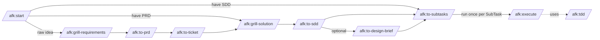

# afk

A Claude Code **plugin** for the async-from-keyboard (AFK) workflow on the
Nakisa core-services platform: a chain of skills that take a raw idea through
grilling → PRD → architecture → SDD → sliced SubTasks → execution, all run
**interactively** in Claude Code sessions. There is no autonomous driver — you
invoke each stage yourself, including execution.

Inspired by [Matt Pocock's AFK Claude Code workflow](https://github.com/mattpocock/skills),
adapted for the Nakisa Jira + GitLab + Maven environment on Windows. The *work*
the chain drives is Java/Maven inside a sibling core-services checkout; this
repo contains only the skills.

## The chain



Run `/afk:start` first if you're unsure where to begin — it prints this map and
routes you to the right entry skill.

## Install (one-time per machine)

```
# inside Claude Code, from any session
/plugin marketplace add C:\Users\mvu\PersonalProjects\afk    # or your local path
/plugin install afk@afk-marketplace
```

To auto-load on every Claude Code launch, add to `~/.claude/settings.json`:

```json
{
  "extraKnownMarketplaces": {
    "afk-marketplace": {
      "source": { "source": "directory", "path": "C:\\Users\\mvu\\PersonalProjects\\afk" }
    }
  },
  "enabledPlugins": {
    "afk@afk-marketplace": true
  }
}
```

After editing any `SKILL.md`, run `/reload-plugins` to pick up changes without
restarting. Same after `git pull`.

For teammate install (private repo, collaborator access required):
`/plugin marketplace add midnightblur/afk-driver` → `/plugin install
afk@afk-marketplace`.

## The skills

**Mandatory chain** (`/afk:to-prd` → `/afk:to-ticket` → `/afk:to-subtasks` →
`/afk:execute`):

- **`/afk:to-prd`** — turns conversation context into a PRD, plus
  requirement-level ADRs (behaviour / scope decisions that clear the
  hard-to-reverse + surprising + real-trade-off bar) under
  `.../{ENH-ID}/adr/requirements/NNNN-*.md`. Writes to
  `{service}/src/main/resources/specs/{year}r{release}/{ENH-ID}/PRD.md`
  (or `tasks/{ENH-ID}/PRD.md` for tooling work). **Produces local artifacts
  only** — it does not touch the issue tracker (that's `/afk:to-ticket`'s job).
- **`/afk:to-ticket`** — publishes the full PRD **content** into its parent
  ticket as native Jira formatting (ADF): headings, lists, tables, code, and any
  `mermaid` diagrams rendered to PNGs locally, attached, and embedded inline so
  they're viewable in Jira. **Idempotent** — re-run when `PRD.md` changes and it
  updates in place (no duplicate sections or attachments). Preserves
  product-owner content already in the ticket unless it's barebone. Publishes
  PRD content only — never the SDD or lower-level design. **Requires an existing
  parent** (does not create it); sets no label and no branch. The only
  design-chain skill that writes to the tracker; the work is done by the bundled
  `skills/to-ticket/scripts/publish_prd.py` engine for deterministic formatting.
- **`/afk:to-subtasks`** — slices a PRD (and the accompanying SDD + ADRs,
  when present) into Jira SubTasks under the parent Enhancement, each
  with the structured Markdown contract and the `afk-agents` label.
  **Cited mode** (default when an SDD exists) emits `## Design refs`,
  `## Parent SDD`, and `## Conflict procedure` blocks per SubTask, so
  the implementing agent inherits a binding contract — not just a
  feature ask. **Uncited mode** is human-gated for small features /
  bugs / refactors / tooling: when no SDD is present, the skill asks
  before slicing without one.
- **`/afk:execute`** — you run this yourself, once per SubTask, in a session on
  the parent Enhancement's branch. Takes one SubTask from `Dev-Pending` through
  `Dev-Designing` → `Dev-Developing`, gets the test command green, commits +
  pushes, updates the Draft MR, then **stops at CR/Merge** — you review and do
  the `Dev-CR/Merge` transition out of band. Reports a structured outcome
  (`success` / `test_fail` / `contract_mismatch` / `produces_drift` /
  `design_conflict` / …).

**Optional design layer** (recommended for new complex features touching
≥2 modules / introducing patterns / non-trivial transactions or data;
skip for small enhancements, bugs, refactors, tooling):

- **`/afk:grill-requirements`** — interviews the user about a raw idea or plan
  until the requirements decision tree is exhausted, challenging it against the
  project's domain glossary. Maintains `GLOSSARY.md` inline (the shared
  understanding being built) but produces NO decision records — those are
  emitted downstream by `/afk:to-prd` (requirement ADRs) and `/afk:to-sdd`
  (design ADRs). Pair with `/afk:to-prd` afterward to synthesize.
- **`/afk:grill-solution`** — interviews the user top-down across 8 layers
  (L1 system topology → L8 tactical patterns) until every non-trivial
  decision has a rationale and ≥2 alternatives weighed. Does NOT produce
  documents.
- **`/afk:to-sdd`** — synthesizes the conversation into `SDD.md` plus
  per-decision design ADRs, sibling to the PRD:
  `{service}/src/main/resources/specs/{year}r{release}/{ENH-ID}/SDD.md`
  and `.../adr/design/NNNN-*.md` (distinct from `/afk:to-prd`'s
  `adr/requirements/`). Owns the `## SDD` section of the parent
  Enhancement description. Mandates visualizations (Mermaid diagrams,
  tables) per layer so reviewers can scan vertically.
- **`/afk:to-design-brief`** — synthesizes PRD + SDD + ADRs into a tight
  1-2 page `DESIGN-BRIEF.md` sibling to the PRD/SDD. One money-shot
  diagram, 5-10 row decision digest, stakeholder-impact table. **Repo-only
  — does not touch the tracker**; shared with stakeholders out of band.
  Strict synthesis: refuses to invent decisions and refuses to emit when
  the SDD has executor-blocking open questions. Use for stakeholder
  reviews and as a map before reading the full SDD.

**Tooling**: `/afk:tdd` — red-green-refactor doctrine, invoked from
`/afk:execute` Step 5.

> **Cited-mode contract.** When `/afk:to-subtasks` slices in cited mode it
> emits five additional SubTask sections — `## Design refs`,
> `## Produces`, `## Consumes` (when `Blocked by` is non-empty),
> `## Parent SDD`, `## Conflict procedure`. The contract is enforced at
> three checkpoints:
>
> 1. **Slicing time** (`/afk:to-subtasks` Step 7): graph validation
>    (every `## Consumes` line resolves to a prior `## Produces`) +
>    anchor quality (forbidden-token check, ≥12-char length, trial
>    grep against `{file}` at HEAD must return ≤1 match — refuse on
>    ambiguity). Catches contract drift at declaration time.
> 2. **Consumer preflight** (`/afk:execute` Step 2): before any work, grep
>    every `## Consumes` line `{PRODUCER-KEY} {file}#{anchor}` on the
>    branch — a missing artifact or signature-divergent anchor exits
>    `contract_mismatch` (no retry; comment on consumer AND on the
>    producer SubTask).
> 3. **Producer self-preflight** (`/afk:execute` Step 10): right before
>    declaring success, grep every own `## Produces` anchor on the
>    branch. Missing or signature-divergent anchor exits
>    `produces_drift` (no retry; route the human to impl-vs-slice fix).
>
> On a binding-decision break (SDD §8 mandate is wrong/infeasible),
> `/afk:execute` exits `design_conflict` and routes to `/afk:grill-solution`
> for a superseding ADR. `## Produces` is mandatory on every cited SubTask,
> even leaves with no consumer — it doubles as the reviewer's cheat-sheet
> AND the next SubTask's preflight target.

## Section ownership invariants

Mixed human + automated edits live in several Markdown surfaces. Don't let
them collide:

- **Parent Enhancement description**: the PRD content (authored on disk by
  `/afk:to-prd`) is published by `/afk:to-ticket` inside an AFK-managed
  block; `## SDD` (when present) is owned by `/afk:to-sdd`; the Design Brief
  is **not** published to the ticket (`/afk:to-design-brief` is repo-only);
  `## Implementation Notes (auto-maintained)` is spliced by `/afk:execute`
  (idempotent — preserves human prose around the block); other prose
  belongs to the human.
- **MR description**: the block bracketed by `<!-- afk:subtasks:start -->`
  / `<!-- afk:subtasks:end -->` is auto-maintained by `/afk:execute`;
  everything outside is preserved verbatim.
- **SubTask description**: the SubTask Markdown contract must round-trip
  losslessly. If `/afk:to-subtasks` and `/afk:execute` add or change a
  section, update both the emitter (`/afk:to-subtasks` Step 6) and the
  parser (`/afk:execute` Step 1) together.
