# afk-driver

Async-from-keyboard driver for the Nakisa core-services platform. Drains
`afk-agents`-labelled Jira SubTasks under their parent Enhancement, opens a
Draft MR, spawns a fresh Claude Code session per SubTask via the `/afk-go`
skill, transitions tickets through `Dev-Pending → Dev-Designing →
Dev-Developing → Dev-CR/Merge`, and produces a morning digest.

Bootstrapped under [P2P-1220](https://nakisa.atlassian.net/browse/P2P-1220).
Design rationale lives in [`PRD.md`](./PRD.md).

## Quick start

Prerequisites: `glab`, `mvn`, `node`, `claude` (≥ the version supporting
`--print --dangerously-skip-permissions`), `git`, `python` (≥ 3.11).

```powershell
# from this repo's root
pip install -e .

# env (one-shot per shell session)
$j = (Get-Content $env:USERPROFILE\.claude.json -Raw | ConvertFrom-Json).mcpServers.jira.env
$env:JIRA_BASE_URL  = $j.JIRA_BASE_URL
$env:JIRA_EMAIL     = $j.JIRA_EMAIL
$env:JIRA_API_TOKEN = $j.JIRA_API_TOKEN
$env:GITLAB_TOKEN   = (glab auth status -t 2>&1 | Select-String 'Token found:\s*(\S+)').Matches.Groups[1].Value

# drain one pass
python -m afk_driver --label afk-agents --project P2P --digest-out auto
```

End-to-end smoke procedure: [`SMOKE.md`](./SMOKE.md).

## What it does, in one pass

```mermaid
flowchart LR
    A[JQL: label=afk-agents<br/>status=Dev-Pending<br/>type=SubTask] --> B[Group by parent Enhancement]
    B --> C[For each Enhancement]
    C --> D[Ensure worktree off Target Branch]
    D --> E[Push branch + open Draft MR]
    E --> F[Assign + transition Enhancement<br/>Dev-Pending → Dev-Designing → Dev-Developing<br/>Bug parent skips Dev-Designing]
    F --> G[For each SubTask in rank order]
    G --> H[Assign + transition Dev-Pending → Dev-Designing → Dev-Developing]
    H --> I[Spawn claude --print /afk-go SUBTASK-KEY]
    I --> J{outcome}
    J -->|success| K[Update parent Implementation Notes]
    J -->|test_fail / build_fail| L[retry up to retry_count]
    J -->|timeout / other| M[Comment on SubTask + Request Development]
    K --> N[Last SubTask?]
    N -->|yes| O[Rebase worktree onto target<br/>+ Enhancement → Dev-CR/Merge]
    N -->|no| G
    L --> I
    O --> P[Write digest to ~/.afk-driver/digests/]
```



### Standalone tickets (label on a non-subtask)

A small Enhancement or Bug labelled `afk-agents` with no labelled SubTasks
under it is driven directly: one Draft MR, one `claude --print` invocation
on the ticket key itself, lifecycle transitions on that key. The lifecycle
collapses onto the single ticket — **no MR subtasks checklist** is
maintained, and **no Implementation Notes splice** is written into a
parent (there is no parent). Because `/afk-go` reads the SubTask Markdown
contract (`## Goal / Scope / Acceptance / Test command / Parent PRD /
Blocked by / Implementation Notes`), a standalone ticket's description
**must be authored in that shape** for the skill to find work — the
driver does not synthesise it. If a labelled non-subtask also has
labelled SubTasks under it, the SubTask flow wins and the standalone path
is skipped.

## Modules

| Module | Responsibility |
|---|---|
| `subtask_template.py` | Parser/emitter for the SubTask Markdown contract (`## Goal / Scope / Acceptance / Test command / Parent PRD / Blocked by / Implementation Notes`). Round-trip lossless. |
| `scope_enforcer.py` | Pure function `(diff, scope_globs, forbidden, home_module, marker) → list[Violation]`. Catches out-of-scope edits, forbidden patterns (`UpgradeGroup*.java`, `db/changelog/**`, `PreDbMigration*`), and cross-module edits without a JIRA-prefixed marker comment. |
| `config.py` | `DriverConfig` dataclass + TOML override. Defaults: project→service map, `customfield_13706` Target Branch field, `MASTER → master` value map, forbidden patterns, marker template, wall-clock cap (3600s), retry count (3), worktree/log/digest roots under `~/.afk-driver/`, `dev_cr_merge_gate_fields`, `mr_assignee`. |
| `worktree_manager.py` | Per-Enhancement git worktree lifecycle. `ensure / publish_branch / validate_state / rebase_onto_target`. Branch name pattern `mvu/afk/{enh_id_lower}` (GitLab regex `^[a-z0-9][a-z0-9/\-\.]*$`). |
| `jira_client.py` | REST client. `search`, `get_enhancement_fields`, `list_transitions`, `transition` (by name), `update_implementation_notes` (idempotent splice), `set_fields`, `assign`, `get_my_account_id`, `get_issue_description_markdown` (ADF→Markdown for the SubTask parser). |
| `gitlab_client.py` | `glab` CLI wrapper. `find_mr_by_branch / open_draft_mr / update_subtasks_checklist`. Auto-maintained block bracketed by `<!-- afk:subtasks:start/end -->` HTML comments preserves human edits to the rest of the description. |
| `runner.py` | Orchestrator. `Runner.one_pass()` is the entry; `preflight()` validates env. Two flows: `_process_parent` (parent Enhancement + labelled SubTasks) and `_process_standalone` (one labelled non-subtask, collapsed lifecycle — no checklist, no impl-notes splice). Outcomes: `success / test_fail / build_fail / timeout / other`. Retries on `test_fail` / `build_fail` up to `retry_count`. |
| `digest_writer.py` | Emits `RunRecord` as L4 morning Markdown. |
| `cli.py` | `python -m afk_driver` entry. Wires real clients into Runner. Spawns `claude --print --dangerously-skip-permissions "/afk-go SUBTASK"` per SubTask. |

All I/O is dependency-injected so the runner integration tests (28) drive
fakes in <0.2s. Real-client wiring lives only in `cli.py`.

### Skill ↔ runner contract

Each spawned `claude --print` session returns a `ClaudeOutcome` to the
runner: one of `success / test_fail / build_fail / timeout / other`. The
ownership split between the two sides is load-bearing:

- **Skill (`/afk-go`) owns**: in-flight transitions (`Dev-Designing`,
  `Dev-Developing`), TDD loop, code edits, commits, push, MR checklist
  update, parent Implementation Notes splice.
- **Runner owns** (only when outcome is `success`): the boundary
  transition `Dev-CR/Merge`, gate-field writes, parent rebase, parent
  Enhancement → `Dev-CR/Merge`, acceptance-checkbox flips. On
  `test_fail` / `build_fail` it retries; on `timeout` / `other` it
  comments and transitions back to `Dev-Pending`.

The boundary transition is **runner-only** by design — if the skill also
fires `Request CR & Merge` from inside the session, the runner's
follow-up call will fail because the SubTask has already left
`Dev-Developing`. Keep this split when changing either side.

### Section ownership invariants

Mixed human + automated edits live in three Markdown surfaces. Don't let
them collide:

- **Parent Enhancement description**: `## PRD` is owned by `/to-prd`;
  `## Implementation Notes (auto-maintained)` is owned by this driver
  (idempotent splice via `update_implementation_notes`); other prose
  belongs to the human.
- **MR description**: the block bracketed by `<!-- afk:subtasks:start -->`
  / `<!-- afk:subtasks:end -->` is auto-maintained; everything outside is
  preserved verbatim.
- **SubTask description**: parsed by `subtask_template.py` and must
  round-trip losslessly. Adding a section requires updating both parser
  and emitter together.

## Configuration

Defaults are in `config.defaults()`. Override via `~/.afk-driver/config.toml`:

```toml
wall_clock_cap_seconds = 1800
retry_count = 2
mr_assignee = "your.gitlab.handle"

[project_service_map]
P2P = "11700-payable"

[target_branch_value_map]
MASTER = "master"
FINCORE_RELEASE = "fin-core/release"

[dev_cr_merge_gate_fields]
merge_request_link = "customfield_12700"
sred_eligibility = "customfield_14005"
time_estimation = "customfield_14006"
sred_rationale = "customfield_14003"
```

## Skills

The driver leans on three Claude Code skills (live at `~/.claude/skills/`,
not in this repo):

- **`/to-prd`** — turns conversation context into a PRD. AFK adaptation:
  writes to `{service}/src/main/resources/specs/{year}r{release}/{ENH-ID}/PRD.md`
  (or `tools/{group}/{tool}/PRD.md` for tooling work). Owns the `## PRD`
  section of the parent Enhancement description; AFK driver owns
  `## Implementation Notes (auto-maintained)`.
- **`/prd-to-subtasks`** — slices a PRD into Jira SubTasks under the parent
  Enhancement, each with the structured Markdown contract and the `afk-agents`
  label.
- **`/afk-go`** — invoked by the driver in the spawned session; takes one
  SubTask from `Dev-Pending` through `Dev-Designing` → `Dev-Developing`, gets
  the test command green, pushes commits, then exits with a structured
  outcome. The **runner** — not this skill — performs the final
  `Dev-CR/Merge` transition and the gate-field writes (SRED Eligibility,
  Time, Rationale, MR link), and only when the skill exits `success`. This
  split avoids the double-transition that occurs if both sides try to fire
  `Request CR & Merge`.

## Tests

```
python -m pytest -v
```

180 tests covering: subtask_template parser/emitter (round-trip),
scope_enforcer, config (defaults + TOML override), worktree_manager (real
temp-repo integration), jira_client (HTTP fake), gitlab_client (subprocess
fake), runner (28 integration tests against in-memory fakes, plus phase /
standalone scenario suites), digest_writer, cli (subprocess invocation
contract).

## Limitations / known gaps

- **No system-wide install.** Run from a checkout that has `pip install -e
  .` applied; the spawned afk-go session needs `afk_driver` importable from
  its cwd.
- **No CI / scheduled run.** `python -m afk_driver` is invoked manually
  (cron / Task Scheduler is up to the operator).
- **Failure paths only unit-tested.** `test_fail` retry, `build_fail`,
  `timeout`, `rebase conflict`, mid-run aborts — fakes only.

## Failure modes & recovery

- **Preflight hard-fail** (missing tool / token / PRD path) → fix env, rerun.
- **Parent not in `Dev-Pending` / `Dev-Developing`** → driver skips the
  Enhancement. Transition the parent into a runnable state first.
- **Rebase conflict on the post-last-SubTask rebase** → driver posts a
  comment on the Enhancement and exits clean; resolve manually.
- **Claude session timeout (1h cap)** → recorded as `timeout` in the digest;
  the SubTask returns to `Dev-Pending`.
- **Worktree dirty on resume** (prior session killed mid-edit) → before
  spawning each SubTask the runner does a hard reset to `HEAD`,
  discarding uncommitted leftovers. Resuming partial edits is unsafe
  (claude has no notion of "pick up where the dead session left off"), so
  the deterministic recovery is to start from `HEAD`. Logged as
  `discarded uncommitted leftovers from prior interruption`.
- **Claude reports `success` but didn't commit** (observed during the
  P2P-1233/4/5 smoke run) → the runner auto-stages and commits any dirty
  tree under a `[KEY] AFK auto-commit` message so the work lands on the
  branch. If both claude *and* the auto-commit pass produce no commits
  (branch tip unchanged), the SubTask is failed — refusing to transition
  a SubTask that didn't change any code.

If a run hangs and Jira state is partially advanced, the smoke runbook in
[`SMOKE.md`](./SMOKE.md) (§ "Failure modes to watch for") covers manual
recovery.

## Origin

Inspired by Matt Pocock's AFK Claude Code workflow, adapted for the Nakisa
Jira + GitLab + Maven environment on Windows. The driver is a standalone
Python package; the *work* it drives is Java/Maven inside a sibling
core-services checkout. See `PRD.md` § "AFK adaptation (core-services)".
