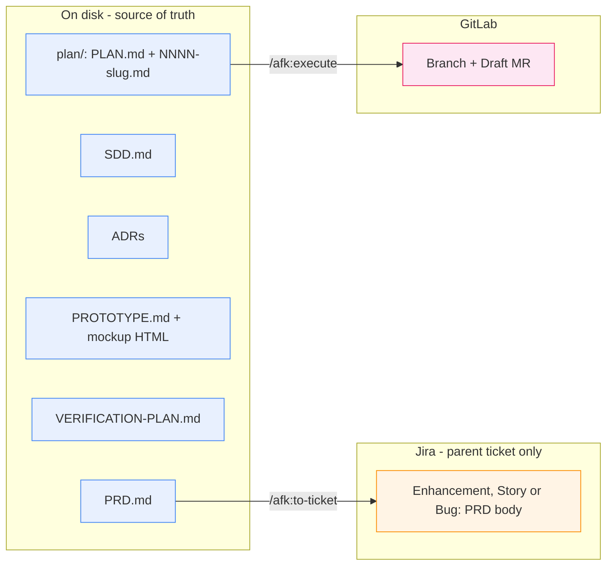
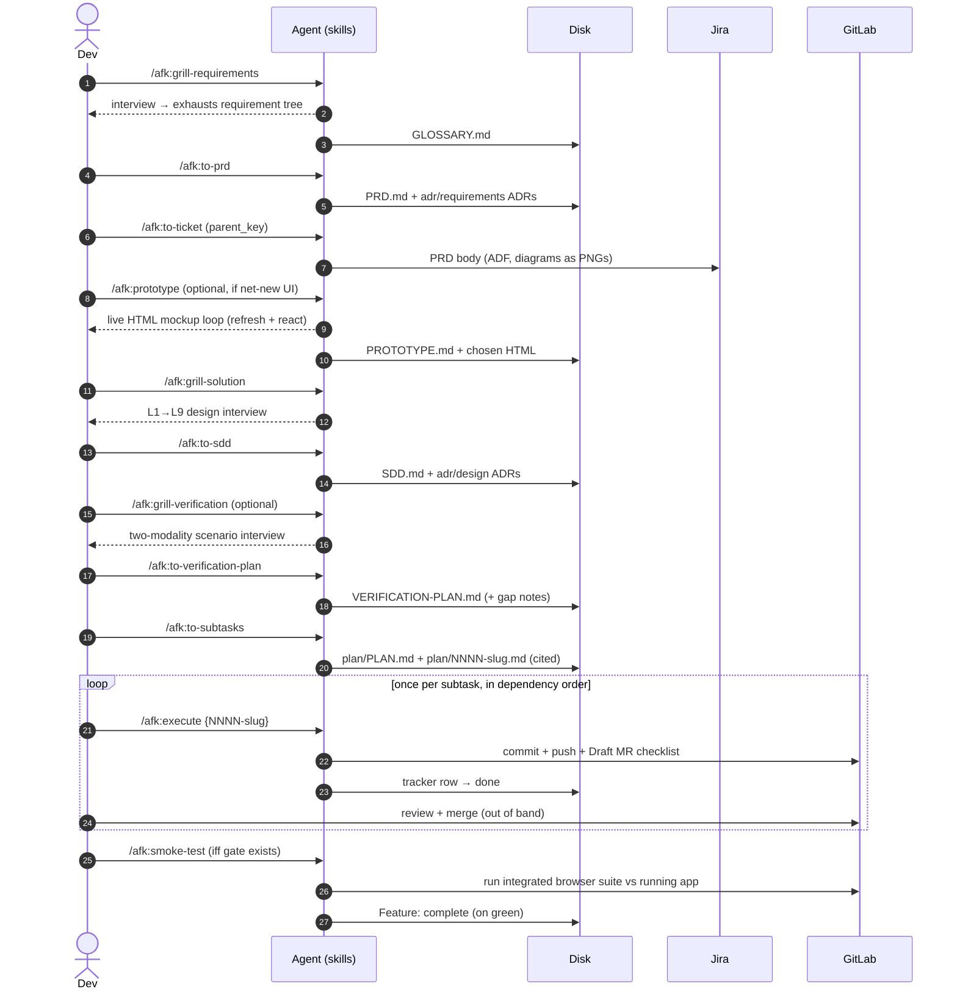
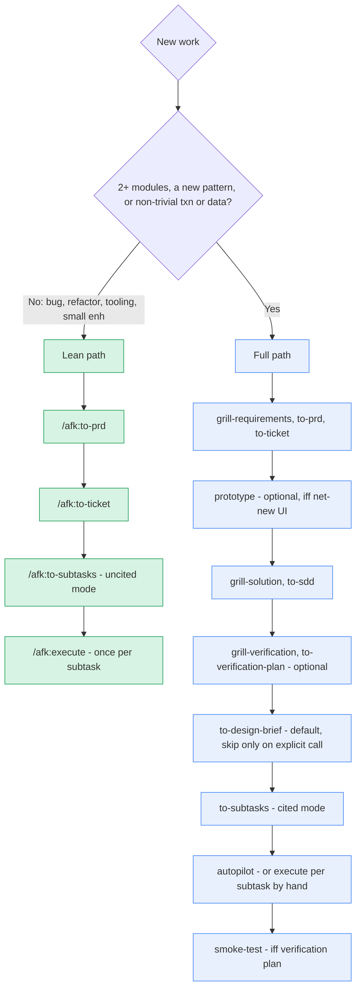
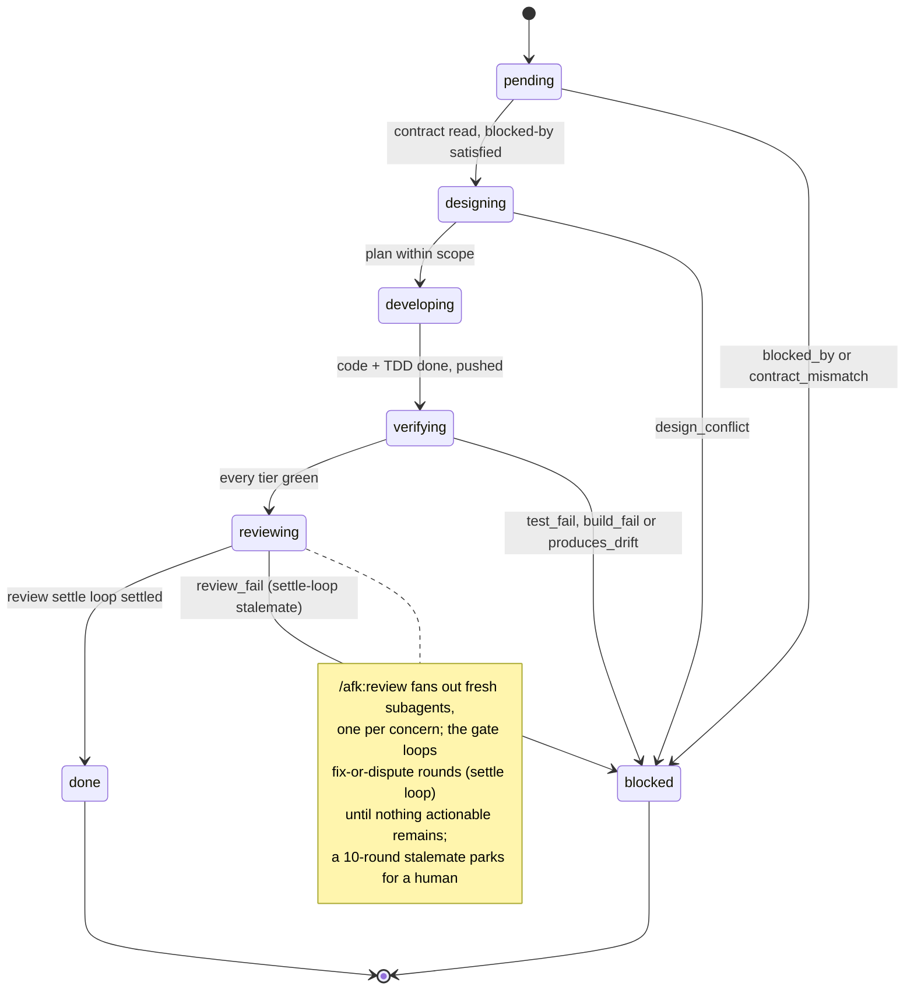
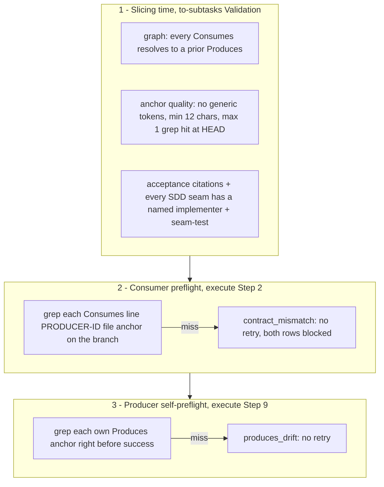

# afk — the away-from-keyboard workflow

Agent **plugin** that turns a raw feature idea into shipped, verified
code through a chain of skills — **human-heavy at the edges, autonomous in the
middle**. Drive the design stages interactively; the implementation middle runs
hands-off via `/afk:autopilot` (or by hand, one `/afk:execute` per subtask).
Each stage leaves a durable artifact on disk, so the next stage (and next human)
inherits a written contract, not a verbal hand-off.

> **New here? Read top to bottom once.** Explains *why* the workflow is shaped
> this way, the concepts to hold in your head, then walks one feature end to end.
> Per-skill catalog + install snippet are further down as reference.

**Credit & inspiration.** Directly inspired by and built upon
[Matt Pocock's AFK workflow and skills](https://github.com/mattpocock/skills).
The original idea, the AFK framing, and several skill patterns come from his work
— adapted and extended for a specific environment. Read the upstream source first.

Every external system the chain touches is an **adapter**: a tracker, a forge,
a notes store, a build gate. The consuming repository picks its kinds in
`.afk/config.yaml` (`CONFIG.md`), and no skill names a vendor
(`ADAPTERS.md`). **This repo contains only the toolkit** — the AFK chain under
`skills/afk/<name>/SKILL.md`, standalone utility skills under
`skills/utils/<name>/SKILL.md`, the adapters, the hooks, and the plugin
manifests. The *work* the chain drives lives in whatever repository you run it
in.

---

## Table of contents

1. [Why AFK](#1-why-afk) — the problem it solves
2. [The mental model](#2-the-mental-model) — five ideas to internalize
3. [The chain at a glance](#3-the-chain-at-a-glance) — the map
4. [Install](#4-install) — one-time setup
5. [Walkthrough: your first feature](#5-walkthrough-your-first-feature) — end to end
6. [Choosing your path](#6-choosing-your-path) — full chain vs. the lean path
7. [Where everything lives](#7-where-everything-lives) — the artifact map
8. [The subtask lifecycle](#8-the-subtask-lifecycle) — how `/afk:execute` works
9. [The cited-mode contract](#9-the-cited-mode-contract) — how drift is caught
10. [Skill reference](#10-skill-reference) — every skill, one paragraph each
11. [Section-ownership invariants](#11-section-ownership-invariants) — don't let edits collide
12. [Conventions & gotchas](#12-conventions--gotchas)

---

## 1. Why AFK (and what the name really means)

**AFK = "away from keyboard."** Spend the expensive, focused effort **up front**
— exploring requirements, designing the solution thoroughly — then let agents
implement autonomously. Settle the *what* and *why*, walk away, come back to
pushed, verified, review-gated Draft MRs.

The middle **is** hands-off: `/afk:autopilot` walks the whole plan in dependency
order, one fresh subagent per subtask (driven-mode `/afk:execute`),
self-provisions the live app for `api`/`e2e`/adversarial verification, parks
failures (and dependents) while independent work continues, ends at the feature
smoke gate. Edges stay human: you approve requirements and design before the run,
review + merge Draft MRs and read the smoke verdict after. Every stage still
runs interactively by hand — autopilot is the default for the middle, not the
only way.

What makes it trustworthy while you're away:

- **Hand-off is a file, not a memory.** Every stage emits an artifact (PRD, SDD,
  ADRs, a plan, a verification plan). Next agent reads the contract; doesn't
  re-derive intent from a chat log.
- **Drift is caught mechanically, not in review.** When the design is settled
  (an SDD exists), the plan slices in *cited mode*: each subtask carries typed
  `Produces`/`Consumes` anchors, and `/afk:execute` greps them before and after
  it works. A signature that drifts from its contract halts the run — never
  reaches a human reviewer as a surprise.
- **Human stays in the loop at the load-bearing seams.** Skills design, draft,
  implement, verify; **you** approve requirements, approve design, review the
  Draft MR, merge. Auto-merge is deliberately outside the skills' lane.
- **Catch up from disk anytime.** The ticket's `INDEX.md` is the read-this-first
  dashboard; `plan/JOURNAL.md` is the append-only event log of everything that
  happened while you were away; every status line a skill reports is followed by
  one jargon-free `In plain terms:` sentence (`REPORTING.md`), and every piece of
  workflow vocabulary has one definition (`GLOSSARY.md` at the plugin root —
  domain vocabulary stays in the target repo's glossaries). Every skill writes in
  the same plain language and the same terms, replies and artifacts alike
  (`LANGUAGE.md` at the plugin root).
- **Orchestrator keeps conclusions, not inputs.** Context-heavy work — bulk
  reads, repo-wide searches, suite runs, big diffs, tracker pulls — runs in fresh
  subagents that return terse cited digests (`DELEGATION.md` at the plugin root).
  The driving agent stays lean for the decisions only it can make; every heavy
  judgment gets a fresh pair of eyes.

---

## 2. The mental model

Five ideas. Hold these and the rest follows.

**① You invoke the stages; autopilot may drive the middle.** Each skill is a
`/afk:<name>` skill invoked in an agent session. Design and acceptance
stages are interactive; the implementation middle runs hands-off via
`/afk:autopilot` (one fresh subagent per subtask) or by hand, one `/afk:execute`
per subtask. The map in [§3](#3-the-chain-at-a-glance) shows where each fits.

**② Artifacts on disk are the source of truth.** PRD, SDD, ADRs,
`VERIFICATION-PLAN.md`, and the execution plan all live as files next to the code
they describe. Jira holds **only** the parent Enhancement/Story/Bug — and only two
skills ever write to it (see ④).

**③ The plan is a local contract, not Jira issues.** `/afk:to-subtasks` emits a
`plan/` directory: a `PLAN.md` index (solution map, seam register, live progress
tracker) plus one `NNNN-slug.md` contract per subtask. A subtask's *id* is its
filename stem. `/afk:execute` parses these files and writes back progress. No
subtask becomes a Jira issue.

**④ Only two skills touch the tracker.** `/afk:to-ticket` publishes the PRD body
into the parent ticket and mints stub Enhancements for grill-deferred work
(spinoff mode). `/afk:bug`'s publisher subagent is the pipeline's
second, narrowly-scoped Jira writer — create the Bug, one Dev-Pending
transition, evidence comments, on that ticket only (ADR-0001). **Everything
else stops at disk or GitLab** — including `/afk:to-sdd`, whose `SDD.md` +
design ADRs are local only. `/afk:execute` pushes branches + Draft MRs to
GitLab but writes no Jira.

**⑤ The human owns the merge.** `/afk:execute` takes a subtask to a pushed,
verified, Draft MR — then **stops**. You review and merge out of band. Same for
the feature gate: `/afk:smoke-test` stamps a feature complete on green but merges
nothing.



---

## 3. The chain at a glance

```mermaid
graph LR
    Grill[/afk:grill-requirements/] --> Prd[/afk:to-prd/] --> Ticket[/afk:to-ticket/] --> AG[/afk:grill-solution/] --> Sdd[/afk:to-sdd/]
    Sdd -->|optional digest| Brief[/afk:to-design-brief/]

    Prd -.->|optional UI mockup| Proto[/afk:prototype/]
    Proto -.->|PROTOTYPE.md feeds design| AG

    Prd -.->|optional verification design| E2E[/afk:grill-verification/]
    Sdd -.->|optional verification design| E2E
    E2E -->|interview settled| VPlan[/afk:to-verification-plan/]

    Sdd --> Sub
    Brief --> Sub
    VPlan -->|VERIFICATION-PLAN.md| Sub

    Sub -->|hands-off driver| Auto[/afk:autopilot/]
    Auto -->|one fresh subagent per subtask| Exec[/afk:execute/]
    Sub -.->|or run once per subtask by hand| Exec
    Exec -->|all subtasks done · gate iff verification plan| Smoke[/afk:smoke-test/]
    Exec -.->|uses| Tdd[/tdd skill/]
    Exec -.->|review gate| Rev[/afk:review/]
    Exec -.->|adversarial gate| Adv[/afk:adversary/]
    Smoke -->|smoke green · ship gate| PF[/afk:preflight/]
    PF -.->|advisory row · post-ship understanding artifact| Und[/afk:understand/]
    Smoke -.->|delivered · demo it to POs + QA| Demo[/afk:to-demo-plan/]

    classDef mand fill:#d7f3e3,stroke:#1b9e58,stroke-width:2px;
    classDef opt fill:#eef1f5,stroke:#90a4ae;
    class Prd,Ticket,Sub,Auto,Exec mand;
    class Grill,Proto,AG,Sdd,Brief,E2E,VPlan,Smoke,Tdd,Rev,Adv,PF,Und,Demo opt;
```



The **green** path is the mandatory spine: `/afk:to-prd` → `/afk:to-ticket` →
`/afk:to-subtasks` → `/afk:autopilot` (or `/afk:execute` per subtask by hand).
Grey is optional design depth — add for complex features, skip for small ones
(see [§6](#6-choosing-your-path)).

Every plan `/afk:to-subtasks` emits ends with a terminal `NNNN-sync-harness` doc
subtask (blocked by all others) that `/afk:execute` runs last to sync the
CLAUDE.md harness for the shipped feature **and settle the staples registry**
(`{service}/STAPLES.md`), delegating the write to `/afk:claude-md`.

**Staples.** A *staple* is a delivered capability that became a standing
expectation (e.g. deep-linking, Excel import/export) — every future feature
matching its trigger must consider adopting it, via the per-service `STAPLES.md`
registry. Consult/capture loops + stewardship: CLAUDE.md "Staples registry".

Start where your inputs land: raw idea → `/afk:grill-requirements`; existing PRD
→ `/afk:grill-solution`; SDD in hand → `/afk:to-subtasks`.

---

## 4. Install

The committed tree stays inert until a harness enables `afk@afk-toolkit`.

### `.claude-plugin` harness

```text
/plugin marketplace add midnightblur/afk-driver
/plugin install afk@afk-toolkit
```

To auto-load, add to `~/.claude/settings.json`:

```json
{
  "extraKnownMarketplaces": {
    "afk-toolkit": {
      "source": { "source": "github", "repo": "midnightblur/afk-driver" }
    }
  },
  "enabledPlugins": {
    "afk@afk-toolkit": true
  }
}
```

Run `/reload-plugins` after source changes.

### `.codex-plugin` harness

```sh
codex plugin marketplace add midnightblur/afk-driver
codex plugin add afk@afk-toolkit
```

Then run `/afk:setup`. Section O enables native hooks, checks cache freshness,
guides hook trust, copies the four agent TOML stubs, offers the per-directory
steering fallback, and verifies the skill catalog `plugin.json` declares plus
Jira. Restart after cache or agent-definition changes.

The first session asks you to trust the plugin's hooks. Answer it once: the
trust is keyed to the marketplace and the definitions, not to the installed
path, so it survives an upgrade and the prompt returns only when a release
changes `hooks/hooks.codex.json`. The four agent stubs are the opposite — they
hold the installed root, which carries the version, so **every** upgrade needs
`/afk:setup` again to rewrite them.

### Upgrading a pinned install

Both harnesses record an installed version, and a pin is stated in more than
one file. Move them in this order, or the command refuses:

1. **Bump the ref where the harness declares it.** Claude reads
   `~/.claude/settings.json` -> `extraKnownMarketplaces.afk-toolkit.source.ref`;
   the `.codex-plugin` harness reads `~/.codex/config.toml` ->
   `[marketplaces.afk-toolkit] ref`.
   Adding a marketplace at a ref the settings file still contradicts fails with
   "its network source differs from the one declared for it in settings".
2. **Re-add the marketplace at the new tag.**
   `claude plugin marketplace add <owner>/<repo>@<tag> --scope user`, or
   `codex plugin marketplace upgrade afk-toolkit`.
3. **Update the plugin.** `claude plugin update afk@afk-toolkit`, or
   `codex plugin add afk@afk-toolkit`. On Claude, `plugin install` answers
   "already installed" and changes nothing — `update` is the verb that moves a
   version.
4. Run `/afk:setup` to rewrite the `.codex-plugin` agent stubs, which hold the
   versioned root, then restart the harness.

**Checking which version is live.** Ask the harness, never the directories:

```sh
claude plugin list            # the version the harness loads
```

and, for the path and commit behind it, the registry file the harness writes:
`~/.claude/plugins/installed_plugins.json` -> `afk@afk-toolkit[].installPath`,
`.version`, `.gitCommitSha`.

`~/.claude/plugins/marketplaces/<name>` is a clone the CLI manages, and
`~/.claude/plugins/cache/<market>/<plugin>/` keeps every version ever
installed, so a `git log` in the first or an `ls` of the second answers a
question nobody asked: both can show a version the harness does not load.
Running git in either one also detaches a checkout the CLI believes it owns.

### Configuring a repository

A repository the toolkit runs in needs one committed file, `.afk/config.yaml`.
You do not write it by hand: `/afk:setup` scaffolds it when it is absent, from
what the repository can answer about itself, and walks you through the few
values it cannot infer. To scaffold it yourself:

```sh
python "$AFK_PLUGIN_ROOT/scripts/afk-config.py" init
```

Commit that file — it is the repository's contract, and every other developer's
setup depends on it. It names no person: who work is assigned to and who
reviews it are answered by each developer, not by the repository.

Your own values — the tracker account work is assigned to, the reviewer you
name, your IDE — go under `developer:` in `~/.afk/config.yaml`, once per
machine rather than once per checkout. `/afk:setup` asks you for the assignee
and the reviewer; nothing supplies them for you. The worktree base is derived
from git when you set none. `skills/afk/bug/CONFIG.md` is the full contract.

### Shared setup and development

`/afk:setup` probes external dependencies against
`skills/afk/setup/MANIFEST.md`. Use `/afk:setup base` for the pinned workstation
toolchain. Use `/afk:setup audit` before shipping plugin changes.

Dev loop: edit shared source, run `hooks/tests/hook-smoke.sh`, run
`hooks/native-contract-gate.sh`, then refresh the enabled plugin per
`PROVIDERS.md`. Live support status is in `providers/CONFORMANCE.md`.

---

## 5. Walkthrough: your first feature

A complete pass for a **complex** feature (one needing real design). Commands are
skills you invoke in an agent session; files are what appears on disk.



**Step by step:**

1. **`/afk:grill-requirements`** — Claude interviews you about the idea,
   challenging it against the domain glossary until the requirements decision
   tree is exhausted. Maintains `GLOSSARY.md`; emits no decision records yet.
2. **`/afk:to-prd`** — synthesizes the conversation into `PRD.md` plus
   requirement-level ADRs. **Local only** — nothing in Jira yet.
3. **`/afk:to-ticket`** — distills the PRD to a requirements-level ticket
   description (`TICKET.md`) and publishes it into the **existing** parent
   ticket as native Jira formatting (ADF), rendering any Mermaid diagrams
   to attached PNGs. Idempotent — re-run when the PRD changes.
4. **`/afk:prototype`** *(optional — only if net-new UI)* — crafts the screens
   with you interactively, anchored to the **real frontend's** components and
   tokens (design-system catalog / live app / source, best evidence first).
   Writes self-contained **drivable** HTML you open and refresh while reshaping
   it in plain language — every PRD capability simulated client-side, so you
   feel how the feature works, not just how it looks. Settle is gated on a
   **capability walk** (every story clickable or its gap logged) and a
   **fidelity pass** against the live app; then captures `PROTOTYPE.md` + the
   chosen HTML sibling to the PRD. Self-gates `no_ui` for backend-only features. The won design feeds the
   next two steps and gives the verification UI journeys a concrete screen to
   trace to. Local-first; an opt-in push mirrors the mockup to `claude.ai/design`
   for stakeholder review.
5. **`/afk:grill-solution`** — top-down design interview across 9 layers (L1
   system topology → L8 tactical patterns); every non-trivial decision gets a
   rationale and ≥2 weighed alternatives. Six aspects are **human-locked** —
   entity design, API surface, authz + scoping, lifecycle + invariants,
   irreversible/outward side effects, changes to existing behaviour — grilled to
   a contract grade, packeted for your review, and **signed off by you** before
   the design counts as done.
6. **`/afk:to-sdd`** — synthesizes the design into `SDD.md` + per-decision design
   ADRs. **Local only** — the SDD is never published to the ticket.
7. **`/afk:grill-verification`** *(optional but recommended)* — designs the
   feature's verification scenarios with you: the real end-user **browser
   journeys**, plus (once the SDD exists) the **API scenarios** that prove the
   backend contract for API/MCP callers who bypass the UI. **Interviews only** —
   walking them concretely routinely surfaces PRD/SDD gaps, a feature not a side
   effect.
8. **`/afk:to-verification-plan`** — synthesizes that conversation into
   `VERIFICATION-PLAN.md` (UI journeys now; API scenarios too once the SDD exists,
   else deferred and appended on a re-run).
9. **`/afk:to-subtasks`** — slices everything into `plan/`. An SDD exists → slices
   **cited mode** (typed contracts). A `VERIFICATION-PLAN.md` exists → also seeds
   a `## Feature smoke gate` and a terminal build subtask per modality
   (`NNNN-smoke-e2e` for UI journeys, `NNNN-smoke-api` for API scenarios).
10. **`/afk:autopilot`** — hands-off default for the middle: walks the whole plan
    in dependency order, one fresh subagent per subtask (driven-mode
    `/afk:execute`), self-provisions the live app, parks failures + dependents
    while independent work continues (push notification on every park), journals
    every event to `plan/JOURNAL.md`, ends at the smoke gate. Prefer this when the
    plan is approved; or run **`/afk:execute {NNNN-slug}`** yourself once per
    subtask, in dependency order, from a worktree on the parent branch — it
    designs, develops under TDD, turns every verification tier green, pushes,
    updates the Draft MR, advances the tracker — then stops. Either way, you
    review and merge each MR.
11. **`/afk:smoke-test`** — after every subtask is `done`, runs the integrated
    verification suites — browser journeys **and** API contracts — against a
    running app and stamps `Feature: complete` on green across both.

For a **small** feature, collapse to the lean path — see next section.

---

## 6. Choosing your path

The optional design layer earns its cost on complex work, pure overhead on
trivial work. Decide up front:



| | **Lean path** | **Full path** |
|---|---|---|
| When | bug / refactor / tooling / small enhancement | new complex feature, new pattern, multi-module |
| Design docs | none | SDD + ADRs |
| UI prototype | none | optional via `/afk:prototype` (iff net-new UI) |
| Slice mode | **uncited** (PRD-only, human-gated) | **cited** (typed `Produces`/`Consumes`, mechanically enforced) |
| verification gate | usually none | optional via `/afk:grill-verification` → `/afk:to-verification-plan` (UI + API) |

**Mode is set by what's upstream**, not by a flag: PRD **with** an SDD → cited;
PRD **alone** → uncited.

---

## 7. Where everything lives

Every design artifact sits next to the code it describes, under the ticket's spec
folder (or `tasks/{TICKET-ID}/` for tooling work with no service home):

```text
{service}/specs/{year}r{release}/{TICKET-ID}/
├── INDEX.md                   ← /afk:to-prd creates; each skill upserts its row (read this first)
├── PRD.md                     ← /afk:to-prd        (published to Jira by /afk:to-ticket)
├── PROTOTYPE.md               ← /afk:prototype     (local; optional; canonical record of the won UI)
├── prototype/                 ← /afk:prototype     (the chosen self-contained mockup HTML)
├── SDD.md                     ← /afk:to-sdd        (local only; not published to Jira)
├── VERIFICATION-PLAN.md       ← /afk:to-verification-plan (local only; UI journeys + API scenarios)
├── DESIGN-BRIEF.md            ← /afk:to-design-brief (local only; default on the full path)
├── DEMO-PLAN.md               ← /afk:to-demo-plan  (local only; the ≤1h beat-by-beat demo script for POs + QA)
├── GRILL-LOG.md               ← the grills          (on-disk checkpoint of settled decisions)
├── GLOSSARY.md                ← /afk:grill-requirements
├── understanding/             ← /afk:understand    (self-contained interactive HTML learning artifacts: index.html for the feature, optional {slug}.html durable copies for MR/code-area subjects)
├── adr/
│   ├── requirements/NNNN-*.md ← /afk:to-prd   (what / why)
│   └── design/NNNN-*.md       ← /afk:to-sdd   (how)
└── plan/                      ← /afk:to-subtasks
    ├── PLAN.md                  (index: solution map, seam register, progress tracker, smoke gate)
    ├── JOURNAL.md               (append-only event log — the "what happened while you were gone" file)
    ├── DECISIONS.md              (append-only decision ledger — two-way doors taken hands-off, per root DECISIONS.md)
    ├── TRACE.md                 (end-of-feature rollup: acceptance criterion → subtask → commits → tests)
    ├── review/                  (review + adversary reports, INDEX.md rollup per subtask)
    └── NNNN-slug.md             (one contract per subtask)
```

**Catching up on a feature you didn't watch:** open `INDEX.md` (summary, artifact
states, reading order), then the tail of `plan/JOURNAL.md` (what happened, in
order, with plain-terms sentences), then `plan/review/INDEX.md` (what the gates
found). Six months later, add `plan/TRACE.md` (which commit satisfied which
acceptance criterion) and the ADR folders (why it's shaped this way).

**Two ADR tiers, separate subfolders, separate numbering** — requirement ADRs
(`adr/requirements/`, owned by `/afk:to-prd`) never share numbering with design
ADRs (`adr/design/`, owned by `/afk:to-sdd`).

Two artifacts live at the **service root**, not the per-ticket spec folder,
because the whole service shares them: `GLOSSARY.md` (vocabulary, stewarded by
`/afk:glossary`) and `STAPLES.md` (cross-cutting staples registry, stewarded by
`/afk:claude-md`). Every design/plan/review stage reads `STAPLES.md`; only
`/afk:claude-md` writes it.

One artifact lives in the **main checkout** (shared across every feature
worktree): `.claude/lessons/LEDGER.jsonl` — the append-only workflow lesson
ledger (grammar: `skills/afk/lessons/LEDGER-FORMAT.md`), captured into by the
chain's detection points and stewarded by `/afk:lessons`.

What changed in the plugin itself lives in **`CHANGELOG.md`** at the plugin
root — dated dev-facing one-liners, newest first. Skim it after every pull.

The verification suites are **not** in this repo — they live in the consuming
repository, and `verification.tiers` in its `.afk/config.yaml` says how to run
each tier. A skill names a tier KEY (`static`, `unit`, `integration`, `api`,
`e2e/browser`), never a command. A repository that keeps authoring recipes for
its own suites names them in its own `CLAUDE.md` and in the `setup.extra` files
`/afk:setup` reads; AFK skills only *point* at recipes — never embed a
copy, because a copy drifts from the code it describes.

---

## 8. The subtask lifecycle

`/afk:execute` runs **one** subtask per invocation. It owns exactly one cell of
the `PLAN.md` progress tracker (the row it's working) — nothing else. The states:



Happy path: `pending → designing → developing → verifying → reviewing → done`. Any
structured failure parks the row at `blocked(<reason>)` and reports a matching
`OUTCOME:` line. The reasons:

| Outcome | Meaning | Where you go next |
|---|---|---|
| `success` | every tier green, pushed, MR updated, row `done` | review + merge the MR |
| `blocked_by` | a `## Blocked by` prerequisite isn't `done` yet | run the prerequisites first |
| `test_fail` / `build_fail` | a verification tier stayed red after one retry | fix the impl |
| `review_fail` | the Step 10 review settle loop hit its 10-round cap with findings still open (stalemate — unusual by construction) | read the open findings in `plan/review/` and judge them yourself |
| `adversary_fail` | the Step 10.5 adversarial gate's blocking findings survived its remediation cap | read the adversary report in `plan/review/`, fix what it proved broken |
| `adversary_unrun` | the run ended before the Step 10.5 gate could spawn — tiers green, findings settled, but nothing independent judged the slice | re-run the subtask; it resumes at the gate rather than from the top |
| `contract_mismatch` | a consumed upstream `Produces` is missing/drifted | fix the **producer** subtask |
| `produces_drift` | this subtask didn't deliver its own declared `Produces` | fix impl or re-slice |
| `design_conflict` | a binding SDD/ADR decision is wrong/infeasible, and the correction is a one-way door or a tie | `/afk:grill-solution` → superseding ADR |
| `needs_decision` | a decision fork parked per the decision protocol (`DECISIONS.md`) — one-way door or tie, no closer status | read the fork + recommendation in the outcome, answer it, re-run (two-way doors never park — they're auto-taken and listed in `plan/DECISIONS.md`) |
| `timeout` / `other` | wall-clock cap / unexpected | inspect and re-run |

Every `OUTCOME:` line arrives with one jargon-free `In plain terms:` sentence and
a pointer to the full story (`REPORTING.md` at the plugin root), and every status
change, park, push, and verdict lands as a timestamped line in the append-only
`plan/JOURNAL.md` — read its tail to reconstruct a run you didn't watch.

Then **it stops at CR/Merge** — reviewing and merging the Draft MR is yours.

---

## 9. The cited-mode contract

When an SDD is present, the plan slices in **cited mode** and each subtask carries
a typed contract. The point: a producer/consumer signature mismatch is caught by
a `grep`, at a precise checkpoint, on the *right* subtask — never a silent
integration surprise.



Full contract — checkpoint text, the mandatory-`## Produces` rule,
`design_conflict` routing on a binding-decision break, and the opt-in
**materialized seams** upgrade (`materialize_seams=true`: compiler-checked
pre-created seam stubs) — lives in CLAUDE.md "Cited-mode contract".

---

## 10. Skill reference

One line per skill — what it is and when to reach for it. Mechanics live in each
skill's own `SKILL.md` (+ siblings); nothing here restates them.

### Mandatory chain

- **`/afk:to-prd`** — synthesize the conversation into `PRD.md` + requirement
  ADRs; local only. Details: `skills/afk/to-prd/SKILL.md`.
- **`/afk:to-ticket`** — publish the finished PRD into the existing Jira parent
  as a requirements-level description; also meeting + spinoff modes. The design
  chain's only Jira writer ([§2 ④](#2-the-mental-model)). Details:
  `skills/afk/to-ticket/SKILL.md`.
- **`/afk:to-subtasks`** — slice the PRD (+ SDD/ADRs when present) into the
  local `plan/`; no Jira. Details: `skills/afk/to-subtasks/SKILL.md`.
- **`/afk:execute`** — run one subtask end-to-end (TDD, verification tiers,
  review + adversary gates, commit/push/Draft MR), then stop at CR/Merge.
  Details: `skills/afk/execute/SKILL.md`.
- **`/afk:autopilot`** — hands-off driver: walks the plan in dependency order,
  one fresh subagent per subtask, parks failures + dependents, ends at the
  smoke gate. Details: `skills/afk/autopilot/SKILL.md`.

### Optional design layer

*(Recommended for new complex features touching ≥2 modules / introducing
patterns / non-trivial transactions or data; skip for small enhancements, bugs,
refactors, tooling.)*

- **`/afk:grill-requirements`** — interview a raw idea until the requirement
  tree is exhausted; maintains `GLOSSARY.md`. Details:
  `skills/afk/grill-requirements/SKILL.md`.
- **`/afk:prototype`** — interactively craft the feature's UI as drivable HTML
  anchored to the real frontend; use iff net-new UI, after `/afk:to-prd`.
  Details: `skills/afk/prototype/SKILL.md`.
- **`/afk:grill-solution`** — top-down L1→L9 design interview; human-locked
  aspects signed off by you. Details: `skills/afk/grill-solution/SKILL.md`.
- **`/afk:to-sdd`** — synthesize the settled design into `SDD.md` + design
  ADRs; local only, never published to the ticket. Details:
  `skills/afk/to-sdd/SKILL.md`.
- **`/afk:to-design-brief`** — distill PRD + SDD + ADRs into a 1-2 page
  stakeholder brief; repo-only. Details: `skills/afk/to-design-brief/SKILL.md`.
- **`/afk:grill-verification`** — interview to design UI journeys + API
  scenarios; run after the PRD (UI), again after the SDD (API). Details:
  `skills/afk/grill-verification/SKILL.md`.
- **`/afk:to-verification-plan`** — synthesize the settled scenarios into
  `VERIFICATION-PLAN.md`; repo-only. Details:
  `skills/afk/to-verification-plan/SKILL.md`.

### Feature gates

- **`/afk:smoke-test`** — feature-level completion gate: executes the
  already-built verification suites against a running app, stamps
  `Feature: complete` on green. Details: `skills/afk/smoke-test/SKILL.md`.
- **`/afk:preflight`** — feature-level ship gate once smoke is green:
  target-branch merge (conflicts resolved in place), final validations +
  integrated review settle, CI babysit, Draft MR → Ready. Details:
  `skills/afk/preflight/SKILL.md`.

### Tooling

- **`tdd`** — the red-green-refactor doctrine `/afk:execute` implements under;
  agent-invoked, not in the `/` menu. Details: `skills/afk/tdd/SKILL.md`.
- **`/afk:review`** — independent multi-concern review gate; read-only, settled
  through the multi-round settle loop; also standalone on any slice or
  `--feature`. Details: `skills/afk/review/SKILL.md`.
- **`/afk:adversary`** — adversarial execution gate: probes the running app
  from contract + specs alone, blind to the diff. Details:
  `skills/afk/adversary/SKILL.md`.
- **`/afk:fix`** — orchestrates a bug fix: diagnosis, proportional coverage,
  escape analysis, spec reconciliation; for verification findings and reported
  bugs. Details: `skills/afk/fix/SKILL.md`.
- **`/afk:gc`** — post-merge cleanup: deletes the feature's run artifacts +
  retires its dev worktree; only after the MR merged. Details:
  `skills/afk/gc/SKILL.md`.
- **`/afk:retro`** — cross-feature retrospective mining delivered runs' exhaust
  into evidence-cited plugin-edit proposals. Details:
  `skills/afk/retro/SKILL.md`.
- **`/afk:lessons`** — steward of the workflow lesson ledger
  (`status`/`apply`/`audit`). Details: `skills/afk/lessons/SKILL.md`.
- **`/afk:claude-md`** — steward of CLAUDE.md harnesses, `.claude/rules`, and
  the per-service `STAPLES.md` registry. Details:
  `skills/afk/claude-md/SKILL.md`.
- **`/afk:design-system`** — per-service (not per-feature) `claude.ai/design`
  catalog mirroring the live frontend; re-run on token/component drift.
  Details: `skills/afk/design-system/SKILL.md`.
- **`/afk:mission-control`** — read-only per-feature dashboard: watch a live
  run, `--once` retroactive render, `build` for design digests. Details:
  `skills/afk/mission-control/SKILL.md`.
- **`/afk:understand`** — self-contained interactive HTML learning artifact for
  a feature, MR, or code area. Details: `skills/afk/understand/SKILL.md`.
- **`/afk:to-demo-plan`** — beat-by-beat ≤60-min demo script for a delivered
  feature, for POs + QA; repo-only. Details:
  `skills/afk/to-demo-plan/SKILL.md`.
- **`/afk:setup`** — workflow doctor: probes/fixes external dependencies;
  `base` adds the workstation tier, `audit` hunts plugin drift. Details:
  `skills/afk/setup/SKILL.md`.
- **`/afk:bug`** — mid-task bug capture → Jira Bug → autonomous fixer worktree
  → retest; interactive-only, outside the feature chain. Details:
  `skills/afk/bug/SKILL.md`.

### Utility skills (not part of the AFK chain)

General-purpose, under `skills/utils/`, invocable any time in any project.

- **`/afk:caveman`** — ultra-compressed reply mode. Details:
  `skills/utils/caveman/SKILL.md`.
- **`/afk:diagnose`** — disciplined diagnosis loop for hard bugs / perf
  regressions. Details: `skills/utils/diagnose/SKILL.md`.
- **`draw-charts`** — render-safe diagram authoring; agent-invoked. Details:
  `skills/utils/draw-charts/SKILL.md`.
- **`/afk:glossary`** — domain-vocabulary steward (`GLOSSARY-MAP.md` +
  per-service `GLOSSARY.md`). Details: `skills/utils/glossary/SKILL.md`.
- **`/afk:handoff`** — compact the conversation into a handoff doc for a fresh
  agent. Details: `skills/utils/handoff/SKILL.md`.
- **`/afk:harvest`** — user-invoked whole-session lesson sweep, applied on the
  spot. Details: `skills/utils/harvest/SKILL.md`.
- **`interactive-walkthrough`** — HTML walkthrough widget templates;
  agent-invoked. Details: `skills/utils/interactive-walkthrough/SKILL.md`.
- **`/afk:review-qa-tests`** — review + annotate a QA team's manual test sheet
  against the requirements. Details: `skills/utils/review-qa-tests/SKILL.md`.
- **`/afk:settle-change`** — settle any forge change request through the review loop, the change
  itself the ledger; for MRs outside the AFK chain. Details:
  `skills/utils/settle-change/SKILL.md`. `/afk:settle-mr` stays as a
  deprecated alias for one major version and forwards here.
- **`/afk:todo`** — per-project todo list that survives sessions. Details:
  `skills/utils/todo/SKILL.md`.
- **`writing-for-agents`** — doctrine for writing any document an agent
  consumes (skills, harness markdowns), consulted when creating/auditing them.
  Details: `skills/utils/writing-for-agents/SKILL.md`.
- **`verify-seams`** — independent orphan hunt (everything produced is
  consumed); agent-invoked, `final` mode before shipping. Details:
  `skills/utils/verify-seams/SKILL.md`.

---

## 11. Section-ownership invariants

Mixed human + automated Markdown surfaces have strict single-writer ownership.
Full map (including SDD-never-published, journal append-only, `plan/review/`
co-writers): CLAUDE.md "Section ownership invariants". The three you'll meet
first:

- **Parent ticket description** — `/afk:to-ticket` writes only its AFK-managed
  sentinel block (+ the disjoint Meeting Summaries region); the SDD is never
  published; other prose is the human's.
- **MR description** — `/afk:execute` maintains only the
  `<!-- afk:subtasks:start -->` / `<!-- afk:subtasks:end -->` block; everything
  outside preserved verbatim.
- **Local plan (`plan/`)** — `/afk:execute` owns the working row's `Status`
  cell; `/afk:smoke-test` a disjoint smoke-gate slice of the same `PLAN.md`.

> **Contributor rules.** Same-commit freshness: `FRESHNESS.md` (plugin root).
> Emitter/parser lockstep on plan contract sections: CLAUDE.md "Lockstep".

---

## 12. Conventions & gotchas

- **Branch names** must match the repository's own `git.branch-pattern`, and a
  new branch is named from its `git.branch-template`. A repository that
  declares neither gets no branch gate.
- **`/afk:execute` is the *only* place the agent commits autonomously.** No other
  context auto-commits. No `--no-verify`, no `--force`, no global git config
  changes.
- **Never alter a schema by hand where the repository generates it.** Declare
  the model and let the repository's migration tool pick it up; `/afk:execute`
  Step 9 runs the pickup verification the repository configures.
- **Cross-module edits need a marker comment** — a ticket-prefixed line like
  `// {TICKET-ID}: shared helper added` in the added hunks of any file outside the
  home module.
- **Re-run `/afk:to-ticket`** after the PRD changes (idempotent; the re-publish
  posts the requirements delta as a comment). Jira-writer boundary: [§2 ④](#2-the-mental-model).

---

**Doctrine files at the plugin root:** `GLOSSARY.md`, `REPORTING.md`,
`DELEGATION.md`, `FRESHNESS.md`, `LANGUAGE.md` (the writing doctrine — which
words, whose terms, how much — binding on replies and artifacts alike; every
skill, agent, and emitter file carries only a pointer to it), `LAVISH.md` (the
lavish-axi pin, invocation shapes, render-point → playbook map, and
fallback/forbid-list — render-point skills carry only a pointer to it), and
`SPINOFF-TICKET.md` (the spinoff protocol for capturing grill-deferred work as
a tracked stub — grills carry only a pointer to it).

For contributor-facing internals (the lockstep contract, three-checkpoint
enforcement, tracker boundary), see [`CLAUDE.md`](CLAUDE.md).
