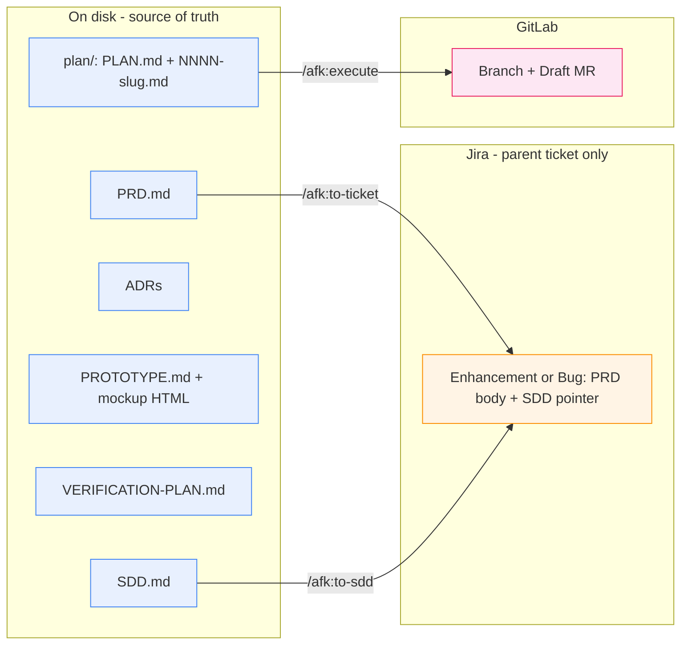
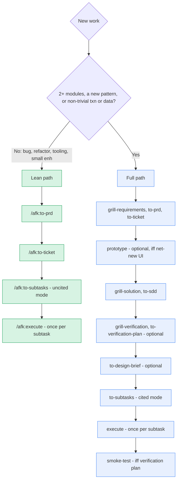
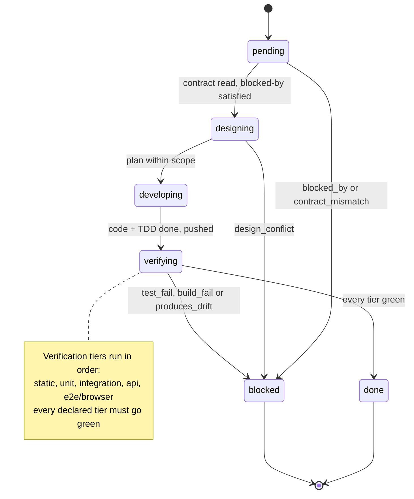
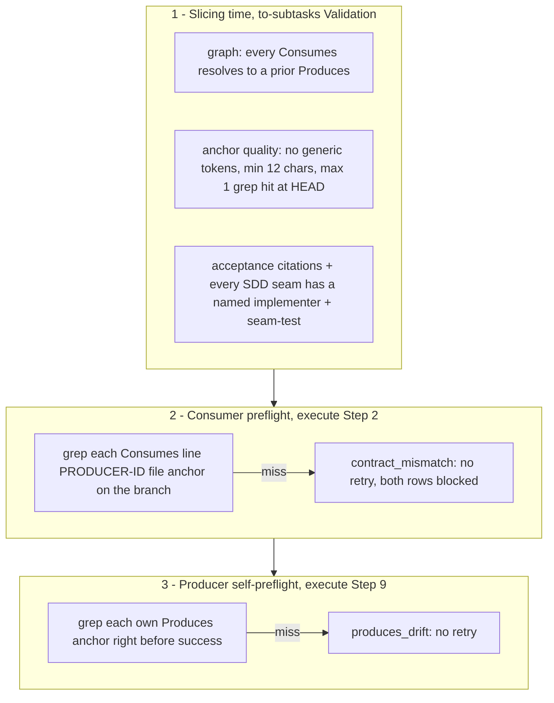

# afk — the away-from-keyboard workflow

A Claude Code **plugin** that turns a raw feature idea into shipped, verified
code through a chain of **interactive** skills. You drive every stage yourself in
a Claude Code session — there is **no autonomous driver**. Each stage leaves a
durable artifact on disk, so the next stage (and the next human) inherits a
written contract instead of a verbal hand-off.

> **New here? Read this top to bottom once.** It explains *why* the workflow is
> shaped this way, the handful of concepts you must hold in your head, and then
> walks one feature end to end. The per-skill catalog and the install snippet are
> further down as reference.

**Credit & inspiration.** This repo is directly inspired by and built upon
[Matt Pocock's AFK Claude Code workflow and skills](https://github.com/mattpocock/skills).
The original idea, the AFK framing, and several skill patterns come from his work
— this repo adapts and extends them for a specific environment. If you find this
useful, go read the upstream source first.

Here it is adapted for the Nakisa **Jira + GitLab + Maven** environment on
Windows. The *work* the chain drives is Java/Maven inside a sibling core-services
checkout; **this repo contains only the skills** (the AFK chain under
`skills/afk/<name>/SKILL.md`, plus a few standalone utility skills under
`skills/utils/<name>/SKILL.md`) and the plugin manifests.

---

## Table of contents

1. [Why AFK](#1-why-afk) — the problem it solves
2. [The mental model](#2-the-mental-model) — five ideas to internalize
3. [The chain at a glance](#3-the-chain-at-a-glance) — the map
4. [Install](#4-install) — one-time setup
5. [Walkthrough: your first feature](#5-walkthrough-your-first-feature) — end to end
6. [Choosing your path](#6-choosing-your-path) — full chain vs. the lean path
7. [Where everything lives](#7-where-everything-lives) — the artifact map
8. [The subtask lifecycle](#8-the-subtask-lifecycle) — how `/afk:execute` works
9. [The cited-mode contract](#9-the-cited-mode-contract) — how drift is caught
10. [Skill reference](#10-skill-reference) — every skill, one paragraph each
11. [Section-ownership invariants](#11-section-ownership-invariants) — don't let edits collide
12. [Conventions & gotchas](#12-conventions--gotchas)

---

## 1. Why AFK (and what the name really means)

**AFK = "away from keyboard."** The original idea behind this workflow is
ambitious: spend the expensive, focused effort **up front** — exploring
requirements and designing the solution thoroughly — and then let agents
**autonomously implement the whole thing with no human in the loop**. You'd settle
the *what* and the *why*, walk away from the keyboard, and come back to finished
code. That's where the name comes from.

**That fully-autonomous vision was never fully realized here** — for a number of
practical reasons (drift, trust, the cost of getting an unattended driver right in
a real Jira + GitLab + Maven monorepo). So be clear-eyed about what this repo
actually delivers:

> A **structured, human-in-the-loop workflow** where the implementation phase is
> *somewhat* automated but still **human-gated** at every load-bearing seam. The
> "AFK" name is kept for continuity with the upstream inspiration, but it does
> **not** accurately describe how this repo works today — you are very much at the
> keyboard.

What you *do* get is still worth the discipline:

- **The hand-off is a file, not a memory.** Every stage emits an artifact (PRD,
  SDD, ADRs, a plan, a verification plan). The next agent reads the contract; it doesn't
  re-derive intent from a chat log.
- **Drift is caught mechanically, not in review.** When the design is settled
  (an SDD exists), the plan slices in *cited mode*: each subtask carries typed
  `Produces`/`Consumes` anchors, and `/afk:execute` greps them before and after
  it works. A signature that drifts from its contract halts the run — it never
  reaches a human reviewer as a surprise.
- **The human stays in the loop at the load-bearing seams.** The skills design,
  draft, implement, and verify; **you** approve the requirements, approve the
  design, review the Draft MR, and merge. Auto-merge is deliberately outside the
  skills' lane.

So what it is **not**: a bot that runs unattended. You invoke each stage, including
`/afk:execute` — once per subtask — and read what it reports before moving on.

---

## 2. The mental model

Five ideas. Hold these and the rest follows.

**① Stages are interactive and you invoke them.** Each skill is a
`/afk:<name>` slash command you run in a Claude Code session. There is no
scheduler. The map in [§3](#3-the-chain-at-a-glance) shows where each stage fits.

**② Artifacts on disk are the source of truth.** The PRD, SDD, ADRs, the
`VERIFICATION-PLAN.md`, and the execution plan all live as files next to the code
they describe. Jira holds **only** the parent Enhancement/Bug — and only two skills
ever write to it (see ④).

**③ The plan is a local contract, not Jira issues.** `/afk:to-subtasks` emits a
`plan/` directory: a `PLAN.md` index (solution map, seam register, live progress
tracker) plus one `NNNN-slug.md` contract per subtask. A subtask's *id* is its
filename stem. `/afk:execute` parses these files and writes back progress. No
subtask ever becomes a Jira issue.

**④ Only two skills touch the tracker.** `/afk:to-ticket` publishes the PRD body
into the parent ticket; `/afk:to-sdd` writes the parent's `## SDD` pointer
section. **Everything else stops at disk or GitLab.** `/afk:execute` pushes
branches + Draft MRs to GitLab but writes no Jira.

**⑤ The human owns the merge.** `/afk:execute` takes a subtask all the way to a
pushed, verified, Draft MR — then **stops**. You review and merge out of band.
Same for the feature gate: `/afk:smoke-test` stamps a feature complete on green
but merges nothing.



---

## 3. The chain at a glance

```mermaid
graph LR
    Grill[/afk:grill-requirements/] --> Prd[/afk:to-prd/] --> Ticket[/afk:to-ticket/] --> AG[/afk:grill-solution/] --> Sdd[/afk:to-sdd/]
    Sdd -->|optional digest| Brief[/afk:to-design-brief/]

    Prd -.->|optional UI mockup| Proto[/afk:prototype/]
    Proto -.->|PROTOTYPE.md feeds design| AG

    Prd -.->|optional verification design| E2E[/afk:grill-verification/]
    Sdd -.->|optional verification design| E2E
    E2E -->|interview settled| VPlan[/afk:to-verification-plan/]

    Sdd --> Sub
    Brief --> Sub
    VPlan -->|VERIFICATION-PLAN.md| Sub

    Sub -->|run once per subtask| Exec[/afk:execute/]
    Exec -->|all subtasks done · gate iff verification plan| Smoke[/afk:smoke-test/]
    Exec -.->|uses| Tdd[/afk:tdd/]

    classDef mand fill:#d7f3e3,stroke:#1b9e58,stroke-width:2px;
    classDef opt fill:#eef1f5,stroke:#90a4ae;
    class Prd,Ticket,Sub,Exec mand;
    class Grill,Proto,AG,Sdd,Brief,E2E,VPlan,Smoke,Tdd opt;
```



The **green** path is the mandatory spine: `/afk:to-prd` → `/afk:to-ticket` →
`/afk:to-subtasks` → `/afk:execute`. Everything in grey is optional design depth
you add for complex features and skip for small ones (see
[§6](#6-choosing-your-path)).

Start where your inputs land: a raw idea enters at `/afk:grill-requirements`; an
existing PRD at `/afk:grill-solution`; an SDD already in hand at `/afk:to-subtasks`.

---

## 4. Install

```text
# inside Claude Code, from the core-services repo root
/plugin marketplace add ./tools/payable/ai-agents/plugins/workflow
/plugin install afk@nak-marketplace
```

To auto-load on every Claude Code launch, add to `~/.claude/settings.json`:

```json
{
  "extraKnownMarketplaces": {
    "nak-marketplace": {
      "source": { "source": "directory", "path": "./tools/payable/ai-agents/plugins/workflow" }
    }
  },
  "enabledPlugins": {
    "afk@nak-marketplace": true
  }
}
```

After editing any `SKILL.md`, run **`/reload-plugins`** to pick up changes
without restarting. Same after `git pull`.

**Teammate install**: the plugin ships inside `core-services`, so a `git pull`
delivers it. Each developer enables it once at **local** scope with the snippet
above (`/plugin marketplace add ./tools/payable/ai-agents/plugins/workflow` →
`/plugin install afk@nak-marketplace`). Directory-source installs are
snapshotted — after a `git pull` that changes a `SKILL.md`, run
`/reload-plugins` (or re-add the marketplace) to refresh.

The dev loop for *this* repo is just: edit a `SKILL.md` → `/reload-plugins`.
There's no build step, no test suite, no Python package.

---

## 5. Walkthrough: your first feature

Here is a complete pass for a **complex** feature (one needing real design). The
commands are slash commands you type in a Claude Code session; the files are what
appears on disk as a result.


**Step by step:**

1. **`/afk:grill-requirements`** — Claude interviews you about the idea,
   challenging it against the domain glossary until the requirements decision
   tree is exhausted. Maintains `GLOSSARY.md`; emits no decision records yet.
2. **`/afk:to-prd`** — synthesizes the conversation into `PRD.md` plus
   requirement-level ADRs. **Local only** — nothing in Jira yet.
3. **`/afk:to-ticket`** — publishes the PRD *content* into the **existing**
   parent ticket as native Jira formatting (ADF), rendering any Mermaid diagrams
   to attached PNGs. Idempotent — re-run when the PRD changes.
4. **`/afk:prototype`** *(optional — only if the feature has net-new UI)* — crafts
   the screens with you interactively, anchored to the **real frontend's**
   components and tokens. Writes self-contained HTML you open and refresh while you
   reshape it in plain language; on settle it captures `PROTOTYPE.md` + the chosen
   HTML sibling to the PRD. Self-gates `no_ui` for backend-only features. The won
   design feeds the next two steps and gives the verification UI journeys a concrete
   screen to trace to. Local-first; an opt-in push mirrors the mockup to
   `claude.ai/design` for stakeholder review.
5. **`/afk:grill-solution`** — top-down design interview across 8 layers (L1
   system topology → L8 tactical patterns); every non-trivial decision gets a
   rationale and ≥2 weighed alternatives.
6. **`/afk:to-sdd`** — synthesizes the design into `SDD.md` + per-decision design
   ADRs, and writes the parent ticket's `## SDD` pointer section.
7. **`/afk:grill-verification`** *(optional but recommended)* — designs the
   feature's verification scenarios with you: the real end-user **browser
   journeys**, plus (once the SDD exists) the **API scenarios** that prove the
   backend contract for API/MCP callers who bypass the UI. It **interviews only** —
   walking them concretely routinely surfaces PRD/SDD gaps, surfacing them is a
   feature, not a side effect.
8. **`/afk:to-verification-plan`** — synthesizes that conversation into
   `VERIFICATION-PLAN.md` (UI journeys now; API scenarios too once the SDD exists,
   else deferred and appended on a re-run).
9. **`/afk:to-subtasks`** — slices everything into `plan/`. Because an SDD exists
   it slices in **cited mode** (typed contracts). Because a `VERIFICATION-PLAN.md`
   exists it also seeds a `## Feature smoke gate` and a terminal build subtask per
   modality (`NNNN-smoke-e2e` for the UI journeys, `NNNN-smoke-api` for the API
   scenarios).
10. **`/afk:execute {NNNN-slug}`** — you run this **once per subtask**, in
    dependency order, from a worktree on the parent branch. It designs, develops
    under TDD, turns every verification tier green, pushes, updates the Draft MR,
    advances the tracker — then stops. You review and merge each MR.
11. **`/afk:smoke-test`** — after every subtask is `done`, runs the integrated
    verification suites — browser journeys **and** API contracts — against a running
    app and stamps `Feature: complete` on green across both.

For a **small** feature you collapse this to the lean path — see next section.

---

## 6. Choosing your path

The optional design layer earns its cost on complex work and is pure overhead on
trivial work. Decide up front:



| | **Lean path** | **Full path** |
|---|---|---|
| When | bug / refactor / tooling / small enhancement | new complex feature, new pattern, multi-module |
| Design docs | none | SDD + ADRs |
| UI prototype | none | optional via `/afk:prototype` (iff net-new UI) |
| Slice mode | **uncited** (PRD-only, human-gated) | **cited** (typed `Produces`/`Consumes`, mechanically enforced) |
| verification gate | usually none | optional via `/afk:grill-verification` → `/afk:to-verification-plan` (UI + API) |

**Mode is set by what's upstream**, not by a flag: a PRD **with** an SDD slices
cited; a PRD **alone** slices uncited.

---

## 7. Where everything lives

Every design artifact sits next to the code it describes, under the ticket's
spec folder (or `tasks/{ENH-ID}/` for tooling work that has no service home):

```text
{service}/src/main/resources/specs/{year}r{release}/{ENH-ID}/
├── PRD.md                     ← /afk:to-prd        (published to Jira by /afk:to-ticket)
├── PROTOTYPE.md               ← /afk:prototype     (local; optional; canonical record of the won UI)
├── prototype/                 ← /afk:prototype     (the chosen self-contained mockup HTML)
├── SDD.md                     ← /afk:to-sdd        (its ## SDD pointer goes to Jira)
├── VERIFICATION-PLAN.md       ← /afk:to-verification-plan (local only; UI journeys + API scenarios)
├── DESIGN-BRIEF.md            ← /afk:to-design-brief (local only, optional)
├── GLOSSARY.md                ← /afk:grill-requirements
├── adr/
│   ├── requirements/NNNN-*.md ← /afk:to-prd   (what / why)
│   └── design/NNNN-*.md       ← /afk:to-sdd   (how)
└── plan/                      ← /afk:to-subtasks
    ├── PLAN.md                  (index: solution map, seam register, progress tracker, smoke gate)
    └── NNNN-slug.md             (one contract per subtask)
```

**Two ADR tiers, separate subfolders, separate numbering** — requirement ADRs
(`adr/requirements/`, owned by `/afk:to-prd`) never share numbering with design
ADRs (`adr/design/`, owned by `/afk:to-sdd`).

The verification suites themselves are **not** in this repo — they live in the
core-services tree under `11700-payable/verification`, a multi-modal tree:
`ui-e2e/` (the Cucumber + Playwright browser module), `api/` (direct-REST
`node:test` contracts), and `core/` (shared, dependency-free auth/base-URL/poll
primitives both import; `api → core`, `ui-e2e → core`, `core → nothing`). The
authoring recipes are canonical at **`11700-payable/verification/ui-e2e/AUTHORING.md`**
and **`11700-payable/verification/api/AUTHORING.md`** (versioned with the
verification code so they can't drift). AFK skills only *point* at those recipes —
they never embed a copy.

---

## 8. The subtask lifecycle

`/afk:execute` runs **one** subtask per invocation. It owns exactly one cell of
the `PLAN.md` progress tracker (the row it's working) plus that subtask file's
`## Implementation Notes` — and nothing else. The states:



The happy path is `pending → designing → developing → verifying → done`. Any
structured failure parks the row at `blocked(<reason>)` and reports a matching
`OUTCOME:` line. The reasons:

| Outcome | Meaning | Where you go next |
|---|---|---|
| `success` | every tier green, pushed, MR updated, row `done` | review + merge the MR |
| `blocked_by` | a `## Blocked by` prerequisite isn't `done` yet | run the prerequisites first |
| `test_fail` / `build_fail` | a verification tier stayed red after one retry | fix the impl |
| `contract_mismatch` | a consumed upstream `Produces` is missing/drifted | fix the **producer** subtask |
| `produces_drift` | this subtask didn't deliver its own declared `Produces` | fix impl or re-slice |
| `design_conflict` | a binding SDD/ADR decision is wrong/infeasible | `/afk:grill-solution` → superseding ADR |
| `timeout` / `other` | wall-clock cap / unexpected | inspect and re-run |

Then **it stops at CR/Merge** — reviewing and merging the Draft MR is yours.

---

## 9. The cited-mode contract

When an SDD is present, the plan slices in **cited mode** and each subtask
carries a typed contract. The point: a producer/consumer signature mismatch is
caught by a `grep`, at a precise checkpoint, on the *right* subtask — never as a
silent integration surprise.



`## Produces` is mandatory on **every** cited subtask — even a leaf with no
consumer — because it quadruples as: the reviewer's cheat-sheet, the `static`-tier
grep target, the producer self-preflight target, and the next subtask's consumer
preflight target.

On a binding-decision break (an SDD §8 mandate that's wrong or infeasible),
`/afk:execute` exits `design_conflict` and routes you to `/afk:grill-solution`
for a superseding ADR — it never silently substitutes a different interface.

---

## 10. Skill reference

### Mandatory chain

- **`/afk:to-prd`** — turns conversation context into a `PRD.md`, plus
  requirement-level ADRs (decisions clearing the *hard-to-reverse + surprising +
  real-trade-off* bar) under `.../{ENH-ID}/adr/requirements/`. **Local artifacts
  only** — does not touch the tracker.
- **`/afk:to-ticket`** — publishes the full PRD **content** into its **existing**
  parent ticket as native Jira ADF (headings, tables, code, Mermaid → attached
  PNGs embedded inline). **Idempotent**: re-run on PRD change, updates in place,
  preserves product-owner prose outside the managed block. Publishes PRD content
  only — never the SDD/Brief. Refuses without `parent_key`; sets no label,
  creates no branch. Driven by `skills/afk/to-ticket/scripts/publish_prd.py`.
- **`/afk:to-subtasks`** — slices the PRD (+ SDD + ADRs when present) into the
  local `plan/`. **Cited mode** (SDD present) emits `## Design refs`, `## Seams`,
  typed `## Produces`/`## Consumes`, and a `## Conflict procedure` per subtask.
  **Uncited mode** (PRD only) is human-gated. Every subtask declares tiered
  verification (static → unit → integration → api → e2e/browser). A
  `VERIFICATION-PLAN.md` also makes it seed the `## Feature smoke gate` + a
  terminal build subtask per modality (`NNNN-smoke-e2e` for UI journeys,
  `NNNN-smoke-api` for API scenarios). **No Jira.**
- **`/afk:execute`** — you run it once per subtask, in a worktree on the parent
  branch (`mvu/afk/{ticket-id}`). Reads the contract, advances the tracker
  (`designing → developing → verifying → done`), turns every verification tier
  green under TDD, commits + pushes, updates the Draft MR, then **stops at
  CR/Merge**. Touches GitLab + the local plan, **not Jira**. Reports a structured
  outcome (see [§8](#8-the-subtask-lifecycle)).

### Optional design layer

*(Recommended for new complex features touching ≥2 modules / introducing patterns
/ non-trivial transactions or data; skip for small enhancements, bugs, refactors,
tooling.)*

- **`/afk:grill-requirements`** — interviews you about a raw idea until the
  requirements decision tree is exhausted, challenging it against the domain
  glossary. Maintains `GLOSSARY.md`; emits **no** decision records (those come
  from `/afk:to-prd`).
- **`/afk:prototype`** *(after `/afk:to-prd`; only if net-new UI)* — an interactive
  UI-crafting loop, neither a grill nor a one-shot producer. Reads the PRD User
  Stories, anchors to the **real frontend's** components + tokens, and writes
  self-contained HTML you open in a browser and **refresh** while you reshape it in
  plain language. Converges from optional divergent sketches to one design.
  **Self-gates `no_ui`** for backend/API/refactor features. **Durable-lite**: the
  won direction becomes `PROTOTYPE.md` + the chosen HTML sibling to the PRD
  (traceable to User Stories, so `/afk:grill-verification`'s UI journeys trace to
  it); losing scaffolding is discarded. **Local-first** — the in-repo files are
  canonical; a **frictionless opt-in** push mirrors the mockup to a persistent,
  team-shareable `claude.ai/design` project (share-only, never the source of
  truth). Touches no tracker. Feeds `/afk:grill-solution` (UX decisions) and
  `/afk:grill-verification` (the screen its journeys trace to).
- **`/afk:grill-solution`** — top-down design interview across 8 layers (L1
  topology → L8 tactical patterns); every non-trivial decision gets a rationale +
  ≥2 alternatives. Produces **no** documents — feeds `/afk:to-sdd`.
- **`/afk:to-sdd`** — synthesizes the design into `SDD.md` + per-decision design
  ADRs under `adr/design/`, and owns the parent ticket's `## SDD` pointer
  section. Mandates per-layer visualizations (Mermaid, tables) so reviewers can
  scan vertically.
- **`/afk:to-design-brief`** — synthesizes PRD + SDD + ADRs into a tight 1-2 page
  `DESIGN-BRIEF.md` (one money-shot diagram, a decision digest, a
  stakeholder-impact table). **Repo-only**; shared with stakeholders out of band.
  Refuses to invent decisions or to emit while the SDD has executor-blocking open
  questions.
- **`/afk:grill-verification`** — interviews you to design the feature's
  verification scenarios across two modalities: **UI journeys** (the real browser
  flows that decide "this feature works", traced to User Stories) and **API
  scenarios** (direct-REST checks that prove the backend contract for API/MCP
  callers who bypass the UI, traced to SDD §3 endpoints). A grilling skill like
  `/afk:grill-requirements` and `/afk:grill-solution` — it **writes no file**;
  walking the scenarios concretely surfaces PRD/SDD gaps. UI journeys can be
  designed after `/afk:to-prd`; API scenarios need the SDD's endpoint contracts,
  so they're added after `/afk:to-sdd` (a pre-SDD run defers them).
- **`/afk:to-verification-plan`** — synthesizes that conversation into
  `VERIFICATION-PLAN.md` sibling to the PRD (no interview — writes what the grill
  settled). UI journeys now; API scenarios too once the SDD exists, else a deferred
  placeholder that a post-SDD re-run **appends** to (preserving the UI section).
  Its plan is what makes `/afk:to-subtasks` emit the smoke gate + the per-modality
  build subtasks. **Repo-only.** The build recipes are **not** here — they're
  canonical at `11700-payable/verification/ui-e2e/AUTHORING.md` and
  `11700-payable/verification/api/AUTHORING.md`, only pointed at.

### Optional feature gate

- **`/afk:smoke-test`** — the **feature-level** completion gate, distinct from the
  per-subtask `api` / `e2e/browser` tiers. It **only executes** already-built
  scenarios — it authors nothing. Present only when the feature has a `## Feature
  smoke gate` (a `VERIFICATION-PLAN.md` drove build subtasks). After **every**
  subtask is `done`, it runs the integrated suites — the browser UI journeys
  (`npm run smoke`) **and** the API contracts (`node --test`) — against a
  **running app** and, only on green across both, stamps `Feature: complete` in
  `PLAN.md`. The specs are built reuse-first into the existing
  `11700-payable/verification` tree (`ui-e2e` Cucumber + Playwright module; `api`
  `node:test` files) by the terminal `NNNN-smoke-e2e` / `NNNN-smoke-api` subtasks
  (reviewed as code). Env-limited scenarios (e.g. `@sap`) are tagged and excluded
  from the green verdict. The same suites are reused by CI / scheduled / manual
  runs. Merges nothing, touches no Jira. Reports `smoke_green` / `smoke_fail` /
  `env_unreachable` / `preconditions_unmet` / `no_gate`.

### Tooling

- **`/afk:tdd`** — red-green-refactor doctrine, invoked from `/afk:execute`
  Step 5. Not run standalone.
- **`/afk:fix`** — thin orchestrator for fixing a verification-phase or reported
  bug: pulls ticket/repro context, delegates root-cause + regression test to
  `/afk:diagnose`, adds proportional `api`/`e2e` coverage, and — in a
  feature-building session — reconciles the load-bearing artifacts (PRD / SDD /
  ADRs / VERIFICATION-PLAN) so the source of truth stays true. Commits nothing.
  Run standalone for ad-hoc bugs, or routed from `/afk:execute` Step 8 when a
  verification tier stays red.

### Utility skills (not part of the AFK chain)

General-purpose skills that ship in the same plugin for convenience but are
**not** stages of the workflow. They live under `skills/utils/` and can be
invoked any time, in any project.

- **`/afk:caveman`** — ultra-compressed "caveman" response mode; cuts token use
  while keeping technical accuracy.
- **`/afk:diagnose`** — disciplined diagnosis loop for hard bugs / perf
  regressions (build a feedback loop → reproduce → hypothesise → instrument →
  fix → regression-test).
- **`/afk:draw-charts`** — render-safe Mermaid/diagrams; steers around the
  constructs that break renderers and render-checks before shipping.
- **`/afk:glossary`** — domain-vocabulary steward; the vocabulary-only subset of
  `/afk:grill-requirements`. Audits an existing `GLOSSARY.md` for ambiguity,
  synonyms, vague terms, and code drift, or grills new terminology one question
  at a time. Owns the `GLOSSARY-MAP.md` + per-service `GLOSSARY.md` setup and the
  canonical `GLOSSARY-FORMAT.md` (which `/afk:grill-requirements` defers to);
  writes after approval. Does not grill requirements or emit ADRs.
- **`/afk:handoff`** — compact the current conversation into a handoff doc for a
  fresh agent to pick up.
- **`/afk:todo`** — quick per-project todo list at `<cwd>/.claude/TODO.md` that
  survives sessions.
- **`/afk:to-code-walkthrough`** — top-down narrative walkthrough of a GitLab MR
  (`<MR-URL>`) or an existing code area (`path:` / `symbol:`); caveman prose +
  Mermaid, no verdicts. MR mode needs `glab` on PATH (uses the bundled
  `scripts/fetch-mr.sh`); code mode is fully standalone.

---

## 11. Section-ownership invariants

Several Markdown surfaces carry mixed human + automated edits. The rule is
strict ownership so edits never collide:

- **Parent Enhancement description** — PRD content (authored on disk by
  `/afk:to-prd`) is published by `/afk:to-ticket` inside an AFK-managed sentinel
  block; `## SDD` (when present) is owned by `/afk:to-sdd`; the Design Brief is
  **not** published to the ticket; other prose is the human's. Subtask progress
  is **not** spliced into the ticket — it lives in `plan/PLAN.md`.
- **MR description** — the block bracketed by `<!-- afk:subtasks:start -->` /
  `<!-- afk:subtasks:end -->` is auto-maintained by `/afk:execute`; everything
  outside is preserved verbatim.
- **Local plan (`plan/`)** — `/afk:execute` owns only the working subtask's
  `Status` cell (+ the `Last updated` date) and that subtask file's
  `## Implementation Notes` block. **`/afk:smoke-test`** owns a *disjoint* slice
  of the same `PLAN.md`: the `## Feature smoke gate` table's `Status` cells, its
  `Last run` line, and the header `Feature:` line — nothing else. All contract
  sections must round-trip losslessly.

> **Lockstep rule for contributors.** The plan is the load-bearing interface
> between `/afk:to-subtasks` (emitter) and `/afk:execute` (parser). If you add,
> rename, or change a contract section, update **both** skills in the **same
> commit**. A section read by `/afk:smoke-test` (a gate field) must be changed in
> lockstep with that skill too — and a smoke-gate field's shape touches all three
> (`to-verification-plan` emitter, `to-subtasks` seeder, `smoke-test` reader).

---

## 12. Conventions & gotchas

- **Branch names** must match the GitLab regex `^[a-z0-9][a-z0-9/\-\.]*$`. The
  `mvu/afk/{enh_id_lower}` pattern is load-bearing for `/afk:execute`'s push.
- **`/afk:execute` is the *only* place the agent commits autonomously.** No other
  context auto-commits. No `--no-verify`, no `--force`, no global git config
  changes.
- **Never alter the DB directly.** Add JPA entities and let liquibase-hibernate7
  pick them up; no hand-written `UpgradeGroup` / `db/changelog/*`. `/afk:execute`
  Step 9 enforces this with a pickup-verification run.
- **Cross-module edits need a marker comment** — a ticket-prefixed line like
  `// {TICKET-ID}: shared helper added` in the added hunks of any file outside
  the home module.
- **Re-run `/afk:to-ticket`** after the PRD changes (it's idempotent). It's the
  only design-chain skill that writes to Jira, alongside `/afk:to-sdd`'s pointer.
- **The dev loop for this repo**: edit a `SKILL.md` → `/reload-plugins`. Nothing
  to build.

---

**Parent ticket:** P2P-1220 (Jira). For the contributor-facing internals (the
lockstep contract, the three-checkpoint enforcement, the tracker boundary), see
[`CLAUDE.md`](CLAUDE.md).
