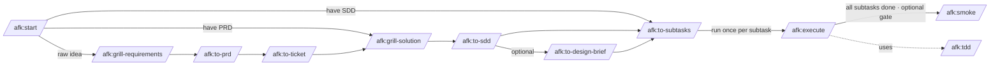

# afk

A Claude Code **plugin** for the async-from-keyboard (AFK) workflow on the
Nakisa core-services platform: a chain of skills that take a raw idea through
grilling → PRD → architecture → SDD → a local execution plan → execution →
an optional feature smoke gate, all run **interactively** in Claude Code
sessions. There is no autonomous driver — you invoke each stage yourself,
including execution. The plan and its progress are local files (a `plan/`
directory), not Jira issues.

Inspired by [Matt Pocock's AFK Claude Code workflow](https://github.com/mattpocock/skills),
adapted for the Nakisa Jira + GitLab + Maven environment on Windows. The *work*
the chain drives is Java/Maven inside a sibling core-services checkout; this
repo contains only the skills.

## The chain



Run `/afk:start` first if you're unsure where to begin — it prints this map and
routes you to the right entry skill.

## Install (one-time per machine)

```
# inside Claude Code, from any session
/plugin marketplace add C:\Users\mvu\PersonalProjects\afk    # or your local path
/plugin install afk@afk-marketplace
```

To auto-load on every Claude Code launch, add to `~/.claude/settings.json`:

```json
{
  "extraKnownMarketplaces": {
    "afk-marketplace": {
      "source": { "source": "directory", "path": "C:\\Users\\mvu\\PersonalProjects\\afk" }
    }
  },
  "enabledPlugins": {
    "afk@afk-marketplace": true
  }
}
```

After editing any `SKILL.md`, run `/reload-plugins` to pick up changes without
restarting. Same after `git pull`.

For teammate install (private repo, collaborator access required):
`/plugin marketplace add midnightblur/afk-driver` → `/plugin install
afk@afk-marketplace`.

## The skills

**Mandatory chain** (`/afk:to-prd` → `/afk:to-ticket` → `/afk:to-subtasks` →
`/afk:execute`):

- **`/afk:to-prd`** — turns conversation context into a PRD, plus
  requirement-level ADRs (behaviour / scope decisions that clear the
  hard-to-reverse + surprising + real-trade-off bar) under
  `.../{ENH-ID}/adr/requirements/NNNN-*.md`. Writes to
  `{service}/src/main/resources/specs/{year}r{release}/{ENH-ID}/PRD.md`
  (or `tasks/{ENH-ID}/PRD.md` for tooling work). **Produces local artifacts
  only** — it does not touch the issue tracker (that's `/afk:to-ticket`'s job).
- **`/afk:to-ticket`** — publishes the full PRD **content** into its parent
  ticket as native Jira formatting (ADF): headings, lists, tables, code, and any
  `mermaid` diagrams rendered to PNGs locally, attached, and embedded inline so
  they're viewable in Jira. **Idempotent** — re-run when `PRD.md` changes and it
  updates in place (no duplicate sections or attachments). Preserves
  product-owner content already in the ticket unless it's barebone. Publishes
  PRD content only — never the SDD or lower-level design. **Requires an existing
  parent** (does not create it); sets no label and no branch. The only
  design-chain skill that writes to the tracker; the work is done by the bundled
  `skills/to-ticket/scripts/publish_prd.py` engine for deterministic formatting.
- **`/afk:to-subtasks`** — slices a PRD (and the accompanying SDD + ADRs,
  when present) into a **local execution plan**: a `plan/` directory
  sibling to the PRD, with a `PLAN.md` index (solution map, seam
  register, live progress tracker) and one `NNNN-slug.md` contract per
  subtask. **No Jira.** **Cited mode** (default when an SDD exists) emits
  `## Design refs`, `## Seams`, typed `## Produces`/`## Consumes`, and a
  `## Conflict procedure` per subtask, so the implementing agent inherits
  a binding contract — not just a feature ask. **Uncited mode** is
  human-gated for small features / bugs / refactors / tooling. Every
  subtask declares **tiered verification** (static → unit → integration →
  e2e/browser).
- **`/afk:execute`** — you run this yourself, once per subtask, in a session on
  the parent ticket's branch. Reads the subtask's local contract, advances its
  row in `plan/PLAN.md` (`designing` → `developing` → `verifying` → `done`),
  turns **every declared verification tier** green under TDD, commits + pushes,
  updates the Draft MR, then **stops at CR/Merge** — you review and merge out of
  band. Touches GitLab + the local plan, **not Jira**. Reports a structured
  outcome (`success` / `test_fail` / `contract_mismatch` / `produces_drift` /
  `design_conflict` / …).
- **`/afk:smoke`** *(optional feature gate)* — the **feature-level** completion
  gate, distinct from the per-subtask `e2e/browser` tier. Runs only when
  `/afk:to-subtasks` emitted a `## Feature smoke gate` (a per-feature human
  call). After **every** subtask is `done`, it runs the integrated browser smoke
  suite — the cross-subtask user journeys — against a **running app**, and only
  on green stamps `Feature: complete` in `plan/PLAN.md`. The specs themselves are
  authored as a terminal `NNNN-smoke-e2e` subtask (reviewed code in
  `11700-payable/e2e/<feature>`), not by this skill. The same suite is then
  reused by CI / scheduled verification / manual sanity runs. Merges nothing,
  touches no Jira. Reports `smoke_green` / `smoke_fail` / `env_unreachable` /
  `preconditions_unmet` / `no_gate`.

**Optional design layer** (recommended for new complex features touching
≥2 modules / introducing patterns / non-trivial transactions or data;
skip for small enhancements, bugs, refactors, tooling):

- **`/afk:grill-requirements`** — interviews the user about a raw idea or plan
  until the requirements decision tree is exhausted, challenging it against the
  project's domain glossary. Maintains `GLOSSARY.md` inline (the shared
  understanding being built) but produces NO decision records — those are
  emitted downstream by `/afk:to-prd` (requirement ADRs) and `/afk:to-sdd`
  (design ADRs). Pair with `/afk:to-prd` afterward to synthesize.
- **`/afk:grill-solution`** — interviews the user top-down across 8 layers
  (L1 system topology → L8 tactical patterns) until every non-trivial
  decision has a rationale and ≥2 alternatives weighed. Does NOT produce
  documents.
- **`/afk:to-sdd`** — synthesizes the conversation into `SDD.md` plus
  per-decision design ADRs, sibling to the PRD:
  `{service}/src/main/resources/specs/{year}r{release}/{ENH-ID}/SDD.md`
  and `.../adr/design/NNNN-*.md` (distinct from `/afk:to-prd`'s
  `adr/requirements/`). Owns the `## SDD` section of the parent
  Enhancement description. Mandates visualizations (Mermaid diagrams,
  tables) per layer so reviewers can scan vertically.
- **`/afk:to-design-brief`** — synthesizes PRD + SDD + ADRs into a tight
  1-2 page `DESIGN-BRIEF.md` sibling to the PRD/SDD. One money-shot
  diagram, 5-10 row decision digest, stakeholder-impact table. **Repo-only
  — does not touch the tracker**; shared with stakeholders out of band.
  Strict synthesis: refuses to invent decisions and refuses to emit when
  the SDD has executor-blocking open questions. Use for stakeholder
  reviews and as a map before reading the full SDD.

**Tooling**: `/afk:tdd` — red-green-refactor doctrine, invoked from
`/afk:execute` Step 5.

> **Cited-mode contract.** When `/afk:to-subtasks` slices in cited mode it
> emits six additional subtask sections — `## Design refs`, `## Seams`,
> `## Produces`, `## Consumes` (when `Blocked by` is non-empty),
> `## Parent SDD`, `## Conflict procedure`. The contract is enforced at
> three checkpoints:
>
> 1. **Slicing time** (`/afk:to-subtasks` Validation): graph validation
>    (every `## Consumes` line resolves to a prior `## Produces`) +
>    anchor quality (forbidden-token check, ≥12-char length, trial
>    grep against `{file}` at HEAD must return ≤1 match — refuse on
>    ambiguity) + Acceptance-citation + seam-coverage (every SDD §9b
>    seam has a named implementer carrying its seam-test). Catches drift
>    at declaration time.
> 2. **Consumer preflight** (`/afk:execute` Step 2): before any work, grep
>    every `## Consumes` line `{PRODUCER-ID} {file}#{anchor}` on the
>    branch — a missing artifact or signature-divergent anchor exits
>    `contract_mismatch` (no retry; recorded on consumer AND producer
>    subtask files + both tracker rows `blocked`).
> 3. **Producer self-preflight** (`/afk:execute` Step 9): right before
>    declaring success, grep every own `## Produces` anchor on the
>    branch. Missing or signature-divergent anchor exits
>    `produces_drift` (no retry; route the human to impl-vs-slice fix).
>
> On a binding-decision break (SDD §8 mandate is wrong/infeasible),
> `/afk:execute` exits `design_conflict` and routes to `/afk:grill-solution`
> for a superseding ADR. `## Produces` is mandatory on every cited subtask,
> even leaves with no consumer — it doubles as the reviewer's cheat-sheet,
> the `static`-tier grep target, AND the next subtask's preflight target.

## Section ownership invariants

Mixed human + automated edits live in several Markdown surfaces. Don't let
them collide:

- **Parent Enhancement description**: the PRD content (authored on disk by
  `/afk:to-prd`) is published by `/afk:to-ticket` inside an AFK-managed
  block; `## SDD` (when present) is owned by `/afk:to-sdd`; the Design Brief
  is **not** published to the ticket (`/afk:to-design-brief` is repo-only);
  other prose belongs to the human. Subtask progress is **not** spliced into
  the ticket — it lives in the local `plan/PLAN.md` tracker.
- **MR description**: the block bracketed by `<!-- afk:subtasks:start -->`
  / `<!-- afk:subtasks:end -->` is auto-maintained by `/afk:execute`;
  everything outside is preserved verbatim.
- **Local plan (`plan/`)**: `/afk:execute` owns only the PLAN.md progress
  tracker's `Status` cell for the subtask it runs (+ the `Last updated`
  date) and that subtask file's `## Implementation Notes` block. The
  contract sections must round-trip losslessly. If `/afk:to-subtasks` and
  `/afk:execute` add or change a section, update both the emitter
  (`/afk:to-subtasks` "Subtask contract") and the parser (`/afk:execute`
  Step 1) together. **`/afk:smoke`** owns a disjoint slice of the same file:
  the `## Feature smoke gate` table's `Status` cells, its `Last run` line, and
  the header `Feature:` line — nothing else.
