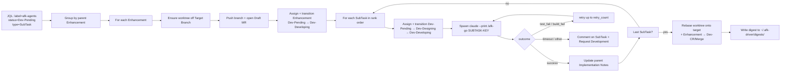

# afk-driver

Async-from-keyboard driver for the Nakisa core-services platform. Drains
`afk-agents`-labelled Jira SubTasks under their parent Enhancement, opens a
Draft MR, spawns a fresh Claude Code session per SubTask via the `/afk-go`
skill, transitions tickets through `Dev-Pending → Dev-Designing →
Dev-Developing → Dev-CR/Merge`, and produces a morning digest.

Bootstrapped under [P2P-1220](https://nakisa.atlassian.net/browse/P2P-1220).
Design rationale lives in [`PRD.md`](./PRD.md).

## Quick start

Prerequisites: `glab`, `mvn`, `node`, `claude` (≥ the version supporting
`--print --dangerously-skip-permissions`), `git`, `python` (≥ 3.11).

```powershell
# from the repo root, inside the worktree containing the AFK driver code
pip install -e tools/payable/afk

# env (one-shot per shell session)
$j = (Get-Content $env:USERPROFILE\.claude.json -Raw | ConvertFrom-Json).mcpServers.jira.env
$env:JIRA_BASE_URL  = $j.JIRA_BASE_URL
$env:JIRA_EMAIL     = $j.JIRA_EMAIL
$env:JIRA_API_TOKEN = $j.JIRA_API_TOKEN
$env:GITLAB_TOKEN   = (glab auth status -t 2>&1 | Select-String 'Token found:\s*(\S+)').Matches.Groups[1].Value

# drain one pass
python -m afk_driver --label afk-agents --project P2P --digest-out auto
```

End-to-end smoke procedure: [`SMOKE.md`](./SMOKE.md).

## What it does, in one pass



## Modules

| Module | Responsibility |
|---|---|
| `subtask_template.py` | Parser/emitter for the SubTask Markdown contract (`## Goal / Scope / Acceptance / Test command / Parent PRD / Blocked by / Implementation Notes`). Round-trip lossless. |
| `scope_enforcer.py` | Pure function `(diff, scope_globs, forbidden, home_module, marker) → list[Violation]`. Catches out-of-scope edits, forbidden patterns (`UpgradeGroup*.java`, `db/changelog/**`, `PreDbMigration*`), and cross-module edits without a JIRA-prefixed marker comment. |
| `config.py` | `DriverConfig` dataclass + TOML override. Defaults: project→service map, `customfield_13706` Target Branch field, `MASTER → master` value map, forbidden patterns, marker template, wall-clock cap (3600s), retry count (3), worktree/log/digest roots under `~/.afk-driver/`, `dev_cr_merge_gate_fields`, `mr_assignee`. |
| `worktree_manager.py` | Per-Enhancement git worktree lifecycle. `ensure / publish_branch / validate_state / rebase_onto_target`. Branch name pattern `mvu/afk/{enh_id_lower}` (GitLab regex `^[a-z0-9][a-z0-9/\-\.]*$`). |
| `jira_client.py` | REST client. `search`, `get_enhancement_fields`, `list_transitions`, `transition` (by name), `update_implementation_notes` (idempotent splice), `set_fields`, `assign`, `get_my_account_id`, `get_issue_description_markdown` (ADF→Markdown for the SubTask parser). |
| `gitlab_client.py` | `glab` CLI wrapper. `find_mr_by_branch / open_draft_mr / update_subtasks_checklist`. Auto-maintained block bracketed by `<!-- afk:subtasks:start/end -->` HTML comments preserves human edits to the rest of the description. |
| `runner.py` | Orchestrator. One drain pass: `Runner.one_pass()`. |
| `digest_writer.py` | Emits `RunRecord` as L4 morning Markdown. |
| `cli.py` | `python -m afk_driver` entry. Wires real clients into Runner. Spawns `claude --print --dangerously-skip-permissions "/afk-go SUBTASK"` per SubTask. |

All I/O is dependency-injected so the runner integration tests (12) drive
fakes in <0.2s. Real-client wiring lives only in `cli.py`.

## Configuration

Defaults are in `config.defaults()`. Override via `~/.afk-driver/config.toml`:

```toml
wall_clock_cap_seconds = 1800
retry_count = 2
mr_assignee = "your.gitlab.handle"

[project_service_map]
P2P = "11700-payable"

[target_branch_value_map]
MASTER = "master"
FINCORE_RELEASE = "fin-core/release"

[dev_cr_merge_gate_fields]
merge_request_link = "customfield_12700"
sred_eligibility = "customfield_14005"
time_estimation = "customfield_14006"
sred_rationale = "customfield_14003"
```

## Skills

The driver leans on three Claude Code skills (live at `~/.claude/skills/`,
not in this repo):

- **`/to-prd`** — turns conversation context into a PRD. AFK adaptation:
  writes to `{service}/src/main/resources/specs/{year}r{release}/{ENH-ID}/PRD.md`
  (or `tools/{group}/{tool}/PRD.md` for tooling work). Owns the `## PRD`
  section of the parent Enhancement description; AFK driver owns
  `## Implementation Notes (auto-maintained)`.
- **`/prd-to-subtasks`** — slices a PRD into Jira SubTasks under the parent
  Enhancement, each with the structured Markdown contract and the `afk-agents`
  label.
- **`/afk-go`** — invoked by the driver in the spawned session; takes one
  SubTask from `Dev-Pending` to `Dev-CR/Merge`, populates the gate fields
  (SRED Eligibility, Time, Rationale, MR link), and updates the parent's
  Implementation Notes.

## Tests

```
cd tools/payable/afk
python -m pytest -v
```

89 tests covering: subtask_template parser/emitter (round-trip), scope_enforcer
(8 fixtures), config (defaults + TOML override), worktree_manager (real
temp-repo integration), jira_client (HTTP fake), gitlab_client (subprocess
fake), runner (12 integration tests against in-memory fakes), digest_writer,
cli (subprocess invocation contract).

## Limitations / known gaps

- **No system-wide install.** Run from a checkout that has `pip install -e
  tools/payable/afk` applied; the spawned afk-go session needs `afk_driver`
  importable from its cwd.
- **No CI / scheduled run.** `python -m afk_driver` is invoked manually
  (cron / Task Scheduler is up to the operator).
- **Acceptance checkboxes are not auto-flipped.** `- [ ]` items in the
  SubTask / Enhancement description stay unchecked even on success — see
  [P2P-1232](https://nakisa.atlassian.net/browse/P2P-1232).
- **Multi-SubTask drain not yet exercised live.** The smoke run was
  one-SubTask. Loop logic (rebase + Enhancement transition only after the
  last SubTask) is unit-tested with fakes but never seen live.
- **Failure paths only unit-tested.** `test_fail` retry, `build_fail`,
  `timeout`, `rebase conflict`, mid-run aborts — fakes only.

## Failure modes & recovery

- **Preflight hard-fail** (missing tool / token / PRD path) → fix env, rerun.
- **Parent not in `Dev-Pending` / `Dev-Developing`** → driver skips the
  Enhancement. Transition the parent into a runnable state first.
- **Rebase conflict on the post-last-SubTask rebase** → driver posts a
  comment on the Enhancement and exits clean; resolve manually.
- **Claude session timeout (1h cap)** → recorded as `timeout` in the digest;
  the SubTask returns to `Dev-Pending`.

If a run hangs and Jira state is partially advanced, the smoke runbook in
[`SMOKE.md`](./SMOKE.md) (§ "Failure modes to watch for") covers manual
recovery.

## Origin

Inspired by Matt Pocock's AFK Claude Code workflow, adapted to the Nakisa
Jira + GitLab + Maven monorepo on Windows. See `PRD.md` § "AFK adaptation
(core-services)".
