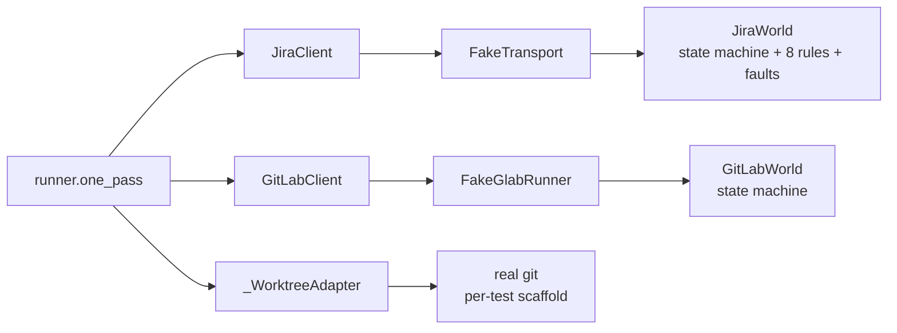

# Testing the AFK driver

Three layers of automated coverage plus one manual smoke. Each layer answers a
different question, and none of them subsumes the next.

| Layer | Files | Touches | Catches |
|---|---|---|---|
| Unit tests | `tests/test_*.py` (excl. `test_smoke.py`, `tests/scenarios/`) | In-process pure code | Logic bugs in `runner.py`, parsers, splicers, config |
| Scenario harness | `tests/scenarios/test_phase{1,2,3}_*.py`, `test_standalone_runner.py` | Real `JiraClient` + `GitLabClient` over **fake transports**; real `_WorktreeAdapter` over a **per-test git scaffold** | HTTP body shape, ADF round-trip, `glab` subprocess args, marker splice, workflow-rule rejections, branch-tip gates, parent-skip short-circuits, rebase conflict / mid-state re-entry, retry loop, branch-discovery / worktree reuse, standalone (no-SubTask) collapsed flow |
| `cli` smoke | `tests/test_cli_main.py` | `cli.main()` wired through factory kwargs | Wiring at the seam, preflight exit codes |
| Manual smoke | `SMOKE.md` | Real Jira + real GitLab + real `claude` | Wire-format drift against the live platforms |

**The scenario harness is a regression simulator, not a Jira simulator.** It
models the rules Jira has previously rejected on; it does not predict new
validators. Phase 1+2+3a green is necessary, not sufficient — `SMOKE.md`
against real Jira remains the only thing that catches new wire-format drift.

---

## How to run

```powershell
# unit + scenarios (default)
python -m pytest -v

# scenarios only
python -m pytest tests/scenarios/ -v

# one scenario
python -m pytest tests/scenarios/test_phase1_happy.py::test_h1_enhancement_happy_path -v
```

No markers, no env. Scenarios run in the default sweep.

---

## Architecture — the transport seam

The runner-seam `FakeJira` / `FakeGitLab` in `tests/test_runner.py` are
**spy fakes**: they record method calls. They cannot catch bugs that live
in `JiraClient`'s ADF parsing, transition idempotency, or
`GitLabClient`'s `glab` subprocess shape, because they bypass those layers
entirely.

The scenario harness keeps the real `JiraClient` + `GitLabClient` in the
loop and swaps the seams below them:



`cli.main()` accepts factory kwargs so a scenario test wires the same
production pipeline with fakes substituted at the very bottom:

```python
def main(
    argv,
    *,
    transport_factory=UrllibTransport,
    glab_runner_factory=lambda: default_runner,
    claude_runner_factory=_make_claude_runner,
) -> int: ...
```

Defaults preserve production behaviour. Tests call
`cli.main(argv, transport_factory=..., glab_runner_factory=..., claude_runner_factory=...)`.

---

## JiraWorld — workflow rules (first batch)

`tests/fakes/jira_world.py` enforces eight rules drawn from real Jira
rejections the driver has hit:

| # | Rule | Origin |
|---|---|---|
| 1 | `assignee` must be set before any transition | Workflow validator on `Start Development` (real Jira) |
| 2 | `Start Designing` is unavailable when `issuetype = Bug` (Bug graph: Dev-Pending → Dev-Developing) | P2P-1228 empirical |
| 3 | `Request CR & Merge` requires the four gate fields populated (`merge_request_link`, `sred_eligibility`, `time_estimation`, `sred_rationale`) | P2P-1233 four-error envelope |
| 4 | Rich-text customfields (`sred_rationale`) reject plain strings — must be an ADF document | Real Jira "Operation value must be an Atlassian Document" |
| 5 | `set_field_if_unset` writes only when the current value is None/""/[]/{} | Mirrors `JiraClient.set_field_if_unset` semantics |
| 6 | Description writes round-trip ADF byte-identically (paragraph + bulletList + heading + code mark) | `Implementation Notes` splice contract |
| 7 | `flip_acceptance_checkboxes` only flips `[ ]` → `[x]` inside an `## Acceptance` section's first-level bulletList | `flip_acceptance_in_adf` contract |
| 8 | Search supports the JQL fields the runner reads (`project`, `labels`, `status`, `issuetype in subTaskIssueTypes()`, `ORDER BY rank`) | Required by `Runner.one_pass` |

Adding a rule = a real Jira rejection happened. Don't add speculative
rules — they grow the fake without protecting against anything.

### Fault injection

```python
world.queue_fault(
    matcher=lambda method, path, body: method == "POST" and "transitions" in path
                                       and body["transition"]["id"] == "...",
    response=JiraError("synthetic 500"),
)
```

Used to exercise `_try_jira` / `_try_sub` best-effort wrappers without
needing a real flaky network. Faults consume one match then auto-clear.

---

## GitLabWorld — surface

`tests/fakes/gitlab_world.py` — narrower than JiraWorld:

- `find_mr_by_branch` → 404-on-miss (mirrors `glab mr view` exit code 1
  + "not found" stderr) vs hit (canonical JSON shape)
- `mr create --draft` with the exact flag set the client passes
- `mr update --description` preserves prose outside marker pairs
- Idempotent create: if branch already has an open MR, return it instead of
  duplicating

---

## FakeClaude

Callable `(subtask_key, worktree_path, cap_s) -> ClaudeOutcome` with
optional side-effect on the worktree (writes files, commits, etc.).

Scenario helpers:

| Helper | Outcome | Side effect |
|---|---|---|
| `success_committing({path: content})` | success | write files + `git add -A && git commit -m "[KEY] ..."` |
| `success_no_commit({path: content})` | success | write files, leave dirty (P2P-1233 regression) |
| `success_no_change()` | success | none — runner must abort this SubTask |
| `test_fail_then_success(content, on_attempt=2)` | first call test_fail; subsequent calls success+commit | none, then commit |
| `timeout(detail=...)` | timeout | none |
| `other(detail=...)` | other | none |
| `success_outside_scope({path: content})` | success | write to a path outside Scope globs (Phase 3 — proves scope_enforcer-not-invoked gap) |

`call_history: list[(key, attempt_n)]` — assert per-subtask retry counts.

---

## MonorepoBuilder

`tests/fakes/monorepo.py`:

```python
fix = (
    MonorepoBuilder()
    .with_file("tools/payable/afk/PRD.md", "...")     # PRD always scaffolded for preflight
    .with_file("README.md", "x")
    .build(tmp_path)
)
# fix.repo_root, fix.bare_remote, fix.initial_head, fix.master_branch
```

Creates a real bare remote (`tmp_path/origin.git`) and a working clone
(`tmp_path/repo`) with the requested files committed and pushed. Real
`_WorktreeAdapter` operates against `fix.repo_root`. Worktrees land
under `tmp_path/worktrees/{ENH-ID}/` (override
`config.worktree_root` in tests).

PRD.md is scaffolded by default at the conventional path so `preflight`
passes without per-test ceremony.

---

## Phase 1 scenarios (in tree)

| ID | Test | What it exercises |
|---|---|---|
| H1 | `test_h1_enhancement_happy_path` | Enhancement parent + 1 SubTask + claude commits → Dev-CR/Merge end-state, ADF Implementation Notes splice, MR checklist, Acceptance flip |
| H3 | `test_h3_bug_parent_skips_designing` | Issuetype=Bug → Start Designing not in transitions → runner skips it → reaches Dev-CR/Merge |
| S1 | `test_s1_idempotent_rerun` | Run `one_pass()` twice, second call sees empty queue (status moved past Dev-Pending) → no double-write |
| F1 | `test_f1_claude_no_commit_aborts` | `success_no_change()` → branch tip unchanged → SubTask aborted, comment posted, transition back to Dev-Pending |
| F6 | `test_f6_jira_transition_fault_does_not_abort_loop` | Queue fault on `Request CR & Merge` for SubTask N → SubTask N still marked success (code committed) → SubTask N+1 still runs |

## Phase 1 cli smokes

| ID | Test | What it exercises |
|---|---|---|
| C-A | `test_cli_main_happy_path` | `cli.main([...])` returns 0, digest written, all factories wired through |
| C-B | `test_cli_main_preflight_fails` | Missing `GITLAB_TOKEN` → exit 2 with `preflight:` stderr |

## Phase 2 scenarios (in tree)

| ID | Test | What it exercises |
|---|---|---|
| H2 | `test_h2_multi_subtask_drain` | 3 SubTasks under one Enhancement, all green → ordered processing, all reach Dev-CR/Merge, parent transitions fire once, Implementation Notes splice mentions every key |
| F2 | `test_f2_ambiguous_mr_skips_parent` | 2 open MRs match parent_key → `find_open_mr_by_parent_key` raises → runner traps → no worktree, no claude, no transitions |
| F3 | `test_f3_rebase_conflict_comments_and_skips_request_cr` | Divergent commit on `origin/master` → `rebase_onto_target` returns "conflict" → comment posted on parent, parent stays at Dev-Developing, SubTask still at Dev-CR/Merge |
| F5 | `test_f5_skip_when_required_parent_field_missing` | Parametrized: empty `fix_versions` / missing Target Branch CF → short-circuit before MR lookup → skip_reason populated, no side effects |
| S2 | `test_s2_parent_mid_state_dev_developing` | Parent seeded at Dev-Developing with assignee → runner skips `Start Designing` / `Start Development` for parent, still drains SubTask, still reaches Dev-CR/Merge |

## Phase 3a scenarios (in tree)

| ID | Test | What it exercises |
|---|---|---|
| F4 | `test_f4_retry_after_test_fail` | First claude attempt returns `test_fail`; second commits clean → SubTask reaches Dev-CR/Merge, `attempts==2`, ticket lifecycle transitions fire ONCE (no per-attempt re-firing), no abort comment |
| B1 | `test_b1_existing_mr_by_parent_key_triggers_branch_override` | Pre-seeded open MR with `[PARENT-KEY]` in title + hand-prepped branch on origin → runner detects MR, applies `branch_override`, `worktree_manager` takes the remote-branch fetch+track path, claude commits on the hand-prepped branch, MR is reused (no duplicate) |
| B2 | `test_b2_foreign_worktree_reused_via_path_override` | Same as B1 plus a real worktree pre-attached at a non-managed path → `find_worktree_for_branch` surfaces it, runner sets `path_override`, claude side-effects land in the foreign path, no managed worktree is created |

## Standalone scenarios (in tree)

`tests/scenarios/test_standalone_runner.py` — exercises the
`_process_standalone` path: a labelled Enhancement / Bug with no labelled
SubTasks under it.

| ID | Test | What it exercises |
|---|---|---|
| ST1 | `test_st1_standalone_enhancement_happy_path` | Labelled standalone Enhancement, no SubTasks → one Draft MR, claude spawned once on the parent key, lifecycle Designing/Developing/Request CR & Merge on the same key, acceptance flipped, no checklist (single-item lists are noise) |
| ST2 | `test_st2_standalone_bug_skips_designing` | Issuetype=Bug → `Start Designing` not called, lifecycle Start Development → Request CR & Merge |
| ST3 | `test_st3_mixed_label_parent_skips_standalone` | Label on parent AND its labelled SubTask → SubTask flow drives, standalone path does NOT fire (no second MR, no second claude spawn on the parent key) |

## Phase 3b (deferred)

Captured here so the next pass is unambiguous about what's missing.

H4 (multiple parents in one pass — incremental over H1+H2), C1/C2/C3 (extra
cli paths — Phase 1 cli smokes already cover the wiring seam), S3
(`success_outside_scope` — flags the gap that `scope_enforcer` is not
invoked from `runner.py`; better recorded as an ADR than a test, since the
test would PASS today and only catch regressions after the refactor that
wires it in).

---

## Out of scope

- **Real `claude` session behaviour.** Covered by SMOKE.md only.
- **Real Jira / GitLab wire format.** Covered by SMOKE.md only.
- **`scope_enforcer` integration.** It's unit-tested but never invoked from
  `runner.py`. Phase 3 S3 scenario will fail-on-design to flag this gap; the
  fix is a separate refactor.
