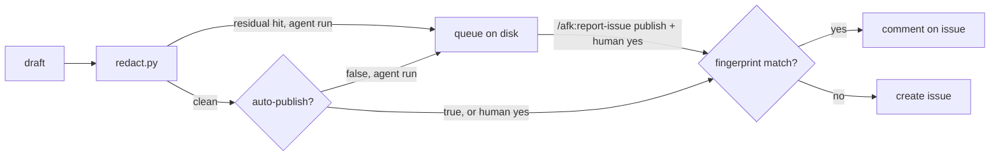

# ADR-0002 — Plugin issues go to the plugin's own GitHub repository

> Status: Accepted
> Date: 2026-09-10

## Context

The tracker boundary allows two tracker writers, both on the consuming repository's tracker (ADR-0001). A defect in the plugin itself — a script or hook crash, a gate verdict against its own rule, a broken contract between skills — had no path to the plugin's maintainers. It stayed in the session, or became a local workflow lesson that only the checkout that learned it can apply.

## Decision

`/afk:report-issue` is the plugin's one egress to an issue tracker it does not configure through `.afk/config.yaml` adapters: GitHub issues on the plugin's own repository, through `gh`. The target is the `repository` field of the plugin manifests, overridable by `report-issue.repository` in the consuming repository's configuration (`CONFIG.md`). Only plugin-side context leaves the machine: plugin paths, plugin commands, hook and script output, and an environment table of tool versions and adapter kinds. `redact.py` strips secrets, identities, hosts, ticket ids, product files, and the consuming repository's identity; a residual hit stops an agent run from publishing. An agent run publishes only when redaction passes and `report-issue.auto-publish` is not `false`; otherwise it queues the draft on disk. A human run publishes on an explicit yes after reading the full body. A fingerprint marker deduplicates: a matching issue gets a comment. Labels: `bug` or `feedback`, plus `agent-filed` on an agent run.

## Alternatives Considered

| Alternative | Pros | Cons | Reason rejected |
|-------------|------|------|-----------------|
| File plugin defects on the consuming repository's tracker | reuses the tracker adapters | the plugin's maintainers never see it; product teams get plugin noise | wrong audience |
| Lessons only (`/afk:lessons`) | no egress, no redaction risk | a lesson reaches one checkout; an installed plugin cache loses local edits | defects never reach upstream |
| Human-only filing | no autonomous egress | defects found during hands-off runs are forgotten by the time a human reads the report | the queue gives the same safety with less loss |

## Consequences

- **Positive** — plugin defects found in any consuming repository reach one place, deduplicated, with evidence a maintainer can act on cold.
- **Negative** — a new network egress. The redactor is its only content guard, so a shape it does not know leaves the machine on an agent run that passes the residual scan.
- **Negative** — human approval is enforced by prose only. `publish.sh` cannot tell a human's yes from an agent that passes `--approved`; the skill allows the flag only after an explicit yes in the conversation. An agent that disobeys it bypasses `auto-publish: false` and the residual stop, but never the redaction of the title and body.
- **Follow-ups** — widen `redact.py` shapes when a leaked shape is observed; no dashboard of queued drafts.
