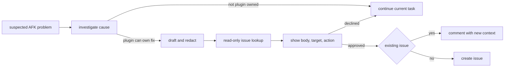

# ADR-0004 — Plugin issue writes need approval

> Status: Accepted
> Date: 2026-10-02

## Context

ADR-0002 allowed a clean agent report to create or comment on a GitHub issue
without human approval. Agents also waited for a direct `/afk:report-issue`
request in cases that did not match a narrow failure trigger. This delayed useful
reports and made external writes too automatic.

## Decision

Agents investigate when an observed problem may come from AFK. Signals include
hook or script failures, workflow inefficiency, slow workflow behavior,
unexpected agent behavior under AFK instructions, and broken plugin contracts.
An agent proposes a report only when a plugin file can own the correction.

The proposal shows the complete redacted body, target repository, and action.
The action creates a new issue or adds the current context to an existing issue.
Every GitHub write needs explicit human approval of that proposal.

`publish.sh --dry-run` performs read-only lookup and shows the action. A matching
fingerprint selects an existing issue. An agent can also select a reviewed match
with `--existing`. `publish.sh --approved` performs the shown write. An
unapproved non-preview run queues the report.

## Alternatives Considered

| Alternative | Reason rejected |
|---|---|
| Keep clean auto-publish | External writes occur before the human reviews the context. |
| Require users to invoke the skill | The user must recognize an AFK cause and remember the reporting route. |
| Create only new issues | Repeated evidence fragments the maintainer's context. |

## Consequences

- Agents surface plausible AFK problems without waiting for a user command.
- Reports include the current run context while it is available.
- Existing issues receive new evidence instead of duplicate issues.
- A human approval is required for every GitHub issue or comment write.
- Hands-off runs can queue a redacted report but cannot publish it.
- `--approved` attests conversation approval. The script cannot inspect the
  conversation, so the skill remains the approval control.
