# SDD — Agent team topology and multi-model

> Parent PRD: `PRD.md`
> Status: Draft
> Last updated: 2026-10-05
> Reading guide: sections follow the L1–L9 design-layer ladder, top of the system down to the code
> (L1 topology · L2 service boundaries · L3 data · L4 cross-cutting quality · L5 domain model ·
> L6 processes · L7 modules · L8 patterns · L9 seams into existing code). Skim §0 (what's locked)
> and §1 (why) first; non-implementers can stop there or read the DESIGN-BRIEF instead.

Source of every decision: `GRILL-LOG.md` (solution grill section) and `grill-solution.round.json`, settled ids S-1 to S-246, plus AUTO-1 and AUTO-2, widened after trial T7b (2026-09-28, decided outside a round). Contract-grade rows come from the packets the human signed in rounds 40, 41 and 45, and from the round-46 cards the human accepted (S-226 to S-246) under the delegation of 2026-09-30 (§0). D-01 to D-31 are agent-decided answers to seam-investigation gaps under that delegation (D-01 to D-07: `GRILL-LOG.md` row "Agent-decided, 2026-10-01", seam-gap answers D-01 to D-07; D-08 to D-31: the row "Agent-decided, 2026-10-01", seam-gap node answers D-08 to D-31); each cell that uses one says agent-decided. D-13, D-27 and D-31 are the exceptions: each restates settled rows (D-13: S-209 and AC-044; D-27: AC-008 and S-152; D-31: C5 and S-136), and its cells cite them. Three `GRILL-LOG.md` rows "Agent-decided, 2026-10-05" close §13 Q28 (where combined patterns place included steps), Q33 (how a start request names a step in a stage with no stage map entry) and Q34 (afk-lite's design stop in driven mode) under the same delegation; each cell that uses one cites its Q number and says agent-decided. A fourth row "Agent-decided, 2026-10-05", design-audit open points, settles the open points of a design audit of this draft under the same delegation, naming each point by its finding id (L5 to L64); each cell that uses one cites "audit" with that id, such as audit L59, and says agent-decided. A fifth row "Correction, 2026-10-05 (agent error)" replaces that row's answer L10, which had reversed S-176, A1, I1 and design ADR-0003, extends L59 and adds to L15; each cell that uses it cites "correction of 2026-10-05" and says agent-decided. A sixth row "Agent-decided, 2026-10-05", audit round 2 open points, closes §13 Q38 and Q39 and settles the status line of requirement ADR-0002; each cell that uses it cites "audit round 2" and says agent-decided. A seventh row "Correction, 2026-10-05 (agent error, audit round 3)" replaces that row's answer to Q38 and settles one legalization rule for every part of the agent name, agent-start's exit 2 for an agent-id with no entry or an entry not in state starting, and exit 5's stop as an E2 trigger; each cell that uses it cites "correction of audit round 3" and says agent-decided. An eighth row "Agent-decided, 2026-10-05", audit round 3 open points, closes §13 Q40 to Q44 with the writer's option A of each; each cell that uses it cites "audit round 3" and says agent-decided. A ninth row "Correction, 2026-10-05 (agent error, audit round 4)" withdraws that row's match on the pane label's goal word, replaces its answer to Q44, keeps exit 5's entry in lost with no move to unkillable, names the field watched-agent-id and adds a V row for the stray probe; each cell that uses it cites "correction of audit round 4" and says agent-decided, as the eleventh row states. A tenth row "Agent-decided, 2026-10-05", audit round 4 open points, closes §13 Q45 to Q48 with the writer's recommended option A of each; each cell that uses it cites "audit round 4" and says agent-decided. An eleventh row "Clarification, 2026-10-05 (audit round 5)" states that the replacement text of each of the three correction rows is agent-decided under the grant of 2026-09-30, that the ninth row's model-part rule keeps S-217, and that the pane label and the agent name carry the same model part; each cell that uses it cites "clarification of audit round 5". A twelfth row "Agent-decided, 2026-10-05", audit round 5 open points, replaces the ninth row's "no move to unkillable" and settles the open points of audit round 5; each cell that uses it cites "audit round 5" and says agent-decided. A thirteenth row "Agent-decided, 2026-10-05", audit round 6 open points, settles the open points of audit round 6; each cell that uses it cites "audit round 6" and says agent-decided. A fourteenth row "Agent-decided, 2026-10-05", audit round 7 open points, settles the open points of audit round 7 and, where they differ, replaces that row's hold on a role after exit 5, its cleanup rule for an entry with no handle and its bound on the transport call, and the twelfth row's agent-stop on a lost entry after exit 5; each cell that uses it cites "audit round 7" and says agent-decided. A fifteenth row "Agent-decided, 2026-10-05", SDD §13 Q49, closes Q49 with the writer's option A of each case; each cell that uses it cites "§13 Q49" and says agent-decided. A sixteenth row "Agent-decided, 2026-10-05", audit round 8 open points, withdraws the check after a failed start and cleanup's agent-list lookup, which the fourteenth and fifteenth rows set, and settles the open points of audit round 8; each cell that uses it cites "audit round 8" and says agent-decided. A seventeenth row "Agent-decided, 2026-10-05", SDD §13 Q50, closes Q50 with the writer's option A; each cell that uses it cites "§13 Q50" and says agent-decided. An eighteenth row "Agent-decided, 2026-10-05", audit round 9 open points, settles the open points of audit round 9, makes the sixteenth row's park after a failed start unconditional and withdraws its stop through the run's resolved kind; each cell that uses it cites "audit round 9" and says agent-decided. A nineteenth row "Agent-decided, 2026-10-05", audit round 10 open points, settles the open points of audit round 10 and replaces the eighteenth row's kill by process id for an entry with an empty kind; each cell that uses it cites "audit round 10" and says agent-decided. A twentieth row "Agent-decided, 2026-10-05", audit round 11 open points, settles the open points of audit round 11; each cell that uses it cites "audit round 11" and says agent-decided. A twenty-first row "Agent-decided, 2026-10-05", audit round 12 open points, settles the open points of audit round 12 and replaces the twentieth row's points (1) and (4); each cell that uses it cites "audit round 12" and says agent-decided. A twenty-second row "Agent-decided, 2026-10-05", audit round 13 open points, settles the open points of audit round 13 and replaces the twenty-first row's point (3); each cell that uses it cites "audit round 13" and says agent-decided. A twenty-third row "Agent-decided, 2026-10-05", SDD §13 Q53, closes Q53 with the writer's inferred reading; each cell that uses it cites "§13 Q53" and says agent-decided. A twenty-fourth row "Agent-decided, 2026-10-05", audit round 14 open points, settles the open points of audit round 14; each cell that uses it cites "audit round 14" and says agent-decided. A twenty-fifth row "Correction, 2026-10-05 (agent error, audit round 14)" withdraws the wiring IOU of the row on audit round 14 and has an investigation close its §14 row; each cell that uses it cites "correction of audit round 14". A twenty-sixth row "Human direction, 2026-10-06" asks that agents be clear about reporting progress up, down and to siblings, and that each team pattern carry a system-prompt-like text that defines role, responsibility, communication pattern and expected behaviours; a twenty-seventh row "Agent-decided, 2026-10-06", the pattern charter, answers it in points C1 to C6 under the delegation of 2026-09-30; each cell that uses it cites "charter" with the point, such as charter C2, and says agent-decided. A twenty-eighth row "Agent-decided, 2026-10-06", charter C3 replaced, replaces point C3 of the twenty-seventh row under the same delegation; each cell that uses it cites "charter C3'" and says agent-decided. A twenty-ninth row "Agent-decided, 2026-10-06", audit round 15 on charter C4, says what goes down the report line and which pair the implied edges join; each cell that uses it cites "audit round 15" and says agent-decided. A thirtieth row "Agent-decided, 2026-10-06", audit round 16 on charter C1 and C6, says that a pattern record with no roles carries no charter and fixes the order of the 2 new SessionStart handlers; each cell that uses it cites "audit round 16" and says agent-decided. A thirty-first row "Agent-decided, 2026-10-06", audit round 17 on charter C1 and C6, says that a one-off pattern that starts agents reaches the resolver in the field shape of a pattern record, with its charter, and that the charter files are the run's only copy of it; each cell that uses it cites "audit round 17" and says agent-decided. §14 rows that rest on partial investigations stand under the human's exception of 2026-10-02 (§13). T1 to T12 name the live trials the grill log records. Terms used before the glossary has them (§13 row Q1), with the settled rows that define them:

| Term | Meaning |
|------|---------|
| run | All work on one feature under a team topology (S-32 to S-36) |
| role | A named position one agent fills |
| contact agent | The agent the human talks to; the only writer of the run manifest |
| spawned agent | An agent the contact agent started |
| pane agent | An agent in its own terminal pane (S-153) |
| role agent | An agent that does a role's work: it writes a plugin file, code or a ledger, or returns a gate verdict. Always a pane agent (S-190, AC-040) |
| helper | A subagent a pane agent starts for its own reading; never a role, never in the manifest (S-162, AC-043) |
| builder | The one role that commits and pushes, one active at a time (S-135); under /afk:autopilot, the subtask agent (S-227) |
| hub | A role others message directly |
| moderator | The agent that runs a debate: the pattern's hub, else one the resolver adds (S-144) |
| stage | One step of the workflow chain (S-138) |
| pattern | A team shape stored as data: roles, models, talk edges, steps, includes, a description and a version (S-143, S-177, S-228) |
| pattern step | One step of a pattern; a debate's steps are draft, critique, revision and verdict (S-137) |
| topology map | Optional human configuration that maps a stage to a pattern; the plugin ships none (S-143, AC-032). Its configuration key is the stage map (S-230) |
| stage map | The configuration entry that maps a stage name to one pattern name or a list the resolver combines (S-230) |
| pane switch | The one configuration key, pane or subagent, that turns role agents back into subagents (S-230) |
| pattern standard | The 4 properties every pattern that starts agents meets: PS-1 to PS-4 (§9) |
| resolved pattern | The flattened team one run uses, one file per run (S-139) |
| afk-lite | The built-in pattern that /afk:fix runs (BP-5) |
| lifespan | How long an agent lives: Turn (one exchange), Step (one pattern step), Feature (the whole run) (S-169) |
| requester | The agent that asked for a new agent (S-173) |
| report target | The agent that gets a role's result: the one the pattern names, else the requester (S-212) |
| team entry script | The one script agents call to start, message and stop agents |
| multiplexer | The terminal tool that holds the panes |
| recipe | The one file per multiplexer tool that maps each verb to the tool's commands (S-168) |
| run directory | The git-ignored folder that holds one run's files (S-172) |
| inbox | The folder in the run directory where messages for the contact agent land (S-172, S-215) |
| envelope | The small file that says who sent a message and where its text is (S-178) |
| message body | The text of one message, in its own file. A start-request or finished body is one JSON object with a format version; every other body is free text (S-140, S-171, S-231) |
| result file | The file a started agent writes its result to; the requester names it, and the report target reads it (S-173, S-239) |
| completion signal | The file that says an agent finished (S-174) |
| job supervisor | A process that watches one agent and sends exited, or parked with the reset time (S-141) |
| wait job | The one background process per run that checks the contact inbox every 10 seconds and whose exit wakes the contact agent (S-195, S-226) |
| stall watchdog | A timer that flags an agent silent for 20 minutes |
| owner generation | The takeover counter: a new contact session adds 1 to it (S-176) |
| harness session id | The id the coding tool gives a conversation, so the conversation can be resumed (S-213) |

## §0 Binding Contract

This SDD and its accepted ADRs are **binding** on implementing agents and reviewers.

| Aspect | Locked by SDD/ADR | Executor latitude |
|--------|-------------------|-------------------|
| Pattern choice | ✅ | ❌ |
| Module public interface | ✅ | ❌ |
| API contract / schema | ✅ | ❌ |
| Persisted schema — fields, relations, migration (§4) | ✅ | ❌ |
| Lifecycle states + legal transitions (§6) | ✅ | ❌ |
| Roles permitted/denied per surface (§5) | ✅ | ❌ |
| Aggregate boundary | ✅ | ❌ |
| Txn / idempotency strategy | ✅ | ❌ |
| External-seam contract (§9b: framework I/O shape, field source-of-truth, enforcement point, failure surface) | ✅ | ❌ |
| File / package layout *within* a named module | ❌ | ✅ |
| Private helper extraction | ❌ | ✅ |
| Internal naming, control flow | ❌ | ✅ |
| Test fixture structure | ❌ | ✅ |

**Conflict procedure.** Executor finds a binding decision wrong / infeasible / contradicting reality → classify per the decision protocol (`DECISIONS.md`, workflow plugin root): a two-way-door correction is recorded in `plan/DECISIONS.md` and implemented; a one-way door or a tie exits the subtask with `design_conflict` status quoting the SDD section + the conflict, routed back to `/afk:grill-solution` for a new ADR (Status: Accepted, Supersedes: NNNN). Never override off the record.

**Human sign-off register.** Transcribed from the signoff rows of `GRILL-LOG.md`. The latest entry of each aspect is the human's delegation of 2026-09-30, recorded there as status `signed by delegation` (row "Human direction, 2026-09-30, R-46 note on R46-ROLL"); its approved wording is the human's own note, quoted verbatim. Earlier signatures of the same aspect follow in the same cell, newest first. Round 45 re-signed all six aspects with the sign mark "sign"; each round-45 packet covered every change from rounds 42, 43 and 44 (S-169 to S-225).

| Aspect | Section | Status | Signed by / date | Approved wording |
|--------|---------|--------|------------------|------------------|
| HL-1 Persistence | §4 | signed by delegation | human / 2026-09-30 (R-46 note on R46-ROLL: a delegation, not a per-packet sign); earlier signatures, newest first: 2026-09-29 (R-45, HL1-6, "sign"), 2026-09-29 (R-40, HL1-5, "sign"), 2026-09-24 (R-34, HL1-4, "sign it"), 2026-09-24 (R-32, "sign it"), 2026-09-24 (R-27, "sign") and 2026-09-17 (R-4, "sign") | "most of your questions I just go with your recommendations. let's do it starting from now, you can just go with your recommendations. I need this feature to be done asap, so spawn up an agents team (herdr panes, auto mode, segration of duties, cross/independent check/audit, all works must be verified, fully autonomous till done). report and create PR once done" |
| HL-2 API surface | §3 | signed by delegation | human / 2026-09-30 (R-46 note on R46-ROLL: a delegation, not a per-packet sign); earlier signatures, newest first: 2026-09-29 (R-45, HL2-3, "sign"), 2026-09-29 (R-40, HL2-2, "sign") and 2026-09-17 (R-2, HL2-1, "sign") | "most of your questions I just go with your recommendations. let's do it starting from now, you can just go with your recommendations. I need this feature to be done asap, so spawn up an agents team (herdr panes, auto mode, segration of duties, cross/independent check/audit, all works must be verified, fully autonomous till done). report and create PR once done" |
| HL-3 Authorization and data scoping | §5 | signed by delegation | human / 2026-09-30 (R-46 note on R46-ROLL: a delegation, not a per-packet sign); earlier signatures, newest first: 2026-09-29 (R-45, HL3-3, "sign"), 2026-09-29 (R-40, HL3-2, "sign") and 2026-09-17 (R-6, HL3-1, "sign") | "most of your questions I just go with your recommendations. let's do it starting from now, you can just go with your recommendations. I need this feature to be done asap, so spawn up an agents team (herdr panes, auto mode, segration of duties, cross/independent check/audit, all works must be verified, fully autonomous till done). report and create PR once done" |
| HL-4 Lifecycle and invariants | §6 | signed by delegation | human / 2026-09-30 (R-46 note on R46-ROLL: a delegation, not a per-packet sign); earlier signatures, newest first: 2026-09-29 (R-45, HL4-4, "sign"), 2026-09-29 (R-40, HL4-3, "sign"), 2026-09-24 (R-32, HL4-2, "sign it") and 2026-09-18 (R-12; the grill log row "Locked: L5 CLOSED" records this signature without the human's words) | "most of your questions I just go with your recommendations. let's do it starting from now, you can just go with your recommendations. I need this feature to be done asap, so spawn up an agents team (herdr panes, auto mode, segration of duties, cross/independent check/audit, all works must be verified, fully autonomous till done). report and create PR once done" |
| HL-5 Irreversible and outward effects | §7 | signed by delegation | human / 2026-09-30 (R-46 note on R46-ROLL: a delegation, not a per-packet sign); earlier signatures, newest first: 2026-09-29 (R-45, HL5-6, "sign"), 2026-09-29 (R-40, HL5-5, "sign"), 2026-09-24 (R-34, HL5-4, "sign it"), 2026-09-24 (R-32, "sign it"), 2026-09-24 (R-28, "sign") and 2026-09-18 (R-14, "sign") | "most of your questions I just go with your recommendations. let's do it starting from now, you can just go with your recommendations. I need this feature to be done asap, so spawn up an agents team (herdr panes, auto mode, segration of duties, cross/independent check/audit, all works must be verified, fully autonomous till done). report and create PR once done" |
| HL-6 Change to existing behaviour | §14 | signed by delegation | human / 2026-09-30 (R-46 note on R46-ROLL: a delegation, not a per-packet sign); earlier signatures, newest first: 2026-09-29 (R-45, HL6-9, "sign"), 2026-09-29 (R-41, HL6-8, "sign"), 2026-09-29 (R-40, HL6-7, "sign"), 2026-09-28 (terminal question HL6-6, "sign HL-6 again"), 2026-09-28 (HL6-5, "sign"), 2026-09-25 (R-37, HL6-4, "sign"), 2026-09-24 (R-32, "sign it"), 2026-09-24 (R-28, "sign") and 2026-09-21 (R-18, "sign") | "most of your questions I just go with your recommendations. let's do it starting from now, you can just go with your recommendations. I need this feature to be done asap, so spawn up an agents team (herdr panes, auto mode, segration of duties, cross/independent check/audit, all works must be verified, fully autonomous till done). report and create PR once done" |

Rows settled in round 46 (S-226 to S-246) carry the human's accept of each card, and the delegation covers their assembly into the packets; no per-packet signature was given after round 45. Cells that use an agent-decided answer (D-01 to D-31, the rows of 2026-10-05 that close §13 Q28, Q33 and Q34, the row of 2026-10-05 on the design audit, cited as audit L5 to L64, its correction row, cited as correction of 2026-10-05, the row of 2026-10-05 on the open points of audit round 2, cited as audit round 2, its correction, cited as correction of audit round 3, the row on the open points of audit round 3, cited as audit round 3, its correction, cited as correction of audit round 4, the row on the open points of audit round 4, cited as audit round 4, the row on the open points of audit round 5, cited as audit round 5, the row on the open points of audit round 6, cited as audit round 6, the row on the open points of audit round 7, cited as audit round 7, the row that closes §13 Q49, cited as §13 Q49, the row on the open points of audit round 8, cited as audit round 8, the row that closes §13 Q50, cited as §13 Q50, the row on the open points of audit round 9, cited as audit round 9, the row on the open points of audit round 10, cited as audit round 10, the row on the open points of audit round 11, cited as audit round 11, the row on the open points of audit round 12, cited as audit round 12, the row on the open points of audit round 13, cited as audit round 13, the row that closes §13 Q53, cited as §13 Q53, and the row on the open points of audit round 14, cited as audit round 14, its correction, cited as correction of audit round 14, the row of 2026-10-06 on the pattern charter, cited as charter C1 to C6, the row that replaces its C3, cited as charter C3', the row on audit round 15, cited as audit round 15, the row on audit round 16, cited as audit round 16, and the row on audit round 17, cited as audit round 17) say so; the delegation is their only authority, except for D-13, D-27 and D-31, which restate settled rows. The design-audit row changes signed cells of every aspect, HL-1 to HL-6; it was taken under the grant of 2026-09-30 and says that the delegation, not a new signature, covers the signed HL-5 cells it changes (E4, E6, E12). Its correction row changes signed cells of HL-1, HL-2, HL-4 and HL-5: the contact agent mints the agent-id and the agent entry gains a pattern step field, agent-start takes the agent-id and gains exit code 5, A5's trigger gains that code, and E1's ordering and partial failure, and E2's and E3's ordering, carry the correction. The row on audit round 2 changes signed cells of HL-1, HL-2 and HL-4: the agent name puts g- before any first character other than a lowercase letter, agent-start refuses with exit code 2 a name with no room for a goal character, and A5's trigger gains that refusal. Its correction of audit round 3 replaces the round-2 stop of each stray: cleanup stops no agent the manifest does not name and lists each stray in its report. It changes signed cells of HL-1 to HL-5: one rule makes every part of the agent name legal, agent-start refuses with exit code 2 an agent-id with no entry or an entry not in state starting, which moves no entry (A5; inferred), and the script's own stop on exit 5 is an E2 trigger and, in §5, the one stop outside agent-stop. The row on audit round 3 changes signed cells of HL-1, HL-2, HL-4 and HL-5, which §12 names, and the table below names every cell that cites it. The same grant covers the three rows. The row "Correction, 2026-10-05 (agent error, audit round 4)", cited as correction of audit round 4, withdraws that row's match on the pane label's goal word, which amended S-237, a row the human settled, so agent-list keeps S-237's match. It replaces the answer to Q44: the agent name's model part drops a vendor prefix and is cut to 8 characters. It keeps exit 5's entry in lost with no move to unkillable, names the field watched-agent-id and adds V26. It changes signed cells of HL-1, HL-2, HL-4 and HL-5, which §12 names, and the table below names every cell that cites it. The row "Clarification, 2026-10-05 (audit round 5)", cited as clarification of audit round 5, states that the replacement text of each of the three correction rows is agent-decided under the grant of 2026-09-30; that the model-part rule fills a form no settled row fixes and keeps S-217; and that the pane label and the agent name carry the same model part. The row on the open points of audit round 4, cited as audit round 4, was taken under the grant of 2026-09-30. It changes signed cells of HL-1 and HL-2, which §12 names, and the table below names every cell that cites it. It keeps agent-stop's signed cell that it never refuses and agent-start's signed 120 s. The row on the open points of audit round 5, cited as audit round 5, was taken under the same grant. It replaces the "no move to unkillable" of the correction of audit round 4: the contact agent writes exit 5's kind, handle and process id into the entry as it moves it to lost. It also settles what a supervisor start takes and answers, the cut of agent-list's goal, agent-list's exit 3 for TR-4, the end of exit 5's stop and the order of the model-part steps. It changes signed cells of HL-1, HL-2, HL-4 and HL-5, which §12 names, and the table below names every cell that cites it. The row on the open points of audit round 6, cited as audit round 6, was taken under the same grant. It sets exit 5's handle by kind, narrows a supervisor start's answer, defines agent-list's goal prefix and counts g- inside the 32 characters. It changes signed cells of HL-1, HL-2, HL-4 and HL-5, which §12 names, and the table below names every cell that cites it. The row on the open points of audit round 7, cited as audit round 7, was taken under the same grant. agent-start writes the pane label and the agent name before its transport call, and the process id and the session id after it. Cleanup calls agent-stop on every remaining entry, which kills by the process id and closes the pane by the handle. The row also keeps agent-start's signed 120 s, counts the 3 joining '-' in the goal's room, and makes the process id the handle of a kind that opens no panes. It changes signed cells of HL-1 to HL-5, which §12 names, and the table below names every cell that cites it. The row that closes §13 Q49, cited as §13 Q49, was taken under the same grant, with the writer's option A of case (2): when the write before the transport call fails, agent-start makes no transport call and answers exit 4 naming the write, and the entry moves to lost. It changes signed cells of HL-2, HL-4 and HL-5, which §12 names, and the table below names every cell that cites it. The row on the open points of audit round 8, cited as audit round 8, was taken under the same grant, as a simplification. It withdraws the check after a failed start and cleanup's agent-list lookup. After agent-start exit 5 or a verb timeout, the entry moves to lost, and the contact agent starts no new agent and ends the run parked, naming the agent-id and the agent name; the human closes any leftover agent and re-runs. Exits 2, 3 and 4 move the entry to lost, and no agent runs. agent-stop kills by the process id only after AC-013's identity check, for an agent entry as for a process entry, and answers an entry that holds neither a process id nor a handle with stopped true and the method 'nothing recorded'; A6 means the process killed or none recorded, the entry closed. For TR-4 the contact agent writes the answer's terminal identifier, by which agent-stop closes the terminal. It changes signed cells of HL-1, HL-2, HL-4 and HL-5, which §12 names, and the table below names every cell that cites it. The row that closes §13 Q50, cited as §13 Q50, was taken under the same grant, with the writer's option A: agent-start answers the agent process's creation time, read from the operating system, as started-at, and agent-stop compares it with the live process's creation time, both cut to the second; the signed §4 cell, UTC to the second, stands. It changes signed cells of HL-2 and HL-5, which §12 names, and the table below names every cell that cites it. The row on the open points of audit round 9, cited as audit round 9, was taken under the same grant. Exit 5's answer also carries started-at, which the contact agent writes with kind, handle and process id; an entry that holds a process id and no started-at cannot pass the identity check, so agent-stop kills nothing; the answer stopped false with the reason 'identity unknown' moves the entry to unkillable, and the cleanup report names it. The park after exit 5 or a verb timeout has no condition: it is the run's end, naming the agent-id and the agent name; cleanup runs at that end, and a re-run's cleanup finishes what is left. For TR-4, agent-stop's answer reports the terminal close in pane closed and names the terminal identifier in place of the pane id. The run's resolved kind is withdrawn: kind and handle are always written together, so an entry with an empty kind has no handle. It changes signed cells of HL-1, HL-2, HL-4 and HL-5, which §12 names, and the table below names every cell that cites it. The row on the open points of audit round 10, cited as audit round 10, was taken under the same grant. For an entry that holds a process id and no started-at, agent-stop kills nothing: when no live process has that id, it answers stopped true with the method 'already gone', and the entry moves to cleaned; when a live process has it, it answers stopped false with the reason 'identity unknown', and the entry moves to unkillable, and to cleaned when a later agent-stop answers stopped true, so the next cleanup after the human closes the agent finishes the line. This replaces round 9's kill by process id for an entry with an empty kind, which has no started-at and takes this path. A7 also means that the process's identity is unknown; the park's outcome is blocked(unrecorded_agent); and PRD AC-013 gains the case with no started-at, decided by the agent. It changes signed cells of HL-1, HL-2 and HL-4, which §12 names, and the table below names every cell that cites it. The row on the open points of audit round 11, cited as audit round 11, was taken under the same grant. An unkillable entry moves to cleaned when a later agent-stop answers stopped true without pane closed false. A6 means the process killed, already gone or none recorded, the entry closed. §13 Q51 records, as an accepted residual that does not block the executor, that when the operating system reuses a closed agent's process id, its entry stays unkillable until that process ends; the cleanup report names the agent name and the process id. It changes signed cells of HL-2 and HL-4, which §12 names, and the table below names every cell that cites it. The row on the open points of audit round 12, cited as audit round 12, was taken under the same grant and replaces the points of the row of audit round 11 on step 5 and on the park's report. While any entry stays unkillable, cleanup skips steps 2 to 5, so every process is killed before anything is deleted (S-198), and its report says the message area, the knowledge store, the resolved pattern and the manifest are kept for the next cleanup. A re-run adopts the kept manifest (AC-015); before any start, its contact agent calls agent-stop on each unkillable entry, and when every one is cleaned the run goes on, else it parks again. PRD AC-013 says an agent's entry moves to cleaned, not that it is removed (inferred: the row means an agent's entry, since a process entry has no state field, §4). The cleanup report names each unkillable entry's agent name and process id, and §5 lists the line on what cleanup keeps as a signal row. It changes signed cells of HL-2, HL-4 and HL-5, which §12 names, and the table below names every cell that cites it. The row on the open points of audit round 13, cited as audit round 13, was taken under the same grant and replaces the point of the row of audit round 12 on the park's report. The park is run-level. Under /afk:execute, its outcome is the status unrecorded_agent: the line `OUTCOME: unrecorded_agent — AGENT-ID AGENT-NAME` and the PLAN.md cell `blocked(unrecorded_agent: AGENT-ID AGENT-NAME)`, where AGENT-ID and AGENT-NAME stand for the agent-id and the agent name. /afk:autopilot step 4 gains one rule: that status ends the walk, no further subtask starts, and the Finish report names the agent. One plan subtask, §13 Q52, adds the status in one change to every surface that names statuses: /afk:execute Step 13, /afk:autopilot step 4, the README status table, the GLOSSARY.md token list and mission control's status list. Under any other skill, the contact agent reports the park to the human per REPORTING.md, as the row of audit round 12 said. The skip of cleanup steps 2 to 5 also holds while a process entry is left after a failed kill (I5). While a reused process id's process runs, the run stays parked, and the human closes the leftover agent by its agent name or pane, never by the process id (§13 Q51). §13 Q53 holds two cases the row leaves unstated, on how the status reaches a subtask's outcome under /afk:autopilot. It changes signed cells of HL-2, HL-4 and HL-5, which §12 names, and the table below names every cell that cites it. The row that closes §13 Q53, cited as §13 Q53, was taken under the same grant, with the writer's inferred reading: under /afk:autopilot, the contact agent answers the start request with the park, naming the agent-id and the agent name, as it answers a request it refuses (S-187), and runs the cleanup after the subtask agent's OUTCOME line arrives; when the failed start is the subtask agent's own, the contact agent ends the walk itself, its Finish report names the agent, and the subtask's row keeps its status, as a stranded row does. It changes a signed cell of HL-2, which §12 names, and the table below names every cell that cites it. The row on the open points of audit round 14, cited as audit round 14, was taken under the same grant. /afk:autopilot's new rule is that a team park ends the walk, whether it arrives as a subtask's unrecorded_agent outcome or as the contact agent's own park of a subtask agent's start; the Finish report names the agent and lists each subtask not started, and a journal line records it. The plugin-surface change of §13 Q52 gets the §14 seam row 'Outcome status set of /afk:execute omits unrecorded_agent', verdict extends, so /afk:to-subtasks slices it; its surfaces add CLAUDE.md's Lockstep sentence on status-agnostic autopilot parks. The correction of audit round 14 withdraws that row's wiring IOU, since the plan subtask adds the status and every surface that reads it in one change, so producer and consumers land together, and has an investigation, not the human exception of 2026-10-02, close the §14 row; INV-039 closes it. A5 and the §5 agent-start row name the autopilot branch, the subtask's outcome or the Finish report. Before any start, a re-run's contact agent runs cleanup step 1 on the kept manifest: it kills each leftover process entry and calls agent-stop on each unkillable agent entry, and when nothing is left the run goes on, else it parks again. It changes signed cells of HL-2, HL-4 and HL-6, which §12 names, and the table below names every cell that cites it. The row of 2026-10-06 on the pattern charter, cited as charter C1 to C6, was taken under the same grant, from the human's direction of 2026-10-06. Every pattern record that starts agents carries a charter, a pattern part and one part per role, and the resolver refuses a pattern with roles whose charter or any role part is missing, with exit code 2 (charter C1; audit round 16). The team entry script writes one charter file per role into the run directory at resolve time, and agent-start's launch prompt names it before the brief (charter C2). A resume's launch names the charter file before its prompt, as a first start does; the SessionStart hook points a pane agent back at it only after a compaction, and the Codex probe saw none at compaction, an accepted gap; a native system-prompt flag carries it only where a probe proves it (charter C3', agent-decided; §13 V27). A role and its resolved report target, whoever it is, may send each other kind message both ways with no declared edge, and down that line go only answers to the role's questions and data its current duty uses, never an instruction, a new duty or a stop (charter C4; audit round 15); a progress message opens with one fixed line, and the contact agent gets no copy (charter C5); the built-in records that start agents, BP-2 to BP-5, ship their charters in the same change (charter C6; audit round 16). It changes signed cells of HL-1, HL-2, HL-3, HL-4 and HL-6, which §12 names, and the table below names every cell that cites it. The row on audit round 16, cited as audit round 16, was taken under the same grant. A pattern record with no roles, such as BP-1 solo, carries no charter: it starts no agent, so no charter file has a reader, and the pattern standard does not bind it (AC-059). The resolver checks the pattern part and every role part only on a record that has roles, and refuses a missing or empty one there with exit code 2; C1 and C6 now read every pattern record that starts agents. The 2 new SessionStart handlers join the * group of both hooks files after the 3 existing ones, the pane-agent rule's short form first, then the charter pointer, so no existing Codex trust key moves and the group ends with 5 handlers in that order. It changes signed cells of HL-1, HL-4 and HL-6, which §12 names, and the table below names every cell that cites it. The row on audit round 17, cited as audit round 17, was taken under the same grant. A one-off pattern that starts agents has no record, but reaches the resolver in the field shape of a pattern record, with its charter: a pattern part and one part per role, which the agent that writes the pattern writes (C6). The resolver checks it as it checks a record with roles and refuses a missing or empty part with exit code 2, naming the pattern and the role; a one-off pattern with no roles carries no charter. The team entry script writes the charter files from that input at resolve time (C2); they are the run's only copy of a one-off charter, and the resolved pattern's flattened team carries no charter. It changes signed cells of HL-1, HL-4 and HL-6, which §12 names, and the table below names every cell that cites it. Q34 changes AC-037 for driven mode, a change to existing behaviour (HL-6) that the delegation covers (requirement ADR-0019, decided by the agent).

Every cell that cites each agent-decided or correction row, named by its table row, paragraph or caption; §12 names the signed cells such a row amends:

| `GRILL-LOG.md` row | Cited as | Cited in |
|---|---|---|
| "Agent-decided, 2026-10-01", seam-gap answers D-01 to D-07 and seam-gap node answers D-08 to D-31 | D-01 to D-31 | the source note above §0; §0: the paragraph on agent-decided rows; §3: the rows 'Validation: start-request' and 'Result of a requested agent'; §4: the record 'Result file', the agent entry's field agent name and the stage map entry's field 'stage map: key'; §5: the data scoping row 'Result file' and the feature-flag row 'Stage map entry per stage'; §8: SessionStart hook; §9: the pattern row 'Role spawns in a stage with no stage map entry'; §9b: the seam row 'Named agent definitions and pinned models in a pane agent' and the note on schema libraries; §13: Q4, Q9, Q30, Q33, Q44, V1, V3, V7, V9, V18, V20, V21 and V23; §14: the intro and the rows '/afk:execute Step 10: /afk:review concern workers, skeptic and adjudicator waves', '/afk:execute Step 10.5: the adversary', '/afk:preflight PF-3 feature review', '/afk:fix team entry (afk-lite), including the /afk:bug fixer', 'Spawn steps that start a role agent (INV-013's list)', 'Report-file writers under the subagent fallback, including /afk:investigate step 7', 'SessionStart hook: the pane-agent rule's short form', 'Lesson ledger id mint in hooks/lesson-append.sh', 'Mission control progress.py never counts feature review rounds', 'DELEGATION.md spawn rules (:24-30)', '/afk:bug publisher, fixer and retester' and '/afk:bug fixer: afk-lite's design stop' |
| the three rows "Agent-decided, 2026-10-05" that close Q28, Q33 and Q34 | §13 Q28, Q33, Q34 | the source note above §0; §0: the paragraph on agent-decided rows; §3: the rows 'Validation: start-request' and 'Request path for other agents'; §4: the agent entry's field pattern step, the resolved pattern's field flattened team, the pattern record's field includes, the stage map entry's field 'stage map: key', the start-request body's fields pattern step and agents and the relation pattern record → included pattern; §6: the invariants I6 and I8; §7: the process rows 'Ask for an agent' and 'Decide afk-lite's design in driven mode', the failure row 'afk-lite meets a one-way door or a DISAGREE-FINAL point in driven mode' and the effect E12; §8: Team entry script and Pattern resolver; §9: the pattern rows 'Team shapes', 'Role spawns in a stage with no stage map entry' and '/afk:fix under a team'; §12: the row of Q34; §13: the intro, Q23, Q28, Q33, Q34, Q35, Q36, Q37 and Q54; §14: the intro and the rows '/afk:execute Step 10: /afk:review concern workers, skeptic and adjudicator waves', '/afk:execute Step 10.5: the adversary', '/afk:fix team entry (afk-lite), including the /afk:bug fixer', 'Spawn steps that start a role agent (INV-013's list)' and '/afk:bug fixer: afk-lite's design stop' |
| "Agent-decided, 2026-10-05", design-audit open points | audit L5 to L64 | the source note above §0; §0: the paragraph on agent-decided rows; §3: the start diagram's caption, the result diagram's caption, the verb agent-start, the exit-5 paragraph and the rows 'Validation: edge', 'Pane label' and 'Refusals added'; §4: the agent entry's fields handle, agent name and lifespan, the pattern record's fields 'role: lifespan', 'role: report target', edges and steps, the start-request body's field lifespan and the relation pattern record → roles, edges, steps; §5: the access rows 'Commit and push', 'Open a change request' and 'Update the change request's checklist', the idempotency rows E4, E5 and E6, the retry rows E4 and E5 and the signal row for agent-start; §6: the state A5 and the invariant I6; §7: the failure rows 'The manifest write fails after a start', 'E4: a push is rejected' and 'E5: the change request create, checklist update or ready-mark fails', the effects preface and the effects E1, E4, E5, E6, E9 and E12; §8: Team entry script and Pattern resolver; §9: the pattern row 'Lesson-id mint'; §9b: the seam rows 'Background job at session end' and 'herdr agent name and pane label'; §12: the rows of audit L19 to L21 and L61, audit L22 and L23, audit L5, the correction of 2026-10-05 and audit round 2; §13: the intro, Q39, Q48 and V25; §14: the intro and the rows 'Stage-skill spawn points and subagent waves, per DELEGATION', 'Spawn steps that start a role agent (INV-013's list)' and 'Lesson ledger id mint in hooks/lesson-append.sh' |
| "Correction, 2026-10-05 (agent error)" | correction of 2026-10-05 | the source note above §0; §0: the paragraph on agent-decided rows; §3: the start diagram's caption, the verbs agent-start and agent-list, the exit-5 paragraph and the rows 'Answer fields' and 'Refusals added'; §4: the agent entry and the agent entry's fields agent-id and pattern step; §5: the signal row for agent-start; §6: the state A5 and the invariants preface; §7: the process table's caption, the failure row 'The manifest write fails after a start', the effects preface and the effects E1, E2 and E3; §8: Team entry script; §12: the row of the correction of 2026-10-05; §13: Q40 |
| "Agent-decided, 2026-10-05", audit round 2 open points | audit round 2 | the source note above §0; §0: the paragraph on agent-decided rows; §3: the verb agent-start and the rows 'Pane label' and 'Refusals added'; §4: the agent entry's field agent name; §5: the signal row for agent-start; §6: the state A5; §7: the failure row 'agent-start fails'; §8: Team entry script; §9b: the seam row 'herdr agent name and pane label'; §12: the rows of audit round 2 and audit round 8; §13: Q38 and Q39 |
| "Correction, 2026-10-05 (agent error, audit round 3)" | correction of audit round 3 | the source note above §0; §0: the paragraph on agent-decided rows; §3: the verbs agent-start, agent-stop and agent-list, the exit-5 paragraph and the rows 'Pane label' and 'Refusals added'; §4: the agent entry's field agent name; §5: the access row 'Start or stop a team agent', the sentence below the idempotency table and the signal rows for a stray and for agent-start; §6: the state A5 and the invariants preface; §7: the process row 'Cleanup', the failure rows 'agent-start fails' and 'A stray is found', the effects preface and the effects E1 and E2; §8: Team entry script and Cleanup; §9b: the seam row 'herdr agent name and pane label'; §12: the rows of audit round 2 and the correction of audit round 3; §13: the intro, Q38, Q39 and Q46 |
| "Agent-decided, 2026-10-05", audit round 3 open points | audit round 3 | the source note above §0; §0: the paragraph on agent-decided rows; §3: the verbs agent-start and agent-list, the exit-5 paragraph and the rows 'Answer fields' and 'Refusals added'; §4: the relation watched agent → job supervisor; §5: the signal rows for a stray and for agent-start; §6: the state A5; §7: the process row 'Cleanup', the failure rows 'The manifest write fails after a start' and 'A stray is found', the effects preface and the effects E2 and E3; §8: Team entry script, Cleanup and Job supervisor; §12: the row of audit round 3; §13: Q40, Q41, Q42 and Q43 |
| "Correction, 2026-10-05 (agent error, audit round 4)" | correction of audit round 4 | the source note above §0; §0: the paragraph on agent-decided rows; §3: the verbs agent-start and agent-list, the exit-5 paragraph and the rows 'Pane label' and 'Refusals added'; §4: the agent entry's field agent name and the relation watched agent → job supervisor; §5: the signal rows for a stray and for agent-start; §6: the state A5; §7: the process row 'Cleanup', the failure rows 'The manifest write fails after a start' and 'A stray is found', the effects preface and the effects E1 and E2; §8: Team entry script, Cleanup and Job supervisor; §9b: the seam row 'herdr agent name and pane label'; §10: the limit on the model part; §12: the row of the correction of audit round 4; §13: the intro, Q39, Q40, Q41, Q42, Q44 and V26 |
| "Agent-decided, 2026-10-05", audit round 4 open points | audit round 4 | the source note above §0; §0: the paragraph on agent-decided rows; §3: the verbs agent-start, agent-stop and agent-list, the exit-5 paragraph and the row 'Refusals added'; §4: the relation watched agent → job supervisor; §5: the signal row for agent-start; §7: the failure row 'agent-start fails'; §8: Team entry script; §10: the limit on exit 5's stop; §12: the row of audit round 4; §13: Q45, Q46, Q47 and Q48 |
| "Clarification, 2026-10-05 (audit round 5)" | clarification of audit round 5 | the source note above §0; §0: the paragraph on agent-decided rows; §3: the row 'Pane label'; §4: the agent entry's fields pane label and agent name; §7: the effects preface; §10: the limit on the model part; §12: the row of the correction of audit round 4; §13: the intro and Q44 |
| "Agent-decided, 2026-10-05", audit round 5 open points | audit round 5 | the source note above §0; §0: the paragraph on agent-decided rows; §3: the verbs agent-start and agent-list, the exit-5 paragraph and the rows 'Pane label', 'Answer fields' and 'Refusals added'; §4: the agent entry, the agent entry's fields process identifier and agent name and the relation watched agent → job supervisor; §5: the signal row for agent-start; §6: the state A5; §7: the failure rows 'agent-start fails' and 'The manifest write fails after a start', the effects preface and the effects E1 and E2; §8: Team entry script, Cleanup and Job supervisor; §9b: the seam row 'herdr agent name and pane label'; §10: the limit on exit 5's stop; §12: the rows of the correction of audit round 4, audit round 5 and audit round 7; §13: the intro, Q39, Q40, Q41, Q44, Q45, Q47 and Q48 |
| "Agent-decided, 2026-10-05", audit round 6 open points | audit round 6 | the source note above §0; §0: the paragraph on agent-decided rows; §3: the verbs agent-start and agent-list, the exit-5 paragraph and the rows 'Pane label', 'Answer fields' and 'Refusals added'; §4: the agent entry and the agent entry's field agent name; §5: the signal row for agent-start; §6: the state A5; §7: the failure rows 'agent-start fails' and 'The manifest write fails after a start', the effects preface and the effect E2; §8: Team entry script; §9b: the seam row 'herdr agent name and pane label'; §12: the rows of audit round 5, audit round 6 and audit round 7; §13: the intro, Q39, Q40, Q41 and Q45 |
| "Agent-decided, 2026-10-05", audit round 7 open points | audit round 7 | the source note above §0; §0: the paragraph on agent-decided rows; §3: the start diagram's caption, the verbs agent-start and agent-stop, the exit-5 paragraph and the rows 'Pane label', 'Answer fields' and 'Refusals added'; §4: the agent entry and the agent entry's fields handle, process identifier, pane label, agent name and harness session id; §5: the access row 'Start or stop a team agent' and the signal row for agent-start; §6: the state A5; §7: the process row 'Cleanup', the failure row 'The manifest write fails after a start', the effects preface and the effects E1 and E2; §8: Team entry script and Cleanup; §9b: the seam row 'herdr agent name and pane label'; §12: the rows of audit round 7 and audit round 8; §13: the intro, Q39, Q41, Q47 and Q49 |
| "Agent-decided, 2026-10-05", SDD §13 Q49 | §13 Q49 | the source note above §0; §0: the paragraph on agent-decided rows; §3: the start diagram's caption, the verb agent-start and the row 'Refusals added'; §5: the signal row for agent-start; §6: the state A5; §7: the failure row 'agent-start fails', the effects preface and the effect E1; §8: Team entry script; §12: the rows of Q49 and audit round 8; §13: the intro and Q49 |
| "Agent-decided, 2026-10-05", audit round 8 open points | audit round 8 | the source note above §0; §0: the paragraph on agent-decided rows; §3: the start diagram's caption, the verbs agent-start, agent-stop and agent-list, the exit-5 paragraph, the paragraph on exit 5 and a verb timeout and the row 'Answer fields'; §4: the agent entry and the agent entry's field terminal identifier; §5: the signal rows for 'nothing recorded' and for agent-start; §6: the lifecycle table's preamble and the states A5 and A6; §7: the process row 'Cleanup', the failure rows 'agent-start fails', 'The manifest write fails after a start' and 'A process entry's or an agent entry's process is gone, or its identifier now names another process', the effects preface and the effects E1 and E2; §8: Cleanup; §12: the rows of audit round 8 and audit round 9; §13: the intro, Q41, Q47, Q49 and Q50 |
| "Agent-decided, 2026-10-05", SDD §13 Q50 | §13 Q50 | the source note above §0; §0: the paragraph on agent-decided rows; §3: the verbs agent-start and agent-stop; §4: the agent entry's field started-at; §7: the failure row 'A process entry's or an agent entry's process is gone, or its identifier now names another process', the effects preface and the effect E2; §12: the rows of audit round 8, Q50 and audit round 9; §13: the intro and Q50 |
| "Agent-decided, 2026-10-05", audit round 9 open points | audit round 9 | the source note above §0; §0: the paragraph on agent-decided rows; §3: the verbs agent-start and agent-stop, the exit-5 paragraph, the paragraph on exit 5 and a verb timeout and the row 'Refusals added'; §4: the agent entry and the agent entry's fields transport kind, started-at and terminal identifier; §5: the signal rows for 'identity unknown', for pane closed false and for agent-start; §6: the states A5 and A7; §7: the process row 'Cleanup', the failure rows 'The manifest write fails after a start' and 'A pane close fails', the effects preface and the effects E1, E2 and E3; §8: Team entry script and Cleanup; §12: the rows of audit round 9 and audit round 10 |
| "Agent-decided, 2026-10-05", audit round 10 open points | audit round 10 | the source note above §0; §0: the paragraph on agent-decided rows; §3: the verb agent-stop and the paragraph on exit 5 and a verb timeout; §4: the agent entry's fields transport kind and started-at; §5: the signal rows for 'identity unknown' and for agent-start; §6: the lifecycle table's preamble and the states A5, A6 and A7; §7: the process row 'Cleanup'; §8: Cleanup; §12: the rows of audit round 10, audit round 11 and audit round 13 |
| "Agent-decided, 2026-10-05", audit round 11 open points | audit round 11 | the source note above §0; §0: the paragraph on agent-decided rows; §3: the verb agent-stop; §5: the signal row for 'identity unknown'; §6: the lifecycle table's preamble and the state A6; §7: the process row 'Cleanup'; §8: Cleanup; §12: the rows of audit round 11 and audit round 12; §13: the intro and Q51 |
| "Agent-decided, 2026-10-05", audit round 12 open points | audit round 12 | the source note above §0; §0: the paragraph on agent-decided rows; §3: the paragraph on exit 5 and a verb timeout; §5: the signal rows for each unkilled process and for what cleanup keeps; §6: the state A6; §7: the process table's caption, the process row 'Cleanup', the failure row 'A process entry's or an agent entry's process is gone, or its identifier now names another process' and the effect E6; §8: Cleanup; §12: the rows of audit round 11, audit round 12, audit round 13 and audit round 14 |
| "Agent-decided, 2026-10-05", audit round 13 open points | audit round 13 | the source note above §0; §0: the paragraph on agent-decided rows; §3: the paragraph on exit 5 and a verb timeout; §5: the signal rows for what cleanup keeps and for agent-start; §6: the state A5; §7: the process table's caption, the process row 'Cleanup' and the effect E6; §8: Cleanup; §12: the rows of audit round 12, audit round 13 and audit round 14; §13: the intro, Q51, Q52 and Q53; §14: the row 'Outcome status set of /afk:execute omits unrecorded_agent' |
| "Agent-decided, 2026-10-05", SDD §13 Q53 | §13 Q53 | the source note above §0; §0: the paragraph on agent-decided rows; §3: the paragraph on exit 5 and a verb timeout; §7: the process row 'Ask for an agent'; §12: the rows of audit round 13 and Q53; §13: the intro and Q53 |
| "Agent-decided, 2026-10-05", audit round 14 open points | audit round 14 | the source note above §0; §0: the paragraph on agent-decided rows; §3: the paragraph on exit 5 and a verb timeout; §5: the signal row for agent-start; §6: the state A5; §7: the process row 'Cleanup'; §12: the rows of audit round 14 and the correction of audit round 14; §13: Q52; §14: the intro and the row 'Outcome status set of /afk:execute omits unrecorded_agent' |
| "Correction, 2026-10-05 (agent error, audit round 14)" | correction of audit round 14 | the source note above §0; §0: the paragraph on agent-decided rows; §12: the row of the correction of audit round 14; §14: the intro and the row 'Outcome status set of /afk:execute omits unrecorded_agent' |
| "Agent-decided, 2026-10-06", the pattern charter | charter C1 to C6 | the source note above §0; §0: the paragraph on agent-decided rows; §3: the verb agent-start and the rows 'Validation: edge', 'Message bodies' and 'Charter in the launch prompt'; §4: the record 'Charter file', the charter file, the pattern record, the pattern record's fields 'charter: pattern part' and 'role: charter part', the relation role → charter file and the data diagram's caption; §5: the access row 'Message another agent' and the data scoping rows 'Charter file' and 'Talk edges'; §6: the invariant I6; §8: Team entry script, Pattern resolver and Built-in pattern records; §9: the pattern rows 'Role instructions' and 'Progress reporting', the pattern standard's bullet on the charter and the pattern standard's last bullet; §12: the rows of the pattern charter, audit round 15, audit round 16 and audit round 17; §13: Q1 and Q54; §14: the intro and the rows 'Pattern resolver: refuse a pattern with no charter' and 'Built-in pattern records BP-1 to BP-5 and their charters' |
| "Agent-decided, 2026-10-06", charter C3 replaced | charter C3' | the source note above §0; §0: the paragraph on agent-decided rows; §3: the verb agent-start and the row 'Charter in the launch prompt'; §4: the charter file; §8: Team entry script and SessionStart hook; §9: the pattern row 'Role instructions'; §12: the row of the replacement of charter C3; §13: the intro, Q54 and V27; §14: the row 'SessionStart hook: point a pane agent back at its charter file' |
| "Agent-decided, 2026-10-06", audit round 15 on charter C4 | audit round 15 | the source note above §0; §0: the paragraph on agent-decided rows; §3: the rows 'Validation: edge' and 'Message bodies'; §5: the access row 'Message another agent' and the data scoping row 'Talk edges'; §8: Team entry script and Pattern resolver; §9: the pattern row 'Progress reporting'; §12: the rows of the pattern charter and audit round 15 |
| "Agent-decided, 2026-10-06", audit round 16 on charter C1 and C6 | audit round 16 | the source note above §0; §0: the paragraph on agent-decided rows; §4: the pattern record and the pattern record's field 'charter: pattern part'; §6: the invariant I6; §8: Pattern resolver, Built-in pattern records and SessionStart hook; §9: the pattern row 'Role instructions', the pattern standard's bullet on BP-1 solo and the pattern standard's last bullet; §12: the rows of the pattern charter, audit round 16 and audit round 17; §14: the intro and the rows 'SessionStart hook: point a pane agent back at its charter file', 'Pattern resolver: refuse a pattern with no charter' and 'Built-in pattern records BP-1 to BP-5 and their charters' |
| "Agent-decided, 2026-10-06", audit round 17 on charter C1 and C6 | audit round 17 | the source note above §0; §0: the paragraph on agent-decided rows; §4: the charter file, the resolved pattern's field flattened team and the pattern record; §6: the invariant I6; §8: Team entry script and Pattern resolver; §9: the pattern row 'Role instructions' and the pattern standard's last bullet; §12: the row of audit round 17; §14: the intro and the row 'Pattern resolver: refuse a pattern with no charter' |

Step 7b of /afk:to-sdd passes an aspect only when it is `signed` or `n/a` (skills/afk/to-sdd/SKILL.md:37). Here the status `signed by delegation` rests on the grill log row "Human direction, 2026-09-30" alone; the human's exception of 2026-10-02 covers Step 7c, not Step 7b.

A live aspect that is neither `signed` nor `signed by delegation`, or whose section says something its signature or the delegation didn't cover, makes this SDD unpublishable.

## §1 Context Summary

A run today is one agent on one model: one opinion, one provider limit, and no record of what it started (PRD Problem Statement). This design adds an optional team, shaped by a pattern: a data record of roles, models, talk edges and steps (S-143, S-228). The plugin ships 5 built-in patterns and no stage map. The human's configuration may map a stage to a pattern; otherwise the contact agent proposes patterns and the human picks (AC-032, S-230). Every pattern that starts agents meets the pattern standard (§9, PS-1 to PS-4).

- **Agents.** The contact agent starts every other agent through a transport and records each one in a run manifest before it starts. It stops each agent and closes its pane when the agent's lifespan ends (S-169, S-234). Every role agent runs in its own pane, in a tab apart from the contact agent (S-153, S-211). Under /afk:autopilot the subtask agent is the builder (S-227).
- **Messages.** Agents message each other only along the pattern's talk edges, through one script (S-131). A role writes its result to a file and sends finished to its report target; the contact agent gets a short copy for the manifest (S-154, S-212). Messages to the contact agent land in an inbox, so nothing is typed into the human's pane (S-147); one wait job checks the inbox every 10 seconds (S-226).
- **Knowledge and models.** Agents share a knowledge store that dies with the run. Roles may run on models from different providers; a single-model role fails over, a debate role waits.
- **Recovery.** An agent that dies or stops early resumes its harness session first, and its checkpoint only when the resume fails (S-213).
- **No team.** With no team pattern, no multi-model configuration, and role agents switched back or no pane transport, a run behaves as before. One difference: a subagent's report file is written by the agent that started it (AC-001, AC-044).

The design adds a fifth adapter family for the transport and leaves the adapter dispatcher unchanged. It changes how the review, adversary, fix and bug steps start their workers (§14).

---

## §2 L1 — System Topology

Inherited: one machine, local only, no new deployment unit (S-3). New at this layer: the plugin starts and owns processes the harness does not know about. The operating system owns each spawned agent's process tree through a job whose close ends the whole tree (S-2). An explicit close runs for desktop-tool terminals, which a job cannot hold (S-5), and for each pane when its agent's lifespan ends (S-169, S-225). Pane agents open in tabs apart from the contact agent's tab, at most 4 panes per tab (S-211). A run outlives its contact session; a later contact agent adopts it by feature (S-1, S-11) and reads the same inbox (S-172).

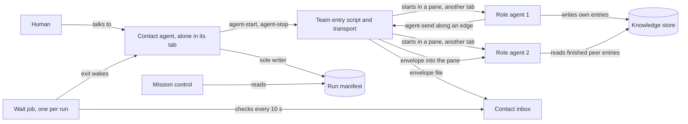

Caption: the contact agent is the only path from the human to the team and the only writer of the manifest; nothing is typed into its pane. The wait job checks the inbox every 10 seconds and exits on the first file, which wakes the contact agent (S-226).

## §3 L2 — Service Boundaries & Integration

The transport is a fifth adapter family, beside tracker, forge, notes and build gate (S-4, S-48). One kind per transport (TR-1 to TR-4, PRD Catalog). The existing kind-blind dispatcher selects the kind; it is not edited (S-57, S-60). The feature's own package probes the machine, resolves the best available kind, and hands it to the dispatcher as if configured; a configuration key forces a kind explicitly (S-55, S-60). The probe sets the resolved kind only in its own shell and never exports the loaded marker or the configuration path (S-77). Each multiplexer tool has one recipe file in its transport kind's folder, and the command contract is the same for every tool (S-168, S-214). Everything else — manifest, lifecycle, messages, cleanup, knowledge store — is a package inside the feature with one top-level entry script (S-48, S-52). No agent definition ships; roles are briefs carried to started processes (S-65). Every runtime path pins to the installed plugin root (S-51).

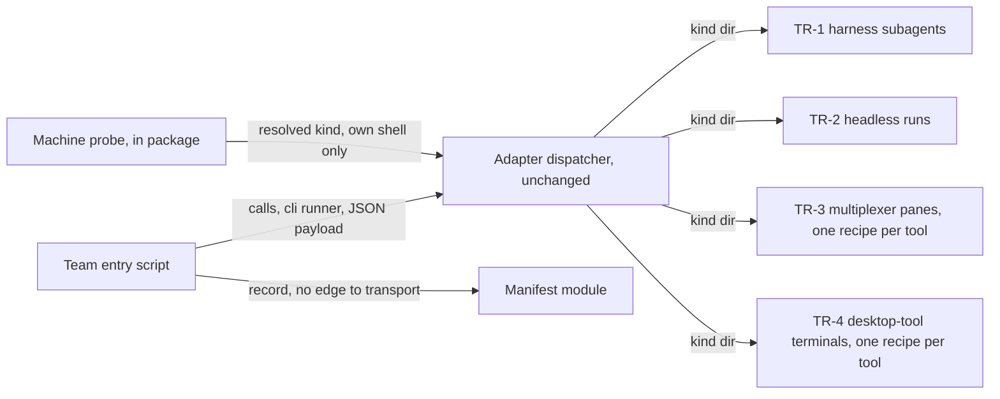

Caption: the skill orchestrates both sides; transport and manifest never depend on each other (S-50).

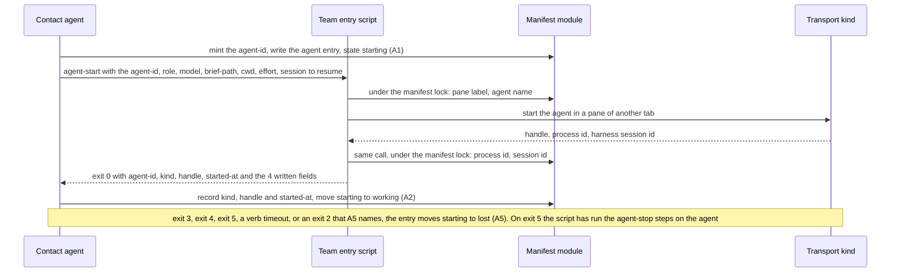

Caption: the entry exists before the start, so no process exists unrecorded (I1). The contact agent mints the agent-id, writes the entry, among its fields stage, lifespan, requester and pattern step, and passes the agent-id to agent-start (correction of 2026-10-05, agent-decided). The script writes the answer's process id, pane label, agent name and harness session id into that entry in the same call, under the manifest lock; a session id reported after the call is never written (S-233). It writes the pane label and the agent name before its transport call, and the process id and the session id after it (audit round 7, agent-decided). The contact agent records kind, handle and started-at when it moves the entry to working (A2, on the start answer; inferred: the correction row leaves the script only these 4 values). When the start works but the script's write after the transport call fails, the script stops the agent and exits 5 (audit L59; correction of 2026-10-05; audit round 7, agent-decided). When the write before the transport call fails, the script makes no transport call and exits 4, naming the write (agent-decided, §13 Q49). Exit 3 and a verb timeout move the entry to lost as well (audit round 8, agent-decided).

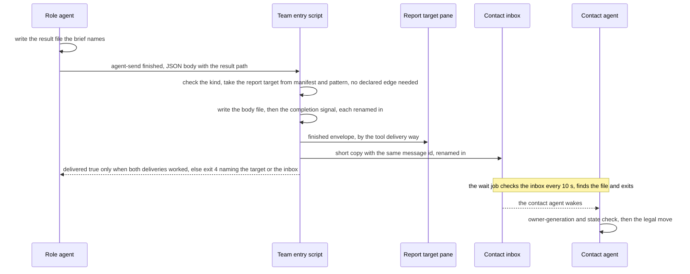

Caption: the result goes to one target; the contact agent learns only the lifecycle move (S-154, S-174, S-188, S-212). The diagram shows a report target other than the contact agent; when the contact agent is the target, both deliveries are its one inbox envelope (§3 row finished: order and partial failure). The script ignores the target the sender wrote, needs no declared edge to the report target (audit L5, agent-decided), and keeps the order body, completion signal, target pane, contact inbox (S-235). The wait job's 10-second check replaces the earlier wake on a landed file (S-226).

**API contract — the transport verbs (HL-2, signed).** Every kind implements all six or answers unsupported. Input: the verb, then one JSON object as the next positional argument; no standard input (HL-2). Runner: `cli` for every kind. Callers: the contact agent; agent-send also has every started agent and the job supervisor as callers (S-130, S-187; §5). agent-status, agent-read and agent-list are for the contact agent only, by convention (S-239). Version: family contract version 1, the first published contract; it ships with the wider agent-send, and no caller ever used an earlier form (S-185). Field types: started-at, at and since are times in UTC, ISO 8601, to the second (S-232; for since, inferred); alive, complete, stopped and pane closed in the answers, and force in the input, are true or false; marker is opaque text that the caller passes back as since-marker (inferred: no settled row states these types).

| Verb | What it does | Input fields | Answer when it works (exit 0) | How it refuses | Time budget (s) | Calling it twice |
|------|--------------|--------------|-------------------------------|----------------|-----------------|------------------|
| agent-start | Starts one agent for one role in a pane, returns the handle to reach it; also starts each job supervisor (S-240). Its launch prompt names the role's charter file before the brief (charter C2, agent-decided), and a resume's launch names it before its prompt (charter C3', agent-decided) | the agent-id of the entry the contact agent wrote (correction of 2026-10-05, agent-decided), role, model, brief-path, cwd (the run's worktree), effort (S-210, S-218), the session to resume (S-213); the script builds the label (S-210). A job supervisor's start names the agent it watches, by agent-id, in its own field (audit round 3, agent-decided): watched-agent-id, whose presence marks a supervisor start (correction of audit round 4, agent-decided). A supervisor start requires watched-agent-id (audit round 4, agent-decided) and takes no other field: any other field gets exit 2 naming it (audit round 5, agent-decided) | agent-id, kind, handle, started-at, process id, pane label, agent name, harness session id (may be empty). The script writes the last 4 into the agent's manifest line in the same call, under the manifest lock (S-233): the line whose agent-id the input names (correction of 2026-10-05, agent-decided), the pane label and the agent name before its transport call, the process id and the session id after it (audit round 7, agent-decided); only an agent start writes them, and the contact agent writes a supervisor's process entry from the answer (audit round 3, agent-decided). For TR-4 the answer also carries the terminal identifier, which the contact agent writes with kind and handle (audit round 8, agent-decided). An agent start answers the agent process's creation time, read from the operating system, as started-at (agent-decided, §13 Q50). A supervisor start answers only the process id and the label of its process entry (§4; audit round 6, agent-decided); the contact agent writes that entry with the answer's process id (audit round 5, agent-decided), and the entry's started-at stays the operating system's creation time (S-232; audit round 6, agent-decided). When the start works but the write after the transport call fails, it stops the started agent with agent-stop's steps, the kill then the pane close, and exits 5 (audit L59; correction of 2026-10-05; audit round 3; audit round 7, agent-decided) | exit 4 unavailable when the tool is absent, when a first-run dialog blocks the start (S-186), or when the settings copy fails (S-191); exit 4 naming the resume when a resume fails; exit 4 naming the tab when a tool that can make tabs fails to make one; exit 4 naming the write when the write before the transport call fails, with no transport call made (agent-decided, §13 Q49); exit 2 error when a required field is missing, and naming the field for an unknown effort (S-233); exit 2 naming the agent-id when it has no entry or its entry is not in state starting, as the other verbs refuse an unknown agent-id, on an agent start only (correction of audit round 3; audit round 3, agent-decided); exit 2 naming the agent for a second supervisor of one agent (S-240); exit 2 naming the watched-agent-id when it has no entry (audit round 4, agent-decided); exit 2 naming any field other than watched-agent-id on a supervisor start (audit round 5, agent-decided); exit 2 naming the name when role, model, effort and suffix leave no room for 1 goal character, or for g- and 1 character when the goal needs g- (audit round 2; audit round 6, agent-decided), the room being 32 less the 3 joining '-' and the lengths of role, model, effort and suffix (audit round 7, agent-decided); exit 5, error true naming the agent-id, with stopped, pane closed and the pane id, when the start works but the write after the transport call fails (audit round 7, agent-decided), after the script has run agent-stop's steps on the agent (audit L59; correction of 2026-10-05; audit round 3, agent-decided), and with the process id and the kind (audit round 5, agent-decided; the kind inferred, §3 exit 5), and started-at (audit round 9, agent-decided); pane closed and the pane id appear only for a pane kind (audit round 6, agent-decided) | 120, then unavailable | Starts a second agent while the entry is in state starting; once the entry has left starting, a second call with the same agent-id gets exit code 2 (correction of audit round 3, agent-decided). Not idempotent; the caller checks the manifest first |
| agent-send | Delivers one message along a declared edge; the receiver gets a fixed envelope (S-130, S-132) | sender agent-id, owner generation, target, kind, message id, body-path (S-130, S-178) | delivered true, at (S-183) | exit 2 on a malformed payload, an undeclared edge or unlisted kind, or an unknown agent-id; exit 4 when the receiver is gone; exit 3 where the contact agent cannot be addressed (S-184, S-196, S-142) | 30 | Idempotent by message id: the receiver ignores an id already handled (S-133, S-172) |
| agent-status | Reports whether an agent is alive and its state | agent-id | alive, state, since | exit 2 on an unknown agent-id | 10 | Same answer. Idempotent |
| agent-read | Returns output after a caller-supplied marker | agent-id, since-marker | text, marker, complete | exit 2 on an unknown agent-id or unreadable marker | 30 | Same answer for the same marker. Idempotent |
| agent-stop | Closes one agent and the process tree it owns, then closes its pane (S-234). It acts only on an agent that has a manifest entry (correction of audit round 3, agent-decided); for an agent-id with no entry it answers exit 0, stopped false, with the reason that no entry holds the agent-id (audit round 4, agent-decided). It kills by the process id when the entry holds one and closes the pane when the entry holds a handle (audit round 7, agent-decided). It kills only after AC-013's identity check, that the live process's creation time equals the entry's started-at, for an agent entry as for a process entry; it closes a TR-4 terminal by the entry's terminal identifier (AC-031); and it answers an entry that holds neither a process id nor a handle with stopped true and the method 'nothing recorded' (audit round 8, agent-decided). For an agent entry, the identity check compares the entry's started-at with the live process's creation time, both cut to the second (agent-decided, §13 Q50). Kind and handle are always written together, so an entry with an empty kind has no handle (audit round 9, agent-decided); it has no started-at either and takes the answer's path for an entry with no started-at (audit round 10, agent-decided), which kills nothing and closes no pane, so the answer is the same whatever kind runs it (inferred). A Codex pane agent's shell child outlived a pane close with no live parent, owned by the sandbox user, whose process the operator could not stop (providers/CONFORMANCE.md:330, re-probe 2026-10-06); whether the kill reaches it is §13 V28 | agent-id, force | stopped true with the method, or stopped false with the reason; pane closed true or false, and the pane id (S-234), only when the entry holds a handle (audit round 8, agent-decided), and for a pane kind only (inferred: a kind that opens no panes has no pane to close), except TR-4, for which pane closed reports the terminal close and the answer names the terminal identifier in place of the pane id (audit round 9, agent-decided). When the identity check fails because the live process's creation time differs from the entry's started-at or no process has the identifier, it kills nothing and answers stopped true with the method 'already gone' (inferred: AC-013 reports such an entry as already gone, and an agent already stopped gets stopped true, S-224). An entry that holds a process id and no started-at cannot pass the check, so agent-stop kills nothing (audit round 9, agent-decided). When no live process has that id, it answers stopped true with the method 'already gone', and the entry moves to cleaned (A6; AC-013); when a live process has it, it answers stopped false with the reason 'identity unknown', and the entry moves to unkillable (A7), and to cleaned when a later agent-stop answers stopped true without pane closed false (audit round 10; audit round 11, agent-decided) | Never refuses; a failure to stop is exit 0 with stopped false. A failed close leaves stopped true, answers pane closed false and names the pane, or the terminal identifier for TR-4 (audit round 9, agent-decided); the contact agent marks the line unkillable (S-234) | 60, then stopped false naming what survived | stopped true for an already-stopped agent. Idempotent, because cleanup retries; key: the agent id (S-224). A second close does nothing, because its key is the pane id (S-225) |
| agent-list | Lists the agents whose agent name starts with the run's goal (the ticket key or the short feature name, S-237), to check a manifest against reality; this match stays (correction of audit round 4, agent-decided). Before it matches, it makes the goal legal (correction of 2026-10-05, agent-decided) and cuts it to a prefix whose length is the shortest, over the run's manifest entries with a non-empty agent name, of the common prefix of the legal goal and that name, capped at the legal goal's length; entries with an empty name are skipped (audit round 6, agent-decided). It keeps the whole legal goal when the manifest names none (audit round 5, agent-decided). The list includes agents the manifest does not name (strays), so cleanup can find them (S-237). Cleanup stops no stray: a name prefix can match another run's agents, which costs a report line, not a stop, so cleanup lists each stray, by agent name and pane id, in its report, and the human stops it (correction of audit round 3, agent-decided; correction of audit round 4, agent-decided). A stray is a listed agent whose pane id no manifest entry holds as its handle (audit round 3, agent-decided); an agent whose entry holds its agent name but no handle, as after a verb timeout, is a stray too (inferred: after a failed start other than exit 5, no cell writes the handle), and the human closes it, as any leftover agent (audit round 8, agent-decided); V26 probes that agent-list returns the name and the pane id | none; the script takes the goal from the run, as it does for the pane label (S-210; inferred) | agents, each with agent name and pane id (correction of audit round 4, agent-decided), and agent-id and state, both empty for a stray (inferred: a stray has no entry); no paging, no sort (S-237) | exit 3 unsupported where the kind cannot enumerate; cleanup then skips the stray list, and its report says that the kind cannot list agents (audit round 3, agent-decided). A kind whose handle is not a pane id, TR-4 included, answers exit 3 too (audit round 4 and audit round 5, agent-decided) | 10 | Same answer. Idempotent |

Answer shapes, inherited unchanged from the adapter contract (S-31):

| Situation | Answer | Exit |
|-----------|--------|------|
| The verb succeeded | the family's normalized object | 0 |
| The verb is not part of this kind | unsupported true, with a reason | 3 |
| The kind is selected but its runtime is missing | unavailable true, with a reason | 4 |
| The payload is not one JSON object, or a field is bad | error true, with operation and reason | 2 |
| The family or kind cannot be resolved from configuration | a message naming the config file, on stderr, not JSON | 2 |

agent-start has one exit code of its own, 5: the start worked, the script's write after the transport call failed (audit round 7, agent-decided), and the script then tries to stop the agent: the one stop outside agent-stop and an E2 trigger (correction of audit round 3, agent-decided). Its answer is error true with operation and reason, and names the agent-id (audit L59; correction of 2026-10-05, agent-decided; 5 is the writer's pick, the next code after the table's highest, and the shape is exit 2's). That stop follows agent-stop's steps, the kill then the pane close, and the answer adds stopped, pane closed and the pane id (audit round 3, agent-decided), and the process id and the kind (audit round 5, agent-decided; that the answer carries the kind is inferred: the row has the contact agent write the answer's kind), and started-at (audit round 9, agent-decided); pane closed and the pane id appear only for a pane kind (audit round 6, agent-decided). For TR-4 the answer also carries the terminal identifier (inferred: the row of audit round 8, agent-decided, puts it in agent-start's answer, to be written with kind and handle). The contact agent writes the answer's kind, handle, process id and started-at, and for TR-4 the terminal identifier, into the entry as it moves it to lost (A5; started-at: audit round 9, agent-decided), and a retry is a new start with a new agent-id (correction of audit round 4, agent-decided; audit round 5, agent-decided), which comes in the re-run (inferred: the park after exit 5 ends the run, audit round 9, agent-decided); that handle is the kind's handle: the pane id for a pane kind (audit round 6, agent-decided), and the process id for a kind that opens no panes, TR-4 included (audit round 7, agent-decided). Cleanup calls agent-stop on that lost entry as on every remaining entry (audit round 5; audit round 7, agent-decided). Exit 5's stop gets what is left of agent-start's 120 s, and when that runs out, the answer says stopped false (audit round 4, agent-decided); the script ends that stop 5 s before the 120 s, and agent-stop's own 60 s does not apply to it (audit round 5, agent-decided).

After agent-start exit 5 or a verb timeout, the entry moves to lost (A5), and the contact agent starts no new agent and ends the run parked, naming the agent-id and the agent name; the human closes any leftover agent and re-runs (audit round 8, agent-decided). The park has no condition, and that an agent may run unrecorded is its reason: it is the run's end, and the park is run-level (audit round 13, agent-decided). Under /afk:execute, its outcome is the status unrecorded_agent: the line `OUTCOME: unrecorded_agent — AGENT-ID AGENT-NAME` and the PLAN.md cell `blocked(unrecorded_agent: AGENT-ID AGENT-NAME)`, where AGENT-ID and AGENT-NAME stand for the agent-id and the agent name (the status: audit round 10; the forms: audit round 13, agent-decided). Under /afk:autopilot, step 4 gains one rule: a team park ends the walk, whether it arrives as a subtask's unrecorded_agent outcome or as the contact agent's own park of a subtask agent's start, and no further subtask starts; the Finish report names the agent and lists each subtask not started, and a journal line records it (audit round 13; the team park and the list: audit round 14, agent-decided). One plan subtask adds the status, in one change, to every surface that names statuses, from the §14 row 'Outcome status set of /afk:execute omits unrecorded_agent' (§13 Q52; audit round 13; the §14 row: audit round 14, agent-decided). Under /afk:autopilot, when the subtask agent asked for the start, the contact agent answers its start request with the park, naming the agent-id and the agent name, as it answers a request it refuses (S-187), and runs the cleanup after the subtask agent's OUTCOME line arrives; when the failed start is the subtask agent's own, the contact agent ends the walk itself, its Finish report names the agent, and the subtask's row keeps its status, as a stranded row does (§13 Q53, agent-decided). Under any other skill, the contact agent reports the park to the human in its reply per REPORTING.md, naming the agent-id and the agent name (audit round 13, agent-decided, as the row of audit round 12 said). Cleanup runs at that end as at any run end; while any entry stays unkillable, or a process entry is left after a failed kill (I5; audit round 13, agent-decided), it skips steps 2 to 5, and its report says the message area, the knowledge store, the resolved pattern and the manifest are kept for the next cleanup (E6; audit round 12, agent-decided), and a re-run's cleanup finishes what is left (E6; audit round 9, agent-decided). A re-run adopts the kept manifest (AC-015); before any start, its contact agent runs cleanup step 1 on the kept manifest: it kills each leftover process entry and calls agent-stop on each unkillable agent entry, and when nothing is left the run goes on, else it parks again (audit round 12; step 1 and the process entries: audit round 14, agent-decided). Exits 2, 3 and 4 move the entry to lost as A5 states, and no agent runs; the fresh start after a failed resume stands (S-233; audit round 8, agent-decided).

Paging: agent-list returns every match in one answer; agent-read keeps its marker; the other 4 verbs take one item, so paging does not apply (S-237). Six verbs only: closing a pane is part of agent-stop, and no seventh verb exists (S-234).

No idempotency key on any verb (S-18), except agent-send, whose key is the message id (S-133, S-172), and agent-stop, whose key is the agent id (S-224). Nothing retries automatically (S-17). Waiting is message-driven where the contact agent is addressable, and polling agent-status otherwise (S-142).

**agent-send contract (HL-2, signed R-45, HL2-3 table 1).**

| Contract field | Contract | Source |
|----------------|----------|--------|
| Callers | Every started agent and the job supervisor, not only the contact agent | S-130, MSG-1 |
| Input fields | sender agent-id, owner generation, target (a role, or contact), kind, message id, body-path; one JSON object as the positional argument. The sender builds the message id from its own agent-id and its own counter, and uses the same id when it sends the message again (S-178). For finished, the script ignores the target field (S-235) | S-130, MSG-1, S-235 |
| kind values | message, finished, parked, exited, start-request | S-130, S-149 |
| Validation: edge | Delivered only along an edge (a message path the pattern allows between 2 roles) that the resolved pattern declares, and only a kind that edge lists. The contact agent may always send a message to an agent it started (S-187). Every agent may also send the contact agent a start-request and its own finished, parked and exited without a declared edge; the job supervisor sends those as the agent it watches (S-131, AC-035, S-236). A finished message to a report target other than the contact agent needs no declared edge either: the script takes the target from the manifest and the pattern (S-235; audit L5, agent-decided). The contact agent gets a short copy of each finished, parked or exited (S-216) message, for the manifest only; the team entry script delivers it with the same message id (S-212, S-188). A role and its resolved report target may also send each other kind message, both ways, with no declared edge (charter C4, agent-decided): the 2 implied edges join the role and whoever its target is, another role of the pattern, the agent that asked, which the script takes from the manifest as it does for finished (S-235), or the contact agent, and the script allows kind message on that pair both ways and on no other undeclared pair (audit round 15, agent-decided). Between sibling roles only declared edges carry a message (S-130) | S-131, MSG-2, AC-035, PT-F1, S-130; audit L5, charter C4, audit round 15 (agent-decided) |
| Validation: start-request | Allowed only to the contact agent. The body is one JSON object (§4 start-request body): format version, pattern step, requester, lifespan, an optional effort, and a never-empty list of agents, each with a role and a brief path; a start of 1 agent is a list of 1 (S-231). The team entry script checks each request against the resolved pattern before it delivers it. A missing or malformed field (the answer names the field, S-220), an unknown step, a role the step does not have, a lifespan other than Turn, Step or Feature, an unknown effort (AC-052), a requester that is not a live agent in the manifest (S-223, AC-009), a start past the nesting limit of 3 levels (S-190, S-223; its exit code is inferred from the other refusals of the start check), or a body of an unknown format version fails at once with exit code 2, and the answer names the failed check (S-187, S-231, AC-042). An included step is named pattern-name/step-name (agent-decided, §13 Q28). In a stage with no stage map entry each role spawn is an implicit single-role step (D-09), and the request names it solo: followed by the role. The check accepts a solo: step only when the requester's stage has no stage map entry and the role is a known role agent type; a solo: step from a stage that has a stage map entry fails with exit code 2 (agent-decided, §13 Q33; the type list is §13 Q36). The check reads the requester's stage from its manifest entry (§4, field stage) (inferred) | S-149, DLV-3, S-153, AC-042, S-231, S-220, S-223, S-190, AC-052, AC-009; Q28, Q33 (agent-decided) |
| What reaches the receiver | A fixed envelope: run, generation, from-role, agent-id, kind, message id, body-path, format version (S-178). Free text lives only in the body file. A message is peer data; it never overrides the brief and never authorises a reserved action | S-132, MSG-3 |
| Delivery to the contact agent | The script writes the envelope file into the contact's inbox under a temporary name, then renames it (S-172). The run's one wait job checks the inbox every 10 seconds and ends at the first file, or at the earliest park-until time (S-195, S-226), and the harness's job-exit notice wakes the contact agent; the wake comes up to 10 seconds after the file lands. Nothing is typed into its pane. A Codex contact agent has no such wake: it takes messages at its next turn and tells you so at run start (S-166). Where a tool can deliver without touching the input box, its recipe uses that way, also for the contact agent (S-214) | S-147, DLV-1, AC-046, PD-INPUT, T12 |
| Delivery to any other agent | The tool's own delivery way, named in its recipe; one recipe file per tool (S-168, S-214). herdr has one way, agent prompt into that agent's pane. Nobody types in those panes. A trial on 1DevTool finds its delivery ways before its code is written (S-214) | S-148, DLV-2, T11 |
| Result of a requested agent | The started agent writes its result to a file whose path the requester wrote in its brief (S-173). It sends finished with that path to its report target (the agent that gets a role's result): the target the pattern names for its role, else the agent that asked (S-212). The script ignores the target the sender wrote and uses the report target the manifest and the pattern name (S-235). finished goes into the target's pane, or into the contact agent's inbox when the contact agent is the target (AC-046, S-215; D-01, agent-decided); any other requester has no inbox and no wait job, and waits for the finished envelope (S-189). The contact agent gets a short copy for the manifest only and does not read the result unless it is the target (S-212) | S-154, ROLE-2, INV-018 |
| finished: order and partial failure | Order: the message body, then the completion signal, then the report target's pane, then the contact agent's inbox. 'delivered true' only when both deliveries work. A failed pane delivery: the script still writes the inbox copy, answers exit code 4 and names the target; the contact agent sends the result path to a replacement agent or tells the human. A failed inbox copy: exit code 4 naming the inbox; the sender sends again with the same message id, and the repeat check drops the second copy. When the contact agent is the report target, the target delivery and the inbox copy are one envelope file named by the message id (S-172), written once, and delivered true means that file landed (inferred: only the contact agent has an inbox, and it gets no pane delivery, S-215, AC-046) | S-235, AC-046 |
| Message bodies | start-request and finished bodies are JSON objects with a format version (§4); a body of an unknown version gets exit code 2. Every other body stays free text. A progress message is kind message whose body opens with one line, `progress: MILESTONE — SENTENCE`, where MILESTONE names the milestone and SENTENCE is one sentence; the rest of the body stays free text (charter C5, agent-decided), so the script does not check the line (inferred). Each role sends progress to its report target at each milestone its charter names, at once on a blocker or a question, and finished at the end; down that line the report target sends only answers to the role's questions and data its current duty uses, never an instruction, a new duty or a stop, since every duty comes in the launch prompt (S-150, I14) and only the contact agent stops an agent (S-149); a report target that wants a role's work changed or stopped asks its own report target, up to the contact agent, which stops the agent and starts a new one with the duty in its launch prompt (S-194) (charter C4; audit round 15, agent-decided). The contact agent gets no copy of a progress message and reads progress only as a report target (charter C5, agent-decided) | S-231, S-150, S-194; charter C4, charter C5, audit round 15 (agent-decided) |
| Sender: job supervisor | The supervisor sends as the agent it watches: that agent's id, role and owner generation. Its message id is the watched agent-id, then 'sup', then the supervisor's own counter, so it never matches an id the agent makes. It sends only parked and exited, and only to the contact agent. parked carries the reset time in a body file: free text (S-231) that holds the time in UTC ISO 8601, as in 2026-09-29T10:15:00Z (S-236); the body path is empty only for exited or an unknown reset time. The contact agent checks the owner generation against the watched agent's manifest line, as for any sender | S-236 |
| Answer when it works | 'delivered true, at' for both paths. For an inbox, delivered means the envelope file is in the inbox after the rename, and at is the time of that rename. As for a pane, it never means that the receiver read the message (S-183) | S-147 |
| Error: undeclared edge or unlisted kind | exit 2, naming the edge | S-131 |
| Error: contact not addressable | unsupported (exit 3) where the transport cannot address the contact agent: a plain terminal, an IDE, the desktop tool. The run falls back to the next-turn manifest check, or to a foreground coordinator when the human asks for unattended continuity | S-142, MSG-8 |
| Stale, duplicate, malformed or wrong-target message | The script cannot see that a message is old or repeated: it answers 'delivered true, at'. The receiver ignores the message when it applies it, and moves it to its processed folder. Nothing goes back to the sender. A message along an undeclared edge, or of a kind the pattern does not list, gets exit code 2, naming the edge. A malformed payload: see the row 'Error: malformed payload' (S-184) | S-133, MSG-4 |
| Calling it twice | The message id is the idempotency key. A receiver ignores an id already in its processed folder (S-172). A lifecycle kind applies only as a legal move after the owner-generation check (the takeover counter) and a state check (S-176). A sender that is unsure sends again with the same message id (S-196) | S-133, MSG-4 |
| Idempotency posture (SDD §3 line, §5 idempotency table) | The rule 'no idempotency key on any verb' is amended for agent-send (key = message id) and for agent-stop (key = agent id, S-224). The run remembers message ids for the whole run. The receiver's processed folder is the record of handled messages (S-172) | S-133, S-224 |
| Waiting | Message-driven where the contact agent is addressable; polling agent-status otherwise | S-142 |
| Auth: harness permission | The one allow rule matches the team entry script, so it covers the widened agent-send. A Claude worker reads the same user settings (T11 case F: the send ran, 'Allowed by auto mode classifier'). A Codex worker runs under the authorised full-auto launch flags. The contact agent creates tabs and panes only inside the agent-start verb of the team entry script, never by a direct herdr call, so the one allow rule on the script covers tab create and pane split (S-167) | S-136, AUTO-3, AUTO-1, AUTO-2, T11 |
| Verdict on existing callers | Version 1 is the first published contract, and it ships with the wider agent-send. No caller ever used an earlier form, so no existing caller breaks (S-185) | S-130 |
| Error: malformed payload | A payload that is not one JSON object, or that has a bad field: exit code 2, 'error true', with the operation and the reason (S-184) | S-184, STALE-1 |
| Error: failed delivery | Exit code 4 (receiver gone) or exit code 2 (unknown agent-id), as the signed agent-send row says. The body file stays as an orphan until cleanup. The sender may send again with the same message id (S-196) | S-196, MFX-1 |
| Same contract for every multiplexer | The command contract is the same for every multiplexer (the terminal tool that holds the panes). Each tool's recipe names its best delivery way, and that tool's code uses it (S-214). Agents call only the script; the script's error output points at the recipe for the tool in use (S-168) | S-214, S-168, MUX-2, MUX-1 |

**agent-start changes (HL-2, signed R-45, HL2-3 table 2).**

| Contract field | Contract | Source |
|----------------|----------|--------|
| Refusal: first-run dialog | The transport stops the blocked process. It answers exit code 4, 'unavailable true', with a reason that names the dialog: the project MCP-server dialog, the Claude auto-mode 'Teach auto mode' dialog, or the Codex update prompt (S-152). It never answers the dialog. The agent entry moves from starting to lost. The contact agent tells you once the dialog's name and how to clear it. A new start is a new entry. No new answer shape (S-186) | S-152, LCH-3, T8, T10 |
| cwd field | Every agent starts in the run's worktree | S-152, AC-008 |
| Charter in the launch prompt | At resolve time the team script writes one charter file per role into the run directory: the pattern part, then that role's part (§4 charter file). agent-start's launch prompt names the role's charter file before the brief, so the charter is the agent's standing instruction and the brief its task; the brief still carries the task and never the human's conversation (AC-025, S-150) (charter C2, agent-decided). agent-start takes no new input: it finds the file by the role of the entry the agent-id names (inferred: the script names the file by the role, §4). An agent with no charter file, such as one started for a solo: step, gets a launch prompt that names only its brief (inferred, §13 Q54). A resume's launch names the charter file before its prompt, as a first start does, so no hook carries a resume (charter C3', agent-decided). A provider's native system-prompt flag carries the charter too, only where a probe at build proves it (charter C3', agent-decided; §13 V27) | charter C2, charter C3' (agent-decided); S-150, AC-025 |
| Request path for other agents | Any agent other than the contact sends agent-send kind start-request. The team entry script checks it before delivery and answers exit code 2 on an unknown step, a role the step does not have, a solo: step from a stage that has a stage map entry (agent-decided, §13 Q33), a bad lifespan, or any other failed check of the row Validation: start-request. When the contact agent refuses a delivered request, it sends the requester a message whose body names the request's message id and the reason (S-187). Asking for an agent does not make the 2 agents talk: each role reports to its report target (S-212) | S-149, DLV-3, AC-042, PD-START, T12; Q33 (agent-decided) |
| effort field | The start command gains an effort field: lo, med, hi or max (S-210). The start request gains the same field, optional; when it is empty, the team script uses the effort the plugin's model rules give that role (S-218) | S-210, NAME-1, S-218, EFF-1 |
| Pane label | The team script builds a four-part name from the start request: goal, role, model, effort, separated by spaces, with #2, #3 when two names are the same. Goal is the ticket key, or else the feature name cut to 16 characters. No agent types it. The same name labels the pane, the manifest agent entry and the cleanup report (S-210). herdr also gets an agent name: the same 4 parts in lowercase, joined by '-', at most 32 characters; every part is made legal by one rule, the goal part is cut first, and a -N suffix counts inside the 32 (S-217; audit L15; correction of audit round 3, agent-decided); the model part drops a vendor prefix ('claude-', 'gpt-'), is then made legal and is then cut to 8 characters, all before the goal cut (correction of audit round 4, agent-decided; audit round 5, agent-decided), and the pane label carries the same model part (S-217; clarification of audit round 5). The rule lowercases a part, turns each character herdr refuses into '-' and puts g- before a first character that is not a lowercase letter; g- counts inside the 32 characters, and when role, model, effort and suffix leave no room for 1 goal character, or for g- and 1 character when the goal needs g-, agent-start refuses with exit code 2, naming the name (audit round 2; correction of audit round 3; audit round 6, agent-decided). The 3 '-' that join the 4 parts count too: the goal's room is 32 - 3 - role - model - effort - suffix, each its length in characters (audit round 7, agent-decided) | S-210, NAME-1, S-217, NAME-2; audit L15, audit round 2, correction of audit round 3, correction of audit round 4, audit round 5, audit round 6, audit round 7 (agent-decided); clarification of audit round 5 |
| Harness session id and resume input | At start, the team script gives each agent a harness session id (the id the coding tool gives a conversation) and stores it in the manifest agent entry; the id may be empty (S-233). agent-start gains one start input: the session to resume. When an agent dies or stops early, the contact agent first starts a new pane that resumes that session; if the resume fails, it starts a fresh agent that reads the checkpoint (S-213) | S-213, RESUME-1 |
| Answer fields | The answer adds process id, pane label, agent name and harness session id, and for TR-4 the terminal identifier, which the contact agent writes with kind and handle (audit round 8, agent-decided). The script writes these 4 values into the agent's manifest line in the same call, under the manifest lock: the line whose agent-id the input names (correction of 2026-10-05, agent-decided); the pane label and the agent name before its transport call, the process id and the session id after it (audit round 7, agent-decided). Only an agent start writes them; a supervisor start writes nothing, and the contact agent writes the supervisor's process entry from the answer (audit round 3, agent-decided). A supervisor start answers only the process id and the label of its process entry (§4; audit round 6, agent-decided); the contact agent writes that entry with the answer's process id (audit round 5, agent-decided), and the entry's started-at stays the operating system's creation time (S-232; audit round 6, agent-decided). A session id the tool reports after the call ends is never written, so a later recovery starts a fresh agent | S-233, R46-START, S-232; correction of 2026-10-05, audit round 3, audit round 5, audit round 6, audit round 7, audit round 8 (agent-decided) |
| Refusals added | An unknown effort: exit code 2, naming the field. A failed resume: exit code 4, naming the resume; the line moves to lost, and the contact agent starts a fresh agent that reads the checkpoint. A tab that cannot be made: exit code 4, naming the tab. A failed write before the transport call: exit code 4, naming the write; no transport call is made, and the line moves to lost (agent-decided, §13 Q49). A second supervisor for one agent: exit code 2, naming the agent. A watched-agent-id with no entry, on a supervisor start: exit code 2, naming the watched-agent-id (audit round 4, agent-decided). Any field other than watched-agent-id, on a supervisor start: exit code 2, naming it (audit round 5, agent-decided). A name with no room for 1 goal character, or for g- and 1 character when the goal needs g-, the 3 joining '-' counted: exit code 2, naming the name; the line moves to lost (audit round 2; audit round 6; audit round 7, agent-decided). An agent-id with no entry, or an entry not in state starting, on an agent start: exit code 2, naming the agent-id; no line moves (correction of audit round 3; audit round 3, agent-decided; that no line moves is inferred). A start that works while the write after the transport call fails: exit code 5, naming the agent-id, with stopped, pane closed, the pane id, the process id, the kind (the kind inferred, §3 exit 5) and started-at (audit round 9, agent-decided); the script has run agent-stop's steps on the agent, and the line moves to lost with the answer's kind, handle, process id and started-at (audit L59; correction of 2026-10-05; audit round 3, agent-decided; correction of audit round 4, agent-decided; audit round 5, agent-decided; audit round 7, agent-decided; started-at: audit round 9, agent-decided). Pane closed and the pane id appear only for a pane kind, and the handle is the kind's handle (audit round 6, agent-decided): the process id for a kind that opens no panes, TR-4 included (audit round 7, agent-decided) | S-233, S-240, AC-052, AC-054; audit L59, correction of 2026-10-05, audit round 2, correction of audit round 3, audit round 3, correction of audit round 4, audit round 4, audit round 5, audit round 6, audit round 7, §13 Q49, audit round 9 (agent-decided) |
| Order before a resume | The contact agent stops the old agent with agent-stop, which closes its pane, then marks the old line cleaned, then resumes. When the stop fails, it marks the line unkillable, does not resume, and tells the human | S-242, AC-056 |
| Settings copy and its error | Inside agent-start, before the first start in a worktree the run created, the script copies the main checkout's git-ignored .claude/settings.local.json into that worktree. When the file exists, it skips the copy and reports that. When the copy fails, it removes a partial file, starts no agent, and answers exit code 4, naming the copy (S-191) | S-191, SET-1 |

## §4 L3 — Data Architecture

| State | Datastore | Partitioning | Replication | Retention | Schema-evolution policy | PII? | Audited? (Envers) |
|-------|-----------|--------------|-------------|-----------|--------------------------|------|-------------------|
| Run manifest | One JSON file, main checkout ignored agent directory (S-9, S-102) | One file per feature (S-11) | None | Deleted by the explicit cleanup step (HL-1) | Format version integer; unknown version = foreign file, not read, not deleted, reported once | No | No |
| Running checkpoint | One file per role per run; the script builds its path from the feature and the role (S-239) | Per feature and role | None | Deleted by the same cleanup step | Same version rule | No | No |
| Knowledge store | One file per entry, ignored agent directory, keyed by feature (S-9) | Per run of one feature | None | Deleted by the explicit cleanup step that closes desktop-tool terminals (S-12); never promoted (S-14, S-87) | Same version rule | No | No |

Environment facts are re-detected each run; nothing is promoted to any durable register (S-14, S-87).

**Records added in rounds 40 to 46 (HL-1, signed R-45, HL1-6 table 1; round-46 rows S-228 to S-232 under the delegation, §0).** Every record is new with this feature.

| Record | Datastore | Partitioning | Identity + uniqueness | Retention | Schema-evolution policy | Migration + backfill | PII? | Audited? (Envers) | Source |
|--------|-----------|--------------|-----------------------|-----------|-------------------------|----------------------|------|-------------------|--------|
| Resolved pattern | One JSON file in the git-ignored run directory | One file per run | One per run; no other key settled | Deleted by the cleanup step; read by adoption (AC-015) to rebuild the team | Carries record version and schema version; the manifest's version rule (SNAP-1 card: 'the same retention and version rule as the manifest') | None: the file is new (inferred from SDD §4 'neither file exists today') | No (S-170) | No: run state, deleted with the run (S-170) | S-139, SNAP-1, PT-D8, AC-004 |
| Message body | One file per message under the run directory, named by message id. The script writes it under a temporary name, then renames it, before it delivers the envelope (S-196) | Per run | Message id; one file per message | Deleted at cleanup, in step 2, with the message area of the run directory (S-198) | Free text with no fixed format and no version, that the envelope points to (S-171), except 2 kinds: a start-request body and a finished body are JSON objects with a format version, and a body of an unknown version gets exit code 2 (S-231) | None: the file is new (inferred) | No (S-170) | No: run state, deleted with the run (S-170) | S-140, MSG-6, S-132 |
| Envelope file in an inbox directory | One envelope file per message, named by its message id, in the receiver's inbox (a folder where messages for an agent land) in the run directory. The team entry script (the one script agents call to start, message and stop agents) writes it under a temporary name, then renames it, so a wait job never sees half a file. After the receiver applies or ignores it, the receiver moves it to a processed folder beside the inbox (S-172) | One inbox per run. Only the contact agent has an inbox, named by the role contact, not by session, so a new contact session that takes over the run reads the same inbox (S-172). Every other agent gets its messages in its pane (S-189, S-215) | The message id, which is the file name. It is unique within the run. A message id already in the processed folder is a repeat and changes nothing (S-172, S-178) | Kept in the processed folder after it is handled; the run remembers ids for the whole run. Cleanup deletes the inbox and the processed folder with the run directory, in step 2 (S-172, S-198) | Carries a format version number. A file of an unknown version is foreign: the run does not read it, does not delete it, and reports it once (S-171) | None: new (inferred) | No (S-170) | No: run state, deleted with the run (S-170) | S-147, DLV-1, S-154, ROLE-2, T12 |
| Result file | A file whose path the requester (the agent that asked for the new agent) picks and writes in the brief. When the stage already names a report location, the file goes there, for example plan/review/ for the adversary's report. Otherwise it goes in the run directory (S-173). /afk:review names no file per concern worker, so a review worker's result file sits in the run directory with no round tag; only the review orchestrator writes findings files under plan/review/ (D-19, agent-decided). Readers: the report target; the requester and the contact agent only when they are the target; every other agent is denied, by convention (S-239) | One per started agent (inferred from S-154) | The path the brief names | In the run directory: deleted at cleanup with it, in step 2. At a location the stage names: the stage's own lifetime; plan/ lives until /afk:gc runs after the merge (S-173, S-198) | The team sets no format. The stage whose brief names the file owns its format, for example the review findings JSON (S-171) | None: new (inferred) | No (S-170) | No: run state, deleted with the run (S-170) | S-154, ROLE-2 |
| Completion signal | One small JSON file in the run directory, named by agent-id. The team entry script writes it when it accepts a finished message, before it delivers the envelope, under a temporary name, then renames it (S-174) | One file per agent per run. A replacement agent has a new agent-id and its own file (S-174) | agent-id (S-174) | Deleted at cleanup with the run directory, in step 2 (S-174, S-198) | Carries a format version. Follows the version rule of the signed design (S-174): a file of an unknown version is foreign, not read, not deleted and reported once (S-171 states the rule for the envelope; inferred for this file) | None: the file is new (S-174) | No (S-170) | No: run state, deleted with the run (S-170) | S-141, MSG-7 |
| Pattern record (built-in or saved) | A built-in record is a data file shipped with the plugin, one per built-in pattern BP-1 to BP-5; a saved record lives in the human's configuration | One record per pattern | The name, unique across built-in and saved patterns. The configuration reader refuses a saved pattern that uses a built-in name, and 2 saved patterns with one name (S-229) | A built-in record ships with each plugin version. A saved record stays in the human's configuration until the human removes it. No run writes either (S-229) | Versioned record. A built-in or saved pattern record of an unknown version: the run refuses the pattern at start, naming the pattern and the version; no smaller team runs instead (S-171). A record of an older, known version is read as it is (S-229) | None: nothing needs a backfill (S-229) | No (S-170) | No. A built-in record ships in the plugin files, so the plugin's git history records each change to it (S-170) | S-143, PAT-1, PT-F8R, AC-032, AC-034, S-228, S-229 |
| Stage map entry | A key in the human's configuration (S-230) | One entry per stage (inferred: a map key) | The stage name (S-230) | Stays in the human's configuration until the human removes it (inferred, as a saved record, S-229) | A new key: an older reader refuses the new keys, so a rollback first removes them from the configuration (S-246). The reader's refusal of a name with no pattern is under Relations (S-230) | None: the key is new (inferred) | No (inferred: S-170 covers 6 other records) | No (inferred: configuration, not run state) | S-230, AC-032, S-246 |
| Pane switch | One key under the transport settings of the human's configuration (S-230) | One per configuration | The key itself | As the stage map entry | A new key: an older reader refuses the new keys, so a rollback first removes it from the configuration (S-246). The reader learns it in the same commit as the other new keys (S-230). An older reader refuses the configuration: the transport family key and its settings blocks are new top-level keys (§14 C1), and the reader refuses an unknown top-level key (scripts/afk-config.py:541-542, pinned by scripts/tests/test_afk_config.py:134); a reader that knows a block refuses an unknown key inside it (afk-config.py:585-597, test_afk_config.py:257) | None: the key is new (inferred) | No (inferred: S-170 covers 6 other records) | No (inferred: configuration, not run state) | S-230, AC-041, S-246 |
| Finished body | The body file of a finished message, under the run directory (S-231) | Per run | Message id, as every body | As the message body | JSON object with a format version; a body of an unknown version gets exit code 2 (S-231) | None: new | No | No | S-231 |
| Start-request body | The body file of a start-request message, under the run directory (S-231) | Per run | Message id, as every body | As the message body | JSON object with a format version; a body of an unknown version gets exit code 2 (S-231); fields under Entity design | None: the file is new (inferred) | No (S-170) | No: run state, deleted with the run (S-170) | S-231, S-149 |
| Charter file | One text file per role in the git-ignored run directory; the team entry script writes it at resolve time, the pattern part, then that role's part (charter C2, agent-decided) | Per run | The role: one file per role, read by every agent that fills the role (charter C2; inferred for a role whose count is 2 or more) | Deleted at cleanup with the run directory, in step 2 (inferred from S-198) | Free text with no format version: an agent reads it, and no program parses it (inferred) | None: the file is new (inferred) | No (inferred: S-170 covers the other run files) | No: run state, deleted with the run (inferred) | charter C2 (agent-decided) |

**Entity design (HL-1, signed).** The Source column names the settled rows behind each field added or changed in rounds 40 to 46 (packet HL1-6, table 2, signed R-45; round-46 rows under the delegation, §0). A dash marks a field signed before round 40.

Run manifest file. Identity: the feature identifier; one per feature, shared by two runs of the same feature (adoption, AC-015).

| Field | Type | Null? | Default | Unit / precision | Constraint | Indexed / unique | Note | Source |
|-------|------|-------|---------|------------------|------------|------------------|------|--------|
| format version | integer | no | 1 | — | known versions only | — | unknown → foreign file | — |
| feature identifier | text | no | none | — | the key | unique per file | S-11 | — |
| owning contact session | text | no | the session that created the file | — | adoption rewrites it | — | AC-012, S-11 | — |
| agents | list of agent entries | no | empty list | — | — | — | agents only | — |
| processes | list of process entries | no | empty list | — | — | — | S-29 | — |
| owner generation | whole number (S-176) | never empty (S-176) | 1 (S-176) | — | A new contact session that takes over the run adds 1 to it, under the folder lock, when it rewrites the owning contact session (S-176) | — | The owner generation is the takeover counter. Each agent entry copies this value at the start (S-176) | S-176, GEN-1 |

Agent entry. Identity: agent-id within one manifest. A resume adds a manifest line with the same harness session id (S-213). The contact agent writes the entry in state starting before agent-start (A1), and a failed start moves it to lost (A5, S-186). It mints the agent-id, writes the entry's own fields, among them stage, lifespan, requester and pattern step, and passes the agent-id to agent-start, whose script writes S-233's 4 values into that entry (correction of 2026-10-05, agent-decided): the pane label and the agent name before its transport call, the process id and the session id after it (audit round 7, agent-decided). It records kind, handle and started-at from the answer when it moves the entry to working (A2; inferred: the correction row leaves the script only S-233's 4 values), and for TR-4 the answer's terminal identifier with them (audit round 8, agent-decided). On exit 5 it writes the answer's kind, handle, process id and started-at into the entry as it moves it to lost (A5; audit round 5, agent-decided; started-at: audit round 9, agent-decided), and for TR-4 the terminal identifier with them (inferred: the row of audit round 8, agent-decided, puts it in agent-start's answer, to be written with kind and handle); that handle is the kind's handle: the pane id for a pane kind (audit round 6, agent-decided), and the process id for a kind that opens no panes, TR-4 included (audit round 7, agent-decided). The fields that agent-start supplies are empty from A1 until the script writes them or the contact agent writes them from the answer, and may stay empty after a failed start; a 'no' or 'never empty' in their Null? cell holds from that write on (inferred from A1, A5 and S-233).

| Field | Type | Null? | Default | Unit / precision | Constraint | Indexed / unique | Note | Source |
|-------|------|-------|---------|------------------|------------|------------------|------|--------|
| agent-id | text | no | none | — | minted by the contact agent when it writes the entry, and passed to agent-start (correction of 2026-10-05, agent-decided); no settled row fixes its form, as none did when agent-start minted it | unique in manifest | every verb takes it | correction of 2026-10-05 (agent-decided) |
| transport kind | text | no | none | — | from agent-start | — | cleanup stops through this kind; kind and handle are always written together, so an entry with an empty kind has no handle (audit round 9, agent-decided) and no started-at, and agent-stop takes the path for an entry with no started-at (started-at row; audit round 10, agent-decided); that path kills nothing and closes no pane, so its answer is the same whatever kind runs it (inferred) | audit round 9, audit round 10 (agent-decided) |
| handle | text | no | none | — | from agent-start | — | For a pane kind, a transport kind that opens panes, the handle is the pane id: cleanup closes the pane by it, and an unkillable line names the pane by it (S-225; audit L14, agent-decided). For a kind that opens no panes, TR-4 included, the handle is the process id, and TR-4's terminal identifier stays its own field (audit round 7, agent-decided). Unverified: that a TR-1 child, whose harness owns its lifecycle (PRD transport TR-1), has a process id the script can read | S-225; audit L14, audit round 7 (agent-decided) |
| started-at | timestamp | no | none | UTC, ISO 8601, to the second (S-232) | from agent-start: the agent process's creation time, read from the operating system (agent-decided, §13 Q50); the contact agent writes it with kind and handle, at A2 as the agent entry above says, and on exit 5 (audit round 9, agent-decided) | — | the identity check compares it with the live process's creation time, both cut to the second (agent-decided, §13 Q50); for an entry that holds a process id and no started-at, agent-stop kills nothing (audit round 9, agent-decided) and answers stopped true with the method 'already gone' when no live process has that id, else stopped false with the reason 'identity unknown' (audit round 10, agent-decided). Unverified: that a TR-1 child has a creation time the script can read, as for its process id (handle row) | S-232; §13 Q50, audit round 9, audit round 10 (agent-decided) |
| process identifier | integer | no | none | — | — | — | what cleanup kills (AC-013). The script writes it into this entry in the agent-start call, under the manifest lock, after its transport call (S-233; audit round 7, agent-decided); on exit 5 the contact agent writes it from the answer (audit round 5, agent-decided) | S-233; audit round 5, audit round 7 (agent-decided) |
| stage | text | no | none | — | — | — | S-36; a replacement fills the same role in the same stage | — |
| pattern step | text | no (inferred: every start is for a step) | none | — | a step of the resolved pattern, an included step named pattern-name/step-name (§13 Q28), or a solo: step (§13 Q33) | — | The contact agent writes it with the entry (correction of 2026-10-05, agent-decided); agent-start reads it by the agent-id to group the pane with its step's agents (E1, I18; inferred) | correction of 2026-10-05 (agent-decided) |
| role | text | no | none | — | — | — | AC-012 | — |
| model | text | no | none | — | — | — | AC-012 | — |
| state | one of starting, working, parked, finished, lost, cleaned, unkillable | no | starting | — | legal moves only (§6) | — | HL-4 A1–A7 | — |
| park reason | text | yes | empty | — | — | — | state A3 | — |
| park-until time | timestamp | yes | empty | absolute time: UTC, ISO 8601, to the second (S-232) | — | — | AC-029 | S-232 |
| terminal identifier | text | yes | empty | — | TR-4 only; from agent-start's answer, and the contact agent writes it with kind and handle (audit round 8, agent-decided) | — | AC-031: agent-stop closes the terminal by it (audit round 8, agent-decided), and its answer reports that close in pane closed and names this identifier in place of the pane id, so a failed close reaches unkillable and the cleanup report (audit round 9, agent-decided) | audit round 8, audit round 9 (agent-decided) |
| pane label | text of 4 parts separated by spaces: goal, role, model, effort. Goal is the ticket key, or else the feature name cut to 16 characters. Effort is lo, med, hi or max (S-210). The model part is the agent name's model part (S-217; clarification of audit round 5) | never empty (S-217) | none: the team script builds it from the start request; no agent types it (S-210) | — | #2, #3 added when two names are the same (S-210) | unique in the manifest, through that suffix (inferred) | Shown on your screen. The pane, the manifest agent entry and the cleanup report use this label (S-210, S-217). The script writes it into this entry in the agent-start call, under the manifest lock, before its transport call (S-233; audit round 7, agent-decided) | S-210, NAME-1, S-217, S-233; audit round 7 (agent-decided); clarification of audit round 5 |
| agent name | text: the 4 parts of the label in lowercase, joined by '-', at most 32 characters with any -N suffix, the goal part cut first (audit L15, agent-decided) and the model part shortened (correction of audit round 4, agent-decided); only lowercase letters, digits, '-' and '_' (S-217) | never empty (S-217) | none: the team script builds it from the start request (S-217) | — | herdr refuses an agent name that does not start with a lowercase letter, that holds a character other than a lowercase letter, a digit, - or _, or that is not 1 to 32 characters long (S-217; error text in the GRILL-LOG.md row of 2026-09-29 against S-210). Where two names are the same, the name ends in -2, -3 (AC-051, example proj-1220-reviewer-opus-hi-2). The script makes every part legal with one rule: it lowercases the part, turns each other character herdr refuses into '-', and puts g- before a first character that is not a lowercase letter; then it cuts the goal part (audit L15; audit round 2; correction of audit round 3, agent-decided). Before that cut, the model part drops a vendor prefix ('claude-', 'gpt-'), is then made legal by that rule and is then cut to 8 characters, so the pin claude-opus-4-8 (D-10) becomes opus-4-8 and gpt-5.6-sol becomes g-5-6-so (correction of audit round 4, agent-decided; audit round 5, agent-decided); the pane label carries the same model part (S-217; clarification of audit round 5). The prefix g- counts inside the 32 characters, and when role, model, effort and suffix leave no room for 1 goal character, or for g- and 1 character when the goal needs g-, agent-start refuses with exit code 2 and names the name (audit round 2; correction of audit round 3; audit round 6, agent-decided). The 3 joining '-' count too: the goal's room is 32 - 3 - role - model - effort - suffix (audit round 7, agent-decided) | unique in the manifest, through that suffix (inferred) | The name herdr knows the agent by. Other tools use whichever form they accept (S-217). The script writes it into this entry in the agent-start call, under the manifest lock, before its transport call (S-233; audit round 7, agent-decided), so agent-list's goal prefix covers an agent whose start fails after that write (inferred) | S-217, NAME-2, S-233; audit L15, audit round 2, correction of audit round 3, correction of audit round 4, audit round 5, audit round 6, audit round 7 (agent-decided); clarification of audit round 5 |
| owner generation | whole number (S-176) | never empty (S-176) | none. The contact agent copies the header value into the entry when it writes the entry at the start (S-176) | — | The contact agent checks it before it applies a lifecycle kind | not indexed, not unique (S-176) | The start brief carries the entry's value, and every envelope carries it. The contact agent applies a state change only when the envelope's value equals the value in the sender's entry and the move is legal (S-176) | S-130, S-133 |
| lifespan | one of Turn, Step, Feature (S-179) | never empty (S-179) | none (S-179) | — | — | — | Copied from the start request, or from the role in the resolved pattern (S-179); when both give one, the start request's wins (S-179, S-231; audit L50, agent-decided) | S-179, SRQ-1; audit L50 (agent-decided) |
| requester | an agent-id (S-179) | yes: empty when the contact agent started the agent for its own pattern step (S-179) | empty (S-220) | — | — | — | — | S-179, SRQ-1, S-220 |
| harness session id | text (S-219) | yes: empty until the tool reports the id (S-219) | empty. The team script fills it from herdr, or from the tool itself. When it is empty, recovery skips the resume and starts a fresh agent that reads the checkpoint (S-219). The script writes it in the agent-start call, under the manifest lock, after its transport call (audit round 7, agent-decided); a session id the tool reports after the agent-start call ends is never written (S-233) | — | Given to each agent by the team script at start (S-213) | not unique: each resume is a new manifest line with the same session id (S-213) | The harness session id is the id the coding tool gives a conversation, so the conversation can be resumed. When an agent dies or stops early, the contact agent first starts a new pane that resumes this session; if the resume fails, it starts a fresh agent that reads the checkpoint (S-213) | S-213, RESUME-1, S-219, S-233; audit round 7 (agent-decided) |

Process entry. Identity: process identifier within one manifest. No state field: cleanup removes the entry when the kill succeeds; an entry left after cleanup is an unkilled process (I5).

| Field | Type | Null? | Default | Unit / precision | Constraint | Indexed / unique | Note | Source |
|-------|------|-------|---------|------------------|------------|------------------|------|--------|
| process identifier | integer | no | none | — | — | unique in manifest | AC-012, AC-013 | — |
| owner | an agent-id, or the owning contact session | no | none | — | — | — | S-111; the contact session owns the wait job | — |
| label | text | no | none | — | — | — | what the cleanup report names | — |
| started-at | timestamp | no | none | the operating system's creation time, at the precision the system gives; the one exception to UTC ISO 8601 to the second (S-232) | the operating system's creation time of the process, read when the entry is written | — | S-120; cleanup compares it exactly before it stops the process (S-117, S-232) | S-232 |

Running checkpoint. Identity: feature identifier and role; one checkpoint for each role in each run, at a path the script builds from the feature and the role (S-239). Written by the agent filling the role, published by write-then-rename (S-41). The next agent in that role and the contact agent read it; every other agent is denied, by convention (S-239).

| Field | Type | Null? | Default | Unit / precision | Constraint | Indexed / unique | Note | Source |
|-------|------|-------|---------|------------------|------------|------------------|------|--------|
| feature identifier and role | text | no | none | — | the key | unique | AC-024 | — |
| author agent-id | text | no | none | — | — | — | which occupant wrote it | — |
| written-at | timestamp | no | none | UTC, ISO 8601, to the second (S-232) | — | — | — | S-232 |
| body | text | no | empty | — | — | — | what the role learned so far | — |

Charter file. Identity: the role, one per role per run (charter C2, agent-decided). Path: in the run directory, named by the role; the executor names the file, as it names the other files in the run directory (S-182; inferred). Writer: the team entry script, at resolve time, before any start, from the pattern record or, for a one-off pattern, from the charter its input carries (charter C2; audit round 17, agent-decided). Readers: the agent that fills the role, whose launch prompt names the file before its brief, as a resume's launch does again, and whom the SessionStart hook points back at it after a compaction (charter C2, charter C3', agent-decided); the row names no other reader (inferred). Content: the charter's pattern part, then the role's part (charter C2); for a one-off pattern these files are the run's only copy of its charter (audit round 17, agent-decided). Lifetime: from the resolve to cleanup, which deletes it with the run directory in step 2 (inferred from S-198); a new contact session that adopts the run finds it in place (inferred: adoption keeps the run directory, AC-015).

Knowledge-store entry. Identity: author and time together; entries are appended, never looked up.

| Field | Type | Null? | Default | Unit / precision | Constraint | Indexed / unique | Note | Source |
|-------|------|-------|---------|------------------|------------|------------------|------|--------|
| author | text | no | none | — | — | — | AC-018 | — |
| role | text | no | none | — | — | — | AC-018 | — |
| model | text | no | none | — | — | — | AC-018 | — |
| time | timestamp | no | none | UTC, ISO 8601, to the second (S-232) | — | — | AC-018 | S-232 |
| ground | text | no | none | — | — | — | the evidence cited, file and line | — |
| stage | text | no | none | — | — | — | The workflow stage; the work-item id, not the stage, governs reads between debate steps | S-138, DEB-2, AC-017 |
| body | text | no | none | — | — | — | the content | — |
| finished | true or false | no | false | — | K1 to K2 on the author's clean exit; a debate-step entry moves to K2 when its author stamps it | — | AC-016 | S-138, DEB-2, AC-016 |
| work-item id | text | yes; null outside a debate | null | — | — | — | Governs reads between debate steps (S-138) | S-137, DEB-1, S-138 |
| debate step | one of draft, critique, revision, verdict | yes; null outside a debate | null | — | — | — | One record per debate step (PT-D3) | S-137, DEB-1, PT-D3, AC-016 |
| verdict | one of AGREE, DISAGREE-FINAL | yes; set only on a verdict entry | null | — | Only when debate step is verdict | — | Per-agent verdict (AC-007) | S-137, DEB-1, AC-007 |
| reason | text | Required on a verdict entry. Optional on draft, critique and revision entries. Empty outside a debate (S-175) | empty (null) (S-175) | — | Required when debate step is verdict | — | — | S-137, DEB-1 |

Resolved pattern. Identity: one per run. Flattened before any start (S-143); adoption reads it whole (S-177).

| Field | Type | Null? | Default | Unit / precision | Constraint | Indexed / unique | Note | Source |
|-------|------|-------|---------|------------------|------------|------------------|------|--------|
| pattern name | text (S-177) | never empty (S-177) | none (S-177) | — | — | not unique: one file per run (S-177) | A one-off pattern (used once, not saved) carries the name the contact agent gives it (S-177) | S-139 |
| record version | whole number (S-177) | empty only for a one-off pattern, which has no saved record (S-177) | none (S-177) | — | — | — | — | S-139 |
| schema version | whole number (S-177) | never empty (S-177) | 1 (S-177) | — | — | — | Follows the version rule of the signed design (S-177) | S-139 |
| source | one of built-in, saved, one-off | never empty (S-177) | none (S-177) | — | — | — | — | S-139, SNAP-1 |
| flattened team | One JSON object in the same file, with the field names of a pattern data file (roles, models, edges, steps), after flattening (S-177) | never empty (S-177) | none (S-177) | — | Flattened before any start; a self-including pattern is refused (S-143); steps and roles combine as the pattern record's includes row says (agent-decided, §13 Q28) | — | Adoption rebuilds the team from it. It carries no charter; for a one-off pattern the charter files in the run directory are the run's only copy of its charter (audit round 17, agent-decided) | S-139, SNAP-1, S-143, PT-COMP; Q28 (agent-decided); audit round 17 (agent-decided) |
| created-at | timestamp (S-177) | never empty (S-177) | none (S-177) | absolute time, like park-until (S-177): UTC, ISO 8601, to the second (S-232) | — | — | — | S-139, S-232 |
| owning contact session | text (S-177) | never empty (S-177) | none (S-177) | — | — | — | — | S-139 |

Pattern record (built-in or saved). Identity: the name, unique across built-in and saved patterns (S-229). Roles, edges and steps are values inside the record; an include points to another pattern by name, and the record that includes owns the link (S-229). Every record that starts agents meets the pattern standard (§9). Every record that starts agents carries a charter: a pattern part and one part per role (charter C1; audit round 16, agent-decided); a record with no roles, such as BP-1 solo, starts no agent and carries none (audit round 16, agent-decided). A one-off pattern that starts agents has no record, but reaches the resolver in the field shape of a record, with its charter, which the agent that writes the pattern writes, and the resolver checks it as it checks a record with roles; a one-off pattern with no roles carries none (audit round 17, agent-decided). Fields settled in round 46 (S-228), and the 2 charter fields (charter C1, agent-decided):

| Field | Type | Null? | Default | Unit / precision | Constraint | Indexed / unique | Note | Source |
|-------|------|-------|---------|------------------|------------|------------------|------|--------|
| name | text | never empty | none | — | Unique across built-in and saved patterns; the configuration reader refuses a saved pattern with a built-in name, and 2 saved patterns with one name (S-229) | unique | An include and a stage map entry point at it | S-228, S-229 |
| description | text | never empty | none | — | Says how and when the pattern is useful and names no workflow stage (S-143, AC-032); says how the pattern meets each property of the pattern standard (AC-059, agent-decided in the PRD) | — | The contact agent proposes patterns from it | S-228, S-143, AC-059 |
| charter: pattern part | text | never empty for a record with roles; absent for a record with none, such as BP-1 solo (audit round 16, agent-decided) | none | — | A record with roles and without it is refused at resolve, with exit code 2, naming the pattern (charter C1; audit round 16, agent-decided) | — | Says the pattern's purpose and how the pattern meets each property of the pattern standard (§9) (charter C1, agent-decided). Its quality is an instruction to the agent that builds the pattern, not a check (charter C1) | charter C1, audit round 16 (agent-decided) |
| schema version | whole number | never empty (inferred: it has a default) | 1 | — | An unknown version is refused at start (S-171) | — | — | S-228, S-171 |
| record version | whole number | never empty for a built-in or saved record (AC-034) | 1 for a saved pattern | — | An unknown version is refused at start, naming the pattern and the version; an older, known version is read as it is (S-171, S-229) | — | A one-off pattern has no record (S-177) | S-228, S-229, AC-034 |
| roles | a map keyed by role name | yes, for a pattern that starts no agent, such as BP-1 solo; never empty otherwise (inferred: S-228 states no nullability, and BP-1 starts 0 agents, PRD Catalog) | none | — | Role names are the map keys, so unique within the record (inferred) | unique key | — | S-228 |
| role: model | text | never empty | none | — | — | — | — | S-228 |
| role: lifespan | one of Turn (one exchange), Step (one step), Feature (the whole run) | never empty (inferred: no default) | none | — | — | — | A start request's lifespan wins over it (audit L50, agent-decided) | S-228, S-169; audit L50 (agent-decided) |
| role: count | whole number | never empty (inferred: it has a default) | 1 | — | 1 or more | — | — | S-228 |
| role: report target | a role name of the record | yes: empty means the agent that asked (S-212) | empty | — | A role the record defines; the resolver refuses another, with exit code 2 (audit L18, agent-decided) | — | The run delivers finished to it, whatever the sender wrote (S-235); a finished message to it needs no declared edge (audit L5, agent-decided) | S-228, S-212; audit L5, L18 (agent-decided) |
| role: hub flag | true or false | never empty (inferred: it has a default) | no | — | At most 1 hub in a pattern | — | The hub relays messages; a debate with no hub gets a moderator the resolver adds (S-144) | S-228, S-144 |
| role: charter part | text | never empty | none | — | A record any of whose roles lacks it is refused at resolve, with exit code 2, naming the pattern and the role (charter C1, agent-decided) | — | Says the role's responsibility, its deliverable, what it must not do, whom it reports to and when, whom it may message and why, and its expected behaviours (charter C1, agent-decided). One text that covers those items is the writer's reading: the row names what the part says and makes only its presence a check (inferred) | charter C1 (agent-decided) |
| edges | a list; each edge has a sender role, a receiver role and the message kinds it allows | yes: the list may be empty | empty list | — | Kinds come from message, finished, parked, exited, start-request (S-130). The sender and the receiver are roles the record defines, else the resolver refuses the record with exit code 2 (audit L18, agent-decided) | — | Messages travel only along a declared edge, except on the paths §3 Validation: edge lists (S-131, AC-035; audit L5) | S-228, S-131; audit L18 (agent-decided) |
| steps | an ordered list; each step has a name and the roles it starts | never empty | none | — | Step names are unique within the record; a name that holds a slash or starts with solo: can collide with an included step or a solo: step (§13 Q35). Each role a step starts is a role the record defines, else the resolver refuses the record with exit code 2 (audit L18, agent-decided) | unique per record | A step ends when every agent it started has sent finished or is lost (gone with no answer) | S-228; audit L18 (agent-decided) |
| includes | a list of names of other patterns to combine | yes: the list may be empty | empty list | — | The reader refuses a name with no pattern (S-229); a pattern that includes itself, directly or through others, is refused at start (S-143); one role name with 2 different definitions in the combined patterns is refused at resolve time, with exit code 2 (agent-decided, §13 Q28) | — | An include binds to the pattern, never to a step; a step lists only the roles it starts (S-228). The resolver appends each included pattern's steps after the includer's own steps, in the order of this list, depth first. An included step keeps its name behind its pattern's name and a slash, in the form pattern-name/step-name. Roles merge by name (agent-decided, §13 Q28; cases the rule leaves unstated: §13 Q35) | S-228, S-229, S-143; Q28 (agent-decided) |

Stage map entry and pane switch, in the human's configuration (S-230):

| Field | Type | Null? | Default | Unit / precision | Constraint | Indexed / unique | Note | Source |
|-------|------|-------|---------|------------------|------------|------------------|------|--------|
| stage map: key | text, a stage name | never empty | none | — | — | unique as a map key (inferred) | A stage with no entry runs as today (S-230): today's team shape and model rules, each role spawn an implicit single-role step with lifespan Turn that reports to its requester (D-09, agent-decided); a start request names that step solo: followed by the role (agent-decided, §13 Q33) | S-230, D-09, Q33 |
| stage map: value | one pattern name, or a list of names the resolver combines into one team | a stage with no pattern has no entry, not an empty value (S-230) | none | — | The reader refuses a name with no pattern (S-230) | — | With no entry the contact agent proposes patterns and the human picks (AC-032) | S-230, AC-032 |
| pane switch | one of pane, subagent | yes: the key may be absent | absent means pane when a pane tool is found | — | One key under the transport settings (S-230) | — | subagent turns role agents back into subagents and returns /afk:fix to one agent (S-230) | S-230, AC-041 |

Envelope file. Identity: the message id, which is the file name, unique within the run (S-172, S-178).

| Field | Type | Null? | Default | Unit / precision | Constraint | Indexed / unique | Note | Source |
|-------|------|-------|---------|------------------|------------|------------------|------|--------|
| run, generation, from-role, agent-id, kind, message id, body-path, format version | run: text, the feature identifier. generation: whole number. from-role: text. agent-id: text, the sender's. kind: one of message, finished, parked, exited, start-request. message id: text. body-path: text. format version: whole number (S-178) | Never empty, except body-path: it is empty only for exited, or for parked when the reset time is unknown (S-236; narrows S-178). A parked message from the job supervisor (a process that watches one agent) carries the reset time in its body file, UTC ISO 8601 (S-236) | format version: 1. No other defaults (S-178) | — | No free text; the body lives in the body file | No index: the message id is the file name. The message id is unique within the run and the same when the sender sends the message again. The sender builds it from its own agent-id and its own counter, so 2 senders never pick the same id (S-178). A job supervisor sends as the agent it watches, with that agent's agent-id, from-role and generation; its message id is the watched agent-id, then 'sup', then the supervisor's own counter, so it never matches an id the agent makes (S-236) | — | S-132, S-130, S-149, MSG-3, S-236 |

Start-request body. The body file of a start-request message: one JSON object (S-149, S-231). A start of 1 agent is a list of 1 (S-231).

| Field | Type | Null? | Default | Unit / precision | Constraint | Indexed / unique | Note | Source |
|-------|------|-------|---------|------------------|------------|------------------|------|--------|
| format version | whole number | never empty | 1 (S-231) | — | A body of an unknown version gets exit code 2 (S-231) | — | — | S-231 |
| pattern step | text | never empty | none: the team script refuses a start request that lacks it, with exit code 2 and the missing field named (S-220) | — | A step of the resolved pattern (S-187), an included step named pattern-name/step-name (§13 Q28), or, only in a stage with no stage map entry, solo: followed by a known role agent type (§13 Q33) | — | A solo: step from a stage that has a stage map entry fails with exit code 2 (agent-decided, §13 Q33) | S-179, S-220, S-231; Q28, Q33 (agent-decided) |
| requester | an agent-id | never empty | none, with the same refusal (S-220) | — | A live agent in the manifest (S-223) | — | — | S-179, S-220, S-223, S-231 |
| lifespan | one of Turn (one exchange), Step (one pattern step), Feature (the whole run) | never empty | none, with the same refusal (S-179, S-220) | — | Another value fails with exit code 2 (S-187) | — | Applies to every agent in the list (S-231), and wins over the lifespan the pattern gives each role (S-179, S-231; audit L50, agent-decided) | S-179, S-231; audit L50 (agent-decided) |
| effort | one of lo, med, hi, max (S-218) | yes: optional (S-218, S-231) | empty. When empty, the team script uses the effort the plugin's model rules give that role (S-218) | — | Another value fails with exit code 2, naming the field (S-233) | — | The label always shows the effort the agent really runs with (S-218) | S-218, EFF-1, S-231, S-233 |
| agents | a list; each item has a role (text) and a brief path (text) | never empty (S-231) | none (S-231) | — | Each role must be a role of the named step (S-187); under a solo: step every agent's role is the role the step names (inferred from §13 Q33). The contact agent checks the request against the resolved pattern; one request may list every agent of a fan-out (S-153) | — | — | S-179, S-153, S-231 |

Finished body. The body file of a finished message: one JSON object (S-231).

| Field | Type | Null? | Default | Unit / precision | Constraint | Indexed / unique | Note | Source |
|-------|------|-------|---------|------------------|------------|------------------|------|--------|
| format version | whole number | never empty | 1 (inferred: as the start-request body) | — | A body of an unknown version gets exit code 2 (S-231) | — | — | S-231 |
| result path | text | yes: empty when the agent wrote no result file (S-231) | empty | — | — | — | The completion signal stores the same path (S-221) | S-231, S-221 |

Completion signal. Identity: agent-id; one file per agent per run (S-174).

| Field | Type | Null? | Default | Unit / precision | Constraint | Indexed / unique | Note | Source |
|-------|------|-------|---------|------------------|------------|------------------|------|--------|
| format version, agent-id, time written, finished message id, result path | format version: a whole number. agent-id: text. time written: a date and time in UTC, ISO 8601 form, to the second (S-232). finished message id: text. result path: text (S-221) | result path: yes, empty when the agent has no result file. The other 4: never empty (S-221) | none for any field (S-221) | — | — | — | The completion signal is the file that says an agent finished (S-174) | S-174, SIG-1, S-221, S-232 |

Relations. Rows with a Source were added or changed in rounds 40 to 46 (HL1-6 table 3, signed R-45; round-46 rows under the delegation, §0). A start request must name a requester that is a live agent in the manifest; the team entry script refuses any other with exit code 2 (S-223, AC-009). An agent entry stays in the manifest until cleanup deletes the manifest, last, so a requester reference never dangles (inferred from S-198).

| Relation | Target | Cardinality | Owning side | On delete / orphan | Fetch posture | Source |
|----------|--------|-------------|-------------|--------------------|---------------|--------|
| manifest → agent entry | agent entry | 1 to many | manifest | deleted with the manifest | read whole | — |
| manifest → process entry | process entry | 1 to many | manifest | removed on a successful kill | read whole | — |
| process entry → owner | agent entry or contact session | many to 1 | process entry | owner tree close kills it (AC-014) | by value | — |
| run → running checkpoint | checkpoint file | 1 to 1 per role | run | deleted at cleanup | read whole, by the next agent in the role and the contact agent (S-239) | S-239 |
| run → knowledge-store entry | entry file | 1 to many | store | Deleted at cleanup | Finished filter; between debate steps, the release rule per work-item id | S-138 |
| run → resolved pattern | resolved pattern file | 1 to 1 | run | Deleted by the cleanup step | Read by adoption, whole, in one read (S-177) | S-139 |
| role → charter file | charter file | 1 to 1, per role per run (charter C2) | The run directory, which owns every run file (S-180) | Deleted at cleanup with the run directory (inferred from S-198) | Read whole by the agent of the role, whose launch prompt names it (charter C2, agent-decided) | charter C2 (agent-decided) |
| run → message body | body file | 1 to many | run directory | Deleted at cleanup, in step 2, with the message area of the run directory (S-198) | Read by the receiver through the envelope's body-path | S-140, S-132 |
| envelope → message body | body file | 1 to 1, by message id | The run directory, which owns every run file (S-180) | An envelope never deletes its body. Cleanup deletes both with the run directory. A body whose envelope was never delivered is an orphan: it stays until cleanup, and nothing reads it (S-180) | body-path | S-132, S-140 |
| contact agent → inbox directory | inbox directory | 1 to 1 | The role contact. No other agent has an inbox (S-172, S-215) | Cleanup deletes it with the run directory. A new contact session that takes over the run reads the same inbox (S-172) | The contact agent's one wait job per run checks its inbox every 10 seconds and ends at the first file, or when the earliest park-until time passes (S-195, S-226). Every other agent waits for messages in its pane (S-189, S-215) | S-147, S-154, S-226 |
| started agent → result file | result file | 1 to 1 (inferred) | The requester, which names the file (S-173); it reads the file only when it is the report target (S-239) | In the run directory: deleted at cleanup with it. At a location the stage names: the stage's lifetime. When the started agent ends without sending finished, the contact agent moves its entry to lost and sends the requester a message that names the lost agent, so the requester does not wait for ever (S-173) | The report target reads the path sent with finished: the target the pattern names for the role, else the agent that asked (S-212). The requester and the contact agent read it only when they are the target; every other agent is denied, by convention (S-239) | S-154, S-239 |
| started agent → completion signal | completion signal file | 1 to 1: one file per agent per run (S-174) | The run directory, which owns every run file (S-180) | Deleted at cleanup with the run directory (S-174) | When the stall watchdog (a timer that flags an agent silent for 20 minutes) fires, the contact agent reads this file first. If it exists, the agent finished, also when the envelope was lost (S-174) | S-174, S-180, SIG-1 |
| owning contact session → inbox wait job | process entry in the manifest | one wait job per run (S-195). Guardian: the contact agent. Before it starts a wait job, it stops the job the manifest names and removes that line: when an agent parks, after each job ends, and when it takes over a run. After a job ends, it handles every inbox message, then starts the next job (S-240) | The owning contact session, like the park wait job (S-181) | Cleanup kills it through the existing path for process entries (S-181) | Read by cleanup, through the existing path for process entries (S-181) | S-181, S-195, PROC-1, WJ-1, S-240 |
| pattern record → included pattern | pattern record | many to many, by name (inferred: includes is a list, S-228, and no row limits how many records include one pattern; S-229 states the link) | The including record owns the link (S-229) | A name with no pattern is refused by the configuration reader (S-229); a self-including pattern is refused at start (S-143) | By name, when the resolver combines patterns before any start (S-143); the included steps follow the includer's own steps (agent-decided, §13 Q28) | S-229, S-143, Q28 |
| pattern record → roles, edges, steps | values inside the record | 1 to many | the record (S-229) | none: values, not records. An edge, a step or a report target that names a role the record does not define: the resolver refuses the record with exit code 2, for built-in and saved records (audit L18, agent-decided) | read whole | S-229; audit L18 (agent-decided) |
| resolved pattern → source records | pattern record | 1 to many: the name and version of each source (S-229) | the resolved pattern | A change to a record never changes a run that already started (S-229) | by name and version | S-229 |
| stage map entry → pattern record | pattern record | 1 entry to 1 or more records (S-230) | the human's configuration | A name with no pattern is refused by the configuration reader (S-230) | by name | S-230 |
| watched agent → job supervisor | process entry in the manifest | one agent has 0 or 1 supervisors; a second supervisor for the same agent is refused at start (S-222). Guardian: agent-start, which starts each supervisor; a second one gets exit code 2, naming the agent (S-240), and a watched-agent-id with no entry gets exit code 2, naming it (audit round 4, agent-decided). The start names the watched agent-id in its own field, watched-agent-id (correction of audit round 4, agent-decided), and the contact agent writes this process entry from agent-start's answer (audit round 3, agent-decided), with the answer's process id (audit round 5, agent-decided), its started-at the operating system's creation time, read when the entry is written (S-232); its label is the watched agent's pane label followed by the word supervisor (audit round 4, agent-decided) | The agent-id it watches (S-181) | Cleanup kills it through the existing path for process entries (S-181) | Read by cleanup, through the existing path for process entries (S-181) | S-181, S-178, PROC-1, S-222, S-232, S-240; audit round 3, correction of audit round 4, audit round 4, audit round 5 (agent-decided) |

Concurrency: the manifest is written under a directory mutex and replaced by write-then-rename (S-10); a takeover adds 1 to the header's owner generation under the folder lock (S-176). The store is one file per entry, so two authors never share a file. Envelope, message-body and completion-signal files are written under a temporary name, then renamed (S-172, S-174, S-196). No indexes: small files read whole. No audit history: run state deleted with the run.

**Surface reachability.** The human's configuration gains keys: the transport settings with the pane switch, the stage map and saved patterns; the configuration reader learns them in the same commit (S-230; §14 C1 and C9). No other entity that exists today gains a field: every other record in this section is new with this feature. Agent tool schemas, import/export templates and public DTOs: no change, because each record is a new file with no existing surface. A result file at a location a stage names keeps that stage's own format (S-171, S-173).

**Migration & backfill.** None needed: no run file exists today (HL-1); the migration verdicts of the records added in rounds 40 to 45 are inferred (HL1-6 table 1). Unknown format versions follow the foreign-file rule above. A pattern record needs no backfill: the run reads a record of an older, known version as it is, and refuses only an unknown version, naming the pattern and the version (S-171, S-229).

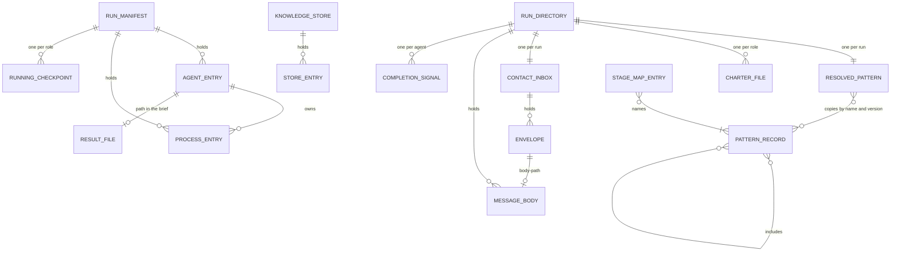

Caption: the manifest and the knowledge store stay two aggregates; the run directory owns every message, signal and pattern file and each role's charter file (S-180; charter C2, agent-decided); a result file may sit where a stage names it (S-173). Pattern records and stage map entries live outside the run: a record links to the patterns it includes by name, and the resolved pattern keeps the name and version of each source (S-229, S-230).

## §5 L4 — Cross-Cutting & Quality Attributes

**AuthZ (HL-3, signed).** No agent identity reaches a hook; the only runtime signal is agent against human. Each row states what actually enforces it (S-15). The Source column names the settled rows behind each row added or changed in rounds 40 to 46 (packet HL3-3, table 1, signed R-45; round-46 rows under the delegation, §0). A dash marks a row signed before round 40. CONVENTION means the rule is in the agents' instructions, and nothing refuses a break.

| Surface | Permitted roles | Denied roles | Enforcement point | Source |
|---------|-----------------|--------------|-------------------|--------|
| Start or stop a team agent | Contact agent. Any other agent asks the contact agent with an agent-send start request. The one stop outside agent-stop: the team entry script stops the agent it just started when the write after the transport call fails, exit 5, inside the contact agent's agent-start call (correction of audit round 3; audit round 7, agent-decided) | Spawned agent, non-contact hub (a direct start or stop); a start request to any target other than the contact agent | CONVENTION. The team entry script checks each start request against the resolved pattern before it delivers it, and answers exit code 2 on a failed check (S-187). The contact agent then starts the agent or refuses, saying why. The contact agent creates tabs and panes only inside the script's agent-start verb (S-167) | S-149, DLV-3, AC-042, AC-009, PD-START; correction of audit round 3, audit round 7 (agent-decided) |
| Commit and push | Human; contact agent; the spawned agent in the builder role, one active builder, on the one feature branch, each commit carrying a role trailer. Under /afk:fix the builder does not commit; the caller commits. Under /afk:autopilot the subtask agent is the builder; autopilot runs 1 subtask at a time (skills/afk/autopilot/SKILL.md:42), so one builder holds (S-227). There, the contact agent pushes the feature branch before the first subtask starts (audit L20, agent-decided). One stated exception: the /afk:bug fixer, only on its own fix branch (S-238) | Spawned agent in any other role; non-contact hub. Every agent: force-push, and deleting a remote branch; you keep those actions (S-197) | CONVENTION. The builder's brief grants commits; every other brief forbids them; the trailer is self-declared; no commit gate. The fixer's grant is its brief; no program checks it (S-238). The pre-commit gate on a failing code gate and the branch-name gate stay | S-135, GIT-1, ADR-0010, AC-010, S-158, ADR-0014, S-227, S-238, AC-060; audit L20 (agent-decided) |
| Open a change request | Human, contact agent. Under /afk:autopilot the contact agent pushes the feature branch, then opens the Draft change request, before the first subtask starts (S-227, S-243; audit L20, agent-decided); /afk:execute finds the open change request and creates none (S-227). One stated exception: the /afk:bug fixer opens 1 Draft change request and marks it ready, only on its own fix branch, and never merges (S-238) | Any other spawned agent; non-contact hub | CONVENTION. Nothing observes who calls the forge; the fixer's grant is its brief (S-238) | S-227, S-238, AC-010, AC-060; audit L20 (agent-decided) |
| Update the change request's checklist | Human; contact agent, as in the commit row (S-135; audit L27, agent-decided); the builder; under /afk:autopilot, the subtask agent that runs /afk:execute (S-227, AC-010). A session with no team: as today | Every other spawned agent; non-contact hub (inferred from the commit row, S-135; audit L27 settles only who may) | CONVENTION: no program checks who edits the checklist (AC-010, ADR-0016) | S-227, AC-010; audit L27 (agent-decided) |
| Merge | Human | Every agent class | ENFORCED by the forge, not by this plugin | — |
| Write the tracker | Human, contact agent under existing tracker rules. One stated exception: the /afk:bug publisher, within today's grant: it creates 1 bug ticket, moves it once to Dev-Pending, and adds evidence comments to that ticket (S-238) | Any other spawned agent; non-contact hub | CONVENTION, inherited; the publisher's grant is its brief, and no program checks it (S-238) | S-238, AC-060, AC-011 |
| Write repository configuration | Human. One stated exception: the contact agent, through agent-start in the team entry script, copies the git-ignored .claude/settings.local.json of the main checkout into the run's worktree (S-191) | Every agent class, for every other configuration write (S-191) | The one allow rule on the team entry script covers the copy. The script never overwrites: when the file exists, it skips the copy and reports that (S-191). Every other configuration write: CONVENTION, no gate refuses it | S-191, SET-1 |
| Read a peer's knowledge-store entry | Every agent class | Any agent reading an unfinished peer entry in its own stage; a debater reading a peer's draft for a work item before a finished draft exists for every debater role of that item. The rule counts roles, not agents (S-193) | The read of finished entries in the knowledge store module (the shared store where agents put their work) returns a peer's draft only when a finished draft exists for every debater role (S-193). A direct file read is invisible to hooks, so a bypass is CONVENTION | S-138, DEB-2, AC-017 |
| Delete the knowledge store | Cleanup, run by the contact agent | Spawned agent, non-contact hub | CONVENTION, by construction of the cleanup code | — |
| Read the run dashboard | Human, any agent | None; read-only surface | NOT APPLICABLE | — |
| Message another agent | Roles joined by a declared talk edge, for the kinds that edge lists. The contact agent to any agent it started (S-187). A role and its resolved report target, whoever it is, both ways, kind message, with no declared edge, and no other undeclared pair (charter C4; audit round 15, agent-decided). The contact agent receives a short copy of each finished, parked or exited (S-216) message, for the manifest only, and does not read the result unless it is the report target (S-212) | Any pair without a declared edge; any kind the edge does not list | CONVENTION against a lying sender. The team entry script refuses an undeclared edge (exit 2, naming it), but the sender names itself. A payload with a bad field gets exit code 2 (S-184). The job supervisor sends as the agent it watches, only parked and exited, only to the contact agent (S-236) | S-134, S-131, MSG-5, AC-035, S-236 |
| Start a helper subagent | Any pane agent, for bulk reads, repository searches, test runs and large diffs | A helper: helpers do not start agents. Any start past the nesting limit of 3 levels in DELEGATION.md. A helper doing role work: writing a plugin file, code or a ledger (an append-only record), or returning a gate verdict (the pass or fail of a check); a child that does role work must be a pane agent. No kind of pane agent is refused (S-190) | CONVENTION. No run-manifest entry and no watchdog; the plugin still pins the helper's type and model tier (DELEGATION.md) | S-162, REQ-HELP, AC-043, PD-HELP |
| Run the team entry script (every transport verb, including the widened agent-send) | Contact agent under the human's allow rule; a Claude worker under the same user settings (T11 case F); a Codex worker under the authorised full-auto launch flags. On this host one session's permission classifier refused the Codex sandbox-bypass launch (providers/CONFORMANCE.md:315; §13) | Any call the harness's auto-mode classifier refuses | ENFORCED by the harness permission layer, not by this plugin. The contact agent creates tabs and panes only inside the script's agent-start verb, so the one allow rule on the script covers tab create and pane split; no second rule is needed (S-167). The settings copy also runs inside agent-start (S-191) | S-136, AUTO-3, AUTO-1, AUTO-2, T11, T12 |
| Call agent-status, agent-read or agent-list | Contact agent | Every other agent | CONVENTION: the 3 verbs take no caller identity, so the script cannot tell the contact agent from a worker (inferred from S-15 and the verb inputs; S-239 sets the rule) | S-239 |
| Read a result file | Its report target. The requester and the contact agent only when they are the target | Every other agent | CONVENTION: no program can see a file read (S-223, S-239) | S-239, S-212 |
| Write or read a running checkpoint | Writes: the agent of the role. Reads: the next agent in that role, and the contact agent | Every other agent | CONVENTION; the path is built from the feature and the role (S-239) | S-239, S-41 |
| Write run-directory message files: envelopes, message bodies, completion signals | The team entry script only. The contact agent moves its handled envelopes to the processed folder; cleanup deletes them all | Every agent, for a direct write | CONVENTION: a direct write into the inbox skips the edge check, and hooks cannot see it (S-239) | S-172, S-174, S-196, S-198, S-239 |
| Answer a first-run dialog | Human | Every agent class | CONVENTION, by construction of the transport: it reports the start as blocked and never answers | S-152, LCH-3 |
| Act on a message | — | Every receiver: a message never overrides the brief and never authorises a reserved action (start or stop, change request, tracker, configuration, merge) | CONVENTION. The pane gets only the fixed envelope, with no free text | S-132, MSG-3 |

Rules nothing can enforce, and what catches a violation instead: only the contact agent starts or stops an agent (review, and the manifest's owner field); a direct file read of an unfinished peer entry, which bypasses the store module's read (review of the reading code); no agent writes configuration outside the settings copy (the pre-commit gate and human review of the diff); only the builder commits (review: nothing refuses a non-builder commit at runtime, HL3-3); a lying sender or a disobedient agent (review, HL3-3); the /afk:bug publisher's and fixer's grants (review, ADR-0016; S-238 says no program checks them); who reads a result file or a checkpoint, who writes message files directly, and who calls the 3 read verbs (review, ADR-0016; S-239 says no program can see a file read).

**Data scoping (HL-3).** Rows with a Source were added or changed in rounds 40 to 46 (HL3-3 table 2, signed R-45; round-46 rows under the delegation, §0).

| Scoped record | Scope | Enforcement mechanism | Source |
|---------------|-------|-----------------------|--------|
| Run manifest | One feature | The path, built from the feature. Construction only | — |
| Knowledge store | One run of one feature | The same path rule, one file per entry; deleted whole at cleanup | — |
| Agent entry | The run that started it | A row in the feature's manifest. Construction | — |
| Resolved pattern | One run | The run directory path. Construction only | S-139 |
| Message body | One run | Under the run directory, named by message id. Construction | S-140 |
| Inbox directory | One per run, owned by the contact agent and named by the role contact, so a new contact session reads the same inbox. No other agent has an inbox (S-172, S-215) | Construction: the script builds the path from the run directory and the owner's key (S-172) | S-147, S-154 |
| Result file | The report target reads it; the requester and the contact agent read it only when they are the target; every other agent is denied (S-239, replacing S-173's reader rule). The rule binds the agents of a running run; a report under plan/review/ that a stage names keeps its stage's readers (D-20, agent-decided) | The path the requester writes in the brief: a location the stage names, else the run directory (S-173). Readers: CONVENTION (S-239) | S-154, S-239, D-20 |
| Running checkpoint | One role in one run (S-239) | Construction: the script builds the path from the feature and the role (S-239) | S-239 |
| Charter file | One role in one run (charter C2, agent-decided) | Construction: the team entry script writes it into the run directory, named by the role (charter C2; the naming inferred, S-182). Readers: the agent of the role, by convention (inferred: no program can see a file read, S-223) | charter C2 (agent-decided) |
| Envelopes, message bodies, completion signals, processed folder | One run | Construction: under the run directory; only the team entry script writes them (S-239) | S-172, S-174, S-196, S-239 |
| Talk edges | This run's team. The pattern also names the report target of each role (S-212), and the 2 implied edges join each role and its resolved report target, which the team entry script checks at each send (charter C4; audit round 15, agent-decided) | The resolved pattern; the team entry script checks each send | S-131, AC-035 |
| Completion signal | One agent in one run (S-174) | Construction: named by agent-id in the run directory; the team entry script writes it when it accepts a finished message (S-174) | S-174, SIG-1 |

**Idempotency.**

| Surface | Key shape | Dedup window | Side-effect ledger |
|---------|-----------|--------------|--------------------|
| agent-start | none (S-18) | none | the manifest; the caller checks it before a start |
| agent-stop | the agent id (S-224); its pane close: the pane id (S-225) | not applicable: a second stop finds the agent stopped (S-224) | idempotent by design: stopped true for a stopped agent; a stop on an agent already stopped does nothing and reports success (S-224); a second close of a closed pane does nothing (S-225) |
| wait-job start | the manifest's wait-job line: before a start, the contact agent stops the job the line names and removes the line (S-240) | the run | the manifest |
| job-supervisor start | the watched agent-id: a second supervisor gets exit code 2, naming the agent (S-240) | the run | the manifest |
| E4 push a branch | the commit id: pushing the same commit again changes nothing (audit L21, agent-decided) | the branch's life (inferred) | the forge |
| E5 open a change request, update its checklist, mark it ready | the source branch: look for an open change request first, create one only when none exists (S-243); the checklist update and the ready-mark act on the change request it finds (audit L25, agent-decided) | the branch's life | the forge |
| E6 cleanup | the run's remaining manifest lines: a cleanup run again finishes them (audit L22, agent-decided) | until the manifest, deleted last, is gone (S-198) | the manifest |
| E7 spend provider quota | none: a re-run spends quota again, and nothing repeats unless a caller chooses to (S-244) | none | none |
| E8 install the multiplexer | the check command on the tool's setup line: a pass means no install is offered (S-245) | each setup run | none: each run re-finds the tool (S-245) |
| agent-send | the message id, built by the sender from its own agent-id and its own counter; the same id on a resend (S-133, S-178) | the whole run (S-172) | the receiver's processed folder; an id already there is a repeat and changes nothing (S-172) |

agent-start has no key (S-18); once an entry has left starting, a second agent-start with its agent-id gets exit code 2, a refusal (§3 agent-start; correction of audit round 3, agent-decided).

**Retry + timeout.**

| Call | Attempts | Backoff | Timeout (ms) |
|------|----------|---------|--------------|
| agent-start | 1, no automatic retry (S-17). A failed resume is not retried: exit 4 naming the resume, the line moves to lost, and a fresh agent reads the checkpoint (S-233) | none | 120000 |
| agent-send | 1, no automatic retry (S-17); a sender that is unsure sends again with the same message id (S-196). finished whose inbox copy failed: the sender sends again with the same message id, and the repeat check drops the second copy (S-235) | none | 30000 |
| agent-status | 1 per poll | caller's own loop | 10000 |
| agent-read | 1 | none | 30000 |
| agent-stop | cleanup may repeat | none | 60000 |
| agent-list | 1 | none | 10000 |
| A failed role | 0 automatic retries (S-46); substitution or park per AC-022 / AC-023 | — | — |
| An agent that dies or stops early | 1 resume of its harness session in a new pane; when the resume fails or no session id is stored, a fresh agent that reads the checkpoint (S-213, S-219). Before the resume, the contact agent stops the old agent with agent-stop, which closes its pane, and marks the old line cleaned; when that stop fails, it marks the line unkillable, does not resume, and tells the human (S-242) | none | — |
| E4 push a branch | 2 at most: after a rejected push the pusher merges the remote branch and pushes once more, then the run parks blocked; no force-push (S-197; audit L21, L61, agent-decided) | none | — |
| E5 open a change request, update its checklist, mark it ready | 1; a failed create, checklist update or ready-mark is reported and tried again at the next turn (S-243; audit L25, agent-decided) | the next turn | — |

**Sync vs async.** Every verb is a short call (S-21). Waiting is message-driven where the contact agent is addressable, and polling agent-status otherwise (S-142). The run keeps one wait job. It checks the contact agent's inbox every 10 seconds and ends at the first of two events: a file is in the inbox, or the earliest park-until time passes (S-195, S-226). With nothing parked it has no end time: it ends on a file or when cleanup stops it. The script takes 2 arguments, the inbox folder and an optional park-until time, and waits the way the stall watchdog already waits (R46-WAIT card, accepted as S-226). It looks in the inbox before its first wait, so a file that landed before the job started is not missed (inferred, R46-WAIT card). The check replaces the signed 'no polling loop' (S-105, S-114, S-128; §12); the wake comes up to 10 seconds after a file lands. The contact agent keeps the one-job rule: before it starts a job it stops the job the manifest names, and after a job ends it handles every inbox message, then starts the next job (S-240). Its exit wakes the contact agent where the harness probe passes, else the contact agent finds the change at its next turn (S-105). Observed once each (INV-011): on Claude Code 2.1.282 a tracked job's exit woke the idle top-level agent; on Codex CLI 0.157.0 it did not, so there the next-turn check is the resume path (S-122). Trial T12 saw the same for an inbox file: a Codex contact agent has no wake, takes messages at its next turn, and says so at run start (S-166). Every other agent waits for messages in its pane (S-189, S-215).

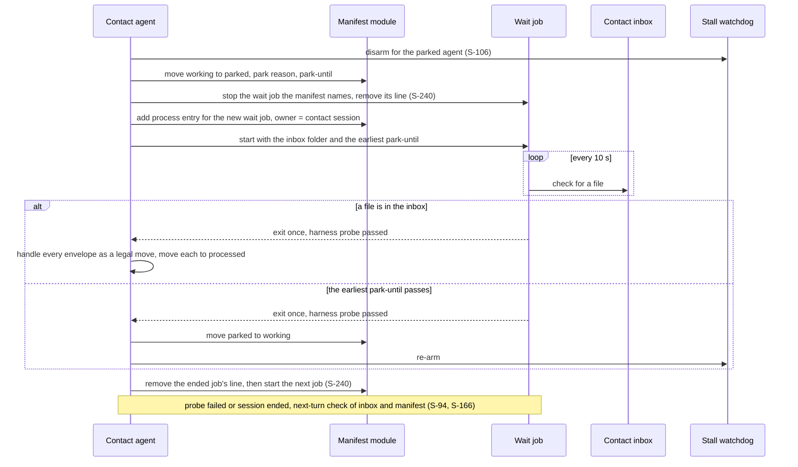

Caption: one wait job per run, two ways to end it (S-195); it checks the inbox every 10 seconds (S-226), which replaces the signed 'no polling loop' (§12). The contact agent keeps the one-job rule (S-240).

| Long-running op | Latency budget that drove the choice |
|-----------------|--------------------------------------|
| Waiting for a provider reset | Hours; longer than any stall-watchdog limit (20 min silence), so the watchdog is disarmed during a park |
| Waking the contact agent on an inbox file | Up to 10 seconds, the check interval; small next to the 20-minute stall watchdog (S-226, R46-WAIT card) |
| A message queued behind a busy pane agent's turn | No budget set: delivery waits for the turn end. Trial T11 saw turns held 3 and 9 minutes by the plugin's turn-end gates, which hold queued messages that long (§13 Q22) |

**Feature flags.**

| Flag key | Default | Rollout plan | Cleanup date |
|----------|---------|--------------|--------------|
| Stage map entry per stage: key the stage name, value one pattern name or a list the resolver combines (S-230) | absent: the plugin ships no stage map; the contact agent proposes patterns from their descriptions and the human picks (AC-032, S-143). With no entry and no pick, the stage runs as today (AC-001, S-230): today's team shape and model rules (D-09, agent-decided) | the human adds entries per stage | none; permanent configuration |
| Saved patterns | absent: only the built-in patterns BP-1 to BP-5 (S-143, AC-034) | the human saves patterns in configuration (§14 C9) | none; permanent configuration |
| Pane switch: one key under the transport settings, pane or subagent (S-230) | absent: pane when a pane tool is found; role agents are pane agents wherever the plugin is enabled (AC-041, S-230) | set it to switch role agents back to subagents; it also returns /afk:fix to its old run in one agent (S-201, AC-044) | none |
| Multi-model role mapping | absent: one model | independent of topology (AC-002) | none |
| Transport kind override | absent: the probe chooses (S-55) | optional | none |

**Secrets.** The feature handles no secret. It names models and transports and never reads, stores or passes a credential (S-19).

**Observability.** The run reports through the existing reporting protocol, unchanged (S-16).

| Signal | What it detects |
|--------|-----------------|
| Manifest state per agent, read by mission control | parked versus hung (AC-029, §7 failure matrix) |
| Cleanup report naming each unkilled process, with each unkillable entry's agent name and process id (audit round 12, agent-decided) | E2 partial failure, state A7 |
| Cleanup report saying that the message area, the knowledge store, the resolved pattern and the manifest are kept for the next cleanup | an entry that stays unkillable, or a process entry left after a failed kill (I5; audit round 13, agent-decided), so cleanup skipped steps 2 to 5 (E6; audit round 12, agent-decided) |
| Dated park report naming provider, role and time | AC-023 park |
| Completion signal file, read first when the stall watchdog fires | an agent finished even when its finished envelope was lost (S-174) |
| Cleanup report naming every pane still open | a pane close that failed; the entry reads unkillable and names the pane (S-225) |
| Cleanup report naming each stray, by agent name and pane id, or saying that the kind cannot list agents | an agent agent-list finds whose pane id no manifest entry holds; the human stops it (correction of audit round 3; audit round 3, agent-decided; correction of audit round 4, agent-decided) |
| agent-stop answer stopped true with the method 'nothing recorded' | an entry that holds neither a process id nor a handle; it moves to cleaned, and the cleanup report names its agent-id and agent name (audit round 8, agent-decided) |
| agent-stop answer stopped false with the reason 'identity unknown' | an entry that holds a process id and no started-at, which cannot pass the identity check, when a live process has that id (audit round 10, agent-decided); it moves to unkillable, and the cleanup report names it (audit round 9, agent-decided), and it moves to cleaned when a later agent-stop answers stopped true without pane closed false (audit round 10; audit round 11, agent-decided) |
| One notice naming a first-run dialog and how to clear it | a start blocked by a dialog (S-186) |
| Run-start notice from a Codex contact agent | results wait for the human's next message (S-166) |
| Run-start notice that a tool cannot make tabs | panes are used instead of tabs (S-211) |
| The run report line that role agents run as subagents | the fallback is in force (AC-044) |
| Pane label, the same in the pane, the manifest and the cleanup report | which agent a pane holds: goal, role, model and effort (S-210) |
| agent-stop answer with pane closed false, naming the pane, or for TR-4 the terminal identifier | a pane close that failed, or a TR-4 terminal close (audit round 9, agent-decided); the contact agent marks the line unkillable (S-234) |
| finished answer exit 4, naming the target or the inbox | a result delivery that failed; the contact agent passes the result path to a replacement or tells the human (S-235) |
| agent-start exit 4 naming the resume, the tab or the write before the transport call (agent-decided, §13 Q49); exit 2 naming the field, the agent, the name, the agent-id or the watched-agent-id; exit 5 naming the agent-id, with stopped, pane closed, the pane id, the process id, the kind (the kind inferred, §3 exit 5) and started-at (audit round 9, agent-decided), pane closed and the pane id only for a pane kind (audit round 6, agent-decided) | a failed resume, a tab not made, a failed write before the transport call (agent-decided, §13 Q49), an unknown effort, a second supervisor (S-233, S-240), a name with no room for a goal character, or for g- and 1 character when the goal needs g- (audit round 2; audit round 6, agent-decided), an agent-id with no entry or an entry not in state starting (correction of audit round 3, agent-decided), a watched-agent-id with no entry (audit round 4, agent-decided), a field other than watched-agent-id on a supervisor start (audit round 5, agent-decided); a start whose manifest write after the transport call failed (audit round 7, agent-decided), after the script's stop of the agent; the entry moves to lost with the answer's kind, handle, process id and started-at (audit L59; correction of 2026-10-05; audit round 3, agent-decided; correction of audit round 4, agent-decided; audit round 5, agent-decided; started-at: audit round 9, agent-decided); after exit 5 or a verb timeout, the run ends parked, naming the agent-id and the agent name, with the status unrecorded_agent in the OUTCOME line and the PLAN.md cell under /afk:execute (§3), under /afk:autopilot in the subtask's outcome or the Finish report, else in the contact agent's reply to the human (audit round 8; audit round 9; the status: audit round 10; its forms and the reply: audit round 13; the autopilot branch: audit round 14, agent-decided) |
| One notice to the human when the stall watchdog fires on a live agent whose output shows no sign of waiting | an agent that may be stuck; it stays working (S-241) |

## §6 L5 — Domain Model

Two aggregates (S-29). The run, rooted on the manifest file, owns agent entries, process entries and each role's running checkpoint; the run directory's pattern, message and signal files belong to the run (S-180). The knowledge store, rooted on the store, owns entries. No domain events: state changes are file writes. A message is transport data, not a domain event; nothing subscribes, and only the contact agent's legal moves change the manifest (S-30, S-145). The one asynchronous signal is the wait job's exit (S-105, S-195); the job checks the contact agent's inbox every 10 seconds (S-226).

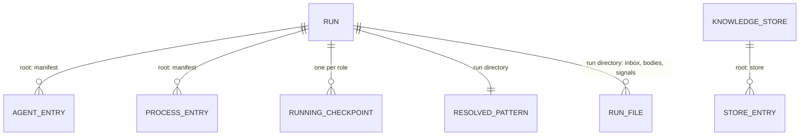

Caption: every entity has one owner aggregate.

**Agent lifecycle (HL-4, signed).** The manifest module declares this table and refuses a write that is not a legal move, naming the attempted move (S-26, S-54). The Source column names the settled rows behind each row added or changed in rounds 40 to 46 (packet HL4-4, table 1, signed R-45; round-46 rows under the delegation, §0); such a row keeps the Meaning signed before round 40, except A7's, which adds the failed pane close (S-225, S-234), and a dash where it has none. A6's Meaning also covers an entry with no process recorded (audit round 8, agent-decided) and a process already gone (audit round 11, agent-decided), and A7's a process whose identity is unknown (audit round 10, agent-decided). A dash in Source marks a row signed before round 40. Each lifespan row states how an agent of that lifespan leaves the table (S-169).

| ID | State | Meaning | Allowed next | Triggered by | Source |
|----|-------|---------|--------------|--------------|--------|
| A1 | starting | Entry exists; the transport is asked to start. Written before the start | A2, A5 | The contact agent: when it fills a role; when it accepts a start request checked against the resolved pattern; or when it resumes a dead or stopped agent's harness session (the id the coding tool gives a conversation), after it has stopped the old agent and moved the old line to cleaned (S-242). Each resume is a new manifest line with the same session id (S-213) | S-149, AC-042, S-242 |
| A2 | working | Alive, doing the role's work | A3, A4, A5, A6, A7 | The contact agent, on the start answer; or, from A3, on the wait job's exit where the harness probe passes, else the contact agent's next turn; the resume step re-arms the stall watchdog | — |
| A3 | parked | Stopped on purpose, with reason and park-until | A2, A5, A6, A7 | The contact agent, on a provider limit, an explicit park, or a parked message with the reset time from the job supervisor where it owns the output stream; when the watchdog fires and classification finds a limit, A3 or substitution. The park step stops the wait job the manifest names, removes its line, and starts the run's one wait job (S-240). The job checks the contact's inbox every 10 seconds and ends at the first of 2 events: a file in the inbox, or the earliest park-until time (S-195, S-226) | S-141, S-142, MSG-7, S-226, S-240 |
| A4 | finished | Clean exit; also stamps its store entries finished | A6, A7 | The contact agent, on its short copy of a finished message (S-188, S-212), applied as a legal move after the owner-generation check and a state check (S-176); it also turns off the stall watchdog (S-188). Or when the stall watchdog fires and the completion signal exists: the agent finished, also when the envelope was lost (S-174) | S-141, S-142, S-133, MSG-7, MSG-8 |
| A5 | lost | Stopped without clean exit; a replacement is a new A1 entry | A6, A7 | The contact agent: on an exited message from the job supervisor; when the watchdog fires and classification finds the agent dead; when an agent's agent-start fails with exit code 4, 3 or 2, as the failure row 'agent-start fails' states and S-186 confirms for exit code 4: a missing tool, a first-run dialog (S-186), a failed settings copy (S-191), a failed write before the transport call (agent-decided, §13 Q49), a failed resume or a tab that cannot be made (S-233), with exit code 4; unsupported, with exit code 3 (audit round 8, agent-decided); a missing field, an unknown effort (S-233) or a name with no room for a goal character, or for g- and 1 character when the goal needs g- (audit round 2; audit round 6, agent-decided), with exit code 2; or with exit code 5, when the script's write after the transport call fails and it has run agent-stop's steps on the agent (audit L59; correction of 2026-10-05, agent-decided; audit round 3, agent-decided; audit round 7, agent-decided); the contact agent writes the answer's kind, handle, process id and started-at into the entry as it moves it (started-at: audit round 9, agent-decided), and a retry is a new start with a new agent-id (correction of audit round 4, agent-decided; audit round 5, agent-decided), which comes in the re-run (inferred: the park ends the run); on agent-start's verb timeout, and after exit 5 or that timeout it starts no new agent and ends the run parked, naming the agent-id and the agent name, with the status unrecorded_agent under /afk:execute, under /afk:autopilot in the subtask's outcome or the Finish report, else in its reply to the human, and the human closes any leftover agent and re-runs (§3; audit round 8; audit round 9; the status: audit round 10; under /afk:execute, else the reply: audit round 13; the autopilot branch: audit round 14, agent-decided); or cleanup, for an entry still in starting, before it moves the entry to cleaned (inferred: A1 allows only A2 and A5); or when a started agent ends without sending finished, after which it tells the requester which agent is lost (S-173). Except after exit 5 or a verb timeout (audit round 8, agent-decided), it then first resumes the agent's harness session; if the resume fails, it starts a fresh agent that reads the checkpoint (S-213). Before the resume it stops the old agent with agent-stop, which closes its pane, and moves the old line to cleaned; when that stop fails, it moves the line to unkillable, does not resume, and tells the human (S-242). The contact agent holds the agent-id of the entry it wrote, so it knows which entry a failed start moves (correction of 2026-10-05, agent-decided); a job supervisor's start writes no agent entry (§4 Relations: a process entry), so its refusal moves none. agent-start's exit 2 for an agent-id with no entry, or an entry not in state starting, moves none either (correction of audit round 3, agent-decided; inferred: the refused id names no entry in state starting) | S-141, S-142, S-186, S-191, S-233, S-242; audit L59, correction of 2026-10-05, audit round 2, correction of audit round 3, audit round 3, correction of audit round 4, audit round 5, audit round 6, audit round 7, §13 Q49, audit round 8, audit round 9, audit round 10, audit round 13, audit round 14 (agent-decided) |
| A6 | cleaned | The process killed, already gone or none recorded, the entry closed (audit round 8; already gone: audit round 11, agent-decided). Terminal | terminal | Cleanup, through the contact agent; it moves here an entry that holds neither a process id nor a handle when agent-stop answers stopped true with the method 'nothing recorded', and names its agent-id and agent name in the report (audit round 8, agent-decided), an entry still in starting through lost (inferred: A1 allows only A2 and A5), and an unkillable entry when a later agent-stop answers stopped true without pane closed false, so once the human closes the agent the next cleanup finishes the line (S-225; audit round 10; without pane closed false: audit round 11, agent-decided); the contact agent at a lifespan end (S-169), on the old line before a resume (S-242), and on an unkillable entry before a re-run's first start (audit round 12, agent-decided) | S-169, S-225, S-242; audit round 8, audit round 10, audit round 11, audit round 12 (agent-decided) |
| A7 | unkillable | Kill or pane close failed, or the process's identity is unknown (audit round 10, agent-decided); reported by name, phase held (S-225, S-234) | A6 | Cleanup, when a kill fails or agent-stop answers stopped false with the reason 'identity unknown' (audit round 9, agent-decided); the contact agent, when agent-stop answers pane closed false (S-234) or when the stop before a resume fails (S-242) | S-234, S-242; audit round 9, audit round 10 (agent-decided) |
| A1, blocked start | starting | — | A5, lost (S-186) | The transport stops the blocked process and answers exit code 4, naming the dialog. The contact agent moves the entry from starting to lost, and tells you once the dialog's name and how to clear it. A new start is a new entry in starting (S-186) | S-152 |
| Turn lifespan | — | — | A4 finished, then A6 cleaned or A7 unkillable (S-192) | The contact agent, on the Turn agent's finished message: it applies working to finished, stops the agent at once with agent-stop (the command that stops an agent), which also closes its pane (S-234), then moves the entry to cleaned, or to unkillable when the kill or the pane close fails (S-192, S-234) | S-155, S-149, S-234 |
| Step lifespan | — | — | A6 cleaned or A7 unkillable (S-169) | The contact agent, when the pattern step that needs the agent completes. A step ends when every agent it started has sent finished or is lost (S-228). It stops the agent with agent-stop, which closes its pane (S-234); the entry moves to cleaned, or to unkillable when the kill or the pane close fails (S-169) | S-169, CLOSE-1, S-228, S-234 |
| Feature lifespan | — | — | A6 cleaned or A7 unkillable (S-169) | The contact agent, when the run ends: it stops the agent with agent-stop, which closes its pane (S-234); the entry moves to cleaned, or to unkillable when the kill or the pane close fails. Run cleanup then only catches agents that still run (S-169) | S-169, CLOSE-1, S-234 |

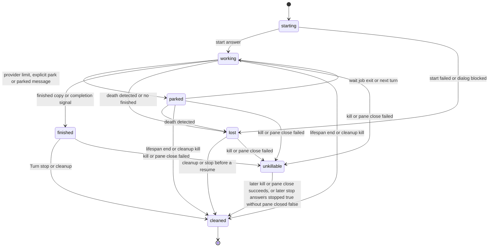

Caption: cleaned is the only terminal state. A resume or a replacement is a new entry in starting, never an edge back (S-213); the old line moves to cleaned first, or to unkillable when its stop fails (S-242).

**Knowledge-store entry lifecycle (HL-4).** No guard on the writing side: the event that would trigger one is an agent dying (S-28).

| ID | State | Meaning | Allowed next | Triggered by | Source |
|----|-------|---------|--------------|--------------|--------|
| K1 | unfinished | Being written; no same-stage peer reads it; an early-ended author leaves it here, and nothing repairs it | K2 | The authoring agent, on creating it | — |
| K2 | finished | Readable by same-stage peers and later stages. A debate draft is readable by a peer debater only when a finished draft exists for every debater role of the work item. The rule counts roles, not agents, so a replacement debater's finished draft fills its role (S-193). Terminal until deletion | terminal | The authoring agent's clean exit; for a debate-step entry, its author's stamp | S-138, DEB-2, AC-016 |

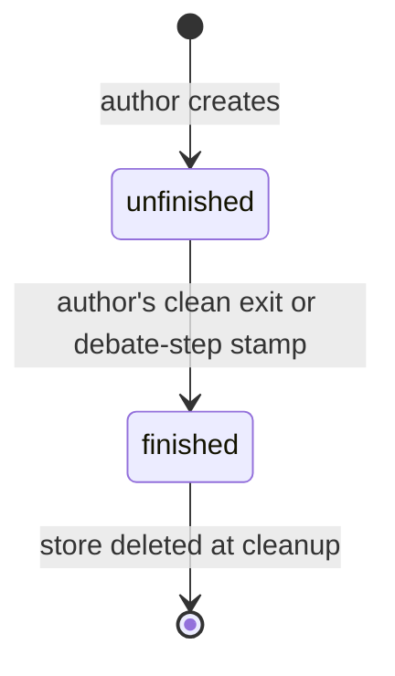

Caption: an orphaned entry stays unfinished and is skipped by every reader.

**Invariants (HL-4).** The Source column names the settled rows behind each invariant added or changed in rounds 40 to 46 (packet HL4-4, table 3, signed R-45; round-46 rows under the delegation, §0); a dash marks one signed before round 40. Packet HL4-4 (table 3) gave 7 invariants no id; I12 to I18 are this document's labels for them. I19 and I20 come from round 46 (S-240), which no packet holds. S-233's write of the 4 answer fields runs inside agent-start, which only the contact agent calls (§3), so I2, I7 and I13 count it as the contact agent's write (inferred: the correction row of 2026-10-05, agent-decided, restores design ADR-0003 and keeps that write). The script's own stop on exit 5 runs in the same call, so I8 counts it as the contact agent's stop (inferred, from the correction of audit round 3, agent-decided, which names it the one stop outside agent-stop).

| ID | Invariant | Owner aggregate | Guardian | When broken | Source |
|----|-----------|-----------------|----------|-------------|--------|
| I1 | Every agent and background process a run starts appears in the manifest | Run | The contact agent, writing the entry before the start | Structural for agents; a self-started process is still killed with its owner's tree but is invisible to the report until reported upward | — |
| I2 | Only the contact agent writes the manifest | Run | Convention | A violating write succeeds | — |
| I3 | An agent's state changes only along a table edge | Run | The manifest writer, which refuses the move | Write refused, move named. The one built guardian | — |
| I4 | A same-stage peer reads an entry only when finished. A debater reads a peer's draft for a work item only when a finished draft exists for every debater role of that item (release rule; roles, not agents) (S-193). The work-item id, not the stage, governs reads between debate steps | Knowledge store | The reader's finished filter; for the release rule, the read of finished entries in the knowledge store module (S-193) | Nothing read; an orphan is skipped for ever. When a debater dies with its draft unfinished, nothing is released and the other debaters wait. The contact agent notices the death (the entry moves to lost). It first starts a new pane that resumes the dead debater's harness session (S-213); if that fails, it starts a replacement on the same model, as a new entry that reads the role's checkpoint. When no replacement can start, the debate waits; past the provider's wait limit, it parks with a dated report. The dead agent's unfinished entry is skipped for ever (S-193) | S-138, DEB-2, AC-017 |
| I5 | A phase does not report finished while the manifest holds an unkilled process | Run | Cleanup, naming every process it could not kill | Phase held; survivors named (A7) | — |
| I6 | A pattern does not start when a role is unfillable, when it needs a messaging ability the transport lacks (worker to contact, worker to worker, exit signal, limit signal), or when it includes itself, or when its pattern record has an unknown version (S-171), or when one role name has 2 different definitions in the combined patterns (agent-decided, §13 Q28), or when an edge, a step or a report target names a role its record does not define (audit L18, agent-decided), or when it has roles and its charter or a role's charter part is missing or empty, for a record or a one-off pattern (charter C1; audit round 16; audit round 17, agent-decided) | Run | The start check; the ability set comes from each transport's trial record; the resolver refuses self-inclusion, a role name defined two ways, a role its record does not define and, on a record or a one-off pattern with roles, a missing charter or role part, with exit code 2 | Start refused, naming the role, the missing ability, or the pattern and the version; no reduced shape (S-171) | S-144, PAT-2, S-143, AC-033, AC-035, Q28; audit L18, audit round 17 (agent-decided) |
| I7 | A spawned agent may start native subagents where its harness allows; a native subagent is never a role, never enters the manifest and has no watchdog; the plugin still pins its type and model tier | Run | The manifest writer, which only the contact agent calls, only to fill a role (I2) | Nothing detects a native subagent written as a role | S-162, REQ-HELP, AC-043 |
| I8 | Only the contact agent starts or stops a team agent; any other agent asks by a start request | Run | Convention (access policy row). The team entry script checks each start request before it delivers it (S-187), and accepts a solo: step only from a stage with no stage map entry (agent-decided, §13 Q33); the contact agent then checks it against the resolved pattern | Nothing enforces it | S-149, AC-009, AC-042 |
| I9 | Shared git state belongs to the contact agent; each role owns its output path; one active builder, and only the builder commits. Under /afk:autopilot the subtask agent is the builder (S-227). Stated exception: the /afk:bug fixer commits on its own fix branch (S-238) | Run | The ownership split; the builder's brief; the existing git mutex queues writes | Nothing enforces it | S-135, ADR-0010, PT-F9, S-227, S-238 |
| I10 | A manifest write never lands on top of another | Run | Directory mutex, write-then-rename | A losing writer waits | — |
| I11 | A parked agent has no armed stall watchdog; the contact agent's copy of a finished message also turns it off (S-188) | Run | The park step disarms; the resume step re-arms; finished disarms | When the watchdog fires, the contact agent first reads the completion signal: if it exists, the agent finished (S-174). Otherwise it classifies before it moves the entry: a limit to A3 or substitution, dead to A5. An agent that is alive: the contact agent reads its output with agent-read. When the output shows the agent waits for a message or a peer's draft, it stays working and the watchdog starts again; with no such sign it stays working, and the contact agent tells the human once (S-241) | S-142, MSG-8, S-241 |
| I12 | A lifecycle kind changes the manifest only as a legal move after a generation and state check; a stale, duplicate, malformed or wrong-target message changes nothing | Run | The contact agent: the envelope's owner generation must equal the value in the sender's entry (S-176), and an id already in the receiver's processed folder is a repeat (S-172). Then the manifest writer (I3) | The manifest writer still refuses an illegal move and names it. An old but legal move applied in error is caught only by review (S-194) | S-133, MSG-4, S-145 |
| I13 | Lifecycle kinds (finished, parked, exited) always reach the contact agent, the only manifest writer. For finished, the contact agent gets a short copy, for the manifest only (S-212) | Run | The team entry script: it always allows lifecycle kinds to the contact agent, and delivers the contact's copy of finished with the same message id (S-188) | A message is dropped or not delivered: the stall watchdog fires. The contact agent then sorts the agent with the completion signal, agent-status and agent-read (S-194) | S-131, MSG-2 |
| I14 | Every duty of an agent comes in its launch prompt; a later message carries data, never a new duty | Run | The launch prompt (convention) | The receiver treats a later duty as data and does not act on it. The contact agent starts a new agent with the duty in its launch prompt (S-194) | S-150, LCH-1, T11 |
| I15 | Every debate has a moderator: the pattern's hub, else one the resolver adds | Run | The resolver | The start check refuses the pattern at start and names the debate, as it does for a role nobody can fill (S-194) | S-144, PAT-2, AC-036, PT-Q1 |
| I16 | A helper does not start agents. No start goes past the nesting limit of 3 levels in DELEGATION.md. A helper does no role work: writing a plugin file, code or a ledger, or returning a gate verdict (S-190) | Run | Helper starts and the 3-level limit: the team script's start check. A start request must name a requester that is a live agent in the manifest; a helper has no agent id. Role work by a helper: no program can see it; the review step checks it after the work (inferred; no gate reads it) (S-223) | The start check refuses the request with exit code 2. Role work by a helper is found only at review, if at all (S-223) | S-190, HLP-1, S-223 |
| I17 | Each role's result goes only to its report target: the target the pattern names, else the agent that asked. The contact agent reads a result only when it is the target (S-212) | Run | The team script, not the agent, sends finished to the target that the manifest and the pattern name, and ignores the target the sender wrote (S-223, S-235) | An agent cannot send finished to the wrong place. A result file read by another agent cannot be detected; the reader rule holds by convention, and this stays a risk (S-223, S-239) | S-212, TALK-1, S-223, S-235, S-239 |
| I18 | The contact agent's tab holds only the contact agent. A tab holds at most 4 panes in a 2 by 2 grid. Agents of one pattern step share tabs; a new tab opens when a tab is full. A tab closes when its last pane closes (S-211) | Run | Each multiplexer's recipe (S-211), run inside agent-start (S-167) | Only the team script creates tabs and panes. If a tab cannot be made, the script refuses the start and says why; it never opens a pane in the contact agent's tab. A tool that cannot make tabs uses panes and says so at run start (S-211, S-223) | S-211, S-167, TAB-1, S-223 |
| I19 | A run has one wait job | Run | The contact agent. Before it starts a wait job, it stops the job the manifest names and removes that line: when an agent parks, after each job ends, and when it takes over a run. After a job ends, it handles every inbox message, then starts the next job (S-240) | Nothing else refuses a second job (inferred: S-240 names no other guard); the guard is the contact agent's own step (S-240) | S-195, S-240 |
| I20 | An agent has 0 or 1 job supervisors | Run | agent-start, which starts each supervisor (S-240) | A second supervisor for the same agent gets exit code 2, naming the agent (S-222, S-240) | S-222, S-240 |

| Domain event | Emitter | Consumers | Payload |
|--------------|---------|-----------|---------|
| None (S-30, S-145) | — | — | — |

## §7 L6 — Process & Coordination

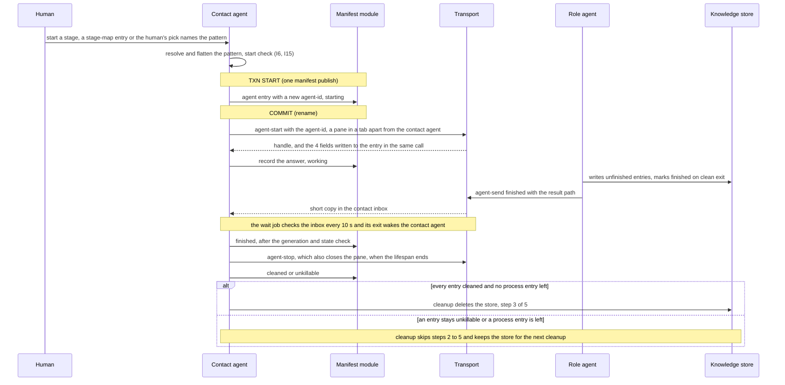

Caption: the unit of work is one manifest publish; no flow needs two writes to land together (S-44). The result goes to the report target (§3); the contact agent gets only the short copy (S-212). agent-start writes the answer's 4 fields into the entry in the same call (S-233), the entry whose agent-id the contact agent passes (correction of 2026-10-05, agent-decided), and agent-stop closes the pane (S-234). Cleanup deletes the store only when no entry stays unkillable and no process entry is left after a failed kill; otherwise it skips steps 2 to 5 (E6; audit round 12; the process entry: audit round 13, agent-decided).

| Use case | Trigger | Txn boundary strategy | Consistency per read path | Concurrency control |
|----------|---------|-----------------------|---------------------------|---------------------|
| Start a role | Contact agent fills a role | Single file publish per move | Contact agent reads its own writes | Directory mutex (S-10) |
| Git write | A commit or push by an agent that the access row 'Commit and push' permits (§5, S-135) | Existing house directory mutex around every git write, with atomic steal of a lock left by a killed process (S-40) | — | Mutex; a slow commit makes other roles wait |
| Publish a running checkpoint | The role, while working | Write-then-rename; at most the write in flight is lost (S-41) | A replacement reads the old or the new file | One writer per role |
| Read peer knowledge | An agent | None | Filtered to finished entries (S-45) | One file per entry |
| Dashboard read | Mission control | None | Eventually consistent: last published file (S-45) | Read only |
| Send a message | agent-send along a declared edge (S-131) | Body file first, then the envelope, each written under a temporary name and renamed (S-196, S-172) | The receiver reads a whole envelope and a whole body; the processed folder records handled ids (S-172) | Message id; the receiver ignores a repeated id (S-133) |
| Apply a lifecycle message | The contact agent's copy of finished, parked or exited (S-216) | Single file publish per move (S-44) | Applied only after the owner-generation check and a state check (S-176) | Directory mutex (S-10) |
| Ask for an agent | A role agent sends a start request to the contact agent, with a JSON body that lists 1 or more agents (S-149, S-231) | The script checks the request before delivery; the contact agent then starts the agent or refuses with a message naming the request's message id and the reason (S-187); under /afk:autopilot, after that start's exit 5 or verb timeout, it answers a subtask agent's request with the park, naming the agent-id and the agent name, as it answers a request it refuses (§13 Q53, agent-decided) | Checked against the resolved pattern (S-187); in a stage with no stage map entry, a solo: step names the role (agent-decided, §13 Q33) | Contact agent only starts (I8) |
| Resume a dead or stopped agent | The contact agent finds the agent lost or stopped early (S-213) | First agent-stop on the old agent, which closes its pane, then cleaned on the old line; a failed stop sets unkillable, and nothing resumes (S-242). Then a new manifest line with the same harness session id; a fresh agent reads the checkpoint when the resume fails or no id is stored (S-213, S-219, S-233). On Codex a resume worked only when typed into a new pane with herdr pane run (providers/CONFORMANCE.md:328) | A fresh agent reads the old or the new checkpoint (S-41) | Contact agent only |
| Close at lifespan end | Turn: on its finished message. Step: when its pattern step completes, which is when every agent it started has sent finished or is lost (S-228). Feature: when the run ends (S-169, S-192) | agent-stop stops the agent and closes its pane in one call (S-234); then the contact agent writes cleaned on the manifest line (S-225) | — | Contact agent only |
| Wait for messages | The contact agent parks an agent, a wait job ends, or the contact agent takes over a run (S-240) | Stop the job the manifest names and remove its line, then start the next job; after a job ends, handle every inbox message first (S-240) | The job checks the inbox every 10 seconds and exits at the first file or the earliest park-until time (S-226) | Contact agent only (I19) |
| Deliver finished | A role agent sends finished (S-235) | The body, then the completion signal, then the report target's pane, then the contact inbox; 'delivered true' only when both deliveries work (S-235). When the contact agent is the target, one envelope in its inbox and no pane delivery (§3 'finished: order and partial failure'; inferred from S-215, AC-046) | The report target reads the result file; the contact agent reads only its copy, unless it is the target (S-212, S-239) | Message id; a resend after a failed inbox copy is dropped as a repeat (S-235) |
| Decide afk-lite's design in driven mode | afk-lite's design step ends with no human present (agent-decided, §13 Q34) | A two-way door: one append to the decision ledger, plan/DECISIONS.md, and the run continues. A one-way door or a DISAGREE-FINAL point: /afk:fix ends with needs_decision, carrying the design; each caller passes it up unchanged (execute/SKILL.md:121), and /afk:autopilot parks the subtask | Every executor reads the decision ledger before it works a slice (root DECISIONS.md) | Append only: nobody edits a prior entry (root DECISIONS.md) |
| Cleanup | End of run; it only catches agents that still run (S-169); a re-run's contact agent also runs step 1 on the kept manifest before any start (audit round 14, agent-decided) | Fixed order, no outbox, saga or two-phase commit (S-42): 1. kill every process the manifest names, calling agent-stop on every remaining entry, which kills by the process id when the entry holds one and closes the pane when it holds a handle (audit round 7, agent-decided), kills only after the identity check and closes a TR-4 terminal by its terminal identifier; an entry that holds neither gets stopped true with the method 'nothing recorded', moves to cleaned and is named in the report by agent-id and agent name (audit round 8, agent-decided), an entry still in starting through lost (inferred: A1 allows only A2 and A5); an entry with an empty kind has no handle (audit round 9, agent-decided) and no started-at, and an entry that holds a process id and no started-at gets no kill: stopped true with the method 'already gone' and a move to cleaned when no live process has that id, else stopped false with the reason 'identity unknown' and a move to unkillable, and a later cleanup moves it to cleaned once agent-stop answers stopped true without pane closed false (audit round 10; audit round 11, agent-decided); the report names it while it is unkillable (audit round 9, agent-decided), and it names each unkillable entry's agent name and process id (audit round 12, agent-decided); stop no agent the manifest does not name, and list each stray agent-list finds, by agent name and pane id, in the report for the human to stop (correction of audit round 3, agent-decided; correction of audit round 4, agent-decided), or, when agent-list answers exit 3, say in the report that the kind cannot list agents (audit round 3, agent-decided), 2. delete the message area, 3. delete the knowledge store, 4. delete the resolved pattern, 5. delete the manifest, last (S-198); while any entry stays unkillable, or a process entry is left after a failed kill (I5; audit round 13, agent-decided), cleanup skips steps 2 to 5 and says in the report that the message area, the knowledge store, the resolved pattern and the manifest are kept for the next cleanup (audit round 12, agent-decided) | — | Contact agent only |
| Provider failure | A failed call (AC-020) | — | — | Single-model role substitutes by tier row; debate role waits; beyond the horizon, park (AC-022, AC-023) |

**Failure & recovery matrix.**

| Failure point | Detection signal | Automatic recovery | Manual recovery | Owner |
|---------------|------------------|--------------------|-----------------|-------|
| agent-start fails | exit 4, 3 or 2, or a verb timeout; exit 4 names a missing tool, a first-run dialog, a failed settings copy, a failed resume or a tab (S-186, S-191, S-233), or a failed write before the transport call, after which no transport call is made (agent-decided, §13 Q49); exit 3 answers unsupported (§3 answer shapes); exit 2 names a missing field, an unknown effort (S-233), a name with no room for a goal character, or for g- and 1 character when the goal needs g- (audit round 2; audit round 6, agent-decided), an agent-id with no entry or an entry not in state starting (correction of audit round 3, agent-decided), a watched-agent-id with no entry (audit round 4, agent-decided), or a field other than watched-agent-id on a supervisor start (audit round 5, agent-decided) | none; entry moves to lost (A5), on exit 3 and a verb timeout too (audit round 8, agent-decided), except on a refused agent-id or a refused supervisor start, which moves none (inferred). After exits 2, 3 and 4 no agent runs; after a verb timeout, the contact agent starts no new agent and ends the run parked, naming the agent-id and the agent name, as §3 states (audit round 8, agent-decided). For a dialog, the contact agent tells the human once its name and how to clear it (S-186). For a failed resume, the contact agent starts a fresh agent that reads the checkpoint (S-233) | human clears the dialog or fixes the copy, or re-runs the stage; for a name with no room, the human shortens the role name (inferred); after a verb timeout, the human closes any leftover agent and re-runs (audit round 8, agent-decided); a new start is a new entry (S-186, S-191) | Contact agent |
| Crash between start and record | none; the agent is unrecorded | the OS job kills it when the session dies; not reported | none | Accepted loss (HL-2 risk) |
| The manifest write fails after a start | agent-start answers exit 5, naming the agent-id: the start worked, then its write into the entry after the transport call failed (audit L59; correction of 2026-10-05; audit round 7, agent-decided) | the script stops the started agent with agent-stop's steps, the kill then the pane close, and the answer adds stopped, pane closed and the pane id (audit round 3, agent-decided), and the process id and the kind (audit round 5, agent-decided; the kind inferred, §3 exit 5), and started-at (audit round 9, agent-decided), pane closed and the pane id only for a pane kind (audit round 6, agent-decided); the contact agent, which holds the agent-id, writes the answer's kind, handle, process id and started-at into the entry as it moves it to lost, A5, and a retry is a new start with a new agent-id (correction of 2026-10-05, agent-decided; correction of audit round 4, agent-decided; audit round 5, agent-decided; started-at: audit round 9, agent-decided), which comes in the re-run (inferred: the park ends the run). Then it starts no new agent and ends the run parked, naming the agent-id and the agent name (audit round 8, agent-decided); the park is the run's end, as §3 states (audit round 9, agent-decided) | the human closes any leftover agent and re-runs (audit round 8, agent-decided) | Team entry script, then the contact agent |
| Agent dies mid-work | agent-status not alive; an exited message from the job supervisor; the stall watchdog (S-141, S-142) | 1 resume, as the retry table states (S-213); the 0 automatic retries of S-46 apply to a failed role. The contact agent stops the old agent, which closes its pane, and marks the old line cleaned; then it resumes the agent's harness session in a new pane; when the resume fails or no session id is stored, a replacement is a new A1 entry reading the checkpoint (S-213, S-219, S-242) | human decides; when the stop before the resume fails, the line is unkillable, nothing resumes, and the contact agent tells the human (S-242) | Contact agent |
| A started agent ends without sending finished | the agent is gone with no finished message (S-173) | entry moves to lost; the contact agent sends the requester a message naming the lost agent, so the requester does not wait for ever (S-173); then resume first (S-213) | human decides | Contact agent |
| A debater dies with its draft unfinished | the entry moves to lost (S-193) | nothing is released; the other debaters wait. Resume first; else a replacement on the same model reads the role's checkpoint. When no replacement can start, the debate waits, and past the provider's wait limit it parks with a dated report (S-193, S-213) | human decides | Contact agent |
| A message is dropped or not delivered | the stall watchdog fires (S-194) | the contact agent reads the completion signal first: if it exists, the agent finished. Otherwise it sorts the agent with agent-status and agent-read (S-174, S-194) | — | Contact agent |
| agent-send delivery fails | exit 4 (receiver gone) or exit 2 (unknown agent-id) (S-196) | none; the body stays as an orphan until cleanup (S-196) | the sender sends again with the same message id; the receiver's repeat check makes a double delivery harmless (S-196) | Sender |
| finished: the report target's pane delivery fails, for a target other than the contact agent | exit 4, naming the target (S-235) | the script still writes the inbox copy (S-235) | the contact agent sends the result path to a replacement agent, or tells the human (S-235) | Contact agent |
| finished: the inbox copy fails, or the one inbox envelope when the contact agent is the target | exit 4, naming the inbox (S-235) | none | the sender sends again with the same message id; the repeat check drops the second copy (S-235) | Sender |
| The stall watchdog fires on a live agent with no completion signal | the watchdog, then agent-read output (S-241) | output shows it waits for a message or a peer's draft: it stays working, and the watchdog starts again (S-241) | no such sign: it stays working, and the contact agent tells the human once (S-241) | Contact agent |
| A second job supervisor for one agent | agent-start answers exit 2, naming the agent (S-240) | none: the start is refused | — | agent-start |
| E4: a push is rejected | the forge refuses a push that is not a fast-forward (audit L21, L61) | the pusher merges the remote branch and pushes again once; when that push is rejected too, the run parks blocked. No agent force-pushes (S-197; audit L21, L61, agent-decided) | the human settles the parked push (inferred: a park hands the run to the human) | The pusher |
| E5: the change request create, checklist update or ready-mark fails | the forge call fails (S-243) | reported, and tried again at the next turn (S-243; audit L25, agent-decided) | the human closes a wrong change request by hand (S-243) | The agent that made the call (inferred) |
| E8: the multiplexer install fails | the check command on the tool's setup line fails after the install (S-245) | none; setup reports the line not fixed (S-245) | the human runs the uninstall command setup printed, then setup again or a manual install (S-245) | The human |
| A start request is refused | exit 2 naming the failed check, or a message from the contact agent naming the request's message id and the reason (S-187) | none | the requester corrects the request | Requester |
| afk-lite meets a one-way door or a DISAGREE-FINAL point in driven mode | needs_decision on the OUTCOME: line of /afk:fix, carrying the design (agent-decided, §13 Q34) | none: each caller passes it up unchanged, and /afk:autopilot parks the subtask (execute/SKILL.md:121) | the human answers, then re-runs the subtask (execute/SKILL.md:121) | The caller of /afk:fix |
| Provider limit | a failed call | substitute by tier row, or wait (debate), or park with dated report | human | Contact agent |
| The contact agent's wake is lost (probe failed, session ended, or a Codex contact agent) | none | next-turn check of the inbox and the manifest by the contact agent or an adopting one (S-94, S-166) | human's next message | Contact agent |
| Kill fails | agent-stop answers stopped false | none; state A7, phase held | human kills by name | Cleanup |
| A stray is found | agent-list lists an agent whose pane id no manifest entry holds (S-237; audit round 3, agent-decided) | none: cleanup stops no agent the manifest does not name, and lists the stray, by agent name and pane id, in its report (correction of audit round 3, agent-decided; correction of audit round 4, agent-decided); it holds no phase, as I5 counts manifest entries (inferred) | human stops it by name | Cleanup |
| A process entry's or an agent entry's process is gone, or its identifier now names another process (audit round 8, agent-decided) | the live process's creation time differs from the entry's started-at, both cut to the second for an agent entry (agent-decided, §13 Q50), or no process | the entry is removed and reported as already gone, an agent entry moving to cleaned instead of being removed (A6; AC-013: audit round 12, agent-decided); nothing is killed (S-117) | none | Cleanup; agent-stop, for an agent entry (audit round 8, agent-decided) |
| A pane close fails | agent-stop answers pane closed false and names the pane (S-234); for TR-4, pane closed false reports a failed terminal close, and the answer names the terminal identifier (audit round 9, agent-decided) | the manifest line becomes unkillable and names the pane; run cleanup tries again (S-225) | the human closes each pane the cleanup report names (S-225) | Contact agent |
| A tab cannot be made | agent-start answers exit 4, naming the tab (S-233) | the script refuses the start and says why; it never opens a pane in the contact agent's tab (S-223) | human decides | Team entry script |
| Cleanup interrupted | manifest still lists entries | the next cleanup finishes it | — | Contact agent |
| Manifest write collision | mutex held | the loser waits | stale lock stolen atomically | Manifest module |

**Irreversible and outward effects (HL-5, signed).** Rows E1 to E4, E6 and E9 to E12 come from packet HL5-6 (signed R-45); the packet gave the new rows no id, and E9 to E12 are this document's labels for them. The ordering, idempotency-key and recovery cells of E5, E7 and E8 come from round 46 (S-243 to S-245), as do the pane close inside agent-stop (S-234) and the order and partial failure of one finished message across E9 and E10 (S-235); round-46 rows stand under the delegation (§0). Cells that cite an audit point, the correction of 2026-10-05, the correction of audit round 3 or audit round 3 come from the agent-decided rows of that date and stand under the same delegation: E1's ordering, key and partial failure; E2's trigger, for the script's stop on exit 5 (correction of audit round 3; audit round 3), and its ordering after that stop (correction of 2026-10-05); E3's trigger, who may cause it, ordering and partial failure, for that stop's steps and answer (audit round 3); E4's trigger, who may cause it, ordering, key and partial failure; E5, which also covers the checklist update and the ready-mark (audit L25); E6's and E12's keys; and E9's who may cause it. Cells that cite the correction of audit round 4, audit round 5, audit round 6, audit round 7, §13 Q49, audit round 8, §13 Q50 or audit round 9 come from rows of that date that are agent-decided too (for the correction, clarification of audit round 5): E1's ordering and partial failure, E2's trigger and ordering for exit 5's stop, E2's guard for an agent entry, and E3's partial failure for TR-4; E2's partial failure and E3's recovery keep their signed text (audit round 5, agent-decided). The /afk:bug publisher's tracker writes (S-238) stay /afk:bug's effects as they are today and are not rows here (R46-BUG card; audit L24, agent-decided).

| Id | Effect | Trigger | Who may cause it | Undo | Guard before it happens | Ordering against the local write | Idempotency key | Partial failure | Recovery | Guard type | Who notices a violation first | Source |
|----|--------|---------|------------------|------|------------------------|----------------------------------|-----------------|-----------------|----------|------------|-------------------------------|--------|
| E1 | Start an agent: a process, and a pane in a tab. The contact agent's tab holds only the contact agent; other agents open in other tabs, at most 4 panes in a 2 by 2 grid, grouped by pattern step; the tab name is the goal and the pattern step; a tool that cannot make tabs uses panes and says so at run start (S-211). The pane carries the four-part label (S-210) | Human starts a run or adds a role; the contact agent accepts a start request; or the contact agent resumes a dead or stopped agent's harness session (S-213) | Contact agent only | Yes | Entry written before the start (A1) | Entry before start (A1), unchanged; agent-start then writes the 4 fields into the entry in the same call, under the manifest lock (S-233), the entry whose agent-id the contact agent passes (correction of 2026-10-05, agent-decided): the pane label and the agent name before its transport call, the process id and the session id after it (audit round 7, agent-decided) | None (S-18 stands for agent-start); a second start with the same agent-id once the entry has left starting gets exit code 2 (correction of audit round 3, agent-decided) | Entry with no process; the next check records it dead. A start blocked by a first-run dialog: the transport stops the process and answers exit code 4, naming the dialog; the entry moves to lost (S-186). A write before the transport call that fails: agent-start makes no transport call and answers exit code 4, naming the write; the entry moves to lost (agent-decided, §13 Q49). A start that works while the write after the transport call fails: the script stops the started agent and answers exit code 5, and the entry moves to lost (A5) with the answer's kind, handle and process id, and its started-at (audit round 9, agent-decided); a retry is a new start with a new agent-id (audit L59; correction of 2026-10-05, agent-decided; correction of audit round 4, agent-decided; audit round 5, agent-decided; audit round 7, agent-decided), which comes in the re-run (inferred: the park ends the run). A verb timeout moves the entry to lost too; after exit 5 or a verb timeout, the contact agent starts no new agent and ends the run parked, naming the agent-id and the agent name, and the human closes any leftover agent and re-runs (audit round 8, agent-decided); the park is the run's end, as §3 states (audit round 9, agent-decided) | The contact agent tells you once the dialog's name and how to clear it; a new start is a new entry (S-186) | Convention plus an ordering rule | A human reading the manifest against what runs | S-149, S-152, LCH-3, S-233; audit L59, correction of 2026-10-05, correction of audit round 3, correction of audit round 4, audit round 5, audit round 7, §13 Q49, audit round 8, audit round 9 (agent-decided) |
| E2 | Kill an agent's whole process tree, or a process entry by its identifier | Cleanup; a stop aimed at one agent; a stop before a resume (S-242); the team entry script's own stop of the agent it just started, inside the contact agent's agent-start call, when its write after the transport call fails (exit 5), the one stop outside agent-stop (correction of audit round 3; audit round 7, agent-decided); it follows agent-stop's steps, so its pane close is E3, and it answers stopped, pane closed and the pane id (audit round 3, agent-decided), and the process id and the kind (audit round 5, agent-decided; the kind inferred), and started-at (audit round 9, agent-decided), pane closed and the pane id only for a pane kind (audit round 6, agent-decided); or the end of the agent's lifespan: Turn on finished, Step when its pattern step completes, Feature when the run ends (S-169, S-192) | Contact agent only | No; in-flight work lost unless checkpointed. A dead or stopped agent's harness session can be resumed in a new pane (S-213) | The atomic running checkpoint; for an agent entry as for a process entry, the kill runs only when the live process's creation time equals the entry's started-at (audit round 8, agent-decided), both cut to the second for an agent entry (agent-decided, §13 Q50) | agent-stop kills first, then closes the pane (E3) in the same call (S-234); then the entry moves to cleaned; to unkillable when the kill or the close fails (S-192, S-225, S-234). After exit 5's stop the entry moves to lost with the answer's kind, handle and process id (correction of 2026-10-05, agent-decided; correction of audit round 4, agent-decided; audit round 5, agent-decided), and its started-at (audit round 9, agent-decided) | the agent id. A stop on an agent already stopped does nothing and reports success (S-224) | Every unkilled process named; the entry moves to unkillable (S-169) | Run cleanup catches agents that still run (S-169); you kill an unkillable one by name (signed failure row 'Kill fails') | Convention | Nobody, until someone misses the work | S-169, S-192, S-213, CLOSE-1, TURN-1, S-224, S-225, S-234, S-242; correction of 2026-10-05, correction of audit round 3, audit round 3, correction of audit round 4, audit round 5, audit round 6, audit round 7, audit round 8, §13 Q50, audit round 9 (agent-decided) |
| E3 | Close a terminal or pane. A tab closes when its last pane closes (S-211) | agent-stop, after it stops the agent: at cleanup, at the end of the agent's lifespan (S-169), and before a resume (S-242); and the team entry script's stop on exit 5, which follows agent-stop's steps (audit round 3, agent-decided). No seventh verb (S-234) | Contact agent only, through agent-stop (S-234), or through the script's stop on exit 5 inside its agent-start call (audit round 3, agent-decided) | No; scrollback lost | Nothing; the close verb is proven from documentation only (signed row E3) | After the stop (E2) and before the manifest entry moves to cleaned (S-169, S-225), or to lost on exit 5 (audit round 3, correction of 2026-10-05, agent-decided) | the pane id. Closing a pane that is already closed does nothing (S-225) | agent-stop answers stopped true, pane closed false, and names the pane (S-234), as exit 5's answer does (audit round 3, agent-decided), or, for TR-4, reports the failed terminal close in pane closed and names the terminal identifier (audit round 9, agent-decided); named in the cleanup report | The manifest entry becomes unkillable and names the pane. Run cleanup tries again. The cleanup report names every pane still open, so the human can close it (S-225) | Convention, on a verb not yet proven | A human whose pane vanished | S-169, S-211, CLOSE-1, TAB-1, S-225, S-234; correction of 2026-10-05, audit round 3, audit round 9 (agent-decided) |
| E4 | Push a branch | The builder finishing work it was told to publish. Under /afk:autopilot, also the contact agent before the first subtask starts, so that it can open the Draft change request (E5) (S-227, S-243; audit L20, agent-decided) | The human, the contact agent and the spawned agent in the builder role, as the access row 'Commit and push' permits (§5; audit L19, agent-decided); the builder on the one feature branch, one active builder. Under /afk:autopilot the subtask agent is the builder (S-227). Under /afk:fix no team agent pushes; the caller commits and pushes as today. Stated exception: the /afk:bug fixer pushes its own fix branch (S-238) | No; others can fetch it | Branch-name gate at creation; nothing on the push | Commit, then push, then the checklist update (audit L21, agent-decided). The contact agent's first push under /afk:autopilot comes before the change request and its checklist exist, so no checklist update follows it (inferred from audit L20) | The commit id: pushing the same commit again changes nothing (audit L21, agent-decided); for the contact agent's first push, the commit id of the branch head it pushes, under the same rule (inferred from audit L20) | A rejected push, one that is not a fast-forward: the pusher merges the remote branch and pushes again once, then the run parks blocked; no agent force-pushes (S-197; audit L21, L61, agent-decided) | A forward fix: the contact agent tells the builder, which commits the correction on the feature branch and pushes again. No agent force-pushes or deletes a remote branch; you keep those actions (S-197) | A gate on the name, not the push | The forge, then a reviewer | S-135, ADR-0010, AC-010, S-158, ADR-0014, S-227, S-238, S-243; audit L19 to L21, L61 (agent-decided) |
| E5 | Open a change request, update its checklist, and mark it ready (audit L25, agent-decided) | Work ready for review. Under /afk:autopilot, before the first subtask starts, after the contact agent pushes the feature branch (S-227, S-243; audit L20, agent-decided). The checklist update follows each push (E4); the ready-mark is the /afk:bug fixer's (S-238) | Contact agent opens it. The checklist update: the human, the contact agent and the builder (§5; S-227; audit L27, agent-decided). Stated exception: the /afk:bug fixer opens 1 Draft change request on its own fix branch and marks it ready (S-238) | Closable; reviewers already notified. A later edit undoes a checklist update or a ready-mark (inferred) | Only the rule. /afk:execute looks for an open change request first and creates none when one exists (S-227) | After the branch push; no manifest write (S-243). The checklist update comes after each push (audit L21, agent-decided) | The source branch: look for an open change request first, create one only when none exists, as /afk:execute does (S-243); the checklist update and the ready-mark act on the change request this key finds (audit L25, agent-decided) | A failed create, checklist update or ready-mark is reported (S-243; audit L25, agent-decided) | Tried again at the next turn; the human closes a wrong change request by hand (S-243). The same recovery covers the checklist update and the ready-mark (audit L25, agent-decided) | Convention only | A reviewer | S-227, S-238, S-243; audit L20, L21, L25, L27 (agent-decided) |
| E6 | Cleanup, in a fixed order: kill processes, then delete the message area, the knowledge store, the resolved pattern and the manifest (S-198) | Cleanup. It now only catches agents that still run: each agent stops when its lifespan ends (S-169) | Contact agent only | No | Nothing; no promotion step (S-87) | 1. Kill every process the manifest names, with the inbox wait job and each job supervisor (S-181). 2. Delete the message area of the run directory: message bodies, inboxes with their processed folders, completion signals, and result files in the run directory. 3. Delete the knowledge store. 4. Delete the resolved pattern. 5. Delete the manifest, last. While any entry stays unkillable, or a process entry is left after a failed kill (I5; audit round 13, agent-decided), cleanup skips steps 2 to 5, so every process is killed before anything is deleted (S-198), and its report says the message area, the knowledge store, the resolved pattern and the manifest are kept for the next cleanup (audit round 12, agent-decided). A result file that a stage placed outside the run directory keeps the lifetime of its stage (S-198) | The run's remaining manifest lines: a cleanup run again finishes them (audit L22, agent-decided) | Store survives to the next cleanup; holds only run state. A kill that fails at step 1 leaves the entry unkillable and holds the phase (failure row 'Kill fails'); a cleanup that stops before step 5 keeps the manifest, and the next cleanup finishes it (failure row 'Cleanup interrupted') | The next cleanup | Convention | Nobody; the store is meant to die | S-140, S-139; audit L22, audit round 12, audit round 13 (agent-decided) |
| E7 | Spend provider quota | Every agent, by existing | Every agent | No | Nothing; a team multiplies spend by role count, uncapped | Does not apply: the call itself spends the quota, and no local write depends on it (S-244) | None: a re-run spends quota again, and nothing repeats unless a caller chooses to (S-244) | Beyond the wait horizon, park with dated report (AC-023) | The signed provider path: a single-model role substitutes a model by tier row, a debate role waits, and past the wait limit the run parks with a dated report (S-244, AC-022, AC-023) | Nothing | The human, when quota runs out | S-244 |
| E8 | Install the terminal multiplexer on the machine | The human's yes in the setup election | The human; skipped with no human present (S-108) | Yes, by the uninstall command in the register row's note, printed after install (S-98) | The election: offered every run, deselected by default | The install runs before any run that needs the tool, and writes no manifest line; each run finds the tool again (S-245) | The check command on the tool's setup line: a pass means no install is offered; setup checks again after an install (S-245) | Setup reports the line not fixed when the check fails after an install (S-245); whether a half-finished install leaves files the uninstall misses is not verified (§13 Q3) | Run the printed uninstall command, then setup again or a manual install (S-245) | The human's yes; the no-human skip is convention | The human | S-98, S-108, S-245 |
| E9 | Deliver a message into another agent's pane, by the tool's delivery way named in its recipe; herdr has one way, agent prompt (S-214) | agent-send to any target other than the contact agent; this includes finished to a report target (S-189, S-212), which the script takes from the manifest and the pattern, not from the sender (S-235) | Every started agent and the job supervisor, along a declared edge; a finished message to its report target needs none (audit L5, agent-decided) | None: a delivered message is not taken back; a later message corrects it (S-196) | The team entry script's edge and kind check; the pane gets only the fixed envelope; nobody types in those panes | The script writes the body file first, under a temporary name, then renames it; then it delivers the envelope. A receiver never gets an envelope whose body is missing (S-196). For finished to a target other than the contact agent: the body, then the completion signal, then this pane, then the contact inbox copy (E10) (S-235) | message id; the receiver ignores a repeated id | When the delivery fails, the body without an envelope stays as an orphan until cleanup. The command answers exit code 4 (receiver gone) or exit code 2 (unknown agent-id) (S-196). For finished: the inbox copy is still written, and exit code 4 names the target (S-235) | The sender sends again with the same message id; the receiver's repeat check makes a double delivery harmless. For a lost state-change message, the stall watchdog and the completion signal are the backup (S-196). For finished: the contact agent sends the result path to a replacement agent or tells the human (S-235) | Convention plus the entry script's check | The receiving agent | S-148, DLV-2, S-131, S-132, S-133, T11, S-235 |
| E10 | Write an envelope file into the contact agent's inbox directory; the wait job's 10-second check finds it, and the job's exit wakes the contact agent (S-226) | agent-send to the contact agent; for finished, the copy after the target pane (S-235), or, when the contact agent is the target, the one envelope, with no pane delivery before it (§3 'finished: order and partial failure'; inferred from S-215, AC-046) | Every started agent and the job supervisor | None: a delivered message is not taken back; a later message corrects it (S-196) | Nothing is typed into the contact's pane | Body file first, under a temporary name, then renamed. Then the envelope, also under a temporary name, then renamed (S-196, S-172) | message id | When the delivery fails, the body without an envelope stays as an orphan until cleanup. The command answers exit code 4 or exit code 2 (S-196); a failed finished copy answers exit code 4, naming the inbox (S-235) | The sender sends again with the same message id; for finished, the repeat check drops the second copy (S-196, S-235). Where no wake arrives (a Codex contact), the next-turn manifest check | Built into the script (S-196) | The contact agent | S-147, DLV-1, S-142, AC-046, T12, S-226, S-235 |
| E11 | Copy the main checkout's .claude/settings.local.json into a new worktree | Inside agent-start, before the first start in a worktree the run created (S-191) | Contact agent, through the team entry script (S-191) | Yes: delete the copied file; it is git-ignored and local to the worktree (S-191) | The script never overwrites: when the file exists, it skips the copy and reports that (S-191) | Before the first agent start in that worktree | No key: the script never overwrites, so a second copy skips and reports (S-191) | The script removes a partial file, starts no agent, and answers exit code 4, naming the copy (S-191) | You copy the file or fix the cause, and the contact agent starts the agent again (S-191) | Built into the script (S-191) | The contact agent, from exit code 4 naming the copy; then you (S-191) | S-151, LCH-2, T10 |
| E12 | Leave a fix uncommitted in the working tree | afk-lite ends under /afk:fix | afk-lite's builder | Yes | None | Before the caller's own commit step | The working tree, by file path: a repeat run writes to the same paths. The audit row lets the writer name the key from E12's target, and this is the key the writer named (audit L23, agent-decided) | Changes stay uncommitted for the caller, with an OUTCOME: line; on needs_decision in driven mode the caller parks, and any changes stay uncommitted in the working tree (inferred from §13 Q34) | The caller's existing commit step: /afk:execute, the preflight push guard, the /afk:bug fixer | Convention (the builder's brief) | The caller | S-158, FIX-1, ADR-0014, ADR-0019, AC-037, PD-FIX; audit L23 (agent-decided) |

## §8 L7 — Module Decomposition

Dependencies run one way: the skill orchestrates, calling the transport to start or stop and the manifest module to record; no edge between transport and manifest (S-50). Dependencies are passed as arguments; the only late binding is the dispatcher choosing a kind (S-53). Package directory plus one top-level entry script (S-52). Each multiplexer tool has one recipe file in its transport kind's folder; agents call only the team entry script, whose error output and the pane-agent rule point at the recipe for the tool in use (S-168, S-214). The executor names the files and folders inside the run directory: the inbox folder, the processed folder, the body folder, the completion-signal file and the resolved-pattern file (S-182). The existing configuration reader gains the new keys and refuses a saved pattern with a built-in name, 2 saved patterns with one name, and an include or a stage map entry that names no pattern (S-229, S-230; §14 C1 and C9).

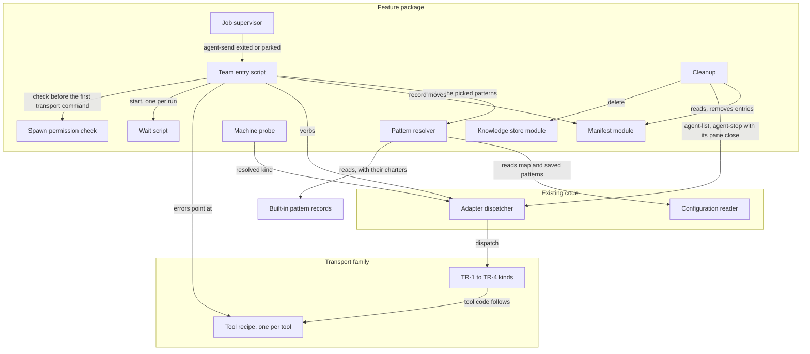

Caption: no cycle; the manifest module and the transport kinds never meet. The dispatcher is unchanged; the configuration reader gains keys (§14 C1, C9).

| Module | Purpose | Public interface | Depends on | Owner aggregate |
|--------|---------|------------------|------------|-----------------|
| Transport adapter family | Start, message, read, stop and list agents | The six verbs of §3; one recipe file per multiplexer tool (S-168) | dispatcher; tool recipe, one per tool (S-168) | — |
| Manifest module | Schema, directory mutex, atomic publish, every read; the transition table | record, move, read; no caller learns of the lock (S-49) | none | Run |
| Team entry script | The one script agents call to start, message and stop agents. Checks each edge, kind and start request, and the format version of a start-request or finished body (S-231); accepts a solo: step only when the requester's stage, read from its manifest entry, has no stage map entry (agent-decided, §13 Q33; the read is inferred); builds the four-part label and the agent name, every part made legal by one rule (correction of audit round 3, agent-decided), the name's model part with its vendor prefix dropped, then made legal, then cut to 8 characters (correction of audit round 4, agent-decided; audit round 5, agent-decided); refuses with exit code 2, on an agent start, an agent-id with no entry or an entry not in state starting (correction of audit round 3; audit round 3, agent-decided), and a name with no room for 1 goal character, or for g- and 1 character when the goal needs g- (audit round 2; audit round 6, agent-decided), the 3 joining '-' counted in that room (audit round 7, agent-decided); writes the pane label and the agent name into the manifest line whose agent-id the contact agent passed before its transport call, and the process id and the session id after it, in the agent-start call, under the manifest lock (S-233; correction of 2026-10-05; audit round 7, agent-decided); when the write before the call fails, makes no transport call and answers exit code 4, naming the write (agent-decided, §13 Q49); when the write after the call fails, stops the agent it started with agent-stop's steps and answers exit code 5 with stopped, pane closed and the pane id (audit L59; correction of 2026-10-05; audit round 3, agent-decided), and the process id and the kind, ending that stop 5 s before agent-start's 120 s (audit round 5, agent-decided; the kind inferred), and started-at (audit round 9, agent-decided), pane closed and the pane id only for a pane kind (audit round 6, agent-decided); starts each job supervisor from the field watched-agent-id, whose presence marks a supervisor start (correction of audit round 4, agent-decided), writing nothing into the manifest, and refuses a second one for one agent (S-240; audit round 3, agent-decided), one whose watched-agent-id has no entry (audit round 4, agent-decided) and one that carries any other field, and answers a supervisor start with only the process id and the label of its process entry (audit round 6, agent-decided); writes body, envelope and completion-signal files; sends finished to the report target the manifest and pattern name, ignoring the sender's target, in the order body, completion signal, target pane, contact inbox (S-235); closes the pane inside agent-stop (S-234); lists agents by the run's goal, made legal and cut to the shortest, over its manifest entries with a non-empty agent name, of the common prefix of that goal and the name (audit round 6, agent-decided), strays included (S-237); writes one charter file per role into the run directory at resolve time, from the pattern record or, for a one-off pattern, from the charter its input carries, the run's only copy of it (audit round 17, agent-decided), and names the role's charter file before the brief in each agent's launch prompt, and in a resume's launch before its prompt (charter C2; charter C3', agent-decided); lets a role and its resolved report target, another role, the agent that asked (from the manifest, as for finished) or the contact agent, send each other kind message both ways, and no other undeclared pair (charter C4; audit round 15, agent-decided); makes tabs and panes only inside agent-start (S-131, S-167, S-174, S-187, S-188, S-210, S-217, S-223) | the six verbs of §3, one JSON object each | dispatcher, manifest module, pattern resolver, wait script (it starts one per run), spawn permission check (before the first transport command), tool recipe (its errors point at it, S-168) | Run |
| Pattern resolver | Read built-in and saved pattern records, and a one-off pattern in the field shape of a record, with its charter (audit round 17, agent-decided), follow includes by name, flatten combined patterns before any start, fill roles, apply talk edges and report targets, add a moderator to a debate with no hub; refuse an unfillable role, a missing messaging ability, a self-including pattern, an unknown record version (S-143, S-144, S-171, S-212, S-229) or one role name with 2 different definitions, with exit code 2 (agent-decided, §13 Q28), and an edge, a step or a report target that names a role its record does not define, also with exit code 2 (audit L18, agent-decided). It refuses a pattern with roles, a record or a one-off pattern, whose charter or any role's charter part is missing or empty, with exit code 2, naming it (charter C1; audit round 16; audit round 17, agent-decided); a record with no roles, such as BP-1 solo, starts no agent and needs no charter, so it checks no charter part there (audit round 16, agent-decided). It gives every role 2 implied edges, to its report target and back, kind message, with no declaration, and the team entry script resolves a target that is not a role at each send (charter C4; audit round 15, agent-decided). The resolved pattern keeps the name and version of each source (S-229). Included steps follow the includer's own steps, in includes order, depth first, each named pattern-name/step-name; roles merge by name (agent-decided, §13 Q28; §4 includes) | resolve(the patterns of the stage map entry, or the human's pick, or a one-off pattern in the field shape of a record (audit round 17, agent-decided)) → the resolved pattern file, or a refusal naming the role, ability, pattern or version (S-230, AC-032) | configuration reader, built-in pattern records | Run |
| Built-in pattern records | BP-1 to BP-5 as versioned data files shipped with the plugin (S-143, AC-034); BP-2 to BP-5, each with roles, carry their charters, shipped in the same change (charter C6; audit round 16, agent-decided), and BP-1 solo, which has no roles, carries none (audit round 16, agent-decided) | read by the pattern resolver | none | — |
| Knowledge store module | Entry lifecycle, finished stamp, per-stage read filter, the debate release rule per work-item id, counting roles (S-138, S-193) | write entry, mark finished, read finished; a peer's draft only when a finished draft exists for every debater role (S-193) | none | Knowledge store |
| Cleanup | Five fixed steps: kill every process the manifest names, including the inbox wait job and each job supervisor, calling agent-stop, which closes its pane (S-234), on every remaining agent entry, a lost entry included (audit round 5; audit round 7, agent-decided): it kills by the process id when the entry holds one and closes the pane when it holds a handle (audit round 7, agent-decided), kills only after the identity check and closes a TR-4 terminal by its terminal identifier, and an entry that holds neither gets stopped true with the method 'nothing recorded', moves to cleaned and is named in the report by agent-id and agent name (audit round 8, agent-decided); an entry with an empty kind has no handle (audit round 9, agent-decided) and no started-at, and an entry that holds a process id and no started-at gets no kill: stopped true with the method 'already gone' and a move to cleaned when no live process has that id, else stopped false with the reason 'identity unknown' and a move to unkillable, and a later cleanup moves it to cleaned once agent-stop answers stopped true without pane closed false (audit round 10; audit round 11, agent-decided); the report names it while it is unkillable (audit round 9, agent-decided); delete the message area, the knowledge store, the resolved pattern, then the manifest, none of which it deletes while any entry stays unkillable or a process entry is left after a failed kill (I5; audit round 13, agent-decided), saying in its report that they are kept for the next cleanup (audit round 12, agent-decided); report survivors, with each unkillable entry's agent name and process id (audit round 12, agent-decided), and every pane still open (S-181, S-198, S-225), and every TR-4 terminal still open (AC-031; audit round 9, agent-decided). It stops no agent the manifest does not name: it lists each stray agent-list finds (S-237), by agent name and pane id, in its report, and the human stops it (correction of audit round 3, agent-decided; correction of audit round 4, agent-decided); when agent-list answers exit 3, the report says the kind cannot list agents (audit round 3, agent-decided) | one call per run | manifest module, dispatcher, knowledge store | Run |
| Machine probe | Resolve the best available kind | resolved kind, own shell only (S-77) | dispatcher, which takes the resolved kind as if configured (S-60) | — |
| Wait script | Check the contact agent's inbox every 10 seconds and exit once, at the first of two events: a file is in the inbox, or the earliest park-until time passes (S-195, S-226). With nothing parked it has no end time: it ends on a file or when cleanup stops it. It looks in the inbox before its first wait (inferred, R46-WAIT card) | 2 command-line arguments: the inbox folder and an optional park-until time (R46-WAIT card, accepted as S-226); reads no environment variable (S-128); waits the way the stall watchdog already waits | none | Run (process entry) |
| Job supervisor | Watch one agent; send exited, and parked with the reset time where it owns the output stream (TR-2) (S-141). Started by agent-start, which names the watched agent-id in its own field, watched-agent-id (correction of audit round 4, agent-decided); the contact agent writes its process entry from the answer, with the answer's process id (audit round 5, agent-decided) and started-at read from the operating system when it writes the entry (S-240, S-232; audit round 3, agent-decided) | agent-send exited or parked, only to the contact agent, as the watched agent: its agent-id, role and owner generation; message id = the watched agent-id, then 'sup', then the supervisor's counter; parked carries the reset time in a body file, UTC ISO 8601; body-path empty only for exited or an unknown reset time (S-236) | team entry script | Run (process entry owned by the agent-id it watches; at most one per agent, S-181, S-222, S-240) |
| Spawn permission check | Unchanged by the pane close, which runs inside agent-stop: no seventh verb (S-234). Before a run's first transport command, confirm the harness will let the contact agent run the team entry script for all six transport verbs of §3 (agent-start, agent-send, agent-status, agent-read, agent-stop, agent-list); refuse, naming the rule, when it will not (AUTO-1) | check() → ok, or a refusal carrying the rule text | provider layer; the one rule constant (AUTO-2) | Run |
| Tool recipe | One file per multiplexer tool in its kind's folder: how detection recognises the tool, how each of the six verbs maps to the tool's commands, the best delivery way, tab support, and the known traps from its trial log (S-168, S-211, S-214). A known herdr trap: a Codex resume through herdr agent start left no pane; typed into a new pane with herdr pane run, it worked (providers/CONFORMANCE.md:328) | read by that tool's code; named by the script's error output and the pane-agent rule (S-168) | — | — |
| SessionStart hook | Prints the pane-agent rule's short form into every plugin-enabled session; DELEGATION.md holds the full rule (S-156). The short form is fixed text: it names the condition and both branches of the rule, then points at DELEGATION.md, and detects nothing at start (D-30, agent-decided). On Codex the output needs the harness's hooks feature and a trust entry (INV-033; §9b). In a pane agent, after a compaction only, it also points the agent back at its charter file: it prints the pointer only when the envelope's source is compact and the launch-only value is set, and is silent otherwise. The Codex probe saw no SessionStart at compaction, and it had no trusted printing handler, so a Codex pane agent is taken as not re-pointed after one, an accepted gap (charter C3', agent-decided; providers/CONFORMANCE.md:320); how it finds the file is §13 Q54, and §13 V27 proves it per harness. Its 2 handlers join the * group of both hooks files after the 3 existing ones, the short form fourth and the charter pointer fifth, so no existing Codex trust key moves and the group ends with 5 handlers (audit round 16, agent-decided) | hook output | — | — |
| Model equivalence | Same tier row, another harness column (C12) | read of the tier map | tier map document | — |
| Dashboard section | Read-only parser over the manifest | a mission-control section | manifest file | — |

The spawn permission check's rule also covers tab create, pane split and the settings copy, because each runs only inside agent-start (S-167, S-191).

## §9 L8 — Tactical Patterns

| Concern | Pattern | ADR |
|---------|---------|-----|
| Transport selection | Registry + kind-blind dispatcher (house adapter shape, S-57) | `adr/design/0001-transport-as-fifth-adapter-family.md` |
| Agent lifecycle | State machine with a declared transition table, enforced by the writer (S-54) | `adr/design/0002-enforced-agent-lifecycle.md` |
| Manifest writes | Single writer + directory mutex + write-then-rename (S-10, S-27) | `adr/design/0003-single-writer-manifest.md` |
| Parked-agent resume and contact wake | One wait job per run that checks the contact inbox every 10 seconds and ends on the first file or the earliest park-until; the contact agent keeps the one-job rule; declared capability + per-harness probe + next-turn fallback (S-105, S-195, S-226, S-240) | `adr/design/0008-one-wait-job-per-run.md` (supersedes 0004) |
| Builder under /afk:autopilot | The subtask agent is the builder: it commits, pushes and updates the checklist; the contact agent opens the Draft change request before the first subtask starts (S-227) | `adr/design/0012-autopilot-subtask-agent-is-the-builder.md` |
| Spawns under Claude Code auto mode | Human-granted allow rule, offered by setup, checked before the first transport command, covering every transport verb (AUTO-1, AUTO-2, T7b) | `adr/design/0005-human-granted-spawn-rule.md` |
| Manifest validation | Hand-written checks inside the owning module; no schema library (S-56) | — |
| Journal lines | Formatted locally against the documented grammar; no shared writer added (S-59) | — |
| Role results | Result file the requester names + finished message with a JSON body to the report target + short copy to the contact agent; readers by convention (S-154, S-173, S-212, S-231, S-235, S-239) | `adr/design/0006-role-result-file-and-finished-message.md` |
| Message delivery | Inbox for the contact agent, checked every 10 seconds by the wait job; the tool's delivery way into the pane for every other agent (S-147, S-189, S-215, S-226) | `adr/design/0007-inbox-for-contact-pane-for-others.md` |
| Agent recovery | Stop the old agent and close its pane, then resume the harness session first, the checkpoint second (S-213, S-219, S-233, S-242) | `adr/design/0009-resume-session-before-checkpoint.md` |
| Result routing | The pattern names each role's report target, else the requester; the script ignores the target the sender wrote (S-212, S-235) | `adr/design/0010-report-target-per-role.md` |
| Role instructions | One charter per pattern that starts agents, built-in, saved or one-off, a pattern part and one part per role; one charter file per role in the run directory, named by the launch prompt before the brief; a resume's launch names it again, and the SessionStart hook points the agent back at it after a compaction; a one-off pattern's charter files are its only copy (charter C1, charter C2, charter C3', audit round 16, audit round 17; agent-decided) | `adr/design/0016-charter-file-named-by-the-launch-prompt.md` (a draft, §13 Q27) |
| Progress reporting | kind message to the report target, opening with one fixed line, along the 2 implied edges between each role and its resolved report target, both ways; down that line go only answers and data; the contact agent gets no copy (charter C4, charter C5, audit round 15; agent-decided) | — |
| Multiplexer support | One recipe per tool behind one command contract of six verbs; the pane close runs inside agent-stop (S-168, S-214, S-234) | `adr/design/0011-recipe-per-multiplexer-tool.md` |
| Team shapes | Patterns as versioned data records with the fields of §4, linked by name, flattened by a resolver before any start (S-143, S-228, S-229); included steps follow the includer's own steps, depth first (agent-decided, §13 Q28) | requirement ADR-0012, `adr/design/0013-included-steps-follow-the-includer.md` |
| Role spawns in a stage with no stage map entry | One implicit single-role step per spawn (D-09), named solo: followed by the role in the start request and accepted only in such a stage (agent-decided, §13 Q33) | `adr/design/0014-solo-step-in-a-stage-with-no-map-entry.md` |
| Debate | A moderator (the pattern's hub, else one the resolver adds), one knowledge-store record per debate step, a release rule counting roles (S-137, S-138, S-144, S-193) | — |
| /afk:fix under a team | afk-lite, its changes left uncommitted for the caller (S-158, S-207). An interactive run stops after the design step (AC-037). In driven mode afk-lite records a two-way door in the decision ledger and continues, and ends with needs_decision on a one-way door or a DISAGREE-FINAL point; the caller passes it up (agent-decided, §13 Q34) | requirement ADR-0014, requirement ADR-0019 |
| Message idempotency | Message id built by the sender from its agent-id and its counter; the receiver's processed folder (S-172, S-178) | — |
| Run-file publish | Write under a temporary name, then rename (S-172, S-174, S-196) | — |
| Lesson-id mint | A folder lock around the id step and the append, following the repository's existing lock-script pattern of the build gate (S-203); the lock polls every 0.2 s (audit L64, agent-decided) | — |

The built-in patterns BP-1 to BP-5 are the PRD's catalog rows, shipped as versioned data records (S-143, AC-034).

**Pattern standard: a rule every pattern meets.** Every pattern record, built-in or saved, and every one-off pattern an agent writes or proposes for one task, is designed to meet the standard, and every agent that builds or proposes a pattern knows it (AC-058, AC-059). The human's direction of 2026-09-30, verbatim (R-46 note on R46-PATFIELD): "for both built-in patterns and on-the-spot-temporary-patterns, they are all should be designed (aka the agents building them should be aware of the standard) that the pattern is to ensure segregation of duty, cross check/audit independently, attacking problems from different angles/perspectives, and jobs to be completed with maximum autonomy". The test each property sets is the PRD's reading, agent-decided under the same day's delegation and not yet audited by the human (PRD Catalog, Pattern standard):

| ID | Property | A pattern meets it when |
|----|----------|-------------------------|
| PS-1 | Segregation of duty | The role that produces a piece of work never checks it |
| PS-2 | Independent cross-check and audit | At least 1 agent that did not produce a piece of work checks it, and each checker writes its first findings before it sees another checker's |
| PS-3 | Several angles on a problem | A problem that needs thinking gets at least 2 agents that differ in model or in brief |
| PS-4 | Maximum autonomy | The team runs to its end without the human, stops only at the stops its description names, and decides and records everything else |

- A pattern's description says how the pattern meets each property (AC-059).
- A pattern's charter also says, in its pattern part, how the pattern meets each property, and every agent the pattern starts reads that part in its charter file, so the standard reaches each agent of the team as well as the agent that builds the pattern (charter C1, charter C2, agent-decided).
- The standard has one home beside the pattern schema, where every agent that writes or proposes a pattern reads it; skills point at it (AC-058; the human's direction names the pattern schema document).
- BP-1 solo starts no agent, so the standard does not bind it and its record carries no charter (audit round 16, agent-decided; AC-059); where solo drafts a document, the audit AC-006 requires meets it (PRD, agent-decided).
- No program checks a pattern against the standard; the agent that writes or proposes it applies the standard, and the human's pick and review catch a miss (inferred: no settled row names a check). The resolver checks only that the charter and each role's part are there on a record or a one-off pattern with roles, not what they say (charter C1; audit round 16; audit round 17, agent-decided).

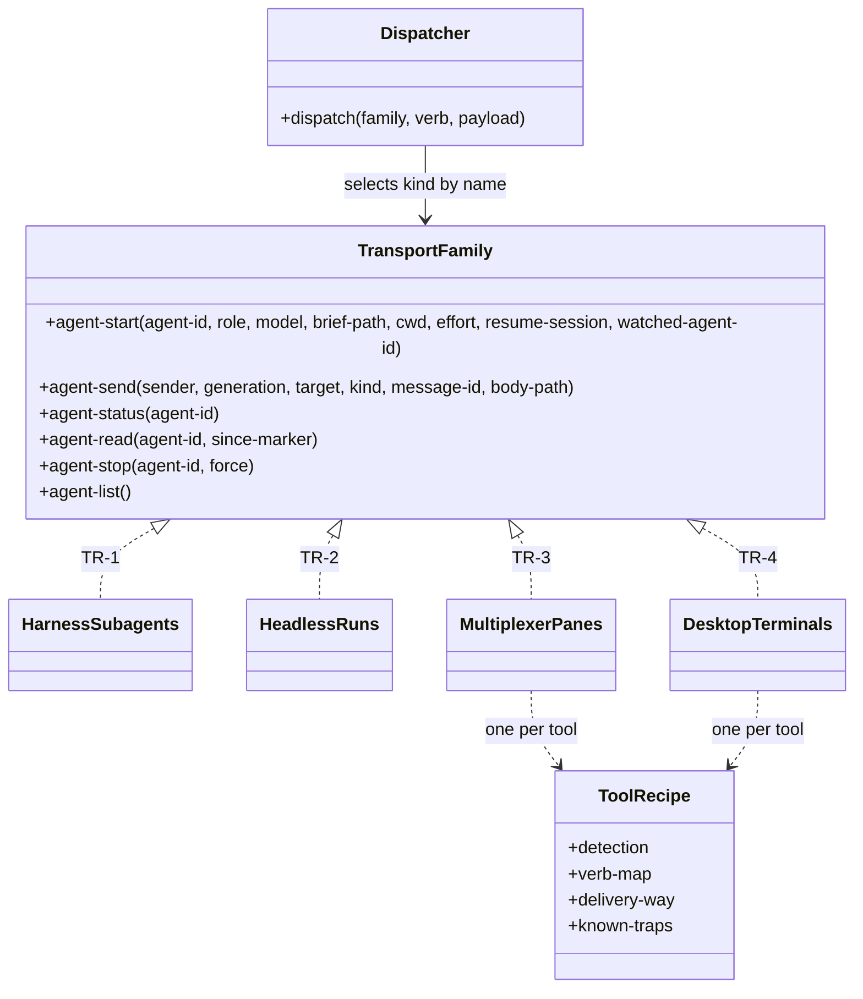

Caption: one written contract per kind, identical verb set, one JSON answer shape; the script builds the pane label, so agent-start takes none (S-210).

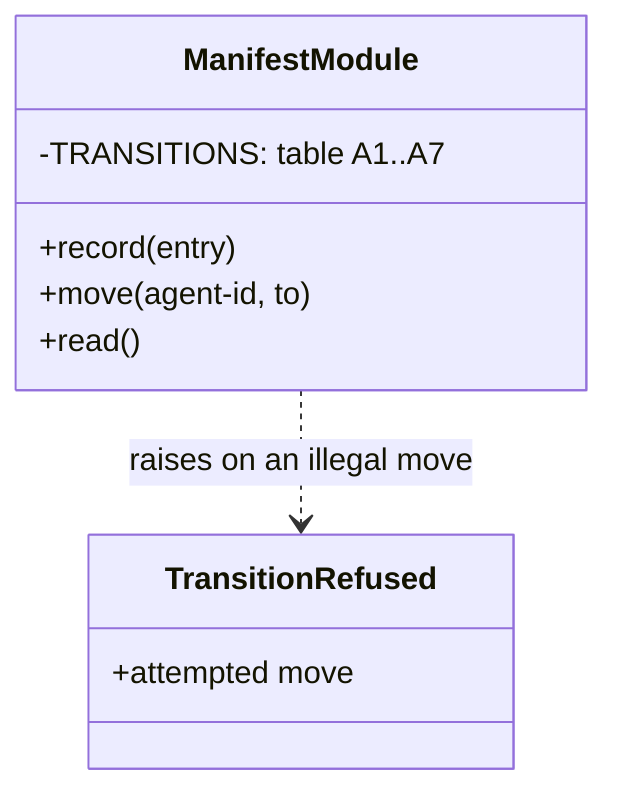

Caption: the only state-transition enforcer in the plugin; it applies to agent states only.

## §9b External Seams & Failure Affordance

| Boundary | Framework @ pin | What it does to our value | Failure surface | Seam-test |
|----------|-----------------|---------------------------|-----------------|-----------|
| Harness wake on a background job's exit | Claude Code 2.1.282 and Codex CLI 0.157.0, observed once each on Windows 11; trial T12 on Claude Code and Codex 0.158.0; no version pin in this repository | Claude Code: the job's exit re-invoked the idle top-level agent; in T12 a file landing in its inbox folder woke it the same way. Codex: the exit was logged and started no turn, in both trials (INV-011, T12). A contact agent that is itself a subagent was not tried | Wake absent → next-turn check of the inbox and the manifest; a Codex contact agent says so at run start (S-105, S-122, S-166). The wait job checks the inbox every 10 seconds and exits, so the wake comes up to 10 seconds after a file lands (S-226) | The conformance probe per harness (C13): arm a job, idle, assert the agent is re-invoked |
| Background job at session end | Claude Code 2.1.282 headless and Codex CLI 0.157.0 interactive, observed once each | The job's shell is killed, so its last command never runs and no wake arrives; a child already running survives as an orphan until it exits by itself (INV-011) | The wait job's entry stays in the manifest; cleanup finds its process gone, removes the entry and reports it as already gone (S-117); the next-turn check resumes the agent (S-94) | A build-time probe per harness (§13 V25): end a session while a wait job runs, then check that the next turn's check of the inbox and the manifest recovers the run (S-94; audit L40, agent-decided) |
| Desktop-tool terminal close verb (TR-4) | The installed desktop tool | Closes a terminal by recorded identifier; runs inside agent-stop (S-234) — unverified premise (AS-1, E3): the verb was read from the installed tool's help and never run here, since the live trial needs the desktop tool open with terminal attach on (GRILL-LOG.md:10, :24) | Close fails → named in the cleanup report | Environment-gated TR-4 verb test (PRD Testing Decisions); §13 V29; the live trial is pending |
| Operating-system job owning a process tree | Windows job objects, Windows 8 or later (nested jobs) | With the kill-on-job-close limit set, closing the last handle to the job terminates every associated process, and a child a job member creates is associated by default; a child started through Windows Management Instrumentation, or broken away under a breakaway limit, is not (Microsoft Learn, "Job Objects" and "JOBOBJECT_BASIC_LIMIT_INFORMATION") — unverified premise: documented by the vendor only, never trialled here, and no repository record holds it. The settled guarantee (R-8, CLN1) therefore needs the kill-on-job-close limit and no breakaway limit on each agent job; derived from the documentation, not a separate settled row | A process outside the job → registered process entry killed by identifier, and the descendant sweep; a child started through Windows Management Instrumentation is outside both (Q10) | Start a process tree, close the owner, assert nothing survives (PRD Testing Decisions); §13 V30 |
| Terminal multiplexer install | The multiplexer's own installer | Installs outside the repository — unverified premise: how the installer fails part-way and what an uninstall removes are not observed, since INV-007 stops at the upstream installer (§13 Q3) | Partial install → setup reports failed; uninstall coverage not verified | The check command on the tool's setup line, which setup runs again after an install and which reports the line not fixed when it fails (S-245); uninstall coverage stays unverified (§13 Q3); §13 V31 |
| Codex agent lookup | Codex CLI 0.157.0, observed once (trials T5, T6) | Finds an agent by its file's name field, not its filename; `afk-reader` is refused while the stub's name field reads `afk-afk-reader` (INV-013) | A skill's spawn of `afk-reader` fails as an unknown agent type | C18: set the name field; a live spawn on Codex confirms (S-127) |
| Claude Code auto-mode classifier | Claude Code in auto mode, the built-in starting mode for interactive sessions from v2.1.283 (documentation); observed once on this machine, 2026-09-28 (trial T7) | Refuses the contact agent's start command with or without bypass flags, and refuses the agent's own edit of its settings (T7). A rule matching only the start lets the start run but not the next verb: sending work to a started agent is refused (T7b). An allow rule the human adds resolves before the classifier (documentation, permission modes) | Rule missing, not covering every transport verb, or no longer matching after a plugin update → the run refuses before its first transport command, naming the rule and `/afk:setup`; nothing is started (AUTO-1, AUTO-2) | A check test: settings without the rule → refusal naming it; with it → ok. Live proof: trial T7 repeated with the rule present |
| Harness update check at an agent's start | Codex CLI 0.157.0 (trial T8); Claude Code documentation | Codex: an update found at start is installed, then the process asks for a restart and exits, so the agent never starts (T8). Claude Code updates in the background (documentation) | Each started agent carries its harness's update-off switch on its own launch only: Codex `-c check_for_update_on_startup=false`, Claude Code `DISABLE_AUTOUPDATER=1` in the started process's environment; no configuration file or user environment changes, so a manually started session still checks (human, 2026-09-28) | Transport test: the start command each provider builds carries the switch. Live proof: trial T8 |
| herdr message delivery | herdr 0.9.1, trial T11 (2026-09-28), Claude Code and Codex, idle and busy | agent prompt delivers the envelope into the pane with no loss; a busy Claude pane queues it until its turn ends, and turn-end gates held two turns 3 and 9 minutes. A message to a pane that holds unsent typed text is appended to it and both are submitted as one prompt (T11 case D) | A busy pane delays delivery; nobody types in a pane agent's pane (S-148); the contact agent's messages go to its inbox instead (S-147, AC-046) | Live proof: trial T11 repeated through the team entry script; at build, §13 V33 |
| herdr agent name and pane label | herdr 0.9.1, observed 2026-09-29 | Refuses an agent name with spaces or longer than 32 characters (invalid_agent_name); accepts a pane or tab label with spaces | The script builds both forms from the start request: the spaced four-part label and the lowercase slug, at most 32 characters with any -N suffix, each part made legal by one rule, with g- before a first character that is not a lowercase letter, and the goal part cut first, after the model part drops a vendor prefix, is made legal and is cut to 8 characters (correction of audit round 4 and audit round 5, agent-decided); g- and the 3 joining '-' count inside the 32, and a name with no room for 1 goal character, or for g- and 1 character when the goal needs g-, is refused with exit code 2 (S-210, S-217; audit L15, audit round 2, correction of audit round 3, audit round 6, audit round 7, agent-decided) | A transport test: the start command carries both forms; V26 probes that agent-list returns the name and pane id of an agent that agent-start started (correction of audit round 4, agent-decided) |
| herdr harness session id | herdr 0.9.1, observed 2026-09-29 for a Claude pane | Records a Claude pane agent's session id, read back from the pane's details. Not verified: that it records a Codex session the same way; that a resume from the id works after a kill in the middle of a turn. On Codex, herdr agent start with --kind codex -- resume left no pane, and only the same command typed with herdr pane run worked (providers/CONFORMANCE.md:328), so agent-start's resume path takes that form there (§13 Q21, V21) | Empty session id → recovery skips the resume and starts a fresh agent that reads the checkpoint (S-219) | Probe 2026-09-30 (providers/CONFORMANCE.md:328): a blocked pane agent took a relayed answer, and a session resumed in a new pane kept its context, on both harnesses. Still owed before the design binds (S-213): Codex session id at start, resume after a mid-turn kill (§13 Q21) |
| SessionStart hook output | Claude Code and Codex 0.158.0, trial T12; in a pane agent, Claude Code 2.1.285 and Codex CLI 0.159.0 with herdr 0.9.1, probes 2026-09-30 (providers/CONFORMANCE.md:320) | T12, as the agent-written GRILL-LOG.md:489 records it from a trial log not in the repository: a repository-declared hook's line reached both agents before their first command. The probe does not bear that out for Codex: whether Codex output reaches the agent is unproven (providers/CONFORMANCE.md:320; §13 V14). Probe: on Claude Code it fires at startup, resume, clear and compaction, outputs arrive in finish order, a 23.9 KB output became a preview, and the plugin's own handlers timed out at 15 s. On Codex it fires at startup, resume and clear, and none was seen at compaction; whether its output reaches the agent is unproven, because a printing hook needs a trust entry | The pane-agent rule's short form depends on it (S-156). A handler past its time limit, or an untrusted Codex hook, may deliver nothing (§13 rows for INV-033) | Live proof: trial T12; the Codex cell of the probe (§13 V14), which needs a Codex trust entry for a printing hook (providers/CONFORMANCE.md:320); the sandbox shell works since the re-probe of 2026-10-06 (:315) |
| Plugin tracker server in a pane agent | Claude Code 2.1.285 and Codex CLI 0.159.0, probe 2026-09-30 (providers/CONFORMANCE.md:321) | Claude: the pane agent held the tracker tools. Codex: the server is registered and connected, but its tools are absent from the agent's turn | A Codex pane agent that needs the tracker, such as the /afk:bug publisher, fails (§13) | The probe's Codex cell after a fix |
| Provider marker variables in a pane agent | Claude Code 2.1.285, probe 2026-09-30; Codex CLI 0.160.0, re-probe 2026-10-06 (providers/CONFORMANCE.md:322) | Claude: the shell carries CLAUDECODE=1 and the session markers; the plugin's provider check reads provider claude and an agent session. A variable set on the pane reaches the Stop hook processes on both harnesses. Codex: the shell carries CODEX_CI, CODEX_SANDBOX_NETWORK_DISABLED, CODEX_SESSION_ID equal to CODEX_THREAD_ID, CODEX_VERSION and the HERDR_ variables, and no PLUGIN_ROOT; the plugin's provider check reads provider unknown and no agent session, since hooks/lib/providers/codex.sh detects on PLUGIN_ROOT, which only hook processes carry | A gate that keys on the markers misreads a Codex pane agent (§13 rows for INV-038; the Codex detection defect is §13 V6) | Probe :322, both cells; a Codex commit for the pre-commit gates (§13 V6) |
| Stop gates in a pane session | Both harnesses, probe 2026-09-30 (providers/CONFORMANCE.md:323) | Stop fires at each turn end and runs the plugin's Stop gates; in this worktree the gate run passed the 300 s hook limit on both | A message to a busy pane waits for the gate run (§5 long-running ops) | The probe, run again on a pane agent agent-start starts: §13 V34 |
| Named agent definitions and pinned models in a pane agent | Both harnesses, probes 2026-09-30 (providers/CONFORMANCE.md:324, :325) | A pane agent's own spawns resolve the plugin's named definitions. A pinned model name runs that model; a Claude definition's pin is an alias, and a Codex reader stub's read-only sandbox did not apply. Starting the pane agent itself as a definition was not probed | A pane role agent takes its model from the tier name in PROVIDERS.md, and the implementation tier passes the pin as agent-start's model (D-10, agent-decided) | The probes; re-run on the shipped version, because the installed pins differ from this worktree |
| File reads in a pane agent | Claude Code 2.1.285, probe 2026-09-30; Codex CLI 0.160.0, re-probe 2026-10-06 (providers/CONFORMANCE.md:326) | Claude: reads an added folder, another session's scratchpad and the installed plugin's files. Codex: the shell reads an added folder, another session's scratchpad and the installed plugin's files; its Git bash starts with no /usr/bin on PATH, so a script exports it first (:315) | A Codex pane agent reads only through its shell, so a script that does not export PATH fails there (§13 rows for INV-035, INV-037, INV-038) | Probe :326, both cells |
| Busy pane message order | Both harnesses, probe 2026-09-30 (providers/CONFORMANCE.md:327) | Several messages sent during a busy turn arrive in send order after the turn and its Stop gates end | A delay, never a reorder | The probe, run again through agent-send: §13 V35 |
| Subagent report-file write | Claude Code 2.1.285, probe 2026-09-30 (providers/CONFORMANCE.md:329) | A subagent's Write tool refuses REPORT.md, SUMMARY.md and findings.md; other names and a shell write pass. Codex refuses none | Under the subagent fallback the starter writes the report the child returns (S-157, AC-044) | The probe; extend it with the review gate's file names and the bug result file (§13 rows for INV-036) |
| Capture time limit and pane close | Claude Code 2.1.285, probe 2026-09-30; Codex CLI 0.160.0, re-probe 2026-10-06 (providers/CONFORMANCE.md:330) | A command past 120 s moves to the background and is not killed. A pane close sends no signal a shell trap catches; a plain pane's process is killed within 10 s. Codex: a shell call with no timeout argument returns after 10 s; asked for 900000 ms the agent set at most 30000 ms, and the screen then showed a background terminal. A pane close killed the agent's bash with no signal a trap catches, and its child stayed alive with no live parent, owned by the sandbox user; the operator's Stop-Process got Access is denied | A lock or temp file a trap should free stays behind (§14 lesson-ledger row); a Codex pane agent's shell child can outlive agent-stop (§13 V28) | Probe :330, both cells; agent-stop on a Codex pane agent (§13 V28) |
| Codex pane-agent launch flags | Codex CLI 0.159.0 on this host, probe 2026-09-30; Codex CLI 0.160.0, re-probe 2026-10-06 (providers/CONFORMANCE.md:315) | Under --approve-for-me every shell call failed with a sandbox setup error on 0.159.0; on 0.160.0 the shell works, and its Git bash starts with no /usr/bin on PATH. A relaunch with --dangerously-bypass-approvals-and-sandbox was refused by the launching session's permission classifier | The settled full-access launch (S-136) is unprobed, and it meets the classifier refusal wherever that classifier runs (§13 V7) | A new probe row for the full-access launch |
| First-run dialogs at an agent's start | Claude Code v2.1.284 and Codex 0.158.0 with herdr 0.9.1, trials T8 and T10 | The project MCP-server dialog and the auto-mode 'Teach auto mode' dialog block a Claude start; the update prompt blocks a Codex start. Copying the main checkout's git-ignored local settings into a new worktree cleared the MCP dialog (T10) | agent-start stops the blocked process and answers exit code 4 naming the dialog; the contact agent tells the human once how to clear it (S-186); the settings copy runs inside agent-start (S-191) | Transport test: a blocked start answers exit code 4 naming the dialog. Live proof: trials T8 and T10 |
| Claude Code auto-mode classifier, pane creation | Claude Code in auto mode, trial T12 (2026-09-28) | A contact agent's direct `herdr tab create` was refused as '[Create Unsafe Agents]'; the human's rule covered only the start command | Tabs and panes are made only inside the script's agent-start verb, so the one rule on the script covers them (S-167); unproven until tried (§13 Q22) | Live proof: trial T12 repeated through the team entry script; at build, §13 V36 |
| 1DevTool delivery and tabs | The installed desktop tool | Delivery ways and tab support not known (S-214) — unverified premise: no trial of the tool has run here; its command is not on this machine's path and its connection was down (GRILL-LOG.md:24) | A tool that cannot make tabs uses panes and says so at run start (S-211) | A trial finds its delivery ways and tab support before its code is written (S-214); §13 V32 |

Manifest validation adds no schema library: its checks are hand-written in the module that owns the format (S-56). No other grill-log row adds a library: a search of GRILL-LOG.md for 'librar' finds S-56, the R-16 round that presented it, an investigation finding that validation is hand-written with no schema library, and a note that no written rule sets the layering of the shared hook libraries. The versions in the table are the ones that trials and probes observed, not pins. The one pin it uses is the implementation tier's model pin (PROVIDERS.md:58), which agent-start takes as the model (D-10, agent-decided; §13 Q9).

---

## §10 NFRs

| Concern | Target | Measurement | Owner |
|---------|--------|-------------|-------|
| agent-start budget (s) | ≤ 120 | verb timeout, answer unavailable after | transport kind |
| Exit 5's stop (s) | what is left of agent-start's 120, ended 5 s before it; agent-stop's 60 does not apply (audit round 4; audit round 5, agent-decided) | the script's timeout on the stop | team entry script |
| agent-send / agent-read budget (s) | ≤ 30 | verb timeout | transport kind |
| agent-status / agent-list budget (s) | ≤ 10 | verb timeout | transport kind |
| agent-stop budget (s) | ≤ 60, then stopped false | verb timeout | transport kind |
| Automatic retries per failed role (count) | 0 | code review | contact agent |
| Stall-watchdog silence limit on a working agent (min) | 20, disarmed while parked | watchdog | contact agent |
| Wait jobs per run (count) | 1; it ends at the first file in the contact agent's inbox or at the earliest park-until. The contact agent stops the old job and removes its line before it starts the next (S-195, S-240) | manifest process entries | contact agent |
| Inbox check interval of the wait job (s) | 10, so a wake comes up to 10 s after a file lands (S-226) | the wait script's interval | wait script |
| Job supervisors per agent (count) | ≤ 1; agent-start starts each supervisor and answers exit code 2 to a second one, naming the agent (S-222, S-240) | manifest process entries | team entry script |
| Checkpoint loss on a kill (writes) | ≤ 1, the write in flight | write-then-rename | role |
| Behaviour change with no team pattern and no multi-model, and role agents switched back or no pane transport (count of differences) | 1: a subagent's report file is written by the agent that started it (AC-001, AC-044) | existing suites | feature |
| Panes per tab (count) | ≤ 4, in a 2 by 2 grid; the contact agent's tab holds only the contact agent (S-211) | the tool's recipe | team entry script |
| herdr agent name (characters) | ≤ 32 (S-217) | the start command | team entry script |
| Model part of the agent name and the pane label (characters) | ≤ 8 (correction of audit round 4, agent-decided; clarification of audit round 5) | the start command | team entry script |
| Goal part of a pane label, when it is the feature name (characters) | ≤ 16 (S-210) | the start command | team entry script |
| Start nesting (levels) | ≤ 3, per DELEGATION.md (S-190) | the team script's start check (S-223) | team entry script |
| Memory of handled message ids (duration) | every handled id, kept until cleanup deletes the processed folder; 0 dropped before then (S-172, S-198) | the processed folder | receiver |

## §11 Out of Scope

- PRD Out of Scope, unchanged: nested team patterns (issue 25), a strict single-agent mode, cost estimation, durable knowledge, resource limits on a spawned agent, agents merging.
- Promotion of environment facts to any durable register (S-14, S-87).
- A shared journal writer (S-59).
- Any change to the adapter dispatcher, the existing status writer, the existing wait loop or the stall-watchdog script (HL-6 left-alone rows).
- A role-keyed runtime guard for any access row (S-15), including the stated exceptions of S-238 and the file rules of S-239, which hold by convention.
- A seventh transport verb: the pane close runs inside agent-stop (S-234).
- Paging or sorting in agent-list (S-237).
- A spend cap on quota (HL-5 alternatives).
- A liveness probe telling parked from dead beyond the park-until time (HL-4 risk).
- A shipped stage map: the plugin ships none (AC-032, S-143).
- Caps and a reserve on agents, messages or spend in a pattern (requirement ADR-0011, AC-039).
- A domain event or message bus: a message is transport data and nothing subscribes (S-145).
- An agent force-pushing or deleting a remote branch; the human keeps those actions (S-197).

## §12 Reversed Decisions

| Prior ADR | Superseded by | Reason |
|-----------|---------------|--------|
| `adr/design/0004-wait-job-with-probe.md` | `adr/design/0008-one-wait-job-per-run.md` | The run's one wait job also ends on a file in the contact agent's inbox, so one job serves the park and the inbox (S-195, WJ-1). It finds the file by checking the inbox every 10 seconds (S-226). That check is the polling loop ADR-0004 rejected, and it replaces the signed 'no polling loop' (S-58, narrowed by S-105; HL-6 re-sign, S-114). The script's one argument becomes 2: the inbox folder and an optional park-until time (S-128, R46-WAIT card) |

Settled rows that later settled rows amend (no ADR held them):

| Earlier row | Amended by | Now |
|-------------|------------|-----|
| S-18: no idempotency key on any verb | S-133 | agent-send's key is the message id |
| S-21: waiting is polling agent-status | S-142 | message-driven where the contact agent is addressable, polling otherwise |
| S-128: the wait script takes the time as its one argument | S-195, S-226 | 2 arguments, the inbox folder and an optional park-until time; the job checks the inbox every 10 seconds and ends on the first file or at the park-until time |
| S-58, S-105, S-114: no polling loop; the wait job sleeps to the earliest park-until and exits once | S-195, S-226 | the job checks the inbox every 10 seconds; the contact agent keeps one job per run (S-240) |
| S-5: an explicit close runs for desktop-tool terminals | S-169, S-225 | also for each pane when its agent's lifespan ends |
| S-140: message bodies are deleted with the knowledge store | S-198 | deleted in cleanup step 2, with the message area |
| S-148: delivery by herdr agent prompt | S-214 | the tool's delivery way named in its recipe |
| S-151: the contact agent copies the local settings file | S-191 | the copy runs inside agent-start, never overwrites |
| S-152: a blocked start is reported as blocked | S-186 | exit code 4, unavailable, naming the dialog; the entry moves to lost |
| S-154: the requester waits on its inbox | S-189, S-215 | the requester waits for the finished envelope in its pane; only the contact agent has an inbox |
| S-188: finished is delivered to the requester and the contact inbox | S-212, S-235 | finished goes to the report target the manifest and pattern name, the sender's target ignored; the contact agent gets a short copy; order body, completion signal, target pane, contact inbox |
| S-171: a message body has no fixed format and no version | S-231 | a start-request or finished body is one JSON object with a format version; an unknown version gets exit code 2; other bodies stay free text |
| S-173: the requester and the contact agent may use a result file | S-212, S-239 | the report target reads it; the requester and the contact agent read it only when they are the target |
| S-169, S-225: the contact agent stops an agent, then closes its pane | S-234 | agent-stop closes the pane; its answer gains pane closed and the pane id |
| S-135: only the builder commits | S-227, S-238 | under /afk:autopilot the subtask agent is the builder; the /afk:bug fixer commits on its own fix branch, a stated exception |
| S-178: parked and exited may carry an empty body path | S-236 | the supervisor sends as the watched agent; parked carries the reset time in a body file; the path is empty only for exited or an unknown reset time |

Settled rows and criteria that an agent-decided row amends (2026-10-05, under the delegation of 2026-09-30); each row names the settled rows and signed cells it changes, and the §0 table names every cell that cites it:

| Earlier row | Amended by | Now |
|-------------|------------|-----|
| S-207 and AC-037: afk-lite stops for the human after its design step in every run, and ends with /afk:fix's unchanged status set | GRILL-LOG.md row "Agent-decided, 2026-10-05" (§13 Q34); requirement ADR-0019 | an interactive run keeps the stop; in driven mode a two-way door is recorded in the decision ledger and the run continues, and a one-way door or a DISAGREE-FINAL point ends /afk:fix with needs_decision, which its status set lacks today (fix/SKILL.md:89-94); the /afk:bug fixer keeps its stop (S-164) |
| E4 (packet HL5-6, signed R-45): only the builder pushes, and the push has no ordering, key or partial failure | GRILL-LOG.md row "Agent-decided, 2026-10-05", design-audit open points (audit L19 to L21, L61) | the human and the contact agent may push too, as the access row 'Commit and push' permits; commit, push, then the checklist update; the commit id is the key; a rejected push is merged and pushed again once, then the run parks blocked |
| E6 and E12 (packet HL5-6, signed R-45): no idempotency key | the same row (audit L22, L23) | E6: the run's remaining manifest lines; E12: the working tree, by file path, the key the row lets the writer name |
| AC-035 and S-131: 2 paths need no declared edge | the same row (audit L5) | a finished message to its report target needs none either |
| agent-id "from agent-start" and the agent entry's fields (§4, signed); agent-start's input, answer and refusals, the exit-5 paragraph, the rows 'Answer fields' and 'Refusals added', and agent-list's goal (§3, HL-2, signed); E1's ordering and partial failure, and E2's and E3's ordering (packet HL5-6, signed R-45); A5's trigger (§6, HL-4, signed) | GRILL-LOG.md row "Correction, 2026-10-05 (agent error)", which replaces the design-audit answer L10 | the contact agent mints the agent-id, writes the entry with a new pattern step field and passes the agent-id to agent-start; the script writes S-233's 4 fields into that entry in the call (E1); a failed write stops the agent and answers exit code 5, and the entry moves to lost (A5's trigger); agent-list makes the goal legal before it matches |
| S-217 (human, R-44): the agent name is the 4 parts in lowercase, cut to 32 characters; AC-051 and audit L15: only the goal part made legal, g- only before a leading digit, and no rule for a name with no room for its goal part (§3 'Pane label', 'Refusals added' and agent-start's refusals, HL-2, signed; §4 agent name, HL-1, signed); A5's trigger (§6, HL-4, signed) | GRILL-LOG.md row "Agent-decided, 2026-10-05", audit round 2 open points (§13 Q39), and its correction of audit round 3 | one rule makes every part legal: lowercase, each refused character to '-', g- before a first character that is not a lowercase letter, then the cut; agent-start refuses with exit code 2 a name with no room for 1 goal character, naming the name, and the entry moves to lost (A5) |
| E2's trigger (packet HL5-6, signed R-45) and §5's row 'Start or stop a team agent' (HL-3, signed): only the contact agent starts or stops; agent-start's refusals and 'Calling it twice', the row 'Refusals added' (§3, HL-2, signed) and E1's key (packet HL5-6, signed R-45): none for an agent-id; the exit-5 paragraph, agent-stop's scope and agent-list's stray report (§3, HL-2, signed), and AC-013: the cleanup report names unkilled processes and open panes | GRILL-LOG.md row "Correction, 2026-10-05 (agent error, audit round 3)", which also replaces the round-2 answer to Q38 | the script's own stop on exit 5 is an E2 trigger and the one stop outside agent-stop; agent-start refuses with exit code 2 an agent-id with no entry or an entry not in state starting; cleanup stops no agent the manifest does not name and lists each stray, by agent name and pane, in its report; agent-stop acts only on an agent that has a manifest entry |
| agent-start's input, answer and refusals, the exit-5 paragraph, the rows 'Answer fields' and 'Refusals added', and agent-list's stray test and exit-3 cell (§3, HL-2, signed); the guardian of the relation watched agent → job supervisor (§4, HL-1, signed); A5's trigger (§6, HL-4, signed); E2's trigger, and E3's trigger, who may cause it, ordering and partial failure (packet HL5-6, signed R-45): only agent-stop closes a pane, and cleanup has no exit-3 branch | GRILL-LOG.md row "Agent-decided, 2026-10-05", audit round 3 open points (§13 Q40 to Q43); its answers to Q40 and Q44 are corrected by the next row | a stray is a listed agent whose pane id no entry holds; on exit 3 cleanup skips the stray list and says so; exit 5's stop follows agent-stop's steps, so its pane close is an E3 trigger, and its answer adds stopped, pane closed and the pane id; a supervisor start names the watched agent-id in its own field, the 4-field write and the starting check apply only to an agent start, and the contact agent writes the supervisor's process entry |
| agent-start's input and the exit-5 paragraph, the rows 'Pane label' and 'Refusals added', and agent-list's match, answer and stray report (§3, HL-2, signed); the agent name, the pane label and the relation watched agent → job supervisor (§4, HL-1, signed); A5's trigger (§6, HL-4, signed); E1's partial failure and E2's ordering on exit 5's stop (packet HL5-6, signed R-45); the answers of the row above to Q40, agent-list matches the pane label's goal word, which amended S-237 (human, R-46), and to Q44, the model part is the model as named | GRILL-LOG.md row "Correction, 2026-10-05 (agent error, audit round 4)", agent-decided under the grant of 2026-09-30, as the row "Clarification, 2026-10-05 (audit round 5)" states | agent-list keeps S-237's match, and the report shows each stray's name and pane id; the model part drops a vendor prefix ('claude-', 'gpt-') and is cut to 8 characters before the goal cut, which keeps S-217, and the pane label carries the same model part (clarification of audit round 5); exit 5's entry moves to lost, and a retry is a new start with a new agent-id, as E1's partial failure says; its "no move to unkillable" is replaced by the row on the open points of audit round 5, below; the supervisor's field is watched-agent-id, whose presence marks a supervisor start; V26 probes agent-list's name and pane id |
| agent-start's input and refusals, the row 'Refusals added', agent-stop's answer for an agent-id with no entry, the exit-5 paragraph and agent-list's exit-3 cell (§3, HL-2, signed); the guardian of the relation watched agent → job supervisor and the label of its process entry (§4, HL-1, signed) | GRILL-LOG.md row "Agent-decided, 2026-10-05", audit round 4 open points (§13 Q45 to Q48) | a supervisor start requires watched-agent-id and no other field, and a watched-agent-id with no entry gets exit 2 naming it; the supervisor's process entry takes the watched agent's pane label followed by the word supervisor as its label; agent-stop answers an agent-id with no entry with exit 0, stopped false and the reason that no entry holds it, and its signed cell that it never refuses stays; exit 5's stop gets what is left of agent-start's signed 120 s, and when that runs out the answer says stopped false; a kind without pane ids answers agent-list with exit 3 |
| agent-start's input, answer and refusals, the exit-5 paragraph, the rows 'Pane label', 'Answer fields' and 'Refusals added', and agent-list's match and exit-3 cell (§3, HL-2, signed); the agent entry, the process identifier, the agent name and the relation watched agent → job supervisor (§4, HL-1, signed); A5's trigger (§6, HL-4, signed); E1's partial failure, and E2's trigger and ordering (packet HL5-6, signed R-45) | GRILL-LOG.md row "Agent-decided, 2026-10-05", audit round 5 open points | a supervisor start takes watched-agent-id and no other field, and any other field gets exit 2 naming it; it answers kind, handle, started-at, process id and its label, and no agent-id, agent name or session id, and the contact agent writes its process entry with that process id; exit 5's answer adds the process id, and the kind (inferred); the contact agent writes its kind, handle and process id into the entry as it moves it to lost; cleanup acts on a lost entry as on any remaining line, so E2's partial failure and E3's recovery keep their signed text, with no exit-5 exception; agent-list matches the legal goal cut to the shortest goal part among the agent names in the run's manifest, or the whole legal goal when it names none; a kind whose handle is not a pane id, TR-4 included, answers agent-list with exit 3; the script ends exit 5's stop 5 s before agent-start's 120 s, and agent-stop's 60 s does not apply to it; the model part drops the vendor prefix, then becomes legal, then is cut to 8; the row on the open points of audit round 6, below, narrows the supervisor's answer and defines the goal cut |
| agent-start's answer and refusals, the exit-5 paragraph, agent-list's goal cut, and the rows 'Pane label', 'Answer fields' and 'Refusals added' (§3, HL-2, signed); the agent entry and the agent name (§4, HL-1, signed); A5's trigger (§6, HL-4, signed); E2's trigger (packet HL5-6, signed R-45); AC-051: no rule on whether g- counts in the 32 characters | GRILL-LOG.md row "Agent-decided, 2026-10-05", audit round 6 open points | exit 5's handle is the kind's handle, and pane closed and the pane id appear only for a pane kind; a supervisor start answers only the process id and the label, and its process entry's started-at stays the operating system's creation time (S-232); agent-list's goal prefix is the shortest common prefix of the legal goal and a non-empty agent name in the run's manifest, capped at the legal goal's length; g- counts inside the 32 characters, and a goal that needs g- needs room for g- plus 1 character, else exit 2 |
| the start diagram and its caption, agent-start's answer and refusals, agent-stop's action and answer, the exit-5 paragraph, and the rows 'Pane label', 'Answer fields' and 'Refusals added' (§3, HL-2, signed); the agent entry and its fields handle, process identifier, pane label, agent name and harness session id (§4, HL-1, signed); the row 'Start or stop a team agent' (§5, HL-3, signed); A5's trigger (§6, HL-4, signed); E1's ordering and partial failure, and E2's trigger (packet HL5-6, signed R-45); AC-051: no rule on whether the joining '-' count in the goal's room; the rows of audit rounds 5 and 6 above, where they differ | GRILL-LOG.md row "Agent-decided, 2026-10-05", audit round 7 open points | agent-start writes the pane label and the agent name under the lock before its transport call, and the process id and the session id after it, all 4 still S-233's values in the same call, so exit 5 names the write after the call (inferred); agent-start keeps the signed 120 s, and exit 5's stop gets what is left; cleanup calls agent-stop on every remaining entry, which kills by the process id when the entry holds one and closes the pane when it holds a handle; the 3 joining '-' count in the goal's room; for a kind that opens no panes, TR-4 included, the handle is the process id, and TR-4's terminal identifier stays its own field. Inferred, not in the row: cleanup moves an entry still in starting through lost (A5's trigger); agent-stop's pane fields apply only to a pane kind |
| the start diagram's caption, agent-start's refusals and 'Refusals added' (§3, HL-2, signed); A5's trigger (§6, HL-4, signed); E1's partial failure (packet HL5-6, signed R-45) | GRILL-LOG.md row "Agent-decided, 2026-10-05", SDD §13 Q49 | the writer's option A of Q49's case (2): when the write before the transport call fails, agent-start makes no transport call and answers exit 4 naming the write, as a failed settings copy does (S-191), and the entry moves to lost (A5's trigger) |
| the start diagram and its caption, agent-start's answer, agent-stop's action and answer, the exit-5 paragraph, the paragraph after it, which held the check after a failed start, and the row 'Answer fields' (§3, HL-2, signed); the agent entry and its fields transport kind, handle and terminal identifier (§4, HL-1, signed); the lifecycle table's preamble, A6's Meaning, and A5's, A6's and A7's triggers (§6, HL-4, signed); the effects table's preamble, E1's partial failure, E2's guard and ordering, and E3's trigger (packet HL5-6, signed R-45); the rows of audit round 7 and §13 Q49 above, where they differ | GRILL-LOG.md row "Agent-decided, 2026-10-05", audit round 8 open points | a simplification: the check after a failed start is withdrawn, with cleanup's agent-list lookup and the answer to Q49's case (1); after agent-start exit 5 or a verb timeout, the entry moves to lost (A5's trigger), and the contact agent starts no new agent and ends the run parked, naming the agent-id and the agent name; the human closes any leftover agent and re-runs; exits 2, 3 and 4 move the entry to lost, no agent runs, and the fresh start after a failed resume stands (S-233); the move is signed for exit 4 on a first-run dialog, a failed settings copy, a failed resume or a tab (S-186, S-191, S-233), and an agent-decided addition for exit 2 (audit round 2), exit 3 (this row) and exit 4's other causes, such as a failed write before the transport call (§13 Q49); cleanup calls agent-stop on every remaining entry; agent-stop kills by the process id only after AC-013's identity check, the live process's creation time equal to the entry's started-at, for an agent entry as for a process entry (E2's guard), closes the pane when the entry holds a handle, and gives pane closed and the pane id only then; an entry holding neither a process id nor a handle answers stopped true with the method 'nothing recorded', moves to cleaned, and the cleanup report names its agent-id and agent name (A6's trigger); A6 means the process killed or none recorded, the entry closed; for TR-4 the agent-start answer carries the terminal identifier, which the contact agent writes with kind and handle, and agent-stop closes the terminal by it (AC-031). Inferred, not in the row: an identity check that fails on a mismatch or because no process has the identifier kills nothing and answers stopped true, since AC-013 reports such an entry as already gone; an agent whose entry holds its name and no handle is a stray in the cleanup report; how an agent entry's started-at, kept to the second, compares with the creation time is §13 Q50 |
| agent-start's answer and agent-stop's action (§3, HL-2, signed); E2's guard (packet HL5-6, signed R-45) | GRILL-LOG.md row "Agent-decided, 2026-10-05", SDD §13 Q50 | the writer's option A: agent-start answers the agent process's creation time, read from the operating system, as started-at (agent-start's answer), and agent-stop compares it with the live process's creation time, both cut to the second (agent-stop's action, E2's guard, and the detection of the failure row 'A process entry's or an agent entry's process is gone'); the signed §4 cell, UTC to the second, stands |
| agent-start's refusals, agent-stop's action, answer and refusals, the exit-5 paragraph, the paragraph after it and the row 'Refusals added' (§3, HL-2, signed); the agent entry and its fields transport kind, started-at and terminal identifier (§4, HL-1, signed); A5's and A7's triggers (§6, HL-4, signed); E1's partial failure, E2's trigger and ordering, and E3's partial failure (packet HL5-6, signed R-45); the row of audit round 8 above, where they differ | GRILL-LOG.md row "Agent-decided, 2026-10-05", audit round 9 open points | exit 5's answer also carries started-at, which the contact agent writes with kind, handle and process id; an entry that holds a process id and no started-at cannot pass the identity check, so agent-stop kills nothing; the answer stopped false with the reason 'identity unknown' moves the entry to unkillable (A7's trigger), and the cleanup report names it; the park after exit 5 or a verb timeout has no condition, an agent that may run unrecorded being its reason: it is the run's end, naming the agent-id and the agent name, cleanup runs at that end as at any run end, and a re-run's cleanup finishes what is left (E6); for TR-4, agent-stop's answer reports the terminal close in pane closed and names the terminal identifier in place of the pane id, so a failed terminal close reaches unkillable and the cleanup report (AC-031; agent-stop's answer, E3's partial failure); the run's resolved kind is withdrawn: kind and handle are always written together, so an entry with an empty kind has no handle (agent-stop's action, the field transport kind). The field started-at also states §13 Q50's reading: the agent process's creation time, compared cut to the second. Inferred, not in the row: exit 5's answer carries TR-4's terminal identifier, which the contact agent writes with kind and handle, as the row of audit round 8 has it for agent-start's answer; a retry of exit 5's start comes in the re-run, since the park ends the run |
| agent-stop's action and answer and the paragraph after exit 5 (§3, HL-2, signed); the fields transport kind and started-at (§4, HL-1, signed); the lifecycle table's preamble, A7's Meaning, A5's and A6's triggers and the diagram's edge from unkillable to cleaned (§6, HL-4, signed); AC-013: an entry with no started-at; the row of audit round 9 above, where they differ | GRILL-LOG.md row "Agent-decided, 2026-10-05", audit round 10 open points | for an entry that holds a process id and no started-at, agent-stop kills nothing: when no live process has that id, it answers stopped true with the method 'already gone', and the entry moves to cleaned (AC-013); when a live process has it, it answers stopped false with the reason 'identity unknown', and the entry moves to unkillable; an unkillable entry moves to cleaned when a later agent-stop answers stopped true, so once the human closes the agent, the next cleanup finishes the line (S-225, E6; agent-stop's answer, the field started-at, A6's trigger, the diagram's edge); this replaces the row of audit round 9's kill by process id for an entry with an empty kind, which has no started-at and takes this path (agent-stop's action, the field transport kind); A7 means kill or pane close failed, or the process's identity is unknown (A7's Meaning, the lifecycle table's preamble); the park's outcome is blocked(unrecorded_agent) (the paragraph after exit 5, A5's trigger); PRD AC-013 gains the case with no started-at, labelled decided by the agent. Inferred, not in the row: the path for an entry with no started-at kills nothing and closes no pane, so its answer is the same whatever kind runs it |
| agent-stop's answer (§3, HL-2, signed); the lifecycle table's preamble, A6's Meaning and trigger, and the diagram's edge from unkillable to cleaned (§6, HL-4, signed); the row of audit round 10 above, where they differ | GRILL-LOG.md row "Agent-decided, 2026-10-05", audit round 11 open points | an unkillable entry moves to cleaned when a later agent-stop answers stopped true without pane closed false (agent-stop's answer, A6's trigger, the diagram's edge; §5 the signal row for 'identity unknown', §7 'Cleanup', §8 Cleanup); A6 means the process killed, already gone or none recorded, the entry closed (A6's Meaning, the lifecycle table's preamble); §13 Q51 records, as an accepted residual that does not block the executor, that when the operating system reuses a closed agent's process id, its entry stays unkillable until that process ends, and the cleanup report names the agent name and the process id. These decide what the row of audit round 10 above left as an inference on pane closed false, which is removed. The row of audit round 12 below replaces its points on step 5 and on the park's report |
| the paragraph after exit 5 (§3, HL-2, signed); A6's trigger (§6, HL-4, signed); E6's ordering and partial failure (packet HL5-6, signed R-45); PRD AC-013; the row of audit round 11 above, where they differ | GRILL-LOG.md row "Agent-decided, 2026-10-05", audit round 12 open points | while any entry stays unkillable, cleanup skips steps 2 to 5, so every process is killed first (S-198), and its report says the message area, the knowledge store, the resolved pattern and the manifest are kept for the next cleanup (the paragraph after exit 5, E6's ordering, whose partial failure loses the step-5 clause of the row of audit round 11; §5 the signal row for what cleanup keeps, §7 'Cleanup', §8 Cleanup); a re-run adopts the kept manifest (AC-015), and before any start its contact agent calls agent-stop on each unkillable entry: when every one is cleaned the run goes on, else it parks again (the paragraph after exit 5, A6's trigger); PRD AC-013 says an agent's entry moves to cleaned, not that it is removed, labelled decided by the agent (inferred: the row means an agent's entry, since a process entry has no state field, §4), which settles the inference of §7 the failure row 'A process entry's or an agent entry's process is gone, or its identifier now names another process'; the cleanup report names each unkillable entry's agent name and process id (§5 the signal row for each unkilled process, §7 'Cleanup', §8 Cleanup). These replace the points of the row of audit round 11 above on step 5 and on the park's report, whose text is removed. The row of audit round 13 below replaces its point on the park's report |
| the paragraph after exit 5 (§3, HL-2, signed); A5's trigger (§6, HL-4, signed); E6's ordering (packet HL5-6, signed R-45); the row of audit round 12 above, where they differ | GRILL-LOG.md row "Agent-decided, 2026-10-05", audit round 13 open points | the park is run-level; under /afk:execute its outcome is the status unrecorded_agent, with the line `OUTCOME: unrecorded_agent — AGENT-ID AGENT-NAME` and the PLAN.md cell `blocked(unrecorded_agent: AGENT-ID AGENT-NAME)` (the paragraph after exit 5, A5's trigger; §5 the signal row for agent-start); /afk:autopilot step 4 gains one rule: the status ends the walk, no further subtask starts, and the Finish report names the agent (the paragraph after exit 5); one plan subtask adds the status, in one change, to /afk:execute Step 13, /afk:autopilot step 4, the README status table, the GLOSSARY.md token list and mission control's status list (§13 Q52); under any other skill the contact agent reports the park to the human per REPORTING.md, as the row of audit round 12 said (the paragraph after exit 5, A5's trigger; §5 the signal row for agent-start); the skip of cleanup steps 2 to 5 also holds while a process entry is left after a failed kill, I5 (the paragraph after exit 5, E6's ordering; §5 the signal row for what cleanup keeps, §7 the diagram, the process table's caption and 'Cleanup', §8 Cleanup); while the reused id's process runs, the run stays parked, and the human closes the leftover agent by its agent name or pane, never by the process id (§13 Q51). These replace the point of the row of audit round 12 above on the park's report, whose text is removed, and settle how the park is reported, which the row of audit round 10 above left as an inference on the report's headline. §13 Q53 holds the two cases the row leaves unstated, on how the status reaches a subtask's outcome under /afk:autopilot |
| the paragraph after exit 5 (§3, HL-2, signed) | GRILL-LOG.md row "Agent-decided, 2026-10-05", SDD §13 Q53 | the writer's inferred reading: under /afk:autopilot, the contact agent answers the start request with the park, naming the agent-id and the agent name, as it answers a request it refuses (S-187), and runs the cleanup after the subtask agent's OUTCOME line arrives (the paragraph after exit 5; §7 'Ask for an agent'); when the failed start is the subtask agent's own, the contact agent ends the walk itself, its Finish report names the agent, and the subtask's row keeps its status, as a stranded row does (the paragraph after exit 5) |
| the paragraph after exit 5 (§3, HL-2, signed); A5's trigger (§6, HL-4, signed); the intro of §14 and its new last row (HL-6, signed); the rows of audit round 12 and audit round 13 above, where they differ | GRILL-LOG.md row "Agent-decided, 2026-10-05", audit round 14 open points | /afk:autopilot's new rule is that a team park ends the walk, whether it arrives as a subtask's unrecorded_agent outcome or as the contact agent's own park of a subtask agent's start; the Finish report names the agent and lists each subtask not started, and a journal line records it (the paragraph after exit 5; §13 Q52; the new §14 row); the plugin-surface change of Q52 gets the §14 row 'Outcome status set of /afk:execute omits unrecorded_agent', verdict extends, so /afk:to-subtasks slices it, and its surfaces add CLAUDE.md's Lockstep sentence on status-agnostic autopilot parks (the intro of §14 and the new row; §13 Q52); A5 and the §5 agent-start row name the autopilot branch, the subtask's outcome or the Finish report (A5's trigger; §5 the signal row for agent-start); before any start, a re-run's contact agent runs cleanup step 1 on the kept manifest: it kills each leftover process entry and calls agent-stop on each unkillable agent entry, and when nothing is left the run goes on, else it parks again (the paragraph after exit 5; §7 'Cleanup'). These extend the row of audit round 12 above on a re-run's first start and the row of audit round 13 above on autopilot's rule. Inferred, not in the row: a walk a team park ends leaves subtasks not done, so neither smoke nor preflight runs (autopilot/SKILL.md:46-47; the new §14 row) |
| the intro of §14 and its last row (HL-6, signed); the row of audit round 14 above | GRILL-LOG.md row "Correction, 2026-10-05 (agent error, audit round 14)" | the wiring IOU for unrecorded_agent is withdrawn: .claude/wiring-ious.md takes file artifacts, and the plan subtask adds the status and every surface that reads it in one change, so producer and consumers land together (the conventions cell of the last row; the row of audit round 14 above); an investigation closes the row, not the human exception of 2026-10-02, which covers 11 rows only (INV-039, cited in the existing contract and the impacted flows of the last row) |
| the pattern record's fields and relations and the data diagram (§4, HL-1, signed); agent-start's verb row and the agent-start changes, and agent-send's rows 'Validation: edge' and 'Message bodies' (§3, HL-2, signed); the access row 'Message another agent' and the data scoping row 'Talk edges' (§5, HL-3, signed); the invariant I6 (§6, HL-4, signed); the intro of §14 (HL-6, signed); PRD AC-035 and AC-059 | GRILL-LOG.md row "Agent-decided, 2026-10-06", the pattern charter, charter C1 to C6 | every pattern record carries a charter, a pattern part and one part per role, and the resolver refuses a pattern whose charter or any role part is missing, with exit code 2 (§4 the pattern record's fields; §6 I6; §8 Pattern resolver; PRD AC-066 and AC-059); the team entry script writes one charter file per role into the run directory at resolve time, a new record and relation (§4; §5 the data scoping row 'Charter file'), and agent-start's launch prompt names it before the brief (§3 agent-start and the row 'Charter in the launch prompt'; PRD AC-067); its point C3, the SessionStart re-point and the native system-prompt flag, is replaced by the next row; a role and its report target may send each other kind message, both ways, with no declaration, which adds a path that needs no declared edge and which the row on audit round 15 below refines (§3 'Validation: edge'; §5 'Message another agent' and 'Talk edges'; PRD AC-035 and AC-069); a progress message opens with one fixed line, and the contact agent gets no copy (§3 'Message bodies'; PRD AC-070); the built-in records ship their charters in the same change (§8 Built-in pattern records; PRD AC-071); 3 new §14 rows carry the changed plugin seams (the intro of §14); the row on audit round 16 below narrows C1 and C6 to every pattern record that starts agents. The row answers the human's direction of 2026-10-06 (GRILL-LOG.md row "Human direction, 2026-10-06") under the grant of 2026-09-30 |
| the charter file record (§4, HL-1, signed); agent-start's verb row and the row 'Charter in the launch prompt' (§3, HL-2, signed); the intro of §14 (HL-6, signed); the row of the pattern charter above; PRD AC-068 | GRILL-LOG.md row "Agent-decided, 2026-10-06", charter C3 replaced, charter C3' | a resume's launch names the charter file before its prompt, as a first start does, so no hook carries a resume (§3 agent-start and 'Charter in the launch prompt'; §4 the charter file; §8 Team entry script); the SessionStart hook prints the pointer only when the envelope's source is compact and the launch-only value is set, and is silent otherwise; the Codex probe saw no SessionStart at compaction, so a Codex pane agent is taken as not re-pointed after one, an accepted gap (§8 SessionStart hook; §9 'Role instructions'; §13 the intro, Q54 and V27; §14 the intro and the row 'SessionStart hook: point a pane agent back at its charter file'; PRD AC-068); V27 no longer checks a resume or a sub-agent. It replaces point C3 of the row above, an agent-decided row, so no human row is reversed |
| agent-stop's verb row (§3, HL-2, signed) | providers/CONFORMANCE.md, the Codex re-probe rows of 2026-10-06 (no GRILL-LOG.md row) | a pane close leaves a Codex pane agent's shell child alive, so agent-stop names §13 V28 (§3 agent-stop; §9b 'Capture time limit and pane close'); the re-probe also answers the Codex reads, markers and capture limit and names the Codex detection defect (§9b; §13 Q26, V2, V5 to V8, V14 to V17 and V28); no design decision changes |
| the rows 'Validation: edge' and 'Message bodies' (§3, HL-2, signed); the rows 'Message another agent' and 'Talk edges' (§5, HL-3, signed); the row of the pattern charter above; PRD AC-035 and AC-069 | GRILL-LOG.md row "Agent-decided, 2026-10-06", audit round 15 on charter C4, points (1) and (2) | down the report line a report target sends only answers to the role's questions and data its current duty uses, never an instruction, a new duty or a stop; a report target that wants a role's work changed or stopped asks up to the contact agent, which stops the agent and starts a new one (§3 'Message bodies'; §9 'Progress reporting'; PRD AC-069); the 2 implied edges join a role and its resolved report target, whoever it is, and no other undeclared pair (§3 'Validation: edge'; §5; §8 Team entry script and Pattern resolver; PRD AC-035, AC-069). Each cell this row changes cites audit round 15; the round's other fixes rest on their own sources, in the next row |
| the intro of §14 (HL-6, signed); the §12 row that replaces point C3 of the charter; PRD AC-067 and AC-068 | the round-15 audit's minor findings, fixed from providers/CONFORMANCE.md:320, PRD AC-042 and git ls-files (no GRILL-LOG.md row) | the Codex compaction claim reads as none seen in the probe, which had no trusted printing handler (§8 SessionStart hook; §9b 'SessionStart hook output'; §12; §13 V27; the intro of §14 and its SessionStart charter row; PRD AC-068); an agent with no resolved pattern has no charter file (PRD AC-067, inferred from AC-042, as §13 Q54 (3)); the ticket-id pattern file is hooks/lib/sensitive-patterns.tsv (§14 built-in row); each changed cell cites its source, not a GRILL-LOG.md row, and no design decision changes. Once the seed tool's fix landed, the 3 charter rows of §14 were investigated again as then worded and cited INV-043 to INV-045 in place of INV-040 to INV-042, and INV-045 corrected the built-in row's wiring, FRESHNESS.md and MANIFEST.md cells (the intro of §14) |
| the pattern record's intro and its field 'charter: pattern part' (§4, HL-1, signed); the invariant I6 (§6, HL-4, signed); the intro of §14 (HL-6, signed); the row of the pattern charter above; PRD AC-066 and AC-071 | GRILL-LOG.md row "Agent-decided, 2026-10-06", audit round 16 on charter C1 and C6 | a pattern record with no roles, such as BP-1 solo, carries no charter: it starts no agent, so no charter file has a reader, and the pattern standard does not bind it (AC-059); the resolver checks the pattern part and every role part only on a record that has roles, and refuses a missing or empty one there with exit code 2; C1 and C6 now read every pattern record that starts agents (§4 the pattern record and 'charter: pattern part'; §6 I6; §8 Pattern resolver and Built-in pattern records; §9; §14 the resolver and built-in rows; PRD AC-066, AC-071). These cells had read as inferred from AC-059; they now cite this row. The 2 new SessionStart handlers join the * group of both hooks files after the 3 existing ones, the pane-agent rule's short form first, then the charter pointer, so no existing Codex trust key moves and the group ends with 5 handlers in that order (§8 SessionStart hook; §14 the SessionStart charter row). The 3 charter rows of §14 change text, so each was investigated again as now worded: INV-046 to INV-048 replace INV-043 to INV-045, and their findings correct the rows: a session started from a pane agent's shell inherits the launch-only value, hook-smoke.sh owes a case, the configuration reader's child-key table changes, and records stay out of .agents/ and .codex/ (the intro of §14) |
| the resolved pattern's field 'flattened team', the pattern record's intro and the charter file record (§4, HL-1, signed); the invariant I6 (§6, HL-4, signed); the intro of §14 and its rows 'Pattern resolver: refuse a pattern with no charter' and 'Built-in pattern records BP-1 to BP-5 and their charters' (HL-6, signed); PRD AC-066 and AC-071 | GRILL-LOG.md row "Agent-decided, 2026-10-06", audit round 17 on charter C1 and C6 | a one-off pattern that starts agents has no record, but reaches the resolver in the field shape of a pattern record, with its charter, a pattern part and one part per role, which the agent that writes the pattern writes (C6); the resolver checks it as it checks a record with roles and refuses a missing or empty part with exit code 2, naming the pattern and the role; a one-off pattern with no roles carries no charter (§4 the pattern record's intro; §6 I6; §8 Pattern resolver; §9; §14 the resolver row; PRD AC-066, AC-071). The team entry script writes the charter files from that input at resolve time (C2); they are the run's only copy of a one-off charter, and the resolved pattern's flattened team carries no charter (§4 'flattened team' and the charter file record; §8 Team entry script; §9 'Role instructions'). I6 and §8 Pattern resolver now read missing or empty, as the rows of audit rounds 16 and 17 say. The resolver row of §14 changes text, so it was investigated again as now worded: INV-049 replaces INV-047, and its findings correct the row: the check treats an absent, null or empty charter part alike, and GLOSSARY.md:38's Team pattern entry no longer holds for a pattern that starts agents (§13 Q1). The built-in record row's glossary sentence then took INV-049's facts and was investigated again as now worded: INV-050 replaces INV-048, finds the branch already owes the genericity allow-list entry, and reads GLOSSARY.md:38 as still true, so the row and §13 Q1 record that reading as disputed (the intro of §14) |

## §13 Open Questions

Rows Q5 and Q12 to Q19 are gone: round 46 settled Q12 to Q15 (S-226 to S-229, S-243 to S-245), and the PRD now carries Q5 and Q16 to Q19. Rows V1 to V24 are the open load-bearing claims of the partial ledgers that 11 §14 rows cite; V25 is the build-time probe of the §9b row Background job at session end (audit L40, agent-decided); V26 is the live herdr probe of agent-list's answer (correction of audit round 4, agent-decided). Those rows stand under the human's exception of 2026-10-02 (GRILL-LOG "Human direction, 2026-10-02"), and each V row names how the build proves its claim. V27 is the build-time proof of the charter's pointer after a compaction (charter C3', agent-decided), and row Q54 holds cases the charter row leaves unstated, each with an inferred reading the build can use and rework on the branch. V28 is the build-time probe of agent-stop's reach to a Codex pane agent's shell children (providers/CONFORMANCE.md:330). V29 to V36 are the build-time proofs of §9b rows that rest on an unverified premise (V29 to V32) or on a past probe or trial only (V33 to V36), from the framework-seam check of 2026-10-07; each names its §9b row, and none blocks the executor, since each premise row has a path that works without it. A V row names its §14 rows by the start of the seam name. Rows Q28, Q33, Q34 and Q38 to Q48 are closed: the `GRILL-LOG.md` rows "Agent-decided, 2026-10-05" answer them under the delegation of 2026-09-30, the row "Correction, 2026-10-05 (agent error, audit round 3)" replaces the answer to Q38 and widens the one to Q39 to every name part, the row "Correction, 2026-10-05 (agent error, audit round 4)", agent-decided, withdraws the goal match of the answer to Q40, replaces the answer to Q44, adds to the answer to Q41 and names the field of Q42, the row "Clarification, 2026-10-05 (audit round 5)" says that the replacement text of the three correction rows is agent-decided and refines the answer to Q44, the row "Agent-decided, 2026-10-05", audit round 5 open points, refines the answers to Q39, Q40, Q41, Q44, Q45, Q47 and Q48, the row "Agent-decided, 2026-10-05", audit round 6 open points, refines the answers to Q39, Q40, Q41 and Q45, the row "Agent-decided, 2026-10-05", audit round 7 open points, refines the answers to Q39, Q41 and Q47, the row "Agent-decided, 2026-10-05", audit round 8 open points, refines the answers to Q41 and Q47 and withdraws the answer to Q49's case (1) with the check that case was about, and each row stays so that the pointers to it resolve. Rows Q35 to Q37 hold the cases those answers leave unstated, each with an inferred reading the build can use and rework on the branch; row Q49 holds a case the row on audit round 7 leaves unstated, which the row "Agent-decided, 2026-10-05", SDD §13 Q49, answers; row Q50 holds a case the row on audit round 8 leaves unstated, which the row "Agent-decided, 2026-10-05", SDD §13 Q50, answers; row Q51 holds a residual, not blocking the executor, that the row "Agent-decided, 2026-10-05", audit round 11 open points, accepts; row Q52 records the plan subtask that the row "Agent-decided, 2026-10-05", audit round 13 open points, decides; and row Q53 holds two cases that row leaves unstated, which the row "Agent-decided, 2026-10-05", SDD §13 Q53, answers.

| Question | Layer (L1-L9) | Blocks executor? | Owner | Target resolve date |
|----------|---------------|------------------|-------|---------------------|
| Q1: Terms this document defines that the root glossary does not hold: run, role, spawned agent, hub, stage, topology map, team entry script (S-104), and the terms rounds 40 to 46 added: pane agent, role agent, helper, builder, moderator, pattern step, resolved pattern, afk-lite, requester, report target, multiplexer, recipe, run directory, inbox, envelope, message body, result file, completion signal, job supervisor, wait job, stall watchdog, owner generation, harness session id, stage map, pane switch, pattern standard, and the charter terms charter, charter file and one-off pattern (charter C1, C2, agent-decided); GLOSSARY.md:38's Team pattern entry lists no charter; INV-049 reads it as no longer holding for a pattern that starts agents, INV-050 as still true, since the list never named every record field; GLOSSARY.md:58's Talk edges entry, copied in LAVISH-TIPS.md:49, says anything not listed relays through the contact agent, but every message off a declared edge is refused, naming the edge, beside the paths that need no edge, one of them a role and its resolved report target, both ways, for messages (AC-035, AC-069; INV-050) | L5 | no | `/afk:glossary` | before slicing |
| Q2: Row E3 and TR-4 rest on the desktop tool's close verb, read from documentation, never run (PRD AS-1). A differing verb voids HL-5 E3 by the drift rule | L8 | no, scoped to TR-4 | human (live trial) | when the desktop application is available |
| Q3: E8's order, key and recovery are settled (S-245). How the multiplexer's own installer fails part-way on the human's machine is not verified: INV-007 stops at the upstream installer | L6 | no | setup subtask | at implementation |
| Q4: Trials answered the wake question once per harness (INV-011), and trial T12 repeated it for a file landing in the inbox: Claude Code wakes, Codex does not. The wait job now checks the inbox every 10 seconds and exits on a file (S-226), so the wake rides on the job's exit. A Codex contact agent says at run start that results wait for the human's next message (S-166). No probe covers the contact's wake on an inbox file (INV-031, INV-038 at skills/afk/bug/SKILL.md:69); D-01 depends on it. The per-harness probe (C13) re-checks each version; the next-turn check covers a failure. A contact agent that is itself a subagent was not tried | L6 | no | conformance probe | at implementation |
| Q6: Requirement ADR-0004 asked who arbitrates writes in the one shared worktree; answered by S-40 and I9, not by editing the ADR | L6 | no | — | answered |
| Q7: Grill-log rows found stale by investigations: the claim that no other plugin script sleeps is refuted (maven lock and forge scripts sleep); a distribution-law citation names the wrong file; row L9-5 contradicts ENV1. S-64's wording was corrected by S-125. INV-011's claim that the native contract gate keeps the background-job flag out of skill prose is refuted: the gate's harness-tool rule names two other tools only (INV-017) | L9 | no | `/afk:grill-solution` log | next grill touch |
| Q8: Existing defects found by the seam investigations, outside this feature's change list: a forge-less repository reads the `none` forge's exit 3 as a CI flake, and an unresolved forge's dispatch exit 2 as an exhausted budget (INV-017, inference); FRESHNESS.md omits the agent-definition copies of the model pin (INV-014); no stage-skill spawn states its depth, and two feature records contradict the nesting rule (INV-013); four long spawns arm no stall watchdog (INV-013, INV-017); the stall watchdog and several gate checks have no test (INV-011, INV-012, INV-015); preflight starts its CI wait as a second tracked background job (INV-017); the seam gate crashes on a Windows console code page and exits 1 like a refusal | L9 | no | human (not filed) | — |
| Q9: The Claude Code alias `opus` ran claude-opus-5-5, not the pinned claude-opus-4-8, once on 2.1.282 (INV-014). Probe 2026-09-30 (providers/CONFORMANCE.md:325): a pinned name given at launch runs exactly that model on both harnesses, while a Claude definition's pin is an alias. A pane role agent therefore takes its model from the tier name in PROVIDERS.md, and the implementation tier passes the pin as agent-start's model (D-10, agent-decided) | L4 | no | — | answered |
| Q10: A process an agent starts through Windows Management Instrumentation is not in the agent's job and is not its descendant, so neither the job nor the descendant sweep kills it (Microsoft Learn, "Job Objects"); AC-014 does not hold for it unless it is registered | L6 | no | the cleanup seam test adds this case | at implementation |
| Q11: Trials T7 and T12 covered one transport (herdr) from a Claude Code contact agent: T12 showed that a rule on the start command alone does not cover a direct tab create (S-167). Not tried: headless starts, the desktop tool, a Codex contact agent under its harness's own approval mode. Whether one rule text can stay valid across plugin updates is settled against the permission-rule syntax at implementation, and the run check catches a stale rule either way. On 2026-09-30 the launching session's permission classifier refused a Codex pane launch with the sandbox-bypass flag (providers/CONFORMANCE.md:315); the settled full-access launch (S-136) meets the same refusal wherever that classifier runs (V7) | L4 | no | setup subtask | at implementation |
| Q20: The desktop tool's pane close verb (E3) is proven from documentation only (Q2). The probes of 2026-09-30 ran herdr pane close live: it sends no signal a shell trap catches, and a plain pane's process is killed within 10 seconds (providers/CONFORMANCE.md:330). The close now runs inside agent-stop at each lifespan end, before a resume and at cleanup (S-169, S-225, S-234, S-242), so it runs more often than before (inferred). A failed close leaves the entry unkillable and names the pane in the cleanup report (S-225, S-234) | L8 | no, scoped to E3 | transport seam test (live proof) | at implementation |
| Q21: Trials owed. Probe 2026-09-30 (providers/CONFORMANCE.md:328) passed on both harnesses: a blocked pane agent took a relayed answer, and a session resumed in a new pane kept its context; on Codex the resume worked only when typed with herdr pane run. Still owed before the resume design binds: how Codex sets a session id at start, whether a session killed in the middle of a turn resumes cleanly, and a resumed session's permissions (S-213, HL3-3). Before the desktop tool's code is written: 1DevTool's delivery ways and tab support; its delivery may change which agents use an inbox (S-214, HL1-6). Delivery to other agents is proven for herdr only (T11; providers/CONFORMANCE.md:327). Until then an empty session id means a fresh agent reads the checkpoint (S-219, S-233) | L2 | no, scoped to resume and the desktop tool | live trial, as T11 and T12 | before slicing the resume and desktop-tool work |
| Q22: Unproven premises in the signed packets: a worker's start request carried out by the contact agent never ran, since T12 was refused at the tab create (S-163); one allow rule on the team entry script covering tab create, pane split and the settings copy is not tried, and T7 saw the harness refuse an agent's edit of the settings file (S-167, S-191); a message to an agent waiting at a permission or dialog prompt is not tried (T11). The probes of 2026-09-30 narrowed two premises. The plugin's own SessionStart handlers fire in a pane agent, and on Claude Code a hook's output reaches it (providers/CONFORMANCE.md:320). Messages sent to a busy pane arrive in send order after the turn and its Stop gates end; in this worktree those gates ran past the 300 s hook limit on both harnesses, so the wait for a busy agent has no settled time budget (:323, :327). Not probed: whether a subagent loads the user's steering files (INV-026, INV-036 at skills/afk/setup/INVESTIGATION-SESSIONS.md:18) | L4 | no | live trial through the team entry script | before the first team run |
| Q23: afk-lite's design stop ends as the status blocked; the settled row marks this an inferred mapping (S-207), and the PRD keeps it as an open question (AC-037). The earlier run INV-031 found that the one-way-door and DISAGREE-FINAL stops map to no named status (INV-031 c-f53f2d8e, c-00d8e57a). Under /afk:fix's catch-all row (blocked: anything else; explain, fix/SKILL.md:94) they end as blocked, and a wrong frozen design decision ends as design_conflict (fix/SKILL.md:65, :92) (inferred from the existing contract). Q34, closed by an agent-decided row, keeps these stops in interactive runs only: in driven mode a one-way door or a DISAGREE-FINAL point ends as needs_decision (requirement ADR-0019), so the blocked mapping is open for interactive runs only | L6 | no | human (confirm) | before slicing the /afk:fix work |
| Q24: Accepted risks with no program check: a result file read by an agent other than its report target cannot be detected, and role work done by a helper is seen only by the review step after the work (S-223). The file rules of S-239 and the grants of S-238 hold by convention for the same reason | L4 | no | review | accepted (S-223, S-238, S-239) |
| Q25: Migration verdicts for the resolved pattern, envelope and result file are inferred: no run directory or store exists before this feature (HL1-6). The pattern record's verdict is settled: nothing needs a backfill, a known older version is read as it is, and only an unknown version is refused (S-229). A start-request or finished body of an unknown format version gets exit code 2 (S-231) | L3 | no | — | at implementation |
| Q26: Whether a pane agent can read the review's scratch files, and whether it holds the plugin and the tracker server's registration (HL6-9). Answered for Claude Code by the probes of 2026-09-30 (providers/CONFORMANCE.md:321, :326). On Codex the shell reads pass since the re-probe of 2026-10-06 (:326) and the tracker tools are absent (Q31) | L9 | no, scoped to the Codex cells | conformance probe | the tracker tools per Q31 |
| Q27: ADR-0004's status still reads Accepted; ADR-0008 supersedes it, and the status edit is outside this SDD. ADRs 0006 to 0016 were written into adr/design/ when this SDD landed, 2026-10-07, and §9, §12 and §14 cite them there | L8 | no | human | when this SDD lands |
| Q28 (closed, agent-decided 2026-10-05): How an include binds to a step. AC-033 once let a pattern step use another pattern, as requirement ADR-0012 still does (PT-COMP); the settled record puts includes on the pattern, and a step lists only the roles it starts (S-228). The GRILL-LOG.md row "Agent-decided, 2026-10-05" for Q28 answers it: an include binds to the pattern; included steps follow the includer's own steps, in includes order, depth first, each named pattern-name/step-name; roles merge by name, and one role name with 2 different definitions is refused at resolve time with exit code 2 (§4 includes). A step-level field that names another pattern was rejected, since S-228 rules it out. PRD AC-033 now carries this answer, and its open question is gone (PRD.md:133). Requirement ADR-0012 still says a step may use another pattern; requirement ADR-0020 records the correction. Cases the answer leaves unstated: Q35 | L3 | no | human (audit of the agent-decided row) | before slicing the pattern resolver |
| Q29: Who hears of a lost agent when its report target is not its requester. S-173 tells the requester; the PRD keeps open whether the target is told too (AC-048). The design builds S-173 as settled. V3 is the review case of the same question | L2 | no | human (`/afk:grill-requirements`) | before slicing the lost-agent path |
| Q30: Defects found by the re-runs and probes of 2026-09-30 and 2026-10-01, outside this feature's change list (re-run ledgers INV-021 to INV-038; probes in providers/CONFORMANCE.md). Every ledger under investigations/ stores the absolute repository path, which names the operator's account handle that check 0b of hooks/genericity-gate.sh scans for (:108-140). The investigation seed counts the untracked prior ledgers into B1, so INV-030 cannot be re-run: 49568 hits, past the limit of 20000 (skills/utils/investigate/scripts/contract.py:21). In this worktree the plugin's Stop gates run past the 300 s hook limit, and its SessionStart handlers time out at 15 s, on both harnesses (providers/CONFORMANCE.md:320, :323). A Codex reader sub-agent ran workspace-write though its stub pins read-only (:325). The installed copy 1.9.0 pins other models than this worktree (agents/afk-implementor.md:4, providers/codex/agents/afk-afk-implementor.toml:3). The /afk:bug fixer can run 10800 s with no stall watchdog; skills/afk/CLAUDE.md:7 points at a design path that does not exist; providers/PARITY.md:117-118 are false; bug SKILL.md:54 and bug CONFIG.md:25 disagree on K1's default; no test reaches publish_bug.py:318 (INV-031). DELEGATION.md:46 and autopilot SKILL.md:35 point at a PROVIDERS.md section that does not exist, and providers/PARITY.md:156 claims a registry-gate check that skill-registry-gate.sh does not make (INV-030). adapters/build-gate/maven/maven-lock.sh:34 reads a failed stat as age 0, so every held lock looks stale on a host whose stat lacks the GNU form (D-06) | L9 | no | human (spinoff candidates, S-160) | — |
| Q31: A Codex pane agent gets no tracker tools in its turn, though the server is registered and connected (providers/CONFORMANCE.md:321). The /afk:bug publisher and the Jira intake of /afk:fix fail in a Codex pane agent. No settled row routes tracker work away from a Codex pane agent | L4 | no, scoped to Codex pane agents that use the tracker | human; conformance probe | after the Codex sandbox repair |
| Q32: Whether a long suite or build runner keeps the stall watchdog that DELEGATION.md:34 arms today. Runners stay helpers (AC-043), and S-162 gives a helper no watchdog, so the settled rows remove that arm; INV-030 flags it (c-612ac654, inference), and the PRD's AC-043 no longer says a helper has no watchdog. The design builds S-162 as settled | L6 | no, scoped to the runner arm of DELEGATION.md:34 | human (confirm) | before slicing the DELEGATION.md work |
| Q33 (closed, agent-decided 2026-10-05): How a start request names the implicit single-role step of D-09. A pane agent in a stage with no stage map entry, such as the /afk:autopilot subtask agent at /afk:execute Step 10, sends start requests (S-153); the pattern step has no default (S-220), the check refuses a step or a role outside the resolved pattern (AC-042, S-187), and no pattern holds the reviewer roles (INV-037 c-874bc3c8, inference). The GRILL-LOG.md row "Agent-decided, 2026-10-05" for Q33 answers it: the request names the step solo: followed by the role; the check accepts it only when the requester's stage has no stage map entry and the role is a known role agent type, and refuses a solo: step from a stage that has a stage map entry, with exit code 2 (§3 Validation: start-request; §4 pattern step). A built-in catch-all pattern that holds every role was rejected, since it hides a wrong role. PRD AC-042 now words the solo: exception (PRD.md:142). The type list is Q36 | L2 | no | human (audit of the agent-decided row) | before slicing the start-request check of the team entry script |
| Q34 (closed, agent-decided 2026-10-05): How a caller of /afk:fix carries afk-lite's design stop to the human. AC-037 ended the stop as blocked, carrying the design; no caller carried it to the human, and a driven run never waits (INV-038 c-e11c2813, c-43bd7044, c-7e17a2e2, inference). The GRILL-LOG.md row "Agent-decided, 2026-10-05" for Q34 answers it: an interactive run keeps the stop; in driven mode afk-lite classifies its design per root DECISIONS.md, records a two-way door in the decision ledger and continues, and ends /afk:fix with needs_decision on a one-way door or a DISAGREE-FINAL point, which the caller passes up unchanged (execute/SKILL.md:121) and /afk:autopilot parks; the /afk:bug fixer keeps S-164. This changes AC-037 for driven mode (HL-6, covered by the delegation): PRD AC-037 and requirement ADR-0019 carry it (§12). Keeping the stop and routing blocked to a park at all five call sites was rejected, since every driven /afk:fix call would park. How afk-lite learns the mode is Q37 | L6 | no | human (audit of the agent-decided row and ADR-0019) | before slicing the /afk:fix team entry |
| Q35: Cases the Q28 answer leaves unstated. (1) Patterns combined by a stage map list or by the human's pick have no includer (S-230, AC-032), so no row orders their steps; inferred reading: list order, as if a pattern with no steps of its own included them. (2) A pattern reached twice through includes puts one pattern-name/step-name in the flattened team twice; inferred reading: refused, since step names are unique within a record (§4 steps). (3) A pattern's own step whose name starts with solo: can never be requested, since a solo: step from a stage with a stage map entry is refused (Q33), and a name that holds a slash can repeat an included step's name; no reader refuses either name today (inferred) | L3 | no | human (audit) | before slicing the pattern resolver |
| Q36: The Q33 answer accepts solo: followed by a role only when the role is a known role agent type, and no file lists those types. DELEGATION.md:26 names 5 agent types: afk-reader, afk-runner, afk-runner-lite, afk-implementor and afk-tracer. Helpers stay native subagents (requirement ADR-0013), which their parent starts with no start request (inferred). Inferred reading: with no pattern a role spawn has no role name other than the type its spawn step names, so the list is the types named at the spawn steps that the check of V19 classes as role spawns | L2 | no | human (audit) | before slicing the start-request check of the team entry script |
| Q37: The Q34 answer names no input that tells afk-lite a run is in driven mode. /afk:execute learns it from its invocation (execute/SKILL.md:26), and fix/SKILL.md names no run mode (a search for driven, hands-off and interactive finds none). Inferred reading: the caller states the mode when it calls /afk:fix, and the hub's brief carries it to the team. /afk:preflight has no needs_decision status, so it carries the status up as its parked outcome (preflight/SKILL.md:274) (inferred) | L6 | no | human (audit) | before slicing the /afk:fix team entry |
| Q38 (closed, agent-decided 2026-10-05, corrected in audit round 3): What cleanup does with a stray, an agent that agent-list finds and the manifest does not name. S-237 says only that cleanup can find strays. The GRILL-LOG.md row "Agent-decided, 2026-10-05", audit round 2 open points, had cleanup stop each stray; the row "Correction, 2026-10-05 (agent error, audit round 3)" replaced that answer, since strays are found by name prefix, which can match another run's agents: cleanup never stops an agent that has no manifest entry, it lists each stray, by agent name and pane, in its report, and the human stops it; agent-stop keeps acting only on manifest entries (§3 agent-list and agent-stop, §7 failure row 'A stray is found', §8 Cleanup). How cleanup tells a stray, and the goal it matches, are Q40; agent-list's exit 3 is Q43 | L6 | no | human (audit of the agent-decided rows) | before slicing cleanup |
| Q39 (closed, agent-decided 2026-10-05): Two cases of the agent name rule. (1) A goal part that starts with a character other than a lowercase letter or a digit, such as '_' or a character turned into '-': herdr refuses such a first character, and the design-audit row (audit L15) added g- only before a leading digit. (2) A name whose role, model, effort and suffix leave no room for the goal part within 32 characters. The GRILL-LOG.md row "Agent-decided, 2026-10-05", audit round 2 open points, answers both: g- goes before any first character that is not a lowercase letter; when role, model, effort and suffix leave no room for at least 1 goal character, agent-start refuses with exit code 2 and names the name (§3 agent-start, §4 agent name). PRD AC-051 now carries both (PRD.md:151). The correction of audit round 3, agent-decided, makes the rule legalize every part, not the goal part alone. The model part drops a vendor prefix and is cut to 8 characters (Q44; correction of audit round 4, agent-decided), in this order: drop the vendor prefix, then make the part legal, then cut it to 8 (audit round 5, agent-decided). The row "Agent-decided, 2026-10-05", audit round 6 open points, counts g- inside the 32 characters: a goal that needs g- needs room for g- plus 1 character, else exit 2 (§3 'Pane label'; §4 agent name). The row "Agent-decided, 2026-10-05", audit round 7 open points, counts the 3 joining '-': the goal's room is 32 - 3 - role - model - effort - suffix (§3 'Pane label'; §4 agent name) | L3 | no | human (audit of the agent-decided row) | before slicing the name builder of the team entry script |
| Q40 (closed, agent-decided 2026-10-05, corrected in audit round 4, refined in audit rounds 5 and 6): How cleanup tells a stray from an agent the manifest names, and what goal agent-list matches. No row said which agent-id agent-list gives an agent the manifest does not name, and the legal, cut goal of the correction of 2026-10-05 has no single value, since each agent's goal part is cut to its own length. The GRILL-LOG.md row "Agent-decided, 2026-10-05", audit round 3 open points, answers that a stray is told by its pane id (§3 agent-list; §7 failure row 'A stray is found'). Its match on the pane label's goal word amended S-237, a row the human settled; the row "Correction, 2026-10-05 (agent error, audit round 4)", agent-decided, withdraws that match: agent-list keeps S-237's match, a prefix that also matches another run's agent costs a report line, not a stop, and the report shows each stray's name and pane id. V26 probes that agent-list returns both. The row "Agent-decided, 2026-10-05", audit round 5 open points, settles the cut: agent-list matches names that start with the legal goal cut to the shortest goal part among the agent names in the run's own manifest, or with the whole legal goal when the manifest names none, and a stray stays report-only (§3 agent-list; §8 Team entry script). The row "Agent-decided, 2026-10-05", audit round 6 open points, defines that cut: its length is the shortest, over the run's manifest entries with a non-empty agent name, of the common prefix of the legal goal and that name, capped at the legal goal's length, and entries with an empty name are skipped (§3 agent-list; §8 Team entry script) | L2 | no | human (audit of the agent-decided row) | before slicing agent-list and cleanup |
| Q41 (closed, agent-decided 2026-10-05, corrected in audit rounds 4 and 5, refined in audit rounds 6, 7 and 8): Whether the team entry script's own stop on exit 5 closes the pane, and how the answer shows whether the stop worked. The GRILL-LOG.md row "Agent-decided, 2026-10-05", audit round 3 open points, answers it with the writer's option A: the stop follows agent-stop's steps, the kill then the pane close, and exit 5's answer adds stopped, pane closed and the pane id. The row "Correction, 2026-10-05 (agent error, audit round 4)", agent-decided, adds that the contact agent moves the entry to lost (A5) and that a retry is a new start with a new agent-id. The row "Agent-decided, 2026-10-05", audit round 5 open points, replaces its "no move to unkillable": the contact agent writes the answer's kind, handle and process id into the entry as it moves it to lost (§3 exit 5; §6 A5; §7 E1, E2 and the failure row 'The manifest write fails after a start'). The row "Agent-decided, 2026-10-05", audit round 6 open points, adds that exit 5's handle is the kind's handle, the pane id for a pane kind, with pane closed and the pane id only for a pane kind (§3 exit 5; §4 agent entry). The row "Agent-decided, 2026-10-05", audit round 7 open points, makes the handle of a kind that opens no panes, TR-4 included, the process id, with TR-4's terminal identifier its own field (§3 exit 5 and 'Refusals added'; §4 agent entry). The row "Agent-decided, 2026-10-05", audit round 8 open points, adds that after exit 5 the contact agent starts no new agent and ends the run parked, naming the agent-id and the agent name, and the human closes any leftover agent and re-runs (§3 the paragraph after exit 5; §6 A5; §7 E1 and the failure row 'The manifest write fails after a start') | L2 | no | human (audit of the agent-decided row) | before slicing agent-start |
| Q42 (closed, agent-decided 2026-10-05, corrected in audit round 4): Which input a job supervisor's start takes (S-240), and whether the 4-field write and the starting check of the correction rows apply to it. The GRILL-LOG.md row "Agent-decided, 2026-10-05", audit round 3 open points, answers it with the writer's option A: a supervisor start names the watched agent-id in its own field; the 4-field write and the starting check apply only to an agent start; the contact agent writes the supervisor's process entry from the answer (§3 agent-start and answer fields; §4 watched agent → job supervisor; §8 Job supervisor). The row "Correction, 2026-10-05 (agent error, audit round 4)", agent-decided, names the field watched-agent-id, whose presence marks a supervisor start. The rest of a supervisor start is Q45 | L2 | no | human (audit of the agent-decided row) | before slicing agent-start |
| Q43 (closed, agent-decided 2026-10-05): What cleanup does when agent-list answers exit code 3, unsupported, for a kind that cannot list its agents (S-237). The GRILL-LOG.md row "Agent-decided, 2026-10-05", audit round 3 open points, answers it with the writer's option A: cleanup skips the stray list, and its report says that the kind cannot list agents (§3 agent-list; §7 Cleanup; §8 Cleanup) | L6 | no | human (audit of the agent-decided row) | before slicing cleanup |
| Q44 (closed, agent-decided 2026-10-05, replaced in audit round 4, refined in audit round 5): Whether the agent name's model part is the model as the start names it. PROVIDERS.md:57-60 names short aliases (opus, sonnet, haiku) and full model ids (claude-opus-4-8, gpt-5.6-sol, gpt-5.6-terra), and an implementation-tier agent runs the pin (D-10). The round-3 answer, the model as named, made the default start fail, because claude-opus-4-8 fills 32 characters with a long role; the row "Correction, 2026-10-05 (agent error, audit round 4)", agent-decided, replaces it: the name's model part drops a vendor prefix ('claude-', 'gpt-') and is cut to 8 characters before the goal cut (§4 agent name). The row "Clarification, 2026-10-05 (audit round 5)" says that this rule fills a form no settled row fixes and keeps S-217, and that the pane label and the agent name carry the same model part; the row "Agent-decided, 2026-10-05", audit round 5 open points, fixes the order: drop the vendor prefix, then make the part legal, then cut it to 8 (§3 'Pane label'; §4 agent name) | L3 | no | human (audit of the agent-decided row) | before slicing the name builder of the team entry script |
| Q45 (closed, agent-decided 2026-10-05, refined in audit rounds 5 and 6): What a job supervisor's start carries beyond watched-agent-id. (1) agent-start's exit 2 for a missing required field covers the input of an agent start; no row said which fields a supervisor start, which starts a watcher process and no role agent (S-141, S-181), must carry. (2) The contact agent writes the supervisor's process entry from the answer (§13 Q42), and no row said where its label, which the cleanup report names, comes from. (3) No row said whether agent-start checks the watched-agent-id, as the other verbs refuse an unknown agent-id with exit 2. The GRILL-LOG.md row "Agent-decided, 2026-10-05", audit round 4 open points, answers it with the writer's recommended option A: watched-agent-id is the one required field; the label is the watched agent's pane label followed by the word supervisor; a watched-agent-id with no entry gets exit 2 naming it (§3 agent-start and 'Refusals added'; §4 watched agent → job supervisor; §5 agent-start signal; §7 failure row 'agent-start fails'; §8 Team entry script). The row "Agent-decided, 2026-10-05", audit round 5 open points, adds that a supervisor start takes no other field, and any other field gets exit 2 naming it, and that its answer gives kind, handle, started-at, process id and that label, and no agent-id, agent name or session id; the contact agent writes the supervisor's process entry with that process id (§3 agent-start, 'Answer fields' and 'Refusals added'; §4 watched agent → job supervisor; §8 Job supervisor). The row "Agent-decided, 2026-10-05", audit round 6 open points, narrows that answer to the process id and the label only; the process entry's started-at stays the operating system's creation time, S-232 (§3 agent-start and 'Answer fields'; §8 Team entry script) | L2 | no | human (audit of the agent-decided row) | before slicing agent-start |
| Q46 (closed, agent-decided 2026-10-05): What agent-stop answers for an agent-id with no manifest entry. It acts only on an agent that has one (correction of audit round 3, agent-decided), its refusal cell says it never refuses, and the other verbs answer exit 2 for an unknown agent-id. The GRILL-LOG.md row "Agent-decided, 2026-10-05", audit round 4 open points, answers it with the writer's recommended option A: exit 0 with stopped false and the reason that no entry holds the agent-id, which keeps the signed refusal cell (§3 agent-stop) | L2 | no | human (audit of the agent-decided row) | before slicing agent-stop |
| Q47 (closed, agent-decided 2026-10-05, refined in audit rounds 5, 7 and 8): Whether exit 5's stop counts inside agent-start's budget of 120 s (§3, §10). The stop follows agent-stop's steps (§13 Q41), and agent-stop's own budget is 60 s. The GRILL-LOG.md row "Agent-decided, 2026-10-05", audit round 4 open points, answers it with the writer's recommended option A: the stop gets what is left of the 120 s; when that runs out, exit 5's answer says stopped false, as agent-stop answers when its own budget runs out, and the signed 120 s stays (§3 exit 5). The row "Agent-decided, 2026-10-05", audit round 5 open points, adds that the script ends that stop 5 s before the 120 s and that agent-stop's own 60 s does not apply to that stop (§3 exit 5). The row "Agent-decided, 2026-10-05", audit round 7 open points, keeps the signed 120 s with no bound on the transport call inside it (§3 exit 5). The row "Agent-decided, 2026-10-05", audit round 8 open points, moves the entry to lost after a verb timeout, and the contact agent starts no new agent and ends the run parked, naming the agent-id and the agent name (§3 the paragraph after exit 5; §6 A5) | L2 | no | human (audit of the agent-decided row) | before slicing agent-start |
| Q48 (closed, agent-decided 2026-10-05, refined in audit round 5): How cleanup tells a stray for a kind without panes. The stray test compares pane ids (§13 Q40), and the handle is the pane id only for a pane kind (audit L14); TR-1 and TR-2 open no panes (inferred from their names), and TR-4 records a terminal identifier (§4). The GRILL-LOG.md row "Agent-decided, 2026-10-05", audit round 4 open points, answers it with the writer's recommended option A: a kind without pane ids answers agent-list with exit 3, so cleanup skips the stray list and says so (§13 Q43; §3 agent-list). The row "Agent-decided, 2026-10-05", audit round 5 open points, words it as a kind whose handle is not a pane id, TR-4 included (§3 agent-list) | L2 | no | human (audit of the agent-decided row) | before slicing agent-list |
| Q49 (closed, agent-decided 2026-10-05, narrowed in audit round 8): A case the row "Agent-decided, 2026-10-05", audit round 7 open points, leaves unstated. (2) The write before the transport call fails: no transport call follows (inferred from the row's order), and the row on audit round 7 names no answer. Option A, recommended: exit 4 naming the write, as a failed settings copy answers (S-191), so the entry moves to lost. Option B: exit 2 with operation and reason. The GRILL-LOG.md row "Agent-decided, 2026-10-05", SDD §13 Q49, answers it with the writer's recommended option A (§3 the start diagram's caption, agent-start and 'Refusals added'; §5 the signal row for agent-start; §6 A5; §7 'agent-start fails', E1; §8 Team entry script) | L2 | no | human (audit of the agent-decided row) | before slicing agent-start |
| Q50 (closed, agent-decided 2026-10-05): A case the row "Agent-decided, 2026-10-05", audit round 8 open points, leaves unstated: how agent-stop compares an agent entry's started-at with the live process's creation time. The row says the two are equal, as for a process entry, whose started-at keeps the operating system's creation time at the system's precision (S-232); an agent entry's started-at is UTC to the second (S-232; §4 agent entry), and the row on audit round 8 does not say that agent-start answers the agent process's creation time as started-at. Option A, recommended: agent-start answers the agent process's creation time, read from the operating system, as started-at, and agent-stop compares the two cut to the second. Option B: the agent entry's started-at keeps the creation time at the system's precision, as a process entry's does, which changes a signed §4 cell, and agent-stop compares them exactly. The GRILL-LOG.md row "Agent-decided, 2026-10-05", SDD §13 Q50, answers it with the writer's option A, and the signed §4 cell, UTC to the second, stands (§3 agent-start and agent-stop; §7 the failure row 'A process entry's or an agent entry's process is gone', E2) | L2 | no | human (audit of the agent-decided row) | before slicing agent-start and agent-stop |
| Q51 (accepted residual, agent-decided 2026-10-05): If the operating system gives a closed agent's process id to a new process before the next cleanup, its entry stays unkillable until that process ends, because agent-stop answers stopped false with the reason 'identity unknown' while a live process has that id and the entry holds no started-at (§3 agent-stop's answer); the cleanup report names the agent name and the process id. While that process runs, the run stays parked (§3); the human closes the leftover agent by its agent name or pane, never by the process id (audit round 13, agent-decided). The GRILL-LOG.md row "Agent-decided, 2026-10-05", audit round 11 open points, accepts this residual and records it here; it does not block the executor | L6 | no | human (audit of the agent-decided row) | accepted (audit round 11; audit round 13, agent-decided) |
| Q52 (plan subtask, agent-decided 2026-10-05): One plan subtask adds the status unrecorded_agent, in one change, to every surface that names statuses: /afk:execute Step 13 (skills/afk/execute/SKILL.md:103-125); /afk:autopilot step 4 (skills/afk/autopilot/SKILL.md:37-39), which gains the rule that a team park ends the walk, whether it arrives as a subtask's unrecorded_agent outcome or as the contact agent's own park of a subtask agent's start, that no further subtask starts, and that the Finish report names the agent and lists each subtask not started, with a journal line recording it; the README status table (README.md:582-594); the GLOSSARY.md token list (GLOSSARY.md:236); mission control's status list (skills/afk/mission-control/scripts/mc/sections/insights.py:24); and CLAUDE.md's Lockstep sentence that autopilot's park handling is status-agnostic (CLAUDE.md:135), which that rule makes stale. The status comes from the park after exit 5 or a verb timeout (§3). The GRILL-LOG.md row "Agent-decided, 2026-10-05", audit round 13 open points, decides it; the row on audit round 14 open points gives the rule its team-park form, adds the CLAUDE.md sentence, and carries the change in the §14 row 'Outcome status set of /afk:execute omits unrecorded_agent', from which /afk:to-subtasks slices it | L9 | no | one plan subtask, sliced by `/afk:to-subtasks` from that §14 row | at implementation |
| Q53 (closed, agent-decided 2026-10-05): Under /afk:autopilot, the start that ends in exit 5 or a verb timeout may be one the subtask agent asked for, or the start of the subtask agent itself. No earlier row says how a subtask agent that asked for the start learns of the park, so that its /afk:execute run ends with the status unrecorded_agent, nor that it ends before the cleanup at the run's end stops it; nor, when the failed start is the subtask agent's own, which record carries the status, since no /afk:execute run of that subtask reports an outcome and the tracker's Status column belongs to the executor (skills/afk/autopilot/SKILL.md:32). The GRILL-LOG.md row "Agent-decided, 2026-10-05", audit round 13 open points, leaves both unstated (§3). The writer's inferred reading: the contact agent answers the start request with the park, naming the agent-id and the agent name, as it answers a request it refuses (S-187), and runs the cleanup after the subtask agent's OUTCOME line arrives; when the failed start is the subtask agent's own, the contact agent ends the walk itself, its Finish report names the agent, and the subtask's row keeps its status, as a stranded row does (skills/afk/autopilot/SKILL.md:39). The GRILL-LOG.md row "Agent-decided, 2026-10-05", SDD §13 Q53, answers it with that reading (§3 the paragraph after exit 5; §7 'Ask for an agent') | L6 | no | human (audit of the agent-decided row) | before slicing agent-start |
| Q54: Cases the GRILL-LOG.md row "Agent-decided, 2026-10-06", the pattern charter, leaves unstated, each with the writer's inferred reading. (1) The moderator the resolver adds to a debate with no hub (S-144) has no role part in any record, and the resolver refuses a role with none (charter C1, agent-decided): the plugin ships one moderator part beside the built-in records, and the resolver writes it into the added moderator's charter file (inferred). (2) A team combined from several patterns: each role's charter file carries the pattern part of every combined pattern, the includer's first, in includes order, then the role's own part (inferred, as the included steps follow, §13 Q28). (3) An agent with no resolved pattern, such as one started for a solo: step in a stage with no stage map entry (§13 Q33), has no charter file, and its launch prompt names only its brief (inferred: charter C2 writes files for a resolved pattern's roles). (4) A saved pattern's charter fields live in the human's configuration, whose reader refuses an unknown role field (§14 C9): the saved-pattern validator learns the charter fields in the same commit as the other pattern keys (inferred; the §14 configuration-reader row stands under the exception of 2026-10-02 and is not changed here). (5) How the SessionStart hook finds a pane agent's charter file: agent-start puts the file's path in the started process's environment, as it sets the update-off switch on that launch only (§9b), and the hook prints the pointer only when that value is set and the envelope's source is compact (charter C3', agent-decided; the environment value inferred; V27 proves it per harness) | L3 | no | the resolver and SessionStart-hook subtasks | at implementation |
| V1: Whether a subagent, such as Step 10's review orchestrator under /afk:autopilot, can be the report target of a sent finished message; the probes cover pane agents only (providers/CONFORMANCE.md:308-330). It stays open only where the review orchestrator runs as a subagent: under D-01 the requester at Step 10 is the subtask agent, a pane agent (inferred). INV-037 c-c1c9db98; §14 rows Step 10 and PF-3. Proven at build by: a new probe row in providers/CONFORMANCE.md, a finished message sent to a subagent report target on each harness | L9 | no (human exception 2026-10-02) | conformance probe (plan subtask) | before the Step 10 subtask merges |
| V2: Whether a Codex CLI pane reviewer can read its brief, the diff and the checklist files, and gets its environment variables. Re-probe 2026-10-06, Codex CLI 0.160.0: its shell reads an added folder, another session's scratchpad and the installed plugin's files (providers/CONFORMANCE.md:326), so the reads are answered, and it carries the CODEX_ and HERDR_ markers and no PLUGIN_ROOT (:322). Still open: whether a variable set on the pane reaches the Codex shell; :322 records it for the Stop hook processes only. INV-037 c-360bdf33; §14 rows Step 10 and PF-3. Proven at build by: the Codex cell of probe :322 with a variable set on the pane | L9 | no (human exception 2026-10-02) | conformance probe | at the next Codex probe |
| V3: Who is told when a reviewer started with an empty requester ends without sending finished. S-173 tells the requester, and the PRD keeps open whether a report target that is not the requester is told (Q29), so a review orchestrator could wait on a lost reviewer with no notice. INV-037 c-71706439; §14 rows Step 10 and PF-3. Proven at build by: a test the plan carries for the review gate, in which a reviewer ends without finished and the agent that waits on its result is told. Under D-01 (agent-decided) the contact agent starts PF-3's reviewers itself, so it is that agent (inferred). INV-037 narrows it: at PF-3 the contact is requester, orchestrator and contact at once, so a lost reviewer needs no message (c-970610e7, c-12a9ff73, inference) | L9 | no (human exception 2026-10-02) | the review-gate subtask (plan test) | before the PF-3 subtask merges |
| V4: Whether a consuming repository's SessionStart or PreToolUse hooks put the branch's diff, tests or commits in front of a pane adversary. A hook that prints such material would taint every attempt and end the gate in adversary_fail (execute/SKILL.md:93). INV-035 c-9049aaa7; §14 row Step 10.5. Proven at build by: the probe 'SessionStart in a pane agent' (providers/CONFORMANCE.md:320) re-run in a pane adversary with a repository-declared hook that prints a marker line, on both harnesses | L9 | no (human exception 2026-10-02) | conformance probe (plan subtask) | before the Step 10.5 subtask merges |
| V5: Whether a Codex CLI pane adversary can read its contract, specs and doctrine, and receives its SessionStart output. Re-probe 2026-10-06, Codex CLI 0.160.0: the shell works and reads an added folder, another session's scratchpad and the installed plugin's files, so the reads are answered (providers/CONFORMANCE.md:315, :326), and the environment markers are recorded (:322). Still open: its SessionStart output, unproven because a printing Codex hook needs a trust entry (:320). INV-035 c-52e6da05; §14 row Step 10.5. Proven at build by: the Codex cell of probe :320, with the trust entry in place | L9 | no (human exception 2026-10-02) | conformance probe | once the human grants the Codex trust entry for a printing hook |
| V6: Whether a Codex CLI pane fixer's commit runs the pre-commit gates. Re-probe 2026-10-06, Codex CLI 0.160.0: the agent's shell carries CODEX_CI, CODEX_SANDBOX_NETWORK_DISABLED, CODEX_SESSION_ID equal to CODEX_THREAD_ID, CODEX_VERSION and the HERDR_ variables, and no PLUGIN_ROOT (providers/CONFORMANCE.md:322). Open defect, named and not fixed here: in that shell the plugin's provider check answers provider unknown and no agent session, because hooks/lib/providers/codex.sh detects on PLUGIN_ROOT, which only hook processes carry (:322). Still open: whether a commit by a Codex pane agent runs the pre-commit gates, and which provider they read then (inferred from the defect). INV-038 c-d039a096; the three §14 rows /afk:fix team entry, /afk:bug publisher, fixer and retester, and afk-lite's design stop. Proven at build by: a commit by a Codex pane agent that shows the pre-commit gate run | L9 | no (human exception 2026-10-02) | conformance probe | at the next Codex probe |
| V7: Whether a Codex CLI pane builder or fixer under the team's full-access launch flags (S-136, D-31) can run a shell to build, test and commit. Those flags were never probed. The probed flags gave no shell on 0.159.0 and give a working shell on 0.160.0 (re-probe 2026-10-06), and the launching session's permission classifier refused the sandbox-bypass flag (providers/CONFORMANCE.md:315). INV-038 c-75ab52a9; the three §14 rows /afk:fix team entry, /afk:bug publisher, fixer and retester, and afk-lite's design stop. Proven at build by: a new probe row for the full-access Codex launch, run from a session whose permission classifier allows it | L9 | no (human exception 2026-10-02) | conformance probe | at the full-access probe |
| V8: Whether a Codex CLI publisher, fixer or retester pane can run its shell steps (publish_bug.py, builds, git, the reproduction) or read the bundle in the main checkout. Re-probe 2026-10-06, Codex CLI 0.160.0: under the probed launch the shell works and reads files outside the added folder, so the reads are answered (providers/CONFORMANCE.md:315, :326); its Git bash starts with no /usr/bin on PATH, so a shell step exports it first (:315). Still open: the shell steps themselves, which no probe ran, and their writes, since mkdir -p on an existing probe folder printed a permission error on a parent folder (:330). INV-038 c-7454d771; the three §14 rows /afk:fix team entry, /afk:bug publisher, fixer and retester, and afk-lite's design stop. Proven at build by: the full-access probe of V7, running each shell step | L9 | no (human exception 2026-10-02) | conformance probe | at the full-access probe |
| V9: Whether the fixer's harness session id still exists when the developer answers. The manifest may hold it empty (S-233), a Codex session id at start is a trial still owed (Q21), cleanup deletes the manifest (S-198), and no file says when a /afk:bug fixer run's cleanup runs relative to its S5 wait. INV-038 c-4e801d33; the three §14 rows /afk:fix team entry, /afk:bug publisher, fixer and retester, and afk-lite's design stop. Proven at build by: the probe 'A blocked pane agent stays live and takes a relayed answer; a resumed session keeps its context' (providers/CONFORMANCE.md:328, passed on both harnesses), and a test the plan carries: a fixer that blocks, is cleaned up, then gets the answer resumes its recorded session, or a fresh fixer gets the bundle, the design and the answer when the id is gone or the resume fails (D-02, agent-decided) | L9 | no (human exception 2026-10-02) | the /afk:bug subtask (probe and plan test) | before the /afk:bug subtask merges |
| V10: How a push notification reaches the developer. No repository file names the delivery; REPORTING.md:28 owns only its content (subject, status, plain-terms sentence). INV-038 c-0bb7298f; the three §14 rows /afk:fix team entry, /afk:bug publisher, fixer and retester, and afk-lite's design stop. Proven at build by: a new probe row in which the session that runs /afk:bug sends a push notification on each harness and the developer receives it (INV-031, INV-038 at skills/afk/bug/SKILL.md:115) | L9 | no (human exception 2026-10-02) | conformance probe (plan subtask) | before the /afk:bug subtask merges |
| V11: Whether a Claude Code subagent's Write tool refuses the review gate's own files. Under the subagent fallback the review orchestrator runs inside the subtask subagent and writes the slice report, its findings JSON and the rollup plan/review/INDEX.md (review/SKILL.md:157, :159); the probe tested other names only (providers/CONFORMANCE.md:329). INV-036 c-eafe6df3; §14 row Report-file writers. Proven at build by: the probe 'A subagent's file write is refused, and which paths the refusal covers' (:329), extended with these file names | L9 | no (human exception 2026-10-02) | conformance probe (plan subtask) | before the fallback subtask merges |
| V12: Whether a Claude Code subagent may write the result file through which the /afk:bug publisher and retester return their result line when they run as subagents (S-165); the probe tested other names only (providers/CONFORMANCE.md:329). INV-036 c-86e07f89; §14 row Report-file writers. Proven at build by: probe :329 extended with the bug result file's name | L9 | no (human exception 2026-10-02) | conformance probe (plan subtask) | before the fallback subtask merges |
| V13: How a subagent's final text reaches the agent that started it, and how much text one reply carries. AC-044 routes every report, ledger and fragment through that reply, and no feature document states its bound (INV-026, INV-036 at PRD.md:144). INV-036 c-80e1da73; §14 row Report-file writers. Proven at build by: a new probe row in which a subagent returns a large report on each harness and its starter writes it unchanged | L9 | no (human exception 2026-10-02) | conformance probe (plan subtask) | before the fallback subtask merges |
| V14: Whether Codex delivers SessionStart output to the agent. The probe marks it unproven: its probe agent received no hook text, and a printing hook needs a Codex trust entry (providers/CONFORMANCE.md:320). The agent-written GRILL-LOG.md:489 says it reaches Codex, from trial log T12, which is not in the repository. INV-033 c-0f1661b0; §14 row SessionStart hook. Proven at build by: the Codex cell of probe :320, with the trust entry in place. The Codex sandbox shell works since the re-probe of 2026-10-06 (providers/CONFORMANCE.md:315); a printing Codex hook still needs a trust entry (:320) | L9 | no (human exception 2026-10-02) | conformance probe | once the human grants the Codex trust entry for a printing hook |
| V15: Codex's SessionStart output size limit and output order; providers/CONFORMANCE.md:320 states both for Claude Code only. INV-033 c-51e522c8; §14 row SessionStart hook. Proven at build by: the Codex cell of probe :320. The Codex sandbox shell works since the re-probe of 2026-10-06 (providers/CONFORMANCE.md:315); a printing Codex hook still needs a trust entry (:320) | L9 | no (human exception 2026-10-02) | conformance probe | once the human grants the Codex trust entry for a printing hook |
| V16: Whether a SessionStart handler that times out still delivers its output; no repository document states it for either harness, and in this worktree the plugin's own handlers timed out at 15 s (providers/CONFORMANCE.md:320). INV-033 c-afb2f237; §14 row SessionStart hook. Proven at build by: probe :320 extended with a handler that prints, then runs past its time limit, on both harnesses; the Codex half needs a trust entry for a printing hook (providers/CONFORMANCE.md:320) | L9 | no (human exception 2026-10-02) | conformance probe (plan subtask) | before the SessionStart subtask merges |
| V17: For Codex, the run-time limit of a capture command and the signals a pane close sends. Answered by the re-probe of 2026-10-06, Codex CLI 0.160.0 (providers/CONFORMANCE.md:330): a shell call with no timeout argument returns after 10 s; asked for 900000 ms the agent set at most 30000 ms, and the screen then showed a background terminal. A pane close killed the agent's bash with no signal a trap catches, and its child stayed alive with no live parent (§13 V28). A lock the mint holds when a pane closes stays behind on both harnesses (inferred: no trap runs). INV-034 c-cdff8cb9; §14 row Lesson ledger id mint | L9 | no (human exception 2026-10-02) | — | answered |
| V18: Whether other walkers fail on the lock folder in the ledger's ignored folder. The ledger's later claim c-6c1a491a supersedes this one, and a fold cannot withdraw it: os.walk walkers pass over a vanished folder, while scripts/glossary_usage.py:110 ends one audit run on Python before 3.12 and never gates. The corrected D-08 (agent-decided) adds the native contract gate's walk and scripts/create-worktree, which do fail, and ships 2 walker fixes with the lock. INV-034 c-5ffc6a70; §14 row Lesson ledger id mint. Proven at build by: a test the plan carries: lesson appends in parallel with the native contract gate's walk and with scripts/create-worktree, on Python before and after 3.12 | L9 | no (human exception 2026-10-02) | the lesson-lock subtask (plan test) | before the lesson-lock subtask merges |
| V19: Whether the name forms miss spawn steps outside skills/afk: the counter-search ran over skills/afk only, and the re-run that would close it cannot seed (Q30). INV-030 c-43804ac2; the two §14 rows Spawn steps and DELEGATION.md spawn rules. Proven at build by: a check the spawn-step subtask carries: a whole-repository search for the name forms, with each hit classed as a role spawn, a helper spawn or none | L9 | no (human exception 2026-10-02) | the spawn-step subtask (plan check) | before the spawn-step subtask merges |
| V20: Whether an agent started in a pane resolves the plugin's named agent definitions, such as the Codex agent stubs setup installs. Probe 2026-09-30 (providers/CONFORMANCE.md:324): a pane agent's own spawns resolve them on both harnesses; starting the pane agent itself as a definition was not probed, and D-10 (agent-decided) does not need it. INV-030 c-d7090d33; the two §14 rows Spawn steps and DELEGATION.md spawn rules. Proven at build by: probe :324, re-run on the shipped version, because the installed pins differ from this worktree (Q30) | L9 | no (human exception 2026-10-02) | conformance probe (plan subtask) | before the spawn-step subtask merges |
| V21: Whether a blocked fixer pane agent stays live to be resumed with its context; S-165 does not state the fixer's lifespan. D-02 (agent-decided): the fixer is a Turn agent, its blocked result is its finished, the S5 ledger state holds the lane, and the answer resumes its harness session in a new pane. INV-030 c-9fec0473; the two §14 rows Spawn steps and DELEGATION.md spawn rules. Proven at build by: probe :328 (passed on both harnesses), re-run through agent-start's resume path; on Codex the resume is typed with herdr pane run (:328) | L9 | no (human exception 2026-10-02) | conformance probe (plan subtask) | before the /afk:bug subtask merges |
| V22: Whether a harness started with the pinned identifier as its launch model runs exactly that model. The repository recorded the flag from --help only, and one trial saw the alias opus run another model (GRILL-LOG.md:389). Probe 2026-09-30 (providers/CONFORMANCE.md:325): a pinned name ran exactly that model on both harnesses. INV-030 c-9fc5ef1d; the two §14 rows Spawn steps and DELEGATION.md spawn rules. Proven at build by: probe :325, re-run on the shipped version | L9 | no (human exception 2026-10-02) | conformance probe (plan subtask) | before the spawn-step subtask merges |
| V23: Whether the /afk:investigate run at review/SKILL.md:38 is spawned; if it is, it is a role spawn S-208 does not place. D-03 (agent-decided): the review orchestrator runs it inline. INV-030 c-b39f6fb0; the two §14 rows Spawn steps and DELEGATION.md spawn rules. Proven at build by: the spawn-site check of V19, which finds no spawn at review/SKILL.md:38 once the review subtask states the inline run | L9 | no (human exception 2026-10-02) | the spawn-step subtask (plan check) | before the spawn-step subtask merges |
| V24: PRD.md, INDEX.md and requirement ADRs 0015 to 0018 changed after INV-030's seed, so 44 seed nodes are judged on older text, and any cited line may move again. INV-030 c-8f6a5e45; the two §14 rows Spawn steps and DELEGATION.md spawn rules. Proven at build by: the spawn-step subtask, which re-reads each cited PRD.md and INDEX.md line before it merges. A re-run of INV-030 on the current documents needs the seed to leave prior ledgers out of the B1 count, a plugin fix outside this plan (a spinoff candidate, S-160; Q30) | L9 | no (human exception 2026-10-02) | the spawn-step subtask | before the spawn-step subtask merges |
| V25: Whether the next-turn check recovers a run whose session ended while its wait job ran; no test in this repository covers it (§9b row Background job at session end; INV-011). Proven at build by: a probe per harness that ends a session while a wait job runs, then checks that the next turn's check of the inbox and the manifest recovers the run (S-94; audit L40, agent-decided) | L8 | no | the wait-job subtask | before the wait-job subtask merges |
| V26: Whether agent-list returns the agent name and the pane id of each agent that agent-start started, which the stray test and the cleanup report use (§3 agent-list; §7 failure row 'A stray is found'). Proven at build by: a live herdr probe that starts an agent through agent-start, calls agent-list, and checks that the listed agent's name and pane id equal the agent name and handle in agent-start's answer (correction of audit round 4, agent-decided; the steps are the writer's) | L2 | no | the agent-list subtask | before the agent-list subtask merges |
| V27: Whether the SessionStart hook points a Claude Code pane agent back at its charter file after a compaction and stays silent in every other session, on both harnesses (charter C3', agent-decided; §14 row 'SessionStart hook: point a pane agent back at its charter file'). Claude Code fires SessionStart at compaction in a pane agent and none at a subagent start; on Codex the probe saw none at compaction, with no trusted printing handler in place, so a Codex pane agent is taken as not re-pointed after one, an accepted gap (providers/CONFORMANCE.md:320; INV-046). A provider's native system-prompt flag carries the charter only where this probe also proves it. Proven at build by: a live probe that starts a pane agent through agent-start; on Claude Code, it checks that the pointer line reaches the agent after a compaction and that none reaches it at startup, resume or clear, or in a plain session, and it records whether a session started from the pane agent's shell prints it after its own compaction; on Codex, with the handler trusted, it records whether SessionStart fires at compaction and whether the pointer then reaches the agent, and checks that the handler prints nothing in any other session; and it checks that each system-prompt flag reaches the agent (the steps are the writer's) | L9 | no | the SessionStart-hook subtask | before it merges |
| V28: Whether agent-stop's kill reaches a Codex pane agent's shell children, which run as the sandbox user. Re-probe 2026-10-06, Codex CLI 0.160.0: 26 s into a long command, a pane close killed the agent's bash with no signal a trap catches, its child stayed alive with no live parent, and the operator's Stop-Process on it got Access is denied (providers/CONFORMANCE.md:330). If the kill misses such a child, it outlives agent-stop and cleanup, and no manifest entry names it (inferred). §3 agent-stop; §7 Cleanup. Proven at build by: a probe that runs agent-stop on a Codex pane agent whose shell runs a long child, and checks that no process of the agent's tree is left (the steps are the writer's) | L9 | no | conformance probe (transport subtask) | before the transport subtask merges |
| V29: Whether the desktop tool's terminal close verb (TR-4) closes a terminal by its recorded identifier inside agent-stop. The verb was read from the tool's help and never run here (PRD AS-1; GRILL-LOG.md:10, :24). Without it the design still works: a failed close is named in the cleanup report (PRD AC-031), and herdr is the transport the probes ran. §9b row 'Desktop-tool terminal close verb (TR-4)'. Proven at build by: the environment-gated TR-4 verb test (PRD Testing Decisions), run with the tool open and terminal attach on | L9 | no | the desktop tool's transport subtask | before the desktop tool's transport code merges |
| V30: Whether a Windows job with the kill-on-job-close limit and no breakaway limit ends every process of an agent's tree when its last handle closes, as the vendor documents; no trial here and no repository record shows it. Without it the design still works: a process outside the job is killed by its registered identifier and by the descendant sweep, and one it cannot kill is reported by name (§9b; PRD AC-013, AC-014). §9b row 'Operating-system job owning a process tree'. Proven at build by: the PRD test that starts a process tree, closes the owner and asserts nothing survives, with a child a job member starts in the tree (the steps are the writer's) | L9 | no | cleanup subtask | before the cleanup subtask merges |
| V31: How the multiplexer's own installer fails part-way, and what an uninstall removes; INV-007 stops at the upstream installer (§13 Q3). Without it the design still works: setup runs the check command again after an install and reports the line not fixed when it fails (S-245). §9b row 'Terminal multiplexer install'. Proven at build by: a setup run whose installer stub stops part-way, checking that setup reports the line not fixed (the steps are the writer's); uninstall stays §13 Q3 | L9 | no | setup subtask | at implementation |
| V32: Which delivery ways the 1DevTool desktop tool offers and whether it makes tabs; no trial has run here (S-214; GRILL-LOG.md:24). Without it the design still works: the tool's code is not written until the trial finds both (S-214), and a tool that cannot make tabs uses panes and says so at run start (S-211). §9b row '1DevTool delivery and tabs'. Proven at build by: the trial S-214 names, recorded as a probe row in providers/CONFORMANCE.md | L9 | no | the desktop tool's transport subtask | before the desktop tool's code is written |
| V33: Whether agent-send delivers each envelope once, with no loss, to an idle and to a busy pane agent on both harnesses, as trial T11 saw for herdr agent prompt (PRD.md:266-267); T11's log is not in the repository. §9b row 'herdr message delivery'. Proven at build by: a probe row in providers/CONFORMANCE.md that sends through agent-send to an idle and a busy pane of each harness and checks that each envelope arrives once (the steps are the writer's) | L9 | no | conformance probe (transport subtask) | before the transport subtask merges |
| V34: Whether a pane agent that agent-start starts runs the plugin's Stop gates at each turn end, as probe :323 saw for a pane started by hand, and whether the gate run fits the 300 s hook limit there (providers/CONFORMANCE.md:323). §9b row 'Stop gates in a pane session'. Proven at build by: probe :323 run again on a pane agent agent-start starts, on each harness | L9 | no | conformance probe (transport subtask) | before the transport subtask merges |
| V35: Whether several messages sent through agent-send during a busy turn arrive in send order after the turn and its Stop gates end, as probe :327 saw for herdr agent prompt (providers/CONFORMANCE.md:327). §9b row 'Busy pane message order'. Proven at build by: probe :327 run again through agent-send, on each harness | L9 | no | conformance probe (transport subtask) | before the transport subtask merges |
| V36: Whether one allow rule on the team entry script lets agent-start make tabs and panes under Claude Code auto mode, which refused a contact agent's direct herdr tab create in trial T12 (GRILL-LOG.md:489; §13 Q22). §9b row 'Claude Code auto-mode classifier, pane creation'. Proven at build by: trial T12 repeated through the team entry script in auto mode, recorded as a probe row in providers/CONFORMANCE.md | L9 | no | conformance probe (transport subtask) | before the transport subtask merges |

Seam-gate run on this draft (check_sdd_investigations.py, 2026-10-06): exit 1, closing line "check_sdd_investigations: 11 seam rows do not carry a closed investigation". Its 11 refusals are the partial ledgers of the excepted rows, each mapped to the V rows that carry its open claims: /afk:execute Step 10 and /afk:preflight PF-3 (INV-037), V1 to V3; /afk:execute Step 10.5 (INV-035), V4 and V5; /afk:fix team entry, /afk:bug publisher, fixer and retester, and /afk:bug fixer: afk-lite's design stop (INV-038), V6 to V10; Report-file writers (INV-036), V11 to V13; SessionStart hook (INV-033), V14 to V16; Lesson ledger id mint (INV-034), V17 and V18; Spawn steps and DELEGATION.md spawn rules (INV-030), V19 to V24. No other row is refused. Braces inside the notes are file-name patterns quoted from the ledgers, not unfilled fields. Run again on 2026-10-07 just before landing, it printed the same output byte for byte. Landed under the human's exception to /afk:to-sdd Step 7c, which renames the draft on gate exit 0 only (GRILL-LOG.md:711, Human direction, 2026-10-02): "Write SDD, gaps in §13 (Recommended)". The exception covers these 11 refused rows only: /afk:execute Step 10 (INV-037); /afk:execute Step 10.5 (INV-035); /afk:preflight PF-3 (INV-037); /afk:fix team entry (afk-lite), including the /afk:bug fixer (INV-038); Spawn steps that start a role agent (INV-013's list) (INV-030); Report-file writers under the subagent fallback, including /afk:investigate step 7 (INV-036); SessionStart hook: the pane-agent rule's short form (INV-033); Lesson ledger id mint in hooks/lesson-append.sh (INV-034); DELEGATION.md spawn rules (:24-30) (INV-030); /afk:bug publisher, fixer and retester (INV-038); /afk:bug fixer: afk-lite's design stop (INV-038). Any other refused row would have stopped the landing. Its 103 notes follow verbatim.

note — Configuration reader `TOP_LEVEL`, `CHILD_KEYS`, `export_shell` (scripts/afk-config.py): INV-005 left unverified, not load-bearing: the hit set holds every reference to TOP_LEVEL, CHILD_KEYS, export_shell over the name forms this pass searched

note — Configuration reader `TOP_LEVEL`, `CHILD_KEYS`, `export_shell` (scripts/afk-config.py): INV-005 stops at B14: another repository, deployment manifest, or live consumer

note — Configuration reader `TOP_LEVEL`, `CHILD_KEYS`, `export_shell` (scripts/afk-config.py): INV-001 left unverified, not load-bearing: the hit set holds every reference to TOP_LEVEL, CHILD_KEYS over the name forms this pass searched

note — Configuration reader `TOP_LEVEL`, `CHILD_KEYS`, `export_shell` (scripts/afk-config.py): INV-001 left unverified, not load-bearing: A developer's ~/.afk/config.yaml or .afk/config.local.yaml could already carry a `transport` key; those files are outside the repository and were not read.

note — Configuration reader `TOP_LEVEL`, `CHILD_KEYS`, `export_shell` (scripts/afk-config.py): INV-001 stops at B14: another repository, deployment manifest, or live consumer; consuming repositories' .afk/config.yaml, per-machine ~/.afk/config.yaml and installed plugin copies are outside this repository; a file carrying transport validates only against a plugin copy at or past the reader change

note — Configuration reader `TOP_LEVEL`, `CHILD_KEYS`, `export_shell` (scripts/afk-config.py): INV-001 was traced at 9d9fce6b094a, and the tree is at 7e9c87aead84

note — Schema table rows in CONFIG.md ↔ `CHILD_KEYS` parity, and the adapter registry family enum: INV-002 left unverified, not load-bearing: the hit set holds every reference to CHILD_KEYS over the name forms this pass searched

note — Schema table rows in CONFIG.md ↔ `CHILD_KEYS` parity, and the adapter registry family enum: INV-002 stops at B14: another repository, deployment manifest, or live consumer

note — Schema table rows in CONFIG.md ↔ `CHILD_KEYS` parity, and the adapter registry family enum: INV-002 was traced at 9d9fce6b094a, and the tree is at 7e9c87aead84

note — Schema table rows in CONFIG.md ↔ `CHILD_KEYS` parity, and the adapter registry family enum: INV-005 left unverified, not load-bearing: the hit set holds every reference to TOP_LEVEL, CHILD_KEYS, export_shell over the name forms this pass searched

note — Schema table rows in CONFIG.md ↔ `CHILD_KEYS` parity, and the adapter registry family enum: INV-005 stops at B14: another repository, deployment manifest, or live consumer

note — Adapter dispatcher `afk_adapter`, fed by the `export_shell` view: INV-003 left unverified, not load-bearing: the hit set holds every reference to afk_adapter over the name forms this pass searched

note — Adapter dispatcher `afk_adapter`, fed by the `export_shell` view: INV-003 stops at B14: another repository, deployment manifest, or live consumer

note — Adapter dispatcher `afk_adapter`, fed by the `export_shell` view: INV-003 was traced at 9d9fce6b094a, and the tree is at 7e9c87aead84

note — Adapter dispatcher `afk_adapter`, fed by the `export_shell` view: INV-005 left unverified, not load-bearing: the hit set holds every reference to TOP_LEVEL, CHILD_KEYS, export_shell over the name forms this pass searched

note — Adapter dispatcher `afk_adapter`, fed by the `export_shell` view: INV-005 stops at B14: another repository, deployment manifest, or live consumer

note — Twin plugin manifests `manifest_skills`, checked by `gate_native_contract`: INV-004 left unverified, not load-bearing: the hit set holds every reference to gate_native_contract, manifest_skills over the name forms this pass searched

note — Twin plugin manifests `manifest_skills`, checked by `gate_native_contract`: INV-004 left unverified, not load-bearing: How each harness loader treats a skill directory its manifest does not list is outside this repository and was not checked.

note — Twin plugin manifests `manifest_skills`, checked by `gate_native_contract`: INV-004 stops at B14: another repository, deployment manifest, or live consumer; harness loader behaviour for an unlisted skill directory is outside this repository (human decision); consumers of .agents/plugins/marketplace.json (plugin source path './') are external

note — Twin plugin manifests `manifest_skills`, checked by `gate_native_contract`: INV-004 was traced at 9d9fce6b094a, and the tree is at 7e9c87aead84

note — Twin plugin manifests `manifest_skills`, checked by `gate_native_contract`: INV-012 left unverified, not load-bearing: the hit set holds every reference to gate_native_contract, manifest_skills over the name forms this pass searched

note — Twin plugin manifests `manifest_skills`, checked by `gate_native_contract`: INV-012 left unverified, not load-bearing: The installed pre-commit stub lives outside the repository in the main checkout's git hooks directory, so which plugin root it executes is machine state, not repository state

note — Twin plugin manifests `manifest_skills`, checked by `gate_native_contract`: INV-012 left unverified, not load-bearing: unverified: providers/PARITY.md:112 records a negative probe naming six findings; the probe was not re-run, and the gate now carries ten checks (hooks/native-contract-gate.sh:6-23).

note — Twin plugin manifests `manifest_skills`, checked by `gate_native_contract`: INV-012 left unverified, not load-bearing: unverified: docs/afk/agent-team-topology/investigations/INV-007-setup-offer/REPORT.md:38 says no test pins check C; test reach (B12) is outside partition p2-docs and not re-checked here.

note — Twin plugin manifests `manifest_skills`, checked by `gate_native_contract`: INV-012 left unverified, not load-bearing: unverified: seed node docs/afk/agent-team-topology/grill-solution.html:388 cannot be read as seeded; the page was re-rendered after the seed and no line carries hash e293167578eb. The current hit, :396, is a rendered copy of grill-solution.round.json:2506.

note — Twin plugin manifests `manifest_skills`, checked by `gate_native_contract`: INV-012 stops at B14: another repository, deployment manifest, or live consumer

note — Stage-skill `spawn` points and `subagent` waves, per `DELEGATION`: INV-006 left unverified, not load-bearing: the hit set holds every reference to DELEGATION, afk-reader, afk-tracer, spawn, subagent over the name forms this pass searched

note — Stage-skill `spawn` points and `subagent` waves, per `DELEGATION`: INV-006 stops at B14: another repository, deployment manifest, or live consumer

note — Stage-skill `spawn` points and `subagent` waves, per `DELEGATION`: INV-013 left unverified, not load-bearing: the hit set holds every reference to DELEGATION, spawn, subagent, afk-reader, afk-tracer over the name forms this pass searched

note — Stage-skill `spawn` points and `subagent` waves, per `DELEGATION`: INV-013 left unverified, not load-bearing: No gate ties DELEGATION.md's named-type list to agents/: the registry gate checks only agents/*.md membership in plugin.json, so PARITY.md:156's 'agent names checked by the registry gate' overstates it

note — Stage-skill `spawn` points and `subagent` waves, per `DELEGATION`: INV-013 stops at B14: another repository, deployment manifest, or live consumer

note — `DELEGATION` doctrine: `Model tiers` carve-out and `stall-watchdog` rules: INV-009 left unverified, not load-bearing: the hit set holds every reference to Model tiers over the name forms this pass searched

note — `DELEGATION` doctrine: `Model tiers` carve-out and `stall-watchdog` rules: INV-009 stops at B14: another repository, deployment manifest, or live consumer

note — `DELEGATION` doctrine: `Model tiers` carve-out and `stall-watchdog` rules: INV-006 left unverified, not load-bearing: the hit set holds every reference to DELEGATION, afk-reader, afk-tracer, spawn, subagent over the name forms this pass searched

note — `DELEGATION` doctrine: `Model tiers` carve-out and `stall-watchdog` rules: INV-006 stops at B14: another repository, deployment manifest, or live consumer

note — `DELEGATION` doctrine: `Model tiers` carve-out and `stall-watchdog` rules: INV-011 left unverified, not load-bearing: the hit set holds every reference to stall-watchdog, run_in_background over the name forms this pass searched

note — `DELEGATION` doctrine: `Model tiers` carve-out and `stall-watchdog` rules: INV-011 stops at B14: another repository, deployment manifest, or live consumer; whether a background shell exit re-invokes an idle agent, and what a session end does to a running background job, on Claude Code and Codex CLI, is harness behaviour only external docs or a live probe settle

note — `Model tiers` table in PROVIDERS.md: INV-009 left unverified, not load-bearing: the hit set holds every reference to Model tiers over the name forms this pass searched

note — `Model tiers` table in PROVIDERS.md: INV-009 stops at B14: another repository, deployment manifest, or live consumer

note — `Model tiers` table in PROVIDERS.md: INV-014 left unverified, not load-bearing: the hit set holds every reference to Model tiers over the name forms this pass searched

note — `Model tiers` table in PROVIDERS.md: INV-014 stops at B14: another repository, deployment manifest, or live consumer; installed plugin copies (~/.claude/plugins, ~/.codex/agents copies of the TOML stubs) and other repositories restating the map are outside this repository

note — Setup register `MANIFEST` and `install_block`: INV-007 left unverified, not load-bearing: the hit set holds every reference to MANIFEST, install_block over the name forms this pass searched

note — Setup register `MANIFEST` and `install_block`: INV-007 stops at B14: another repository, deployment manifest, or live consumer; not crossed: the multiplexer's own upstream installer and the OS package manager (what one install command and one undo command actually change on the machine); the multiplexer's user-level files (its config file and session or socket directories in the home directory) and ~/.afk/config.yaml; the harness plugin cache the enabled plugin runs from (~/.claude/plugins/marketplaces/afk-toolkit/, ~/.codex/plugins/cache/afk-toolkit/afk/<version>/), which holds the register copy a live /afk:setup reads until the plugin is refreshed; the per-machine activation paths PROVIDERS.md:46 names

note — Setup register `MANIFEST` and `install_block`: INV-015 left unverified, not load-bearing: the hit set holds every reference to MANIFEST, install_block over the name forms this pass searched

note — Setup register `MANIFEST` and `install_block`: INV-015 stops at B14: another repository, deployment manifest, or live consumer

note — Mission control `SECTION_PARSERS`, `NAV_ORDER`, `SECTION_META`: INV-008 left unverified, not load-bearing: the hit set holds every reference to SECTION_PARSERS, NAV_ORDER, SECTION_META over the name forms this pass searched

note — Mission control `SECTION_PARSERS`, `NAV_ORDER`, `SECTION_META`: INV-008 stops at B14: another repository, deployment manifest, or live consumer; live browser tab polling /__mc_token and consuming-repository copies of index.html (preflight PF-5 commits a SHIP-SNAPSHOT.html copy there) are live or external consumers outside this repository

note — Mission control `SECTION_PARSERS`, `NAV_ORDER`, `SECTION_META`: INV-016 left unverified, not load-bearing: the hit set holds every reference to SECTION_PARSERS, NAV_ORDER, SECTION_META over the name forms this pass searched

note — Mission control `SECTION_PARSERS`, `NAV_ORDER`, `SECTION_META`: INV-016 left unverified, not load-bearing: providers/PARITY.md:57 says the renderer suite is inside 'the 80 tests'; which runner collects those 80 was not enumerated.

note — Mission control `SECTION_PARSERS`, `NAV_ORDER`, `SECTION_META`: INV-016 stops at B14: another repository, deployment manifest, or live consumer; browser tabs polling /__mc_token, rendered index.html pages and committed SHIP-SNAPSHOT.html copies live in consuming repositories

note — Wait job beside `stall-watchdog`, armed with `run_in_background`: INV-011 left unverified, not load-bearing: the hit set holds every reference to stall-watchdog, run_in_background over the name forms this pass searched

note — Wait job beside `stall-watchdog`, armed with `run_in_background`: INV-011 stops at B14: another repository, deployment manifest, or live consumer; whether a background shell exit re-invokes an idle agent, and what a session end does to a running background job, on Claude Code and Codex CLI, is harness behaviour only external docs or a live probe settle

note — Wait job beside `stall-watchdog`, armed with `run_in_background`: INV-017 left unverified, not load-bearing: the hit set holds every reference to stall-watchdog, run_in_background over the name forms this pass searched

note — Wait job beside `stall-watchdog`, armed with `run_in_background`: INV-017 stops at B14: another repository, deployment manifest, or live consumer

note — Issue-report environment collector family list, mirroring `TOP_LEVEL` families: INV-001 left unverified, not load-bearing: the hit set holds every reference to TOP_LEVEL, CHILD_KEYS over the name forms this pass searched

note — Issue-report environment collector family list, mirroring `TOP_LEVEL` families: INV-001 left unverified, not load-bearing: A developer's ~/.afk/config.yaml or .afk/config.local.yaml could already carry a `transport` key; those files are outside the repository and were not read.

note — Issue-report environment collector family list, mirroring `TOP_LEVEL` families: INV-001 stops at B14: another repository, deployment manifest, or live consumer; consuming repositories' .afk/config.yaml, per-machine ~/.afk/config.yaml and installed plugin copies are outside this repository; a file carrying transport validates only against a plugin copy at or past the reader change

note — Issue-report environment collector family list, mirroring `TOP_LEVEL` families: INV-001 was traced at 9d9fce6b094a, and the tree is at 7e9c87aead84

note — Issue-report environment collector family list, mirroring `TOP_LEVEL` families: INV-005 left unverified, not load-bearing: the hit set holds every reference to TOP_LEVEL, CHILD_KEYS, export_shell over the name forms this pass searched

note — Issue-report environment collector family list, mirroring `TOP_LEVEL` families: INV-005 stops at B14: another repository, deployment manifest, or live consumer

note — Codex agent stubs' name field, the type a `DELEGATION` spawn names as `afk-reader`: INV-013 left unverified, not load-bearing: the hit set holds every reference to DELEGATION, spawn, subagent, afk-reader, afk-tracer over the name forms this pass searched

note — Codex agent stubs' name field, the type a `DELEGATION` spawn names as `afk-reader`: INV-013 left unverified, not load-bearing: No gate ties DELEGATION.md's named-type list to agents/: the registry gate checks only agents/*.md membership in plugin.json, so PARITY.md:156's 'agent names checked by the registry gate' overstates it

note — Codex agent stubs' name field, the type a `DELEGATION` spawn names as `afk-reader`: INV-013 stops at B14: another repository, deployment manifest, or live consumer

note — Codex agent stubs' name field, the type a `DELEGATION` spawn names as `afk-reader`: INV-006 left unverified, not load-bearing: the hit set holds every reference to DELEGATION, afk-reader, afk-tracer, spawn, subagent over the name forms this pass searched

note — Codex agent stubs' name field, the type a `DELEGATION` spawn names as `afk-reader`: INV-006 stops at B14: another repository, deployment manifest, or live consumer

note — Setup register `MANIFEST`: the spawn allow-rule offer: INV-007 left unverified, not load-bearing: the hit set holds every reference to MANIFEST, install_block over the name forms this pass searched

note — Setup register `MANIFEST`: the spawn allow-rule offer: INV-007 stops at B14: another repository, deployment manifest, or live consumer; not crossed: the multiplexer's own upstream installer and the OS package manager (what one install command and one undo command actually change on the machine); the multiplexer's user-level files (its config file and session or socket directories in the home directory) and ~/.afk/config.yaml; the harness plugin cache the enabled plugin runs from (~/.claude/plugins/marketplaces/afk-toolkit/, ~/.codex/plugins/cache/afk-toolkit/afk/<version>/), which holds the register copy a live /afk:setup reads until the plugin is refreshed; the per-machine activation paths PROVIDERS.md:46 names

note — Setup register `MANIFEST`: the spawn allow-rule offer: INV-015 left unverified, not load-bearing: the hit set holds every reference to MANIFEST, install_block over the name forms this pass searched

note — Setup register `MANIFEST`: the spawn allow-rule offer: INV-015 stops at B14: another repository, deployment manifest, or live consumer

note — Spawn steps that start a role agent (INV-013's list): INV-013 left unverified, not load-bearing: the hit set holds every reference to DELEGATION, spawn, subagent, afk-reader, afk-tracer over the name forms this pass searched

note — Spawn steps that start a role agent (INV-013's list): INV-013 left unverified, not load-bearing: No gate ties DELEGATION.md's named-type list to agents/: the registry gate checks only agents/*.md membership in plugin.json, so PARITY.md:156's 'agent names checked by the registry gate' overstates it

note — Spawn steps that start a role agent (INV-013's list): INV-013 stops at B14: another repository, deployment manifest, or live consumer

note — GLOSSARY.md:304 and README.md:570: INV-029 left unverified, not load-bearing: the hit set holds every reference to Review gate over the name forms this pass searched

note — GLOSSARY.md:304 and README.md:570: INV-029 stops at B14: another repository, deployment manifest, or live consumer; harness runtime: how a harness starts the review subagent or a pane agent (PROVIDERS.md:24 maps the role, the start itself is outside this repository); dashboard legends built in consuming repositories from the plugin GLOSSARY.md (skills/afk/mission-control/DIGEST-FORMAT.md:188); other repositories and installed plugin copies; installed plugin copies, whose tooltip hook reads the GLOSSARY.md beside it (hooks/lavish-tips.sh:66) until refreshed; the harness runtime that starts the general review role (PROVIDERS.md:24)

note — blocks_ship in skills/afk/review/SETTLEMENT.md:45: INV-021 left unverified, not load-bearing: the hit set holds every reference to blocks_ship over the name forms this pass searched

note — blocks_ship in skills/afk/review/SETTLEMENT.md:45: INV-021 left unverified, not load-bearing: unverified: which SETTLEMENT.md a live session follows is harness runtime (B14); the installed plugin copy (~/.claude/plugins/cache/afk-toolkit/afk/1.9.0/skills/afk/review/SETTLEMENT.md) matches main's text, not HEAD's, and CLAUDE.md says runtime paths pin to the installed plugin root, but which root a session resolves was not checked.

note — blocks_ship in skills/afk/review/SETTLEMENT.md:45: INV-021 rests partly outside what the run reached (B14:skills/afk/review/SETTLEMENT.md, B14:skills/afk/review/scripts/forge_ledger.py:950): Deployment order: the planned edit targets text branch main has already replaced. main (9dabd1f) carries 2217e73 (in v1.8.0), not an ancestor of HEAD, which rewrote SETTLEMENT.md without 'What the cap means', defines blocks_ship at main:skills/afk/review/SETTLEMENT.md:55 as severity critical or high (derived, never stored), derives it in forge_ledger.py:950, asserts it in scripts/tests/test_forge_ledger.py:398 and :1134, and points both gates at 'Termination'. A three-way merge of the planned edit with main's file conflicts (git merge-file exit 1), so an edit made at HEAD collides with main and is superseded by main's definition; S-204 should be judged against main's text.

note — blocks_ship in skills/afk/review/SETTLEMENT.md:45: INV-021 rests partly outside what the run reached (B14:skills/afk/review/SETTLEMENT.md): Only main's line has moved past HEAD's text: skills/afk/review/SETTLEMENT.md is blob 34ca134d at HEAD, at the merge base d8ca9b4 and on 11 local branches; 7d82d2bc, the AGENTS.md rename with lines 45 and 48 unchanged, on v1.7.0, release/1.7.0 and 3 other branches; and 4092578f on main, v1.8.0, v1.9.0 and 4 other branches, where main:skills/afk/review/SETTLEMENT.md:53 and :55 already ask for blocking findings from the last two rounds and define blocks_ship as severity critical or high. HEAD's side has not touched the file since the merge base, so merging main without the edit takes main's file cleanly (git merge-file exit 0), and with the edit it conflicts (exit 1).

note — blocks_ship in skills/afk/review/SETTLEMENT.md:45: INV-021 rests partly outside what the run reached (B14:skills/afk/review/SETTLEMENT.md): The planned edit meets main's rewrite on the ship path: /afk:preflight PF-1 merges origin/{target} into the feature branch before shipping (skills/afk/preflight/SKILL.md:57-62), and the configured base branch is origin/main (.afk/config.yaml:18). Merged with main, HEAD's SETTLEMENT.md with lines 45 and 48 reworded leaves one conflict hunk, which PF-1 resolves in place or parks as PF-1: merge_conflict (skills/afk/preflight/SKILL.md:64-70); the unedited file merges to main's text unchanged. Inference: the target is main unless the change request names another branch, which was not checked.

note — blocks_ship in skills/afk/review/SETTLEMENT.md:45: INV-021 stops at B14: another repository, deployment manifest, or live consumer; branch main (9dabd1f; 2217e73 is not an ancestor of HEAD) rewrote skills/afk/review/SETTLEMENT.md and defines, derives and tests blocks_ship there (B14 nodes); the investigated snapshot is HEAD. Which plugin copy a live session loads is harness runtime: the installed 1.9.0 copy of SETTLEMENT.md matches main's text, not HEAD's; which SETTLEMENT.md a live session loads - the installed plugin root or a checkout - is harness runtime outside this repository

note — skills/afk/to-subtasks/JOURNAL-FORMAT.md omits unhomed_product_debt: INV-022 left unverified, not load-bearing: the hit set holds every reference to unhomed_product_debt over the name forms this pass searched

note — skills/afk/to-subtasks/JOURNAL-FORMAT.md omits unhomed_product_debt: INV-022 left unverified, not load-bearing: Whether a live /afk:preflight run appends PF-4d parked(unhomed_product_debt) to plan/JOURNAL.md depends on agent runtime. No repository test shows it.

note — skills/afk/to-subtasks/JOURNAL-FORMAT.md omits unhomed_product_debt: INV-022 stops at B14: another repository, deployment manifest, or live consumer; consuming repositories' plan/JOURNAL.md files and any reader outside this repository; whether a live /afk:preflight run appends a park line is agent runtime (B14); a consuming repository's own .afk/hooks.json handlers and any external reader of its plan/JOURNAL.md; whether a live /afk:preflight run journals PF-4d parked(unhomed_product_debt) rests on agent runtime

note — Mission control progress.py never counts feature review rounds: INV-032 left unverified, not load-bearing: the hit set holds every reference to _rounds, _ROUND_FILE_RE over the name forms this pass searched

note — Mission control progress.py never counts feature review rounds: INV-032 left unverified, not load-bearing: unverified: whether a subtask's round tags continue or restart when Step 10.5 findings send it back to 're-run from Step 8' (skills/afk/execute/SKILL.md:92), which re-enters the Step 10 settle loop (:71); neither execute/SKILL.md:71-92 nor skills/afk/review/SETTLEMENT.md:13 says. If they restart at r1, round 1 again takes the default diff base, the parent of the slice's first commit (skills/afk/review/SKILL.md:157), so it rewrites {NNNN-slug}-{base-short}-r1.outcomes.json (execute/SKILL.md:85), and the per-subtask count, a maximum (progress.py:141-144), shows the longer loop rather than the total. The run's premise settles this for PF-3 only.

note — Mission control progress.py never counts feature review rounds: INV-032 left unverified, not load-bearing: unverified: whether /afk:review --feature upserts a plan/review/INDEX.md row keyed 'feature'; skills/afk/review/SKILL.md:159-167 speaks only of 'this subtask's row'. The rollup would pick such a row up (evidence-P1-experiment.txt case k), and _rounds would then mix its 'cycle N' note, a loop-local number, into the count (progress.py:145-148); passing review=None keeps the feature count to file names alone.

note — Mission control progress.py never counts feature review rounds: INV-032 stops at B14: another repository, deployment manifest, or live consumer; consuming repositories' plan/review outcomes files (older untagged feature-{base-short}.outcomes.json names included), their committed plan/SHIP-SNAPSHOT.html copies (skills/afk/preflight/SKILL.md:179-182), and browser tabs polling /__mc_token

note — DELEGATION.md spawn rules (:24-30): INV-013 left unverified, not load-bearing: the hit set holds every reference to DELEGATION, spawn, subagent, afk-reader, afk-tracer over the name forms this pass searched

note — DELEGATION.md spawn rules (:24-30): INV-013 left unverified, not load-bearing: No gate ties DELEGATION.md's named-type list to agents/: the registry gate checks only agents/*.md membership in plugin.json, so PARITY.md:156's 'agent names checked by the registry gate' overstates it

note — DELEGATION.md spawn rules (:24-30): INV-013 stops at B14: another repository, deployment manifest, or live consumer

note — Outcome status set of /afk:execute omits unrecorded_agent: INV-039 left unverified, not load-bearing: the hit set holds every reference to OUTCOME, success, test_fail, build_fail, review_fail, adversary_fail, adversary_unrun, blocked_by, needs_decision, contract_mismatch, produces_drift, design_conflict, timeout, other over the name forms this pass searched

note — Outcome status set of /afk:execute omits unrecorded_agent: INV-039 stops at B14: another repository, deployment manifest, or live consumer; consuming repositories, installed plugin copies in harness caches, and live orchestrator sessions read OUTCOME lines outside this repository; no enumeration method from here

note — SessionStart hook: point a pane agent back at its charter file: INV-046 left unverified, not load-bearing: the hit set holds every reference to SessionStart over the name forms this pass searched

note — SessionStart hook: point a pane agent back at its charter file: INV-046 left unverified, not load-bearing: Whether Claude Code delivers a compact-time SessionStart handler's output to a pane agent.

note — SessionStart hook: point a pane agent back at its charter file: INV-046 left unverified, not load-bearing: Whether a Claude Code subagent's own compaction fires SessionStart; only a subagent start is recorded.

note — SessionStart hook: point a pane agent back at its charter file: INV-046 left unverified, not load-bearing: Whether a live Codex SessionStart envelope carries source, and whether Codex runs or skips an untrusted plugin handler.

note — SessionStart hook: point a pane agent back at its charter file: INV-046 left unverified, not load-bearing: Whether a SessionStart handler that runs past its timeout still delivers output; the plugin's 15 s handlers timed out in pane agents, and a new handler pays the same launcher start-up.

note — SessionStart hook: point a pane agent back at its charter file: INV-046 stops at B14: another repository, deployment manifest, or live consumer; frontier(live harness and user machine): Claude Code and Codex runtime (event firing, output delivery, envelope fields, untrusted-handler handling), the Codex trust store, herdr's user hooks, the installed plugin cache; recorded at providers/CONFORMANCE.md:271, :320 and research/FACTS-claude.md:114

note — Pattern resolver: refuse a pattern with no charter: INV-049 left unverified, not load-bearing: the hit set holds every reference to resolver, charter, one-off over the name forms this pass searched

note — Pattern resolver: refuse a pattern with no charter: INV-049 stops at B14: another repository, deployment manifest, or live consumer; another repository, deployment manifest, or live consumer: consuming repositories' .afk/config.yaml, each machine's ~/.afk/config.yaml (scripts/afk-config.py:20-26) and running sessions lie outside this repository

note — Built-in pattern records BP-1 to BP-5 and their charters: INV-050 left unverified, not load-bearing: the hit set holds every reference to BP-1, BP-2, BP-3, BP-4, BP-5 over the name forms this pass searched

note — Built-in pattern records BP-1 to BP-5 and their charters: INV-050 left unverified, not load-bearing: Whether skill-registry, native-contract and genericity judge this worktree at all depends on the running plugin root: afk_plugin_dir is empty when that root is not this repository, and the three gates then skip

note — Built-in pattern records BP-1 to BP-5 and their charters: INV-050 stops at B14: another repository, deployment manifest, or live consumer; installed plugin caches, consuming repositories' .afk/config.yaml and live harness sessions lie outside this repository; read in-repo: no consumer can hold pattern data today (scripts/afk-config.py:542)

## §14 L9 — Implementation Seams & Change Impact

The first 13 rows carry changes C1 to C19 as signed before round 45. Round 46 added each change's compatibility posture and rollback (S-246), the switch and pattern keys of C1 and C9 (S-229, S-230) and the 10-second check of C13 and C14 (S-226). The rows of 2026-10-05 (§13 Q33, Q34; agent-decided) amend the Step 10, Step 10.5 and spawn-step rows and both afk-lite rows. D-09 and Q33 place the role spawns of a stage with no stage map entry in the spawn-step row, so C10 keeps extends (audit L28, agent-decided). The 14 rows whose change only adds cite design ADR-0015 (`adr/design/0015-a-change-that-only-adds-keeps-the-contract.md`, a draft, §13 Q27; audit L31, agent-decided); the 3 rows S-199 places under requirement ADR-0013 cite that record. Rows 14 to 28 are packet HL6-9 (signed R-45), in its order, redrafted where the re-run ledgers contradict them (the ledgers each row cites). Each folds its compatibility posture, rollback and source into the Conventions cell. D-01 to D-31 are agent-decided answers under the human's delegation of 2026-09-30 (D-01 to D-07: grill log row "Agent-decided, 2026-10-01", seam-gap answers D-01 to D-07; D-08 to D-31: the row "Agent-decided, 2026-10-01", seam-gap node answers D-08 to D-31). D-13, D-27 and D-31 restate settled rows, which their cells cite. The GLOSSARY.md, blocks_ship, JOURNAL-FORMAT.md and progress.py rows cite closed ledgers. The other 11 rows cite partial ledgers under the human's exception of 2026-10-02; §13 V1 to V24 carry their open load-bearing claims. The last row carries the plugin-surface change of §13 Q52 (audit round 14, agent-decided); INV-039 grounds it, closed with frontier: consuming repositories and installed plugin copies lie outside this repository (correction of audit round 14). The 3 rows after it carry the pattern charter's plugin seams (charter C1, C3 and C6, agent-decided). Their text changed under audit round 16 (agent-decided), and each was investigated again as then worded: the SessionStart row cites INV-046 and the built-in record row INV-048, each closed with frontier, since the harness runtimes, consuming repositories and installed plugin copies lie outside this repository. INV-048 searched the records under their pattern names as well as BP-1 to BP-5. The resolver row's text changed again under audit round 17 (agent-decided) for a one-off pattern's charter, and it cites INV-049, investigated as now worded and closed with frontier. The built-in record row's glossary sentence was then corrected to INV-049's facts, and the row cites INV-050, investigated as now worded and closed with frontier, which also searched the records under their pattern names. INV-046, INV-049 and INV-050 replace INV-043 to INV-045, INV-047 and INV-048; INV-040 to INV-045, INV-047 and INV-048 remain as the record of earlier wordings. Line numbers are read at 7e9c87a. origin/main is ahead of this branch's merge base, and DELEGATION.md, both hooks files, GLOSSARY.md, README.md, SETTLEMENT.md and two gates changed there, so their cited lines move at the PF-1 merge (unverified: a git check outside the ledgers).

| Seam (class/method/contract) | Existing contract (INV-NNN) | Planned change | Impacted flows (INV-NNN) | Conventions / landmines | Verdict |
|------------------------------|-----------------------------|----------------|--------------------------|-------------------------|---------|
| Configuration reader `TOP_LEVEL`, `CHILD_KEYS`, `export_shell` (scripts/afk-config.py) | Unknown top-level keys refused at :541; fixed child sets per family; free keys fold into one shell name (INV-005, INV-001) | C1: transport family key, one settings block per kind, kinds tuple with its `_choice` call, child-key entry per block; the pane switch, one key under the transport settings with the values pane or subagent, where no key means pane when a pane tool is found (S-230). C9: stage-map key, keyed by stage name, whose value is one pattern name or a list the resolver combines, and saved-pattern key, each with its own validator; roles as a map; refuse keys that fold to one shell name, unknown role fields, a saved pattern with a built-in name, 2 saved patterns with one name, and an include or stage map entry that names no pattern (S-96, S-229, S-230) | `validate` only refuses; seed_map, report-issue publish and the self-config test are strict readers (INV-005, INV-001) | Reader ships first or with the first configuration using the keys, and learns the switch key in the same commit as the other new keys (S-230); a list overlay replaces a whole list; tests for collisions and missing patterns are new. Compatibility: the reader accepts the new keys, and an old configuration reads as before (S-246). Rollback: remove the new keys from the configuration first, then roll back the reader and the schema rows in one commit; an older reader refuses the new keys, and a refused configuration leaves every plugin setting empty (S-246) | reworked |
| Schema table rows in CONFIG.md ↔ `CHILD_KEYS` parity, and the adapter registry family enum | Parity test walks `CHILD_KEYS` → table one way; `family_enum` parses rows by family name (INV-002, INV-005) | C2, C3: one family row and two topology rows, landed with the reader's key-map entry in one commit (S-62); two carve-outs from "every map is validated one level down" | Parity test, registry check at gate time (INV-002, INV-005) | "Four adapter families" becomes false in three documents (C4); add-a-family instructions written (C5). Compatibility: only adds (S-246). Rollback: in one commit with the reader, after the new keys leave the configuration (S-246) | extends (design ADR-0015) |
| Adapter dispatcher `afk_adapter`, fed by the `export_shell` view | Kind resolved in a subshell; `AFK_CFG_*` never exported; one code caller (INV-003, INV-005) | None. The probe hands its resolved kind in as if configured (S-60), in its own shell (S-77) | gc-check and 16 documented dispatch lines unchanged (INV-003, INV-005) | A new caller's kind is overwritten by its first config load | fits |
| Twin plugin manifests `manifest_skills`, checked by `gate_native_contract` | Native check C compares disk skills with both manifests; registry checks A, B, D, F (INV-004) | C6, C7: the feature's skill in both manifests, mentions in both guidance files and the readme, the language pointer line, frontmatter naming its directory (S-64, S-125) | Stop and pre-commit gates, the only readers of the gate's result (INV-004, INV-012) | A trailing slash passes check C and fails check A. Compatibility: only adds (S-246). Rollback: revert the commit, or install the previous plugin version (S-246) | extends (design ADR-0015) |
| Stage-skill `spawn` points and `subagent` waves, per `DELEGATION` | 22 stage skills; a spawn step names a type, hands paths, and states depth only where the child may spawn (INV-006, INV-013) | C10: about 30 pointer lines, one at every spawn point and each wave, and at the work start of each inline stage, to one doctrine file owning the topology branch (S-95) | Every run of those stages (INV-006). A stage with no stage map entry keeps today's team shape and model rules (S-246); where its role spawns run is a change of the spawn-steps row (audit L28, agent-decided) | Harness words banned by native rule A; downstream-blind wording; keep the branch inside an existing step. Compatibility: only adds (S-246). Rollback: revert the commit, or install the previous plugin version (S-246) | extends (design ADR-0015) |
| `DELEGATION` doctrine: `Model tiers` carve-out and `stall-watchdog` rules | Judge, plugin-work and upward-override rules absolute (:45, :49, :50); watchdog disarm names only completion (INV-009, INV-006, INV-011) | C11: carve-out for human-written patterns over :45, :49, :50 (S-99, S-107); park disarms, resume re-arms (S-106); the wait job's arm and disarm (S-105). For a role agent the arm, fire and disarm lines (:34, :36, :37, :39) move to the contact agent's watchdog, which a finished message turns off (S-174, S-188; inferred). A fire on a live agent with no completion signal leaves it working, and the contact agent tells the human once when its output shows no sign of waiting (S-241). A helper gets no watchdog (S-162) | Every spawn sizing and watchdog arm (INV-009, INV-011) | Agents stay upward-only; dangling pin-delivery pointer fixed in the same commit (C17). DELEGATION.md:34 also arms a watchdog for suite and build runners, which stay helpers (§14 row DELEGATION.md spawn rules; §13 Q32). Compatibility: a pattern you write may choose models that 3 model rules forbid today; a parked agent's stall watchdog is turned off; a stage with no pattern follows today's rules (S-246). Rollback: revert the commit, or install the previous plugin version; no stored record changes shape (S-246) | reworked |
| `Model tiers` table in PROVIDERS.md | One home, no parser; in-harness fallback at :53; agent definitions and Codex stubs are hand copies that match (INV-009, INV-014) | C12: one equivalence rule sentence keyed on the tier row, ordered against the in-harness fallback | Every single-model failover (INV-009) | Native check A excludes PROVIDERS.md. Compatibility: only adds (S-246). Rollback: revert the commit, or install the previous plugin version (S-246) | extends (design ADR-0015) |
| Setup register `MANIFEST` and `install_block` | Election built from the register at run time; global install confirmed only interactively; no remove mode (INV-007) | C15: opt-in multiplexer row, no harness names, uninstall command in its note, skipped with no human, landed with its first invoker (S-98, S-108) | Every setup run; harness-word gate; audit check 2; three Stop gates read the register (INV-007, INV-015) | Row lands in the same commit as its first invoker or audit reports it unreferenced. Compatibility: only adds (S-246). Rollback: revert the commit, or install the previous plugin version; the multiplexer stays installed until its uninstall command runs (S-246) | extends (design ADR-0015) |
| Mission control `SECTION_PARSERS`, `NAV_ORDER`, `SECTION_META` | Static registry; every reader resolves against the spec folder; watch mode snapshots the spec folder only (INV-008) | C16: team section parser, nav order, titles, renderer entry; watch scope widened to the main checkout's manifest; Absent in the one-time render; park-until absolute (S-97, S-102) | Dashboard and the ship snapshot, built only by the one-time and watch entry points (INV-008, INV-016) | An id missing from `NAV_ORDER` is dropped silently; relative times break byte-identical re-render. Compatibility: only adds (S-246). Rollback: revert the commit, or install the previous plugin version (S-246) | extends (design ADR-0015) |
| Wait job beside `stall-watchdog`, armed with `run_in_background` | The watchdog's exit is the only wake mechanism; no capability row declares it (INV-011) | C13, C14: one capability row, one conformance probe per harness, a new wait script under hooks/ with its README row, the hooks list in both guidance files and a changelog line (S-105). The script checks the contact inbox every 10 seconds and takes 2 arguments, the inbox folder and an optional park-until time (S-226) | Every capability branch; every watchdog arm site and the preflight CI wait (INV-011, INV-017) | The watchdog script and the existing wait loop are not edited; the new script waits the way the watchdog already waits, which replaces the signed 'no polling loop' (S-226, §12); it reads no environment variable, so registry check C has nothing to check (S-128). Compatibility: only adds (S-246). Rollback: run cleanup first, so no wait job is left running, then revert the commit or install the previous plugin version (S-246) | extends (design ADR-0015) |
| Issue-report environment collector family list, mirroring `TOP_LEVEL` families | Hand-written list of family names (INV-001, INV-005) | C8: the transport family added | Filed plugin issues (INV-001, INV-005) | No gate or test checks the list. Compatibility: only adds (S-246). Rollback: revert the commit, or install the previous plugin version (S-246) | extends (design ADR-0015) |
| Codex agent stubs' name field, the type a `DELEGATION` spawn names as `afk-reader` | Stub name fields read `afk-afk-*`; Codex refuses the skill name `afk-reader`; the gate pairs agent and stub by filename only (INV-013) | C18: each stub's name field becomes the skill name; filenames stay `afk-afk-*.toml`; the conformance proof row, PROVIDERS.md rows and the changelog follow (S-123, S-127) | Every Codex spawn of an AFK agent, from every stage skill that spawns (INV-006, INV-013) | An installed stub keeps its old name until setup copies it again; no gate reads the name field. Compatibility: each Codex agent file names its agent by the skill name (S-246). Rollback: revert the commit or install the previous plugin version, then run setup again so the old names come back (S-246) | reworked |
| Setup register `MANIFEST`: the spawn allow-rule offer | The election is built from the register at run time; a global install is confirmed only interactively; setup writes no user settings file (INV-007, INV-015) | C19: one opt-in register row for Claude Code prints the rule constant, which covers every transport verb (T7b), waits for the human, then confirms the rule is present; skipped with no human present; setup never writes the rule (AUTO-1, AUTO-2) | Every setup run on Claude Code; the team run's spawn permission check reads the same constant (INV-007, INV-015) | Harness words stay out of skill prose; the Claude Code specifics live in the provider file. An agent edit of permission settings is refused by the harness itself (T7). Compatibility: only adds (S-246). Rollback: revert the commit, or install the previous plugin version; the allow rule stays in the user settings until the human removes it (S-246) | extends (design ADR-0015) |
| /afk:execute Step 10: /afk:review concern workers, skeptic and adjudicator waves | execute/SKILL.md:71 runs /afk:review with the slice and a round tag as the settle-loop referee; /afk:review is also reached from preflight/SKILL.md:85-87, settle-change/SKILL.md:42 and a standalone call (INV-037 c-db97084e). It starts one subagent per concern in one message, through a generic role (review/SKILL.md:43; PROVIDERS.md:24); the brief pastes PRECEDENCE.md and the checklist up to its reviewer checklist, Guardrails cut, and each worker returns a JSON findings array as the spawn result (c-0e07dd15). Delta rounds start a delta sweep, a fix owner and trigger specialists (review/SKILL.md:92-96; c-a0788feb, inference). The orchestrator merges, dedups, numbers r-001 to r-NNN and writes the report and findings JSON under plan/review/; the caller writes the outcomes file (review/SKILL.md:110; c-19aa801b). Skeptics run inside /afk:review, one per design-level finding of medium or higher (:146, :199; c-e93f6119). The caller's referee starts the adjudicators (SETTLEMENT.md:9, :17; c-a1a9e62e). Under /afk:autopilot, Step 10 runs in the subtask agent (autopilot/SKILL.md:33), whose prompt grants no depth, so whether it starts its workers or runs them inline is not settled (DELEGATION.md:29, CAPABILITIES.md:15; c-51d859c2, inference) | Each review round requests new reviewer agents with lifespan Turn and a brief of paths only, and the skeptic and adjudicator waves are requested the same way (S-155): one start request per wave, since the adjudicators need the round's disputes (INV-037 c-22faddb7, c-efa95a5e, inference). /afk:review requests the concern workers and the skeptics; the caller's referee requests the adjudicators (SETTLEMENT.md:17). In a pane agent, such as the /afk:autopilot subtask agent, the request names that agent as requester (S-153, S-223); in the contact session, for PF-3 or a review the human invokes, the contact starts the workers itself with an empty requester, and their finished messages reach its inbox (D-01, agent-decided). With no stage map entry each worker is an implicit single-role step with lifespan Turn, which a pane requester's start request names solo: followed by the role (D-09, Q33, agent-decided). A worker writes its result file in the run directory with no round tag, and only the orchestrator writes findings files under plan/review/ (D-19, agent-decided). D-19 replaces the signed sentence of packet HL6-9 that each worker writes its result under plan/review/, the location the gate names (S-173). Each worker sends finished with the path to its report target (S-154, S-212). Merging and r-NNN numbering stay with the review orchestrator (S-155). The /afk:investigate run at review/SKILL.md:38 runs inline (D-03, agent-decided). The diet of SETTLEMENT.md:52 binds pane briefs and every later message (D-29, agent-decided) | Change: execute/SKILL.md:71, :135; review/SKILL.md:12, :25-27, :43, :94, :102, :106, :110, :146, :199; SETTLEMENT.md:8, :17, :52; the checklists api-contract.md:6, :26, design-quality.md:6, :37, domain-alignment.md:6, :26, resilience.md:6, :25, test-veracity.md:6, :23, :25, consistency-sweep.md:5 and delta-sweep.md:3; settle-change/SKILL.md:42, :52, :128; DELEGATION.md:24, :29, :34; GLOSSARY.md:304; README.md:570; the feature's PRD.md:70 and GRILL-LOG.md:561. Unchanged: preflight/SKILL.md:85, :87, :91, :95, :98, :116, :117, :119; autopilot/SKILL.md:47; SETTLEMENT.md:13, :14, :16, :18, :19; PLAN-TEMPLATE.md:11, :58, :60, :66; PROVIDERS.md:24 (INV-037) | The paths-only brief breaks the content briefs at review/SKILL.md:27, :43, :94, :102, :106, :146, delta-sweep.md:3, consistency-sweep.md:5 and SETTLEMENT.md:17 (INV-037 c-c4e98edd, inference); it undoes the Guardrails cut of CHANGELOG.md:1549 for 4 checklists and adds test-veracity's probe section (c-813fa407; c-8b2eb786, inference). The tag rule of review/SKILL.md:25 must narrow, and round-tagged paths already reach workers at :102 (c-ff1af857, c-7e5e89a2, inference). execute/SKILL.md:135, never wait on a completion notification, needs rewriting (c-605b9101, inference). native-contract-gate.sh:116-119 refuse harness tokens in skills (c-124e4496, c-8668c9d7). No test pins a wave (c-544cf83c). Each reviewer turn runs 2 Stop hooks of up to 300 s (hooks/hooks.json:59-66; c-543fe648, inference), and a whole-worktree gate may block a read-only reviewer, a reaction not probed (c-6fe28b2a, inference). A pane reviewer reads files on Claude Code (providers/CONFORMANCE.md:326; c-9c75388d); Codex stays open (§13 V2). A missing AFK_PLUGIN_ROOT is not new: subagent shells lack it too (c-d199c282, c-d62c1684, inference). On main, steering text sits in AGENTS.md:153, :180 (c-571d20dc), and the forge ledger needs finding ids (c-f71caaf5). Settle-loop lockstep: Step 10, PF-3 routing and the PLAN-TEMPLATE.md Cycle copy change in one commit (CLAUDE.md:135; c-aa92fed8, inference). Compatibility: reviewers stay fresh per round and blind; the plan/review/ file names and grammars hold because worker result files go in the run directory (D-19, which replaces the signed plan/review/ location of S-173; c-9f58c574, inference). Rollback: the pane switch set to subagent (AC-041, S-230); then a Claude Code subagent's Write refuses REPORT.md, SUMMARY.md and findings.md and accepts notes.md and fragment.json, while Codex refuses none (providers/CONFORMANCE.md:329; c-da355595; §13 V11). Source: S-153, S-154, S-155, S-173, S-212, S-223, ROLE-3, AC-045, PD-GATE; D-01, D-03, D-09, D-19, D-29, Q33 (agent-decided); INV-037 | reworked: an existing caller sees a changed contract (S-199) |
| /afk:execute Step 10.5: the adversary | execute/SKILL.md:89 runs /afk:adversary with the slice and the app URL in a fresh session; adversary/SKILL.md:14-15 take only those 2 arguments, and :19-21 set its diet: an attempt that saw any diff, test, finding or commit is tainted (INV-035 c-98977523). execute/SKILL.md:135 reads the verdict from the spawn result, else no verdict; adversary/SKILL.md:40-44 writes the slice's adversary report and the ADVERSARY: line (c-edf345a7). Routing: execute/SKILL.md:91-95, :118-119 (c-8f5617c9). The report is read by name or folder at gates.py:110-120, insights.py:204-233 (its first 4000 characters, for a verdict label), progress.py:75, overview.py:143, retro/SKILL.md:29, understand/SKILL.md:49, review/SKILL.md:167, README.md:588 and gc/SKILL.md:53 (c-4d06b173) | The adversary is a new pane agent for each attempt, keeps its blind diet, and writes its own named report (S-155, AC-038). Its finished message carries the format version and the result path only (S-231) and goes to its report target, with a short copy to the contact agent (S-212, S-235); so the verdict travels in the report file. The ADVERSARY: line keeps its shape and names the brief's path (D-15), and mission control needs a verdict label the line lacks (INV-035 c-66a8e88b, inference). With no stage map entry the adversary is an implicit single-role step with lifespan Turn (D-09), named solo: followed by the role in its start request (Q33), and runs the model its tier names (D-10). Only the contact messages it, with no branch content, and Stop-gate output reaches it only after its verdict is recorded (D-21). It writes a checkpoint in the run; a replacement after a death reads it, and a fresh attempt after tainted does not (D-22). D-09, D-10, D-15, D-21, D-22 and Q33 are agent-decided | Change: execute/SKILL.md:89, :135; adversary/SKILL.md:40, :47, :51 (INV-035 c-74341bf9, c-5a7bea40, inference); DELEGATION.md:34, :36, :37, which row C11 moves (c-fefa0ba6, inference); hooks/stop-gates.sh:108; under the fallback only, execute/SKILL.md:143, CLAUDE.md:160 and AGENTS.md:160 (c-a0778b4f, inference). The feature's PRD.md (:132, :142, :175, :275), GRILL-LOG.md (:539, :623, :665, :670, :674, :681) and research/PATTERNS-PROPOSAL.md (:136, :142, :170, :184) restate the old channel (c-4d3aa9fa, c-a7fe5e5f, c-41187aec, inference). Unchanged: the attempt cap at execute/SKILL.md:93, which still counts attempts (c-c14bcbfd, inference), and the report's readers (D-20, agent-decided; c-32458cb1, inference) (INV-035) | Nothing pins the verdict label (INV-035 c-8bac0def), and class routing needs per-finding fields only the file holds (c-e8ac49bc, inference). The wiring gate can hold a read-only adversary's turn open on an orphan branch (wiring-gate.sh:104-109, :205; the report is exempt at :49), and the repository's own Stop list also runs (c-c22c6ab6, c-e5898831, c-376b0917, inference); D-21 settles taint only. The adversarial-gate lockstep does not fire (c-b194f4cb, inference); a new status for an adversary that started and sent no finished is lockstep with insights.py:24, /afk:execute Step 13 and REPORTING.md:29 (c-92d92b3f, inference). Ship the start, the finished message and /afk:execute's wait in one change, the reader before the key (c-bb5c6a01, inference). A silent live adversary stays working (S-241). The Codex wait rule belongs in CAPABILITIES.md, and on Codex each start and each verdict waits for the human's next message (c-14a02378, c-0231566d, c-1ece509f, inference). Compatibility: the ADVERSARY: line keeps its grammar; its channel moves from the spawn result to the report file (c-66a8e88b, inference; D-15). Rollback is not neutral: the pane switch set to subagent (AC-041, S-230) makes the adversary a subagent again, and /afk:execute then writes the returned report (D-15), against execute/SKILL.md:143 and CLAUDE.md:160 (c-f42ee815, inference), though the probe saw no refusal of the adversary's own write (providers/CONFORMANCE.md:329; c-1e2f57a4); a reverted /afk:execute never waits for finished (c-bb5c6a01, inference). Source: S-155, S-212, S-231, S-235, S-241, AC-038, AC-045; D-09, D-10, D-15, D-20, D-21, D-22, Q33 (agent-decided); INV-035 | reworked: an existing caller sees a changed contract (S-199) |
| /afk:preflight PF-3 feature review | preflight/SKILL.md:85-88: the preflight session is the settle-loop referee and runs /afk:review --feature with a round tag each round; the feature roster is fixed (review/SKILL.md:27). PF-3 runs in the /afk:autopilot session (autopilot/SKILL.md:47; INV-037 c-51d859c2, inference). The referee starts the adjudicators (SETTLEMENT.md:9, :17; c-a1a9e62e); /afk:review starts the concern workers and one skeptic wave (review/SKILL.md:43, :146) (INV-037) | The worker change of the Step 10 row reaches PF-3 through /afk:review and SETTLEMENT.md:17: new reviewer agents with lifespan Turn each round (S-155). The preflight session is the contact agent, so it starts the reviewers and the adjudicators itself with an empty requester, and their finished messages reach its inbox (D-01, agent-decided). A re-run PF-3 tags its first round one past the highest existing feature round; the Cycle cell's own count restarts at 1, and round tags stay referee-private (D-05, agent-decided; SETTLEMENT.md:13, :52). Preflight keeps the outcomes files, the PF-3 row, the Cycle cell and the journal line | The preflight lines stay unchanged (preflight/SKILL.md:85, :87, :91, :95, :98, :116, :117, :119); the change arrives through review/SKILL.md:43, :110, :146, :199 and SETTLEMENT.md:17 (INV-037). On main, PF-3's deferral sweep reads the forge ledger, which needs finding ids (c-f71caaf5) | A pane role living across rounds would break SETTLEMENT.md:8; lifespan Turn avoids it, and only the noun adjudicator subagent goes stale (INV-037 c-2e6aedf2, inference). Pane agents run the plugin's Stop gates and resolve named definitions on both harnesses, and read files on Claude Code (providers/CONFORMANCE.md:323-324, :326); Codex file reads stay open (§13 V2). The contact is requester, orchestrator and contact at once, so a lost reviewer needs no message (c-970610e7, c-12a9ff73, inference). Settle-loop lockstep as in the Step 10 row (CLAUDE.md:135). Compatibility: preflight's files, its row, the Cycle cell and the journal line stay; the plan/review/ names and grammars hold because worker result files go in the run directory (D-19, which replaces the signed plan/review/ location of S-173; c-9f58c574, inference). Rollback: the pane switch set to subagent (AC-041, S-230). Source: S-155, AC-045; D-01, D-05, D-19 (agent-decided); INV-037 | reworked: an existing caller sees a changed contract (S-199) |
| /afk:fix team entry (afk-lite), including the /afk:bug fixer | /afk:fix is a skill that runs inline in its caller's session as a thin orchestrator over /afk:diagnose (fix/SKILL.md:12, :30). It hands two reads to afk-reader helpers, the Jira intake at :23 and the artifact triage at :60 (INV-038 c-a21989df). It never commits, pushes or merges; the caller commits (fix/SKILL.md:104; execute/SKILL.md:59, :80). It ends with an OUTCOME: line and an In plain terms: line (fix/SKILL.md:83-84) carrying one status of fixed, fixed_no_test, cannot_reproduce, design_conflict, needs_artifact_sync and blocked (:89-94); no plugin code or test parses that line (c-b60d8f85). Callers: /afk:execute Steps 8, 10 and 10.5 (execute/SKILL.md:65, :75, :92), /afk:preflight PF-3 and PF-4 (preflight/SKILL.md:98, :126) and the /afk:bug fixer (bug/FIXER-PROMPT.md:28) (INV-038 c-b6d84905) | afk-lite runs for /afk:fix. In an interactive run it stops for the human after its design step, on a one-way door and on a DISAGREE-FINAL point. In driven mode the design step does not stop: afk-lite classifies its design per root DECISIONS.md, records a two-way door in the decision ledger and continues, and ends /afk:fix with needs_decision, carrying the design, on a one-way door or a DISAGREE-FINAL point (agent-decided, Q34; requirement ADR-0019). Its builder writes code and tests and does not commit; it ends with uncommitted changes and an OUTCOME: line. The callers keep their commit steps (S-158). The /afk:bug fixer runs /afk:fix with afk-lite like any other call (S-161) and keeps its own design stop in every run (S-164; Q34). The orchestrator hub of afk-lite runs /afk:fix Phases 2.5 (escape analysis: why the tests missed the bug), 3 (bring the source of truth in line) and 3.5 (workflow feedback) itself, after the review step and before it reports. It ends with the OUTCOME: line and the status set of fix/SKILL.md:89-94, plus needs_decision in driven mode (Q34); an interactive design stop ends as blocked (inferred mapping) (S-207). Agent-decided: the hub starts both reader helpers, at fix/SKILL.md:23 and :60 (D-23); it reports a shifted subtask contract as needs_artifact_sync, naming the file and its owner (D-24); a member that cannot confirm a live build ends with cannot_reproduce and names the build, since only the contact talks to the human (D-26); the hub names the test edits of escape analysis, the builder makes them and the verifier proves them red then green (D-28); the team of a /afk:bug fixer starts in the bug's fixer worktree (D-27) | Change: execute/SKILL.md:65, :75 and :92 and preflight/SKILL.md:98 and :126 route to /afk:fix; in an interactive run a design stop comes back to each as blocked (INV-038 c-e11c2813, inference). In driven mode a one-way door or a DISAGREE-FINAL point comes back as needs_decision, and each caller passes it up unchanged: /afk:execute ends with its own needs_decision (execute/SKILL.md:121), and /afk:autopilot parks the subtask (Q34). Steps 8, 10 and 10.5 gain that route: Step 8 names only design_conflict today (execute/SKILL.md:65), and Steps 10 and 10.5 read no /afk:fix status (inferred). /afk:preflight has no needs_decision status and parks (preflight/SKILL.md:274; §13 Q37, inferred). execute/SKILL.md:135 reads every verdict from the spawning call's own result, while an afk-lite team returns its OUTCOME: line through a result file; the finished message reaches the report target's pane (S-235), and no probe row covers how the requester learns the file landed (c-9fdb3d9b, inference). fix/SKILL.md:23: the Jira intake breaks on a Codex hub, which has no tracker tools (c-a2318163, inference). diagnose/SKILL.md:43 and :64 ask the user (c-6c5b7de1, inference; D-26). review/SETTLEMENT.md:52's diet widens to pane briefs and messages (c-1c1775fa, inference; D-29). agents/afk-implementor.md:18 makes the final message the return value (c-55cada64, inference). PROVIDERS.md:65: the model pin reaches a pane only through its launch (c-cdde6c55, inference; D-10). bug/FIXER-PROMPT.md:28. Unchanged: execute/SKILL.md:59 and :80, the callers' commits; fix/SKILL.md:8, :30, :56, :76; diagnose/SKILL.md:35, :83 (INV-038) | Corrections from INV-038: '/afk:fix spawns only afk-reader digests' holds, but it has 2 reader sites and S-208 counts 1 (c-fb572b5f, inference; D-23). The native contract gate does not keep pane-launch commands out of skills/afk/fix: check A refuses the provider words CLAUDECODE, PLUGIN_ROOT, SendMessage, subagent_type, the mcp__ prefix and the harness names in skill prose, and check D wants a Codex stub for every agent definition (native-contract-gate.sh:78-134, :199-203; c-ff09783e). The callers keep their commit steps, but Step 8's /afk:fix edits stay uncommitted until Step 10, outside the reviewed diff, as today (execute/SKILL.md:65; review/SKILL.md:23; c-ccdf6e0c, inference). The design stop: AC-037 ends it as blocked, carrying the design (c-527d10e5); no caller carries that design to the human today, so Steps 8, 10 and 10.5 and PF-3 and PF-4 break, and no test pins them (c-e11c2813, inference); a driven run never waits (execute/SKILL.md:29; c-43bd7044, inference), and its needs_decision status (:121) was a route the text left unnamed (c-7e17a2e2, inference). The Q34 answer (agent-decided) keeps the stop for interactive runs and routes driven mode's one-way doors and DISAGREE-FINAL points to needs_decision; a test must pin that route at the five call sites (inferred). No caller routes needs_artifact_sync: Step 8 names only design_conflict, so the shifted contract is not acted on in that run (c-255d075d, inference; D-24). An implementation-tier agent whose brief names no result grammar ends with OUTCOME: ok, fail or blocked, so the hub's brief names the builder's tail (agents/afk-implementor.md:16; c-03ca2eba, inference). Tracker tools: a Claude Code pane agent holds them and a Codex CLI pane agent does not (providers/CONFORMANCE.md:321; c-46501262; §13 Q31). A team started in the fixer worktree (D-27) does not read the gitignored .afk/config.local.yaml unless worktree.copy lists it (c-095e230e, inference). Each member's turn end runs the Stop gates over the shared worktree, and one gate run passed the 300 s hook limit on both harnesses (c-85da3b21; c-6fad104a, inference). Only bug/FIXER-PROMPT.md:29 wraps mvnw in the shared Maven lock, so concurrent afk-lite builds can race unless the hub's briefs carry the rule (c-d28e86b8, inference). No test runs the Stop, pre-commit or native contract gates (c-ff09783e). A pane fixer runs under the team's full-access launch flags, and its fence holds by convention (D-31). Compatibility: callers see the same end state as today, uncommitted changes and an OUTCOME: line (AC-037), except that an interactive design stop ends as blocked and driven mode can end with needs_decision, a status /afk:fix does not return today (fix/SKILL.md:89-94; Q34). Rollback: the one key that sets role agents back to subagents also returns /afk:fix to its old run in one agent (S-201); the reader refuses that key until it learns the transport keys (afk-config.py:51-56, :541-542; row C1, S-230). Source: S-158, S-161, S-164, S-201, S-207, FIX-1, REQ-BUG, ADR-0014, ADR-0019, AC-037, PD-FIX; D-10, D-23, D-24, D-26, D-28, D-29, Q34 (agent-decided); D-27 restates AC-008 and S-152, and D-31 restates C5 and S-136 (AC-060, ADR-0016); INV-038. | reworked: an existing caller sees a changed contract (S-199) |
| Spawn steps that start a role agent (INV-013's list) | Spawn steps: autopilot :33; execute :39, :67, :89; bug :55, :68, :87, :88; review :43, :146, :199, SETTLEMENT.md:17; grill-requirements :16, :46, :66, TRIAGE.md:34, ROUND.md:52; grill-solution :14, :76, GROUNDING-RULE.md:40, L9-SEAM-GRILL.md:16, :22, EXTERNAL-SEAM-RULE.md:9; grill-verification :55; smoke-test :43; understand :56 (:59), :65; retro :36; mission-control DIGEST-FORMAT.md:210; design-system :45, :68; lessons CAPTURE.md:68; setup AUDIT.md:5; to-meeting-b :35, :36, :139; to-meeting-d :45, :64; to-sdd :64, :66; to-subtasks :48, :56 (:54); to-prd :16; prototype :31; fix :23; to-design-brief :21; glossary :38; settle-change :52, :83, :128; verify-seams :17; investigate :44 (INV-013). Every entry exists at this head (INV-030 c-871fb49a). Each spawns a harness subagent, except the 3 entries that spawn nothing at the listed line; independent children go in one message (DELEGATION.md:24-30) (INV-013). The list misses 17 spawn lines and 3 re-starts (INV-030 c-fb1fd280, c-7087b175) | In the contact session each role spawn starts a pane agent; in any other agent it sends a start request, and a fan-out 'all in one message' becomes one start request that lists every agent (S-153). Helper spawns stay subagents (S-190). S-208's 52 entries keep its counts, 18 role, 29 helper, 3 with no spawn and 2 repeats, with 2 entries swapped: execute :39 is a helper and settle-change :83 spawns nothing (INV-030 c-871fb49a; inferred). The 17 missed lines add 7 role spawns (bug :54, :78; execute :93; investigate :53; L9-SEAM-GRILL.md:14; settle-change :57, :96) and 10 helper spawns (settle-change :58, :85, :86, :87; diagnose :35; review-qa-tests :19; grill-requirements :14; grill-solution :12; fix :60; to-ticket :74): about 25 role and 39 helper spawns over 69 entries (INV-030 c-088dfe1b, inference). Agent-decided placements: the /afk:investigate runs at review :38, diagnose :83 and to-prd :12 run inline (D-03, D-04); the /afk:fix hub starts both its reader helpers, :23 and :60 (D-23); /afk:diagnose gains a helper entry of 1 (D-25); a spawn that runs a check stays a helper that returns a digest, and the skill that owns the gate turns it into the verdict (D-12); every page writer on the authored path, /afk:prototype's included, is a role agent with lifespan Feature (D-14); with no stage map entry each role spawn is an implicit single-role step in a pane agent, with lifespan Turn and the requester as report target (D-09; requirement ADR-0013), which its start request names solo: followed by the role (Q33); this row holds that change, so C10 keeps extends (audit L28, agent-decided). No settled row places LAVISH.md:366, the re-starts at autopilot :35, understand :67 and execute :92, or the /afk:investigate runs at execute :51 and execute/CITED-MODE.md:75; the spawn-site check of §13 V19 classes them by S-190's role-work rule | By the ledger's verdicts on the 52 entries, 20 change, 6 are open and 26 stay as they are (INV-030; inferred tally). Change: autopilot :33; execute :89; bug :55, :68, :87, :88; review :43, :146, :199, SETTLEMENT.md:17; grill-requirements :46, ROUND.md:52; grill-solution :76, GROUNDING-RULE.md:40; understand :65; CAPTURE.md:68; settle-change :52, :128; verify-seams :17; investigate :44. Open in the ledger, placed by D-12: execute :67, smoke-test :43, to-sdd :64, :66, EXTERNAL-SEAM-RULE.md:9, to-subtasks :56 (INV-030 c-793adc22). design-system :68 and to-meeting-b :139 start role agents with no step edit (c-0102fe09, inference). Outside the steps: CAPABILITIES.md:3, :12; DELEGATION.md:24, :26, :27, :29, :34, :36, :37, :39, :43, :46; LAVISH.md:272-274, :279; PROVIDERS.md:65; agents/afk-tracer.md:16, :40; afk-config.py:541; skills/afk/CLAUDE.md:7; about 60 wording lines in CLAUDE.md, GLOSSARY.md, README.md and skills (INV-030). These runs change where the plugin is enabled and a pane transport is found (AC-041) | A role agent waits for the contact agent's turn to end (requirement ADR-0013). Harness words stay out of skill prose: native-contract-gate.sh:78, :117, :119 refuse subagent_type, SendMessage and harness names. Nothing else checks the spawn rules; tests pin only investigate :53 (test_merge_fragments.py:107) and afk-config.py:541 (test_afk_config.py:134) (INV-013, INV-030). The paths-only brief of S-155 breaks the paste rules at review :43, :106 and settle-change :52 (INV-030 c-ea949c36). A pane role loads no agent definition, so the type sizing at autopilot :35, SUBAGENT-PROMPT.md:3 and bug :68 breaks (c-6f296bcf, inference), and role rules hold by convention (requirement ADR-0016). A pane role runs the model its tier names in PROVIDERS.md, and the implementation tier passes the pin as agent-start's model (D-10, agent-decided). The reader refuses the switch key until it learns the transport keys (afk-config.py:541-542; c-2537fea1; row C1, S-230), and test_afk_config.py:134 pins that refusal. Compatibility: changes behaviour with no configuration wherever a pane transport exists (requirement ADR-0013). Rollback: the pane switch set to subagent switches role agents back to subagents (AC-041, S-230). Source: S-153, S-155, S-190, S-208, ROLE-1, AC-040, AC-041, AC-042, PD-SCOPE, PD-DEFAULT; D-03, D-04, D-09, D-10, D-12, D-14, D-23, D-25, Q33, audit L28 (agent-decided); INV-013, INV-030 | reworked: an existing caller sees a changed contract (S-199) |
| Report-file writers under the subagent fallback, including /afk:investigate step 7 | Today three kinds of spawned role child write their own file: the adversary writes its report under plan/review/ (adversary/SKILL.md:40), started by /afk:execute Step 10.5 (execute/SKILL.md:89); a spawned /afk:investigate run copies COVERAGE.json into its ledger directory and writes REPORT.md beside it at step 7 (investigate/SKILL.md:62), started by /afk:grill-requirements, /afk:grill-solution and its grounding rule; each afk-tracer writes its fragment and evidence files at the path its caller names (agents/afk-tracer.md:16; investigate/SKILL.md:44) (INV-036 c-656cb7e5). /afk:investigate step 5 also starts a delta tracer and a counter-search tracer, and grill-requirements rounds start grounding runs, each writing its own file (c-b3b40077). On Claude Code a subagent's Write refused REPORT.md, SUMMARY.md and findings.md and wrote an adversary report, a fragment and COVERAGE.json; a Codex sub-agent wrote every name (providers/CONFORMANCE.md:329; c-3c7eadf6, c-e3b440fb) (INV-036) | With no pane transport or the switch set back, the subagent returns its report text and its starter writes the file (S-157, AC-044). The move covers 3 kinds of role child: the adversary, each /afk:investigate run and each tracer. Children that edit code or plugin files keep writing: the /afk:autopilot subtask agent, the /afk:bug fixer, the lessons capture writer, the /afk:design-system card builders and the /afk:to-meeting-b page writer. Review concern workers already return their findings (S-209). Helpers keep writing their evidence files (D-13, which restates S-209 and AC-044). Agent-decided: the ADVERSARY: line keeps its shape and names the brief's path, and the starter writes the returned report there before it cites any finding (D-15); a review worker's mutation-probe output is build output and stays with the worker (D-17) | Starters gain a write: execute/SKILL.md:89, a file outside the writes its ownership rule at :143 lists; investigate/SKILL.md:44 and :53, each returned fragment; grill-requirements/SKILL.md:46, grill-requirements/ROUND.md:52-56, grill-solution/SKILL.md:76 and GROUNDING-RULE.md:25 and :40, each run's COVERAGE.json and REPORT.md (INV-036 c-82baecb6, c-fec6258d, inference). Text that names the old writer changes: investigate/SKILL.md:8, :10; CLAUDE.md and AGENTS.md :65-66 and :160; agents/afk-tracer.md:16, :40; investigate/LEDGER-FORMAT.md:255; the Codex tracer stub; DELEGATION.md:26; providers/CONFORMANCE.md:26; adversary/SKILL.md:40 (c-d4330950, inference); execute/CITED-MODE.md:82-83 and ground_diff.py:7 (c-362024d6). Readers stay unchanged when the starter writes the text as it came: mission control, /afk:retro, the review rollup, verify-seams, the drift re-check and /afk:understand read by path or glob and check no writer (c-e8ed64a9, c-6bee9be2, inference; INV-036) | Corrections from INV-036: the old cell said 'not traced'; INV-036 traces it. Of the moved files only a run's REPORT.md has a name the Claude Code Write refused; the adversary report, the fragment and COVERAGE.json were written, and Codex refused none (c-854b090a, inference; c-e3b440fb), so PRD.md:40 states the refusal more broadly than the probe (c-40dcef19, inference). How a subagent's final text reaches its starter, and how much one reply carries, is unproven (c-80e1da73; §13 V13); ledgers run up to 35,603,954 bytes (c-14a0900a), though mission-control digests already return a whole artifact for the starter to write (c-c6de43ce). S-209's 3 kinds miss the delta and counter-search tracers and the grounding runs (c-b3b40077, c-fec6258d), and at least six role spawns sit in none of its lists: the /afk:review skeptics and adjudicators, the /afk:understand skeptic, the /afk:verify-seams blind verifier, and the /afk:bug publisher and retester (c-75b9b347). Helpers that write evidence files or lesson appends keep writing (D-13; c-7552b5bb). Inside an /afk:autopilot subtask subagent the review orchestrator writes the slice report, its findings and plan/review/INDEX.md and appends PATTERN-DEBT.md; whether a subagent's Write refuses them is unproven (review/SKILL.md:157, :159, :182; c-eafe6df3, c-c97c6efd; §13 V11). The /afk:bug publisher and retester keep writing their result file as subagents, also unproven (c-86e07f89; §13 V12). With D-03 and D-04 the /afk:autopilot subtask subagent and the /afk:bug fixer run /afk:investigate inline and write REPORT.md, which stays refused as in today's subagent mode (c-901692d9, inference); the fixer's grant to write only inside its worktree (bug/FIXER-PROMPT.md:19) already conflicts with that inline ledger and with /afk:fix's lesson append (c-5c1c498c, inference). bug/SKILL.md:87 ('no file edits') and :30 need the same carve-out for the retester's result file as RETEST-PROMPT.md:12 (c-f261ac68, inference). No test pins a moved write (c-583ceee3). The JSON readers of fragments and ledgers refuse a malformed document loudly, while the adversary verdict parsers read the first 4000 characters and drop a report with no verdict label silently (gates.py:114, insights.py:206), so the starter writes the text as it came (c-b99ad411, inference). The stall watchdog takes a file change under the watched paths as a tracer's only sign of life, so a tracer whose evidence writes move looks stale after 20 minutes (stall-watchdog.sh:13-18; c-c8c603d3, inference). Compatibility: AC-001 gains one difference: a subagent's report file is written by the agent that started it (AC-044). Rollback: n/a: this row is the fallback path. The switch it keys on has no configuration key, and the reader refuses an unknown key (afk-config.py:51-56, :541-542; test_afk_config.py:134; c-7c40b74a); the key and the reader change are row C1 (S-230). Source: S-157, S-209, ROLE-4, AC-044, AC-001, PD-FALL; D-03, D-04, D-15, D-17 (agent-decided); D-13 restates S-209 and AC-044; INV-036. | reworked: an existing caller sees a changed contract (S-199) |
| SessionStart hook: the pane-agent rule's short form | hooks/hooks.json:3-21 registers one SessionStart group of 3 commands through run-hook.py --soft: install-git-hooks.sh --quiet, update-notice.sh, and repo-list SessionStart (:19); hooks/hooks.codex.json:3-21 matches it. Codex runs plugin hooks only with its hooks feature on and a trust entry per handler (CAPABILITIES.md:8), keyed on the hooks file, the event and the handler's 2 indexes, with a hash of its definition as the value (providers/CONFORMANCE.md:271). SessionStart fires in a pane agent on both harnesses and again at resume, compact and clear (Codex: not at compact), never at a Claude Code subagent start (providers/CONFORMANCE.md:320) (INV-033) | A new SessionStart handler, a script under hooks/ with its own entry in both hooks files, prints the rule's short form into every plugin-enabled session; DELEGATION.md holds the full rule (S-156). The short form is fixed text that names the condition and both branches, then points at DELEGATION.md; it detects nothing at start (D-30, agent-decided) | Plugin-enabled Claude Code sessions. On Codex only where its hooks feature is on and the new handler is trusted, and delivery there is unproven (§13 V14) (INV-033 c-cd8ab9fe). Changed: hooks.codex.json:3; CAPABILITIES.md:8; CLAUDE.md:26; PROVIDERS.md:12; PRD.md:147 (AC-047); providers/CONFORMANCE.md:275, :320; skills/afk/setup/MANIFEST.md:529. Unchanged: the sites that rely on the first handler's git hooks (INV-033) | A session without the plugin stays unchanged (AC-041). The short form repeats both branches of the rule (D-30), which the ledger reads as a second statement against AC-047's 'stated once' (INV-033 c-e6666805, inference); native check A scans DELEGATION.md, not hooks/*.sh (native-contract-gate.sh:119; c-33172b6b). Append the entry after the 3 existing ones in both files: an insert before them shifts Codex's trust keys (c-720e910e). An entry only in hooks.json passes every gate and leaves Codex without it (c-cafa1a1f). A Codex release that touches hooks.codex.json asks for trust again (providers/CONFORMANCE.md:275). Compatibility: every plugin-enabled session reads new text at start, and a Codex user trusts the new handler once. Rollback: revert the commit that adds it, or install the previous plugin version; the hook stores nothing, so no data migration (S-200). Source: S-156, S-200, HOME-1, AC-047, PD-OPTIN, D-30 (agent-decided), INV-033 | extends (requirement ADR-0013): the existing contract holds and only gains (S-199) |
| Lesson ledger id mint in hooks/lesson-append.sh | An opened event without --id mints its id (lesson-append.sh:63) as the highest id plus 1 (:64-66), makes the folder (:73) and appends (:98); nothing orders 2 writers between :64 and :98. The id format, the grammar and the digest do not change (:66, :95; lesson-digest.sh:38, :56, :65) (INV-034) | The id step and its append run under a folder lock made with mkdir beside the ledger, with an atomic mv to take over a stale lock and a trap that frees it on exit, so 2 parallel appends never get the same id (S-203). The lock reads its folder's age with GNU stat -c %Y, else BSD stat -f %m, and never takes over a lock whose age it cannot read; a lock is stale after 10 s, a mint waits at most 30 s and polls the lock every 0.2 s, and a timeout exits 0 with a stderr note (D-06, agent-decided; the 0.2 s poll: audit L64, agent-decided, where INV-034 c-0414cafb measured 8 of 8 ids in 3 of 3 trials). maven-lock.sh keeps its code (D-06). The same change ships 2 walker fixes: the native contract gate's walks skip an entry that vanishes mid-walk, and scripts/create-worktree skips the lock folder (corrected D-08, agent-decided). Until each harness reloads, an older installed copy may mint a duplicate id, and the digest merges the 2 lines into 1 lesson (D-07, agent-decided) | Every lesson capture site; several pane agents can now append at once. Without the walker fixes: on Python 3.8 to 3.11 a lock folder that vanishes mid-walk makes native-contract-gate.sh (:80, :336) exit 2, so stop-gates.sh:97 blocks Stop and precommit-gates.sh:166 refuses the commit, where the plugin loads from its main checkout (INV-034 c-bb3f8660); scripts/create-worktree (:239, :253) exits 1 when a lock owner file vanishes under set -eE (c-2c077446). A pane closed from a plain shell sends no signal a trap catches, so its lock stays until the stale test takes it over (providers/CONFORMANCE.md:330; c-e60b26f3) (INV-034) | maven-lock.sh is not safe to copy: :34 takes over a live lock when stat fails, 2 waiters can take over one stale lock, :40 skips the wait cap, and at its 10 s poll 4 of 8 captures gave up with exit 0 and no id (INV-034 c-699010c5, c-439a5ff6, c-f8a33743, c-0414cafb). An upper-case setting with a self-default, as maven-lock.sh:22 has, makes skill-registry-gate.sh (:149, :222) block Stop until skills/afk/setup/MANIFEST.md gains its row (c-b194ce90). Keep silent stdout, acquire-or-bail, and a lock path derived from the ledger path (c-a1ebd14a, inference). A sandboxed Codex agent may not be able to create the lock folder (providers/CONFORMANCE.md:315; the ledger's frontier). The lesson ledger lockstep (LEDGER-FORMAT.md, lesson-append.sh, lesson-digest.sh) is not triggered: the grammar does not change. Compatibility: same ids and grammar; installed copies mint without the lock until refreshed, and a duplicate folds into 1 lesson (providers/CONFORMANCE.md:310; c-75ffec35, inference; D-07). Rollback: revert the commit that adds it, or install the previous plugin version; the lock keeps the ids and the format of the lesson ledger, so no data migration (S-200). Source: S-159, S-200, S-203, FIX-2; D-06, D-07, D-08, audit L64 (agent-decided); INV-034 | extends (requirement ADR-0013): the existing contract holds and only gains (S-199) |
| GLOSSARY.md:304 and README.md:570 | GLOSSARY.md:304 says the review gate is run by fresh subagents, one per concern; README.md:570-571 says it fans out fresh subagents, one per concern; both restate review/SKILL.md:12, :43 (INV-029) | Both lines say the review gate's workers are pane agents where the plugin is enabled and a pane transport is found, and subagents with the pane switch set to subagent or no pane transport (S-160, AC-041; INV-029 c-85922b92, inference). README.md:571 stays true while each concern keeps one reviewer. The 2 lines ship with or after the review spawn steps change (INV-029 c-f7922dc2, c-8dc7b530, inference) | Readers of the 2 documents, and the tooltip hook's review gate hover text, which GLOSSARY.md:304 feeds; hover text and built dashboards change only after a refresh or a rebuild (INV-029 c-916dd78b). No test or gate compares the entry body. 13 other lines restate the rule and sit in neither S-153's nor S-160's list: review/SKILL.md:12, :31, :33, :35, :47, :61, :110, :195; SETTLEMENT.md:8, :9, :52; execute/SKILL.md:71; settle-change/SKILL.md:14. They contradict the new wording until review's spawn steps change (INV-029) | Pane agent has no GLOSSARY.md entry yet (LANGUAGE.md:34; FRESHNESS.md:44; INV-029 c-5c6c7170; §13 Q1). A packet id such as DOC-1 or TR-1, or an investigation id, written into either line blocks Stop; S-160, AC-045 and requirement ADR-0013 pass (genericity-gate.sh:247-251). Compatibility: the 2 documents and the review gate's hover text change; nothing stored changes (S-200). Rollback: revert the commit that adds it, or install the previous plugin version (S-200). Source: S-160, S-200, DOC-1, AC-041, INV-029 | extends (requirement ADR-0013): the existing contract holds and only gains (S-199) |
| blocks_ship in skills/afk/review/SETTLEMENT.md:45 | SETTLEMENT.md:45 asks whether any finding of the last 2 rounds carried blocks_ship: true, and :48 reuses the answer; the findings contract has no such key (review/SKILL.md:112-126), and its severity levels sit at :117. Read literally, the question answers no at every stalemate (INV-021 c-cb08435a, inference) | Reword the 2 lines of SETTLEMENT.md that use blocks_ship with fields that exist: 'whether any finding in the last 2 rounds had severity critical or high'. No new field in the findings contract (S-204) | Only SETTLEMENT.md:45 and :48, which no test or scanner guards: the stalemate park of the settle loop, in both gates. Unchanged: the park-report writers at execute/SKILL.md:84, :117 and preflight/SKILL.md:115-117; nothing parses the facts (INV-021 c-9ce6da12, inference) | The new wording also counts findings later withdrawn (SETTLEMENT.md:18) or classed product-debt (PRECEDENCE.md:10), and withdrawn ones return each round (:14), so a loop that converges by itself can answer yes unless only open findings count (INV-021 c-e9354852, c-1a584eac, inference). main already defines blocks_ship as severity critical or high, derived and never stored (2217e73, not in this branch); the reworded file conflicts with it at the PF-1 merge, and the unedited file merges clean (INV-021 c-f4282255, c-c0b71813). Settle-loop lockstep: a protocol change updates both gates' routing in the same commit (CLAUDE.md, Lockstep); checking both gates meets it (c-9ce6da12, inference). Compatibility: the park report asks the same question, now with a defined answer; no findings file changes (S-204). Rollback: revert the commit (S-204). Source: S-160, S-204, DOC-1, INV-021 | extends (design ADR-0015): the existing contract holds and only gains (S-204) |
| skills/afk/to-subtasks/JOURNAL-FORMAT.md omits unhomed_product_debt | preflight/SKILL.md:171 writes the PF-4d park with the reason unhomed_product_debt at the shared fix cap, its only writer. JOURNAL-FORMAT.md:49-55 gives the preflight park grammar with step numbers 1 to 7 and 9 reasons; unhomed_product_debt is the only named preflight reason missing (INV-022 c-269eb108) | Add unhomed_product_debt to the park reasons of /afk:preflight in JOURNAL-FORMAT.md; /afk:preflight already writes this reason (S-205). The step id 4d stays outside the grammar's 1 to 7, and the PF-2 and PF-7 cap park has no reason token before or after the edit (INV-022 c-269eb108, c-7f7f7260) | Journal writers and readers, none of which breaks: mission control insights.py:23, :99, timeline.py:16, shell.html:964 and progress.py:47; the agent readers retro :24, understand :49, to-meeting-d :53 and autopilot :47, :54; no gate matches any part of the token (INV-022) | JOURNAL-FORMAT.md is owned by /afk:to-subtasks. Its reason list copies preflight's routing table (:41-42, :54-55), and no lockstep or FRESHNESS row binds the copy (INV-022 c-fe0174cc, inference). No test pins the list. Compatibility: the change only adds; every existing journal line stays valid, with no migration or deploy order (S-205; c-0608c232, inference). Rollback: revert the commit (S-205). Source: S-160, S-205, DOC-1, INV-022 | extends (design ADR-0015): the existing contract holds and only gains (S-205) |
| Mission control progress.py never counts feature review rounds | _rounds (progress.py:136-149) counts settle rounds per subtask only: it runs once per tracker row (:59), globs plan/review/ for that subtask's outcomes files (:141) and keeps the highest round number (:142-144); a cycle note in the rollup raises it (:145-148). The key rounds (:74) feeds _sub_phase (:78, :182-196). A round with no findings writes no file, so the count reads the last round with fixes (SETTLEMENT.md:15, :19; INV-032 c-f9c80e8c, inference). A malformed Subtask cell, feature or a star, already pulls feature files in (c-26ee4905) | progress.py also reads the feature outcomes files that /afk:preflight writes under plan/review/, and shows the count of feature review rounds once for the feature; the counts per subtask stay as they are (S-206). The executor picks where the section shows the number; test_contract.py gains one test fixture with a feature outcomes file (S-206). A re-run PF-3 tags its first round one past the highest existing feature round, so no file is overwritten and the highest tag stays the feature total; the Cycle cell's own count restarts at 1 (D-05, agent-decided) | The dashboard's progress section. One feature-level key beside subtasks, counts and the ladder (progress.py:85) breaks nothing: the suite stays green, and a re-render is byte-identical (test_contract.py:435). A feature row in data.subtasks or data.counts would break A1 (test_contract.py:286, :303), progress.py:85, overview.py:47-48 and shell.html:342, :892, :1141, which S-206 rules out. Showing the number needs a renderer edit in shell.html (:896, :900-913) in the same commit, and reaches the one-time, PF-5 and watch launches (INV-032) | Only test A10 (test_contract.py:519-522) pins rounds, and nothing registered runs the suite (INV-032). The count is the highest tag over all PF-3 runs, cumulative, while the PF-3 Cycle cell shows the loop's own count out of 10 (preflight/SKILL.md:107-108), so a label such as highest feature round tells them apart (c-d98848f4, inference). Compatibility: the counts per subtask do not change; there is one new number, with no migration or ship order (S-206). Rollback: revert the commit (S-206). Source: S-160, S-206, DOC-1, D-05 (agent-decided), INV-032 | extends (design ADR-0015): the existing contract holds and only gains (S-206) |
| DELEGATION.md spawn rules (:24-30) | Named types first (afk-reader, afk-runner, afk-runner-lite, afk-implementor, afk-tracer); paths and a task, never content; nesting cap of 3 levels (DELEGATION.md:24-30) (INV-013). Also: :25 a background spawn when interactive; :27 continue a child only where providers/CONFORMANCE.md proves it; :29 helpers do not spawn, and a child spawns only when its spawn states the depth; :30 blind per the information diet; :34-39 the stall watchdog; :43-48 a tier per spawn, with the pin in the agent definition, never a model argument (PROVIDERS.md:57-60, :65) (INV-013). The depth rule, root spawns and children run helpers inline, holds (CAPABILITIES.md:15, PROVIDERS.md:71) (INV-030) | Role agents start as pane agents whenever the plugin is enabled and a pane transport is found. Helpers stay subagents that a pane agent starts for its own context, with the named types and model tiers. DELEGATION.md holds the full pane-agent rule. A helper does not start agents, does not go past the nesting limit of 3 levels, and does no role work (S-190). PAT1's 'subagents included' means spawned role agents, which may start helpers (D-11, agent-decided). The type and tier lines :26 and :43 narrow to helpers and the fallback: a start names a role and a brief path only (S-231), and no agent definition ships for a role (INV-030 c-bf32fe6c, inference). A pane role runs the model its tier names in PROVIDERS.md, and the implementation tier passes the pin as agent-start's model (D-10, agent-decided). A helper runs no /afk:investigate; it returns an open code claim as unverified, and its pane-agent starter investigates a load-bearing one (D-16, agent-decided) | Every spawn in every stage skill, and the lines outside the steps that row Spawn steps lists (INV-030). Row C11's watchdog rules do not stand as they are: DELEGATION.md:34, :36, :37, :39 and autopilot :40 move to the contact agent's watchdog, which finished turns off (S-174, S-188); under skills/afk only autopilot :40 arms it (INV-030 c-c9bd913e, c-352db8eb, inference; c-fc65c643). DELEGATION.md:34 also arms runner helpers, which S-162 gives no watchdog (c-612ac654, inference; §13 Q32). autopilot :39 and bug :76 key on a vanished subagent, while the contact agent marks a pane agent lost (S-173). The tier lines :47, :48 and :50 stand; :45 has no model source for a stage with no pattern until D-10 gives one (INV-030). CAPABILITIES.md:12 breaks: a pane role loads no definition (requirement ADR-0016) | CAPABILITIES.md:15 nesting row. The rule is stated once (AC-047), and the SessionStart short form points at it (D-30). A page writer kept through harness continuation takes later briefs as transport messages, and LAVISH.md:279's fresh-spawn recovery becomes the resume-first recovery of AC-055 (INV-030 c-64503d61, c-f3001fee, inference). verify-seams :30 sends a duty after launch, which S-150 forbids (c-9c10fd9e, inference). Compatibility: a plugin-enabled session with a pane transport changes behaviour with no configuration (requirement ADR-0013). Rollback: the pane switch set to subagent switches role agents back to subagents (AC-041, S-230). Source: requirement ADR-0013, S-156, S-162, S-190, AC-040, AC-041, AC-043, AC-047, PD-SCOPE, PD-DEFAULT; D-10, D-11, D-16 (agent-decided); INV-013, INV-030 | reworked: an existing caller sees a changed contract (S-199) |
| /afk:bug publisher, fixer and retester | Publisher, fixer and retester run as subagents that only return results; only the main session writes state.json; the orchestrator parses only the trailing result line (bug/SKILL.md:30, 42; LEDGER-FORMAT.md:14-16) (signed, HL6-8). From INV-038: the publisher runs publish_bug.py create, then transition, and returns the created key or a failure body; the fixer, an afk-implementor subagent briefed with FIXER-PROMPT.md, returns one trailing BUGFIX: line; the retester returns its commands, their output and one trailing RETEST: line (bug/SKILL.md:38-40; INV-038 c-1880abc0). Only the fixer and the retester have a result-line grammar; publish_bug.py create prints the key as its last line, and a failure exits with ERROR: and the body (c-5ce5dfa9). No /afk:bug step calls a tracker MCP tool (c-a45e6825, inference) (INV-038) | The publisher, fixer and retester do role work, so they become pane agents. All 3 are role spawns in the spawn-step list (S-208). The fixer edits code, so it keeps writing its files under the fallback (S-209) (S-165) (signed, HL6-8). Settled in round 46, not part of that signature: the publisher writes the tracker only within today's grant, 1 bug ticket, one move to Dev-Pending and evidence comments on that ticket; the fixer commits, pushes, opens 1 Draft change request and marks it ready, only on its own fix branch, and never merges; both rights hold by convention (S-238). The retester writes only its result file (S-165, D-18); agent-decided: the main session copies the evidence into the bug directory and sets retest.evidencePath, a key the schema has and no step writes today (D-18; INV-038 c-37fbfa59, inference); the fixer is a Turn agent (D-02) | /afk:bug dispatch, record and retest steps (bug/SKILL.md:55-69, 87-88); FIXER-PROMPT.md and RETEST-PROMPT.md result sections (signed, HL6-8). From INV-038: 19 lines name the legs as subagents whose return is the channel: bug/SKILL.md:30, :38-40, :42, :54, :55, :68, :69, :76, :78, :87, :88, :98; LEDGER-FORMAT.md:15, :84; FIXER-PROMPT.md:3, :5; RETEST-PROMPT.md:3 (c-db08912d, inference). FIXER-PROMPT.md:19, write only inside the worktree, and RETEST-PROMPT.md:12, any file write is a failure, need a carve-out for the result file (c-aa4962c4, c-37fbfa59, inference). Text that calls the legs subagents goes stale: CLAUDE.md and AGENTS.md :9, :173, :185; README.md:115; GLOSSARY.md:254, :257, :260 (c-70816999, inference). Unchanged: the one-live-fixer lane, the S1 to S10 moves (c-e72e71e7, inference) and publish_bug.py (c-593149fc) (INV-038) | /afk:bug's rules stay: only the main session writes the bug ledger, each role agent returns its result line through its result file, and at most one fixer is live (S-165). Compatibility: Result-line grammar unchanged; only the channel moves from the spawn call's result to a file (signed, HL6-8). From INV-038, not signed: the publisher has no result-line grammar, so a pane publisher needs one that names the line carrying the key, which capture step 3 records and backfill and the publish retry read (c-5ce5dfa9; c-fc785d9e, inference). bug/SKILL.md:87 and :30 bar the retester's write too (row Report-file writers). FIXER-PROMPT.md:19 is the pane fixer's whole write fence, held by convention under the team's full-access launch flags (D-31); a Codex stub's sandbox setting fences no pane agent (providers/CONFORMANCE.md:325; c-6c919e83, inference). agents/afk-implementor.md:18 makes the final message the return value, against a pane fixer's result file (c-55cada64, inference). The retester runs in the dev's checkout with the fix, not in the fixer worktree, and the publisher's start directory decides which configuration its tracker reads; S-152 and AC-008 name neither start directory (c-5ccca71d, c-5a61c237, inference). Today both run in the main session's checkout, the only checkout root at publish time, and the retester takes the dev's checkout as its repo path (bug/SKILL.md:87; inferred). The publisher calls no tracker MCP tool, so the Codex tracker gap misses it, but the fixer runs /afk:fix, whose Jira intake may call one (fix/SKILL.md:23; c-0f7baaa7, c-3bdf5d0e, inference; §13 Q31). A Codex contact takes the finished message at its next turn, so the record, the queue promotion and the notifications wait for the developer's next message (S-166; c-f1102ed7, inference). Codex pane legs: §13 V6 to V8; the session id at the answer: V9; push delivery: V10. No test pins a planned break: test_publish_bug.py pins publish_bug.py, and the frontmatter and create-worktree smoke tests pin what the plan keeps (c-593149fc, c-5bae5ba8). FRESHNESS.md:67: a change to the result grammars or an edge touches the bug skill, both prompts and LEDGER-FORMAT.md in one commit. Rollback: The one key that sets role agents back to subagents (S-201); the CLAUDE.md, AGENTS.md and GLOSSARY.md wording stays true only with that key set back (c-70816999, inference). Source: S-165, S-201, S-208, S-209, BUG-1; signed in round 41 (packet HL6-8); S-238 (round 46, added after the R-45 signature); D-02, D-18 (agent-decided); D-31 restates C5 and S-136 (AC-060, ADR-0016); INV-038. | reworked (signed, HL6-8) |
| /afk:bug fixer: afk-lite's design stop | blocked means the fixer needs a dev decision; fixing to blocked (S4 to S5); the dev's answer resumes the same fixer; blocked keeps the fixer lane; a push notification goes out (bug/SKILL.md:69, 108, 115-117; LEDGER-FORMAT.md:52) (signed, HL6-8). From INV-038: the fixer prompt's step 2 runs /afk:fix and maps none of its statuses, and its only blocked cause is a bug that does not reproduce on the clean base, so the design stop has no path through the fixer today (FIXER-PROMPT.md:26, :28; INV-038 c-7f8cad70, inference). No /afk:bug subcommand step runs the move from S5 to S4: dispatch takes only S2 or a re-dispatch of S10, and the ledger allows S5 only to S4 (c-73e5c753). bug/SKILL.md:29 counts a blocked bug as holding the lane, while GLOSSARY.md:263 names only the fixing (S4) lane (c-37c2d0d6, inference) (INV-038) | The fixer returns 'BUGFIX: blocked' with the design for your review. The bug moves to blocked (S5), you get a push notification, and your answer resumes the same fixer with its context (blocked to fixing). The fixer keeps its lane (the one slot for a live fixer) while blocked (S-164) (signed, HL6-8). Not signed: the fixer is a Turn agent, so its blocked result is its finished; the contact stops it and closes its pane, and the S5 ledger state, not a live pane, holds the lane (D-02, agent-decided; S-192). The answer resumes the fixer's harness session in a new pane after the old agent is stopped (S-213, S-242) and arrives as data (S-150); the resume reads the session id from the run manifest, since state.json has no such key, and is written as a pane start (INV-038 c-be71894c, inference). When the id is empty or the resume fails, a fresh fixer gets the bundle, the design and the answer in its brief (D-02, agent-decided; S-219). The fixer keeps this stop in every run; driven mode's needs_decision route does not apply to it (agent-decided, Q34) | In the /afk:bug skill: the blocked row of the BUGFIX: format and the notification line. The fixer prompt. The meaning of state S5 (blocked) in the bug ledger format. GLOSSARY.md (S-202) (signed, HL6-8). From INV-038: bug/SKILL.md:108 and :117 and LEDGER-FORMAT.md:52 (c-e72e71e7, inference); FIXER-PROMPT.md:28 and its result section :42-45, which gain the design stop's path (c-7f8cad70, inference); a resume step the skill lacks today (c-73e5c753, c-be71894c) (INV-038) | The spawner parses only the result token (FIXER-PROMPT.md:45) (signed, HL6-8). Compatibility: The bug states S1 to S10 and their moves do not change: the cause uses the same S5 state, lane and notification. No ledger entry changes shape, and nothing needs migration (S-202) (signed, HL6-8). From INV-038, not signed: the moves and the lane hold (c-e72e71e7, inference), and no ledger entry changes shape only while the session id lives in the run manifest (c-be71894c, inference). The design cannot ride the result line: the summary is one plain clause and the session parses only the trailing line, so the design sits in a file the summary names, or the parse rule widens for blocked (c-7f8cad70, inference). The resume held on both harnesses (providers/CONFORMANCE.md:328); on Codex only a resume typed with herdr pane run worked, and herdr agent start with resume left no pane (c-72834296). Whether the session id still exists at the answer is unproven: it may be empty, a Codex id at start is a trial still owed, and cleanup deletes the manifest (c-4e801d33; §13 V9). No file names how a push notification reaches the developer; REPORTING.md:28 owns its content only (c-0bb7298f; §13 V10). A Codex contact takes the finished message at its next turn, so the S5 notification waits for the developer's next message (S-166; c-f1102ed7, inference). Codex pane fixer: §13 V6 to V8. S-202's 4-file list omits RETEST-PROMPT.md, which FRESHNESS.md:67 adds to the commit if the blocked row counts as a result-grammar change (c-36836ea6, inference). The fixer's team starts in the fixer worktree (D-27) under the team's full-access launch flags, its fence held by convention (D-31), and the contact starts every pane agent, so the team adds no nesting level (D-25). Rollback: Revert the commit that adds the cause; it touches 4 files. A bug in S5 for this cause at rollback time resumes through the unchanged move from S5 to S4 (fixing), on the developer's answer. The fixer's use of afk-lite rolls back with the /afk:fix team entry (S-202) (signed, HL6-8). The move exists (c-e72e71e7), but no step runs it today (c-73e5c753). Source: S-164, S-202, STOP-1, BRB-1; signed in round 41 (packet HL6-8); S-150, S-166, S-192, S-213, S-219, S-242 (added after the R-45 signature); D-02, D-25 (agent-decided); D-27 restates AC-008 and S-152, and D-31 restates C5 and S-136; INV-038. | extends (design ADR-0015; signed, HL6-8) |
| Outcome status set of /afk:execute omits unrecorded_agent | /afk:execute Step 13 ends a run with the OUTCOME line and drives the PLAN.md Status cell with the same status; its table lists 10 statuses (execute/SKILL.md:113-123) and points at execute/CITED-MODE.md:145-160 for the cited-mode three. Two surfaces list all 13: the README table, which gives each status's meaning and next action (README.md:582-594), and the GLOSSARY.md token list (GLOSSARY.md:235-236), which calls that table the canonical one. /afk:autopilot step 4 names only success and parked(timeout) and parks every other outcome (autopilot/SKILL.md:37-40). CLAUDE.md:135 binds the set: broadening it updates Step 13 and any skill naming a status, and autopilot's park handling is status-agnostic, so a new status needs no edit there; it names neither the README table, GLOSSARY.md nor CITED-MODE.md, and AGENTS.md:135, an untracked copy, repeats it. Four surfaces list part of the set: the README state diagram, 8 of 13 (README.md:563-566); mission control's exit regex, 7 of the 12 failure statuses (insights.py:24); the tooltip keys, 6 of 13 tokens (hooks/lavish-tips.json:62-65, :68, :111); and retro's park patterns, an open list of examples (retro/SKILL.md:43). No file under docs/ names the set at run time. Read at 7e9c87a (INV-039) | Add unrecorded_agent to Step 13's table, the README table, the GLOSSARY.md token list and the insights.py regex; give /afk:autopilot step 4 the rule that a team park ends the walk, whether it arrives as a subtask's unrecorded_agent outcome or as the contact agent's own park of a subtask agent's start, that no further subtask starts, and that the Finish report names the agent and lists each subtask not started, with a journal line recording it; rewrite the status-agnostic sentence of CLAUDE.md:135 to name that rule; all in one change (§13 Q52; audit round 13; audit round 14, agent-decided) | Autopilot step 4 and its Finish (:37-39, :46-47): a walk a team park ends leaves subtasks not done, so neither /afk:smoke-test nor /afk:preflight runs, and the report says not_run for both (inferred from :46-47). Every other reader takes the status as a placeholder, so a new status reaches it unchanged: autopilot's run-report line (autopilot/SKILL.md:54) and its copy of the OUTCOME grammar, which parses only the trailing line (autopilot/SUBAGENT-PROMPT.md:38-41); the journal's parked line (JOURNAL-FORMAT.md:33-34), which mission control's park regex matches before its exit regex (insights.py:23, :116-136); the blocked cell (PLAN-TEMPLATE.md:45, CLAUDE.md:139, README.md:579), which plan-status.sh:48 accepts with any reason; mission control's progress and journal views (progress.py:89, :185; journal.py:10; shell.html:281, :1001); and the tooltip hook, which loads every key with no fixed list, so a status with no key gets no tooltip and the page still renders (hooks/lavish-tips.sh:198-204). No script parses an OUTCOME line, and no gate compares the surfaces with each other: /afk:setup audit checks that each Lockstep pair's sections are present, not that their status lists agree (skills/afk/setup/AUDIT.md:63-64; INV-039) | Step 13's table is the set's home, and CLAUDE.md's Lockstep paragraph binds it (CLAUDE.md:135); GLOSSARY.md:236 names the README table as canonical instead, which the plan subtask leaves as it is (INV-039; inferred). The status has no file to anchor an IOU in, so producer and consumers land together (correction of audit round 14). No test pins any prose surface or the set; plan-status-smoke.sh:86, :88 pins only that a blocked cell takes any reason (INV-039). Compatibility: the change only adds a status and a rule for it; every existing outcome line, Status cell and journal line stays valid (inferred). Rollback: revert the commit (inferred). Source: audit round 13, audit round 14 (agent-decided); correction of audit round 14; §13 Q52 | extends (design ADR-0015): the existing contract holds and only gains (audit round 14, agent-decided) |
| SessionStart hook: point a pane agent back at its charter file | Both hooks files register one SessionStart group, matcher *, of 3 handlers run through run-hook.py --soft: install-git-hooks.sh --quiet, update-notice.sh and repo-list SessionStart (hooks/hooks.json:3-24, hooks/hooks.codex.json:3-24); Claude Code reads hooks.json by its default path, Codex reads hooks.codex.json through .codex-plugin/plugin.json:53. run-hook.py runs a plugin handler with inherited stdin and stdout and its whole environment, with no session filter, and exits 0 under --soft (run-hook.py:311-320). In a pane agent, Claude Code fires SessionStart at startup, resume, compact and clear and its output reaches the agent, and none fires at a subagent start; Codex fires it at startup, resume and clear, none was seen at compaction, and delivery of its output is unproven (providers/CONFORMANCE.md:320). The Claude envelope carries source (hooks/tests/envelopes/claude/session-start.json:7); the Codex fixture has none (INV-046) | A new SessionStart handler, a script under hooks/ in the * group of both hooks files, fifth: after the 3 existing handlers and the pane-agent rule's short-form handler (the §14 row 'SessionStart hook: the pane-agent rule's short form'), so the group ends with 5 handlers in that order (audit round 16, agent-decided), prints one line that points the agent at its charter file only when the envelope on stdin has source compact and the launch-only value agent-start sets is present (§13 Q54), and is silent otherwise (charter C3', agent-decided). A resume needs no hook: the resume's launch names the charter file before its prompt (charter C3', agent-decided; §3). The handler gets an E-table row in skills/afk/setup/MANIFEST.md for that value (skill-registry-gate.sh:170) (INV-046) | Claude Code pane agents after a compaction. Codex pane agents are taken as not re-pointed after a compaction, since the Codex probe saw no SessionStart at compaction with no trusted printing handler, an accepted gap (charter C3', agent-decided); on Codex the handler stays silent, and runs only where the hooks feature is on and the handler is trusted (§13 V14, V27) (INV-046). Changed: both hooks files; hooks/tests/hook-smoke.sh, which owes a case for the new hook (FRESHNESS.md:64; INV-046 c-84498758); skills/afk/setup/MANIFEST.md:529, whose probe O4 stays red on a Codex install until the human trusts the new handler (providers/CONFORMANCE.md:271, :275). Unchanged: the 3 existing handlers and their positions; test_run_hook.py:113-120, which pins repo-list SessionStart; and every docs/ file, none of which runs at session start (INV-046) | The handler joins the * group: native check E refuses a matcher token outside CAPABILITIES.md:28, which has no session-source token (native-contract-gate.sh:240-256), and check J fixes the launcher form (:262-283). Place it fifth in both files, after the short-form handler, so no existing Codex trust key moves (CONFORMANCE.md:271; audit round 16, agent-decided); if the 2 handlers land in different changes, the short-form handler lands first, since an insert before the charter pointer would move its trust key (CONFORMANCE.md:271; inferred, INV-046 c-5a532f60); hook-smoke.sh:227-243, run by hand, keeps both files equal. It stays silent without source compact and the launch-only value (inferred, INV-046 c-05a33328): Claude Code fires no SessionStart at a subagent start, and the Codex probe saw none at compaction (CONFORMANCE.md:320), so a subagent that inherits the value gets no line (inferred; a trusted Codex handler is §13 V27). A top-level session started from a pane agent's shell inherits the value too, since run-hook.py passes the whole environment (run-hook.py:142), and would print the parent's pointer after its own compaction; no plugin code starts one (inferred, INV-046 c-4e7ed5f7; §13 V27 records it). providers/PARITY.md:103 says the native-contract gate compares both hooks files; it reads only hooks.json (native-contract-gate.sh:226). Compatibility: every plugin-enabled session runs one more silent handler, and a Codex user trusts it once. Rollback: revert the commit; the handler stores nothing. Source: charter C3', audit round 16 (agent-decided), INV-046 | extends (design ADR-0015): the existing contract holds and only gains (charter C3', agent-decided) |
| Pattern resolver: refuse a pattern with no charter | No plugin code, gate or test reads, validates or refuses a team pattern record, a saved pattern, a one-off pattern, a role or a charter today; outside the spec folder the vocabulary lives only in GLOSSARY.md:22-58, which has no charter entry and calls a one-off pattern one-shot (:38), and in .claude/wiring-ious.md; no code or prose there carries a one-off pattern or its charter to a reader (INV-049). The one reader a saved pattern meets is the configuration reader: its top-level key set has no pattern, stage-map or team key (scripts/afk-config.py:51-57), so a configuration carrying one is refused at :541 and validate exits 2 (:1080), and it checks child keys one level down only (:586-597; CONFIG.md:113-116). Exit code 2 has no plugin-wide meaning: each surface owns it (ADAPTERS.md:29-33, :112; afk-config.py:1076-1080), and a hook's exit 2 is the Stop block (PROVIDERS.md:73; hooks/README.md:11-15) (INV-049) | The pattern resolver, new code behind the team entry script (§8), refuses a pattern with roles, a record or a one-off pattern in the field shape of a record (audit round 17, agent-decided), whose charter pattern part or any role's charter part is missing or empty, with exit code 2, naming the pattern and the role (charter C1; audit round 16, agent-decided); on a record with no roles, such as BP-1 solo, it checks no charter part (audit round 16, agent-decided). The check is new code, since the configuration reader checks keys one level down only (inferred, INV-049), and it treats an absent, null or empty charter part alike, since a saved charter: with no value or null parses to None and a quoted empty one to an empty string, and a block scalar is refused (afk-config.py:187, :256; inferred, INV-049); a saved pattern's charter fields reach it through the saved-pattern keys of the configuration reader row (§13 Q54 (4)), and a one-off pattern's in its input, written by the agent that writes the pattern; the team entry script's charter files are the run's only copy of a one-off charter (audit round 17, agent-decided) | The refusal's exit code reaches only its caller, the team entry script, so no existing reader changes (inferred, INV-049); exit 2 for a refusal that names the key matches the notes adapter's contract (adapters/notes/repo-files/CONTRACT.md:29). Unchanged: the strict readers of validate (seed_map.py:301, the report-issue publish.sh:104, /afk:setup's SKILL.md:41), the readers that load without validating (hooks/lib/config.sh:29, scripts/tracker_api.py:31, mcp-servers/tracker/server.py:63) and their tests (test_afk_config.py:124, :134, :257-264, :267-292); no gate reads a pattern (INV-049). The reader's top-level key set, its child-key table (afk-config.py:105), which test_afk_config.py:267-292 holds in step with CONFIG.md, and CONFIG.md's schema table break under the configuration reader row, which must land first or with the first configuration carrying a saved pattern (afk-config.py:51, CONFIG.md:83; inferred, INV-049) | The resolver never runs as a Stop handler, where exit 2 reads as a block (PROVIDERS.md:73; inferred, INV-049). It checks only that each charter part is there, not what it says (charter C1). §13 Q54 (4) reads the configuration reader as refusing an unknown role field; no reader does that today, and it is the configuration reader row's planned state (INV-049). The reader merges mappings key by key across the home, repository, local and AFK_CONFIG layers (afk-config.py:316), so a saved pattern's charter part may come from another layer than its roles before the resolver checks it, and two saved patterns of one name in two layers load as one (inferred, INV-049; no test pins the nested merge). The reader's resolve verb takes only developer keys and exits 2 on any other (afk-config.py:1091), so the resolver is not a resolve subcommand of the reader (inferred). GLOSSARY.md:38's Team pattern entry lists a pattern's data as roles, model, lifespan and talk edges, with no charter, so it no longer holds for a pattern that starts agents; hooks/lavish-tips.sh:66 copies it into tooltip text and no test guards the list, and the glossary update is §13 Q1's (INV-049). Compatibility: no pattern exists before this change, so nothing written before it is refused (inferred). Rollback: revert the commit. Source: charter C1, audit round 16, audit round 17 (agent-decided), INV-049 | fits: no existing contract changes; the refusal is new code in the resolver (charter C1, agent-decided) |
| Built-in pattern records BP-1 to BP-5 and their charters | No plugin file reads built-in pattern data and no pattern resolver exists: every reference to BP-1 to BP-5 lies in this spec folder, and outside docs/ the concept appears only as GLOSSARY.md:37 and :47 and the closed IOU at .claude/wiring-ious.md:18. The plugin ships its whole tree: marketplace.json:10 and .agents/plugins/marketplace.json:11 name the source ./, and both native manifests list only skill directories and agents (.claude-plugin/plugin.json:9, :16; .codex-plugin/plugin.json:6), so a data file needs no manifest entry; a directory named lib, build, dist, var or env is ignored by .gitignore and never ships. The genericity gate's ticket-id pattern matches BP-n, BP is no allowed prefix and hooks/genericity-allow.txt names none (hooks/lib/sensitive-patterns.tsv:8-9; genericity-gate.sh:247, :251). The wiring gate skips a new file whose name stem is under 4 characters and passes a longer stem another file holds, case-sensitive; an open IOU passes the Stop run, but the final run blocks until another file names the stem or the file is waived (wiring-gate.sh:139, :155, :181-185, :194-222). FRESHNESS.md's same-commit rule names no data file (:16); its row for every file in hooks/ covers a record placed there (:60), and a record elsewhere falls under no row (:56), though one in a skill's directory may fall under the skill-sibling row, which defines no sibling (:86; inferred). The skill-registry, native-contract and release gates read no data file (skill-registry-gate.sh:70-194; native-contract-gate.sh:80, :119; release-gate.sh:92-96) (INV-050) | BP-1 to BP-5 ship as versioned data files, BP-2 to BP-5 each with its charter pattern part and role parts, and BP-1 solo, which has no roles, with none (audit round 16, agent-decided), in the same change as the pattern resolver that reads them (charter C6; audit round 16, agent-decided). The same change adds BP-1 to BP-5 to hooks/genericity-allow.txt with a reason, an entry this branch already owes, since its PRD.md adds lines naming a BP id (inferred, INV-050; the gate was not run), a FRESHNESS.md registry row for the records unless they live under hooks/, whose row covers them (FRESHNESS.md:60), and a CHANGELOG line; the resolver names each record file by its file name, since an anchored IOU passes only the Stop run and the final wiring run blocks until another file names the stem (wiring-gate.sh:216-222; INV-050) | Changed: hooks/genericity-allow.txt, FRESHNESS.md, CHANGELOG.md. skills/afk/setup/MANIFEST.md needs no entry for the records, since it registers external dependencies only (:3), but a resolver written in Python joins its P1 Needed-by list (:390), and its Codex stale-install probe O3 hashes only the manifests, hooks.codex.json and the SKILL.md files, so a change to the records alone does not show an install as stale (:520-522; inferred, INV-050). GLOSSARY.md:38's Team pattern entry lists a pattern's data as roles, model, lifespan and talk edges, with no charter; hooks/lavish-tips.sh:66 copies it into tooltip text, unpinned, and §13 Q1 routes the fix to /afk:glossary (INV-050). Whether the entry still holds once BP-2 to BP-5 carry charters is disputed: the investigation of the row 'Pattern resolver: refuse a pattern with no charter' reads it as no longer holding for a pattern that starts agents, and INV-050 as still true, since the list never named every record field (§13 Q1). Unchanged: both native manifests, marketplace.json and the skill-registry, native-contract and release gates (INV-050). A markdown charter part must name no harness or tool, since the native-contract gate scans every markdown file (native-contract-gate.sh:80; INV-050). No test runs these gates against the real tree, so every effect above is unguarded (INV-050). /afk:report-issue redacts every BP id in an outgoing issue body as a ticket id, so an issue about a built-in pattern names it by its name (redact.py:244; inferred, INV-050) | Records stay out of agents/ and adapters/, which the skill-registry gate reads (skill-registry-gate.sh:70-194; adapter_registry_check.py:45), out of .agents/ and .codex/, which native-contract rule F refuses (native-contract-gate.sh:301), and out of an ignored directory name (INV-050). A record stem such as debate or solo already appears in unrelated grill lines, so the wiring gate passes it without showing that the resolver reads it (inferred, INV-050). Adding BP to the allowed prefixes instead of the allow list would also let BP-n pass redaction (redact.py:244; INV-050). The genericity gate scans only added markdown lines, so a JSON or YAML record does not trigger it (stop-gates.sh:133; INV-050). Compatibility: nothing reads a pattern before this change, so no reader breaks (inferred). Rollback: revert the commit. Source: charter C6, audit round 16 (agent-decided), INV-050 | extends (design ADR-0015): the registry and allow list gain rows; no existing contract changes (charter C6, agent-decided) |

Accepted compatibility-audit findings (not resolved by a design change):

- INV-005: a parse error in the new blocks makes `export-shell` exit 2, and the shell loader swallows it, unsetting every `AFK_CFG_*` variable. Existing behaviour; accepted, the new blocks make it likelier.
- INV-005: a local override of one role replaces the whole role list. Accepted; roles as a map (S-96) limits it to the map level.
- INV-004: how a harness loader treats a skill directory a manifest does not list is outside this repository (S-75, S-85). Accepted; both manifests list the skill.
- INV-008: no run-manifest writer exists at this head; the manifest is new design work.
