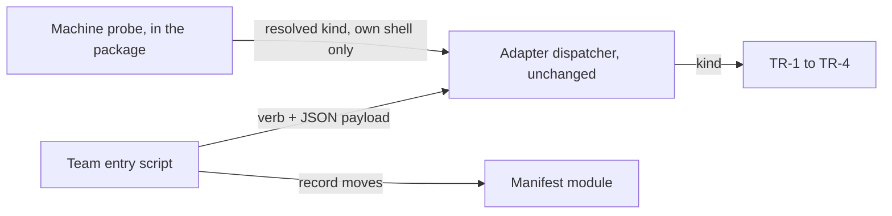

# ADR-0001 — The transport is a fifth adapter family; the rest of the feature is one package

> Status: Accepted
> Date: 2026-09-25
> Audited: 2026-09-17
> Layer: L2
> Context ticket: agent-team-topology

## Context

A team agent can run as a harness subagent, a headless run, a multiplexer pane or a desktop-tool terminal (PRD Catalog TR-1 to TR-4). Only this part of the feature changes with the machine. The manifest, the lifecycle, cleanup and the knowledge store do not (SDD §3, §8). The plugin already selects per-repository variation through four adapter families behind one kind-blind dispatcher, and the machine can differ from what the committed configuration says (S-55).

## Decision

The transport is a fifth adapter family with one kind per transport, the six verbs of SDD §3, and the house answer shapes (S-4, S-48, S-57). The existing dispatcher selects the kind and is not edited. A probe inside the feature's package resolves the best available kind and hands it to the dispatcher as if configured; a configuration key can force a kind (S-55, S-60). Everything else is a package inside the feature with one top-level entry script (S-48, S-52). The transport and the manifest never depend on each other (S-50).

Caption: the adapter boundary sits exactly where the variation is.

## Alternatives Considered

| Alternative | Pros | Cons | Reason rejected |
|-------------|------|------|-----------------|
| Fifth family, feature package for the rest (chosen) | Reuses the dispatcher, the contract shape and the registry checks; variation isolated | A new family touches the configuration reader, the schema table and three documents that count families | — |
| A package inside the skill that selects the kind itself | No change to shared configuration code | Reinvents kind selection the plugin already owns | Duplicates a mechanism four families already use (R-15, L7-1) |
| Put the probe in the shared dispatcher | One selection path for every family | Edits code four other families run through; a probe is new behaviour for all of them | Largest blast radius for one case (R-17, L9-1) |

## Consequences

- **Positive** — each transport is one kind with one written contract; a new transport is a new kind directory.
- **Negative** — the configuration reader, its schema table and the family counts in three documents change (SDD §14, C1 to C5).
- **Follow-ups** — the add-a-family instructions are written with this change (C5).
