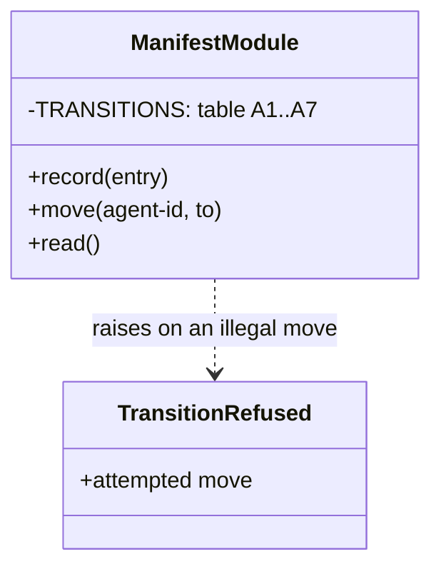

# ADR-0002 — The agent lifecycle is enforced by a declared transition table

> Status: Accepted
> Date: 2026-09-25
> Layer: L8
> Context ticket: agent-team-topology

## Context

The human signed the agent lifecycle with an allowed-next column (HL-4, SDD §6). The plugin enforces no state transition anywhere today: its status writer checks membership only and never reads the prior value (R-16 grounding). 5 of the 10 invariants in the signed packet are convention only.

## Decision

The manifest module declares the allowed-next table A1 to A7 and refuses a write that is not a legal move, naming the attempted move (S-26, S-54). It is the only state-transition enforcer in the plugin, and it applies to agent states only.

Caption: one table, one writer, one refusal.

## Alternatives Considered

| Alternative | Pros | Cons | Reason rejected |
|-------------|------|------|-----------------|
| Transition table enforced by the writer (chosen) | The signed table becomes executable; an illegal move fails loudly | A deliberate departure from house practice | — |
| Membership check only, as the plugin's status writer does | Consistent with house practice | The signed allowed-next column becomes advisory | The human signed the table, not a list of states (R-16, L8-1) |
| Validate transitions in review only | No code | Nothing catches a bad move at run time | The table exists to be enforced |

## Consequences

- **Positive** — invariant I3 has a built guardian; a skipped state shows as a named refusal.
- **Negative** — a new lifecycle state needs a table edit and a re-sign of HL-4.
- **Follow-ups** — none.
