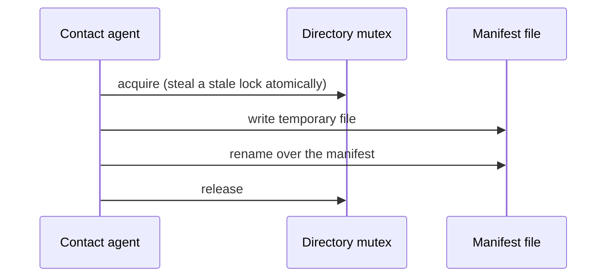

# ADR-0003 — One writer publishes the run manifest under a mutex, by write-then-rename

> Status: Accepted
> Date: 2026-09-25
> Audited: 2026-09-17
> Layer: L3
> Context ticket: agent-team-topology

## Context

The run manifest is the kill list: cleanup kills what it names (SDD §4, HL-1). A half-written file read at cleanup leaves processes alive. Several agents run at once and may need entries (SDD §7). The plugin already has a directory mutex with stale-lock theft and a temp-then-rename cache writer (S-10).

## Decision

Only the contact agent writes the manifest; an agent that needs an entry asks it (S-27). Every write takes a directory mutex and publishes by writing a temporary file and renaming it, so no reader sees a half-written kill list (S-10). The mechanism was the agent's call, accepted in round 2; the single writer was the human's (round 8, L5-3).

Caption: a reader sees the old file or the new one, never a partial one.

## Alternatives Considered

| Alternative | Pros | Cons | Reason rejected |
|-------------|------|------|-----------------|
| Single writer, mutex, write-then-rename (chosen) | Reuses two house patterns; no torn kill list | Agents route entry requests through the contact agent | — |
| Split writes: each agent appends its own background processes | Less traffic to the contact agent | Several writers on the file cleanup trusts | Rejected by the human in round 8 (L5-3) |
| One file per agent entry | No lock | Cleanup reads a directory whose listing can be partial | Moves the torn-read problem instead of removing it |

## Consequences

- **Positive** — invariants I2 and I10 hold; a killed writer leaves the old file intact.
- **Negative** — a slow writer makes others wait on the mutex.
- **Follow-ups** — none.
