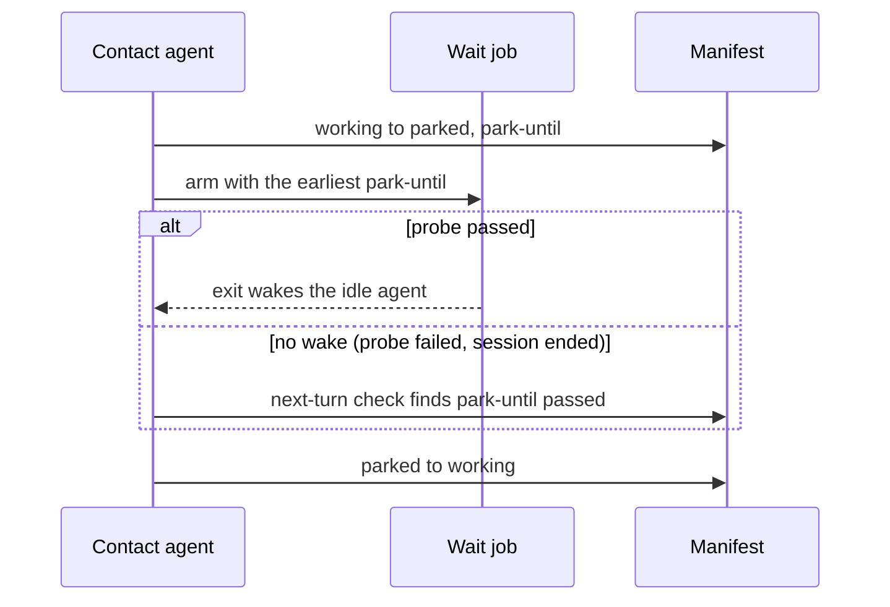

# ADR-0004 — A parked agent resumes on one wait job where a probe proves the wake, else on the next turn

> Status: Accepted
> Date: 2026-09-25
> Layer: L6
> Context ticket: agent-team-topology

## Context

An agent parks on a provider limit until a known time (SDD §6, state A3). Something must resume it. The plugin's only wake mechanism is a tracked background job's exit, stated in prose and declared by no capability row (INV-011). Live trials, once each on Windows 11: on Claude Code 2.1.282 a job's exit woke the idle top-level agent; on Codex CLI 0.157.0 it did not; at session end both harnesses killed the job's shell, so its completion was lost (SDD §9b).

## Decision

The park step disarms the parked agent's stall watchdog and arms one wait job that sleeps to the earliest park-until time in the run and exits once (S-105, S-106). The wait job takes its time as one command-line argument and reads no environment variable (S-128). The wake on its exit is a declared capability with one conformance probe per harness; where the probe fails, or the session ended, the contact agent's next-turn manifest check resumes the agent (S-94, S-105). The wait job is a process entry owned by the contact session; cleanup confirms its identity before a kill (S-117).

Caption: one exit where the harness delivers it, a turn-driven check everywhere else.

## Alternatives Considered

| Alternative | Pros | Cons | Reason rejected |
|-------------|------|------|-----------------|
| Wait job, per-harness probe, next-turn fallback (chosen) | Wakes where proven; correct everywhere | Two resume paths | — |
| Next-turn check only | One path | A parked agent waits for the human's next message even where the harness could wake it | Leaves a proven wake unused (R-31, WAKE-1) |
| A polling loop | Works without a harness wake | A second long-lived process; the design dropped the poller in round 11 | Reverses a settled decision (S-58 narrowed) |

## Consequences

- **Positive** — resume works on both harnesses; the trials change no signed decision (S-122).
- **Negative** — on Codex the resume waits for the next turn; a new capability row and a probe per harness.
- **Follow-ups** — the probe re-checks each harness version; a contact agent that is itself a subagent was not tried.
