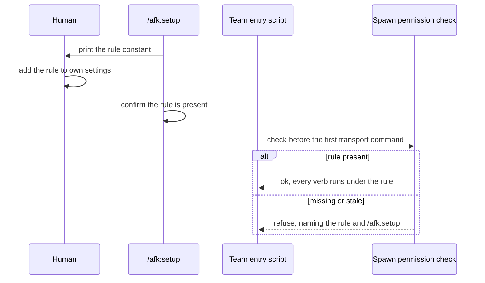

# ADR-0005 — Spawns under Claude Code auto mode rest on an allow rule the human grants

> Status: Accepted
> Date: 2026-09-28
> Audited: 2026-09-28
> Layer: L4
> Context ticket: agent-team-topology

## Context

Every team agent is started by the contact agent running a command (SDD §3). From Claude Code v2.1.283, auto mode is the built-in starting mode for interactive sessions, and in auto mode a classifier reviews each tool call (Claude Code documentation, permission modes). Trial T7 (2026-09-28, herdr): the classifier refused the contact agent's start command with the bypass flags and without them, and refused the agent's own edit adding an allow rule to its settings. The documentation states that an action matching an allow rule resolves before the classifier. Trial T7b: with a rule matching only the start, the start ran, but sending work to the started agent was refused. So as designed before this record, a team run cannot start an agent in the harness's default mode, and the agent cannot fix that by itself.

## Decision

The human adds one narrow allow rule to their own settings, once per machine. `/afk:setup` offers it: it prints the exact rule, waits for the human, and confirms the rule is present; it never writes a settings file (AUTO-1). The rule matches the team entry script's invocation, and all six transport verbs of §3 (agent-start, agent-send, agent-status, agent-read, agent-stop, agent-list) pass through that script, so one approved command covers them all (T7b). Its text lives in one constant that setup prints and the run check reads. Before a run's first transport command, the spawn permission check, called through the provider layer, confirms the rule; when it is missing or stale, the run refuses and names the rule (AUTO-2). The rule is granted knowingly and never exists to hide spawn flags from the classifier.

Caption: the human grants the permission once; every run proves it before it starts anything.

## Alternatives Considered

| Alternative | Pros | Cons | Reason rejected |
|-------------|------|------|-----------------|
| Human-granted rule, offered by setup, checked per run (chosen) | Documented to resolve before the classifier; the human decides; a missing rule fails before anything starts | One manual step per machine | — |
| The team skill's `allowed-tools` grant | Shipped by the plugin, no manual step | Lasts only for the invoking turn; whether it passes the classifier is not documented | Rejected by the human (AUTO-1) |
| Require the contact session in bypass mode | No rule needed | Every action of that session runs unchecked | Rejected by the human (AUTO-1) |
| An `autoMode` prose allow rule | Steers the classifier | The classifier still judges each spawn and can refuse it | Rejected by the human (AUTO-1) |

## Consequences

- **Positive** — a team run works in the harness's default mode, and the permission it relies on is one the human granted on purpose.
- **Negative** — one manual step per machine, repeated if a plugin update makes the rule stale.
- **Follow-ups** — headless starts, the desktop tool and a Codex contact agent were not tried under their harnesses' approval modes (SDD §13 Q11).
