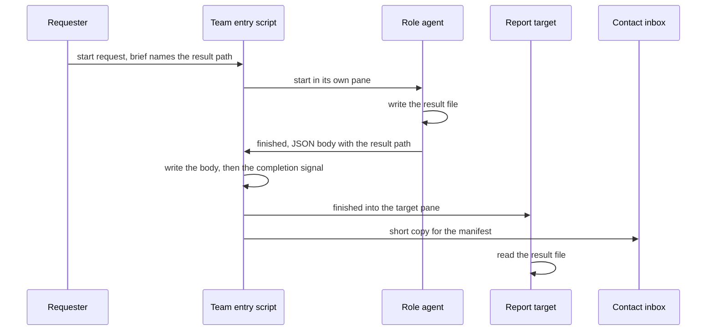

# ADR-0006 — A role agent writes its result to a file and sends finished with the path

> Status: Accepted
> Date: 2026-09-30
> Layer: L2
> Context ticket: agent-team-topology

## Context

Requirement ADR-0013 makes every role agent a pane agent: an agent in its own terminal pane (SDD §3, §8). Today every gate verdict travels as the spawn call's own result (INV-018). A pane agent has no return value, so its result needs another path. Role work means writing a plugin file, code or a ledger, or returning a gate verdict (S-190). S-208 settled a spawn-step list of 52 entries: 18 role spawns, 29 helper spawns, 3 lines with no spawn and 2 repeats. INV-030 finds that the list misses at least 17 spawn lines and 3 re-starts, so those counts do not hold (about 25 role and 39 helper entries, inferred); SDD §14 and §13 V19 carry the re-count.

## Decision

The requester picks the result path and writes it in the brief. A stage that already names a report location keeps it; otherwise the file goes in the run directory (S-173). The result files of review workers go in the run directory with no round tag, and only the review orchestrator writes findings files under plan/review/ (D-19, agent-decided). The started agent writes its result there, then sends finished. The finished body is one JSON object with a format version and the result path; the path is empty when the agent wrote no result file (S-231). The team entry script ignores the target the sender wrote and delivers finished to the report target the manifest and the pattern name, in the order body, completion signal, target pane, contact inbox (S-212, S-235). The report target reads the result file; the requester and the contact agent read it only when they are the target, and every other agent is denied, by convention (S-239). The stage whose brief names the file owns its format, so the findings JSON and the `REVIEW:`, `ADVERSARY:` and `OUTCOME:` lines keep their shapes (S-171); the `ADVERSARY:` line names the brief's report path (D-15, agent-decided). Role spawns start pane agents; helper spawns stay subagents (S-208). With no pane transport, or with the switch set to subagent, a role agent runs as a subagent: it returns its report text, and its starter writes the file before it cites any finding (S-157, S-209, D-15). Only 3 kinds of role child move their report writes this way: the adversary, each /afk:investigate run and each tracer; helpers keep writing their evidence files (D-13, agent-decided). An agent that ends without finished moves to lost, and the contact agent tells the requester, so no requester waits for ever (S-173).

Caption: the result travels as a file and the message carries only its path. The target is the pattern's, else the requester (S-212, S-235).

## Alternatives Considered

| Alternative | Pros | Cons | Reason rejected |
|-------------|------|------|-----------------|
| Result file, finished carries the path (chosen) | Every result shape stays; the target reads only what it is sent | One file per result; a lost finished message needs the completion signal | — |
| Contact relay: the contact agent reads each result and passes it on | No result path in any brief | Each result waits for a contact turn; the contact agent reads every result | Makes the contact agent carry every result (R-39, ROLE-2) |
| Gate workers stay subagents and return the spawn result | No change to the gates | Returning a gate verdict is role work, which must run in a pane agent | Contradicts requirement ADR-0013 and the helper limits (S-190) |

## Consequences

- **Positive** — every result shape stays; a target other than the contact agent gets its result without a contact turn; the fallback keeps today's subagent path.
- **Negative** — 3 kinds of report writers change under the fallback (S-209, D-13). A result file read by another agent cannot be detected; the reader rule holds by convention (S-223, S-239).
- **Follow-ups** — the executor names the files inside the run directory (S-182). SDD §14 lists each changed spawn step, and the plan re-counts them (SDD §13 V19).
