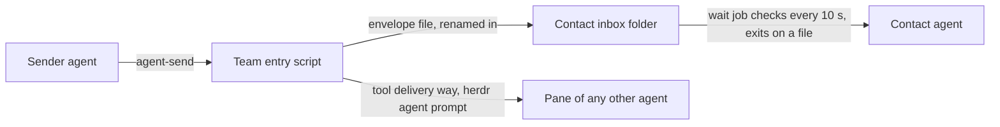

# ADR-0007 — The contact agent gets messages in an inbox; every other agent gets them in its pane

> Status: Accepted
> Date: 2026-09-30
> Layer: L2
> Context ticket: agent-team-topology

## Context

Every role now sends messages with agent-send (SDD §3). The human types into the contact agent's pane. Requirement AC-046 says no message changes unsent typed text. In trial T11 case D, herdr agent prompt merged a message with unsent typed text and submitted both. T11 delivered every other pane message, idle and busy, on Claude Code and Codex. In trial T12 a Claude Code contact agent woke on a background job's exit; a Codex contact agent did not.

## Decision

agent-send to the contact agent writes an envelope file into the contact agent's inbox (S-147). The inbox is a folder in the run directory, named by the role contact, so a new contact session reads the same inbox (S-172). The team entry script writes each envelope under a temporary name, then renames it (S-172). Only that script writes message files; the contact agent moves its handled envelopes to the processed folder, and cleanup deletes them all (S-239). The run's one wait job checks the inbox every 10 seconds and exits on a file, and the harness's job-exit notice wakes the contact agent (S-147, S-195, S-226). Only the contact agent has an inbox (S-215). Every other agent, a requester included, gets its messages in its pane through the tool's best delivery way; on herdr that way is agent prompt (S-148, S-189, S-214). A finished message goes into the report target's pane, and a short copy goes to the contact inbox. When the pane delivery fails, the script still writes the inbox copy and answers exit code 4, naming the target (S-235). A Codex contact agent has no job-exit wake: it takes messages at its next turn and says so at run start (S-166).

Caption: nothing is typed into the pane the human uses.

## Alternatives Considered

| Alternative | Pros | Cons | Reason rejected |
|-------------|------|------|-----------------|
| Inbox for the contact agent, pane for every other agent (chosen) | Keeps AC-046 for the human's pane; one delivery way per agent | One wait job per run; a Codex contact agent waits for its next turn | — |
| Pane for every agent, typed only when the input box is empty | No inbox and no wait job | Not verified that herdr can read whether the input box is empty; a race remains while the human types | Risks the human's unsent text (R-39, DLV-1) |
| Inbox for each requester too | Finished lands in a file | A Codex requester does not wake; one wait job per waiting requester | More processes and no wake on Codex (R-42, PATH-1; R-44, INBOX-1) |
| Inbox and pane for each requester | Two chances to see finished | Two delivery ways per requester; one wait job per waiting requester | Two ways where one serves (R-42, PATH-1) |

## Consequences

- **Positive** — the plugin never types into the human's pane; a requester needs no extra process.
- **Negative** — "nobody types in those panes" is a convention for every other agent (T11 case D). A Codex contact agent learns of a message only at its next turn (T12). A Claude Code contact agent learns of it up to 10 seconds after it lands (S-226).
- **Follow-ups** — probes of 2026-09-30: messages sent to a busy pane arrive in send order after the turn and its Stop gates end, and a blocked pane agent takes a relayed answer (providers/CONFORMANCE.md:327, :328). Not tried: a message to an agent waiting at a permission or dialog prompt (T11). A trial finds 1DevTool's delivery ways before its code is written (S-214).
