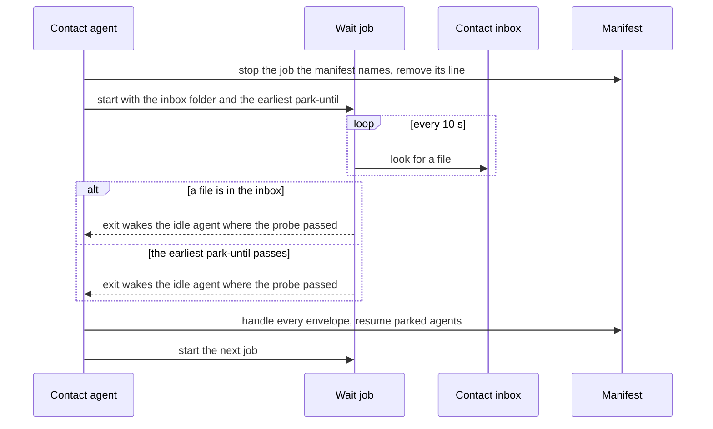

# ADR-0008 — One wait job per run checks the contact inbox every 10 seconds and ends on a file or the earliest park-until

> Status: Accepted
> Date: 2026-09-30
> Layer: L6
> Context ticket: agent-team-topology

## Context

ADR-0004 armed one wait job at park time. It slept to the earliest park-until time, exited once, and took that time as its one argument (S-128). It rejected a polling loop, and the signed rows said "no polling loop" (S-58, narrowed by S-105; HL-6 re-sign, S-114). The contact agent's inbox now needs a wake when a file lands (ADR-0007). Round 42 settled one job per run that ends at the first of 2 events: a file in the inbox, or the earliest park-until (S-195). A job that only sleeps cannot see a file land, so the two settled rules could not both hold. The harness wake on a job's exit worked on Claude Code and not on Codex (T12). This record supersedes ADR-0004 (R-46, R46-WAIT check; S-226). SDD §5, §6, §8.

## Decision

One wait job per run (S-195). It checks the contact agent's inbox every 10 seconds, and exits at the first file or at the earliest park-until time (S-226). It looks in the inbox before its first wait, so a file that landed before the job started is not missed (inferred, R46-WAIT card). With nothing parked it has no end time: it ends on a file or when cleanup stops it. The script takes 2 arguments, the inbox folder and an optional park-until time, and still reads no environment variable (R46-WAIT card, accepted as S-226; S-128). It waits the way the stall watchdog already waits.

The contact agent keeps the rule of one job, because only it writes the manifest. Before it starts a wait job, it stops the job the manifest names and removes that line: when an agent parks, after each job ends, and when it takes over a run. After a job ends, it handles every inbox message, then starts the next job (S-240).

Kept from ADR-0004: a per-harness probe declares the wake on the job's exit; where the probe fails, or the session ended, the next-turn manifest check takes over (S-94). Also kept: the park step disarms the stall watchdog (S-105, S-142), and the job is a process entry owned by the contact session, identity-checked before a kill (S-117, S-181).

Caption: one process, two exit causes, a wake up to 10 seconds after a file lands.

## Alternatives Considered

| Alternative | Pros | Cons | Reason rejected |
|-------------|------|------|-----------------|
| One job checks the inbox every 10 seconds (chosen) | Waits as the stall watchdog already waits; no new tool and no new right | Changes 2 signed rules: a loop, and 2 arguments; a wake up to 10 seconds late | — |
| The team entry script stops the wait job after it writes into the inbox | Keeps "no polling loop"; no delay | Not proven that a stopped job wakes the contact agent; every sender gains a right to stop a process the contact agent owns | The human chose check (R-46, R46-WAIT) |
| An operating-system tool reports new files in the inbox | Keeps "no polling loop"; no delay | Not proven in Git Bash on Windows; one new tool per operating system and one setup line | The human chose check (R-46, R46-WAIT) |
| Two wait jobs: one for park-until, one for the inbox | Each job has one cause | The rule becomes at most 2; a second script; cleanup kills 2 processes | Breaks the signed performance rule (R-42, WJ-1) |
| A job that only sleeps to the park-until time | Keeps S-128 as signed | Cannot see a file land | Does not meet S-195 (R46-WAIT card) |
| Next-turn check only | One path and no process | A parked agent or a message waits for the human's next message | Leaves a proven wake unused (R-31, WAKE-1) |

## Consequences

- **Positive** — one process per run serves the park and the inbox; cleanup kills one process; the wait uses a pattern the plugin already runs.
- **Negative** — the job checks the disk every 10 seconds for the whole run, and a wake comes up to 10 seconds after a file lands. The signed "no polling loop" and S-128's one argument are replaced (SDD §12).
- **Follow-ups** — no probe covers the contact's wake on an inbox file; a Codex contact agent still waits for its next turn (SDD §13 Q4). ADR-0004's status line should read "Superseded by ADR-0008"; that edit is the human's (SDD §13 Q27).
