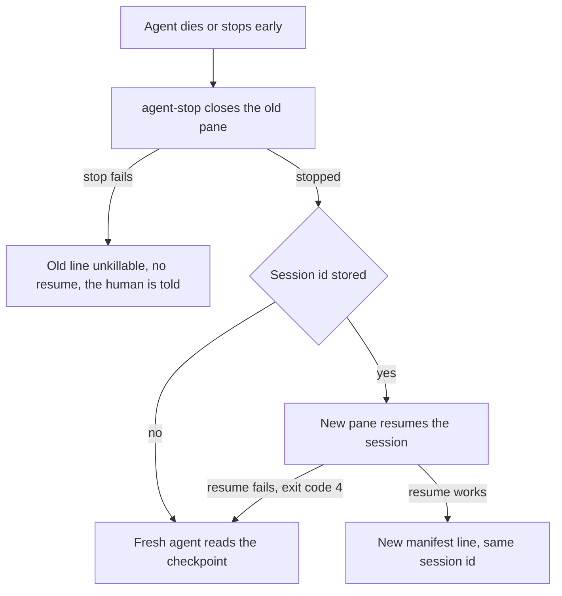

# ADR-0009 — A dead or stopped agent resumes its harness session before a fresh agent reads the checkpoint

> Status: Accepted
> Date: 2026-09-30
> Layer: L6
> Context ticket: agent-team-topology

## Context

A replacement agent read the role's checkpoint, the progress file the role saves (SDD §6; AC-024). On 2026-09-29 the human noted that Claude Code and Codex both resume a session, and asked to resume by default before relying on checkpoints (S-193). AC-055 states the resume-first rule, and AC-056 the stop before a resume. `herdr pane get` returns the session id of a Claude Code pane agent (grounded 2026-09-29). Probe 2026-09-30 (providers/CONFORMANCE.md:328): on both harnesses a session resumed in a new pane kept its context; on Codex the resume worked only when typed with herdr pane run, and herdr agent start with a resume argument left no pane. Not tried: how Codex sets a session id at start, and resume after a kill in the middle of a turn.

## Decision

agent-start's answer carries the harness session id, and the team entry script writes it into the agent's manifest line in the same call, under the manifest lock (S-213, S-233). The field is text and may be empty; the script does not write an id the tool reports after the call ends, so a later recovery starts a fresh agent (S-219, S-233). When an agent dies or stops early, the contact agent first stops the old agent with agent-stop, which closes its pane, and moves the old line to cleaned; when that stop fails, it moves the line to unkillable, does not resume, and tells the human (S-242). It then starts a new pane that resumes the session. Each resume is a new manifest line with the same session id (S-213). A failed resume gets exit code 4 naming the resume, and its line moves to lost (S-233). When the resume fails, or the id is empty, the contact agent starts a fresh agent that reads the checkpoint (S-213, S-219).

Caption: the checkpoint is the fallback, not the first path, and a resume never runs beside the old agent.

## Alternatives Considered

| Alternative | Pros | Cons | Reason rejected |
|-------------|------|------|-----------------|
| Resume the session first, checkpoint second (chosen) | The replacement keeps the dead agent's context | One stored field and one start input; trials owed | — |
| Checkpoint only | One recovery path and no session id | Every replacement rebuilds its context from saved progress | The human asked to resume by default (S-193; R-43, RESUME-1) |

## Consequences

- **Positive** — a replacement loses less work; one session id links every line of one agent; no 2 agents run one session at once.
- **Negative** — the manifest entry gains a field, the start answer gains 4 values, and a resume waits for the old agent's stop.
- **Follow-ups** — before the design binds, a trial checks how Codex sets a session id at start, and whether a session killed in the middle of a turn resumes cleanly (S-213; SDD §13 Q21). The herdr recipe records the Codex resume trap (providers/CONFORMANCE.md:328).
