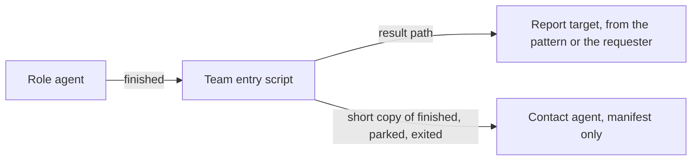

# ADR-0010 — The pattern names each role's report target; the contact agent gets a short copy

> Status: Accepted
> Date: 2026-09-30
> Layer: L6
> Context ticket: agent-team-topology

## Context

Requirement AC-035 said every role reports to the contact agent. The human noted on 2026-09-29 that asking is not talking: a contact agent may start an orchestrator, planners and reviewers that talk to the orchestrator, not to the contact agent (S-187). The contact agent is still the only manifest writer, so it must learn every lifecycle move (SDD §6). The PRD now carries the rule (AC-048, AC-049).

## Decision

The pattern names the report target of each role, a field of the role in the pattern record; when it is empty, the target is the agent that asked (S-212, S-228). The team entry script, not the agent, sends finished to that target. It ignores the target field the sender wrote and uses the target the manifest and the pattern name, so an agent cannot send it elsewhere (S-223, S-235). The contact agent gets a short copy of each finished, parked and exited message, for the manifest only (S-212, S-216). The report target reads the result file; the requester and the contact agent read it only when they are the target, and every other agent is denied, by convention (S-239).

Caption: the result goes to one target; the contact agent sees only lifecycle moves.

## Alternatives Considered

| Alternative | Pros | Cons | Reason rejected |
|-------------|------|------|-----------------|
| The pattern names each target; default the requester (chosen) | Works for a team with an orchestrator; the contact agent reads only what it is sent | Changed requirement AC-035 | — |
| The requester is always the target | No field in the pattern | An orchestrator team works only when the orchestrator asked for every agent | Fails the team shape the human described (S-187; R-43, TALK-1) |
| Every role reports to the contact agent | One reader of every result | The contact agent reads every result, in the pane the human uses | Replaced by the human's choice (R-43, TALK-1) |

## Consequences

- **Positive** — the contact agent keeps every manifest move without reading results; teams with an orchestrator work.
- **Negative** — a result file read by another agent cannot be detected; the reader rule holds by convention (S-223, S-239).
- **Follow-ups** — whether a report target that is not the requester hears of a lost agent is a PRD open question (SDD §13 Q29).
