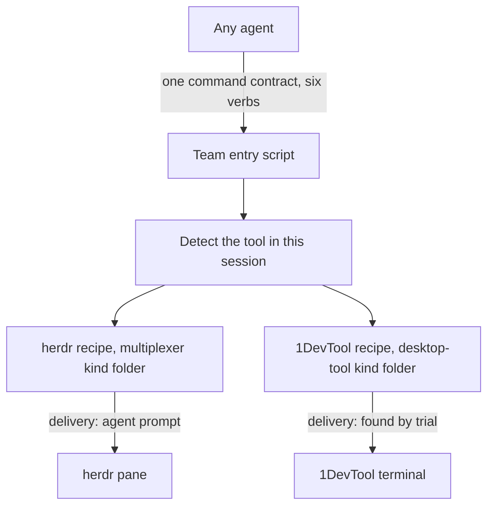

# ADR-0011 — One recipe file per multiplexer tool names its delivery way behind one command contract

> Status: Accepted
> Date: 2026-09-30
> Layer: L7
> Context ticket: agent-team-topology

## Context

On 2026-09-28 the human saw agents confuse herdr and 1DevTool. The team entry script already hides the tool from every agent (SDD §3, §8). herdr has one delivery way, agent prompt; 1DevTool's delivery ways are not known (S-214). The human asked for per-tool delivery where a tool can avoid the input box (S-196).

## Decision

Each tool gets one recipe file in its transport kind's folder (S-168). The recipe states how detection recognises the tool in this session, how each of the six verbs maps to the tool's commands, and the tool's known traps from its trial log (S-168). The pane close runs inside agent-stop, so the contract keeps six verbs (S-234). Agents call only the team entry script. Its error output and the pane-agent rule point at the recipe for the tool in use (S-168). The command contract is the same for every tool. Each recipe names the tool's best delivery way, and the tool's code uses it; a tool that can deliver without touching the input box uses that way, also for the contact agent (S-214). Tabs follow the same recipe; a tool that cannot make tabs uses panes and says so at run start (S-211).

Caption: one contract for callers, one recipe per tool behind it. 1DevTool in the desktop-tool kind is inferred from the PRD transport catalog.

## Alternatives Considered

| Alternative | Pros | Cons | Reason rejected |
|-------------|------|------|-----------------|
| One recipe per tool, in its kind folder (chosen) | No context cost until a verb fails; the recipe sits with the code it describes | Each new tool needs a folder and a recipe | — |
| A multiplexer skill that teaches every agent each tool | Agents know the tools up front | One skill description in every session; a second home for each tool's commands | Two homes for one fact (R-40, MUX-1) |
| One delivery way for every tool | One code path | A tool able to skip the input box would not use that way | The human asked for per-tool delivery (S-196; R-43, MUX-2) |

## Consequences

- **Positive** — one home per tool; no agent calls a tool directly.
- **Negative** — each new tool costs a recipe and a trial.
- **Follow-ups** — a trial finds 1DevTool's delivery ways and tab support before its code is written (S-214). The herdr recipe records the Codex resume trap: herdr agent start with a resume argument left no pane, and herdr pane run worked (providers/CONFORMANCE.md:328).
