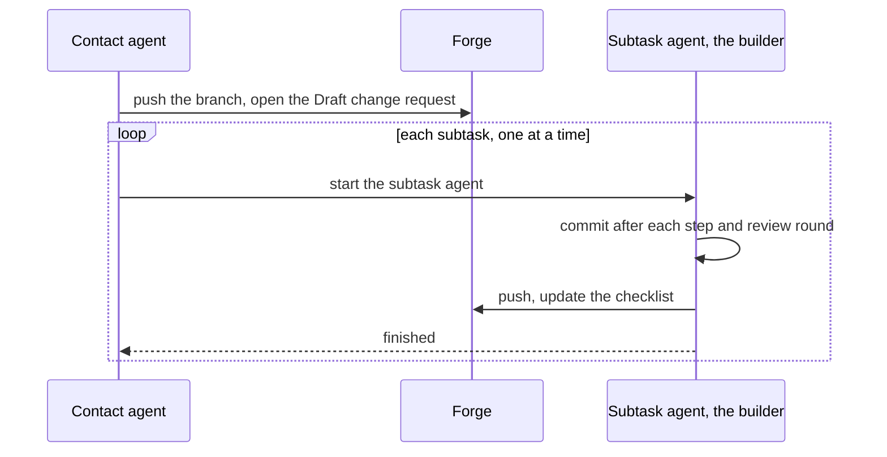

# ADR-0012 — Under /afk:autopilot the subtask agent is the builder, and the contact agent opens the Draft change request

> Status: Accepted
> Date: 2026-09-30
> Layer: L4
> Context ticket: agent-team-topology

## Context

Round 40 made the /afk:autopilot subtask agent a pane role agent that keeps writing its changes (S-208, S-209). The signed access rows let only the human, the contact agent and the builder commit and push, and only the human and the contact agent open a change request (S-135, S-197, AC-010, requirement ADR-0010; SDD §5). The subtask agent runs /afk:execute, which commits and pushes after each step and each review round, opens a Draft change request when none exists, and updates the checklist block in it (execute/SKILL.md:17, :30, :61, :80). So the signed rows and /afk:execute disagreed. /afk:autopilot runs 1 subtask at a time, so at most 1 subtask agent works at a time (autopilot/SKILL.md:10, :42). SDD §5, §6 I9.

## Decision

The subtask agent is the builder. It commits, pushes and updates the change request's checklist. The contact agent pushes the feature branch, then opens the Draft change request, before the first subtask starts (S-227, S-243; agent-decided, `GRILL-LOG.md` row "Agent-decided, 2026-10-05", design-audit open points, L20). /afk:execute needs no change: it looks for an open change request on the branch and creates one only when none exists (S-243). The one-active-builder rule of I9 holds, because only 1 subtask agent runs at a time. The right holds by convention, as every access row does: the brief grants it and no program checks it (S-135, requirement ADR-0016).

Caption: one builder at a time commits; opening the change request stays with the contact agent.

## Alternatives Considered

| Alternative | Pros | Cons | Reason rejected |
|-------------|------|------|-----------------|
| The subtask agent is the builder; the contact agent opens the Draft change request (chosen) | Adds 1 right, the checklist update; opening stays with the human and the contact agent; no change to /afk:execute | The contact agent opens 1 change request per run | — |
| The subtask agent is the builder and also opens the Draft change request | No work for the contact agent | Adds 2 rights; a role agent opens a change request | The human chose builder (R-46, R46-AUTO) |
| The subtask agent leaves its changes uncommitted; the contact agent commits, pushes and opens the change request after each subtask | No signed right changes | Large change to /afk:execute, which stops committing after each step and review round | The human chose builder (R-46, R46-AUTO) |

## Consequences

- **Positive** — /afk:execute runs unchanged under /afk:autopilot; the signed rule that only the human and the contact agent open a change request stands.
- **Negative** — one access row gains a right, the builder's checklist update; it holds by convention, so nothing refuses a wrong agent's commit at runtime (SDD §5).
- **Follow-ups** — the change request's opener recovers a failed create at its next turn, and the human closes a wrong one by hand (S-243, SDD §7 E5).
