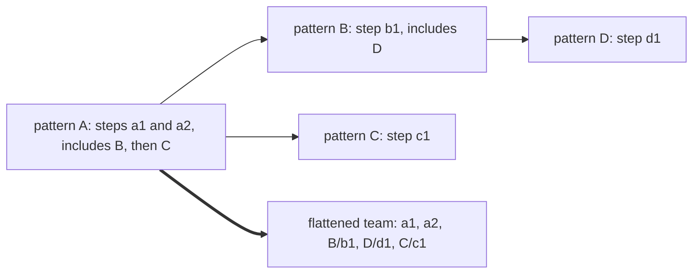

# ADR-0013 — A combined pattern places each included pattern's steps after its own steps

> Status: Decided by agent
> Date: 2026-10-05
> Audited: not yet
> Layer: L3
> Context ticket: agent-team-topology

## Context

Patterns combine (AC-033, requirement ADR-0012). The settled pattern record puts includes on the pattern, and a step lists only the roles it starts (S-228). The resolver follows includes by name and flattens the combination into one team before any start (S-143, S-229). No settled row said where an included pattern's steps and roles sit among the includer's steps. The resolver could not be built without that answer (SDD §13 Q28). SDD §4 (includes, flattened team), §6 I6, §8 Pattern resolver.

## Decision

The resolver appends each included pattern's steps after the includer's own steps, in the order of the includes list, depth first. An included step keeps its name behind its pattern's name and a slash, in the form pattern-name/step-name. Roles merge by name. The same role name with a different definition in 2 combined patterns is refused at resolve time, with exit code 2. The agent decided this under the human's delegation of 2026-09-30 (`GRILL-LOG.md` row "Agent-decided, 2026-10-05", Q28).

Caption: depth first, so D's step comes before C's; only included steps carry their pattern's name.

## Alternatives Considered

| Alternative | Pros | Cons | Reason rejected |
|-------------|------|------|-----------------|
| Append the included steps after the includer's own steps, depth first (chosen) | One fixed order for every combination; includes stay on the pattern (S-228); the team is flat before any start (S-143, S-229) | An included pattern never runs before or between the includer's own steps | — |
| A step-level field that names another pattern | The author places each include at a chosen step | A step names more than the roles it starts | S-228 rules it out: a step lists only the roles it starts |

## Consequences

- **Positive** — the pattern record needs no new field; a start request names an included step with no doubt about which pattern owns it.
- **Negative** — a pattern author who needs another pattern's steps first must make that pattern the includer (inferred). 2 patterns that define one role name differently cannot combine.
- **Follow-ups** — the cases the rule leaves unstated: patterns combined by a stage map list or the human's pick, a pattern reached twice, and step names that hold a slash or start with solo: (SDD §13 Q35). PRD AC-033 now words this rule (PRD.md:133); requirement ADR-0020 corrects ADR-0012.
