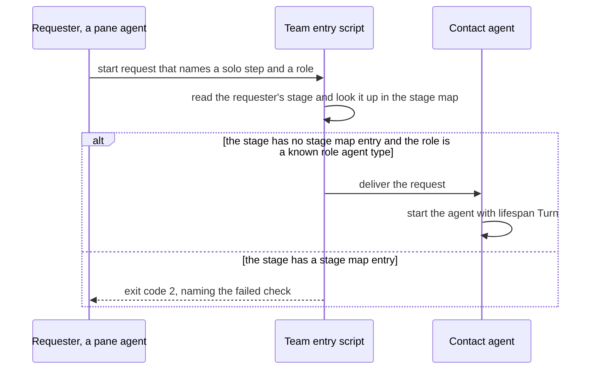

# ADR-0014 — A start request in a stage with no stage map entry names the step solo: followed by the role

> Status: Decided by agent
> Date: 2026-10-05
> Audited: not yet
> Layer: L2
> Context ticket: agent-team-topology

## Context

A stage with no stage map entry runs as today: each role spawn is an implicit single-role step with lifespan Turn that reports to its requester (S-230; D-09, agent-decided). A pane agent in such a stage still sends start requests (S-153). A start request must name a pattern step (S-220), and the check refuses a step or a role outside the resolved pattern (AC-042, S-187). No settled row said how a request names an implicit step, so every role spawn on that path would be refused (SDD §13 Q33). SDD §3 (Validation: start-request), §4 (pattern step), §8 Team entry script.

## Decision

A start request from a stage with no stage map entry names the step solo: followed by the role. The start-request check accepts a solo: step only when the requester's stage has no stage map entry and the role is a known role agent type. It refuses a solo: step from a stage that has a stage map entry, with exit code 2. The check reads the requester's stage from its manifest entry (inferred). The agent decided this under the human's delegation of 2026-09-30 (`GRILL-LOG.md` row "Agent-decided, 2026-10-05", Q33).

Caption: one check serves stages with and without a stage map entry; the step name is never empty.

## Alternatives Considered

| Alternative | Pros | Cons | Reason rejected |
|-------------|------|------|-----------------|
| solo: followed by the role, accepted only in a stage with no stage map entry (chosen) | The pattern step stays mandatory (S-220); the check stays strict (AC-042, S-187); each role spawn on the default path gets a name | A step-name prefix is reserved by convention; no file lists the known role agent types (SDD §13 Q36) | — |
| A built-in catch-all pattern that holds every role | No new step-name form | Every role is valid in every stage with no entry | It hides a wrong role |

## Consequences

- **Positive** — every role spawn names a step, so the start-request check has one shape for every stage.
- **Negative** — A pattern's own step whose name starts with solo: can never be requested (SDD §13 Q35).
- **Follow-ups** — list the known role agent types (SDD §13 Q36). PRD AC-042 now words the solo: exception (PRD.md:142).
