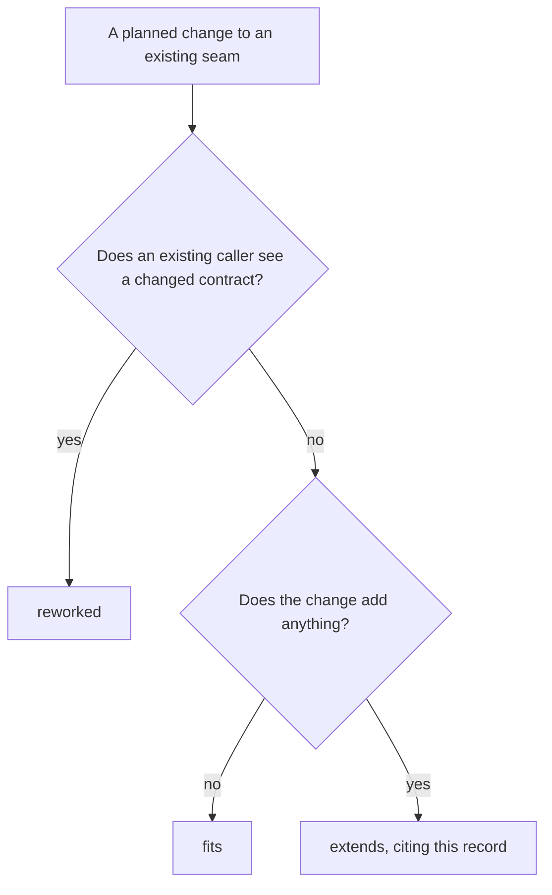

# ADR-0015 — A change that only adds keeps the existing contract

> Status: Decided by agent
> Date: 2026-10-05
> Audited: not yet
> Layer: L9
> Context ticket: agent-team-topology

## Context

SDD §14 gives each changed seam a verdict: fits, extends (ADR-NNNN) or reworked (skills/afk/to-sdd/SDD-TEMPLATE.md:224). The human settled what the 2 change verdicts mean: reworked when an existing caller sees a changed contract, extends when the existing contract holds and only gains (S-199). Extends was signed before round 45 for the 9 changes of C1 to C19 that only add, whose posture and rollback S-246 gives; settled for 3 changes the human added to an earlier decision on documentation changes (S-204 to S-206); and signed for the /afk:bug fixer's design stop (packet HL6-8, R-41). No ADR held these verdicts, so 13 §14 rows named none. Three more extends rows rest on requirement ADR-0013 (S-199) and keep it.

## Decision

A change takes extends when every existing caller keeps the contract it has today and the change only adds: a key, a row, a field, a line, a step or a count (S-199). Its §14 row states what an older reader and a session with no team see, and how the change rolls back: revert the commit or install the previous plugin version, after the first step S-246 names for a change that needs one (S-246). The 13 rows cite this record as extends (design ADR-0015). Three later rows cite it too: the row of audit round 14 and the rows for the SessionStart hook and the built-in pattern records (charter C3 and C6); all three are agent-decided. The agent decided this under the human's delegation of 2026-09-30 (`GRILL-LOG.md` row "Agent-decided, 2026-10-05", design-audit open points, L31).

Caption: the verdict follows from what an existing caller sees; this record covers the extends branch.

## Alternatives Considered

| Alternative | Pros | Cons | Reason rejected |
|-------------|------|------|-----------------|
| One design ADR for every change that only adds (chosen) | One rule for 13 rows; a reviewer checks each row against it | One record covers unrelated changes | — |
| Name an existing ADR in each row | No new record | S-204 to S-206 add to an earlier decision on documentation changes and name no ADR (GRILL-LOG.md S-204 to S-206) | No record exists to name |
| Keep the bare verdict, as the signed packets have it | No edit to signed rows | The template's form is extends (ADR-NNNN) (SDD-TEMPLATE.md:224) | The template binds the SDD |

## Consequences

- **Positive** — every extends row names its record, and a row whose change later alters what a caller sees fails this record's test and becomes reworked.
- **Negative** — one record covers 13 unrelated changes, so an audit of it reads each row.
- **Follow-ups** — none; this record was written into adr/design/ with 0006 to 0014 and 0016 when the SDD landed, 2026-10-07 (SDD §13 Q27).
