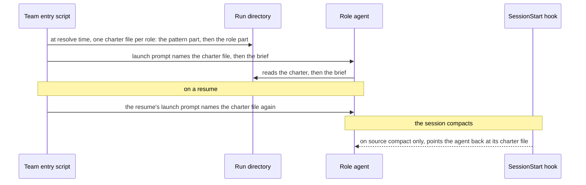

# ADR-0016 — Each role's charter reaches its agent as a file the launch prompt names before the brief

> Status: Decided by agent
> Date: 2026-10-06
> Audited: not yet
> Layer: L2
> Context ticket: agent-team-topology

## Context

The human asked on 2026-10-06 that each team pattern carry something like a system prompt that defines each role, its responsibility, how it communicates and how it is expected to behave, and that agents be clear about reporting progress up, down and to siblings (`GRILL-LOG.md` row "Human direction, 2026-10-06"). The agent answered with a charter on every pattern record: a pattern part and one part per role (`GRILL-LOG.md` row "Agent-decided, 2026-10-06", the pattern charter, C1). That leaves how the charter reaches each started agent. The constraints are:

- Every duty comes in the launch prompt, and a later message carries data, never a new duty (S-150, I14). A Claude agent refused a duty that came as a later pasted prompt (trial T11).
- The brief carries the task and never the human's conversation (R-4, ACC3).
- A harness session resumes or compacts, and the agent may lose its launch text at a compaction. The plugin's SessionStart hook fires in a pane agent at resume and compaction on Claude Code, and at resume on Codex, where the probe saw none at compaction with no trusted printing hook in place (providers/CONFORMANCE.md:320; INV-033).
- No probe in this repository shows that either harness's system-prompt flag works in a pane agent.

- A resume launches a new pane that resumes the session (S-213), so its launch prompt can name the charter file again.
- No live probe settles whether Codex runs an untrusted plugin handler or sends source in a live SessionStart envelope (INV-046 c-29fb0959, c-12e2864e), whether the launch-only value reaches a SessionStart hook process (INV-046 c-0cb4838f), or whether a session started from a pane agent's shell inherits it and prints the parent's pointer after its own compaction (INV-046 c-4e7ed5f7, c-f7efbcba); settling the Codex part needs a new Codex hook trust entry, which is the human's to grant.

SDD §3 (agent-start changes, 'Charter in the launch prompt'), §4 (pattern record, charter file), §8 (Team entry script, SessionStart hook), §13 V27 and Q54.

## Decision

At resolve time the team entry script writes one charter file per role into the run directory, holding the pattern part and that role's part. agent-start's launch prompt names the role's charter file before the brief, so the charter is the agent's standing instruction and the brief its task. A resume's launch names the charter file before its prompt, as a first start does, so no hook carries a resume. After a compaction, the plugin's SessionStart handler prints the charter pointer only when the envelope's source is compact and the launch-only value is set, and is silent otherwise; the probe saw no Codex SessionStart at compaction, so a Codex pane agent is taken as not re-pointed after one, an accepted gap; what a trusted Codex handler does at compaction is unproven (§13 V27). A provider may also pass the charter as a native system prompt, but only where a build-time probe proves the flag (§13 V27). The agent decided this under the human's delegation of 2026-09-30 (`GRILL-LOG.md` row "Agent-decided, 2026-10-06", the pattern charter, C2; C3 as replaced by the row "Agent-decided, 2026-10-06", charter C3 replaced, C3').

Caption: the charter is one file per role, read at the start and named again on a resume and pointed at again after a compaction; the brief stays the task.

## Alternatives Considered

| Alternative | Pros | Cons | Reason rejected |
|-------------|------|------|-----------------|
| A charter file that the launch prompt names before the brief (chosen) | Holds on every harness that reads a file; keeps the charter's duties in the launch prompt (S-150); written once per role, not once per agent; the brief stays the task (R-4, ACC3) | The agent may lose the charter at a compaction unless the hook points it back, and the probe saw no Codex SessionStart at compaction, an accepted gap (V27) | — |
| A native system-prompt flag for each started agent | The harness keeps the text across a compaction | No probe here proves the flag in a pane agent on either harness; a flag differs per harness and per version, so it would bind the design to an unproven premise | Taken only as an extra, per provider, where a probe proves it (charter C3') |
| The charter quoted into each brief | One file per agent; nothing new to write or clean up | Each brief repeats the charter, so a fix to one role's part has to reach every brief; the brief mixes the standing rules with the task; a compaction loses it as it would lose the launch text | It duplicates the charter in every brief and gives no re-point after a compaction |

## Consequences

- **Positive** — every agent of a pattern gets its role's rules and the pattern standard (§9) in one place, before its task, gets them again on a resume, and is pointed back at them after a compaction where the hook runs.
- **Negative** — on Codex, the probe saw no SessionStart at a compaction, so the agent is taken as not pointed back after one, an accepted gap (V27). An agent with no pattern, such as one started for a solo: step, gets no charter file (§13 Q54).
- **Follow-ups** — §13 V27 proves the compaction pointer on Claude Code, the handler's silence on Codex, and any system-prompt flag per provider. §13 Q54 holds the cases the charter row leaves unstated.
