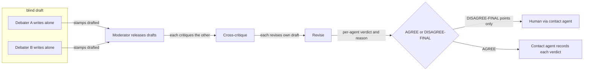
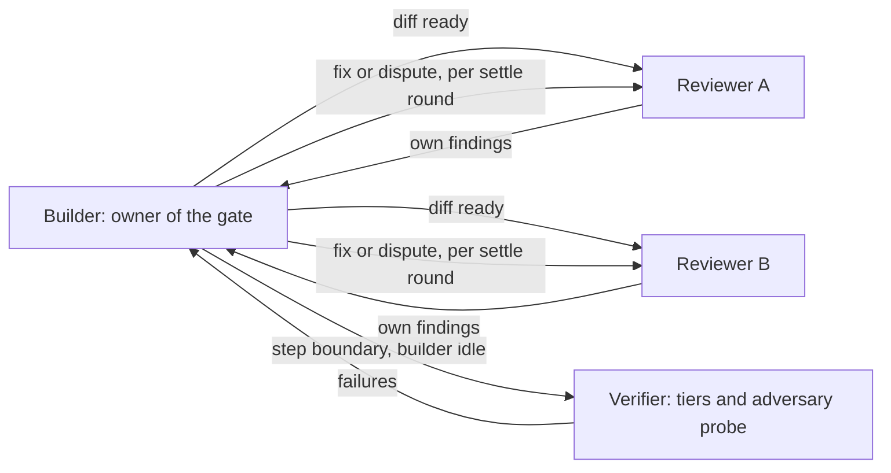
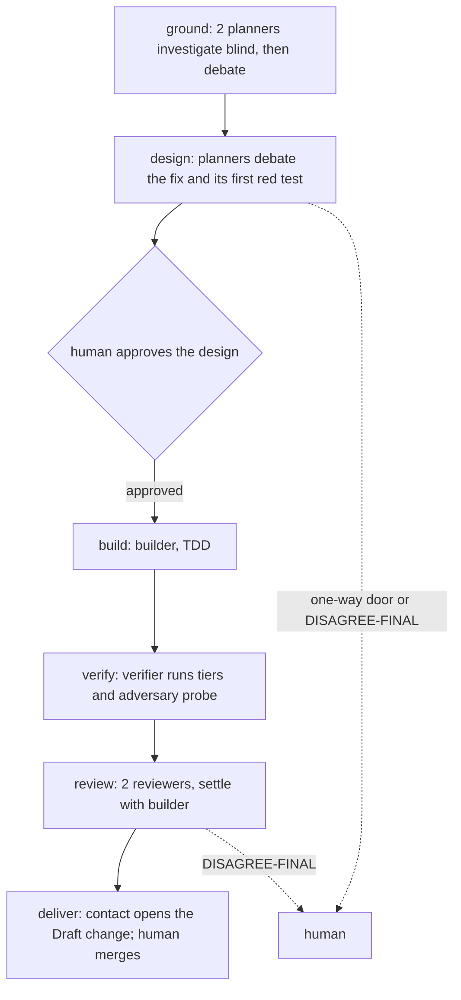

# Built-in team patterns and the pattern schema — proposal

> Status: REVISED 2026-09-28 after the human's requirements rounds R-13 and R-14 (GRILL-LOG.md, requirements grill, the PT- rows) and the two-reviewer design review (rounds R8 and R9, 13 agreed findings). The product decisions are settled; the field names and the resolver detail below are a proposal the design document takes in. Closes review finding sol-06 (no pattern schema, no built-in list).

## Constraints this proposal keeps

| Constraint | Source |
|---|---|
| A pattern is data: roles, model per role, lifespan per role, talk edges; a user-written pattern has the same power as a built-in one | GRILL-LOG.md:52 (R-3, PAT2) |
| A pattern is a reusable team shape and knows nothing of the workflow. Its description says how and when it is useful; the contact agent reads the descriptions and proposes patterns, possibly several combined | R-13 PT-D5, R-14 PT-GUIDE |
| The plugin ships no stage map. The human's own configuration may map a stage to a pattern; with no entry, the contact agent proposes one | R-14 PT-MAP; GRILL-LOG.md:48 (P1) |
| One agent fills one role; a count expands into separate roles | R-13 PT-D4; S-33 |
| Research, grounding, design, planning, review and audit work runs a debate on 2 different resolved models or more. For the PRD, the design document and the plan, a blind two-reviewer audit of the contact agent's draft is that debate | GRILL-LOG.md:50, AC-006; R-13 PT-D2, PT-F2 |
| Debaters write blind, then critique; each agent keeps its own verdict (AGREE or DISAGREE-FINAL) and reason; nothing merges them into one verdict | GRILL-LOG.md:28, 45, AC-007; R-13 PT-F10 |
| A debate always has a moderator agent | R-13 PT-Q1; R-14 PT-NOCAP |
| A debater stamps a record per debate step; the same agents stay for the whole debate | R-13 PT-D3 |
| Agents message each other directly along declared talk edges; everything not declared is denied; the report to the contact agent is one edge | GRILL-LOG.md:44 (B1); R-13 PT-TALK, PT-F1 |
| A role other than the contact agent may be a hub; only the contact agent starts and stops agents | GRILL-LOG.md:61, 74 |
| No nested teams; composition flattens into one team before any agent starts | GRILL-LOG.md:86, issue 25; R-14 PT-COMP |
| One worktree, one feature branch; only the builder commits, and each commit names its role; one builder writes at a time | AC-008; R-13 PT-D1, PT-F9 |
| The existing skills own their gates; pattern roles are the workers those skills call | R-13 PT-D6 |
| Each role owns an output path under the run directory, checked before start | GRILL-LOG.md:72 (AUD4); R-13 PT-F5 |
| No caps and no reserve: no agent, message or spend limit; nothing estimated or checked | AC-020; R-13 PT-D9, R-14 PT-NOCAP |
| A one-off pattern is never written to configuration; the run keeps one resolved copy in its run directory, deleted at cleanup | GRILL-LOG.md:64 (ACC4, changed); R-13 PT-D8 |
| Fan-out to harness subagents is not a pattern | GRILL-LOG.md:32, 49 |

## 1. The pattern schema (version 1)

One record per pattern. The same record is a shipped pattern, a saved user pattern, or a one-off.

```yaml
pattern: afk-lite                # kebab-case name, unique among shipped and saved patterns
version: 1                       # the record's own version (R-14 PT-F8R)
schema: 1                        # the schema version
description: >                   # how and when the pattern is useful; the contact agent reads it
  A bug fix or a small enhancement, end to end ...
extends: null                    # optional: one shipped or saved pattern; one level only

roles:
  planner:
    kind: planner                # hub | moderator | planner | builder | reviewer | verifier
    count: 2                     # expands to planner-1, planner-2: one agent per role (R-13 PT-D4)
    models: [tier:frontier@claude, tier:frontier@codex]   # one per expanded role
    lifespan: step               # turn | step | feature
    alive-in: [ground, design]
    output: planner/{role}/      # {role} is the expanded role id
    on-provider-failure: wait    # wait | substitute; debating roles must wait (AC-022)
  verifier:
    kind: verifier
    debate: 2                    # this role runs as a debate on 2 different models (R-14 PT-COMP)
    ...

needs: [worker-to-contact, worker-to-worker, exit-signal, limit-signal]   # transport abilities (R-13 PT-F1)

edges:                           # everything not listed is denied (R-13 PT-F1)
  - {from: planner, to: orchestrator, types: [draft-ready, verdict], after: null}
  - {from: orchestrator, to: planner, types: [request], after: null}
  - {from: '*', to: contact, types: [report]}          # the report edge, written out

steps:                           # ordered; renamed from "phase" (R-13 PT-F3)
  - id: ground
    roles: [planner]
    protocol: debate             # solo | debate | build | settle | uses:<pattern>
    done-when: Every claim the fix rests on has an INV id or a gap the human acknowledged.
    stop-for-human: disagree-final   # never | disagree-final | always

debate:                          # defaults for every debate step
  debate-steps: [blind-draft, cross-critique, revise, verdict]
  rounds-max: 3
  verdicts: [AGREE, DISAGREE-FINAL]
```

There is no `budget` field (R-13 PT-D9).

### Resolver rules (refuse at start, naming the field — AC-005)

1. **Flatten first** (R-14 PT-COMP). Expand `count` into separate roles. Expand a role's `debate: N` into N roles on different models plus a debate step with a moderator. Expand a step's `uses: <pattern>` into that pattern's roles and steps, with role ids prefixed by the step id. Refuse a pattern that includes itself, directly or through others. The result is one plain team: one manifest, one set of talk edges, one cleanup.
2. Every role in `edges` and `steps` exists; every role is alive in at least one step.
3. A debate step has 2 roles or more whose resolved model identifiers differ; a declaration alone does not pass (R-13 PT-F2). Its roles use `on-provider-failure: wait`.
4. A debate step has a moderator: the pattern's hub when it has one, else the resolver adds a moderator role.
5. The kind of work comes from the stage or task the contact agent runs, from a fixed stage-to-kind table the resolver owns, never from the pattern. A deep-work kind (AC-006) needs at least one debate step (R-13 PT-F2).
6. At most one `builder` role writes in any step. This is a collision rule; the branch rule is R-13 PT-D1 (R-13 PT-F9).
7. No role starts or stops agents.
8. Every step has a checkable `done-when`.
9. Every `output` resolves to one normalized relative path per role, inside the run directory. Refuse absolute paths, `..`, reserved files (the manifest, configuration, the plan, `.git`), two roles on one path, and one role's path inside another's (R-13 PT-F5).
10. Every model resolves through the model-tier map, else the role cannot be filled.
11. The transport meets every ability in `needs`, from its trial-backed record; else refuse before the first agent starts (R-13 PT-F1).
12. `extends` resolves to one pattern, one level deep; the child overrides by role id, step id and field.

### The debate record (R-13 PT-D3)

Each debater stamps `drafted`, `critiqued`, `revised` and `verdict`, each with a reason, in its own output path. The stamp, not the agent's exit, finishes a debate step. Peer drafts and critique messages are released only when every debater has stamped `drafted`. Each agent's verdict and reason are kept; no combined verdict or combined findings list exists (R-13 PT-F10).

## 2. Built-in patterns

Each pattern's description says how and when it helps. The stage names below come from walking the workflow; they inform the descriptions and bind nothing.

| Pattern | Agents started | Shape | Description says it helps with |
|---|---|---|---|
| `solo` | 0 | The contact agent does the work itself; nothing enters the manifest (R-13 PT-F4) | Mechanical work; synthesis of the human conversation |
| `debate` | 2-3 + moderator | Blind drafts, cross-critique, revise, per-agent verdict | Research, grounding, design options, scenario design, before any grill; audit of a written draft |
| `build-verify` | 4 | 1 builder, 2 reviewers on different models, 1 verifier | One unit of build work: TDD, verification tiers, review |
| `review-panel` | 2-3 + moderator | Reviewers review one finished change blind, cross-critique, per-agent verdicts | A review after a subtask, a final feature review, an audit of a PRD, design document or plan |
| `afk-lite` | 7 | Orchestrator hub, 2 planners, 1 builder, 1 verifier, 2 reviewers | A bug fix or small enhancement, end to end |

Composition examples (R-14 PT-COMP):

- **Write, then audit** (R-13 PT-D2): step 1 `solo` (the contact agent writes), step 2 `uses: review-panel`.
- **Debated verification** (the human's R-13 note): `build-verify` with `verifier: {debate: 2}`, so two verifiers on different models check the build independently.

### 2.1 `debate`



Caption: no debater sees another's work until every draft is stamped; only real disagreement reaches the human.

- Debaters: 2 by default (Claude and Codex frontier tiers), 3 allowed. One moderator agent runs the rounds.
- Edges: debater ↔ moderator. Debaters never message each other; they read each other's released drafts.
- `rounds-max: 3`; a point still split after round 3 is DISAGREE-FINAL.

### 2.2 `build-verify`

Runs inside the existing build gate (R-13 PT-D6). The builder is the gate's owner, running the subtask the way `/afk:execute` does. The reviewers fill that skill's review fan-out; the verifier is the fresh session its adversary step already requires. Only the review skill writes review files, and only the owner advances the settle loop and the status cell.



Caption: builder and reviewers talk in the settle loop's fix-or-dispute rounds; each reviewer's findings stay its own.

- Builder: 1, frontier or implementation tier.
- Reviewers: 2 on different models, each reviewing blind; they do not message each other, so no moderator is needed. The builder receives both lists with each reviewer's verdict (R-13 PT-F10). A pattern that wants the reviewers to debate uses `reviewer: {debate: 2}` instead.
- Verifier: 1, a model other than the builder's; runs only at a step boundary, while the builder is idle.
- The loop ends when a review round finds nothing actionable; the stalemate rule stays the review skill's.

### 2.3 `review-panel`

2 reviewers (3 allowed) on different models review one finished change blind, cross-critique, and report per-agent verdicts through a moderator. Inside `/afk:preflight` it fills the final review's workers; the gate stays preflight's (R-13 PT-D6).

### 2.4 `afk-lite` — bugs and small work, end to end

Run by `/afk:fix` (R-13 PT-D7). `/afk:bug` keeps its single fixer.



Caption: one planned human stop after design (R-13 PT-Q3); otherwise the human is asked only on a one-way door or a split debate.

| Role | Kind | Count | Lifespan | Alive in | Talks to |
|---|---|---|---|---|---|
| orchestrator | hub (moderates the debates) | 1, frontier | feature | all | every role |
| planner | planner | 2, different models | step | ground, design | orchestrator |
| builder | builder | 1 | step | build, review | orchestrator, verifier, reviewer |
| verifier | verifier | 1, model other than the builder's | step | verify | orchestrator, builder |
| reviewer | reviewer | 2, different models | step | review | orchestrator, builder |

Agents started: 7; with the contact agent, 8 (R-13 PT-F6). The orchestrator reads the planners' drafts only after they are stamped (R-13 PT-Q6).

| Step | Done when |
|---|---|
| ground | Every claim the fix rests on has an investigation id, or a gap the human acknowledged |
| design | Both planners give AGREE on the root cause, the fix, and the test that goes red first; the human approves the design |
| build | The red test goes green; every declared verification tier is green |
| verify | Tiers green on a clean run; the adversary probe finds no failing scenario |
| review | A review round finds nothing actionable |
| deliver | Draft change open with the checklist; the human merges |

## 3. Stage map

The plugin ships no map (R-14 PT-MAP). The human's configuration may name a pattern for a stage (S-32 to S-36); a stage with no entry runs as today (S-20), and at task start the contact agent may propose a pattern from the descriptions (P1).

## 4. One-off patterns

Three ways in; all pass the same resolver, and the contact agent shows the flattened team (agents and talk edges) before the human picks (GRILL-LOG.md:48). None is written to repository configuration. The run keeps one resolved copy in its run directory, ignored by git, for adoption after a crash and for the dashboard; cleanup deletes it (R-13 PT-D8).

1. **Derived** — `extends` plus overrides:

   ```yaml
   pattern: one-off
   extends: afk-lite
   roles:
     reviewer:
       count: 3
       models: [tier:frontier@claude, tier:frontier@codex, tier:frontier@gemini]   # hypothetical: only if the tier map names this provider
   ```

2. **Full record** — a complete version-1 record, pasted in the conversation or given as a file path.
3. **Proposed** — the contact agent drafts a one-off from the task, possibly combining several patterns, shows it, and runs it only after the human picks it.

Saving: the human copies the record into configuration; an agent never writes it.

## 5. Usage window

Nothing is capped, estimated or checked (R-13 PT-D9, AC-020). A team shares the human's usage window with the contact agent; the PRD states this in one sentence, and nothing enforces it (R-14 PT-NOCAP).

## 6. What this needs from the design

- A message path along the declared edges: default deny, message types per edge, the report edge to the contact agent, peer text delivered as data in a file behind a fixed envelope, and a before-start refusal when the transport lacks an ability in `needs` (review finding opus-25).
- The debate record and its release barrier as run records (R-13 PT-D3); reopens HL-1 and HL-4.
- The one-off resolved copy as a run record (R-13 PT-D8); reopens HL-1.
- The branch rule: one feature branch, builder-only commits naming the role (R-13 PT-D1); changes AC-010 and requirement ADR 0003.
- Gate delegation points in `/afk:execute`, `/afk:preflight` and `/afk:fix`, as new change-list rows under HL-6 (R-13 PT-D6, PT-D7).
- The pattern record, the resolver with its flattening, and the shipped patterns as data files: the "Pattern data and resolver" module (PRD Implementation Decisions).
