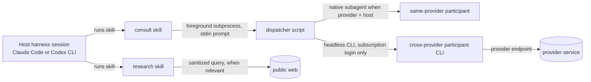
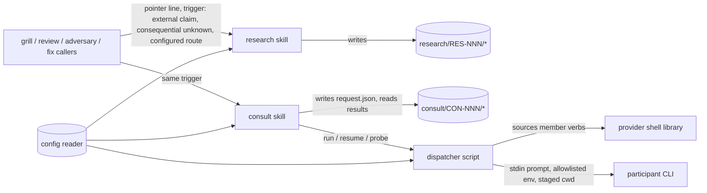
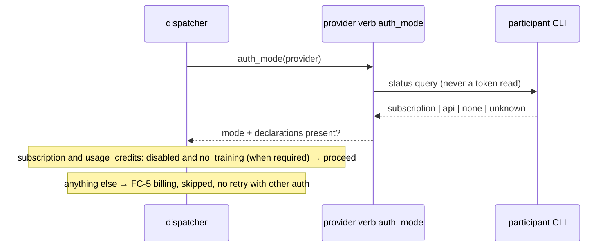
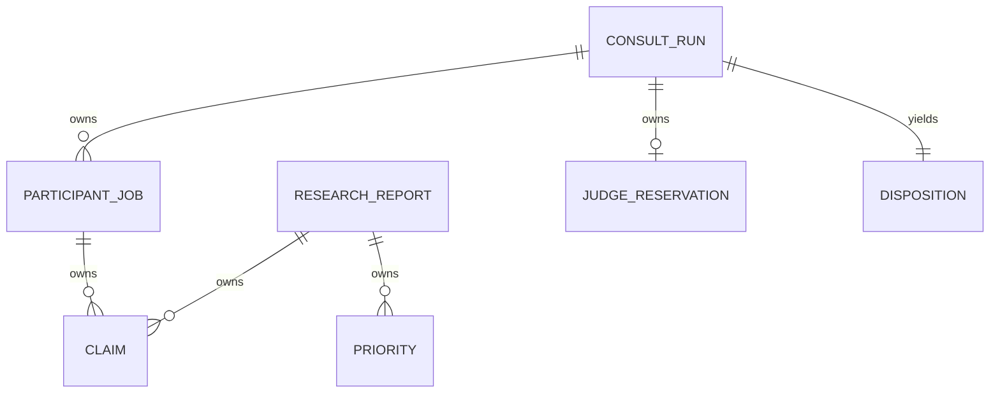
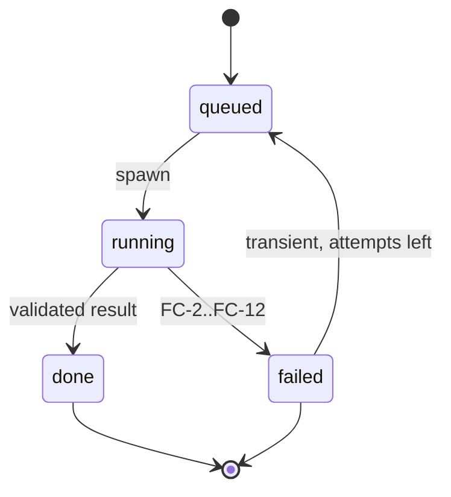
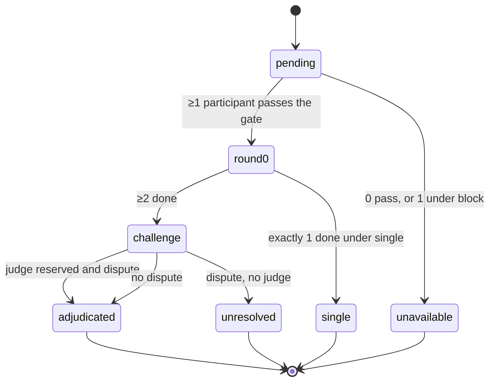
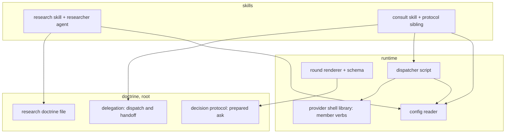
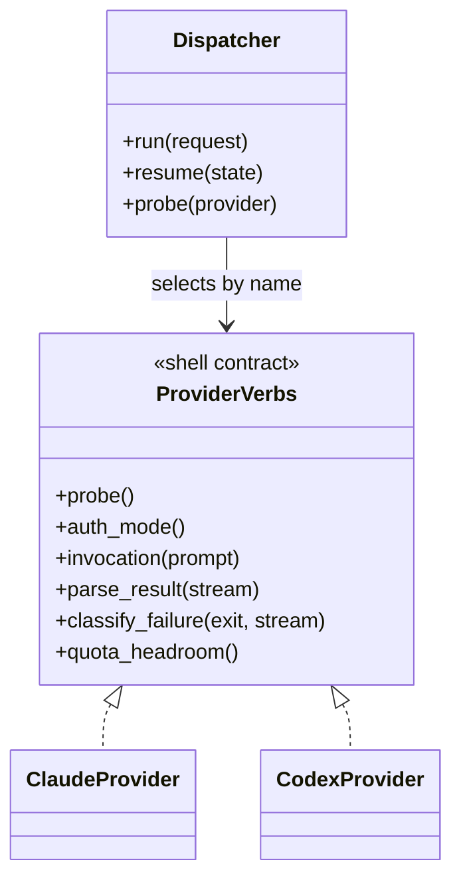

# SDD — Research, prepared asks, and multi-provider consultation

> Parent PRD: `PRD.md`
> Status: Draft
> Last updated: 2026-09-15
> Reading guide: sections follow the L1–L9 design-layer ladder, top of the system down to the code
> (L1 topology · L2 service boundaries · L3 data · L4 cross-cutting quality · L5 domain model ·
> L6 processes · L7 modules · L8 patterns · L9 seams into existing code). Skim §0 (what's locked)
> and §1 (why) first; non-implementers can stop there or read the DESIGN-BRIEF instead.

## §0 Binding Contract

This SDD and its accepted ADRs are **binding** on implementing agents and reviewers.

**Required visual:** the lock-vs-latitude table below.

| Aspect | Locked by SDD/ADR | Executor latitude |
|--------|-------------------|-------------------|
| Pattern choice | ✅ | ❌ |
| Module public interface | ✅ | ❌ |
| API contract / schema | ✅ | ❌ |
| Persisted schema — fields, relations, migration (§4) | ✅ | ❌ |
| Lifecycle states + legal transitions (§6) | ✅ | ❌ |
| Roles permitted/denied per surface (§5) | ✅ | ❌ |
| Aggregate boundary | ✅ | ❌ |
| Txn / idempotency strategy | ✅ | ❌ |
| External-seam contract (§9b: framework I/O shape, field source-of-truth, enforcement point, failure surface) | ✅ | ❌ |
| File / package layout *within* a named module | ❌ | ✅ |
| Private helper extraction | ❌ | ✅ |
| Internal naming, control flow | ❌ | ✅ |
| Test fixture structure | ❌ | ✅ |

**Conflict procedure.** Executor finds a binding decision wrong / infeasible / contradicting reality → classify per the decision protocol (`DECISIONS.md`, workflow plugin root): a two-way-door correction is recorded in `plan/DECISIONS.md` and implemented; a one-way door or a tie exits the subtask with `design_conflict` status quoting the SDD section + the conflict, routed back to `/afk:grill-solution` for a new ADR (Status: Accepted, Supersedes: NNNN). Never override off the record.

**Human sign-off register.** Transcribed from `GRILL-LOG.md` (Solution grill, round R-1, answers relayed from the page form). The signed tables stand verbatim in `SIGNED-PACKETS.md`; the sections below carry them without change.

| Aspect | Section | Status | Signed by / date | Approved wording |
|--------|---------|--------|------------------|------------------|
| HL-1 Persistence (spec-folder files, JSON records) | §4 | signed | the user, via the orchestrator relay / 2026-09-15 | "hl-1 sign" |
| HL-2 Callable surfaces (skills, dispatcher commands, provider verbs) | §3 | signed | the user, via the orchestrator relay / 2026-09-15 | "hl-2 sign" |
| HL-3 Authorization and data scoping | §5 | signed | the user, via the orchestrator relay / 2026-09-15 | "hl-3 sign" |
| HL-4 Lifecycle and invariants | §6 | signed | the user, via the orchestrator relay / 2026-09-15 | "hl-4 sign" |
| HL-5 Irreversible and outward side effects | §7 | signed | the user, via the orchestrator relay / 2026-09-15 | "hl-5 sign" |
| HL-6 Change to existing behaviour (seam rows) | §14 | signed | the user, via the orchestrator relay / 2026-09-15 | "hl-6 sign" |

Additions after the signatures, each an amendment the user decided through the orchestrator on 2026-09-15 and recorded in the requirement ADRs, not a change to a signed table: the four conditions on the cross-provider Claude route (ADR-0006), the `usage_credits: disabled` requirement (PRD AC-041), the three separately tested Codex controls (AC-043), and the exhausted-credit window rule (AC-044). They add rows to §5 and §7 below, marked *(amendment)*.

## §1 Context Summary

The plugin decides from local truth and one model. The PRD adds four opt-in capabilities: a research skill that answers world questions from cited primary sources and surfaces the team's own settled priorities as advisory findings; a prepared-ask bar so anything that reaches a human carries a recommendation, graded evidence, what was tried and the cost of waiting; a consultation skill where a second provider investigates the same question independently and challenges once, dissent kept; and a dispatcher that runs those providers headless under the user's existing subscriptions only, resuming unfinished read-only work on another host. Every capability is absent until `.afk/config.yaml` declares it (PRD AC-011). The WHAT is `PRD.md`; requirement ADRs 0001–0008 bind this design.

**Required visual:** none (orientation only).

---

## §2 L1 — System Topology

Inherited: one committed plugin tree, enabled natively per harness (`PROVIDERS.md` distribution law). The feature adds no deployable unit. A participant is a foreground child process of the host session, or a native subagent when the provider is the host (ADR-0006); no daemon, no service, no queue.


Caption: every new piece runs inside the host session; the only outward edges are sanitized web queries and the participant CLI's own endpoint.

## §3 L2 — Service Boundaries & Integration

One service: the plugin. Integration style inside it is file-and-process: skills read and write files under the spec folder; the dispatcher is a subprocess with a JSON request on disk and a prompt on stdin; provider behaviour is a shell library the dispatcher and hooks both source. No REST, no message bus, no shared database. Versioning posture: additive only in this release; plugin version 1.3.0 → 1.4.0 (minor).


Caption: callers point at the two utilities; the utilities never name a caller; the dispatcher is the only site that spawns a provider CLI.

```mermaid
sequenceDiagram
  participant K as consult skill
  participant D as dispatcher
  participant V as provider verbs
  participant P as participant CLI
  K->>D: run --request request.json --out dir (prompt on stdin)
  D->>D: validate request; reserve judge
  D->>V: probe / auth_mode / quota_headroom
  V-->>D: {auth_mode, headroom, binary}
  alt auth_mode != subscription or declaration missing
    D-->>K: job class billing (FC-5), skipped
  else
    D->>D: build staging dir, allowlisted env
    D->>P: invocation(prompt) with deadline
    P-->>D: stdout stream
    D->>V: parse_result / classify_failure
    D->>D: write result.json, state.json (atomic)
    D-->>K: exit 0 / 3 / 4
  end
```
Caption: the auth gate runs before any staging or spawn; a refused participant never receives content.

**API contract table** (HL-2, signed; transcribed from `SIGNED-PACKETS.md` HL-2). Contract source for field-by-field shapes: `SIGNED-PACKETS.md` §HL-1 tables (request/result/state records) — a verification citation, not implementation guidance.

| Surface | Invocation | Auth + permitted actor (§5 guard) | Inputs + validation | Success envelope | Error envelopes (code, trigger) | Paging / idempotency | Version | Existing callers |
|---|---|---|---|---|---|---|---|---|
| `/afk:research` | skill; args: question, type W1..W4, spec dir | host agent in an interactive or autopilot session; `research:` block present | question text; type in enum; optional prior RES ids; query hygiene on every public query | `REPORT.md` + `evidence.json`, `status: closed \| incomplete` | refuse: no `research:` block; hygiene reject (AC-008); `required` web mode with no web tool (AC-007) | none / new RES id per run; a re-run cites the prior report | 1 | new |
| `/afk:consult` | skill; args: route, brief path, spec dir | host agent through a configured route; `consultation.enabled` | route resolves; staged evidence list; every path allowed | `REPORT.md` with disposition; exit 0 | exit 3 `single` (one healthy participant, `unavailable: single`); exit 4 `unavailable` (0 participants, or 1 under `block`) (AC-019); validation error names the key | none / CON id per run; resume reuses it | 1 | new |
| dispatcher `run` | `run --request <request.json> --out <dir>`; prompt on stdin | the consult skill only (§5) | request record: identity, scope, permission, route, deadline, billing; schema 1 | `result.json` per job, `state.json`, exit 0 | exit 3 / 4 per the adapter answer shape; exit 2 unresolved config; per-job class FC-1..FC-12 in `result.json` | job_id = CON-NNN/participant; a `done` job never re-runs | 1 | new |
| dispatcher `resume` | `resume --state <state.json>` | the consult skill, on any host | `state.json` schema 1 | remaining read-only jobs run; exit 0 | as `run`; a job whose `write_policy` is not `read-only` is refused | same job ids | 1 | new |
| dispatcher `probe` | `probe --provider <name>` | the consult skill or setup | provider name in config | JSON `{auth_mode, quota_headroom, binary}` | exit 4 missing binary or no auth | read-only, repeatable | 1 | new |
| provider member verbs | shell functions in the provider library, one file per provider | the dispatcher and hooks | per verb: `probe`, `auth_mode`, `invocation`, `parse_result`, `classify_failure`, `quota_headroom` (optional) | the verb's documented output | a missing verb makes the dispatcher exit 3 (adapter-family shape, `ADAPTERS.md`); the library's own convention for its 5 existing members is silent fallback, which the dispatcher does not adopt | pure functions | 1 | **compatible**: the 5 existing members (`priority`, `detect`, `plugin_root`, `stop_block_code`, `plugin_data`) untouched; no pin enumerates a member list (INV-003) |
| config reader top-level keys | `.afk/config.yaml` | repository administrator | `research:` and `consultation:` blocks; unknown child keys rejected with the key named (AC-033) | as today | validate exit 2 naming the key | — | schema 1 | **compatible**: one reader of the key list; `export-shell` tolerates the blocks on an older plugin (INV-002) |

## §4 L3 — Data Architecture

**State table.**

| State | Datastore | Partitioning | Replication | Retention | Schema-evolution policy | PII? | Audited? (Envers) |
|-------|-----------|--------------|-------------|-----------|--------------------------|------|-------------------|
| Research report + evidence | files under `{spec}/research/<RES-NNN>/` | one folder per report | git, with the spec folder | life of the spec folder | `schema: 1` field; reader rejects other values | no by construction (hygiene) | no |
| Consultation request, results, report | files under `{spec}/consult/<CON-NNN>/` | one folder per run; one result per participant | git | life of the spec folder | `schema: 1` | no (staged evidence only) | no |
| Dispatcher resume state | `state.json` in the run folder, atomic write | per run | git | life of the spec folder | `schema: 1` | no | no |
| Raw provider streams | scratch, outside the spec folder | per run and participant | none | `retain_raw_days` (default 7), deleted by the next dispatcher run | never committed | possible (provider chatter) | no |
| Accepted organization priority | `CLAUDE.md` of the service, through the steward skill | — | git | as CLAUDE.md | steward protocol | no | no |

**Entity design** (HL-1, signed): the file set and the four record shapes (claim record, `evidence.json`, `result.json`, `state.json`) stand verbatim in `SIGNED-PACKETS.md` §HL-1 and are binding here without restatement. Identity: `RES-NNN` and `CON-NNN` sequential per spec folder; job identity `CON-NNN/<participant>`; the reader tolerates a `-b` suffix on collision across worktrees. Relations: a claim's `counterevidence` lists claim ids in the same report; a `result.json` `changed_from` cites a round-0 claim id; `state.json.jobs[].result_path` points at its result file. No delete cascade: files are only ever added, and raw streams expire independently.

**Surface reachability.** No existing entity gains a field. The round document gains two optional debate-card fields (`exhausted`, `postpone_cost`): the renderer changes with the schema in the same commit; the response grammar and the answer form are unchanged (INV-001).

**Migration & backfill.** None: every record is new. An existing round JSON without the two optional fields renders as before. Reversible by deleting the folders.

```mermaid
erDiagram
  RESEARCH_REPORT ||--o{ CLAIM : "claims[]"
  RESEARCH_REPORT ||--o{ PRIORITY : "priorities[] (advisory)"
  CLAIM }o--o{ CLAIM : "counterevidence"
  CONSULT_RUN ||--|| REQUEST : "request.json"
  CONSULT_RUN ||--o{ JOB_RESULT : "jobs/<participant>/result.json"
  CONSULT_RUN ||--|| STATE : "state.json"
  CONSULT_RUN ||--|| CONSULT_REPORT : "REPORT.md"
  JOB_RESULT ||--o{ CLAIM : "claims[]"
  JOB_RESULT }o--o| CLAIM : "changed_from cites"
  REQUEST }o--o{ RESEARCH_REPORT : "brief cites RES ids"
```


Caption: two folders, one shared claim shape; consultation cites research, never the reverse.

## §5 L4 — Cross-Cutting & Quality Attributes

**AuthN.** No plugin-issued credential. A participant CLI authenticates with its own subscription login; the dispatcher only observes the mode.


Caption: the gate reads a status, never a secret; an unknown mode fails closed (PRD Further Notes #1).

**AuthZ** (HL-3, signed; both-side enforcement).

| Surface | Permitted | Denied | Enforcement in the skill | Enforcement below the skill |
|---|---|---|---|---|
| Run research | host agent in an interactive or autopilot session | child agents below nesting cap 3; any participant | precheck: `research:` block present | config reader validation; hygiene script rejects before egress |
| Write research artifacts | research skill | every other skill | single-writer law | fixture: no other write site |
| Run consultation | host agent through a configured route | human conversation; synthesis skills; participants | precheck: `consultation.enabled` and route resolves | dispatcher validates the request; refuses a nested consult |
| Participant execution | dispatcher | any skill calling a provider CLI directly | skills carry only the pointer | dispatcher is the only spawn site |
| Accept a decision or a priority | human | consult skill, research skill, dispatcher | ADR-0001, ADR-0007 | steward skill propose-approve-write |
| Set billing, no_training, credits | repository administrator in `.afk/config.yaml` | any agent | values echoed to `request.json` and one journal line (AC-034) | config reader rejects `billing: false` without `billing: api` |
| Enable the cross-provider Claude route *(amendment)* | repository administrator, one config switch, default off | any agent | route resolution | dispatcher reports `unsupported` (FC-2) when the switch is absent (AC-042) |

**Data scoping** (HL-3, signed).

| Scope | Default | Widening | Mechanism |
|---|---|---|---|
| Working directory | staging directory, approved files only | `allowed_paths` per participant; `denied_paths` always wins | staging built from the evidence list; denied or secret-pattern files never copied (AC-030, AC-031) |
| Environment | allowlist only (PATH, HOME, locale, provider login files) | none | child env constructed, not inherited (AC-024); `ANTHROPIC_API_KEY`, `CODEX_API_KEY`, `OPENAI_API_KEY`, `XAI_API_KEY`, `GEMINI_API_KEY` absent *(amendment: each Codex key its own test, AC-043)* |
| Network | provider endpoint; web tools only if role and config allow | `research.public` mode | provider flags (Codex `--sandbox read-only`, `forced_login_method=chatgpt`); query hygiene |
| Training treatment | route requires the `no_training` declaration | administrator declaration per destination | ADR-0002; missing declaration blocks (AC-032) |

**Idempotency.**

| Surface | Key shape | Dedup window | Side-effect ledger |
|---|---|---|---|
| dispatcher job | `CON-NNN/<participant>` | life of the run | `state.json.jobs[]` status; a `done` job never re-runs |
| research run | `RES-NNN` | none (each run is new) | `evidence.json.public.queries` records every query sent |
| raw-stream expiry | path + mtime | per dispatcher run | none needed; idempotent delete |

**Retry + timeout.**

| Call | Attempts | Backoff | Timeout |
|---|---|---|---|
| participant job | 1 + `max_attempts` re-queues, `transient` only (default 1) | fixed 30 s | `deadline_minutes` (default 45); process tree killed within 5 s on Windows (AC-022) |
| provider probe | 1 | — | 30 s |
| web fetch in research | 2 | 5 s | 60 s per fetch; `research.max_minutes` overall |
| quota | 0 (ends the participant for the window; FC-6) | — | — |

**Rate limit.** None imposed by the plugin; budgets are turns per job (`max_turns`) and window headroom from the probe (AC-038). An exhausted monthly Agent SDK credit or plan window is `quota`, never an error *(amendment, AC-044)*.

**Sync vs async.** All foreground. One sequence per long operation is §7's consultation flow; the latency budget is the deadline table above.

**Feature flags.**

| Flag key | Default | Rollout | Cleanup |
|---|---|---|---|
| `research:` block present | absent (off) | per repository | none; it is the feature's switch |
| `consultation.enabled` | false | per repository | none |
| `consultation.billing` | `subscription_only` | admin-only change | none |
| `consultation.unavailable` | `single` (advisory); `block` per high-impact route | per route | none |
| cross-provider Claude route `enabled` | false | admin-only, after the policy conditions (ADR-0006) | none |

**Observability.**

| Signal | What it detects |
|---|---|
| one journal line per consultation run (route, participants, classes, disposition, billing value) | a refused participant, a single-provider run, a `billing: false` route (§7 F-1..F-3) |
| `result.json.class` per job | every failure class (§7 matrix) |
| `evidence.json.public.queries` | what left the machine (§7 E-2) |
| raw stream in scratch until expiry | provider-side diagnosis of `invalid_output` and `unknown` |

## §6 L5 — Domain Model


Caption: two aggregate roots, the research report and the consultation run; every claim belongs to exactly one of them.

**Invariants** (HL-4, signed).

| Id | Invariant | Owner aggregate | Guardian | Response to violation |
|---|---|---|---|---|
| I-1 | Round-0 reports written before any participant sees another's output | consultation run | dispatcher prompt builder | fixture fails; runtime `invalid_output` |
| I-2 | At most 1 challenge round | consultation run | config reader validation | config rejected, key named (AC-013) |
| I-3 | Subscription-only unless `billing: false` declared | consultation run | dispatcher auth gate | `billing` (FC-5), skipped, never retried with other auth |
| I-4 | Consultation never changes a gate verdict or a human decision | consultation run | the calling gate | ADR-0007; a caller reading the disposition into its verdict fails review |
| I-5 | One writer per artifact | both | the owning skill | fixture greps for a second write site |
| I-6 | Raw streams never under the spec folder | consultation run | dispatcher path rule | path validation refuses; expiry (AC-029) |
| I-7 | `none found` counterclaim only with an evidence check | participant job | result schema | `invalid_output` (AC-014) |
| I-8 | A snippet or provider agreement is never evidence | research report, participant job | claim record `status` | `unverified`; excluded from closure (AC-003) |


Caption: participant job; `done` and `failed` are terminal, and only `transient` re-queues.


Caption: consultation run; four terminal states map to exit 0 (adjudicated, unresolved), 3 (single), 4 (unavailable).

**Domain events.** None emitted; the journal line is a log, not an event.

## §7 L6 — Process & Coordination

```mermaid
sequenceDiagram
  actor U as human
  participant G as calling grill or gate
  participant C as consult skill
  participant D as dispatcher
  participant A as participant A
  participant B as participant B
  participant J as judge (reserved, fresh)
  G->>C: route + brief (trigger fired)
  C->>D: run (request.json, prompt)
  Note over D: no transaction; every write is one atomic file
  D->>A: round 0 prompt (sealed)
  D->>B: round 0 prompt (sealed)
  A-->>D: result.json (round 0)
  B-->>D: result.json (round 0)
  D->>A: challenge prompt (B's report, evidence check required)
  D->>B: challenge prompt (A's report)
  A-->>D: result.json (round 1)
  B-->>D: result.json (round 1)
  alt factual dispute
    D->>D: official source or local probe check
  end
  alt value dispute and judge reserved
    D->>J: both positions, identities blind
    J-->>D: disposition
  end
  D-->>C: state.json, exit code
  C->>G: REPORT.md (advisory)
  G->>U: prepared ask, dissent preserved
```
Caption: one independent round, one challenge round, then a check before any human sees a dispute.

**Use-case detail.**

| Use case | Trigger | Boundary strategy | Consistency per read path | Concurrency control |
|---|---|---|---|---|
| research run | external claim, consequential unknown, configured route (never elapsed time) | single writer; report written once at the end | read-after-write (files) | one run per RES id |
| consultation run | same triggers | no transaction; atomic per-file writes; `state.json` is the resume point | read-after-write | job status in `state.json`; a `done` job is never re-run; resume on another host takes the file as truth |
| resume | host quota ended or session lost | read-only jobs only (ADR-0004) | as above | past `deadline_at` on a `running` job is `timeout`, one re-queue if `transient` budget remains |
| accept a priority | human accepts a research finding | steward propose-approve-write | git | steward protocol |

**Failure & recovery matrix.**

| Failure point | Detection signal | Automatic recovery | Manual recovery | Owner |
|---|---|---|---|---|
| F-1 auth mode not subscription, declaration missing | `billing` (FC-5) in result and journal | skip participant; run continues if ≥1 remains | administrator fixes login or declaration | dispatcher |
| F-2 quota or credit window exhausted | `quota` (FC-6) | participant ends for the window; no auth change | wait for the window | dispatcher |
| F-3 child hung | deadline reached | `timeout` (FC-8), process tree killed, one re-queue if `transient` budget | none | dispatcher |
| F-4 output fails schema | `invalid_output` (FC-10) | none; raw stream kept for diagnosis | fix the provider verb or the prompt | dispatcher |
| F-5 host dies mid-run | `state.json` shows `running` past deadline | `resume` on another host | run `resume` | consult skill |
| F-6 no judge reservable | dispute at challenge | disposition `unresolved`; both positions reach the human | none | consult skill |
| F-7 web query fails hygiene | hygiene reject before egress | query dropped; research may end `incomplete` | rephrase | research skill |
| F-8 staged file matches a secret pattern | staging refuses | file omitted | administrator approves explicitly | dispatcher |

**Outward and irreversible effects** (HL-5, signed): E-1..E-6 stand verbatim in `SIGNED-PACKETS.md` §HL-5. Amendments: E-3 counts an exhausted monthly Agent SDK credit as the end of the window (AC-044); the cross-provider Claude route is off by default and, when enabled, strips `ANTHROPIC_API_KEY` and never passes `--bare` (ADR-0006 conditions).

## §8 L7 — Module Decomposition


Caption: dependencies point downward to doctrine and runtime; no runtime module depends on a skill, and no cycle exists.

| Module | Purpose | Public interface | Depends on | Owner aggregate |
|---|---|---|---|---|
| research doctrine file | question types, source classes, citation shape, closure, hygiene, priority inference | prose contract read by the research skill and the researcher agent | — | research report |
| research skill + researcher agent | run one W1–W4 question to closure or `incomplete` | `question, type, spec dir → REPORT.md + evidence.json` | doctrine, config reader, web tools (capability `web_access`) | research report |
| prepared ask (decision protocol section) | the bar for anything reaching a human | 2 optional debate-card fields | round schema | — |
| consult skill + protocol sibling | sealed reports, one challenge, dispositions, judge rule | `route, brief, spec dir → REPORT.md, exit 0/3/4` | dispatcher, config reader, delegation doctrine | consultation run |
| dispatcher script | subprocess lifecycle, auth gate, staging, env allowlist, failure classes, resume, raw-stream expiry | `run`, `resume`, `probe` (§3) | provider library, config reader | consultation run, participant job |
| provider shell library | per-provider member verbs | `probe, auth_mode, invocation, parse_result, classify_failure, quota_headroom` | — | — |
| config reader | `research:` and `consultation:` blocks; validation | as today: `validate`, `get`, `export-shell` | — | — |
| round renderer + schema | render the two new optional fields | unchanged CLI | — | — |

## §9 L8 — Tactical Patterns

| Concern | Pattern | ADR |
|---|---|---|
| provider differences | Strategy through a shell-function contract per provider (member verbs), selected by name | `adr/design/0001` |
| subprocess failures | classified result (tagged union FC-1..FC-12) with exit-0-is-not-success | `adr/design/0002` |
| resumable runs | state file as the single source of truth, atomic replace | `adr/design/0002` |
| independent judgment | sealed rounds + reserved fresh judge (review verify-pass precedent) | `adr/design/0003` |
| billing safety | gate-before-spawn with declarations as evidence | `adr/design/0004` |
| egress | staging directory built from an allowlist | `adr/design/0004` |


Caption: the dispatcher knows the verb contract, never a provider; a new provider is one file plus a conformance probe.

## §9b External Seams & Failure Affordance

| Boundary | External thing @ pin | What it does to our value | Source of truth | Failure surface | Seam-test |
|---|---|---|---|---|---|
| Claude CLI headless invocation | `claude -p` on the user's installed version (no version pin in this repo; probed live) | reads the prompt from stdin; prints the result; draws on the subscription window (both live states of the plan article, PRD #5) | support article 15036540 text quoted in PRD Further Notes; `claude auth status --json` fixtures captured at step 2 | `billing` / `quota` / `invalid_output` | `test_dispatch_claude_envelope`: fixture stdout parsed to a valid `result.json`; unknown `subscriptionType` → FC-5 |
| Codex CLI headless invocation | `codex exec -` with `-c forced_login_method=chatgpt --sandbox read-only` | reads stdin; stored ChatGPT login; honors `CODEX_API_KEY` if present in env | PREMISES-CHECK.md #2 | `billing` / `quota` / `invalid_output` | three tests: key absent ×2, flag present (AC-043) |
| Provider status strings | `codex login status`, `claude auth status` | free-text or JSON we parse | step-2 fixtures | `unknown` → fail closed | `test_auth_mode_parse` per fixture state |
| Web fetch in research | the public web | returns pages we quote | primary sources only, quoted with date | `incomplete` | `test_research_fixture_closed_incomplete` |
| Windows process tree | OS job objects / `taskkill /T` | ends the child and grandchildren | fixture AC-022 | orphan process | `test_timeout_kills_tree_5s` |
| Round renderer | plugin's own schema (`schema: 1`) | renders two optional fields | INV-001 | contract error exit 1 | `test_lavish_render` addition for the two fields |

Both-side enforcement: every guard in §5 has a skill-side precheck and a below-the-skill check; the human never sees an unguarded surface.

---

## §10 NFRs

| Concern | Target | Measurement | Owner |
|---|---|---|---|
| Participant job wall-clock (min) | ≤ 45 default, per-route override | `state.json` timestamps | dispatcher |
| Process-tree kill on timeout (s) | ≤ 5 on Windows | fixture AC-022 | dispatcher |
| Turns per job | ≤ `max_turns` (default 25) | `result.json.usage.turns` | dispatcher |
| Research run (min) | ≤ `research.max_minutes` (default 20) | `evidence.json.budget` | research skill |
| Extra paid usage (currency) | 0 under `subscription_only` | AC-025, AC-027, AC-041 fixtures; user-gated live probe | administrator |
| Raw-stream retention (days) | 7 default | AC-029 | dispatcher |
| Evaluation fixtures | 3 modes × 7 metrics reported | AC-036 | retro |

## §11 Out of Scope

- PRD Out of Scope in full: executor or write-role hop; automatic host replacement; priorities registry file; Gemini CLI; Antigravity and Grok before conformance; MCP bridges, OpenRouter, LiteLLM, 1devtool in the runtime path; new review concern, evidence grades, counter-search route; tracker publishing.
- Design-level: no daemon or background queue; no plugin-issued credential; no currency spend cap (turns only); no per-query human approval of web queries; no change to the review findings JSON.

## §12 Reversed Decisions

| Prior ADR | Superseded by | Reason |
|-----------|---------------|--------|
| none | — | — |

## §13 Open Questions

| Question | Layer (L1-L9) | Blocks executor? | Owner | Target resolve date |
|----------|---------------|------------------|-------|---------------------|
| `claude auth status --json` field names (PRD #1) | L4 | no (fail closed on unknown; fixtures at step 2) | implementer of the dispatcher | step 2 |
| Silent credit draw by `claude -p` (PRD #3) | L4 | no (declaration gate AC-041; user-gated live probe) | user | step 5 |
| Antigravity defaults (PRD #4) | L4 | no (provider disabled until step 5) | implementer of conformance | step 5 |
| Decision A vs B on the Claude route enable rule (PRD #5) | L4 | no (route off by default; one switch) | user | before step 5 |
| Windows process-tree kill for a hung participant (§9b row 5): no mechanism exists in the repo today; the seam-test `test_timeout_kills_tree_5s` and fixture AC-022 are step-2 deliverables | L4 | no (implementer builds it under AC-022; the deadline table in §5 is the contract) | implementer of the dispatcher | step 2 |
| Seed runs read an empty config hash (`run.config.sha256` of the empty string) although `.afk/config.yaml` carries an `investigation:` block; hash restamped by hand from `seed_map.load_config` | L9 | no (every boundary class dispositioned with cited evidence in `BOUNDARY-EVIDENCE.md`; ledgers validate closed) | plugin maintainer via `/afk:report-issue` | before the next investigation run |

**Seam-investigation gate notes** (printed by `check_sdd_investigations.py` on this draft, copied verbatim):

- note � round schema `debate_card` optional field set (`scripts/lavish/schema.py:69`; required set at :46-48): INV-005 left unverified, not load-bearing: the hit set holds every reference to debate_card over the name forms this pass searched
- note � round schema `debate_card` optional field set (`scripts/lavish/schema.py:69`; required set at :46-48): INV-005 stops at B14: the round JSON is authored at runtime by the consuming repository's grill session and the page is hosted by lavish-axi (LAVISH-KIT.md:16); neither is in this repository. The declared sites hooks/update-notice.sh:96, adapters/forge/github/forge.sh:243, adapters/tracker/github-issues/api.py:31 were read and carry no round document
- note � round schema `debate_card` optional field set (`scripts/lavish/schema.py:69`; required set at :46-48): INV-001 left unverified, not load-bearing: the hit set holds every reference to debate_card over the name forms this pass searched
- note � round schema `debate_card` optional field set (`scripts/lavish/schema.py:69`; required set at :46-48): INV-001 stops at B14: another repository, deployment manifest, or live consumer
- note � config reader `TOP_LEVEL` and `export-shell` flattening (`scripts/afk-config.py:541,978-990`): INV-006 left unverified, not load-bearing: the hit set holds every reference to TOP_LEVEL, AFK_CFG_ over the name forms this pass searched
- note � config reader `TOP_LEVEL` and `export-shell` flattening (`scripts/afk-config.py:541,978-990`): INV-006 stops at B14: declared sites hooks/update-notice.sh (release check against the plugin's own GitHub repository), adapters/forge (gh/glab against the live forge), adapters/tracker/github-issues (gh against the live tracker), and every consuming repository's .afk/config.yaml are outside this repository; not reachable
- note � config reader `TOP_LEVEL` and `export-shell` flattening (`scripts/afk-config.py:541,978-990`): INV-002 left unverified, not load-bearing: the hit set holds every reference to TOP_LEVEL, AFK_CFG_ over the name forms this pass searched
- note � config reader `TOP_LEVEL` and `export-shell` flattening (`scripts/afk-config.py:541,978-990`): INV-002 left unverified, not load-bearing: Consuming repositories' .afk/config.yaml files and their .afk/hooks.json handlers are outside this repository.
- note � config reader `TOP_LEVEL` and `export-shell` flattening (`scripts/afk-config.py:541,978-990`): INV-002 stops at B14: another repository, deployment manifest, or live consumer; consuming repositories' .afk/config.yaml files and their .afk/hooks.json handlers (which receive AFK_PLUGIN_ROOT, hooks/run-hook.py) are outside this repository; no live consumer reachable
- note � provider shell library function set (`hooks/lib/providers/claude.sh`, `codex.sh`) and adapter answer shape: INV-003 left unverified, not load-bearing: the hit set holds every reference to afk_provider, AFK_PROVIDER_NAMES over the name forms this pass searched
- note � provider shell library function set (`hooks/lib/providers/claude.sh`, `codex.sh`) and adapter answer shape: INV-003 stops at B14: consuming repositories' .afk/hooks.json handlers and the installed harness copies (~/.codex/agents/afk-afk-*.toml, the plugin cache) that source the library at runtime; the live harness behaviour recorded in providers/CONFORMANCE.md is a probe record, not this repository's code
- note � provider shell library function set (`hooks/lib/providers/claude.sh`, `codex.sh`) and adapter answer shape: INV-007 left unverified, not load-bearing: the hit set holds every reference to afk_provider, AFK_PROVIDER_NAMES over the name forms this pass searched
- note � provider shell library function set (`hooks/lib/providers/claude.sh`, `codex.sh`) and adapter answer shape: INV-007 stops at B14: installed harness copies and consuming repositories' .afk/hooks.json handlers source the library at runtime outside this repository; live harness behaviour is a probe record (providers/CONFORMANCE.md:21), not code here
- note � `plugin.json` manifests, `skill-registry-gate.sh`, `native-contract-gate.sh`, `genericity-gate.sh`, `wiring-gate.sh` and the `README.md` / `CLAUDE.md` catalogs that must list `research`, `consult` and `afk-researcher`: INV-008 left unverified, not load-bearing: the hit set holds every reference to claude-plugin, codex-plugin, skill-registry-gate, native-contract-gate, genericity-gate, wiring-gate, README, CLAUDE, DELEGATION, INVESTIGATION, DECISIONS, LANGUAGE, grill-requirements, grill-solution, grill-verification, afk:review, afk:adversary, afk:fix over the name forms this pass searched
- note � `plugin.json` manifests, `skill-registry-gate.sh`, `native-contract-gate.sh`, `genericity-gate.sh`, `wiring-gate.sh` and the `README.md` / `CLAUDE.md` catalogs that must list `research`, `consult` and `afk-researcher`: INV-008 stops at B14: another repository, deployment manifest, or live consumer: the harness plugin loaders and marketplaces consume plugin.json outside this repository (live behaviour recorded only in providers/CONFORMANCE.md); the configured B14 sites hooks/update-notice.sh, adapters/forge, adapters/tracker/github-issues reach the plugin's own GitHub release feed and the consuming repository's live forge/tracker � none reads a skill, agent, doctrine, glossary or capability registry
- note � `plugin.json` manifests, `skill-registry-gate.sh`, `native-contract-gate.sh`, `genericity-gate.sh`, `wiring-gate.sh` and the `README.md` / `CLAUDE.md` catalogs that must list `research`, `consult` and `afk-researcher`: INV-004 left unverified, not load-bearing: the hit set holds every reference to research, consult, afk-researcher, web_access, RESEARCH.md over the name forms this pass searched
- note � `plugin.json` manifests, `skill-registry-gate.sh`, `native-contract-gate.sh`, `genericity-gate.sh`, `wiring-gate.sh` and the `README.md` / `CLAUDE.md` catalogs that must list `research`, `consult` and `afk-researcher`: INV-004 left unverified, not load-bearing: Unverified: whether a harness plugin loader errors or stays silent on a skills[] entry whose directory exists but whose SKILL.md frontmatter it cannot parse (B14, live behaviour); the registry gate's own header (:30-34) records one silent drop on one harness.
- note � `plugin.json` manifests, `skill-registry-gate.sh`, `native-contract-gate.sh`, `genericity-gate.sh`, `wiring-gate.sh` and the `README.md` / `CLAUDE.md` catalogs that must list `research`, `consult` and `afk-researcher`: INV-004 stops at B14: another repository, deployment manifest, or live consumer; harness plugin loaders (Claude Code, Codex CLI) and the marketplace consume plugin.json / marketplace.json outside this repository; their behaviour on an unregistered dir is recorded only in CONFORMANCE.md � frontier
- note � `DECISIONS.md`, `DELEGATION.md`, `INVESTIGATION.md` and `LANGUAGE.md` pointer lines, plus the new `RESEARCH.md` root doc: INV-008 left unverified, not load-bearing: the hit set holds every reference to claude-plugin, codex-plugin, skill-registry-gate, native-contract-gate, genericity-gate, wiring-gate, README, CLAUDE, DELEGATION, INVESTIGATION, DECISIONS, LANGUAGE, grill-requirements, grill-solution, grill-verification, afk:review, afk:adversary, afk:fix over the name forms this pass searched
- note � `DECISIONS.md`, `DELEGATION.md`, `INVESTIGATION.md` and `LANGUAGE.md` pointer lines, plus the new `RESEARCH.md` root doc: INV-008 stops at B14: another repository, deployment manifest, or live consumer: the harness plugin loaders and marketplaces consume plugin.json outside this repository (live behaviour recorded only in providers/CONFORMANCE.md); the configured B14 sites hooks/update-notice.sh, adapters/forge, adapters/tracker/github-issues reach the plugin's own GitHub release feed and the consuming repository's live forge/tracker � none reads a skill, agent, doctrine, glossary or capability registry
- note � `DECISIONS.md`, `DELEGATION.md`, `INVESTIGATION.md` and `LANGUAGE.md` pointer lines, plus the new `RESEARCH.md` root doc: INV-004 left unverified, not load-bearing: the hit set holds every reference to research, consult, afk-researcher, web_access, RESEARCH.md over the name forms this pass searched
- note � `DECISIONS.md`, `DELEGATION.md`, `INVESTIGATION.md` and `LANGUAGE.md` pointer lines, plus the new `RESEARCH.md` root doc: INV-004 left unverified, not load-bearing: Unverified: whether a harness plugin loader errors or stays silent on a skills[] entry whose directory exists but whose SKILL.md frontmatter it cannot parse (B14, live behaviour); the registry gate's own header (:30-34) records one silent drop on one harness.
- note � `DECISIONS.md`, `DELEGATION.md`, `INVESTIGATION.md` and `LANGUAGE.md` pointer lines, plus the new `RESEARCH.md` root doc: INV-004 stops at B14: another repository, deployment manifest, or live consumer; harness plugin loaders (Claude Code, Codex CLI) and the marketplace consume plugin.json / marketplace.json outside this repository; their behaviour on an unregistered dir is recorded only in CONFORMANCE.md � frontier
- note � caller skills `grill-requirements`, `grill-solution`, `grill-verification`, `review`, `adversary`, `fix` gaining a pointer line to `research` and `consult`: INV-008 left unverified, not load-bearing: the hit set holds every reference to claude-plugin, codex-plugin, skill-registry-gate, native-contract-gate, genericity-gate, wiring-gate, README, CLAUDE, DELEGATION, INVESTIGATION, DECISIONS, LANGUAGE, grill-requirements, grill-solution, grill-verification, afk:review, afk:adversary, afk:fix over the name forms this pass searched
- note � caller skills `grill-requirements`, `grill-solution`, `grill-verification`, `review`, `adversary`, `fix` gaining a pointer line to `research` and `consult`: INV-008 stops at B14: another repository, deployment manifest, or live consumer: the harness plugin loaders and marketplaces consume plugin.json outside this repository (live behaviour recorded only in providers/CONFORMANCE.md); the configured B14 sites hooks/update-notice.sh, adapters/forge, adapters/tracker/github-issues reach the plugin's own GitHub release feed and the consuming repository's live forge/tracker � none reads a skill, agent, doctrine, glossary or capability registry
- note � caller skills `grill-requirements`, `grill-solution`, `grill-verification`, `review`, `adversary`, `fix` gaining a pointer line to `research` and `consult`: INV-004 left unverified, not load-bearing: the hit set holds every reference to research, consult, afk-researcher, web_access, RESEARCH.md over the name forms this pass searched
- note � caller skills `grill-requirements`, `grill-solution`, `grill-verification`, `review`, `adversary`, `fix` gaining a pointer line to `research` and `consult`: INV-004 left unverified, not load-bearing: Unverified: whether a harness plugin loader errors or stays silent on a skills[] entry whose directory exists but whose SKILL.md frontmatter it cannot parse (B14, live behaviour); the registry gate's own header (:30-34) records one silent drop on one harness.
- note � caller skills `grill-requirements`, `grill-solution`, `grill-verification`, `review`, `adversary`, `fix` gaining a pointer line to `research` and `consult`: INV-004 stops at B14: another repository, deployment manifest, or live consumer; harness plugin loaders (Claude Code, Codex CLI) and the marketplace consume plugin.json / marketplace.json outside this repository; their behaviour on an unregistered dir is recorded only in CONFORMANCE.md � frontier

## §14 L9 — Implementation Seams & Change Impact

All verdicts `extends`; none `reworked` (HL-6, signed). Anchors verified at origin/main d8ca9b4.

| Seam (class/method/contract) | Existing contract (INV-NNN) | Planned change | Impacted flows (INV-NNN) | Conventions / landmines | Verdict |
|------------------------------|-----------------------------|----------------|--------------------------|-------------------------|---------|
| round schema `debate_card` optional field set (`scripts/lavish/schema.py:69`; required set at :46-48) | unknown key is a hard render exit; fields render only where the components emit them (INV-005, INV-001) | +2 optional fields `exhausted`, `postpone_cost`; renderer emits them beside `third_paradigm` | render script, kit fixture, round-page tests (INV-001) | four-file lockstep same commit; renderer first or same commit; no test pins the optional tuple today | extends (ADR-0007 req.) |
| config reader `TOP_LEVEL` and `export-shell` flattening (`scripts/afk-config.py:541,978-990`) | one reader of the key list; unknown top-level key rejected; nested maps flatten to `AFK_CFG_*` (INV-006, INV-002) | +`research`, `consultation` keys; child validation for each block | every `AFK_CFG_` reader unchanged; validate-skew if a repo adds the blocks first (INV-002) | participant names differing only by `-`/`_`/`.`/case collide in the shell view; `CONFIG.md` drift test covers `CHILD_KEYS` blocks only; plugin ships before repos add blocks | extends |
| provider shell library function set (`hooks/lib/providers/claude.sh`, `codex.sh`) and adapter answer shape | glob-sourced provider files (`hooks/lib/provider.sh:7-14`), members resolved by built name `afk_<provider>_<member>` with silent fallback when absent (`:31,:62,:75,:145`); 5 members per file pinned by `hooks/tests/hook-smoke.sh:43-123`; the exit shape 0/2/3/4 belongs to the adapter family (`ADAPTERS.md:29-34`, `hooks/lib/adapter.sh`), not to the provider library; no existing spawn site for a headless Codex or Claude child (INV-003, INV-007) | +6 member verbs appended per file; the new dispatcher adopts the adapter-family exit shape and exits 3 on a missing verb (a second, explicit convention beside the library's fallback) | hook smoke test loops over provider files; `providers/CONFORMANCE.md:297` names the member list; a new provider *file* trips native-contract gate rules G/H and the copied detection order in `hooks/branch-name-gate.sh:26-35` (INV-003) | no pin enumerates members, so appending breaks nothing; the child-environment precedent `hooks/run-hook.py:142-150` copies `os.environ` and strips nothing, so the allowlist is new code; conformance table gains a row | extends |
| `plugin.json` manifests, `skill-registry-gate.sh`, `native-contract-gate.sh`, `genericity-gate.sh`, `wiring-gate.sh` and the `README.md` / `CLAUDE.md` catalogs that must list `research`, `consult` and `afk-researcher` | skill-registry gate check A/B/D, native-contract gate rules C/D, genericity and wiring gates (INV-008, INV-004) | +2 skills, +1 agent (+ Codex agent stub), +1 doctrine file, +6 glossary terms, +1 capability row, catalog mentions in CLAUDE.md and README.md | Stop gates on every session in this repo (INV-004) | same-commit set is gate-enforced; `web_access` row has no mechanical consumer (doc duty only); CONFORMANCE counts refresh on the next probe round | extends |
| `DECISIONS.md`, `DELEGATION.md`, `INVESTIGATION.md` and `LANGUAGE.md` pointer lines, plus the new `RESEARCH.md` root doc | pointer-only lockstep partners per the freshness registry (INV-008, INV-004) | +`Prepared ask` section; +`Dispatch and handoff` section; +1 pointer line | none at runtime (INV-004) | closure and counter-search rules unchanged | extends |
| caller skills `grill-requirements`, `grill-solution`, `grill-verification`, `review`, `adversary`, `fix` gaining a pointer line to `research` and `consult` | step order and concern roster unchanged (INV-008, INV-004) | +1 pointer line per chosen branch | none (INV-004) | callers name the utility; the utility never names a caller | extends |

Accepted compatibility-audit findings: (1) shell-view name collisions for participant keys are accepted with a validation rule that rejects two participants whose shell names collide; (2) the `web_access` capability row has no mechanical consumer, accepted as documentation duty per the capability contract; (3) CONFORMANCE.md counts are probe snapshots, refreshed at the step-5 probe round rather than in the feature commit.
