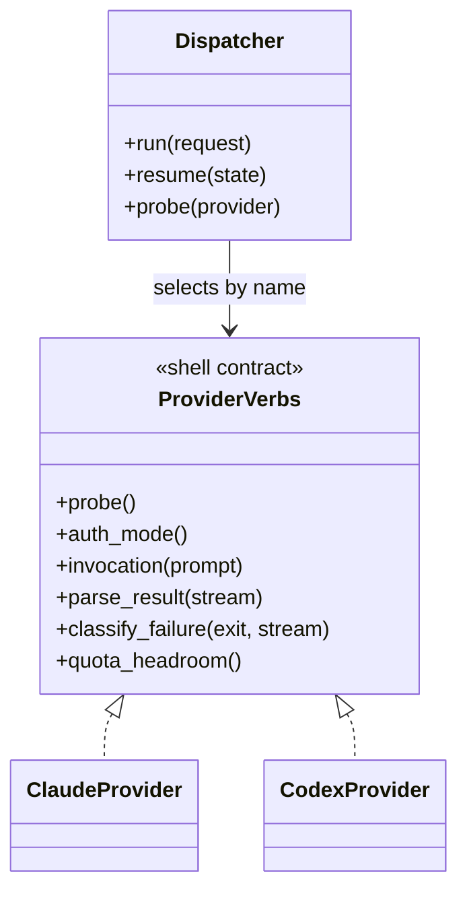

# ADR-0001 — Provider differences behind a shell-function verb contract

> Status: Accepted
> Date: 2026-09-15
> Layer: L8
> Context ticket: research-enhancement

## Context

The dispatcher runs Claude Code and Codex CLI in the pilot and must admit more providers later without a code change at the spawn site (PRD catalog C3; ADR-0004 in `adr/requirements/`). Provider behaviour already lives in one shell file per provider under `hooks/lib/providers/`, glob-sourced by `hooks/lib/provider.sh` and resolved by the built name `afk_<provider>_<member>`; each file carries the same 5 members, an absent member falls back silently, and no test enumerates the member list (SDD §3 API contract row "provider member verbs"; §14 seam row 3, INV-003). The human signed the surface table that names the six verbs (`SIGNED-PACKETS.md` §HL-2).

## Decision

Each provider file implements the same six member verbs: `probe`, `auth_mode`, `invocation`, `parse_result`, `classify_failure`, and optional `quota_headroom`. The dispatcher selects a provider by its configured name and calls only the verb contract. The dispatcher adopts the adapter-family answer shape (`ADAPTERS.md`) and exits 3 when a provider file lacks a verb; this is a deliberate second convention beside the library's silent fallback, because a missing `auth_mode` must never read as "no gate". Existing members stay untouched; the new verbs are appended (SDD §3, §9, §14).

## Alternatives Considered

| Alternative | Pros | Cons | Reason rejected |
|-------------|------|------|-----------------|
| One `case` block per provider inside the dispatcher | one file to read | every new provider edits the spawn site; no conformance row per provider | violates the one-spawn-site rule (SDD §5 AuthZ) and the add-a-harness checklist in `providers/CONFORMANCE.md` |
| A Python provider class per provider | typed, unit-testable | a second provider registry beside `hooks/lib/providers/`; hooks still need the shell view | two homes for one fact (CLAUDE.md "one fact, one home") |
| A JSON provider descriptor (flags only, no code) | declarative | `parse_result` and `classify_failure` need logic; a descriptor cannot express them | insufficient for the failure classes FC-1..FC-12 |

## Consequences

- **Positive** — a new provider is one file plus a conformance probe; the dispatcher never names a provider.
- **Negative** — every provider file must define every verb or exit 3; the hook smoke test that loops over provider files grows by six rows per provider.
- **Follow-ups** — the conformance table gains a row per provider when a live probe records it (PRD Further Notes #4); Gemini, Antigravity and Grok files wait for that probe (ADR-0004 in `adr/requirements/`).
