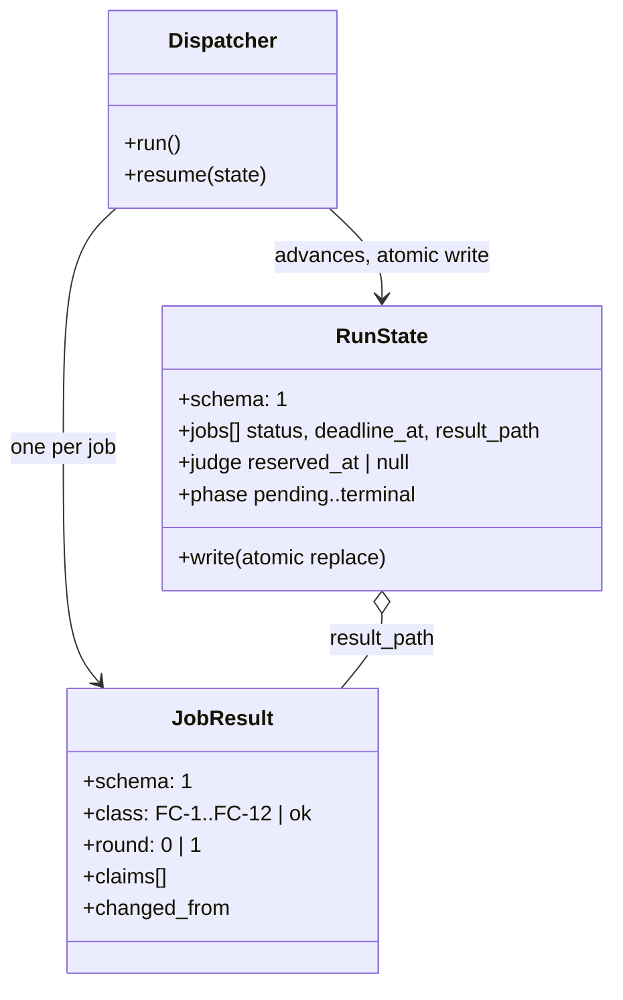

# ADR-0002 — Classified job result and one state file as the resume truth

> Status: Accepted
> Date: 2026-09-15
> Layer: L8
> Context ticket: research-enhancement

## Context

A participant is a subprocess whose exit code alone cannot say why it stopped: a quota window ending, a wrong auth mode, a hung child, and output that fails the schema all matter differently to the run (PRD catalog C2 FC-1..FC-12; SDD §7 failure matrix F-1..F-8). A run may lose its host mid-way and must finish on another host with only read-only jobs (ADR-0004 in `adr/requirements/`; AC-028). The human signed the record shapes (`SIGNED-PACKETS.md` §HL-1: `result.json`, `state.json`) and the state machine with invariants I-1..I-8 (§HL-4).

## Decision

Every job ends in a `result.json` whose `class` field is one value of the tagged union FC-1..FC-12; `ok` is written only after schema validation, so exit 0 is never success by itself (SDD §4 entity design, AC-021). One `state.json` per run is the single source of truth for resume: the dispatcher writes it by temp-file-plus-rename after every job transition, a `done` job never re-runs, and a `running` job past `deadline_at` reads as `timeout` on resume (SDD §5 idempotency; §7 use-case "resume").

## Alternatives Considered

| Alternative | Pros | Cons | Reason rejected |
|-------------|------|------|-----------------|
| Exit code as the only signal | no parsing | quota, billing and timeout collapse into one code; retries fire on the wrong class | the failure matrix needs per-class recovery (SDD §7) |
| A journal as the resume source (replay events) | append-only, matches `plan/JOURNAL.md` | resume must replay and reconcile; two writers race on a shared host | the journal already has its own writers; a replay is a second interpreter of one fact |
| Per-job state files with no run file | no single hot file | the judge reservation and the run phase have no home; resume must scan | the run-level invariants I-1..I-8 need one record |

## Consequences

- **Positive** — every recovery in the failure matrix keys off one field; resume on another host reads one file.
- **Negative** — the schema is a lockstep pair between the dispatcher writer and the consult skill reader; the `-b` collision suffix must stay readable.
- **Follow-ups** — fake-process tests for each class and for atomic resume (PRD test plan); raw streams stay in scratch for `retain_raw_days` to diagnose `invalid_output` and `unknown`.
