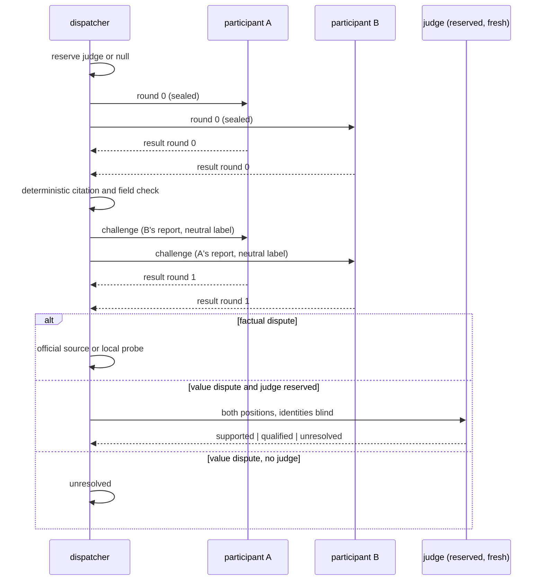

# ADR-0003 — Sealed rounds, one challenge, and a reserved fresh judge

> Status: Accepted
> Date: 2026-09-15
> Layer: L6
> Context ticket: research-enhancement

## Context

Consultation exists to get independent judgment. Peers that see each other's drafts drift toward one wrong consensus, and a judge that shares a provider with one participant prefers output it recognises (`MERGED-PLAN.md` §1 A7 :29, §2 D2 :49, with the cited studies). The plan fixed the protocol; the human signed the state machine that encodes it (`SIGNED-PACKETS.md` §HL-4: round0 → challenge → adjudicated | unresolved; I-2 at most one challenge round) and the acceptance criteria AC-013, AC-014, AC-017 stand in the PRD. Consultation is advisory only (ADR-0007 in `adr/requirements/`).

## Decision

Round 0 reports are sealed: every participant gets the same neutral brief and never sees another report. A deterministic check of citations and fields runs next. Exactly one challenge round follows with neutral labels, shuffled per recipient; `none found` is accepted only with the evidence check cited. A factual dispute gets an official-source or local-probe check. A remaining value dispute goes to a judge that was reserved before dispatch and authored no position, identities blind; when no judge can be reserved the disposition is `unresolved` and both positions reach the human (SDD §7 sequence; F-6).

## Alternatives Considered

| Alternative | Pros | Cons | Reason rejected |
|-------------|------|------|-----------------|
| Open multi-round debate | participants converge | 2–3× tokens; convergence is toward consensus, not truth (`MERGED-PLAN.md` :17) | measured benefit absent; the plan widens defaults only after step 6 |
| Host orchestrator adjudicates | no reservation needed | shares a provider with one participant; self-preference bias (`MERGED-PLAN.md` D2) | named bias; both planners conceded |
| Majority vote on facts | cheap | a vote is metadata, not evidence; two participants cannot vote | facts get a factual check, never a vote (A7) |

## Consequences

- **Positive** — dissent survives to the human; a wrong consensus has one fewer path.
- **Negative** — a reserved judge costs one participant slot for the run; with two participants and no third provider every value dispute ends `unresolved`.
- **Follow-ups** — the pilot measures disposition quality on two features before any default widens (`MERGED-PLAN.md` step 6; ADR-0007 reverse rule in `GRILL-LOG.md`).
