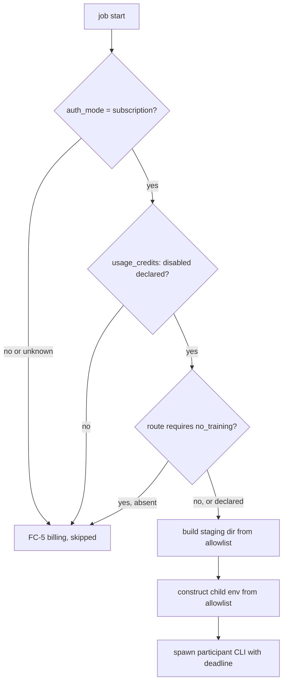

# ADR-0004 — Gate before spawn, with declarations as evidence and an allowlisted staging directory

> Status: Accepted
> Date: 2026-09-15
> Layer: L4
> Context ticket: research-enhancement

## Context

A participant must never draw paid credit, never receive a secret, and never see a file the administrator did not allow (PRD AC-024, AC-030..AC-032, AC-040..AC-044; ADR-0002 and ADR-0006 in `adr/requirements/`). The plugin cannot read a provider's billing ledger; it can read a login status and the administrator's declarations in `.afk/config.yaml`. The human signed the authorization and data-scoping tables (`SIGNED-PACKETS.md` §HL-3) and the outward effects E-1..E-6 (§HL-5), and decided the cross-provider Claude route is opt-in behind one switch (PRD Further Notes #5).

## Decision

The dispatcher runs every check before it builds anything a participant could see: `auth_mode` must be `subscription`; the `usage_credits: disabled` declaration must be present; a route that requires `no_training` blocks without it; an unknown mode fails closed. Only then it builds a staging directory from the approved evidence list (denied and secret-pattern paths never copied; `denied_paths` wins) and a child environment constructed from an allowlist, with every provider API key absent. A refused participant is classified `billing` (FC-5), skipped, and never retried under another auth (SDD §3 sequence; §5 AuthN, AuthZ, data scoping).

## Alternatives Considered

| Alternative | Pros | Cons | Reason rejected |
|-------------|------|------|-----------------|
| Spawn first, classify the billing failure afterwards | simpler flow | content has already left the machine (E-1 irreversible); credit may already be drawn | prevention is the only recovery for E-1 |
| Run the participant in the repository working directory with `denied_paths` only | no copy step | a denied-list misses every new secret pattern; the child can read anything not listed | fail-open by construction |
| Inherit the parent environment minus known keys | one line | a new provider key or a renamed one leaks | allowlist, never a denylist (AC-024) |
| Infer credit and training treatment from the auth type | no declarations | Anthropic's articles do not let the plugin know; the administrator does (ADR-0002) | the declaration is the administrator's evidence, not the plugin's |

## Consequences

- **Positive** — a participant never sees a file, a key or a prompt before every gate passes; a policy change (decision B) flips one config key.
- **Negative** — an administrator must declare `usage_credits: disabled` per destination or the route blocks; a stale login blocks a run until fixed.
- **Follow-ups** — fixtures for `claude auth status --json` field names (PRD #1) and a user-gated live probe of silent credit draw (PRD #3) before step 5; three separate Codex environment tests (AC-043).
