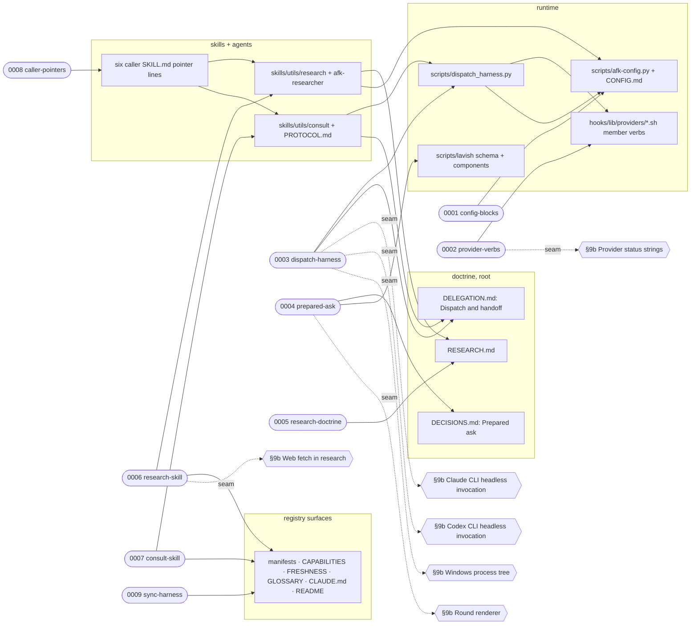

# Execution Plan — Research, prepared asks, and multi-provider consultation

> Parent ticket: research-enhancement   Mode: cited
> Sources: [PRD](../PRD.md) · [SDD](../SDD.md) · [ADRs](../adr/) · [investigations](../investigations/) · [signed packets](../SIGNED-PACKETS.md)
> Branch (for /afk:execute): feat/research-enhancement
> Last updated: 2026-09-16 (status column maintained by /afk:execute)
> Feature: in-progress   <!-- /afk:smoke-test stamps "complete (smoke green …)" iff a smoke gate exists -->
> Review policy: lean   <!-- lean | full — slice review-gate roster; semantics owned by skills/afk/review/SKILL.md "Gate policy". Seeded lean; flip to full by hand for the full roster on every slice; absent (older plans) reads full -->

Slicing follows SDD §8 module boundaries, in the step order the PRD adopts: config + dispatcher fixtures first, then research, then the consultation protocol, then the caller pointers; provider conformance (live probes) stays outside this plan (SDD §14 compatibility finding (3)). Modules "prepared ask" and "round renderer + schema" share one subtask because the PRD binds them to one commit. Tests cover every module except doctrine prose; no test runs a live paid provider.

## Solution map

## Seam register

| § | Seam (SDD §9b row) | Implemented by | Used by |
|---|--------------------|----------------|---------|
| 1 | "Claude CLI headless invocation" | 0003-dispatch-harness | 0007-consult-skill |
| 2 | "Codex CLI headless invocation" | 0003-dispatch-harness | 0007-consult-skill |
| 3 | "Provider status strings" | 0002-provider-verbs | 0003-dispatch-harness |
| 4 | "Web fetch in research" | 0006-research-skill | — |
| 5 | "Windows process tree" | 0003-dispatch-harness | 0007-consult-skill |
| 6 | "Round renderer" | 0004-prepared-ask | — |

Every `## Seams` row in a contract also names the SDD §14 row that designed it and the investigation id (`INV-NNN`) that closed it; ledgers live under `../investigations/`.

## Progress tracker

| # | Subtask | Title | Status | Blocked by | Tiers | Seams |
|---|---------|-------|--------|------------|-------|-------|
| 1 | 0001-config-blocks | `research:` and `consultation:` config blocks | pending | — | static, unit | — (§14 config reader) |
| 2 | 0002-provider-verbs | six member verbs per provider file | pending | — | static, unit | impl §3 |
| 3 | 0003-dispatch-harness | the participant dispatcher | pending | 0001-config-blocks, 0002-provider-verbs | static, unit, integration | impl §1, §2, §5; use §3 |
| 4 | 0004-prepared-ask | prepared-ask bar + two optional debate-card fields | pending | — | static, unit | impl §6 |
| 5 | 0005-research-doctrine | `RESEARCH.md` root doctrine | pending | — | static | — (§14 doctrine pointers) |
| 6 | 0006-research-skill | `/afk:research` + `afk-researcher` agent | pending | 0001-config-blocks, 0005-research-doctrine | static, unit, integration | impl §4 |
| 7 | 0007-consult-skill | `/afk:consult` + protocol sibling | pending | 0001-config-blocks, 0003-dispatch-harness | static, unit, integration | use §1, §2, §5 |
| 8 | 0008-caller-pointers | one pointer line per plug-in point | pending | 0006-research-skill, 0007-consult-skill | static, unit | — (§14 caller skills) |
| 9 | 0009-sync-harness | harness sync, glossary terms, trace matrix | pending | every other subtask | static | — (§14 registry) |

Status values: `pending` → `designing` → `developing` → `verifying` → `reviewing` → `done`,
or `blocked(<reason>)`. <!-- status set: lockstep copy — owned by /afk:execute (progress-tracker status column) -->
`/afk:execute` advances the row it is working and writes
the date in the header; everything else in PLAN.md is yours to edit.

Per-subtask review deviations: 0003-dispatch-harness opts in `resilience, logic-correctness` at its slice gate (the subprocess and file-write pattern every later slice imitates). Every other slice takes the plan default.

## Feature smoke gate (minimal)

No `VERIFICATION-PLAN.md` sits beside the PRD, so the gate is the minimal shape. This repository declares no `verification.tiers` block in `.afk/config.yaml` and selects no build-gate kind; the `app-start`, `existing e2e suite` and `existing api suite` rows are therefore dropped at seeding time, and the two remaining rows carry the plugin's own suites (`README.md` "Dev loop": hook smoke + pytest + gates) as their command.

| # | Check | Command | Status |
|---|-------|---------|--------|
| 1 | compile | `python -m py_compile scripts/afk-config.py scripts/dispatch_harness.py scripts/lavish/schema.py scripts/lavish/components.py skills/utils/research/scripts/*.py skills/utils/consult/scripts/*.py` + `bash -n hooks/lib/providers/*.sh` + `python hooks/run-hook.py plugin stop-gates.sh` | |
| 3 | regression | `python -m pytest scripts/tests -q` + `bash hooks/tests/hook-smoke.sh` | |

Last run: —
