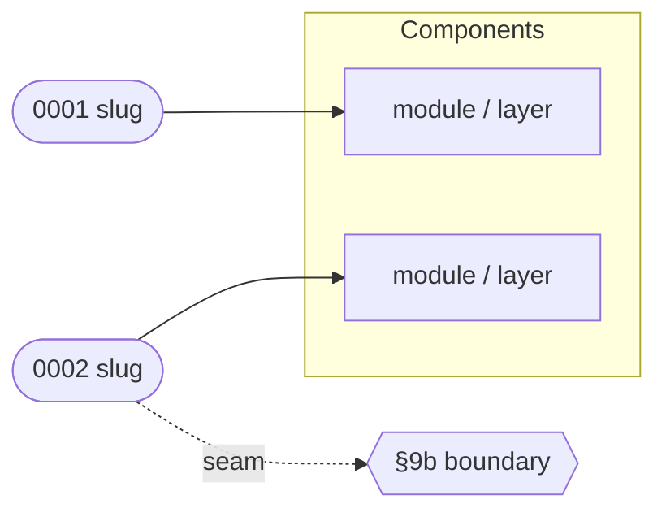

# PLAN.md (the index)

````
# Execution Plan — {Feature Name}

> Parent ticket: {TICKET-ID}   Mode: cited | uncited
> Sources: [PRD](../PRD.md){cited: · [SDD](../SDD.md) · [ADRs](../adr/)}
> Branch (for /afk:execute): mvu/afk/{ticket-id-lower}
> Last updated: {YYYY-MM-DD} (status column maintained by /afk:execute)
> Feature: in-progress   <!-- /afk:smoke-test stamps "complete (smoke green …)" iff a smoke gate exists -->

## Solution map

A diagram mapping each subtask to the parts of the solution it touches, so a
reviewer sees coverage and overlap at a glance. Mark every seam edge with the
`seam` label so the critical boundaries stand out.



## Seam register   <!-- cited mode only; omit whole section in uncited -->

| § | Seam (SDD §9b row) | Implemented by | Used by |
|---|--------------------|----------------|---------|
| 1 | "<boundary>" | 0002-slug | 0004-slug, 0005-slug |

## Progress tracker

| # | Subtask | Title | Status | Blocked by | Tiers | Seams |
|---|---------|-------|--------|------------|-------|-------|
| 1 | 0001-slug | … | pending | — | static, unit | — |
| 2 | 0002-slug | … | pending | — | static, unit, integration | impl §1 |
| 3 | 0003-slug | … | pending | 0002-slug | static, unit, e2e | use §1 |

Status values: `pending` → `designing` → `developing` → `verifying` → `done`,
or `blocked(<reason>)`. `/afk:execute` advances the row it is working and writes
the date in the header; everything else in PLAN.md is yours to edit.

## Feature smoke gate   <!-- present iff a VERIFICATION-PLAN.md exists; omit whole section otherwise -->

> Gate: /afk:smoke-test   Suite: 11700-payable/verification   Target env: local | staging
> Run (ui-e2e): cd verification/ui-e2e && npm run smoke   (full incl. env-limited: npm run smoke:all)
> Run (api): cd verification/api && node --test
> Source: ../VERIFICATION-PLAN.md   Built by: NNNN-smoke-e2e (UI) · NNNN-smoke-api (API) — terminal, blocked by all
> Last run: — (date + target; maintained by /afk:smoke-test)

Integrated verification scenarios that decide "feature complete", seeded from
`VERIFICATION-PLAN.md` (one row per scenario, both modalities). A `ui-e2e` row
traces to a PRD User Story and maps to a `Scenario` in the ui-e2e Gherkin catalog;
an `api` row traces to an SDD §3 row / PRD Acceptance Criterion and maps to a
`node:test` in `verification/api`. `/afk:smoke-test` runs them against a running
app and owns the Status column + the header `Feature:` line; the rows themselves
are seeded here. An `env-limited` scenario (e.g. `@sap`, GL-post) carries that
flag from `VERIFICATION-PLAN.md` — the gate excludes it from its green verdict.

| # | Scenario (integrated) | Modality | Traces to | Spec | Status |
|---|-----------------------|----------|-----------|------|--------|
| 1 | <journey in plain language> | ui-e2e | PRD User Story N | ui-e2e/features/<f>.feature ▸ "<scenario>" | pending |
| 2 | <call → asserted envelope> | api | SDD §3 row "..." · PRD AC k | api/<f>.test.mjs ▸ "<test>" | pending |
| 3 | <journey, env-gated> | ui-e2e | PRD User Story M | ui-e2e/features/<f>.feature ▸ "<scenario>" | env-limited |
````
