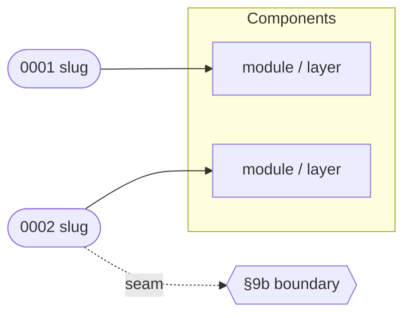

# afk:to-subtasks — slice a PRD (+ SDD/ADRs) into a local execution plan

This skill turns a finished design into a **plan you can read, review, and
track** — entirely on disk, no tracker writes. It emits a `plan/` directory
sibling to the PRD:

```
{TICKET-ID}/
  PRD.md  SDD.md  adr/…
  plan/
    PLAN.md          # index: solution map, seam register, progress tracker
    0001-{slug}.md   # one contract per subtask, in rank order
    0002-{slug}.md
    …
```

`PLAN.md` is the artifact a human scans to understand the plan, spot the
critical parts (the seams), and watch progress as `/afk:execute` works each
subtask. The per-subtask files are the binding contracts `/afk:execute` parses.

The plan is the load-bearing interface between this skill (emitter) and
`/afk:execute` (parser + progress writer). They live in the same repo so the
contract is enforced by a single commit — change a section here, change the
parser there, same commit.

## Two modes, set by what's upstream

| You came from | On disk | Mode | What the plan carries |
|---|---|---|---|
| `/afk:grill-solution` → `/afk:to-sdd` | PRD **+ SDD + ADRs** | **cited** | binding design refs, typed `## Produces`/`## Consumes` graph, per-subtask `## Seams` (SDD §9b), citation-tagged Acceptance |
| `/afk:grill-requirements` → `/afk:to-prd` only | PRD, **no SDD** | **uncited** | PRD-derived Goal/Scope/Acceptance, tiered Verification; no binding contract |

Cited mode is the default whenever an `SDD.md` sits next to the PRD. Uncited
mode is for small features / bugs / refactors / tooling where an SDD would be
overkill — and it is **human-gated**: never decide on your own that the design
warrants no SDD (see "Design-doc optionality").

## Arguments

- `prd_path` — the PRD (`.../{TICKET-ID}/PRD.md` or `tasks/{TICKET-ID}/PRD.md`).
- `sdd_path` *(optional)* — defaults to the PRD's sibling `SDD.md`. Present →
  cited mode.
- `ticket_id` — parent Enhancement/Bug key (e.g. `P2P-1220`), used only to label
  the plan and the eventual branch. **Nothing is written to Jira.**
- `skip_design_docs` *(optional, default false)* — human override to slice
  uncited even though an SDD might be warranted.
- `smoke_e2e` *(optional, default: ask)* — human-gated: does this feature need a
  browser smoke suite as its completion gate? `yes` → emit a `## Feature smoke
  gate` in PLAN.md + a terminal `NNNN-smoke-e2e` authoring subtask (see
  "Feature smoke gate" below). Like the SDD call, never decide on your own.

## Process

1. **Read the sources.** `ctx_read` the PRD (mode=full) and the parent ticket
   description for context (target branch, components). In cited mode also read
   `SDD.md` (full) and every `adr/{requirements,design}/NNNN-*.md`
   (mode=signatures). The set of `(SDD section IDs, §9b seam rows, ADR IDs)` is
   your **citation pool** — every cited subtask references at least one entry.

2. **Refuse-to-slice gate (cited mode).** A plan built on an unstable SDD ships
   the instability into every subtask. Before slicing, scan the SDD + every ADR
   and **refuse on any hit** — print offenders, bounce to `/afk:grill-solution`
   + `/afk:to-sdd`:
   - **Executor-blocking markers** — the canonical blocker set `/afk:to-sdd`
     Step 7 enforces (`\bTBD\b`, `\bTODO\b`, `\bFIXME\b`, `\bXXX\b`, `\?\?\?`,
     `<TBD>`/`<TODO>`/`<placeholder>`/`<fill>`/`<\?>`, `\[\?\]`,
     `_?FILL[_-]?IN_?`, `\(decide later\)`/`\(unresolved\)`/`\(open\)`,
     unsubstituted template literals like `<TICKET-ID>`/`{Feature Name}`), plus
     §13 Open-Questions rows marked `Blocks executor? = yes`. Skip code-block
     contents (real generics `<T>`, nullable `Foo?` are not blockers).
   - **Library-version pins** — every pin the SDD/ADR cites (`Spring Boot
     3.2.4`, `Vue 3.4`, …) must match the build manifest (`pom.xml` + BOM /
     `build.gradle` / `package-lock.json` / `pyproject.toml`). A divergent pin
     means a fictional API surface — refuse, unless the SDD labelled it
     `"inherited from {BOM}; not a direct pin"` (the documented escape hatch).

   Uncited mode skips this gate — the human has accepted the PRD as the only
   source of truth.

3. **Slice into subtasks.** A good subtask is independently buildable (no
   dependency on an unlanded sibling except via `## Blocked by`), bounded by a
   clear Scope (one or two globs), verifiable on its own, and sized for one
   `/afk:execute` sitting (~1 hour). In cited mode, **slice along SDD §8 module
   boundaries** — one subtask per module's public interface. If you find
   yourself splitting a §8 module, the SDD is too coarse: bounce, don't invent a
   split that contradicts §8. Aim for 4–10 subtasks; more than 10 means the PRD
   is too big or the slice too fine.

   **Decide the smoke gate.** Resolve `smoke_e2e` (ask if unset — see "Feature
   smoke gate"). If `yes`, append one **terminal** subtask
   `NNNN-smoke-e2e.md` that *authors* the feature's browser smoke specs:
   `## Blocked by` **every** other subtask, `## Scope` the e2e suite dir
   (`11700-payable/e2e/<feature>`), Acceptance tracing to the gate's scenarios,
   and an `e2e` `## Verification` row running the new specs locally. It is normal
   `/afk:execute` work — the specs land as reviewed code. The integrated gate
   itself is `/afk:smoke`, run after this subtask is `done` (not part of this
   skill).

4. **Write each subtask file** `plan/NNNN-{slug}.md` in rank order, using the
   contract below. `NNNN` is the zero-padded rank; `{slug}` is a short kebab
   title. The subtask's **id** is `NNNN-{slug}` — that's what `## Blocked by`,
   `## Consumes`, and the tracker reference (no Jira keys anywhere).

5. **Write `PLAN.md`** (the index) using the PLAN template below: the solution
   map, the seam register (cited), and the progress tracker seeded with every
   subtask at status `pending`. `/afk:execute` owns the tracker's status column
   from here on.

6. **Validate the slice** (see "Validation"). Cited mode runs the contract-graph
   + anchor-quality + Acceptance-citation + seam-coverage checks; all must pass
   before the plan is considered emitted. Uncited mode runs only the
   Verification-tier and Scope sanity checks.

7. **Output.** Print the plan path and a one-line-per-subtask summary (id,
   title, tiers, seams touched, blocked-by) so the human can review before any
   execution. Flag every seam-touching subtask explicitly — those are the rows
   worth a careful human read.

## Subtask contract (`plan/NNNN-{slug}.md`)

`/afk:execute` parses these section headings exactly. Keep them verbatim.

```
## Goal
<one paragraph: what this subtask delivers>

## Design refs
<cited>
- SDD: SDD.md#<anchor> — <one phrase on what it binds>
- ADR: adr/design/NNNN-*.md — <one phrase>
<uncited>
(none — sliced from the PRD without an SDD, per human approval)

## Scope
- <glob 1>
- <glob 2>

## Seams
<cited — the SDD §9b external seams this subtask touches; mark each implement|use>
- implement: <SDD §9b row "boundary"> — this subtask owns the seam's code + seam-test
- use: <SDD §9b row "boundary"> — this subtask calls across it; relies on its contract
<uncited or no seam>
(none — no SDD seam register)

## Acceptance
<cited — every bullet ends with a citation tag: (PRD §X.Y) / (SDD §N) /
(SDD §N row "...") / (SDD §9b row "...") / (ADR-NNNN)>
- [ ] <criterion> (PRD §X.Y)
- [ ] Implements the public interface in SDD §8 row "<module>" unmodified (SDD §8)
- [ ] Conforms to ADR-<NNNN> — no silent pattern substitution (ADR-NNNN)
- [ ] Every artifact in ## Produces compiles + matches its declared signature (SDD §8)
- [ ] <iff this subtask implements a §9b seam> Seam-test asserts on <framework>'s
      real output (serialized result / generated schema / surfaced error), not our
      intermediate objects (SDD §9b row "<boundary>")
<uncited — bullets reference PRD prose, no tags>
- [ ] <criterion referencing User Story N>

## Produces
<cited — one bullet per consumer-visible artifact this subtask creates>
- <file-path>#<grep-anchor> — <one-line contract>
<uncited — omit this block>

## Consumes
<cited AND Blocked by non-empty — one bullet per upstream artifact read>
- <PRODUCER-ID> <file-path>#<grep-anchor> — <what we expect>
<otherwise — omit this block>

## Verification
<tiered — one row per tier this subtask needs; static is always present.
The implementor (/afk:execute) must turn EVERY listed tier green.>
| Tier | Check (command or method) | Proves |
|------|---------------------------|--------|
| static | `<compile/lint/type cmd>` + grep the ## Produces anchors | code builds; declared symbols present |
| unit | `<unit test cmd, e.g. mvn -pl {module} test -Dtest=FooTest>` | unit behavior |
| integration | `<cmd>` | cross-module wiring / persistence / framework pickup |
| e2e/browser | `<cmd, e.g. npx playwright test specs/foo.spec.ts>` | user-visible flow end-to-end |

## Parent PRD
<prd_path>

## Parent SDD
<sdd_path or "(none — uncited mode)">

## Blocked by
<subtask ids (NNNN-slug) or "(none)">

## Conflict procedure
If a binding decision in SDD/ADR is wrong / infeasible / contradicts reality
during implementation, exit `design_conflict` quoting the SDD section + the
conflict. Do NOT override silently. Route back to `/afk:grill-solution` for a
superseding ADR.
(omit this block in uncited mode)

## Implementation Notes (auto-maintained)
<!-- /afk:execute appends one note per run; humans may add prose around it -->
```

### Choosing verification tiers

Pick the tiers the change actually demands — don't pad, don't under-cover:

- **static** is always present: it compiles/lints and greps the `## Produces`
  anchors so the declared symbols exist. A pure rename / config / docs subtask
  may be static-only.
- **unit** whenever the subtask adds behavior worth asserting in isolation.
- **integration** for cross-module wiring, persistence, or framework-pickup
  (e.g. the liquibase-hibernate7 entity-pickup check for a JPA entity, or a
  §9b seam-test asserting on the framework's real serialized/generated output).
- **e2e/browser** for user-visible flows — a Playwright/Cypress spec that drives
  the actual UI. A backend-only subtask omits this; a UI subtask must not.

A subtask that **implements** a §9b seam must carry the seam's test as a
Verification row (unit or integration tier) asserting on the framework's real
output, not our DTO — it's the only test that covers the boundary.

### Feature smoke gate (optional, human-gated)

The per-subtask `e2e/browser` tier proves **one slice's** UI in isolation. A
feature may also want an **integrated smoke gate**: the cross-subtask user
journeys, run against a real running app, as the final "feature complete" check —
and reused afterward by CI / scheduled jobs / manual sanity runs. That gate is a
separate skill (`/afk:smoke`); this skill only **decides** it and **specifies**
it.

Whether a feature needs one is a per-feature human call (like the SDD). If
`smoke_e2e` is unset, **ask**:

> *Does this feature need a browser smoke suite as its completion gate
> (integrated journeys against a running app, reused for CI / scheduled checks)?
> Yes → I add a `## Feature smoke gate` to PLAN.md and a terminal smoke-spec
> subtask. No → the per-subtask e2e tiers are the only browser coverage.*

When `yes`, emit **both**:

- **The PLAN.md `## Feature smoke gate` section** (template below): each scenario
  is an integrated user journey traced to a PRD User Story, plus the suite path,
  the run command, and the target env. Draw the scenarios from the PRD's top
  User Stories — they are the feature's definition-of-done flows.
- **The terminal `NNNN-smoke-e2e` subtask** (Process step 3): authors those
  scenarios as real specs in the e2e suite, blocked by every other subtask.

Record the human's `smoke_e2e` choice in the output so it's auditable.

## PLAN.md (the index)

````
# Execution Plan — {Feature Name}

> Parent ticket: {TICKET-ID}   Mode: cited | uncited
> Sources: [PRD](../PRD.md){cited: · [SDD](../SDD.md) · [ADRs](../adr/)}
> Branch (for /afk:execute): mvu/afk/{ticket-id-lower}
> Last updated: {YYYY-MM-DD} (status column maintained by /afk:execute)
> Feature: in-progress   <!-- /afk:smoke stamps "complete (smoke green …)" iff a smoke gate exists -->

## Solution map

A diagram mapping each subtask to the parts of the solution it touches, so a
reviewer sees coverage and overlap at a glance. Mark every seam edge with the
`seam` label so the critical boundaries stand out.



## Seam register   <!-- cited mode only; omit whole section in uncited -->

| § | Seam (SDD §9b row) | Implemented by | Used by |
|---|--------------------|----------------|---------|
| 1 | "<boundary>" | 0002-slug | 0004-slug, 0005-slug |

## Progress tracker

| # | Subtask | Title | Status | Blocked by | Tiers | Seams |
|---|---------|-------|--------|------------|-------|-------|
| 1 | 0001-slug | … | pending | — | static, unit | — |
| 2 | 0002-slug | … | pending | — | static, unit, integration | impl §1 |
| 3 | 0003-slug | … | pending | 0002-slug | static, unit, e2e | use §1 |

Status values: `pending` → `designing` → `developing` → `verifying` → `done`,
or `blocked(<reason>)`. `/afk:execute` advances the row it is working and writes
the date in the header; everything else in PLAN.md is yours to edit.

## Feature smoke gate   <!-- present iff smoke_e2e = yes; omit whole section otherwise -->

> Gate: /afk:smoke   Suite: 11700-payable/e2e/<feature>   Target env: local | staging
> Run: <command, e.g. npx playwright test e2e/<feature>>
> Authored by: NNNN-smoke-e2e (terminal subtask, blocked by all)
> Last run: — (date + target; maintained by /afk:smoke)

Integrated user journeys that decide "feature complete". Each traces to a PRD
User Story. `/afk:smoke` runs them against a running app and owns the Status
column + the header `Feature:` line; the rows themselves are seeded here.

| # | Scenario (integrated journey) | Traces to | Spec | Status |
|---|-------------------------------|-----------|------|--------|
| 1 | <journey in plain language> | PRD User Story N | e2e/<feature>/foo.spec.ts | pending |
| 2 | <journey> | PRD User Story M | e2e/<feature>/bar.spec.ts | pending |
````

## Validation

Run before declaring the plan emitted. **Cited mode** runs (a)–(f);
**uncited mode** runs only (e) and (f). Check **(g)** runs in either mode
whenever `smoke_e2e = yes`.

**(a) Contract graph.** Walk every `## Consumes` line: `{PRODUCER-ID}` must
resolve to a subtask **earlier in rank order** (forward refs = circular dep;
bounce), and `{file}#{anchor}` must appear verbatim in that producer's
`## Produces`. A consumer expecting a signature the producer doesn't declare is
a broken slice — refuse, name the pair. Orphan producers (no consumer, not a
leaf) are warn-level — surface them.

**(b) Anchor quality.** For every `## Produces` `{grep-anchor}`: not a forbidden
generic token (`class`, `interface`, `void`, `function`, `def`, `method`,
`struct`, `enum`, `type`, `record`); length ≥12 chars; trial `ctx_search`
against `{file}` at HEAD returns ≤1 match (≥2 = ambiguous → would fail-open at
runtime → refuse). New files: trial grep N/A, the first two checks still apply.

**(c) Acceptance citations.** Every cited bullet ends with `(PRD §…)` / `(SDD
§…)` / `(SDD §9b row "…")` / `(ADR-NNNN)`, and the citation **resolves** (grep
the target file — a phantom citation is worse than none). At least one bullet
cites the SDD §8 module row this subtask owns.

**(d) Seam coverage.** Every SDD §9b seam appears in the seam register with a
named implementer; the implementing subtask lists it `implement:` in `## Seams`
and carries its seam-test as a Verification row. A seam sliced without its
framework-output test fails the slice — that's the gap green unit tests hide.
Every `use:` seam points at a real register row.

**(e) Verification tiers.** Every subtask's `## Verification` has at least the
`static` row; tiers are appropriate to the change (UI subtask → e2e present;
JPA entity → integration/pickup present). Every command is runnable from repo
root.

**(f) Scope sanity.** Globs are concrete (no bare `**`), and the union of all
subtask Scopes covers the PRD's stated work with no silent gap.

**(g) Smoke gate (iff `smoke_e2e = yes`).** PLAN.md has a `## Feature smoke
gate` with ≥1 scenario, each tracing to a real PRD User Story (grep the PRD).
A terminal `NNNN-smoke-e2e` subtask exists, `## Blocked by` **every** other
subtask, with the e2e suite dir in `## Scope` and an `e2e` `## Verification`
row. Every gate scenario maps to a spec the terminal subtask is responsible for.
Conversely, if `smoke_e2e = no`, neither the section nor the terminal subtask is
present (don't emit a half-gate).

## Hard rules

- **No tracker writes.** This skill only writes files under `plan/`. It creates
  no Jira issue, sets no label, opens no branch. (`/afk:execute` self-creates
  the branch.)
- **The plan round-trips.** `/afk:execute` parses these exact section headings;
  if you add/rename/reorder a section, update the `/afk:execute` parser in the
  same commit (lockstep).
- **Don't fabricate Acceptance.** Every bullet traces to the PRD or (cited) the
  SDD/an ADR; cited bullets carry a resolving citation tag (validation (c)).
- **Don't invent a public interface.** Cited interfaces come from SDD §8
  verbatim; a missing one is a design gap → bounce to `/afk:grill-solution`.
- **Verification is part of the plan, not an afterthought.** Every subtask
  declares the tiers it needs and the exact commands; `static` is mandatory, and
  the highest tier the change demands (up to e2e/browser) must be present.
- **Seam-implementing subtasks carry the seam-test** as a Verification row
  asserting on the framework's real output, not our DTO.
- **JPA-entity subtasks verify liquibase-hibernate7 pickup** (core-services Java
  only): a `## Produces` `.java` file with `@Entity` / `@MappedSuperclass` /
  `@Embeddable` must list an integration-tier row running the documented pickup
  check (`mvn -pl {module} compile liquibase:diff …` then grep the diff for the
  entity/column) — not just a unit test against the entity in isolation.
- **Uncited mode is human-approved per ticket.** Never decide on your own that
  the design needs no SDD.
- **The smoke gate is all-or-nothing and human-decided.** `smoke_e2e = yes`
  emits both the `## Feature smoke gate` section AND the terminal
  `NNNN-smoke-e2e` subtask (blocked by all); `no` emits neither. Never decide on
  your own that a feature needs (or skips) a browser smoke gate. This skill only
  specifies the gate — running it is `/afk:smoke`'s job.

## Design-doc optionality

Not every ticket warrants an SDD; the human decides. New complex feature
(≥2 modules / new pattern / non-trivial txn or data) → SDD **required**, refuse
to slice cited-less unless `skip_design_docs=true`. Small enhancement / bug fix
/ refactor / tooling → uncited is fine. When no `SDD.md` is on disk and
`skip_design_docs` is unset, **ask** before proceeding:

> *No SDD found at `{path}`. Slice from the PRD alone (uncited), or pause and run
> `/afk:grill-solution` + `/afk:to-sdd` first?*

Record the human's choice in the output so it's auditable.

## Next

The plan is on disk. Review `PLAN.md` — especially the seam register and any
seam-touching subtasks. Then work the subtasks one at a time, in rank order
(respecting `## Blocked by`): in a session on the parent branch, run
**`/afk:execute {NNNN-slug}`** for each. Each run advances that subtask's status
in the tracker, drives it through design → develop → verify (every declared
tier green), commits, pushes, and updates the Draft MR — then stops at CR/Merge
for you.

If the plan has a `## Feature smoke gate`, the terminal `NNNN-smoke-e2e` subtask
authors its specs last (it's blocked by everything). Once **every** subtask is
`done`, run **`/afk:smoke`** as the feature-completion gate: it runs the
integrated browser journeys against a running app and, only on green, stamps
`Feature: complete` in PLAN.md. That suite then serves CI / scheduled / manual
sanity runs.
