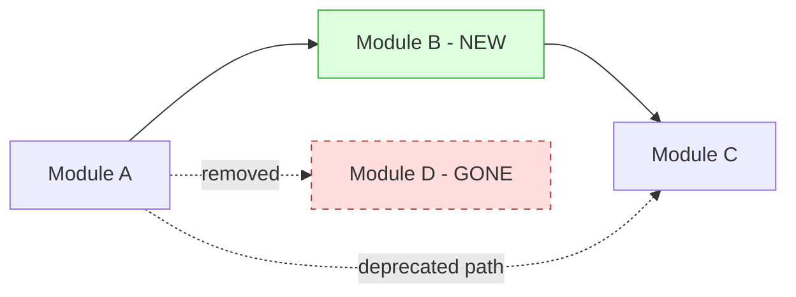
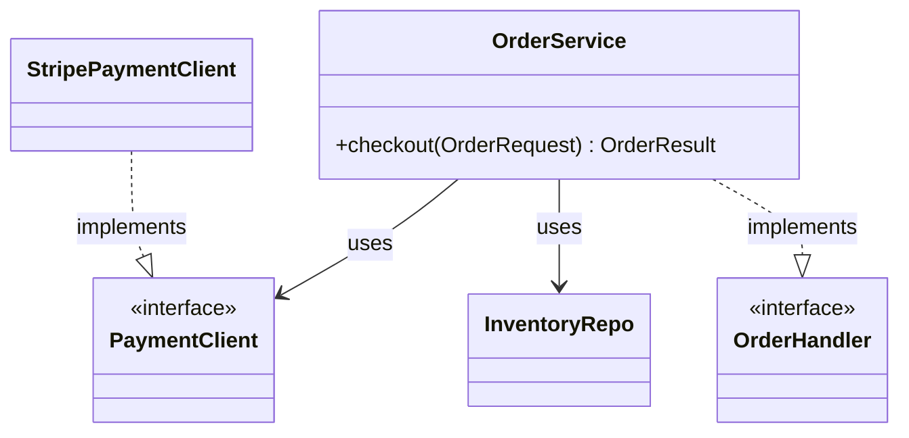
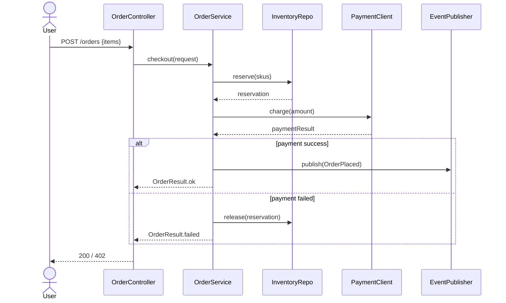
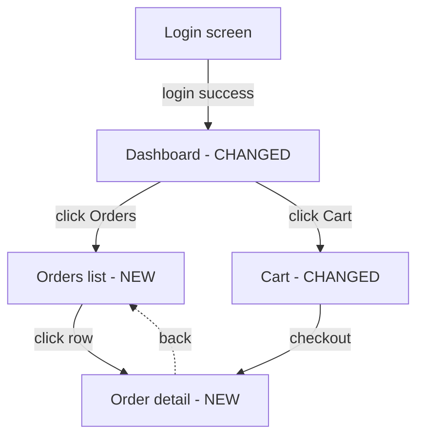
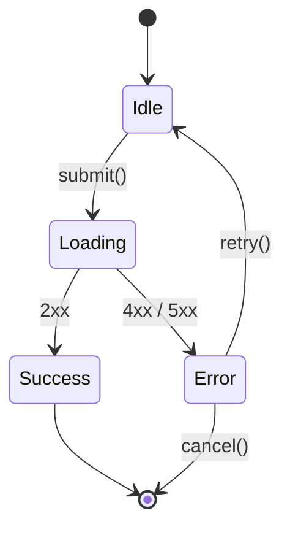

# Mermaid templates + tips

Referenced from [SKILL.md](SKILL.md) step 9. Each section below is pasted **verbatim** into the matching layer agent's `mermaid_guidance` slot — only the section(s) relevant to that layer.

All Mermaid blocks must use ` ```mermaid ` fence. Syntax verbatim — never paraphrase keywords. Unsure of a feature → omit rather than guess (broken diagram renders nothing).

---

## flowchart LR
Used by: **L4 modules**, optionally **L3 architecture** (decision tree).

**Purpose:** modules + dependencies left-to-right. Boxes = modules / packages / services. Edges = "depends on" / "calls" / "publishes".

**Template:**


**Do:**
- Annotate node text w/ ` - NEW` / ` - CHANGED` / ` - GONE` suffix.
- Edge labels in quotes: `-->|"calls"|`.
- Use `classDef` to color new/gone nodes.
- Keep to **<15 nodes** — split into multiple diagrams if more.

**Don't:**
- Mix LR with TD in one diagram — pick one direction per diagram.
- Use unquoted edge labels w/ spaces (parser breaks).
- Draw every transitive dependency — only direct + meaningful.

---

## classDiagram
Used by: **L5 classes**.

**Purpose:** relationships between key classes. **Sparse** — skip member listings unless the signature is the whole point.

**Template:**


**Relationship arrows (memorize):**
- `-->` association (uses)
- `..>` dependency (transient use)
- `..|>` realizes / implements interface
- `--|>` extends class
- `*--` composition (lifetime owns)
- `o--` aggregation (lifetime independent)

**Do:**
- Mark interfaces w/ `<<interface>>` / abstract w/ `<<abstract>>`.
- Show ONE public method only if signature is non-obvious — otherwise empty class block.
- Cap at ~8 classes per diagram.

**Don't:**
- List every field / method (IDE territory).
- Show framework parents (Spring `ApplicationContext`, JPA `EntityManager`, etc).
- Diagram pure DTOs / records — call out in prose instead.

---

## sequenceDiagram
Used by: **L6 logic**.

**Purpose:** end-to-end flow for one scenario. Actor + participants + messages + branches + parallel paths.

**Template:**


**Arrow types:**
- `->>` solid arrow w/ head (sync call)
- `-->>` dashed arrow w/ head (response / async)
- `->>+` activate participant (lifeline bar)
- `-->>-` deactivate

**Branches + loops:**
- `alt / else / end` — if/else
- `opt / end` — optional path
- `loop label / end` — loop block
- `par / and / end` — parallel paths

**Do:**
- Declare participants up front w/ short aliases (`participant Svc as OrderService`).
- One scenario per diagram — multiple scenarios = multiple diagrams.
- Show decision points + side effects (DB writes, event publishes).
- Keep to **<15 messages** per diagram — split scenario if longer.

**Don't:**
- Show framework internals (Spring proxies, AOP intercepts) unless that IS the change.
- Inline arbitrary code in messages — keep labels to method names.
- Mix unrelated scenarios in one diagram.

---

## flowchart TD + stateDiagram-v2
Used by: **L7 ui**.

### flowchart TD (screen graph)

**Template:**


**Do:**
- Node text = screen name + change tag.
- Edge labels = user action that triggers transition.
- Dashed edges (`-.->`) for "back" / "cancel" / non-primary transitions.

**Don't:**
- Show component tree (parent / child relationships) — that's not a user-flow concern.
- Draw every modal — only modals that change the user's journey.

### stateDiagram-v2 (non-trivial component state)

**Template:**


**Do:**
- Use for components w/ 4+ states or non-obvious transitions.
- `[*]` = initial / terminal.
- Transitions labeled w/ trigger (event / API result).

**Don't:**
- Diagram every modal's open/close state.
- Show implicit Vue reactive recomputes — that's the framework, not the state machine.

---

## erDiagram
Used by: **L8 data**.

**Purpose:** show DB tables / entity relationships. Annotate NEW / CHANGED / GONE.

**Template:**
```mermaid
erDiagram
    ORDERS ||--o{ ORDER_ITEMS : contains
    CUSTOMERS ||--o{ ORDERS : places
    ORDERS ||--o{ INVENTORY_RESERVATIONS : holds

    ORDERS {
        bigint id PK
        bigint customer_id FK
        varchar status
        timestamp created_at
        decimal total NEW
    }
    ORDER_ITEMS {
        bigint id PK
        bigint order_id FK
        varchar sku
        int quantity
    }
    CUSTOMERS {
        bigint id PK
        varchar email
    }
    INVENTORY_RESERVATIONS {
        bigint id PK
        bigint order_id FK
        varchar sku
        int quantity
        timestamp expires_at
    }
```

**Cardinality:**
- `||--o{` one-to-many (one orders, many order items)
- `||--||` one-to-one
- `}o--o{` many-to-many
- Spec: left side (`||`, `o|`, `}o`, `}|`) = parent end; right side = child end. `|` = exactly one, `o` = zero/one, `}` = many.

**Do:**
- List PK / FK / type per column.
- Annotate `NEW` / `CHANGED` / `GONE` as column-level suffix.
- Annotate `NEW` on table name when whole table is added.

**Don't:**
- List every column on a wide existing table — only changed columns + PK + FK.
- Diagram pure index changes — call out in prose.

---

## Common pitfalls

- **Render-safety** (reserved words, label quoting, newlines via `<br/>`, `%%` comment placement, where Mermaid renders) — rules owned by `skills/utils/draw-charts/SKILL.md`; follow it.
- **Theme.** Default Mermaid theme is fine. Don't inject `init` directives — complexity for no payoff.
- **Diagram size.** Renderers struggle past ~30 nodes / ~50 edges. Split.

---

## When to skip a diagram

A layer's default diagram is **optional** when:
- L4 modules: only 1-2 modules touched -> prose only.
- L5 classes: <3 key classes -> table only, skip classDiagram.
- L6 logic: scenario has <4 messages -> prose w/ numbered steps, skip sequenceDiagram.
- L7 ui: screen graph has <3 nodes -> prose only.
- L8 data: only DTO/event changes, no schema -> skip erDiagram, prose only.

**Never skip on a "big" layer just because it's hard.** Diagram exists because prose can't carry the structural information.
