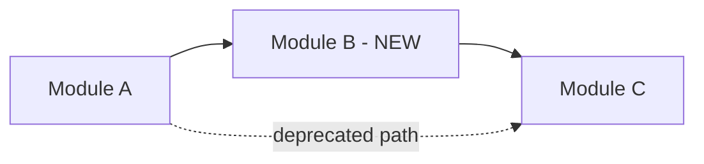
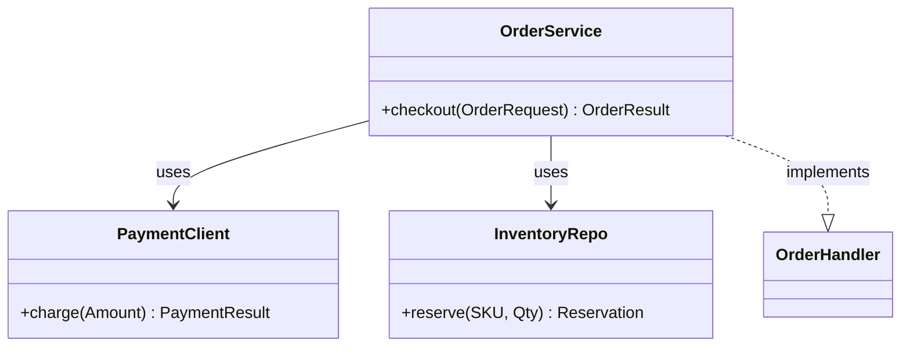
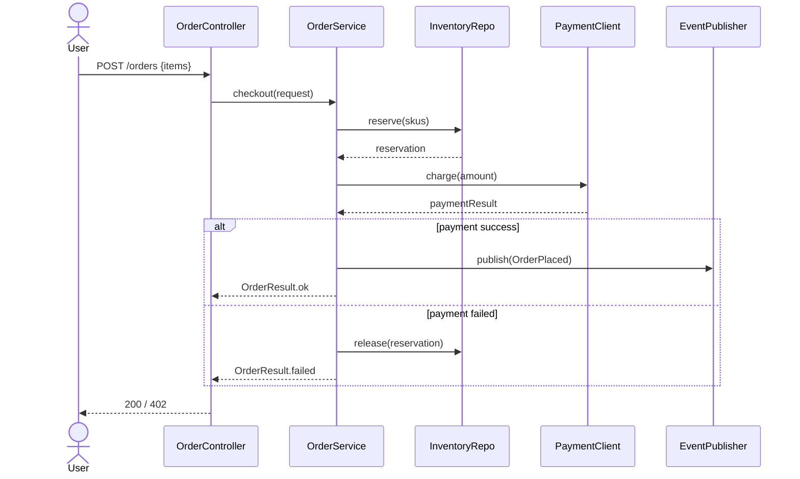
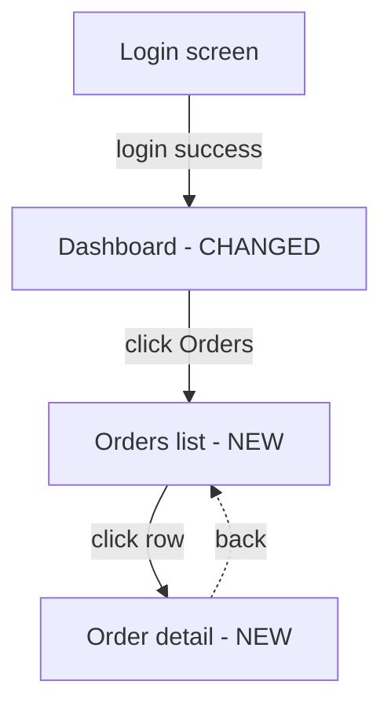
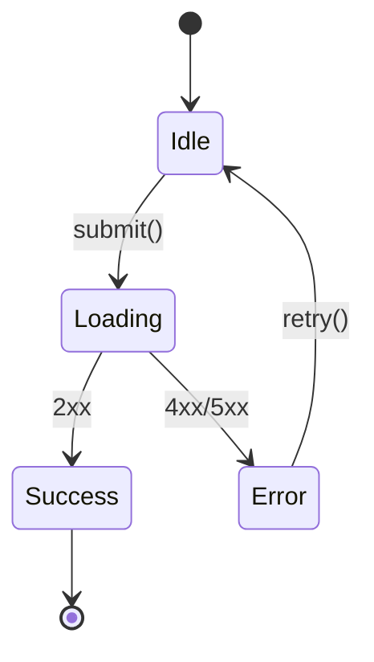

# Layer prompts

Referenced from [SKILL.md](SKILL.md) step 9. Each block below is pasted **verbatim** into the matching layer agent's prompt. Sections are self-contained — agent sees only its own block + the source corpus paths + mermaid guidance (if applicable).

All layers write caveman prose: drop articles (a/the), drop fillers (just/really/basically), fragments OK, arrows for causality (X -> Y). Technical terms (class names, file paths, framework keywords) verbatim from source — never paraphrase.

---

## L1 `tldr`

**Goal:** 3-5 bullets that answer "what changes, why, blast radius" in <60 seconds of reading.

**Read:** `mr_path` (title, description, source/target branches, file count, LOC). MR mode: also commit messages. Code mode: `target_paths` (count files + LOC).

**Output structure:**
```
## TL;DR
<a id="L1"></a>

- **What:** <one sentence — the change in plain language>
- **Why:** <one sentence — the trigger, ticket intent, or module purpose>
- **Surfaces touched:** <comma-separated: e.g. API, DB schema, UI screen X, scheduled job Y>
- **Blast radius:** <N files, +X/-Y LOC, M modules; flag if touches public API / DB / auth>
- **Read order recommendation:** <e.g. "L2 -> L4 -> L6" or "L3 first if you only have 5 min">
```

**Caveman hits:** punchy verbs, no "this MR introduces" / "the change adds". Just "Adds X. Changes Y. Removes Z."

**Skip:** design rationale (L3), per-file detail (L4), code snippets.

**Budget:** ~15 lines.

---

## L2 `context`

**Goal:** Reader grasps WHY this exists. Business intent, user pain, prior state.

**Read:**
- MR mode: `spec_path` (PRD if present), `mr_path.description`, commit messages.
- Code mode: nearby `README.md`, package-level Javadoc / module docs, recent commits in `repo_path` touching `target_paths`.
- `no-spec` mode flag: fall back to MR description + commits only.

**Output structure:**
```
## Context
<a id="L2"></a>

**Ticket:** <KEY or "none"> — <ticket title>
**Stakeholder ask:** <one paragraph, business voice>
**Prior state:** <how things worked before this change — 2-3 sentences>
**Constraint or trigger:** <what forced this work now — deadline, bug, compliance, customer ask>

**Out of scope (explicit):** <list from spec / MR description if stated>
```

**Caveman hits:** business voice can be slightly less terse for clarity, but still no filler. "Customer pain -> X. Required: Y by Z."

**Skip:** implementation details, code snippets, design decisions (L3).

**Budget:** ~25 lines.

---

## L3 `architecture`

**Goal:** Surface non-obvious decisions. Patterns chosen. Alternatives implicitly rejected. ADR-worthy material.

**Read:** `spec_path` (look for "Decisions" / "ADR" sections), `diff_path` (look for pattern markers — strategy classes, factory methods, event publishers, transactional boundaries), `repo_path` (sibling code to compare conventions — does this change ALIGN or DEVIATE).

**Output structure:**
```
## Architecture
<a id="L3"></a>

### Decisions

- **<decision name>:** <chose X over Y because Z>. Trade-off: <consequence>.
- **<decision name>:** ...

### Patterns used

- **<Pattern, e.g. Strategy / Observer / CQRS / Saga>:** in `path/to/file.ext` — <one-line role in this change>.
- ...

### Convention alignment

- Aligns with: <sibling code at path/to/sibling.ext>.
- Deviates from: <prior pattern at path/to/prior.ext>, reason: <if stated in spec, cite; else "not stated">.
```

**Caveman hits:** Each decision = one sentence + trade-off. Pattern callouts = name + path + role. No textbook definitions of patterns — assume reader knows GoF / DDD vocab.

**Skip:** line-by-line code review, judgments ("good / bad"), full pattern explanations.

**Budget:** ~30 lines + optional `flowchart` if decisions form a tree.

---

## L4 `modules`

**Goal:** Reader sees the high-level shape — new/changed/deleted modules and how they connect.

**Read:** `diff_path` file list (cluster by directory/package), `repo_path` (existing structure for context).

**Output structure:**
```
## Modules
<a id="L4"></a>

### New
- `path/to/new-module/` — <one-line purpose>
- ...

### Changed
- `path/to/existing-module/` — <what changed in one phrase>
- ...

### Deleted
- `path/to/old-module/` — <why removed>
- ...

### Dependency graph



**Legend:** solid = active dependency, dashed = deprecated, `[X - NEW]` = added in this MR, `[X - GONE]` = removed.
```

**Caveman hits:** Each module entry = path + one phrase. Diagram caption = one line.

**Skip:** class-level detail (L5), data shapes (L8).

**Budget:** ~30 lines including diagram. See [DIAGRAMS.md](DIAGRAMS.md#flowchart-lr) for diagram tips.

---

## L5 `classes`

**Goal:** Pick 5-10 most important classes/components. Show role + collaborators + place in flow. Skip framework boilerplate and pure DTOs.

**Read:** `diff_path` (touched classes), `repo_path` (full class definitions for context, parent/interface relationships).

**Output structure:**
```
## Key classes
<a id="L5"></a>

| Class | File | Role | Collaborators | Lives in flow at |
|---|---|---|---|---|
| `OrderService` | `src/main/java/com/foo/OrderService.java` | Orchestrates checkout pipeline | `PaymentClient`, `InventoryRepo`, `OrderEventPublisher` | L6 step 3-5 |
| `PaymentClient` | ... | ... | ... | L6 step 4 |
| ... | | | | |

### Relationships



Only relationships shown. Member detail in linked source.
```

**Caveman hits:** Table cells one phrase each. Class names + file paths verbatim. "Lives in flow at" = anchor + step number into L6.

**Skip:** Pure DTOs/POJOs (mention in L8), framework lifecycle classes, dependency-injection scaffolding.

**Budget:** ~40 lines including diagram. See [DIAGRAMS.md](DIAGRAMS.md#classdiagram) for diagram tips. **Sparse** classDiagram — skip member listings unless signature is non-obvious.

---

## L6 `logic`

**Goal:** End-to-end flow for the primary scenario. Reader follows the trigger -> outcome path including decision points and side effects.

**Read:** `diff_path` (trace what calls what), `repo_path` (follow into unchanged collaborators for context). For Deep preset: identify distinct scenarios from spec / MR description, emit one diagram each.

**Output structure (Standard — 1 diagram):**
```
## Logic flow
<a id="L6"></a>

### Scenario: <name, e.g. "Successful checkout">

**Trigger:** <user action / API call / scheduled job / event consumed>
**Outcome:** <what changes — DB write, event published, response returned>



**Decision points:**
- `OrderService:142` — payment success/failure branch.
- ...

**Side effects:**
- DB: `orders` insert, `inventory_reservations` update.
- Events: `OrderPlaced` -> `order-events` topic.
- ...
```

For Deep preset: repeat scenario block per distinct flow (e.g. checkout, refund, retry).

**Caveman hits:** "Trigger:" / "Outcome:" / "Decision points:" / "Side effects:" labels stay. Prose between diagrams: one sentence per decision point + one phrase per side effect.

**Skip:** Trivial getter chains, framework callbacks, log statements.

**Budget:** ~50 lines per scenario including diagram. See [DIAGRAMS.md](DIAGRAMS.md#sequencediagram).

---

## L7 `ui` (frontend only)

**Goal:** Screen flow + route map + state changes. Auto-skipped when no frontend files touched.

**Read:** `diff_path` (`.vue` / `.tsx` / `.jsx` / `.svelte` files), router config (search `repo_path` for `routes` / `Router`), store config (Vuex / Pinia / Redux / Zustand).

**Output structure:**
```
## UI flow
<a id="L7"></a>

### Screens touched

- `<RouteName>` (`/path/to/route`) — <one-line purpose, NEW/CHANGED/REMOVED>
- ...

### Screen graph



### Non-trivial component state

Component: `<ComponentName>` (`path/to/Component.vue`)



### Store / state mutations

- `orderStore.placeOrder()` — sets `loading`, on success commits `addOrder` mutation + clears cart.
- ...
```

**Caveman hits:** Screen entries = name + route + one phrase. Skip styling / pixel details.

**Skip:** Pure CSS changes, accessibility-attribute-only edits, i18n string additions w/o behavior change.

**Budget:** ~40 lines including diagrams. See [DIAGRAMS.md](DIAGRAMS.md#flowchart-td--statediagram).

---

## L8 `data` (schema/DTO/event only)

**Goal:** Show what data shapes change. NEW vs CHANGED vs DELETED. Foreign keys + indices + nullability called out. Auto-skipped when no data-shape files touched.

**Read:** `diff_path` (SQL migrations, entity classes, DTO classes, event classes), `repo_path` (existing entity definitions for diff context).

**Output structure:**
```
## Data model
<a id="L8"></a>

### Schema changes

```mermaid
erDiagram
    ORDERS ||--o{ ORDER_ITEMS : contains
    ORDERS {
        bigint id PK
        bigint customer_id FK
        varchar status
        timestamp created_at
        decimal total NEW
    }
    ORDER_ITEMS {
        bigint id PK
        bigint order_id FK
        varchar sku
        int quantity
    }
    INVENTORY_RESERVATIONS NEW {
        bigint id PK
        bigint order_id FK
        varchar sku
        int quantity
        timestamp expires_at
    }
```

**Annotations:** `NEW` = added in this MR, `CHANGED` = type/nullability changed, `GONE` = dropped.

### DTO / event changes

- `OrderRequest` (`path/.../OrderRequest.java`) — CHANGED, added field `paymentMethod: PaymentMethod`.
- `OrderPlaced` event (`path/.../OrderPlaced.java`) — NEW, schema: `{orderId, customerId, total, items[]}`.
- ...

### Migrations

- `V42__create_inventory_reservations.sql` — creates table + indices on `(order_id, expires_at)`.
- ...

### Nullability / index callouts

- `orders.total` added NOT NULL w/ default `0` — backfill required.
- Index on `inventory_reservations(expires_at)` for cleanup job.
- ...
```

**Caveman hits:** Each entry = name + path + change-type + one phrase. Diagram uses `NEW` / `CHANGED` / `GONE` annotations as suffixes.

**Skip:** Pure column renames w/o semantic change, format-only migrations.

**Budget:** ~40 lines including diagram. See [DIAGRAMS.md](DIAGRAMS.md#erdiagram).

---

## L9 `footguns`

**Goal:** Surface SURPRISING behavior, INVARIANTS, race conditions, known limitations. "Do not refactor X without reading Y."

**Read:** `diff_path` (defensive checks, TODO/HACK/FIXME comments, transaction boundaries, retry / circuit-breaker config), `repo_path` (related test files for context on what's tested vs intentionally untested).

**Output structure:**
```
## Footguns
<a id="L9"></a>

### Non-obvious behavior

- **<headline>** (`file.ext:LINE`) — <what's surprising + why it's that way>. Test: `<test file + test name>` covers.
- ...

### Invariants (do not break)

- `OrderService.checkout()` assumes `InventoryRepo.reserve` is idempotent on retry. Removing the retry config breaks reconciliation job.
- ...

### Race conditions / concurrency

- `<scenario>` — guarded by `<lock type / DB constraint>` at `file.ext:LINE`.
- ...

### Known limitations / TODOs

- `<TODO comment found>` — context: <why deferred>.
- ...

### Do-not-refactor warnings

- `<class/function>` (`file.ext:LINE`) — appears redundant but required for <reason, e.g. legacy API compat, framework hook>.
- ...
```

**Caveman hits:** Each item = headline + path + one-line reason. No padding.

**Skip:** Standard error handling, conventional null checks, normal patterns.

**Budget:** ~30 lines. Empty sections OK — say "none surfaced" rather than fabricate.

---

## Mode-specific overrides

- **`diff-only` repo:** L5/L7/L8/L9 add a one-line annotation at top: `*(diff-only mode — code beyond diff not consulted; relationships / state machines may be incomplete)*`.
- **`no-spec` MR:** L2 leads with: `*(no PRD / spec discovered — context derived from MR description + commits)*`.
- **Code mode (no MR):** L1 swaps "blast radius" for "scope" (file count + LOC). L2 swaps "stakeholder ask" for "module purpose". L6 emits one scenario per public entry point.
