# SDD — AFK GitHub Backend

> Parent PRD: `PRD.md`
> Status: Draft
> Last updated: 2026-05-10

## §0 Binding Contract

This SDD and its accepted ADRs are **binding** on implementing agents and reviewers.

| Aspect | Locked by SDD/ADR | Executor latitude |
|--------|-------------------|-------------------|
| Pattern choice | Yes | No |
| Module public interface | Yes | No |
| API contract / MCP-tool surface called by skills | Yes | No |
| Aggregate boundary | Yes | No |
| Idempotency strategy + verify-after-write retry budget | Yes | No |
| File / package layout *within* a named module | No | Yes |
| Private helper extraction | No | Yes |
| Internal naming, control flow | No | Yes |
| Test fixture structure | No | Yes |

**Conflict procedure.** If an executor finds a binding decision wrong / infeasible / contradicting reality, exit the SubTask with `design-conflict` status quoting the SDD section + the conflict. Route back to `/afk:architect-grill` for a new ADR (Status: Accepted, Supersedes: NNNN). Do not override silently.

## §1 Context Summary

AFK currently drives one tracker/SCM pair (Jira + GitLab) hard-baked into `runner.py`, the skills, and the artefact-path convention. The user wants to extend the same grill→PRD→SubTasks→AFK loop to personal GitHub repos without disturbing the Nakisa Jira+GitLab path. The PRD settled scope, label vocabulary, and module breakdown; this SDD pins the architectural seams: a Strategy-pattern protocol layer at the runner boundary, a parallel `mcp__github__*` skill seam, a `gh` CLI driver-side adapter, mutually-exclusive phase labels with verify-after-write recovery, and a pre-flight sweeper that resets crashed-mid-flight sub-issues. Five non-trivial decisions are recorded as ADRs.

---

## §2 L1 — System Topology

AFK is a single Python CLI process (`afk-driver`) running on the user's laptop, batch-style (drain queue → exit). This feature does not change topology — it adds two external services (GitHub Issues / GitHub PRs) reachable via `gh` and the official `github-mcp-server`. **Inherited from existing AFK driver topology.**

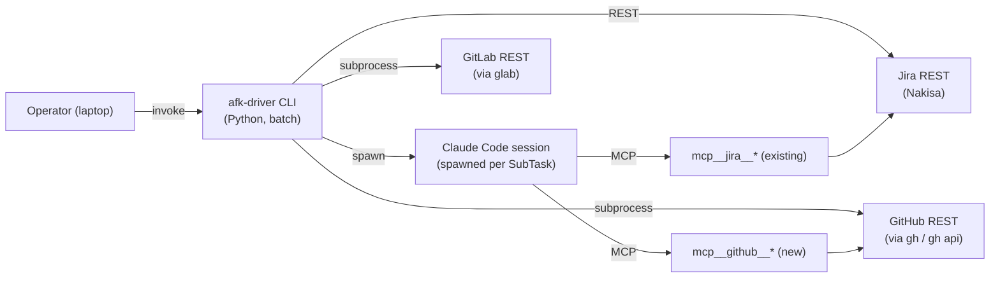

*Caption: this feature adds the right-hand `mcp__github__*` and `gh`/`gh api` paths; the left-hand Jira+GitLab paths are unchanged.*

## §3 L2 — Service Boundaries & Integration

The seam between AFK and the outside world has two surfaces: **driver-side** (Python) reaches Jira/GitLab/GitHub via REST or CLI subprocess; **skill-side** (Markdown + Claude orchestration) reaches them via MCP servers. This feature mirrors the existing Jira+GitLab pattern onto GitHub: a new `mcp__github__*` skill seam plus a new pair of driver-side adapters (`github_issues_client` for tracker ops, `github_pr_client` for SCM ops), both shelling to `gh` (with `gh api` for sub-issue endpoints the CLI does not natively wrap).

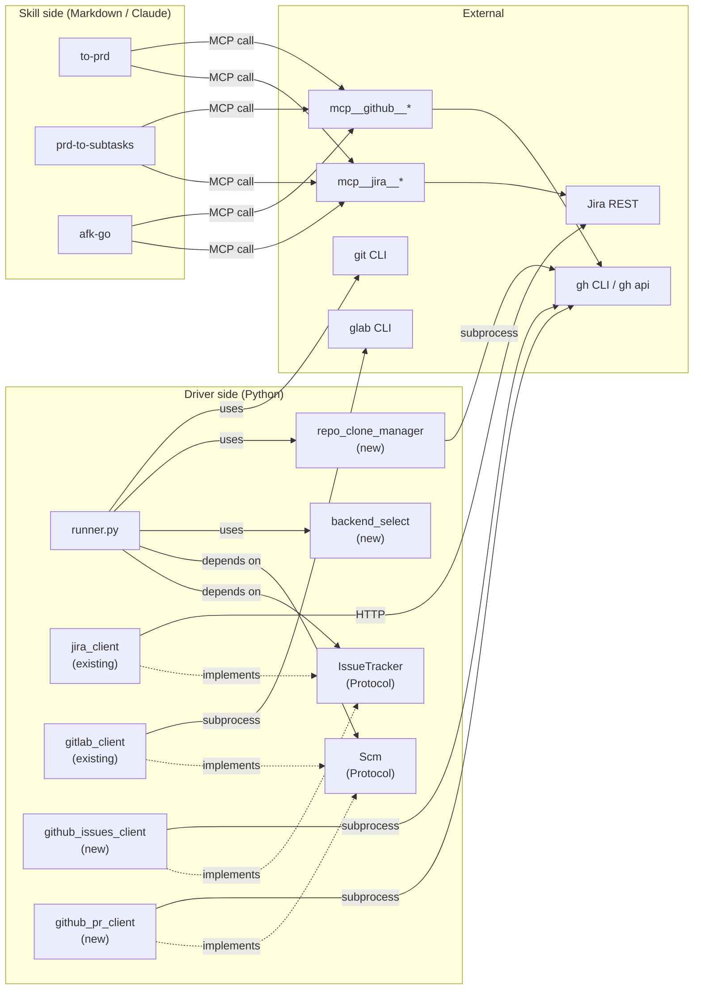

*Caption: Strategy-pattern protocols decouple `runner` from concrete tracker/SCM impls; skills bypass the Python layer entirely and use parallel MCP namespaces.*

### Cross-service interaction — sub-issue created by `prd-to-subtasks`

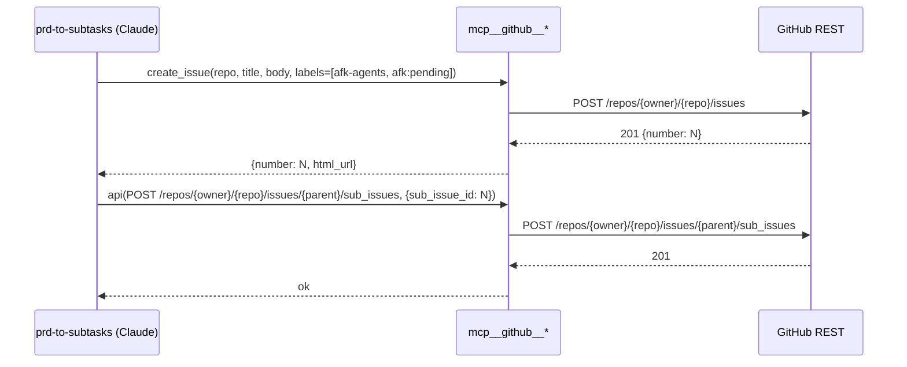

*Caption: sub-issue creation is a 2-call sequence (create issue, attach as sub-issue); idempotency comes from search-before-create when re-run.*

### Cross-service interaction — phase transition with verify-3x (driver side)

```mermaid
sequenceDiagram
  participant runner as runner.py
  participant gh_client as github_issues_client
  participant gh as gh CLI
  participant api as GitHub REST

  runner->>gh_client: transition_phase(issue=N, to=afk:developing)
  loop up to 3 attempts
    gh_client->>gh: gh issue edit N --remove-label afk:pending,afk:designing,afk:cr-merge --add-label afk:developing
    gh->>api: PATCH labels
    api-->>gh: 200
    gh-->>gh_client: 0
    gh_client->>gh: gh issue view N --json labels
    gh->>api: GET labels
    api-->>gh: [...]
    gh-->>gh_client: labels
    alt labels contain only afk:developing
      gh_client-->>runner: ok
    else
      Note over gh_client: retry
    end
  end
  alt 3 retries exhausted
    gh_client->>gh: gh issue comment N --body "AFK: phase transition failed; aborting"
    gh_client-->>runner: PhaseTransitionError
  end
```

*Caption: every phase transition writes then reads back; mismatch triggers retry up to 3 attempts before aborting that parent.*

### MCP-tool / driver-API surface table

| Surface | Caller | Method/CLI | Request shape ref | Response shape ref | Error handling |
|---------|--------|-----------|-------------------|--------------------|----------------|
| `mcp__github__create_issue` | skills | MCP call | `{owner, repo, title, body, labels}` | `{number, html_url}` | server-side errors propagate to skill |
| `mcp__github__get_issue` | skills | MCP call | `{owner, repo, issue_number}` | full Issue object | 404 → skill aborts |
| `mcp__github__update_issue` | skills | MCP call | `{owner, repo, issue_number, body, labels}` | updated Issue | versioning N/A |
| `mcp__github__create_pull_request` | skills | MCP call | `{owner, repo, title, head, base, draft, body}` | `{number, html_url}` | duplicate → skill checks first |
| `gh issue edit` | `github_issues_client` | subprocess | `--remove-label X,Y,Z --add-label W` | exit code 0 + stderr | non-zero → retry, 3rd → abort |
| `gh issue view --json labels` | `github_issues_client` | subprocess | `{number}` | `{labels: [...]}` | parse error → retry |
| `gh api .../sub_issues` | `github_issues_client` | subprocess | `POST /repos/{o}/{r}/issues/{N}/sub_issues` | 201 + sub-issue obj | 404 = parent gone → skip |
| `gh pr list --search` | `github_pr_client` | subprocess | `[#N]` query | JSON array of PRs | >1 match → ambiguous error |
| `gh pr create --draft` | `github_pr_client` | subprocess | `--source --target --title --body` | PR URL | duplicate → re-query existing |
| `gh pr edit --body` | `github_pr_client` | subprocess | `--body $body` | exit 0 | non-zero → retry once |
| `gh repo clone` | `repo_clone_manager` | subprocess | `owner/repo {dest}` | exit 0 | non-zero → fail repo (skip) |
| `claude mcp list` | pre-flight | subprocess | (no args) | text listing | grep `github` absent → halt |

GitHub REST + sub-issue endpoints documented at https://docs.github.com/en/rest/issues/issues and https://docs.github.com/en/rest/issues/sub-issues; official MCP server at https://github.com/github/github-mcp-server. Versioning posture: `gh` CLI tracks GitHub API drift; AFK pins **no specific `gh` version** — runtime check is functional (`gh auth status` exits 0 + sub-issue REST probe returns 200 on a known repo).

## §4 L3 — Data Architecture

AFK driver remains stateless across runs aside from on-disk artefacts (config, logs, digests, cloned repos, worktrees). The new feature adds two on-disk classes (per-repo TOML, cloned repos under `worktree_root/github/`) and zero new datastores. All operational state — queue membership, phase, PR existence — is re-derived from external systems each run (per ADR rejecting cross-run cache).

| State | Datastore | Partitioning | Replication | Retention | Schema-evolution policy | PII? |
|-------|-----------|--------------|-------------|-----------|--------------------------|------|
| Driver config | `~/.afk-driver/config.toml` (file) | none | none | until user deletes | forward-compat: unknown keys ignored, missing keys → built-in default | no (tokens are env-var refs, not stored here) |
| Per-repo overrides | `<repo-root>/.afk-driver.toml` (file) | one file per repo (in repo VCS) | repo's git remote | until repo deletes file | forward-compat: unknown keys ignored | no |
| Per-session logs | `~/.afk-driver/logs/{run-id}/{key}.log` | run-id × key | none | append-only, never auto-pruned | append-only text; format may change without migration | low — may contain commit messages |
| Morning digest | `~/.afk-driver/digests/{date}.md` | one per date | none | append-only, never auto-pruned | format may change without migration | low |
| Worktrees (Jira) | `~/core-services-worktrees/{ENH-ID}/` | one per Enhancement | git remote | manual cleanup | inherited git semantics | no |
| Worktrees (GitHub) | `~/core-services-worktrees/github/{owner}/{repo}/.../afk-issue-{N}/` | one per (repo × parent issue) | git remote | manual cleanup | inherited git semantics | no |
| Cloned repos (GitHub) | `~/core-services-worktrees/github/{owner}/{repo}/` | one per repo | git remote (full clone) | persistent until manual delete | git-managed; cache-like, source of truth = remote | no |
| In-memory run state | RAM | per process | none | process lifetime | n/a | no |

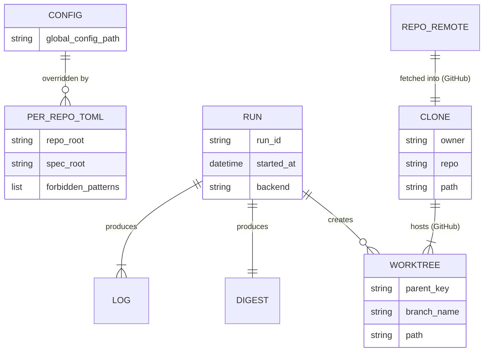

*Caption: only the bottom-right CLONE / WORKTREE pair is GitHub-specific; the rest are shared with the existing Jira+GitLab path.*

No cache layer is introduced. The justification: AFK volumes are ≤ ~20 parents/run, ≤ ~3 sub-issues/parent, ≤ ~5 reads per sub-issue → ~300 GH REST calls/run upper bound, well under the 5000/hr authenticated limit. A cache would add a stale-state failure mode for negligible latency win.

## §5 L4 — Cross-Cutting & Quality Attributes

### AuthN

`gh auth status` exits 0 ⇒ the driver trusts the system-level `gh` token configured by the user (PAT, GitHub App, or device-flow login). The driver does **not** read or persist the token. Same posture as the existing GitLab side, where `glab auth status` is the only check. **Inherited posture, no flow diagram needed.**

### AuthZ

| Resource | Principal-attribute | Allowed action | Enforced by |
|----------|---------------------|----------------|-------------|
| Issue queue (read) | `assignee = @me` | list | `gh search issues` filter |
| AFK-eligible sub-issue | label `afk-agents` AND label `afk:pending` | runner picks up | `gh search issues` filter |
| Phase label change | (any caller with token write scope) | mutate | enforced upstream by GitHub permissions |
| Forbidden-file edit (per repo) | per-repo `forbidden_patterns` | rejected | `scope_enforcer` (existing module, unchanged) |

### Idempotency

| Surface | Key shape | Dedup window | Side-effect ledger |
|---------|-----------|--------------|--------------------|
| Sub-issue create | `(parent_number, sub_title_hash)` | per-parent, indefinite | search parent's existing sub-issues by title before create |
| PR create | `(repo, source_branch)` | indefinite | `gh pr list --head {branch}` returns the open PR if any |
| Find PR by parent issue | `(repo, "[#{N}]" prefix in title)` | indefinite | search-then-filter, ambiguous (>1 match) → error |
| Phase transition | `(issue_number, target_phase_label)` | per-call | verify-after-write (read labels back) |
| Comment on sub-issue (abort reason) | `(issue_number, body_hash)` | per-call | search recent comments by body-hash before posting |
| Implementation Notes bullet | `(parent_number, sub_key)` | indefinite | section-splice block — re-render full block from canonical list, idempotent by construction |

### Retry + timeout

| Call | Attempts | Backoff | Timeout (ms) | On final failure |
|------|----------|---------|--------------|-------------------|
| `gh issue edit` (label transition) | 3 | 0/200/600 ms | 5 000 | post abort comment, return `PhaseTransitionError` |
| `gh issue view --json labels` (verify) | 3 | 100 ms fixed | 5 000 | treat as transition failure |
| `gh pr edit --body` | 2 | 0/500 ms | 8 000 | log + skip update (digest warning) |
| `gh pr create --draft` | 1 | n/a | 15 000 | re-query for existing; if absent, fail parent |
| `gh repo clone` | 1 | n/a | 120 000 | mark repo failed, skip all parents in repo |
| `gh search issues` (queue scan) | 2 | 0/2 000 ms | 30 000 | abort run with diagnostic |
| `gh api .../sub_issues` | 3 | 0/200/600 ms | 5 000 | post abort comment, fail sub-task |
| Sub-task wall-clock cap (Claude session) | 1 | n/a | 3 600 000 (1 h) | revert sub-issue to `afk:pending`, comment |

### Rate limit

| Surface | Limit | Window | Enforcer | Headroom at AFK volume |
|---------|-------|--------|----------|------------------------|
| GitHub REST authenticated | 5 000 | 1 h | GitHub | ~300 calls / run = 6% of budget |
| `gh search issues` | 30 (search-API tier) | 1 min | GitHub | 1–2 calls / run = trivial |
| MCP `mcp__github__*` calls | inherits REST limit | 1 h | GitHub | included in 6% budget |

### Sync vs async

All driver work is **synchronous serial** — strict per existing PRD constraint. Phase transitions, sub-issue create, PR create, comment posting, queue scan, sweeper — every step blocks until done. **Inherited from PRD §Out-of-scope (Parallel AFK agents).**

### Feature flags

| Flag key | Default | Rollout plan | Cleanup date |
|----------|---------|--------------|--------------|
| `[github] mode` (`cwd` \| `all-repos`) | `cwd` | user opts in via config when ready | none — config setting, not a flag |
| `[per-repo] forbidden_patterns` | `[]` | per-repo opt-in via `.afk-driver.toml` | none — per-repo config |
| `[per-repo] cross_module_marker_template` | absent | per-repo opt-in | none — per-repo config |

Note: AFK has no feature-flag service; "flags" are config keys with documented defaults.

### Observability

| Signal | What it detects | Cite |
|--------|-----------------|------|
| Per-session log file | Claude session output, sub-task abort cause | §7 use-case 2 |
| Morning digest row | per-parent + per-sub-issue outcome with backend + repo columns | §7 use-case 4 |
| Sweeper warning bullets in digest | parents/sub-issues whose phase labels were reset at pre-flight | §7 use-case 3 |
| Pre-flight diagnostic | missing `gh auth`, missing MCP, sub-issue REST 4xx | §7 use-case 1 |

### Secrets

GitHub token managed by `gh` (system-level keyring or env). Jira token in `JIRA_API_TOKEN` env var (existing). **No new secret storage.** Driver never logs or transmits tokens; `gh` and `urllib` calls inherit the existing redaction (none — but tokens are not in driver memory beyond what subprocess inherits from environment).

## §6 L5 — Domain Model

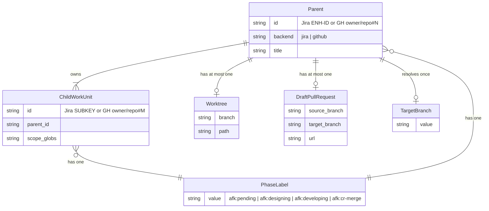

*Caption: aggregate roots are `Parent`, `Worktree`, `DraftPullRequest`. `ChildWorkUnit` and `PhaseLabel` are entities owned by `Parent`.*

### Invariants table

| Invariant | Owner aggregate | Guardian method |
|-----------|-----------------|-----------------|
| At most one `afk:*` label on any issue at any time (GitHub) | `Parent` and `ChildWorkUnit` | `github_issues_client.transition_phase` (single `gh issue edit --remove ... --add ...` + verify) |
| At most one Draft PR per `Parent` | `DraftPullRequest` | `github_pr_client.find_open_pr_by_parent` checked before `create` |
| Branch name = `afk/issue-{N}` (GitHub) or `mvu/afk/{ENH-ID}` (Jira) | `Worktree` | `worktree_manager.ensure` (existing module, unchanged) |
| Target branch resolved at parent-start, immutable mid-flight | `Parent` | `runner` caches per-parent on first read; never re-reads |
| Sub-issue's parent never changes mid-flight | `ChildWorkUnit` | inherent: GitHub sub-issue parent immutable without explicit re-parent call |
| `afk-agents` label on any AFK-eligible sub-issue | `ChildWorkUnit` | search filter (read-only enforcement); creation in `prd-to-subtasks` always sets it |

### Aggregate lifecycle — phase-label state machine (GitHub `ChildWorkUnit`)

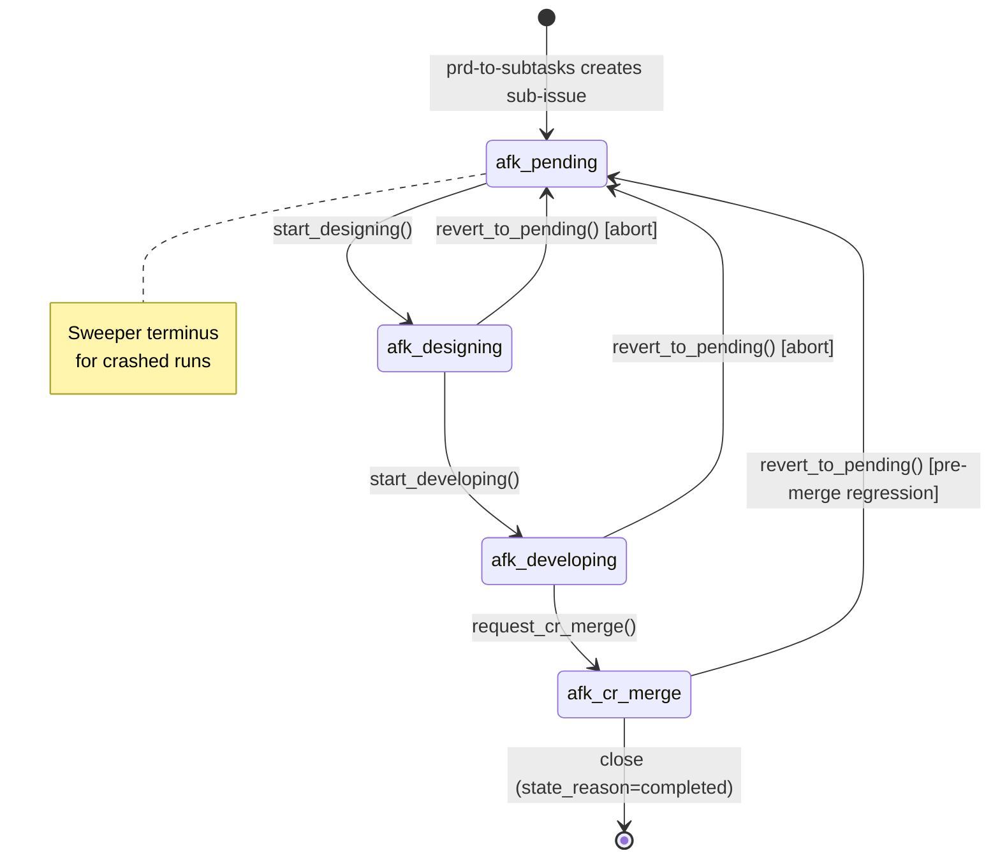

*Caption: linear forward path; abort and sweeper-recovery paths return to `afk:pending`. Implementation is implicit (named methods on `tracker_protocol`), not an explicit state-machine class — see ADR-0002 references.*

### Domain events table

| Event name | Emitter aggregate | Consumers | Payload schema ref |
|-----------|-------------------|-----------|---------------------|
| `SubTaskAborted` | `ChildWorkUnit` | digest writer, sub-issue comment | `{key, parent_key, reason, attempt_count}` (in-memory dataclass) |
| `ParentFirstSubTaskPickedUp` | `Parent` | runner (transitions parent to developing), digest | `{parent_key, sub_key}` |
| `ParentLastSubTaskCompleted` | `Parent` | runner (triggers final rebase + transition to cr-merge), digest | `{parent_key, sub_count}` |
| `RepoCloned` | `Clone` | digest sweeper | `{owner, repo, path}` |
| `PhaseLabelReset` | sweeper | digest, sub-issue comment | `{issue_id, prior_label, new_label, run_id}` |

Events are **in-process records**, not message-bus events. The "consumers" run synchronously inside the same `runner` invocation.

## §7 L6 — Process & Coordination

Four top use cases. No DB transactions exist — every external write is a separate commit. Coordination is via ordered side-effects + idempotent recovery.

### Use-case 1 — Pre-flight + queue discovery

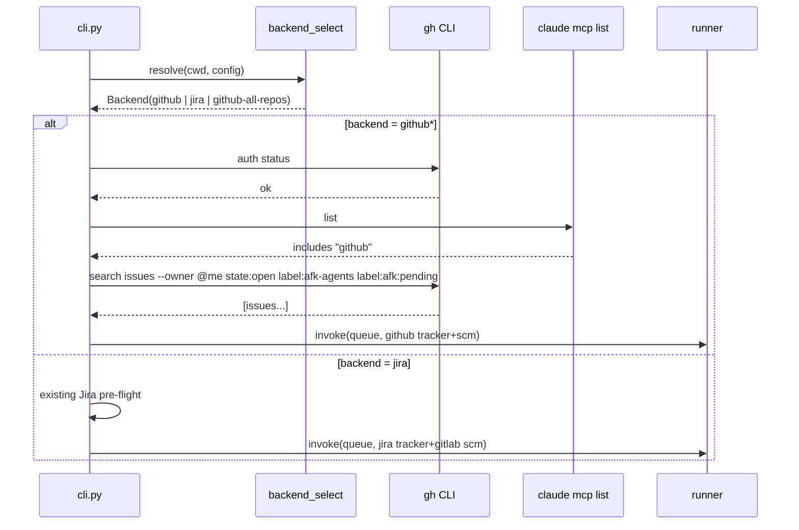

*Caption: pre-flight is fail-fast; any check failure halts before runner is invoked.*

### Use-case 2 — Per-sub-issue execution

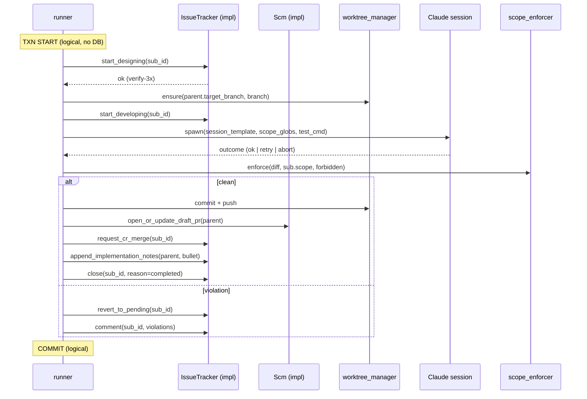

*Caption: each external call is its own commit; failure mid-sequence leaves recoverable state visible in next run's pre-flight sweeper.*

### Use-case 3 — Pre-flight sweeper (crash-recovery)

```mermaid
sequenceDiagram
  participant cli
  participant tracker as IssueTracker (impl)
  participant gh as gh CLI

  cli->>tracker: list_stuck_subissues(label_set={afk:designing, afk:developing, afk:cr-merge})
  tracker->>gh: gh search issues label:afk:designing OR label:afk:developing OR label:afk:cr-merge
  gh-->>tracker: [stuck issues]
  loop per stuck issue
    cli->>tracker: revert_to_pending(issue_id)
    cli->>tracker: comment(issue_id, "AFK: previous run crashed; reset to pending for re-pickup")
  end
  cli->>cli: continue to queue discovery
```

*Caption: sweeper runs once before queue discovery; output is logged + summarised in morning digest.*

### Use-case 4 — End-of-run digest

Inherited from existing `digest_writer.py`. New columns: `backend` (jira | github) and `repo` (Jira project key | `owner/repo`).

### Use-case detail table

| Use case | Trigger | Txn boundary | Consistency model | Concurrency control |
|----------|---------|--------------|-------------------|---------------------|
| Pre-flight + discovery | CLI invocation | none (read-only + sweeper writes are idempotent) | strong (every read is a fresh REST call) | n/a (single-process) |
| Per-sub-issue execution | runner inner loop | logical txn = the sub-issue run; no DB rollback | read-after-write within the sub-issue's calls | strict serial — one sub-issue at a time |
| Sweeper | pre-flight | per-issue idempotent writes | eventual (next run re-checks) | n/a |
| End-of-run digest | runner exit | append to single file | n/a | n/a |

### Failure & recovery matrix

| Failure point | Detection signal | Automatic recovery | Manual recovery | Owner |
|---------------|------------------|--------------------|-----------------|-------|
| `gh auth status` non-zero | exit code | none | user runs `gh auth login` | operator |
| `claude mcp list` lacks `github` | grep result | none | user installs/configures MCP server | operator |
| Sub-issue REST probe 4xx | HTTP code | none | user enables sub-issues feature on org | operator |
| Phase transition partial-write | post-write label-read mismatch | retry up to 3, then abort + comment | next run's sweeper resets to `afk:pending` | runner + sweeper |
| Sub-issue create returns 5xx | exit code + JSON parse | retry 3x | user re-runs `prd-to-subtasks` | runner |
| `gh repo clone` fails | non-zero exit | mark repo failed, skip all its parents | user clones manually OR fixes network | runner |
| Worktree dirty | `worktree_manager.validate_state` raises | none | user inspects + resets | runner aborts parent |
| Scope violation | `scope_enforcer.enforce` returns violations | revert sub-issue to pending + comment | user expands `Scope:` glob and re-labels | runner |
| Final rebase conflict | git exit code | none — leave parent in `afk:cr-merge`, comment | user resolves conflict + flips PR Ready | runner |
| Wall-clock cap exceeded | timer fires | terminate Claude session, revert sub-issue to pending | next run picks up | runner |
| Crashed mid-flight | next run's sweeper finds stuck label | reset to `afk:pending` + comment | n/a | sweeper |

## §8 L7 — Module Decomposition

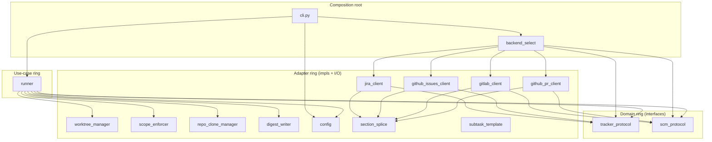

*Caption: dependencies point inward (toward protocols); composition root (`cli` + `backend_select`) wires concretes. No cycles.*

### Module table

| Module | Purpose (one line) | Public interface (signature-level) | Depends on | Owner aggregate |
|--------|--------------------|-------------------------------------|------------|-----------------|
| `tracker_protocol` (new) | Strategy interface for issue trackers | `list_pickable`, `get_parent`, `start_designing`, `start_developing`, `request_cr_merge`, `revert_to_pending`, `close`, `comment`, `splice_notes_block`, `get_target_branch`, `list_stuck_subissues` | none | `Parent`, `ChildWorkUnit` |
| `scm_protocol` (new) | Strategy interface for SCM/PR | `find_open_pr_by_parent`, `open_draft_pr`, `update_pr_description`, `splice_pr_block`, `commit_referenced_in_pr` | none | `DraftPullRequest` |
| `github_issues_client` (new) | `tracker_protocol` impl via `gh` CLI + `gh api` | implements `tracker_protocol`; `__init__(runner: GhRunner)` | `tracker_protocol`, `section_splice`, `subprocess` | `Parent`, `ChildWorkUnit` |
| `github_pr_client` (new) | `scm_protocol` impl via `gh` CLI | implements `scm_protocol`; `__init__(runner: GhRunner)` | `scm_protocol`, `section_splice`, `subprocess` | `DraftPullRequest` |
| `backend_select` (new) | Composition-root factory | `resolve(cwd, config) -> Backend` | all four impls, `config` | n/a |
| `repo_clone_manager` (new) | Idempotent `gh repo clone` wrapper | `ensure_clone(owner, repo, root) -> Path` | `subprocess`, `gh CLI` | `Clone` |
| `runner` (modified) | Orchestration loop | unchanged externally; internally accepts `IssueTracker` + `Scm` instead of `JiraClient` + `GitLabClient` | protocols, `worktree_manager`, `scope_enforcer`, `repo_clone_manager`, `digest_writer`, `config` | `Parent` (lifecycle owner) |
| `cli` (modified) | Entry-point + dispatch + per-backend pre-flight | `main(argv) -> int` | `backend_select`, `runner`, `config` | n/a |
| `config` (modified) | Loads `~/.afk-driver/config.toml` + per-repo `.afk-driver.toml` merge | `load(path) -> DriverConfig`, `load_per_repo(repo_root, base) -> DriverConfig` | `tomllib`, `pathlib` | n/a |
| `digest_writer` (modified) | Writes morning digest with `backend`/`repo` columns | unchanged externally | none | n/a |
| `jira_client` (existing, unchanged interface) | implements `tracker_protocol` | unchanged externally | `tracker_protocol`, `urllib`, `section_splice` | `Parent`, `ChildWorkUnit` |
| `gitlab_client` (existing, unchanged interface) | implements `scm_protocol` | unchanged externally | `scm_protocol`, `subprocess`, `section_splice` | `DraftPullRequest` |
| `worktree_manager` (existing, unchanged) | Per-Enhancement worktree lifecycle | unchanged | `git CLI`, `subprocess` | `Worktree` |
| `scope_enforcer` (existing, unchanged) | Predicate over `git diff` + globs + forbidden | unchanged | none | n/a |
| `section_splice` / `jira_section` (existing, unchanged) | Marker-pair splice | unchanged | none | n/a |
| `subtask_template` (existing, unchanged) | Goal/Scope/Acceptance/Test parser/emitter | unchanged | none | `ChildWorkUnit` body |

## §9 L8 — Tactical Patterns

| Concern | Pattern | ADR |
|---------|---------|-----|
| Backend pluggability (tracker + SCM) | Strategy | ADR-0001 (skill seam = MCP), ADR-0003 (multi-repo discovery) |
| Composition root | Factory | (covered in §8 module table; not ADR-worthy) |
| Phase-label valid transitions | Implicit state machine (named methods on protocol) | (alternatives weighed in architect-grill; not ADR-worthy — single caller) |
| Phase-label transition recovery | Verify-after-write retry | ADR-0004 |
| Crashed-mid-flight recovery | Pre-flight sweeper | ADR-0005 |
| Diff-vs-globs predicate | Specification | (existing, no change) |
| Orchestration loop with strategy hooks | Template Method | (existing, no change) |
| Phase representation on GitHub | Mutually-exclusive labels (vs Projects v2) | ADR-0002 |

### Strategy class diagram

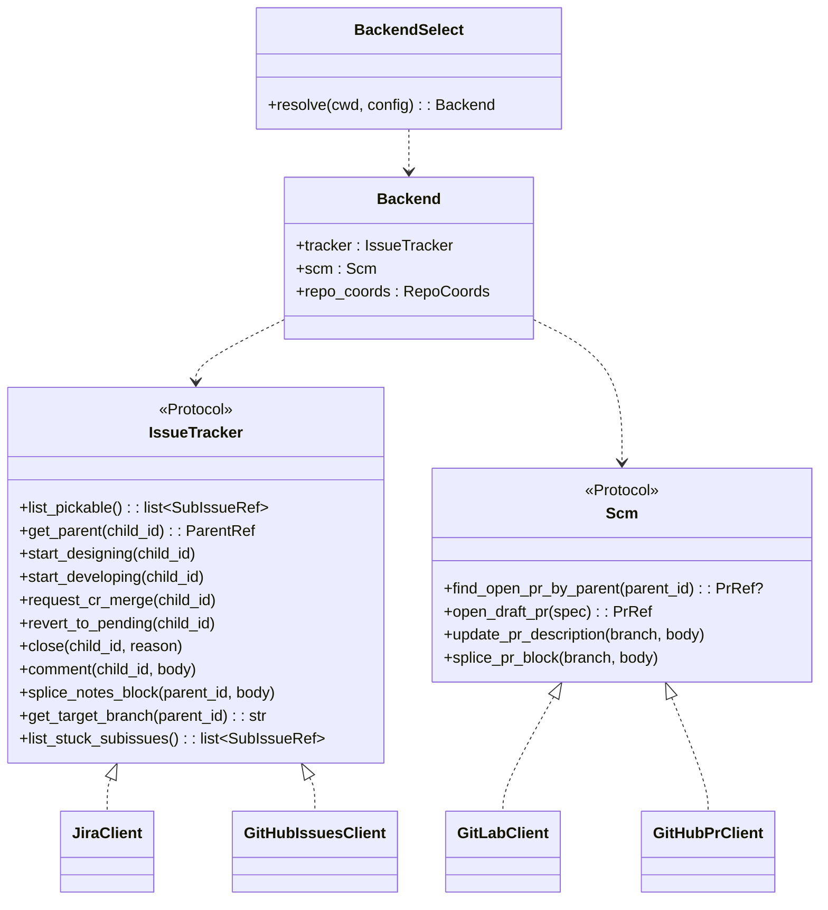

*Caption: two thin Protocols + four concrete adapters; `BackendSelect` is the composition root that returns the bound pair plus repo coordinates.*

---

## §10 NFRs

| Concern | Target | Measurement | Owner |
|---------|--------|-------------|-------|
| SubTask wall-clock cap (s) | ≤ 3 600 | runner timer; abort on expiry | runner |
| Phase-transition verify retries | 3 | retry counter in `github_issues_client` | client |
| Pre-flight total time (s) | < 5 | wall-clock from invoke to runner-start | cli |
| `claude mcp list` probe time (s) | < 2 | subprocess timer | cli |
| GitHub REST calls per run | ≤ 300 (typical) / 500 (cap) | call counter in `github_issues_client` | client |
| Sweeper time for ≤ 50 stuck issues (s) | < 10 | sweeper timer | sweeper |
| Sub-task abort comment posting (s) | < 5 | per-comment timer | client |
| Multi-repo discovery (s) for ≤ 10 repos | < 15 | `gh search` wall-clock | discovery |
| Auto-clone of one repo (s) | ≤ 120 | clone timer (depends on repo size + bandwidth) | repo_clone_manager |

### REST-call budget split per run (typical)

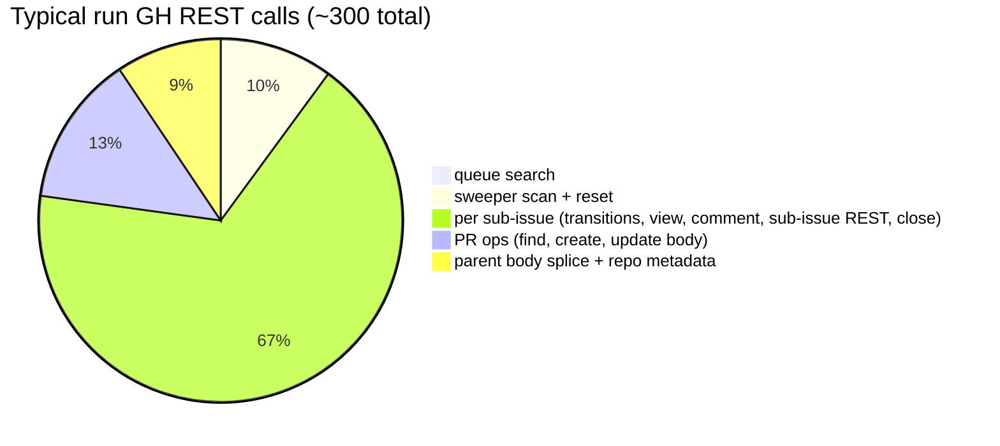

*Caption: per-sub-issue ops dominate; budget assumes 20 sub-issues/run with ~10 GH calls each.*

## §11 Out of Scope

From PRD:

- GitHub Projects v2 integration (rejected at L8 — see ADR-0002).
- GitHub Issue Types as classification.
- GitHub Actions integration (CI status not read).
- Cross-org repos (multi-repo mode = `--owner @me` only).
- GitHub Apps / fine-grained PAT install flows.
- Migration of existing Jira PRDs to GitHub.
- Mixed-backend single Enhancement.
- Refactoring existing Jira-only paths beyond protocol-conformance changes.
- Multi-account GitHub.

Design-level additions:

- No local cache of GitHub state (re-derive every run).
- No cross-run persistence beyond logs + digests + cloned repos + worktrees.
- No event-bus / message-queue introduction.
- No GraphQL atomic mutation for label transitions (REST sequence + verify-after-write is the chosen recovery, per ADR-0004).
- No state-machine library; implicit state machine via named protocol methods.

## §12 Reversed Decisions

| Prior ADR | Superseded by | Reason |
|-----------|---------------|--------|
| (none — this is the first ADR set in `tasks/github-backend/`) | — | — |

## §13 Open Questions

| Question | Layer | Blocks executor? | Owner | Target resolve date |
|----------|-------|------------------|-------|---------------------|
| Should the sweeper also reset Jira-side stuck SubTasks? Out of scope for this feature; proposed as a separate Enhancement. | L6 | no | user | post-GitHub-shipment |
| Should `backend_select` cache its result for the lifetime of a multi-repo run? Currently re-resolves per repo (cheap). | L8 | no | user | optimisation |

No L2-L7 row marked `Blocks executor? = yes`. Design is publishable.
