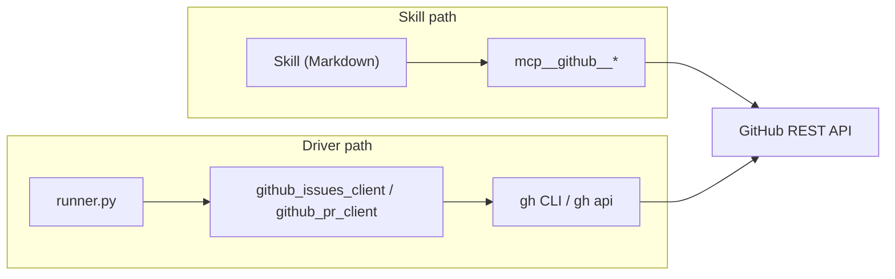

# ADR-0001 — Skill seam = official GitHub MCP server (not driver CLI subcommands)

> Status: Accepted
> Date: 2026-05-10
> Layer: L2
> Context ticket: github-backend (tasks folder)

## Context

Skills (`to-prd`, `prd-to-subtasks`, `afk-go`) are Markdown documents executed by Claude Code, not Python modules. They cannot import `tracker_protocol` directly. On the existing Jira+GitLab backend, skills reach Jira via the `mcp__jira__*` MCP-tool namespace and reach GitLab indirectly through the runner. The new GitHub backend needs an equivalent skill-side path. SDD §3 (L2 service boundaries) is where this seam is recorded.

Forces:

- Skills are user-visible; their behaviour must remain backend-agnostic at the markdown level (no `if backend == github` branches inside Markdown).
- The driver-side runner already needs Python adapters (`github_issues_client`, `github_pr_client`) because the runner spawns Claude sessions and orchestrates phase transitions itself.
- Adding more entry points (CLI subcommands, second MCP path) inflates the surface that has to be kept in sync as protocols evolve.
- The user has a prior bad experience with a third-party MCP (mysql) freezing AFK; stability of any added MCP server is a real concern.

## Decision

Skills call GitHub via the **official `github/github-mcp-server`** in the `mcp__github__*` namespace, exactly mirroring the existing `mcp__jira__*` pattern. The driver-side `github_issues_client` and `github_pr_client` modules call `gh` (and `gh api`) directly via subprocess; they are runner-internal and never invoked from skills. The two paths converge at the GitHub REST API.

*Caption: skills and runner take separate paths to GitHub; both paths terminate at the official REST API.*

## Alternatives Considered

| Alternative | Pros | Cons | Reason rejected |
|-------------|------|------|-----------------|
| **A — `afk-driver tracker …` CLI subcommands; skills shell out** | Single dispatch point; skills 100% backend-blind | Driver CLI grows ~10 subcommands; every protocol-method addition requires CLI + skill update | More moving parts than the MCP path; loses the existing `mcp__jira__*` symmetry |
| **B — `if github → gh; else → mcp__jira__*` branches inside skills** | No new infra | Dispatch logic duplicated per skill; 3rd backend would multiply branches | Skills become brittle; violates "skills are backend-agnostic" |
| **C (chosen) — Official GitHub MCP server** | Mirrors Jira pattern; official + actively maintained (79+ tools as of 2026-03); skills stay backend-agnostic | One more MCP server to install/configure; runtime dependency | Net benefit > cost; user accepts MCP install as a one-time setup |
| **D — Hybrid: reads via MCP, writes via afk-driver CLI** | Writes go through one safety choke-point | Two paths per backend; skill author must remember which is which | Cognitive overhead exceeds the safety win |

## Consequences

- **Positive** — Skills remain identical in shape across backends. `mcp__github__*` calls are 1:1 with `mcp__jira__*` semantics. The driver CLI surface does not grow. The GitHub MCP server is upstream-maintained by GitHub and stays current with REST changes.
- **Negative** — Adds a runtime dependency (the MCP server) outside the AFK repo. Pre-flight must verify it is installed/configured (`claude mcp list | grep github`); failure halts the run. A third-party MCP outage degrades skills (but not the runner-side flows, which use `gh` directly).
- **Follow-ups** — Document in `CLAUDE.md` how to install the GitHub MCP server. Update `to-prd`, `prd-to-subtasks`, `afk-go` to detect backend at preamble and dispatch to the right MCP namespace. Out of scope: a fallback skill path if the MCP server is unavailable mid-run.
