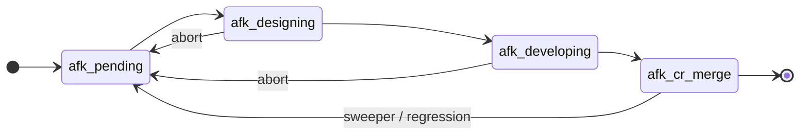

# ADR-0002 — Phase represented by mutually-exclusive labels (not Projects v2 Status)

> Status: Accepted
> Date: 2026-05-10
> Layer: L4 (cross-cutting), implications at L5 (aggregate lifecycle)
> Context ticket: github-backend (tasks folder)

## Context

GitHub Issues natively expose only `open`/`closed` plus `state_reason` (`completed`/`not_planned`/`duplicate`/`reopened`/`null`); see https://docs.github.com/en/rest/issues/issues. AFK needs a 4-phase workflow on each parent and sub-issue (`pending` → `designing` → `developing` → `cr-merge`) mirroring the Jira `Dev-Pending`/`Dev-Designing`/`Dev-Developing`/`Dev-CR/Merge` sequence. SDD §6 lists the invariant "at most one `afk:*` label on any issue at any time"; this ADR records why labels carry the phase.

Forces:

- Phases must be queryable cheaply at queue-discovery time (a single search call).
- Phases must be readable by humans without leaving the issue page.
- Setup cost per repo must be near-zero — the user trials AFK on personal repos opportunistically.
- Phase transitions must be implementable atomically at the API level (no observable two-phase mid-state).

## Decision

Phase is encoded as a **mutually-exclusive label set** — `afk:pending`, `afk:designing`, `afk:developing`, `afk:cr-merge` — applied to both parent issues and sub-issues. Transitions are implemented as a single `gh issue edit --remove-label afk:pending,afk:designing,afk:developing,afk:cr-merge --add-label afk:{new}` call, then verified by a follow-up read (recovery posture in ADR-0004). Queue discovery filters `label:afk-agents label:afk:pending`.

*Caption: linear forward path with abort/sweeper paths back to `pending`; terminal closes via `state_reason=completed`.*

## Alternatives Considered

| Alternative | Pros | Cons | Reason rejected |
|-------------|------|------|-----------------|
| **A — GitHub Projects v2 single-select Status field** | Most idiomatic; supports custom fields, views; native UI rendering | GraphQL-only; per-repo project provisioning; users must set up board before AFK works | Setup cost wrong for "trial AFK on a personal repo today" |
| **B (chosen) — Mutually-exclusive labels** | Zero per-repo setup; REST one-call edit + read; queryable via `gh search`; visible in default issue UI | A buggy run could leave 0 or >1 labels; needs verify-after-write + sweeper (ADR-0004 / 0005) | Trade-off accepted; recovery is mechanical |
| **C — Open + `state_reason` on close only** | Simplest | Loses all mid-flight phase info; loses "in-progress priority" rule from PRD | Drops too much workflow signal |
| **D — Milestones per phase** | GitHub-native | Milestones model releases, not state; awkward semantics | Mis-uses the primitive |

## Consequences

- **Positive** — Zero per-repo setup. Compatible with `gh search` queue scan. Phase visible in stock issue UI. Same label-vocabulary mental model regardless of repo.
- **Negative** — Label state can drift (zero labels after partial-write; multi-label after concurrent edit). Mitigated by the verify-after-write retry (ADR-0004) and pre-flight sweeper (ADR-0005). Adds 4 labels to every AFK-eligible repo (created on first use; out-of-scope to delete on uninstall).
- **Follow-ups** — `prd-to-subtasks` must ensure the 4 labels exist in target repo (`gh label create --force`). Out of scope: GitHub Projects v2 integration as an alternative phase representation; if a future user wants Projects-based reporting, that's a new ADR.
