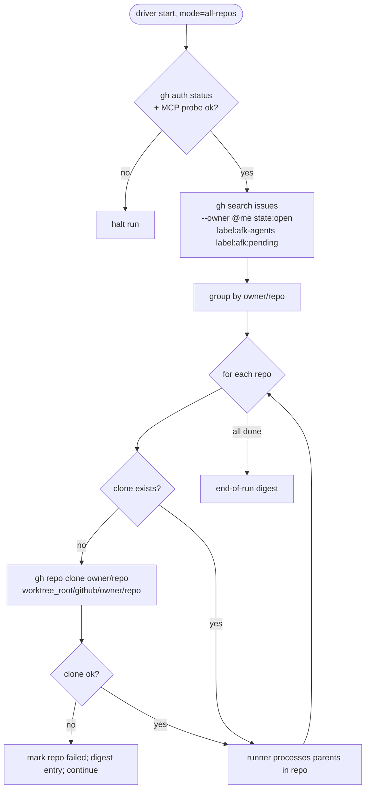

# ADR-0003 — Multi-repo queue discovery via `gh search`; auto-clone on first encounter

> Status: Accepted
> Date: 2026-05-10
> Layer: L2 (boundary) + L4 (cross-cutting / failure-isolation)
> Context ticket: github-backend (tasks folder)

## Context

The Jira+GitLab backend assumes one repository per AFK run (the cwd worktree). On GitHub, the user wants to drain queues across many small personal repos overnight without invoking the driver inside each repo. SDD §7 (use-case 1) and the per-repo skip-on-error rule in §5 depend on this discovery model.

Forces:

- The user's GitHub queue is sparse and spans many repos; running once per repo is unacceptable ergonomics.
- Some queued issues will live in repos not yet cloned locally (a fresh laptop, a repo created today on github.com).
- Auth-level failures (expired token) should halt the whole run; per-repo failures (clone timeout, broken remote) should isolate.
- `gh search issues` is rate-limited (30/min on the search-API tier) but per-call cheap.

## Decision

When `[github] mode = "all-repos"`, the driver opens with a single `gh search issues --owner @me state:open label:afk-agents label:afk:pending` call to discover the queue. Results are grouped by repo; repos absent from `worktree_root/github/{owner}/{repo}/` are auto-cloned via `gh repo clone` before any per-parent work. Per-repo failures (clone-fail, missing default branch) skip that repo and continue; auth-level failures halt the run.

*Caption: discovery is one search call; per-repo clone failures isolate; auth failures halt the entire pass.*

## Alternatives Considered

| Alternative | Pros | Cons | Reason rejected |
|-------------|------|------|-----------------|
| **A — Single-repo only (cwd)** | Simplest; mirrors Jira+GitLab | User must `cd` into each repo and re-invoke; defeats "drain overnight" | Ergonomics fail — the user explicitly rejected this in grilling |
| **B (chosen) — `gh search` discovery + auto-clone on first encounter** | Single command for the user; new repos pick up automatically | Auto-clone has bandwidth + disk cost; first-encounter latency for big repos | Trade-off accepted; clone is one-time per repo |
| **C — Pre-clone list in config** | Explicit; no surprise clones | User must register every repo in config; queue items in unregistered repos silently skip | Silent skips violate "AFK never silently drops work" |
| **D — All repos under user account scanned via `gh repo list`** | No need to maintain a list | Quadratic search (each repo's issues scanned separately); slow on large accounts | `gh search issues --owner @me` is the right primitive |

## Consequences

- **Positive** — User runs `afk-driver` once and the queue is drained across all owned repos. New repos (created after install) need no driver-side registration. Per-repo failure isolation matches the existing per-parent isolation model.
- **Negative** — Auto-clone consumes disk + bandwidth on first encounter; a repo that was renamed/deleted on github.com but still appears in a stale search result will fail-clone and skip. Search-API rate (30/min) caps how often pre-flight can re-query in a single run (≤ 2 calls/run is fine). Clone timeout is generous (120 s) to accommodate large repos but extends worst-case startup.
- **Follow-ups** — Out of scope: cross-org repos (PRD), org repos the user is a member of but doesn't own, `gh repo sync` of stale clones (currently relies on `git fetch` inside per-parent worktree creation).
