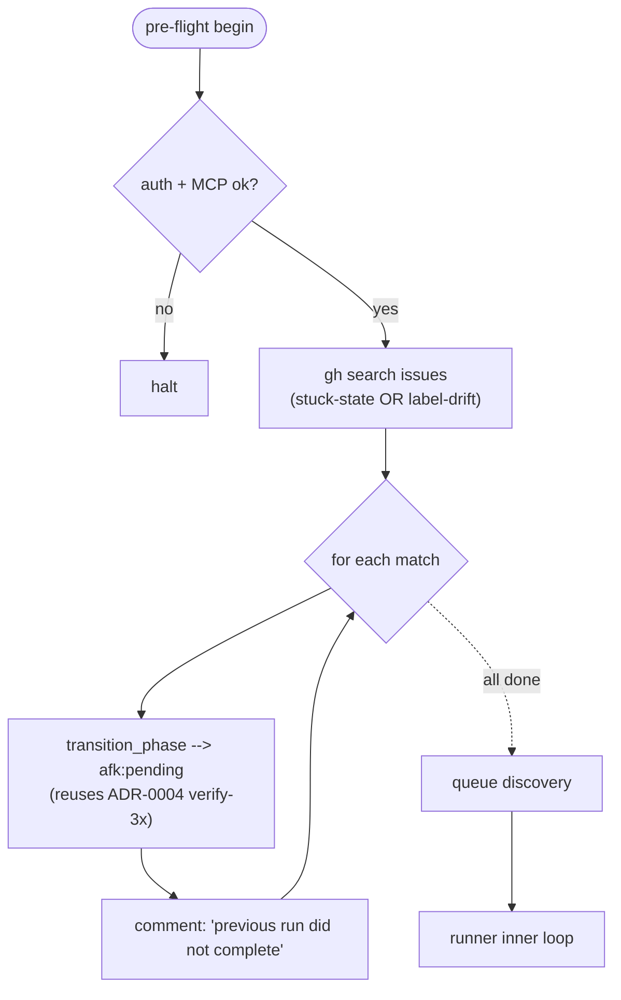

# ADR-0005 — Crash recovery: pre-flight sweeper resets stuck mid-state sub-issues to `afk:pending`

> Status: Accepted
> Date: 2026-05-10
> Layer: L6 (process / recovery)
> Context ticket: github-backend (tasks folder)

## Context

A run that crashes between transitions (driver process killed, laptop reboot, network partition during the verify-read of ADR-0004) leaves sub-issues stuck at `afk:designing` or `afk:developing`. Without recovery, those sub-issues are invisible to the next queue scan (which filters `afk:pending`). SDD §7 use-case 3 names the sweeper; this ADR records the recovery posture and rejects the inferred-state alternative.

Forces:

- AFK runs unattended; the user wakes up to consequences. Silent stuck issues = silent dropped work.
- Inferring "is this in-flight or stale?" from external state (PR contents, commit log) is fragile and adds bug surface.
- The simplest reset (back to `afk:pending`) loses any mid-edit Claude work, but committed work is preserved by git.
- Auto-advance (e.g. "if commits exist, advance to `afk:cr-merge`") would require the runner to reason about whose commits, on which branch, for which sub-issue — multi-step inference each step of which can be wrong.

## Decision

At pre-flight (after auth and before queue discovery), the sweeper queries `gh search issues label:afk:designing OR label:afk:developing OR label:afk:cr-merge assignee:@me` and, for each match: removes the stuck `afk:*` label, adds `afk:pending`, and posts a comment ("AFK: previous run did not complete; reset to `afk:pending` for re-pickup"). The sweeper also catches issues with **zero** or **>1** `afk:*` labels (per ADR-0002 / ADR-0004 drift), normalising to `afk:pending`. Sweeper actions are summarised at the top of the morning digest.

*Caption: sweeper runs once at pre-flight; reuses the same verify-after-write transition machinery as in-flight transitions.*

## Alternatives Considered

| Alternative | Pros | Cons | Reason rejected |
|-------------|------|------|-----------------|
| **A — Skip stuck issues, require manual fix** | Most conservative; never overwrites human-set labels | User wakes up to invisible queue; manual cleanup per issue | Violates "AFK never silently drops work" |
| **B — Auto-advance based on commits / PR state** | Best case: zero work lost on crash | Inference is N-step; each step is a bug surface; "whose commits, which branch" is ambiguous in multi-sub-issue parents | Inference complexity > recovery value |
| **C (chosen) — Reset to `afk:pending` + comment** | Simple; deterministic; no inference; reuses transition machinery | Loses uncommitted Claude work; sub-issue re-runs from scratch | Acceptable: committed work preserved by git; uncommitted is genuinely lost on crash |
| **D — Halt run with diagnostic on first stuck issue** | Loud; forces user attention | Blocks queue until manual intervention; defeats overnight model | Wrong default; halt-on-stuck removes the reason AFK exists |

## Consequences

- **Positive** — Crashes self-recover at next run start. No manual cleanup required. Sweeper logic is identical to normal phase transitions (ADR-0004), so no new code paths to test. Sweeper warnings surface in the digest, so the user sees that something happened the prior night.
- **Negative** — A sub-issue that crashed mid-`developing` re-runs from `pending` next time, redoing work. If a sub-issue genuinely takes longer than the wall-clock cap (1 h) on first run, it will likely time out again; the user must re-scope or split. The sweeper consumes search-API budget at every pre-flight (1–2 calls/run, well within tier).
- **Follow-ups** — Out of scope: a "resume from last commit" mode that re-uses partial Claude work. Out of scope: a sweeper for the Jira backend (currently relies on the `Dev-Pending` re-pickup rule in `runner._producer_is_locked`).
