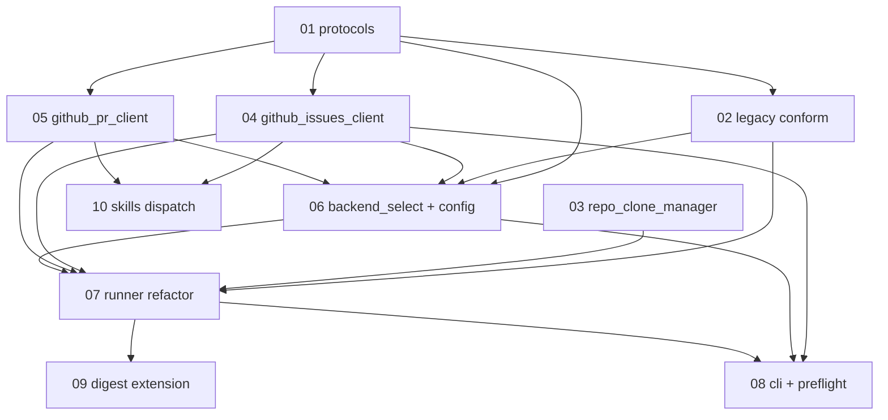

# SubTask slice — AFK GitHub Backend

> Mode: **uncited-mode-but-cited-citations** — written as cited (each SubTask points at SDD/ADR), but materialised as local Markdown drafts because there is no Jira parent ticket for this meta-tooling work. Create tickets manually from these drafts when ready, or feed them into the AFK driver once the GitHub backend is shipped.
>
> Parent PRD: `../PRD.md`
> Parent SDD: `../SDD.md`
> ADRs: `../adr/0001-0005`

## Slice (10 SubTasks)

| # | File | Goal (one line) | Blocked by |
|---|------|-----------------|------------|
| 01 | [01-protocols.md](01-protocols.md) | Declare `IssueTracker` + `Scm` Protocols (pure types, no I/O) | — |
| 02 | [02-legacy-adapters-conform.md](02-legacy-adapters-conform.md) | `JiraClient` + `GitLabClient` formally conform to the Protocols | 01 |
| 03 | [03-repo-clone-manager.md](03-repo-clone-manager.md) | Idempotent `gh repo clone` wrapper for multi-repo GitHub mode | — |
| 04 | [04-github-issues-client.md](04-github-issues-client.md) | `IssueTracker` impl via `gh` CLI + `gh api`; verify-after-write phase transitions | 01 |
| 05 | [05-github-pr-client.md](05-github-pr-client.md) | `Scm` impl via `gh` CLI; idempotent Draft PR + body splice + `Closes #N` | 01 |
| 06 | [06-backend-select-and-config.md](06-backend-select-and-config.md) | Composition-root factory + `[github]` section + per-repo `.afk-driver.toml` | 01, 02, 04, 05 |
| 07 | [07-runner-refactor.md](07-runner-refactor.md) | `runner` depends on Protocols; per-(repo, parent) outer loop; per-repo isolation | 02, 03, 04, 05, 06 |
| 08 | [08-cli-and-preflight.md](08-cli-and-preflight.md) | Backend dispatch + `--github-all-repos` flag + per-backend pre-flight + sweeper | 04, 06, 07 |
| 09 | [09-digest-writer-extension.md](09-digest-writer-extension.md) | `backend` + `repo` columns; sweeper-warnings block; unified file across backends | 07 |
| 10 | [10-skills-backend-dispatch.md](10-skills-backend-dispatch.md) | Add backend-detection preambles to `to-prd` / `prd-to-subtasks` / `afk-go` | 04, 05 |

## Dependency DAG

## Implementation order (topological)

1. **Foundations (parallelisable)** — 01, 03 can land in any order; both unblock the rest.
2. **Adapters (parallelisable after 01)** — 02, 04, 05 are independent of each other.
3. **Composition** — 06 needs 01 + 02 + 04 + 05.
4. **Runner** — 07 needs 02, 03, 04, 05, 06.
5. **Entrypoint + observability** — 08 + 09 in parallel after 07.
6. **Skills** — 10 needs 04 + 05 (semantic refs only) and can land after they exist.

Critical path: `01 → 04 → 06 → 07 → 08`.

## How to use this slice

- **If creating Jira SubTasks:** copy each file's body into a Jira SubTask description under your chosen parent Enhancement, set the `afk-agents` label, leave the SubTask in `Creating` for review, then transition to `Dev-Pending` to make it AFK-pickable.
- **If creating GitHub sub-issues (once the GitHub backend is shipped):** copy each body into a GitHub sub-issue under your parent issue, apply labels `afk-agents` + `afk:pending`, ensure the parent has a `target:{branch}` label.
- **If hand-implementing:** work the SubTasks in the topological order above. Each `## Acceptance` block is the binding contract; each `## Produces` block is the consumer-visible artifact future sessions will grep for.
